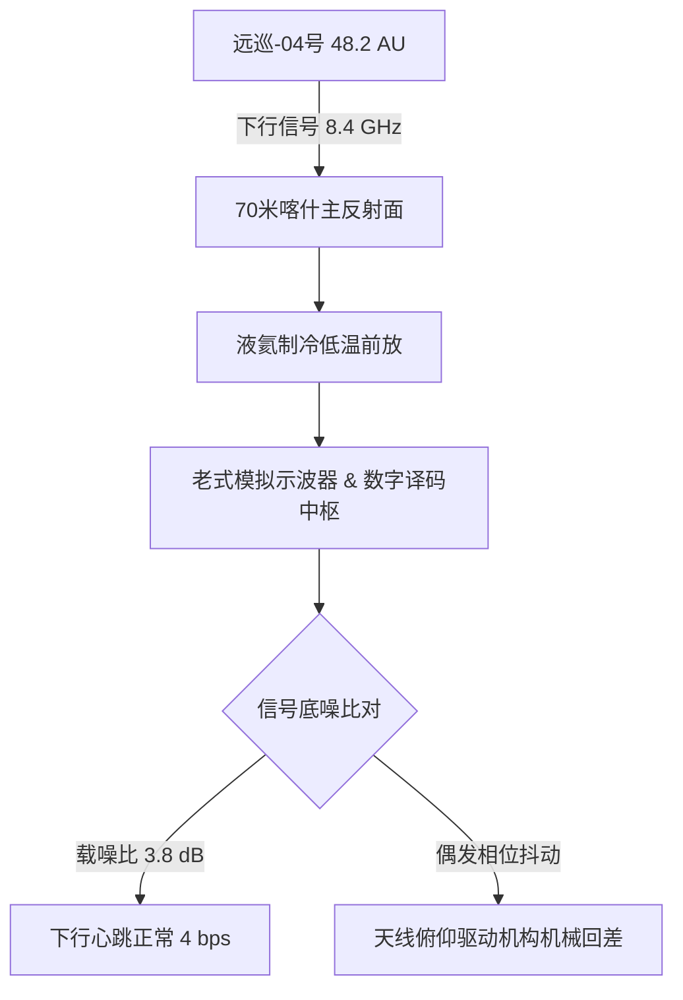

# 远巡-04号深空探测器地面值守站第28号交接班手记与老式示波器波形留存抄件

**记录人**：喀什深空测控二站 深空通道丙班值班技师 李建国  
**交接对象**：丁班值班员 孙小鹏  
**值班时段**：2047年08月29日 20:00 — 2047年08月30日 08:00（UTC+8）  
**受控载荷**：外太阳系「远巡-04」号柯伊伯带纵深探测器（距地标称距离：$48.2 \text{ AU}$，单向光时延：$6 \text{小时} 41 \text{分} 12 \text{秒}$）  
**机房环境**：天山南麓地下浅埋机房 / 气温 18℃ / 相对湿度 35% / 70米抛物面天线主中频通道  

---

## 一、值班日志与通道状态抄录



### 1. 遥测信号跟踪纪实
- **01:24:08**：捕获远巡-04号星载 X 波段（8.412 GHz）下行载波。多普勒频移偏移量为 $+12.4 \text{ kHz}$，符合轨道摄动预报值。
- **03:42:19**：接收到探测器穿越柯伊伯带 2041-XB3 小天体外围尘埃环的第 16 批星尘气凝胶阻抗遥测。阻抗曲线在第三象限出现 $0.12 \,\Omega$ 微小阶跃，确认捕获微粒 1 颗。
- **05:10:00**：上行发送姿控推力微调指令包（校验码：`0x7F2A`）。预计将于今日上午 11:51:12 抵达星载计算机。

---

## 二、值班员手记（非正式备忘）

> 又是后半夜。
> 
> 机房里的两台抽湿机老是共振，嗡嗡的动静听了十几年，停下来反而觉得耳鸣。
> 
> 示波器屏幕上那个绿莹莹的光点每隔四秒钟慢吞吞跳一下。那就是远巡-04的心跳。四十几年前老周（周远）他们从地表造船厂转岗走的时候，第一批探测器还在图纸上画龙骨呢。现在这台铁疙瘩已经跑到快 50 个天文单位外头了。那边是真冷啊，太阳在那头看过去也就是个亮堂点儿的星星，一点儿温度都没有。
> 
> 信号走单程要小七个小时。我在这头按下一个键，等它在深空里执行完再把回执发回来，得整整等大半天。有时候坐在控制台前盯着示波器发呆，总觉得不是我在监视它，是它在四十几个天文单位外头那片死寂里，用一根细得看不见的光线吊着我。
> 
> 操纵台右手边抽屉里放着那把老式的 **47号钛合金防磁梅花扳手**。当年长兴岛船坞分流时老周塞给我的，上面被他用电烙铁刻了整整 47 道细横杠（说是当年在月面组装平台每值完一个月就划一道）。扳手把手都磨亮了，现在天线俯仰机微调电位器滑丝的时候，还得靠它去机架底下手动卡位。这年头机器全都自持巡检了，可老工件摸在手里那股沉甸甸的铁腥味，比屏幕上那些自动绿码踏实。
> 
> 孙小鹏接班时记得去天线塔基下头看一眼 4 号减速箱的润滑油温。夜里戈壁滩降温快，油稠了天线跟踪就会微抖，示波器上的谱线一毛躁就是那儿的事。

---

## 三、示波器波形留存抄件（手工拓印）

```
[示波器荧光屏波形拓印记号]
偏转灵敏度: 5 mV/div   扫描时基: 50 ms/div
─────────────────────────────────────────────
           ▲
           │          ╭───╮
基线 0V ───┼──────────╯   ╰─────────── (载波脉冲 4.2 dB)
           │      ▲
           │      │ 偶发毛刺(天线风载扰动)
           └──────────────────────────► 时间轴 t
─────────────────────────────────────────────
注：04:18:22 偶发波形畸变已通过手动调节高频衰减器归零。
```

---

**交班人**：李建国（签字）  
**接班人**：孙小鹏（签字）  
**机房签认**：2047年08月30日 07:55（UTC+8）
