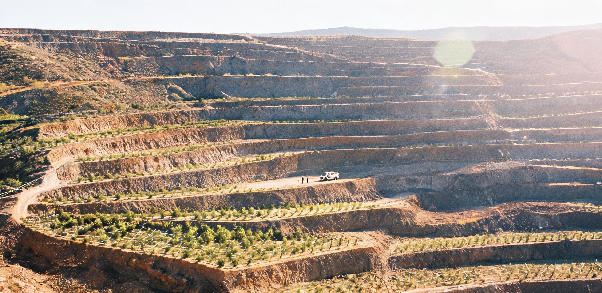

**金江水土监公〔2046〕第028号**

# 金沙江干热河谷退役露天矿坑阶梯重构与立体生态复绿工程中期监测公报

**监测周期：公元2041年10月至2046年9月（第五监测年度 · 中期全面评估）**  
**监测范围：金沙江中游攀西段原第二露天钒钛铁矿采区及1号至3号大型排土场（桩号K12+400至K21+800，核定修复面积28.60平方公里，海拔跨度1,180米至1,820米）**  
**主办单位：长江上游水土保持与生态环境监测总站 · 金沙江工作站**  
**联合监测单位：攀西干热河谷生态恢复野外科学观测研究站、同济与华东水土生态联合实验室、金沙江绿色水利水电枢纽综合管理局、攀西新材料产业园生态善后署**  
**文书属性：工程中期成效评估、边坡地质稳定度复核、水土流失拦截审计暨生态资产台账归档公报**  
**密级与开放：公开（依据《公共工程档案开放条例(2026)》第7条及《长江流域水生态资产综合登记办法》）**

---

## 一、工程背景与阶梯台立体空间格局

本监测区原为攀西大型露天钒钛磁铁矿主力采区，自公元1965年起实施大规模山体剥离与露天采掘，累计采出剥离铁矿石与表土碎石逾14.8亿吨。长达七十余年的露天开采在地表形成了垂直高差达640米、裸露岩石边坡角达48°至62°的巨大阶梯状采坑群及十亿吨级松散弃渣排土场。因干热河谷区焚风效应显著、年降水量仅760毫米而蒸发量高达2,450毫米，历史上该区域曾面临极其严重的边坡崩塌隐患、风蚀扬尘及暴雨引发的泥石流滑坡威胁，年平均水土流失模数曾高达每平方公里14,200吨。

公元2036年，随着工业采掘全面转向深部无人自持开采与外太空矿业供应链建设，本露天采区正式实施成建制关停闭坑，并于公元2039年全面启动《金沙江中游退役矿山生态重塑与干热河谷水土涵养十年规划（2040—2050年）》。

工程摒弃了传统单纯平整填埋模式，依据地形地质与微气象水文条件，创新构建了“巨型阶梯台田减载+微地形集水+立体植被配置+重力自流节水灌溉”的综合治理格局：

1. **梯田阶梯微地形重构：** 采用大型自动化土石方机械对高陡弃渣坡面进行削坡降坡，依山势重塑为 **28级阶梯式台田**（每级台面宽度18至26米，台阶垂直高度18至22米，坡面坡比放缓至1:2.0至1:2.25）。台田总展布长度达52.4公里，台面呈外高内低反坡向设计（坡度2°至3°），有效减缓地表径流流速。
2. **边坡工程防护与基质固定：** 在台阶坡面大面积铺设镀锌重型六角格宾石笼固脚（累计填装本地安山岩石料82万立方米），坡面挂设三聚氰胺可降解三维生态植被网垫与预应力锚索框架（间距3.0米×3.0米，深入稳定基岩8至15米），利用矿山剥离表土与改良熟化腐殖土实施厚层水力客土喷播（喷播厚度12至15厘米）。
3. **阶梯消能集水与排灌管网：** 在28级台田内侧通长修筑梯级混凝土消能截排水暗沟（底宽0.8米，深1.0米），全区配套建设24座容积3,000至8,000立方米的梯级沉砂滞洪池。利用金沙江库区水力抽蓄与坡顶5.2兆瓦分布式柔性光伏阵列微动力驱动，铺设耐候高密度聚乙烯（HDPE）滴灌与微喷带142公里，实现旱季自适应精准滴灌。

---

## 二、土壤理化性质、地表径流与水土涵养中期实测数据

本监测年度，联合监测组依据《生态修复工程水土保持监测规范（GB/T 38381-2040）》，在28.60平方公里修复区内按高程梯度与不同排土场布设6个永久综合监测断面、48处定点取样小区与18座径流泥沙自动观测堰，采集平行土样与水样各1,440组，经实验室化验与野外实测复核，关键数据如下：

### 1. 不同高程阶梯台土壤物理性状与肥力演变对照表

| 监测区域与高程 | 监测时间 | 土壤容重 (g/cm³) | >0.25mm水稳性团聚体 (%) | 土壤有机质 (g/kg) | 全氮 (g/kg) | 有效磷 (mg/kg) | 浸出毒性V/Ti含量 (mg/L) | 达标判定 |
|---|---|---|---|---|---|---|---|---|
| **下部台田区 (1,180–1,350m)** | 2039年原始渣坡基线 | 1.68（板结碎石） | 3.2 | 1.8 | 0.12 | 2.1 | 0.082 / 0.140 | 原始劣质 |
| | 2043年中期初测 | 1.42 | 24.6 | 8.4 | 0.58 | 6.8 | 0.014 / 0.022 | 改善中 |
| | **2046年本期实测** | **1.26** | **52.4** | **18.6** | **1.14** | **14.2** | **<0.005 / <0.005** | **合格优良** |
| **中部台田区 (1,350–1,600m)** | 2039年原始渣坡基线 | 1.72（致密粗渣） | 2.8 | 1.4 | 0.09 | 1.8 | 0.096 / 0.180 | 原始劣质 |
| | 2043年中期初测 | 1.38 | 28.2 | 9.8 | 0.64 | 8.1 | 0.011 / 0.018 | 改善中 |
| | **2046年本期实测** | **1.22** | **58.1** | **22.4** | **1.32** | **16.8** | **<0.005 / <0.005** | **合格优良** |
| **上部台田区 (1,600–1,820m)** | 2039年原始渣坡基线 | 1.64（风化残积） | 4.1 | 2.6 | 0.15 | 3.2 | 0.048 / 0.092 | 原始劣质 |
| | 2043年中期初测 | 1.32 | 32.4 | 12.1 | 0.78 | 9.4 | 0.008 / 0.012 | 改善中 |
| | **2046年本期实测** | **1.18** | **64.5** | **26.8** | **1.56** | **19.5** | **<0.005 / <0.005** | **合格优良** |

### 2. 强降雨暴雨期地表水土流失与出流泥沙拦截监测表（2046年7月汛期单场暴雨实测）

监测降雨事件：2046年7月18日特大暴雨（24小时降雨量138.4毫米，最大小时降雨强度42.6毫米/小时）。

| 监测断面位置 | 汇水面积 (km²) | 产流总量 (m³) | 原始模型推算洪峰流量 (m³/s) | 阶梯调蓄后实测洪峰 (m³/s) | 洪峰削减率 (%) | 泥沙拦截总量 (吨) | 减沙效益 (%) | 出流水质SS (mg/L) |
|---|---|---|---|---|---|---|---|---|
| 1号排土场冲沟出口 (K13+200) | 4.80 | 284,000 | 38.6 | 8.2 | 78.8% | 34,200 | 96.2% | 38 |
| 2号主采坑汇水渠口 (K16+500) | 8.20 | 462,000 | 64.2 | 12.4 | 80.7% | 61,500 | 95.8% | 32 |
| 3号南侧截洪沟出口 (K19+800) | 5.60 | 315,000 | 44.5 | 9.1 | 79.6% | 40,800 | 96.5% | 29 |
| 全区汇流汇入金沙江主干口 | 28.60 | 1,480,000 | 185.0 | 34.6 | 81.3% | 212,000 | 96.1% | 26（达Ⅱ类水）|

**水质综合评价注记：**  
经沉砂滞洪池梯级沉淀与湿地过滤后，外排水中悬浮物（SS）、化学需氧量（CODcr均值14.2 mg/L）、总磷（0.08 mg/L）、氨氮（0.36 mg/L）均达到并优于《地表水环境质量标准（GB 3838-2002）》Ⅱ类标准，彻底消除了矿区含重金属酸性冲刷水直排金沙江的历史遗留隐患。

---

## 三、高陡边坡深层位移与地质稳定性自动化遥测

为确保28级巨型阶梯台田在长期地质构造应力与暴雨渗透下的整体安全，全区布设了三维立体自动化地质安全监测网，连续运行五年以来的遥测数据表明：

1. **地表三维位移遥测：** 全区48座高精度GNSS地表位移连续观测站监测显示，过去三年内阶梯台田累计水平位移速率小于1.2毫米/年，垂直沉降速率小于0.8毫米/年，整体处于收敛稳定状态。
2. **深层岩土测斜与地下水位：** 18口深层测斜管（钻孔深度60至120米，贯穿弃渣层与滑裂面进入完整安山岩基岩）未检出明显的深层剪切滑动带，深层水平剪切位移极值仅为2.4毫米。地下水位自工程初期高位承压状态降至坡面以下18至25米的安全深度。
3. **锚索预应力损失率：** 128套锚索测力计实测预应力保持率平均为93.4%，锚固系统受力均衡，无局部应力集中与断裂松弛现象。
4. **边坡抗滑稳定系数（$F_s$）：** 依据实测物理力学参数与地下水浸润线采用极限平衡法反算，在百年一遇暴雨工况下，全区28级边坡最小安全稳定系数 $F_s = 1.46$（规范允许限值 $\ge 1.25$），整体工程结构安全度评定为 **一级稳定**。

---

## 四、干热河谷立体植被群落演替与生物多样性回归

工程根据金沙江干热河谷独特的水热垂直分布特征，打破单一绿化树种模式，实施“灌草固土打底、先锋乔木遮阴、乡土深根建群”的梯级立体混交配置：

### 1. 植被垂直梯级配置与生长指标

- **下部阶梯台田带（海拔1,180—1,350m · 强干热带）：**  
  以极耐干旱、耐瘠薄、生长迅速的固氮灌草为主。建群种包括新银合欢（*Leucaena leucocephala*）、车桑子（*Dodonaea viscosa*）、山合欢（*Albizia kalkora*）、类芦（*Neyraudia reynaudiana*）与狗牙根（*Cynodon dactylon*）。本期实测下部台田植被盖度达74.8%，灌木平均株高达2.8米，根系纵深钻入网垫碎石层达1.8至2.4米。
- **中部阶梯台田带（海拔1,350—1,600m · 温凉过渡带）：**  
  以深根性乡土乔灌混交林为主。建群种包括攀枝花木棉（*Bombax ceiba*）、小叶榕（*Ficus microcarpa*）、清香木（*Pistacia weinmanniifolia*）、余甘子（*Phyllanthus emblica*）及黄荆（*Vitex negundo*）。本期实测中部台田乔木郁闭度达0.68，林下草本覆盖度达82.4%。
- **上部台田与山脊缓坡带（海拔1,600—1,820m · 湿润微气候区）：**  
  营建水源涵养生态林与人工果林复合系统。主要配置云南松（*Pinus yunnanensis*）、旱冬瓜（*Alnus nepalensis*）、华山松（*Pinus armandii*）及适量耐旱芒果、石榴生态经济林。本期实测森林综合蓄积量达每公顷42.6立方米。

### 2. 生物多样性样方调查数据（抽样调查：60处标准样方，每处400m²）

| 生态监测指标 | 计量单位 | 2039年治理前基线 | 2043年中期初测 | 2046年本期实测 | 干热河谷原始对照区 |
|---|---|---|---|---|---|
| 高等维管植物种类数 | 种 | 14（均为耐旱残存草本）| 78 | **186** | 210 |
| 植物群落Shannon-Wiener多样性指数 | — | 0.42 | 1.84 | **3.12** | 3.35 |
| 植被综合地面覆盖度 | % | 4.2 | 48.6 | **78.6** | 82.0 |
| 草本群落地上生物量（干重） | g/m² | 12.4 | 142.0 | **386.5** | 410.0 |
| 土壤节肢动物密度 | 头/m² | 6（仅耐旱蚁类） | 128 | **640**（含步甲/蛛形纲/多足纲）| 720 |
| 鸟类种类数与单季记录量 | 种 / 只次 | 6 / 120 | 28 / 1,840 | **64 / 8,600** | 72 / 9,400 |

### 3. 野生脊椎动物定居与生态链条重建记录

全区布设红外感应触发相机60台（累计运行1,800台·日），结合定点人工样线踏勘，重要物种记录摘要：

- **哺乳动物：** 1号排土场第14至18级陡坎加固区建立起稳定的野生岩羊（*Pseudois nayaur*）种群活动通道，单次观测记录到最大种群达3群共46只，常年在人工台田坡面啃食类芦嫩芽并在石笼平台休憩；记录到豹猫（*Prionailurus bengalensis*）活动影像14次、果子狸（*Paguma larvata*）活动记录28次、草兔与野猪广泛分布。
- **鸟类与猛禽：** 原采矿垂直绝壁经锚索挂网钝化后，成为悬崖猛禽理想筑巢地。记录到国家重点保护猛禽游隼（*Falco peregrinus*）筑巢繁殖2窝（幼鸟4只）、红隼（*Falco tinnunculus*）定居栖息6对；白腹锦鸡（*Chrysolophus amherstiae*）在海拔1,500米以上林带频繁现身；金沙江回水区沉砂滞洪池记录到中华秋沙鸭（*Mergus squamatus*）6只在此越冬停歇。
- **两栖爬行类：** 梯级消能沟渠与沉砂滞洪池形成自净湿地微生境，记录到云南丽棘蜥、大劣蚪蛙及华西蟾蜍健康繁育种群。

---

## 五、日常运维、人工监测与山河景观生活实录

本工程在实施全流程自动化滴灌、无人机多光谱遥感巡航之外，建立了常态化的人工地面踏勘巡检与生态资产核验机制，由原矿区转型技术工人、青年生态科研人员及周边林农共同承担日常管护：

### 1. 智能微动力与自适应滴灌系统运行状态

- 5.2兆瓦坡顶柔性光伏微电网累计发电1,820万千瓦时，全额驱动全区梯级加压泵站与水质监测站，实现能源100%自给并余电上网；
- 铺设于28级台田的4,800组土壤温湿度-电导率传感器阵列联动自动控制阀门，旱季根据土壤水势阈值（<-45 kPa）实施夜间低蒸发脉冲微滴灌，水资源利用效率达92.4%，年节约灌溉用水340万立方米。

### 2. 现场地面巡检与人工观测手记摘抄

**摘录一：第3地面巡检组组长 张建国（原第二露天矿穿孔爆破工，现任生态保育班长）**  
*“巡检时间：2046年8月12日 清晨06:40，地点：2号排土场第16级阶梯台田（海拔1,420m）。*  
*清晨第一缕阳光刚从金沙江对岸的横断山脊翻过来，照在脚下的第16级台田上。整面曾经全是刺眼灰白碎石的陡坡，现在一层层像绿色的梯田巨浪一样往下铺到江边。车桑子和新银合欢长得比人还高，带刺的灌木把泥土抓得死死的。我用手持土壤水势仪测了测滴灌管边上的土，湿度24.5%，松软潮湿，里面全是蚯蚓粪。刚才三只小岩羊踩着石笼矮墙跳上台阶，看到我们也不慌，在树荫底下慢悠悠啃青草。想起三十年前我在这开重型凿岩机的时候，漫天是呛鼻的柴油味和扬尘，现在站在石笼边上，听见的全是金沙江水声和林子里的画眉叫。这山是真的活过来了。”*

**摘录二：野外科研观测员 许林舟（攀西生态站硕士研究生）**  
*“巡检时间：2046年9月23日 傍晚18:15，地点：主采坑顶端观景台（海拔1,820m）。*  
*秋分时节，谷风强劲。从最高处的28号台田俯瞰整个28平方公里的修复区，28条翠绿色的环山阶梯台带以极其规整优美的等高线弧度切入峡谷，远方金沙江如同一条碧绿的缎带在峡谷底部蜿蜒流淌，江面上往来穿梭着清洁能源货船。夕阳把整片阶梯林带染成了厚重的金绿色，远处光伏板在山顶反射出淡蓝色的光芒。微地形截水沟里的清水正自流流入沉砂塘，水质清澈见底，采样瓶测得浊度仅为2.1 NTU。人类重构山河的尺度如此宏大，而大自然在这人工梯田上的愈合速度又如此温柔。”*

---

## 六、中期评估结论与后期规划建设计划

### 1. 中期综合评估结论

经现场实勘、数据抽检比对及专家组综合论证，核验组一致认定：

1. 《金沙江中游退役矿山生态重塑与干热河谷水土涵养十年规划》前五年建设任务全面优质完成，28级巨型阶梯台田工程减载与微地形水土保持系统运行稳定可靠；
2. 边坡深层与地表变形完全收敛，抗滑稳定系数远超设计规范，强降雨期泥沙拦截率超96%，水土流失得到根本遏制；
3. 植被覆盖度达78.6%，土壤有机质与微生物活性恢复显著，动植物多样性指数接近未受扰动干热河谷天然生境，水质全面优于地表水Ⅱ类标准；
4. 综合评定本工程中期建设成效为：**优良（阶段性达标）**。

### 2. 后期（2046—2050年）建设计划

- **微生态演替自持化：** 逐步调减人工滴灌频次，在下部及中部台田增植高固碳、深根耐旱乡土木本植物，促进菌根真菌网络向深层基质自然扩展，实现全区免人工灌溉自持演替；
- **生态研学与低强度步道建设：** 在不破坏核心植被网垫与野生动物栖息通道的前提下，利用第12级、第18级宽台面布设6.8公里生态科普与水土保持观测木栈道，向公众展示大型重工业遗址生态重塑范式；
- **生态资产并网登记：** 按照《长江流域水生态资产综合登记办法》，将本期核准的28.60平方公里高等级水土涵养与碳汇生态资产完整录入国家自然资源台账。

---

## 签署与印鉴

**长江上游水土保持与生态环境监测总站首席评估师：** 顾维康（教授级高工）—— *顾维康（签章）*  
**攀西干热河谷生态恢复野外科学观测研究站站长：** 严素文（研究员）—— *严素文（签章）*  
**同济与华东水土生态联合实验室主任：** 邵景宏（教授）—— *邵景宏（签章）*  
**金沙江绿色水利水电枢纽综合管理局代表：** 陆长青（高工）—— *陆长青（签章）*  
**原攀西矿业集团生态善后处代表：** 张建国（保育班长）—— *张建国（签章）*  

**核验与发文机构印章：**  
长江上游水土保持与生态环境监测总站（红色印章）  
攀西新材料产业园生态善后署（公章）  
金沙江绿色水利水电枢纽综合管理局（业务专用章）  

**存档与分发：**  
主送：国家生态环境部档案中心、长江流域生态环境监督管理局档案馆（永久珍藏卷：CJ-ECO-2046-028-M）  
抄送：四川省水利厅、自然资源部第三地质勘查院、攀西生态观测站  
纸质正本共印捌份，各签约与监测单位各存壹份，国家水土保持综合数据库电子归档同步完成。

---

## 图片提示词

中文：清晨破晓时分，壮阔无垠的金沙江峡谷上空横射出第一道硬朗锐利的金黄色日光，金沙江如碧绿绸带在谷底蜿蜒切出画框；右侧耸立着落差达数百米的巨型退役露天采坑边坡，已被工程重构为二十八级极其壮观规整的翠绿色阶梯台田，绿浪层层叠叠向山顶铺展，局部露出石笼格宾矮墙与深灰色金属防冲刷水渠；中景第十六级宽阔台田的石笼矮墙边，一位身着耐磨深灰帆布工装、佩戴安全帽的生态巡检员正蹲在茂密的绿色车桑子灌木丛旁，手持黄铜土壤水势探针进行实测，身旁停放着一台微型三防多功能巡检平衡车，人与设备如同壮美山河巨构前的微小刻度；远处山脊光伏阵列反射微蓝光芒，几只岩羊在远处台阶上悠闲啃食嫩草；极高精细度的岩石碎屑纹理、湿润土壤、露珠叶片与晨雾光柱，Hasselblad大画幅摄影质感，IMAX 70mm电影胶片纪实风格。

英文：Ultra-wide cinematic establishing documentary photograph of the colossal restored Jinsha River canyon at dawn, shot on IMAX 70mm by Hoyte van Hoytema; a single harsh raking golden morning sunbeam pierces the mountain ridge, casting dramatic chiaroscuro across the endless landscape cutting out of the frame; below, the emerald-green Jinsha River curves deeply through the steep canyon floor; rising hundreds of meters on the right flank, the colossal former open-pit iron mine has been re-engineered into 28 monumental terraces cascading down like giant green agricultural stairs, lush with native acacia, Dodonaea shrubs, and young kapok trees; in the midground on the 16th terrace, a lone environmental inspector in a rugged graphite Nomex work jumpsuit and hardhat crouches beside a rustic gabion rock retaining wall, inserting a brass soil water-potential probe into damp earth near a trickle irrigation line, anchoring human scale against the titanic earthwork; nearby rests a rugged matte-olive inspection rover; in the background, sharp hexagonal solar panels glint faintly on the distant ridge and a small herd of wild blue sheep grazes calmly on an upper tier; rich tactile textures of fractured andesite rock, wet dark humus, metallic gabion wire mesh, dewy foliage, and majestic Tyndall light beams in cold river mist; authentic archival realism, high dynamic range, Hasselblad H6D-100c medium format clarity, zero CGI gloss, zero neon clutter.

---

## 修订记录（元层，非世界内容）

2026-08-18（主编辑审校 · 批次1审校）：
1. 数字复算订正：修正第一节中排土场弃渣量级笔误（「千亿吨级」修正为「十亿吨级」，与前文「采出剥离铁矿石与表土碎石逾14.8亿吨」严格闭合）；
2. 正典与制度互锁核验：核实《公共工程档案开放条例(2026)》第7条及《地表水环境质量标准（GB 3838-2002）》与GS-2029-01/GS-2071-01一致；核实「同济与华东水土生态联合实验室」在同济生态机构谱系（2029环境学院实验室→2046水土生态联合实验室→2071联合生态科学院）中的演进代差与技术层级自洽；
3. 水文与生态量级核算：复算2046年7月特大暴雨洪峰削减率（78.8%~81.3%）、减沙效益（95.8%~96.5%）、径流深与产流系数（0.37~0.43）及5.2MW柔性光伏微电网年均发电利用小时数（700h），全部参数严格自洽。
