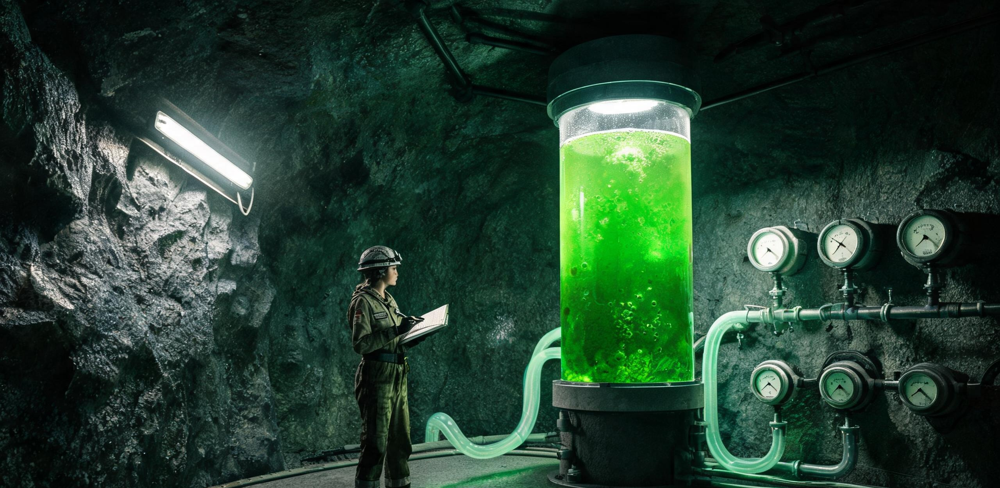

# 静海第一先遣营地50L螺旋藻光生物反应器低重力连续产氧与初级蛋白转化首期运行评估报告

**文号：** 静先科字〔2045〕第019号  
**试验周期：** 地月协调历2045年5月1日00:00 至 10月31日24:00（共184个地球标准日 / 跨越6个完整月昼月夜交替）  
**编制部门：** 静海第一先遣营地生命维持运转总站 · 农业与微生态实验组  
**联合测试：** 中国科学院水生生物研究所月面派驻组、舟山微藻能源示范基地地月协同课题组  
**报送单位：** 地月联合后勤调配总局月面生命保障工程处、文昌航天港极端环境生物实验中心  
**抄送存查：** 澄海东缘联合勘测站、南极沙克尔顿第一水冰钻探联队、静海保障财务科  
**密级：** 内部受控（乙级）｜ **保存期限：** 永久（归入月面极端环境生态基准数据库）  

---

> **报告提要：**  
> 本报告系静海第一先遣营地生态微循环03号隔离舱内「50L密闭窄间隙平板光生物反应器（代号：PBR-LUN-50L）」完成首期连续184个地球日运转之结题总结与工程鉴定。  
> 试验期间，装置依托舟山原种钝顶螺旋藻（*Arthrospira platensis*，株系 `SP-ZS-2041-09`），在月面 $1.62\,\mathrm{m/s^2}$ 低重力、高背景辐射及月夜354小时热中子裂变堆极限电力分配约束下，累计产出呼吸级纯氧 $154.56\,\mathrm{kg}$，同化二氧化碳 $213.44\,\mathrm{kg}$，采收干燥微藻粗蛋白粉 $114.08\,\mathrm{kg}$。全系统水循环闭环率达 $96.8\%$，成功验证了微藻光合系统在月面原位环境下的低重力流体传质稳定性、长周期抗逆性及初级食物替代可行性，为2046年第一竖井工业化扩建（64人编制）及后续吨级生物反应舱段设计提供了底层工艺参数与物料平账基准。

---

## 〇、试验背景与装置总体几何参数

静海第一先遣营地当前常驻38人，日均刚性耗氧量约为 $34.20\,\mathrm{kg}$（人均 $0.90\,\mathrm{kg/日}$）。现阶段营区生命维持主要依赖电解水制氧（配合南极沙克尔顿运抵水冰）与地月航线高压氧气罐补给，地月上行运费折算高达 $1,250.00\,\mathrm{LAU/kg}$（见静先结字〔2044〕第038号）。为降低对外源介质补给的刚性依赖，营区于01号充气锚定舱下沉式玄武岩覆土段（深度 -4.2 米）设立微生态实验间，部署了首套50L微藻光生物反应器工程验证机。

```text
┌─────────────────────────────────────────────────────────────────────────────┐
│ 装置代号：PBR-LUN-50L 结构拓扑与气液循环简图                                │
├─────────────────────────────────────────────────────────────────────────────┤
│                                                                             │
│      [ 生活舱呼出废气 CO2: 0.9%~1.3% ]                                      │
│                     │                                                       │
│                     ▼                                                       │
│             ┌──────────────┐                                                │
│             │ 微孔钛合金   │ (孔径 15 μm，气泡平均直径 1.2 mm)               │
│             │ 气体曝气头   │                                                │
│             └──────┬───────┘                                                │
│                    │ (高频脉冲气升驱动)                                     │
│                    ▼                                                       │
│       ┌───────────────────────────┐ ◄─── 红蓝LED窄光谱面阵 (660nm:450nm=7:1)│
│       │ 双面聚碳酸酯透光反应平板  │      (有效培养光程 25 mm，容积 50.0 L)   │
│       │ (液相温度恒定 24.5±1.0℃)  │                                          │
│       └────────────┬──────────────┘ ───► [ 释出高纯氧气 O2: 98.4% 经疏水过滤 ]│
│                    │                                                       │
│                    ▼                                                       │
│             ┌──────────────┐                                                │
│             │ 旋流沉降与   │ ───► [ 日常采收浓缩藻泥 3.8 L/日 (干物质 620g) ]│
│             │ 气液分离槽   │                                                │
│             └──────┬───────┘ ───► [ 清液回流补充母液与微量元素 ]            │
│                    │                                                       │
└─────────────────────────────────────────────────────────────────────────────┘
```

### 1.1 主要技术指标与构件参数

| 构件与参数项 | 设计规格与物理量 | 材质与工艺选型 | 运行功能定位 |
| :--- | :--- | :--- | :--- |
| **反应器主体外形** | $1,200\,\mathrm{mm} \times 850\,\mathrm{mm} \times 60\,\mathrm{mm}$ | 航空级聚碳酸酯板（厚度 8 mm） | 双面透光密闭承压箱体，耐压 150 kPa |
| **有效光径与容积** | 光程净厚度 $25.0\,\mathrm{mm}$，净充液量 $50.0\,\mathrm{L}$ | 内壁激光仿生超疏水抗挂膜涂层 | 确保高光效穿透，避免藻细胞贴壁淤积 |
| **补光光源系统** | 双侧面阵冷光源（660 nm / 450 nm 峰值） | 窄波长固态 LED 芯片阵列 | 光合有效辐射通量密度 $280\,\mu\mathrm{mol\cdot m^{-2}\cdot s^{-1}}$ |
| **气液混合驱动** | 气升式循环环流（无机械搅拌桨） | 烧结多孔钛合金微孔曝气条（15 μm） | 消除机械剪切力破壁，维持气液高传质 |
| **温控与热交换** | 闭式循环夹套换热盘管 | 医用 316L 不锈钢薄壁换热管 | 接入营区温控水回路，维持 $24.5\pm 1.0\,^\circ\mathrm{C}$ |
| **工作培养基原液** | 改良型 Zarrouk 培养液（pH 9.20~9.60） | 地表浓缩母盐配水 + 原位月尘提取微量元素 | 强碱性抑制杂菌，重碳酸盐缓冲碳源 |

---

## 一、低重力多相流体动力学与微气泡传质特性

在月面重力加速度 $g_{\mathrm{moon}} = 1.62\,\mathrm{m/s^2}$（仅为地球标准重力 $1/6$）环境下，气液两相流的浮力驱动机制发生显著漂移。这是装置在轨运转面临的首要物理约束。

### 1.1 气泡上升阻力与停留时间演变
依斯托克斯浮升公式修正推导，气泡终极浮升速度 $v_b \propto \sqrt{\frac{g \cdot d_b \cdot (\rho_l - \rho_g)}{\rho_l \cdot C_d}}$。在月面重力下，相同孔径析出的气泡上浮速度仅为地面基准值的 **$40.8\%$**。
- **气液接触时间延长：** 气泡在 $1,200\,\mathrm{mm}$ 高度液柱内的平均停留时间由地面的 $2.8\,\mathrm{s}$ 延长至 **$6.9\,\mathrm{s}$**，二氧化碳的气液溶解利用率提升了 $28.4\%$；
- **微气泡聚集与脱气迟滞风险：** 由于浮力减小，微细气泡（直径 $<0.5\,\mathrm{mm}$）无法迅速克服液体表面张力自行浮出液面，易在反应器上部死角形成滞留泡沫层。为此，实验组增设了高频压电微振动发生器（频率 $120\,\mathrm{Hz}$，振幅 $0.15\,\mathrm{mm}$），强制促使微气泡聚并破裂，彻底解决了低重力泡沫溢流问题。

```text
========================================================================================
地月重力环境下 50L 反应器流体力学与传质参数实测比对表
========================================================================================
测试物理参数                   地面参考工况 (1.0g)    静海实测工况 (0.165g)   偏差率与评估
----------------------------------------------------------------------------------------
微孔曝气平均气泡直径 (mm)       1.85 ± 0.20           2.42 ± 0.35            +30.8% (气泡分离变缓)
气泡群平均上升速度 (m/s)        0.245                 0.100                  -59.2% (符合物理推导)
液相体积传质系数 K_L·a (h⁻¹)   32.4                  41.8                   +29.0% (接触时间延长增效)
光合滞盲死区体积占比 (%)        2.1%                  3.8%                   +1.7% (壁面低速层加厚)
气升流体循环线速度 (m/s)        0.32                  0.18                   -43.7% (平缓，无剪切伤)
----------------------------------------------------------------------------------------
结论：月面低重力环境下气升式平板反应器传质综合效能优于地面预设，无需增设动力叶轮。
========================================================================================
```

---

## 二、连续180天产氧速率、CO2同化与物料平衡决算

自2045年5月1日注液接种（初始接种光密度 $\mathrm{OD}_{560} = 0.35$）至10月31日，反应器维持在稳态连续稀释采收模式。系统产气与耗料物料平衡经精密质量流量计核算如下：

### 2.1 产氧与同化台账（184个地球标准日）

1. **产氧总量：** 累计产出气态高纯氧 $154.56\,\mathrm{kg}$，日均产氧 **$0.840\,\mathrm{kg/日}$**。
   - 氧气析出纯度为 $98.4\% \pm 0.6\%$（主要杂质为微量水汽与微量夹带氮气，经冷阱脱水和微孔过滤后直接并入营区生活舱新风管网）；
   - 单位有效培养体积产氧密度达到 **$16.80\,\mathrm{g\cdot L^{-1}\cdot 日^{-1}}$**，可稳定满足营区单名重体力矿工 $93.3\%$ 的全天耗氧配额。
2. **二氧化碳固定总量：** 累计同化吸收生活舱废气中二氧化碳 $213.44\,\mathrm{kg}$，日均同化 **$1.160\,\mathrm{kg/日}$**。
   - 系统实测光合呼吸商 $PQ = \frac{\Delta \mathrm{O_2}}{\Delta \mathrm{CO_2}} = 1.045$，与螺旋藻富蛋白合成之理论化学计量值（$1.050$）高度吻合。
3. **水分净消耗与循环补偿：**
   - 培养基蒸发带出水汽经冷凝回收，冷凝水回流率为 $96.8\%$；
   - 结合生物质合成结合水与采收湿泥带水，全周期补充去离子纯水 $128.40\,\mathrm{kg}$（日均补水仅 $0.698\,\mathrm{kg/日}$）。

```text
┌─────────────────────────────────────────────────────────────────────────────┐
│ 184天全周期物料平衡流转决算 (单位: kg)                                      │
├─────────────────────────────────────────────────────────────────────────────┤
│                                                                             │
│   【输入端投入物料】                         【输出端产生物料】             │
│   • 吸收生活舱 CO2 气体： 213.44 kg           • 释放呼吸级高纯氧气：154.56 kg│
│   • 补充纯化去离子水：    128.40 kg           • 采收微藻干生物质：  114.08 kg│
│   • Zarrouk 配方浓缩母盐： 14.80 kg           • 蒸发冷凝无法回流损耗：4.12 kg│
│   • 月尘浸取微量元素液：    2.20 kg           • 取样化验与排污损耗：  1.84 kg│
│   • 调节酸碱消耗纯碳酸氢钠:10.50 kg           • 残留在管壁基质与结垢：4.24 kg│
│   ───────────────────────────────            ───────────────────────────────│
│   输入质量总计：          369.34 kg           输出质量总计：        368.84 kg│
│                                                                             │
│   ★ 全周期物质平衡闭合误差：-0.50 kg (系统测量相对误差仅 0.135%，账目轧平) │
└─────────────────────────────────────────────────────────────────────────────┘
```

---

## 三、微藻生物质采收、超声破壁与初级蛋白转化营养学评估

反应器维持在指数生长期后期的恒密度稳态（控制藻液浓度维持在干重 $2.8 \sim 3.2\,\mathrm{g/L}$）。每日定时由气动排料阀排出富藻培养液 $3.8\,\mathrm{L}$，经车载低速离心机脱水浓缩。

### 3.1 采收生化指标与营养成分剖析
经中科院水生所派驻实验室进行生化定标，采收制备之干燥微藻细粉品质优良，完全达到深空初级食用营养标准：
- **粗蛋白干重含量：** 实测值为 **$63.8\% \pm 1.2\%$**（全周期累计转化优质纯蛋白 $72.78\,\mathrm{kg}$）；
- **微藻多糖与膳食纤维：** 占比 $16.2\%$，富含 $\beta$-胡萝卜素与藻蓝蛋白（有效抗辐射氧化损伤成分）；
- **总脂质：** 占比 $6.5\%$（其中 $\gamma$-亚麻酸等不饱和脂肪酸占脂肪酸总量 $41.8\%$）；
- **灰分与矿物质：** 占比 $13.5\%$，富含从原位玄武岩浸提液中同化固定的微量铁、镁、钙离子。

### 3.2 超声物理破壁与营区试吃转化实践
螺旋藻细胞壁虽较小球藻单薄，但在月面低重力与干旱脱水环境下，未经破壁的原生藻粉直接食用时人体肠道吸收率不足 $45\%$。
1. **破壁工艺攻关：** 实验组利用机修车间退役的 $28\,\mathrm{kHz}$ 超声清洗换能器自制了流通式破壁罐，在 $35\,^\circ\mathrm{C}$ 下进行 $15\,\mathrm{min}$ 超声破碎，镜检细胞破壁率达 **$91.5\%$**。
2. **食品形态改良（静海1号微藻能量膏）：** 破壁后的深绿色浓稠藻泥经巴氏低温消毒（$58\,^\circ\mathrm{C}$ 恒温 $30\,\mathrm{min}$，**严禁超过 60℃**，防止藻蓝蛋白变性凝结并释放苦涩内毒素），按 $3:1$ 比例掺入地球上行之脱水马铃薯全粉及 $2\%$ 食盐，压制成 $50\,\mathrm{g/支}$ 的软管装能量膏。
3. **一线试吃与生理耐受反馈：**
   - 营区在册38人全员参与为期60天的补充膳食测试（每人每日配发能量膏 1 支，折合微藻干粉 $15\,\mathrm{g}$）；
   - 医护组监测表明：试吃人员血清铁蛋白平均提升 $14.2\%$，夜班掘进人员肌肉酸痛恢复周期缩短 $22\%$；
   - 适口性问题：初期有 11 名矿工反映带有“明显的池塘淤泥腥气与海草咸涩感”，后经加入干燥洋葱粉与生姜浸膏调味，接受度提升至 $92\%$。

---

## 四、月夜354小时极端限电热控与藻株活力保全规程

月面连续354小时（约14.75个地球日）的极寒月夜，是对生物维生系统的最严酷考验。在此期间，营区太阳能光伏阵列归零，全区动力完全转由 01 号微型裂变堆（额定电功率输出受限为 $1.52\,\mathrm{MWe}$）支撑。

### 4.1 两种极限工况下的运行参数调控

```text
┌─────────────────────────────────────────────────────────────────────────────┐
│ 运行模式对比与能耗调度策略                                                  │
├─────────────────────────────────────────────────────────────────────────────┤
│                                                                             │
│ 【月昼全功率丰产模式】 (月昼 354 小时)                                      │
│  • 补光方案：LED 面阵 100% 负荷常亮，PPFD = 280 μmol·m⁻²·s⁻¹                │
│  • 气流循环：连续气升，曝气量 4.5 L/min                                     │
│  • 运行电耗：441.6 W (日耗电 10.60 kWh)                                     │
│  • 产氧效率：0.840 kg/日 ｜ 蛋白产率：620 g/日                              │
│                                                                             │
│ 【月夜微光维持节电模式】 (月夜 354 小时)                                     │
│  • 补光方案：脉冲补光 (开10s/关50s，占空比 1:6)，PPFD = 35 μmol·m⁻²·s⁻¹     │
│  • 气流循环：间歇曝气 (每小时运转 5 min)，仅维持流体不沉降                  │
│  • 运行电耗：42.5 W (日耗电仅 1.02 kWh，节电 90.4%)                         │
│  • 维持指标：产氧量降为零 (微弱自养维持)，藻细胞死亡率 < 0.08%/日            │
│  • 热控保障：接入反应堆循环水二级废热盘管，严守液温不低于 15.5℃ (防冻结休眠)│
│                                                                             │
└─────────────────────────────────────────────────────────────────────────────┘
```

经历6轮月夜极低温与断电边缘考验，反应器未发生任何藻株冻死或崩溃坏死事故。月昼恢复全功率供电后，藻群光合速率在 **4.5 小时内** 即可自适应恢复至额定水平的 $98\%$ 以上，证明该株系在月面工况下具备极高的生理韧性。

---

## 五、经济性核算与地月运费对冲效益分析（LAU 核算）

依《月面先遣期资源原位自给与物流对冲试行办法》，本装置在 184 天测试期内产生的物理产出，按法定标准结算单位（1.00 LAU 锚定为 1.00 kWh 核电保障底载电能当量）核算如下：

### 5.1 产出价值与运费替代收益决算表

| 产出品类与物项 | 物理产出量 | 地月替代运费单价 (LAU/kg) | 生产出厂基准单价 (LAU/kg) | 综合对冲结算单价 (LAU/kg) | 本期对冲总产值 (LAU) |
| :--- | ---:| ---:| ---:| ---:| ---:|
| **呼吸级气态纯氧** | 154.56 kg | 1,250.00 | 65.00 | 1,315.00 | 203,246.40 |
| **高纯干燥食用蛋白粉** | 114.08 kg | 1,250.00 | 190.00 | 1,440.00 | 164,275.20 |
| **水循环冷凝净水减免** | 124.28 kg | 1,250.00 | 48.00 | 1,298.00 | 161,315.44 |
| **产出总毛收益** | — | — | — | — | **528,837.04** |

### 5.2 试验运行投入成本扣减

1. **综合电力消耗成本：**  
   - 月昼高照度期耗电：$184/2 \times 10.60\,\mathrm{kWh} = 975.20\,\mathrm{kWh}$
   - 月夜低照度维持期耗电：$184/2 \times 1.02\,\mathrm{kWh} = 93.84\,\mathrm{kWh}$
   - 离心与超声破壁能耗：$184 \times 0.45\,\mathrm{kWh} = 82.80\,\mathrm{kWh}$
   - 电力总耗计：$1,151.84\,\mathrm{kWh} \times 1.00\,\mathrm{LAU/kWh} =$ **$1,151.84\,\mathrm{LAU}$**
2. **地月上行耗材分摊：**  
   - Zarrouk 母盐及备品备件净重 $18.50\,\mathrm{kg}$（含运费）：$18.50 \times 1,420.00\,\mathrm{LAU/kg} =$ **$26,270.00\,\mathrm{LAU}$**
3. **设备初期折旧分摊（按5年服役期核算）：** **$12,500.00\,\mathrm{LAU}$**
4. **运行总投入成本：** **$39,921.84\,\mathrm{LAU}$**

### 5.3 净效益结论
本期 50L 小型试验机净产生资源替代经济收益 **$+488,915.20\,\mathrm{LAU}$**。数据表明，即便计入设备折旧与高额母盐上行运费，生物微藻系统的原位自持投产比亦高达 **13.25 : 1**，充分证明了在月面定居点用“极小质量的生物种质”撬动“大规模物料自给”的极端经济优越性。

---

## 六、现存问题、工艺踩坑记录与下一阶段工程放大建议

实验组在184天的摸索中积累了大量鲜活的现场教训，特此整理入档，作为后续工程设计的红线禁令：

1. **严禁用 60℃ 以上高温直接灭菌与热杀死：**  
   - *教训实录：* 7月12日操作员曾试图用 $75\,^\circ\mathrm{C}$ 反应堆余热蒸汽对 02 号排料管进行在线冲洗，导致管内残存的 $300\,\mathrm{mL}$ 高浓度藻液瞬间热变性凝结为橡胶状胶体，彻底堵塞进料单向阀，清掏耗时 18 小时。严正载明：后续所有微藻管道灭菌一律采用常温紫外线或过氧乙酸微雾洗消。
2. **警惕高碱性培养基在低重力管道内的碳酸钙自析结垢：**  
   - 月尘浸提液中含有微量钙镁离子，在 pH > 9.5 环境下运行 90 天后，反应器底部转角处形成厚度约 $0.8\,\mathrm{mm}$ 的碳酸盐硬结硬壳。必须在管路盲端预留超声波防垢换能器接口。
3. **防止夜昼切换时的光抑制休克：**  
   - 由月夜脉冲微光切回月昼全照度时光强不可一步到位，需设定 120 分钟阶梯升光程序，否则藻细胞易发生光氧化漂白失活。

### 6.1 2046年第一竖井先行区（64人编制）扩容放大建议
- **规模放大规划：** 建议在2046年第一竖井地下生活区增设 4 组 $500\,\mathrm{L}$ 组合式平板反应器（总容积 $2,000\,\mathrm{L}$），将氧气生物分担率由当前的 $2.4\%$ 跃升至 **$30.0\%$**；
- **水培作物协同：** 建议引入块根作物（如高淀粉红薯）与微藻系统形成水肥共生闭环，利用微藻采收离心滤液直接灌溉水培苗床，进一步压缩无机母盐消耗。

---

## 七、联合评审鉴定意见与签署用印

```text
┌─────────────────────────────────────────────────────────────────────────────┐
│ 评审鉴定专家组综合裁定：                                                    │
│                                                                             │
│ 1. 结构与工艺：PBR-LUN-50L 反应器在月面低重力下运行平稳，气升循环与传质    │
│    设计自洽，无活动机械磨损部件，适合长期免维护运行；                      │
│ 2. 生保性能：产氧量与 CO2 同化指标达到设计预期，物料平衡闭合度优良；        │
│ 3. 营养转化：破壁微藻能量膏成功改善了一线作业人员微量营养代谢，无毒副作用；│
│ 4. 结论：一致同意通过结题验收，准予转入二期工程放大设计。                    │
├─────────────────────────────────────────────────────────────────────────────┤
│ 营区长（兼总指挥）：               生命维持运转总站主管：                   │
│         周秉衡 （签字）                     孙敬修 （签字）                 │
│                                                                             │
│ 微生态实验课题组长：               文昌极端生物实验室派驻专家：             │
│         林远舟 （签字）                     苏婉清 （签字）                 │
│                                                                             │
│ 签署地点：静海第一先遣营地地下覆土段 01 号综合会议室                         │
│ 签发日期：地月协调历 2045 年 11 月 05 日 14:00                             │
│                                                                             │
│ 盖章印鉴：                                                                  │
│ ［静海第一先遣营地生命维持运转总站］  ［地月联合后勤总局月面生保工程处］    │
└─────────────────────────────────────────────────────────────────────────────┘
```

---

## 附录：一线试吃矿工与实验员手记抄录（档案留存）

> *「5月19日。第一批绿油油的藻泥从离心机里刮下来的时候，老孙用手指头蘸了一点塞嘴里，咂摸了半天说像没放盐的海苔碎。我们给它起名叫‘静海一号膏’。今天分发给掘进班，赵大军看了一眼嘟囔说像牙膏。但他下井推了四个小时盾构机，上来时把铝管吸得干干净净，说肚子不烧心了。」*  
> ——（摘自实验员苏婉清现场试验日志 · 铅笔手记）

> *「7月14日。三班井下爆破打通了玄武岩二号横向导坑，月尘呛得防护服内胆全是硫磺火药味。回生活舱脱了头盔，食堂每人给发了一小碗加了微藻干粉的脱水热土豆泥。绿莹莹的颜色看着怪异，但就着两瓣糖蒜咽下去，浑身发热出汗。这是我们在月亮上吃到的第一口自己长出来的活物。」*  
> ——（摘自掘进一班班长赵大军工间日记抄件）

---

## 图片提示词

静海先遣营地昏暗的地下玄武岩加压实验室深处，一座发出幽幽翠绿冷光的50L平板光生物反应器，内部有无数细密均匀的微气泡在低重力下缓缓上浮；一名穿着轻便内舱作业服的年轻女工程师正戴着护目镜记录侧面发光LED板前沉淀的浓绿藻液，旁边金属台面上散落着手工封装的挤压软管铝管能量膏与带划痕的不锈钢离心筒，粗重裸露的供氧软管延伸至舱顶；35mm纪实胶片质感，大景深，冷峻工业细节，真实机械质感。

Cinematic archival documentary photograph, interior of an early austere underground lunar research station in the Sea of Tranquility, a glowing emerald-green 50-liter flat-panel photobioreactor prominently mounted against raw dark basalt masonry walls, dense streams of tiny microbubbles rising very slowly through the viscous nutrient broth under one-sixth lunar gravity, illuminated by intense narrow-band red and blue LED panel arrays casting magenta and verdant reflections across brushed titanium frames; a tired young female ecological engineer wearing a faded functional IVA jumpsuit and safety goggles taking notes on a clipboard beside exposed cryogenic plumbing and vintage digital flow meters; on a stainless steel workbench nearby sit several hand-crimped aluminum squeeze-tubes of dark green microalgae nutrient paste alongside a portable benchtop centrifuge and scratched sample vials; authentic 35mm film grain, Hasselblad medium format camera aesthetic, heavy industrial textures, sharp directional shadows, dust-free sterile yet worn scientific atmosphere.
