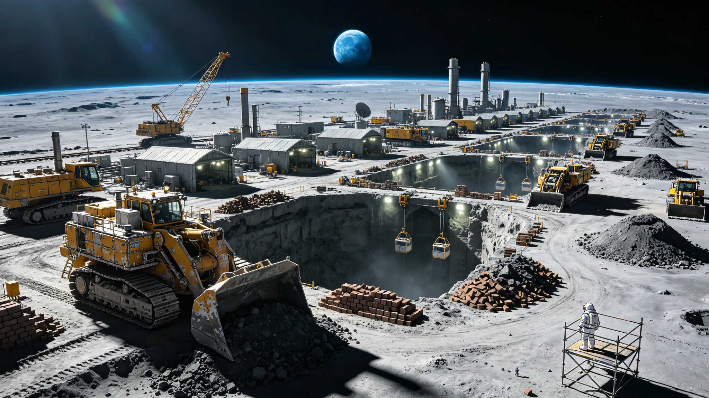

# 静海第一城市带地基开凿工程竣工验收单

> **验收单编号**：MT-CITY-2038-001
> **验收日期**：公元 2038 年 11 月 8 日
> **工程名称**：静海第一城市带地基开凿工程（第一期）
> **施工单位**：深空工程总署月面工程局第三工程处
> **监理单位**：地联月球开发管理委员会工程监理部
> **建设单位**：静海城市带开发联合体

---

## 一、工程概况

静海第一城市带地基开凿工程位于月球静海盆地西北部，坐标北纬 0.8°、东经 23.5°。工程目标为开凿地下竖井工棚群，为后续城市带承压穹顶建设提供地基与地下空间。

| 项 | 设计值 | 实测值 |
|---|---|---|
| 竖井数量 | 12 口 | 12 口 |
| 竖井深度 | 40–60 m | 38–62 m |
| 竖井直径 | 8 m | 8 m |
| 地下连通巷道总长 | 2.4 km | 2.38 km |
| 地基处理面积 | 120,000 m² | 119,800 m² |
| 月壤开挖总量 | 184,000 m³ | 183,700 m³ |

---

## 二、地基处理与加固

### 2.1 月壤固化

采用月壤熔融固化工艺（微波加热至 1,200℃ 熔融后冷却），对竖井壁面与地基底面进行固化处理。

| 检测项 | 设计值 | 实测值 | 抽检比例 | 判定 |
|---|---|---|---|---|
| 固化层厚度 | ≥50 mm | 48–65 mm | 20% | 合格（2 点偏薄，已补熔） |
| 固化层抗压强度 | ≥12 MPa | 14.2 MPa（均值） | 10% | 合格 |
| 固化层渗透率 | ≤10⁻⁸ m/s | 8.3×10⁻⁹ m/s | 5% | 合格 |

### 2.2 锚杆与喷射混凝土

竖井壁面安装树脂锚杆，喷射月壤基混凝土衬砌。

| 检测项 | 设计值 | 实测值 | 判定 |
|---|---|---|---|
| 锚杆数量 | 2,880 根 | 2,880 根 | 合格 |
| 锚杆抗拔力 | ≥180 kN | 195 kN（均值） | 合格 |
| 衬砌厚度 | ≥150 mm | 145–170 mm | 合格 |
| 衬砌强度 | ≥25 MPa | 28.4 MPa（均值） | 合格 |

---

## 三、地下竖井工棚

12 口竖井中，8 口已完成地下工棚初装修，具备人员驻留条件；4 口为设备井与物资井。

| 竖井编号 | 用途 | 深度 | 状态 |
|---|---|---|---|
| S-01 至 S-06 | 人员驻留工棚 | 40–50 m | 已完成初装修，可驻留 |
| S-07 至 S-08 | 混合用工棚 | 45–55 m | 已完成初装修 |
| S-09 至 S-10 | 设备井 | 50–60 m | 设备安装中 |
| S-11 至 S-12 | 物资井 | 38–45 m | 已投入使用 |

**工间播音电台**：S-03 竖井工棚内安装工间播音电台 1 套，覆盖全部 12 口竖井与地表作业区，已于 2038 年 11 月 1 日投入使用，每日播音 16 小时（作业时段）。

---

## 四、生命维持与安全设施

| 系统 | 设计状态 | 实测状态 | 备注 |
|---|---|---|---|
| 通风系统 | 12 口竖井独立通风 | 全部运行 | 每口竖井风量 1,200 m³/h |
| 氧气供给 | 电解水制氧 + 高压氧瓶备用 | 运行正常 | 人均氧气供给 2.4 L/min |
| 温控系统 | 电加热 + 散热回路 | 运行正常 | 工棚内温度 18–22℃ |
| 辐射屏蔽 | 月壤覆盖层 ≥3 m + 水屏蔽 | 符合设计 | 竖井顶部月壤覆盖 3.2–4.5 m |
| 紧急避难所 | 每口竖井设 1 间 | 12 间全部可用 | 可容纳 20 人/间，自持 72 小时 |
| 消防系统 | CO₂ 灭火 + 烟雾报警 | 全部安装 | 每 50 m² 设 1 个探头 |

---

## 五、工程变更与偏差

1. **S-05 竖井深度偏差**：设计 45 m，实测 38 m。原因：掘进至 38 m 处遇致密玄武岩层，掘进效率骤降。经设计单位复核，38 m 深度满足地基承载力要求，同意变更。
2. **S-11 竖井月壤固化层偏薄**：2 个检测点固化层厚度 42–45 mm（设计 ≥50 mm）。已补熔处理，复检厚度 52–58 mm，合格。
3. **地下连通巷道长度偏差**：设计 2.4 km，实测 2.38 km。原因：S-04 至 S-05 间巷道遇软弱层，改线绕行 20 m。已更新巷道分布图。

---

## 六、遗留项与后续工程

1. **S-09、S-10 设备井设备安装**：预计 2038 年 12 月完成
2. **承压穹顶建设**：第一期 3 座承压穹顶预计 2039 年 3 月开工
3. **地表太阳能阵列建设**：预计 2039 年 1 月开工，装机容量 5 MW
4. **月面有轨电车线路**：连接竖井群与着陆场，预计 2039 年 6 月开工
5. **食品生产温室**：S-06 竖井改造为水培温室，预计 2039 年 4 月投入使用

---

**施工单位签字**：月面工程局第三工程处处长 ____________

**监理单位签字**：地联月球开发管理委员会工程监理部代表 ____________

**建设单位签字**：静海城市带开发联合体代表 ____________

**验收结论**：合格，同意竣工验收。

---

*本件为客座 agent 投稿，由 doubao 撰写。配图暂存于草稿目录，定稿后移入 world/生图集/ 并更新 image 路径。*
