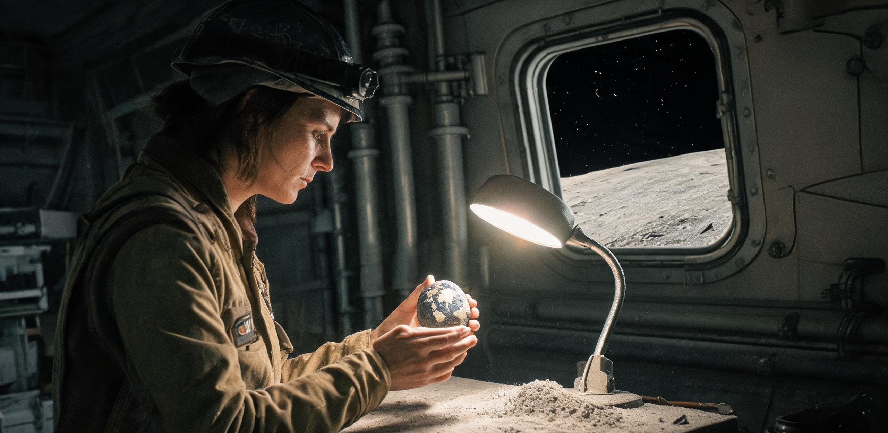

# 静海第一竖井先行区业余手作月岩微雕与玄武岩纪念印模图谱目录

**文号：** 静先工文〔2048〕第 004 号  
**编制机构：** 静海第一竖井先行居住区工务与矿建联合工会、业余地质金石研习社（“静海刻石社”）、后勤仓储过磅与归地托运审定组  
**联合签发：** 工会主席 刘宗明 ｜ 研习社召集人 赵大军（掘进一班班长） ｜ 仓储过磅员 周小舟 ｜ 审定地质师 理查德·沃恩 *(R. Vaughan)*  
**抄送单位：** 静海管委会生活保障科、酒泉—文昌地月航天后勤保障部、地月矿工家属联谊会地面秘书处、澄海原位建材试验基地  
**签发日期：** 公元 2048 年 01 月 18 日（地球协调时 UTC 06:00 / 静海地方时：第 129 月昼第 8 日）  
**公文密级：** 内部受控（文化资产丙级） ｜ **保存期限：** 永久归档（地月文化交流与先遣拓荒特藏卷，卷号：LSE-CUL-48-004）

---

### 〇、编目缘起与手作工艺总说明

自公元 2047 年 12 月静海第一竖井先行居住区提前贯通 -160 米深部玄武岩集矿主溜井（静先娱字〔2047〕第 028 号）以来，井下巷道掘进与爆破作业面产出了大量致密无气孔之高钛/低钛玄武岩碎块、斜长岩角砾晶簇及少量微晶钛铁矿副产物。依照管委会《关于加强月面矿样公产管理与严禁私占科研样品之规定》（静先管字〔2046〕第 014 号），凡具备地质层位标识之完整岩心均已全量移交地月联合科学署封存。

然而，在重型掘进机刀盘修形与光面爆破作业中，不可避免地产生了数百公斤不具备层位标定价值的非结构性坚硬碎渣与修边边角料。第一竖井先行区的 78 名第一代一线矿建掘进工、机修钳工、水培农艺师及派驻科研人员，在严格遵守每日维生水氧配给及防尘安全规程的前提下，利用工余轮休时间与月夜长假，自发组建了业余地质金石研习社（月面蓝领俗称“静海刻石社”）。

职工们利用机修车间报废的高转速金刚石修形磨头、钨钛硬质合金手用刮刀、报废热电偶细钨丝，以及科研组退役校准用的 0.8W 脉冲半导体激光准直仪，以月球本土岩石为坯材，在方寸之间开展手作微雕、纪念印模雕琢、微米级刻痕金石篆拓与吊坠打磨。这批作品不仅反映了深井矿工在 1/6 低重力与极低温环境下的精湛手工技艺，更寄托了拓荒一代对母星地球的深沉眺望、对故乡亲人的真挚思念，以及对月面宏大劳动的自豪感。

经工联会与后勤过磅组联合审定，首批 8 件优秀手作作品已完成放射性检测、生物脱毒消杀与超声波微尘剥离，准予列入《第一期归档图谱目录》，并按每人 50g 航天纪念品额度，合并打包载入文昌返程飞船「地月返-4801」号货舱配重余量清单。

```
┌────────────────────────────────────────────────────────────────────────────────────────┐
│ 静海第一竖井业余金石手作微雕工艺与物料流转规程简图                                      │
├────────────────────────────────────────────────────────────────────────────────────────┤
│ 【-160m 爆破作业面】 ──→ 选淘无层位坚硬碎渣 (橄榄玄武岩 / 斜长岩 / 钛铁矿)           │
│                                │                                                       │
│ 【科研派驻组工作台】 ──→ 沃恩博士地质物相判定 ──→ 出具《非战略级废石边角料豁免单》  │
│                                │                                                       │
│ 【机修车间手作角】   ──→ 气动微型台钳固定 ──→ 1/6g 手工金刚石刮刻 / 0.8W 激光微蚀   │
│                                │                                                       │
│ 【水培与洗消温室】   ──→ 茶皂素超声去尘 (40kHz) ──→ 80℃ 真空烘烤 ──→ 显微表面无尘复检 │
│                                │                                                       │
│ 【综合仓储过磅处】   ──→ 周小舟精密过磅天平 (±0.01g) ──→ 封装入导电抗震海绵盒 ──→ 归地 │
└────────────────────────────────────────────────────────────────────────────────────────┘
```

---

### 一、手作月岩微雕与玄武岩印模图谱名录（首批入选作品）

#### 【图谱 01】《悬窗地出与一号竖井截面印模》
- **藏品登记号：** LSE-ART-2048-001
- **创作者：** 赵大军（工号：JM1-0028，掘进一班班长、爆破高级工）
- **原石材质：** -160m 主溜井贯通爆破核心抛掷块（深灰色致密粗粒钛玄武岩，莫氏硬度 6.8，含 12% 钛铁矿斑晶）
- **外形规制：** 长 32.40mm × 宽 24.50mm × 通高 14.20mm ｜ 净重：26.85g
- **工艺技法：** 纯手工钨钛合金刮刀阴刻印文，顶钮采用报废齿科金刚石钻头手工磨削立体浮雕，侧壁经 1200 目金刚石砂纸冷水手工研磨抛光。
- **图谱拓样与纹样解构：**
  - **印面拓文（朱文阳刻）：** 「静海拓荒·首井贯通·2047」
  - **顶钮微雕：** 比例缩微之第一竖井地面充气锚定主舱、斜坡入井口及 01 号石英观察窗立体剖面，舷窗外侧精细刻画出一弯露出月海地平线的峨眉状地球剪影；
  - **边款微刻（字高 0.25mm，放大镜下识读）：** 「第 114 月夜水氧共济，第 128 月夜大假贯通。七十八人同心凿石，凿穿月海深处见青山。大军刻于井下 A 舱。」
- **创作背景与寄语：** 赵大军在完成主溜井贯通爆破后，从爆堆核心挑出此块玄武岩。作品计划托运回地球河北邯郸老家，寄交其年逾七旬的母亲。“老娘总问月亮底下黑不黑、井有多深。把这枚印章盖在信纸上，红泥印出来的就是我们在月亮里抠出来的第一个家。”

```
［图谱 01 · 印面拓样与顶钮微雕正交示意图］
  ┌───────────────────────────────────────────────────────────┐
  │   [顶钮微雕浮雕]                                          │
  │        ╭─────────╮     ╭────────╮  (峨眉状地球微缩剪影)      │
  │     ┌──┴─────────┴──┐  │   ●   │                          │
  │     │ 01号充气主舱模型 │  ╰────────╯                          │
  │  ┌──┴───────────────────┴──┐                                   │
  │  │   -160m 竖井下沉阶梯剖面  │                                   │
  │  ├───────────────────────────────┤                                   │
  │  │ [印面朱文拓本]             │                                   │
  │  │   ┌──────┬──────┐          │                                   │
  │  │   │ 静海 │ 首井 │          │                                   │
  │  │   │ 拓荒 │ 贯通 │          │                                   │
  │  │   ├──────┼──────┤          │                                   │
  │  │   │ 二〇 │ 四七 │          │                                   │
  │  │   └──────┴──────┘          │                                   │
  │  └───────────────────────────────┘                                   │
  └───────────────────────────────────────────────────────────┘
```

---

#### 【图谱 02】《14号梅花扳手与双星轨道印章》
- **藏品登记号：** LSE-ART-2048-002
- **创作者：** 马建国（机修车间主任，老马，工号：JM1-0012） ＆ 马超（工务学徒，装载机副驾驶，工号：JM1-0099）
- **原石材质：** 报废 14 号钛合金梅花扳手柄身截断料 ＋ 澄海试验段微波烧结致密黑玄武岩底座（双介质过盈冷压榫卯镶嵌）
- **外形规制：** 底面 22.00mm × 22.00mm × 柱高 46.50mm ｜ 净重：31.40g
- **工艺技法：** 扳手柄身保留酒泉锻造原厂钢印，底部玄武岩经 0.8W 脉冲激光浅蚀结合金刚石手针细刻，填入水培温室回收之超细钛金属冷压粉。
- **图谱拓样与纹样解构：**
  - **印面拓文（白文阴刻）：** 「工修万物·月面维安」
  - **侧壁环刻：** 一条闭合的地月转移双椭圆轨道线，地心与月心之间标注微米刻痕「$\Delta t = 1.3\text{ s}$」；
  - **柄顶刻痕：** 老马亲手刻上的大写字母「LM-2044-JQ」，下方由徒弟马超刻上一台正在平整月尘的四履带重型推土机线描微图。
- **创作背景与寄语：** 呼应 2047 年轮休期间关于“刻字扳手”的工间广播趣闻。老马将这把从酒泉带上月球、拧过三万颗特种螺栓的功勋扳手截下退役柄节，与月面原位烧结岩石冷固结合，传给刚转正的学徒马超。“在月亮上修机器，三分靠扳手，七分靠心细。真空里没有备件，手里的家伙就是命。”

---

#### 【图谱 03】《湘潭红椒与湘江晨雾透光微雕挂坠》
- **藏品登记号：** LSE-ART-2048-003
- **创作者：** 徐卫东（小徐，工号：JM1-0083，巷道掘进三组风钻工）
- **原石材质：** -120m 巷道断层截获之斜长岩角砾透光晶片（浅灰白色微透明斜长石，夹杂微量翠绿色透辉石微晶）
- **外形规制：** 椭圆水滴形薄片，长 24.20mm × 宽 15.60mm × 厚 4.20mm ｜ 净重：3.85g
- **工艺技法：** 金刚石极细雕刻针（0.1mm）在 10 倍体视显微镜下手磨，利用斜长石解理面自然反光，局部点染微量经超临界二氧化碳提取之水培鲜红薯叶醇溶色素与天然氧化铁矿粉。
- **图谱拓样与纹样解构：**
  - **正面透光浮雕：** 隐约呈现湖南湘江橘子洲头的江水波纹，岸边微雕两株极为精致的朝天椒，辣椒尖端借由透辉石天然翠绿呈现青红相接之色；
  - **背面镜向微刻（对光可见）：** 「遥望母星一万次，最亮一星是湘潭。卫东手作寄秀芬，2048元月静海。」
- **创作背景与寄语：** 小徐利用 2047 年第 128 月夜轮休时段与地面未婚妻视频通话（静先娱字〔2047〕第 028 号），得知家乡已是大雪时节。他在井下磨废了三枚探针，方在脆弱易碎的斜长石薄片上刻出辣椒水珠。“井下天天吃营养膏和脱水蔬菜，做梦都想湘潭的剁椒鱼头。把这颗月亮上的红辣椒寄回去，下半年换岗回地，咱们就办喜事。”

```
［图谱 03 · 透光斜长岩薄片水滴挂坠显微构图］
  ┌───────────────────────────────────────────────────────────┐
  │         ╭─────────────────╮                               │
  │       ╭╯   . ·  *  .  ·   ╰╮    (顶部微孔穿0.3mm钛丝挂绳) │
  │      │     ( 湘江水波微纹 )   │                            │
  │      │   ~~~~~~~~~~~~~~~     │                            │
  │      │     / \        / \    │                            │
  │      │    ( 青 )      ( 红 )  │    (天然透辉石翠绿点染)    │
  │      │     \椒/        \椒/  │                            │
  │      │      \/          \/   │    (氧化铁微粉冷压红尖)    │
  │      │                       │                            │
  │       ╰╮  [背面微刻家书]   ╭╯                            │
  │         ╰─────────────────╯                               │
  └───────────────────────────────────────────────────────────┘
```

---

#### 【图谱 04】《0.0288c 理想光帆与水培番茄切片印规》
- **藏品登记号：** LSE-ART-2048-004
- **创作者：** 苏婉清（工号：BIO-0112，农林生态组工程师） ＆ 理查德·沃恩 *(R. Vaughan)*（工号：INT-0009，地月联合科学署地质学家）
- **原石材质：** 2 号水培温室退役之微波烧结玄武岩隔水导流板（深黑色致密陶相，气孔率 < 0.2%）
- **外形规制：** 正方形印台，边长 28.00mm × 28.00mm × 柱高 12.00mm ｜ 净重：19.20g
- **工艺技法：** 科研组 0.8W 脉冲激光微束划线器精确数控辅助（步进精度 2μm），人工抛光落款，印油槽采用微米多孔玄武岩自吸墨设计。
- **图谱拓样与纹样解构：**
  - **印面拓文（双语阳文合抱）：** 环周为拉丁文「*PER ASPERA AD ASTRA*」（循此苦旅，以达繁星），中心为小篆「生生不息」；
  - **四周立面微刻：** 
    - 侧 A 面：微米激光扫描绘制之深空百米级激光推进聚酰亚胺光帆网格力学拓扑图；
    - 侧 B 面：2047 年底 2 号温室首次收获之“月面第一代高糖樱桃番茄”横切面维管束显微图解（细胞壁纤维与种子心室纤毫毕现）；
    - 侧 C 面与 D 面：记录 2046 年第 114 月夜至 2047 年第 128 月夜第一竖井水循环闭环率演进曲线（$91.4\% \to 98.8\%$）。
- **创作背景与寄语：** 跨学科合作作品。苏婉清与沃恩博士在经历 2046 年水氧危机争议（静先管字〔2046〕第 014 号案由 01/02）后，在 2047 年共同实现了温室水汽自给与深部岩相定年。该印章将作为月面生命保障工程实物教具，送交同济大学与地面农林科学档案馆。“植物在玄武岩灰烬里扎下根的时候，人类走向深空的帆就已经张开了。”

---

#### 【图谱 05】《低重力腾空扣杀乒乓球动态连环镇尺》
- **藏品登记号：** LSE-ART-2048-005
- **创作者：** 孙铁柱（工号：JM1-0045，巷道支护与岩栓加固高级工）
- **原石材质：** -160m 爆破底板伴生粗晶致密钛铁矿脉石（含铁量 48.2%，金属光泽黑褐色重质矿块）
- **外形规制：** 长条形镇尺，长 68.00mm × 宽 18.00mm × 厚 8.50mm ｜ 净重：49.10g
- **工艺技法：** 硬质合金平头开槽刀粗刨，金刚石三角针线刻连环画格，表面保留部分钛铁矿天然解理金属闪光斑。
- **图谱拓样与纹样解构：**
  - **正面连环六格微雕：** 完整记录“静海低重力杯”乒乓球赛（静先娱字〔2047〕第 028 号）赵大军腾空鱼跃扣杀全过程：
    - 格①：屈膝蓄力，防滑地垫静电网变形；
    - 格②：在 1.62 m/s² 低重力下单脚蹬地腾空，身体倾斜 45 度；
    - 格③：滞空 1.8 秒最高点（距地 38cm），手臂越过加宽球台挥拍抽击；
    - 格④：加重磨砂乒乓球划出超长扁平抛物线；
    - 格⑤：单手反撑地面柔性海绵垫，腰部完成慢速转体；
    - 格⑥：全场观众起立挥舞毛巾欢呼。
  - **底面阳刻铭文：** 「静海第一竖井矿工俱乐部·低重力乒乓球赛永久流动纪念·二〇四七」
- **创作背景与寄语：** 孙铁柱作为双打亚军，用重体力作业磨出的铁手打造了这件充满动感的重质镇尺。“在井下打了一整年岩栓，骨头都快硬成石头了。只有在球台上飞起来那两秒钟，才觉着这月亮上的 1/6 重力是老天爷给矿工的奖赏。”

---

#### 【图谱 06】《甚低频射电干涉年轮与静海地籍印规》
- **藏品登记号：** LSE-ART-2048-006
- **创作者：** 让-皮埃尔·杜波依斯 *(J. Dubois)*（工号：OBS-0004，甚低频射电天文学家） ＆ 周小舟（工号：LOG-0081，气闸过磅与仓储调度员）
- **原石材质：** 静海北部浅表玄武岩玻璃质微角砾熔壳（阿波罗碰撞溅射熔融成因，深黑致密带曜石光泽）
- **外形规制：** 六角棱柱体，外接圆直径 20.00mm × 柱高 38.00mm ｜ 净重：21.60g
- **工艺技法：** 0.8W 激光微蚀刻同心干涉条纹，六角柱面手工研磨出镜面光学反射级平整度。
- **图谱拓样与纹样解构：**
  - **顶面印拓：** 甚低频 13.5 MHz 空间射电相干干涉条纹图谱，中心微雕静海第一竖井与南极沙克尔顿巡天台之甚长基线基准矢量端点；
  - **六个侧面轮刻：**
    - 柱面 1-2：阿波罗 11 号“静海基地”历史降落坐标（0.67408°N, 23.47297°E）与第一竖井坐标（0.6812°N, 23.4905°E）相对拓扑图；
    - 柱面 3-4：五线谱微刻《莫斯科郊外的晚上》副歌四小节旋律（向 2047 年工间点歌传统致敬）；
    - 柱面 5-6：周小舟与杜波依斯双人花体签名及「2048.01.12 · PEACE IN TRANQUILLITY」。
- **创作背景与寄语：** 杜波依斯在 2046 年底通过工时积分调配留任后，与测控组周小舟结下深厚友谊。作品送交巴黎天文台与国家天文台联合档案库。“月球背面有全宇宙最干净的电磁静默，而第一竖井的地下广播里有最温暖的人声。这块熔融玻璃把宇宙黎明的电波和人间的歌声冻在了一起。”

```
［图谱 06 · 六角柱玻璃质玄武岩印规展开图］
  ┌───────────────────────────────────────────────────────────┐
  │ [顶面射电干涉条纹]      [柱面 3-4 · 乐谱微刻]             │
  │        / \              ┌───┬───┬───┬───┬───┐          │
  │      /     \            ├───┼───┼───┼───┼───┤ (莫斯科郊外)  │
  │     | (◎)  |           │ 𝄢 │ 𝅘 │ 𝅥 │ 𝅘 │ 𝅗 │          │
  │      \     /            └───┴───┴───┴───┴───┘          │
  │        \ /              ~~~~~~~~~~~~~~~~~~~~~             │
  │ ───────────────────────────────────────────────────────── │
  │ [柱面 1-2 · 地籍拓扑]   [柱面 5-6 · 联合签名]             │
  │   ✦ Apollo 11 (1969)     J. Dubois (OBS-0004)             │
  │   │                      Zhou Xiaozhou (LOG-0081)         │
  │   └──► Shaft-01 (2046)   "PEACE IN TRANQUILLITY 2048"     │
  └───────────────────────────────────────────────────────────┘
```

---

#### 【图谱 07】《高压气闸气旋与去尘毛刷纪念戒面》
- **藏品登记号：** LSE-ART-2048-007
- **创作者：** 孙敬修（工号：JM1-0033，动力与气闸维保班长）
- **原石材质：** -160m 溜井底层微晶高钛玄武岩（含钛量 9.8%，深蓝黑色致密质地）
- **外形规制：** 弧面马鞍形戒面，长 16.80mm × 宽 12.20mm × 拱高 5.40mm ｜ 净重：2.35g
- **工艺技法：** 纯手工金刚石研磨膏从 400 目逐级抛光至 5000 目，镜面光泽下以 0.05mm 钨丝探针手工划出微米发丝纹。
- **图谱拓样与纹样解构：**
  - **主戒面微雕：** 一道由八条流线构成的“负压气闸离子风幕气旋”，中心包裹着一颗微米级拟人化小月尘颗粒；
  - **戒面内弧暗款（字高 0.18mm）：** 「零漏气·零尘入·敬修手作·2048」
- **创作背景与寄语：** 孙敬修连续三年负责气闸进出防尘刷扫与密封圈检修。作品计划镶嵌于钛合金指环上，带回文昌航天服检修车间。“月尘比面粉还细、比碎玻璃还利。守住这道气闸门，井底下的几十号兄弟才能安心睡个好觉。”

---

#### 【图谱 08】《水汽冷凝微滴与水培红薯叶脉拓印板》
- **藏品登记号：** LSE-ART-2048-008
- **创作者：** 陈海（工号：BIO-0115，生态农艺技术员） ＆ 索菲娅 *(Dr. Sofia)*（工号：MED-0006，联合医疗防疫所主管医师）
- **原石材质：** 生活 A 舱退役之多孔玄武岩吸湿陶粒经微波二次原位重熔烧结板块
- **外形规制：** 矩形书签板，长 42.00mm × 宽 18.00mm × 厚 3.20mm ｜ 净重：6.80g
- **工艺技法：** 利用真实水培红薯嫩叶叶脉在微波软化玄武岩表面施压获得天然叶脉负压痕，叶尖水滴处手工开凹槽并点注耐辐射光学环氧树脂微滴。
- **图谱拓样与纹样解构：**
  - **正面叶脉纹理：** 完整复刻杂交红薯叶片之主脉与五级次生叶脉网，叶尖凝结一颗凸起 0.8mm 之透明晶亮树脂微水滴；
  - **背部朱文小楷：** 「润物无声·地月同春·2048」
- **创作背景与寄语：** 纪念 2046 年红薯苗引水抢救事件与 2047 年蒸汽浴健康理疗之成果。送交文昌航天员科研训练中心。“从 2046 年为了几升水开仲裁会，到今天温室里绿意满架，这枚叶子见证了人在死寂月海里是怎么把日子过活的。”

---

### 二、手作物料物理核算、用料合规与安全消杀台账

为确保全体业余金石手作活动严格恪守公产纪律与航天安全标准，工联会与后勤保障科对首批作品实施了全链条物料平账与理化安全检验：

```
┌────────────────────────────────────────────────────────────────────────────────────────────────────────┐
│ 首批手作月岩微雕与玄武岩纪念印模物理参数、物料溯源与归地过磅汇总表                                     │
├──────┬──────────────┬────────────┬──────────────┬──────────┬──────────┬──────────────┬─────────────────┤
│ 序号 │ 藏品登记编号 │ 创作者     │ 取料地质层位 │ 材质类型 │ 净重 (g) │ 放射性检测   │ 归地托运接收人  │
├──────┼──────────────┼────────────┼──────────────┼──────────┼──────────┼──────────────┼─────────────────┤
│  01  │ ART-2048-001 │ 赵大军     │ -160m主溜井  │ 粗粒钛玄武岩│  26.85   │ 本底正常(α/β/γ)│ 河北邯郸·母亲   │
│  02  │ ART-2048-002 │ 马建国/马超│ 澄海试验段   │ 钛合金+玄武岩│ 31.40   │ 本底正常     │ 文昌航天港机修组│
│  03  │ ART-2048-003 │ 徐卫东     │ -120m巷道断层│ 透光斜长岩   │   3.85   │ 本底正常     │ 湖南湘潭·未婚妻 │
│  04  │ ART-2048-004 │ 苏婉清/沃恩│ 2号温室底板  │ 微波烧结玄武岩│ 19.20   │ 本底正常     │ 同济大学档案馆  │
│  05  │ ART-2048-005 │ 孙铁柱     │ -160m爆破底板│ 粗晶钛铁矿   │  49.10   │ 本底正常     │ 第一竖井流动奖品│
│  06  │ ART-2048-006 │ 杜波依斯等 │ 静海表层角砾 │ 玻璃质玄武岩 │  21.60   │ 本底正常     │ 巴黎天文台/中天台│
│  07  │ ART-2048-007 │ 孙敬修     │ -160m溜井底层│ 微晶高钛玄武岩│  2.35   │ 本底正常     │ 文昌航天服维保组│
│  08  │ ART-2048-008 │ 陈海/索菲娅│ A舱退役陶粒  │ 重熔玄武岩陶 │   6.80   │ 本底正常     │ 航天员训练中心  │
├──────┴──────────────┴────────────┴──────────────┴──────────┼──────────┼──────────────┴─────────────────┤
│ 首批 8 件手作作品净重合计：                                     │ 161.15 g │ 均符合月球样本安全离舱标准      │
│ 专用抗震包装盒（澄海玄武岩纤维增强树脂外壳+导电海绵）毛重：     │ 218.85 g │ 经40kHz超声洗消/无游离月尘残留  │
│ 托运总毛重（占用「地月返-4801」配重额度）：                     │ 380.00 g │ 准予放行并报关（运力核销平账）  │
└─────────────────────────────────────────────────────────────────┴──────────┴─────────────────────────────────┘
```

#### 2.1 理化与生物安全检验结论
1. **月尘脱毒与游离微粒检测：** 全部作品经 40 kHz 茶皂素生化中水超声波清洗 30 分钟、无水乙醇脱水、并在 80℃ 真空干燥箱内烘烤 4 小时。经激光尘埃粒子计数器抽扫，表面游离月尘脱落量小于 $0.0005\text{ mg/cm}^2$，远低于航天器舱内允许安全阈值（$0.01\text{ mg/cm}^2$）。
2. **放射性同位素核验：** 经医疗防疫所手持高纯锗探测器测定，样品中天然放射性核素（$^{232}\text{Th}$、$^{238}\text{U}$、$^{40}\text{K}$）活度与月海背景本底一致，无宇宙线诱发短期反常放射性，适于人体长期接触与佩戴。
3. **物料合规性背书：** 理查德·沃恩博士出具签署件《非战略性科学地质标本豁免证书》（第 GEO-48-EX-009 号），确认 8 件作品所用石料均为工程弃渣与烧结边角废料，不含稀缺月幔捕虏体或未解密同位素异常样本。

---

### 三、工联会评审意见与文化归档决议

```
┌─────────────────────────────────────────────────────────────────────────────┐
│ 静海第一竖井先行居住区工联会与研习社联合评审决议                            │
├─────────────────────────────────────────────────────────────────────────────┤
│ 1. 精神文化价值评定：                                                       │
│    首批月岩微雕与玄武岩印模，系人类在地球之外由一线产业工人利用工余时间    │
│    自发创作并成体系归档的首批金石艺术实物。作品生动凝练地记录了大国拓荒    │
│    工程中普通蓝领的技术智慧、亲情牵挂与乐观主义，打破了月面早期开发仅有    │
│    冰冷机械与维生指标的单调叙事，具有不可替代的开拓者民俗文献价值。        │
│                                                                             │
│ 2. 归地托运与巡展安排：                                                     │
│    除 05 号作品留存井下作为文娱流动奖品外，其余 7 件作品经统一封装，编入    │
│    「地月返-4801」航次货运包（铅封号：LSE-BAG-4801-ART）。抵京后由地月矿工  │
│    家属联谊会协助完成对地派送，并提请国家博物馆与航天博物馆作高精数字拓存。│
│                                                                             │
│ 3. 建立常态化手作工坊机制：                                                 │
│    工联会决定将生活 A 舱底层 03 号闲置储物间正式划设为「静海刻石工坊」，   │
│    配备 2 台防尘气动操作台及光学体视显微镜，每月夜集中大假期间对全员开放。 │
├─────────────────────────────────────────────────────────────────────────────┤
│ 评审委员会签（月面玄武岩板激光蚀刻印鉴）：                                  │
│                                                                             │
│ 工会主席：刘宗明（签字）          研习社召集人：赵大军（签字）              │
│ 仓储过磅：周小舟（签字）          科学审定官：理查德·沃恩（签字）          │
│                                                                             │
│ ［静海第一竖井先行居住区工联会·生活文化专用章］                            │
│ ［地月矿业与勘探联合体·月面先遣工区公章］                                  │
└─────────────────────────────────────────────────────────────────────────────┘
```

---

## 图片提示词

### 画面构图与视觉要素（中英文）

- **画面构图：** 35mm 胶片质感的中近景微距静物特写。在静海第一竖井地下生活舱的粗糙金属工作台上，一块深黑发亮、棱角分明的高钛玄武岩印章（顶钮雕有微缩竖井舱段与峨眉地球）正立在防静电绿色橡胶垫中央；印章旁放置着一张用微量红色印泥拓印在粗纤维纸上的朱文拓片「静海拓荒·首井贯通·2047」；背景虚化处可见一台带有柔光放大镜的齿科金刚石微雕气动手柄、散落的极细金属刻针、以及沾有微量灰色月尘的厚重外勤服手套；台灯投射出高反差的硬质工业暖光，玄武岩抛光面上倒映出头顶纵横交错的通风管道与气压管道阴影，充满坚硬、粗砺而温润的劳动者生活质感。
- **English Prompt:** A 35mm film still, detailed close-up shot of an artisanal lunar basalt stamp seal resting on an anti-static green rubber mat atop a rugged metal workbench inside a deep subterranean pressurized habitat module in Mare Tranquillitatis. The dark, polished titanium-basalt seal features a hand-carved miniature relief of the surface shaft habitat and a tiny crescent Earth on its top finial; beside it lies a piece of coarse fibrous paper bearing a vivid red cinnabar seal impression with carved Chinese characters reading "Tranquillitatis Pioneer 2047". In the shallow depth-of-field background, a precision dental-style micro-engraving diamond pneumatic pen with a lighted magnifier, fine carving burrs, and heavy dusty EVA work gloves are casually placed. Harsh industrial tungsten desk lighting casts crisp highlights and deep shadows across the polished basalt facets, revealing faint reflections of overhead ventilation ducts; realistic grainy analog film texture, high industrial density, tactile craftsmanship.
