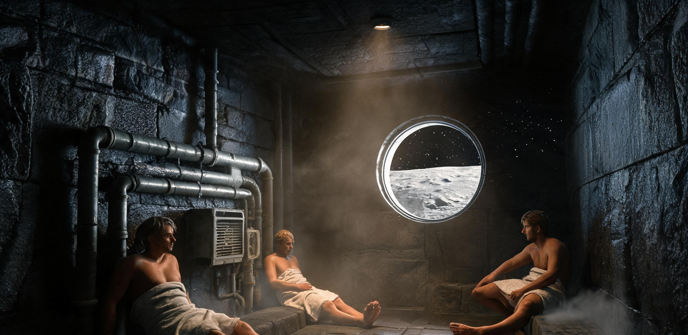

# 静海第一竖井先行区第128月夜休班文娱排期与反应堆余热蒸汽舱预约清册

**文号：** 静先娱字〔2047〕第 028 号  
**签发机构：** 静海第一竖井先行居住区管理委员会生活文娱科、工务与矿建工会联合会  
**抄送单位：** 动力与水务保障科、联合医疗防疫所、地月联合勘探派驻组、文昌航天港地面职工关怀部  
**签发日期：** 公元 2047 年 12 月 24 日（地球协调时 UTC 08:00 / 静海地方时：第 128 月夜第 6 日）  
**执行周期：** 第 128 月夜集中轮休大假（2047 年 12 月 24 日 12:00 至 12 月 26 日 24:00 UTC，共计 60 个地球标准时）  
**密级：** 内部受控（丙级）｜ **状态：** 公示并执行（主生活 A/B 舱信息栏、蒸汽舱入口屏同步张贴）

---

### 〇、轮休背景与保障调度总说明

静海第一竖井先行居住区（下沉式玄武岩覆土生活 A/B 舱，当前在册常驻人员 78 人）已于 12 月 23 日提前 36 小时顺利完成 -160 米深部玄武岩集矿主溜井贯通爆破。经管委会主任会议与工会联席会批准，决定在长达 354 小时的第 128 月夜中期，面向全体一线矿建、机械维保、水培农艺及科研派驻人员实施为期 60 小时的**跨班组集中轮休大假**。

鉴于当前地表实测环境温度为 -171℃，全区生活与动力维持由 1 号、2 号热中子裂变辅助堆（总热功率 10 MWt，稳态输出 1.52 MWe）联供。工务科与动力保障组已完成生活 A 舱底层「玄武岩余热蒸汽蓄热舱（原 02 号乏汽缓冲换热室）」管路切改，将裂变堆二次回路 68℃ 降压冷凝工质热能安全引至淋浴间，首次实现全天候 40℃-42℃ 湿热微雾供给；同时，对地 S 频段微波专线开放 4 路并发带宽，保障全员地月双向亲情视频通话。

管委会重申：**休班不等于松懈，舒适不浪费物料**。全区文娱与洗消设施严格实行“预约制打卡与工会福利记账”，杜绝水汽非受控逸散。

---

### 一、重点文娱与生活福利设施开放指引

```
┌────────────────────────────────────────────────────────────────────────────────────────┐
│ 静海第一竖井先行区 · 第 128 月夜集中轮休公共设施分布与能耗流向简图                      │
├────────────────────────────────────────────────────────────────────────────────────────┤
│ 【地表充气锚定舱顶层】──→ 01 号石英观察窗（地平线天窗·对地观景台，限容 8 人）          │
│                                │                                                       │
│ 【-40m 生活 A 舱主廊道】 ──→ 中央挑空大厅（1/6g 乒乓球台 / 自制乐器工坊 / 棋牌角）       │
│                                │                                                       │
│ 【-60m 生活 A 舱底层】   ──→ 01 号余热蒸汽舱（玄武岩蓄热床 / 4 喷头湿雾 / 限容 6 人）   │
│                                │                                                       │
│ 【-50m 生活 B 舱东翼】   ──→ 综合通信室（对地高增益微波 1-4 号隔音通话舱）              │
│                                │                                                       │
│ 【-30m 农业温室连廊】   ──→ 2 号水培试验温室（番茄长廊·自摘品尝与月夜茶话角）          │
└────────────────────────────────────────────────────────────────────────────────────────┘
```

#### 1. 01 号玄武岩余热蒸汽浴舱（温泉蒸发舱）
- **工作机制：** 裂变堆二次回路闭式热交换产生之 65℃-68℃ 软化除盐水，经玄武岩多孔陶粒床均匀渗滤，由低压雾化喷嘴打出 40℃-42℃ 饱和微雾。舱内维持 84 kPa 微正压。
- **水汽闭环回收：** 舱顶配备高效双联离心抽湿冷凝栅，水汽回收率经实测达 **98.8%**。每人次（45 分钟标准场）理论净损耗冷凝水仅为 0.16 L，由工会生活福利基金统一冲销，不计入个人水氧赤字。
- **特供物料：** 农艺组苏婉清工程师赞助蒸馏微藻冷杉精油香氛，经循环风道微量注入，可有效舒缓月尘吸入引起的咽喉干痒与肌肉紧张。

#### 2. 地平线石英观景台与地球升起观测排期
- **设施特征：** 直径 1,200mm 多层熔融石英耐压防辐射窗，直面静海东部开阔月海。当前静海地方视界中，地球正处于“大半盈月（盈地）”相位，反射光照度达 -12.8 等，蔚蓝云带与欧亚大陆夜间金色城市灯火轮廓极其清晰。
- **安全规程：** 严禁穿戴带有硬质金属挂钩的工装靠近石英窗；每次进入不得超过 8 人，单人单次停留上限为 30 分钟。

#### 3. 对地 1.3 秒微波亲情通话站
- **链路配置：** 4 间轻量化隔音电话亭，接入地表 S 频段相控阵高增益天线。
- **通话规则：** 单人配额 15 分钟/次（包含 1.3 秒单程微波上行与 1.3 秒下行物理延迟，实际往返迟延 2.6 秒）。通信亭内配备双向光敏对讲提示灯（绿灯发话，红灯收听），请通话矿工主动避免抢话。

#### 4. 中央挑空大厅 1/6g 体育与文娱角
- **1/6g 减速乒乓球台：** 球桌长 3.2 米（加长 46cm）、阻尼尼龙网高 28cm，采用配重加厚磨砂球。规则推行“三米高挑抽球与极限鱼跃防守”，严禁用脚蹬踏天花板主风管。
- **“静海铁管”民间乐队：** 由机修车间老马牵头，使用报废高压输氧无缝钛管、调谐玄武岩敲击板组装之重力律动打击乐器，向全员开放即兴演奏。

---

### 二、第 128 月夜轮休大假文娱活动与设施预约登记总表

本表由各班组于 12 月 24 日 06:00 前完成申报，经生活文娱科与工会汇总平衡，排定如下（重点场次与人员抽录）：

| 序号 | 预约时段 (UTC) | 场地与设施编号 | 预约班组 / 申请人 | 申报项目与活动内容 | 额定人数 | 水电及能耗记账属性 | 现场安全员与值班签注 |
| :---: | :---: | :---: | :---: | :---: | :---: | :---: | :---: |
| **01** | 24日 13:00-14:30 | 01 号余热蒸汽舱 | 井下掘进一班<br>（班长：赵大军） | 贯通爆破主攻组“洗尘大歇”：6 人深度蒸汽浴＋自制玄武岩热敷石理疗 | 6 人 | 工会工伤预防专款核销（水汽补损 0.96 L） | 医务所索菲娅在场；核准提供医用硫磺擦剂 |
| **02** | 24日 14:00-15:30 | 对地通话 1 号舱 | 掘进二班<br>王有德 | 与河北唐山老家视频：大女儿出嫁录像回放及女婿实时通话 | 1 人 | 通信福利配额（免费 15 分钟） | 调通延迟消除滤波；当事人自备红烧肉罐头佐餐 |
| **03** | 24日 15:00-17:00 | 中央挑空大厅 | 矿建工会联队 VS<br>联合勘探派驻组 | 首届“静海低重力杯”乒乓球双打对抗赛（赵大军/孙铁柱 VS 沃恩/杜波依斯） | 16 人<br>(含观众) | 公共照明正常负荷；加装防撞海绵垫 | 裁判长：后勤老周；赌注为 4 听脱水苹果脆片 |
| **04** | 24日 16:30-18:00 | 01 号余热蒸汽舱 | 水培与农艺女工班<br>（苏婉清等） | 植物精油蒸汽养护与低重力水疗；互助修剪防静电工作发型 | 5 人 | 农艺试验副产物对冲（免收水耗积分） | 蒸汽舱风道加注薄荷/冷杉精油 20 ml |
| **05** | 24日 19:00-20:00 | 地平线石英观景台 | 机修车间老马、<br>学徒工马超 | “地球升起”静默观测与月海地质素描；观摩文昌货运飞船入轨反推光迹 | 4 人 | 观景台保温电热片 2.0 kW 维持 | 值班员提醒：严禁在石英玻璃表面使用圆规 |
| **06** | 24日 20:30-22:30 | 中央大厅音乐角 | “静海铁管”小乐队<br>（老马/小徐/小林） | 月夜 Live 演奏会：《勘探队员之歌》《走在乡间的小路上》及重力爵士即兴 | 28 人 | 扩音设备功率 120W；开放水培薄荷茶供应 | 22:30 准时切入静音工况；禁止大声喧哗 |
| **07** | 25日 09:00-10:30 | 2 号水培试验温室 | 农林生态组<br>（主讲：苏婉清、陈海） | “月面第一茬高糖樱桃番茄”科普品尝会（每人凭工卡打卡限采 2 枚） | 20 人 | 温室全光谱模拟日光兼作日光浴代偿 | 医疗所现场测量血氧饱和度与皮质醇指标 |
| **08** | 25日 13:00-14:30 | 01 号余热蒸汽舱 | 气闸与动力维保组<br>（组长：孙敬修） | 高温排汗去硫化尘；检修蒸汽舱 3 号排湿换热微孔板 | 6 人 | 检修工时折算；维保耗材冲抵 | 顺道完成冷凝水回收泵滤网清洗 |
| **09** | 25日 15:00-16:30 | 对地通话 3 号舱 | 巷道掘进三组<br>小徐 | 与湖南湘潭未婚妻对地视频通话；展示自制钛合金微雕挂坠 | 1 人 | 通信配额（15分钟）＋工分兑换 10 分钟 | 测控组协助调校高增益窄波束对准长沙中继站 |
| **10** | 25日 19:00-21:30 | 生活 A 舱放映角 | 综合后勤党工组 | 经典修复电影展映《地心引力》（2013）与《大决战》；配发冻干炒花生 | 35 人 | 公共投影能耗 0.45 kWh；爆米花香氛扩散 | 散场后由二班负责地面尼龙毯吸尘 |

---

### 三、特色文娱项目细化方案与活动实况规程

#### 3.1 “静海低重力杯”乒乓球对抗赛特别交手规则
1. **重力适应修正：** 鉴于月面加速度仅为 1.62 m/s²，球体滞空时间较地球海平面延长 2.45 倍。双方发球严禁越过球台后沿上方 1.5 米警戒线（由红外光栅自动监测，超高鸣响判违例）。
2. **腾空姿态控制：** 救球时允许单脚起跳，但离地高度不得超过 40 厘米（以头顶不接触天花板柔性防尘网为准）。若发生身体与排风管碰撞，无论接球成功与否，一律扣除该球得分并记安全黄牌一次。
3. **奖品设定：** 
   - 冠军组：文昌地面直供 500g 真空包装金华火腿切片一份、01 号蒸汽舱“ VIP 无限蒸汽时段”加时券两张；
   - 亚军组：水培温室新鲜小黄瓜 4 根（苏婉清签字兑现）；
   - 纪念奖：机修车间利用报废钻头硬质合金自制激光蚀刻“静海登月拓荒纪念扳手”钥匙扣一枚。

```
［低重力乒乓球台与防飘防护区示意图］
  ┌───────────────────────────────────────────────────────────┐
  │ [天花板防撞尼龙缓冲网 (距地 2.4m)]                        │
  │     │                                                     │
  │     ▼     ● (配重磨砂球·弧线滞空 1.8s)                    │
  │   ┌───┐                                           ┌───┐   │
  │   │矿 │ ─────── 🏓                           🏓 ─────── │外 │   │
  │   │工 │                                           │籍 │   │
  │   └───┘   =====================================   └───┘   │
  │           │   加长球台 (3.2m × 1.6m)   │                 │
  │ ──────────┴─────────────────────────────┴───────────────  │
  │ [玄武岩烧结防滑地垫 · 铺设静电接地铜网]                  │
  └───────────────────────────────────────────────────────────┘
```

#### 3.2 01 号蒸汽舱体验与“温泉”健康规程
1. **更衣与预检：** 矿工入舱前必须在预备区脱除重载外勤服，经负压离子吸尘风幕吹扫 90 秒，彻底清除毛发与皮肤褶皱处残留的月尘微粒；由医疗所护士测量基础血压与心率。
2. **湿蒸体验流程：**
   - 阶段一（热身，10 分钟）：落座于底层加热玄武岩条凳，吸入含微量冷杉香氛的 38℃ 饱和水汽，促使毛孔充分舒张；
   - 阶段二（排汗与理疗，20 分钟）：升温至 42℃，由同伴协助使用天然丝瓜络（水培温室自产）擦拭背部月尘沉着斑，辅以 45℃ 玄武岩热敷石按压腰肌劳损处；
   - 阶段三（降温与回收，15 分钟）：开启循环冷凝风栅，湿度由 95% 逐步回落至 55%，饮用温热电解质葡萄糖盐水 300 ml。
3. **文明洗浴底线：** 严禁携带油性油膏、化学肥皂进入蒸汽舱。全员统一配发可生物降解的茶皂素起泡擦巾，废液经地漏专用管线直通中水初级生物发酵滤池。

#### 3.3 地平线观景台“地球升起”慢直播与家书时段
在第 128 月夜第 7 日 02:00 UTC，由于月球天平动效应，地球将在静海东侧阿波罗尼奥斯高地边缘呈现壮丽的“微幅升沉与全视角晨昏交割”。届时：
- 观景台照明全面调至 0.5 Lux 红光夜视模式，以获得最佳深空与地表反照视野；
- 广播系统将低分贝转播地面北京天文台与文昌控制中心的地月交响乐背景音；
- 现场备有 3 部拍立得热敏微孔打印相机（黑白玄武岩纸基），每名轮休矿工可免费拍摄一张“自己与背后巨大蓝色地球”的同框工作肖像，并附家书编号由下期货运飞船返程舱带回地面。

---

### 四、集中轮休生活物资特供与配给平账方案

为确保轮休大假物资充裕且符合全区资源平衡红线，生活保障科执行如下专项配给：

```
┌─────────────────────────────────────────────────────────────────────────────┐
│ 第 128 月夜集中轮休生活物资专项调拨与结算明细表                             │
├─────────────────────────────────────────────────────────────────────────────┤
│ 1. 食堂主食特别加餐（免扣个人工分，由管委会工会基金统筹列支）：            │
│    - 月面水培鲜韭菜猪肉复原馅水饺（每人份 18 只，配自发大蒜醋汁）          │
│    - 砂锅浓缩鸡汁炖玄武岩水培鲜白菜（热食现供，每人一碗）                   │
│    - 传统冻干红豆沙甜汤（添加水培鲜百合，无限量自取）                       │
├─────────────────────────────────────────────────────────────────────────────┤
│ 2. 精神与休闲专项物资配发：                                                 │
│    - 纯棉加厚防静电休闲卫衣/卫裤（酒泉航天后勤局配发）每人 1 套             │
│    - 地球精选纸质副刊合订本（《环球科学》《中国国家地理》）轮流借阅         │
│    - 地面直供低度发酵脱醇大麦饮（麦芽风味，每人 2 罐，规格 330ml）          │
├─────────────────────────────────────────────────────────────────────────────┤
│ 3. 水电物料平账审计：                                                       │
│    - 蒸汽舱全期耗电 180 kWh（裂变堆低谷电直接消纳，作价 180.00 LAU）        │
│    - 蒸汽冷凝净损耗补水 11.2 L（回收率 98.8%，作价 537.60 LAU）             │
│    - 全项开支合计 717.60 LAU，全额自“掘进一班贯通奖励基金”冲抵平账         │
└─────────────────────────────────────────────────────────────────────────────┘
```

---

### 五、会签、用印与执行指令

本排期表及预约登记清册经多方代表联合会签，自 2047 年 12 月 24 日 12:00 UTC 起严格遵照执行。各舱段值班联络员必须依时段引导人员进出，保障安全与秩序。

```
┌─────────────────────────────────────────────────────────────────────────────┐
│ 居住区管委会主任：                 矿建与工务总指挥：                       │
│         顾廷坚 （签字）                     刘宗明 （签字）                 │
│                                                                             │
│ 工会联合会主席（工人代表）：       联合医疗防疫所主管：                     │
│         赵大军 （签字）                     索菲娅·罗曼诺娃 （签字）         │
│                                                                             │
│ 动力与水务保障科长：               地月联合科研派驻组长：                   │
│         孙敬修 （签字）                     理查德·沃恩 （签字）           │
│                                                                             │
│ 签署地点：静海第一竖井生活 A 舱中央综合服务台                               │
│ 签署时间：公元 2047 年 12 月 24 日 08:30 UTC                                │
│                                                                             │
│ 盖章印鉴：                                                                  │
│ ［静海第一竖井先行居住区管委会·生活文娱专用章］                             │
│ ［地月矿建与工务联合工会·月面先遣分会公章］                                 │
└─────────────────────────────────────────────────────────────────────────────┘
```

---

### 附录：生活 A 舱中央公告栏留言与便签抄件（世界内档案原貌）

> *「致老赵：乒乓球赛别以为你们掘进班稳赢！我和老杜昨晚在 B 舱走廊练了两个小时‘大弧线切球’，打得球在空中飘三秒才落地。明天的火腿肉我们勘探组吃定了！」*  
> ——（铅笔手写便签，贴于对阵表下方，署名：理查德·沃恩）

> *「回复沃恩博士：球台上见真章。输的人负责帮 01 蒸汽舱刷洗玄武岩陶粒，连刷三天，不得赖账。」*  
> ——（红圆珠笔手写批注，署名：赵大军）

> *「点歌申请：25 日晚 Live 时段，想听小徐吹口琴版的《莫斯科郊外的晚上》。上周出舱检修天线，在外面零下 160 度的黑夜里看着远处的地球，心里就直转这首调子。静海太安静了，得有点人声。」*  
> ——（便签纸圆珠笔字迹，署名：测控值班员·周小舟）

> *「后勤老周提醒：蒸汽舱 2 号喷头出水压力已调平，大家都别抢前排位置，水雾都是匀的。洗完出来的师傅请顺手把舱门的磁吸密封胶条按紧，别让热气跑到走廊里把火警传感器熏报警了。祝大家节日吃好玩好！」*  
> ——（黑油性笔公告栏板书，署名：后勤保障·老周）

> *「小马（装载机学徒）：你托我用废钛合金车削的‘微缩版长征九号’吊坠做好了，表面做了阳极氧化发蓝处理，晚上来机修间拿。明天跟老家女朋友视频时正好能给她看。」*  
> ——（刻在废弃铝合金垫片上的划痕留言，署名：机修车间·老马）

---

## 图片提示词

静海第一竖井生活挑空大厅内，在柔和的防眩光暖色工矿照明与纵横交错的高压管线下方，一群身穿浅色纯棉连体休闲服的月面蓝领矿工正围聚在加宽的轻质乒乓球台旁，一名健壮的中国掘进工人正在 1/6 低重力下做出夸张优美的腾空鱼跃扣杀，白色乒乓球在空中划出极慢的悠长抛物线；左侧背景是敞开的玄武岩余热蒸汽舱，门缝中正弥漫出温润白色的水汽与洗消雾气，几个刚泡完澡的工人正披着毛巾喝着热饮大笑；远处尽头巨大的加厚熔融石英观景窗外，漆黑死寂的月夜天幕上一枚晶莹蔚蓝的巨大地球如宝石般悬挂在地平线上，将冷冽的蓝白色光芒投射在粗糙的月面玄武岩与管壁上；单一主硬光源与漫射暖光交织，极致细腻的重工业质感与粗砺温暖的生活气息并存，宏大与微小尺度对照，大画幅哈苏纪实胶片摄影质感。

Cinematic archival photograph, interior of the vast cavernous living habitat inside the Mare Tranquillitatis First Vertical Shaft, under warm industrial anti-glare strip lighting and massive exposed high-pressure pneumatic ductwork; a lively group of lunar blue-collar miners in casual cream-colored cotton jumpsuits gather around a custom-built, elongated lightweight table tennis table; a rugged Chinese tunnel miner leaps into an elegant, exaggerated slow-motion spike in one-sixth lunar gravity, suspended in mid-air as the ball traces a gentle, floating trajectory; to the left, the heavy hatch of a basalt-lined reactor waste-heat steam bath stands slightly ajar, venting billowing warm white vapor where freshly bathed workers wrapped in coarse towels laugh and drink hot beverages; in the distant background, through a colossal multi-layered fused quartz panoramic viewport, a radiant, crystalline azure Earth hangs serenely on the pitch-black lunar horizon, casting crisp, stark blue-white earthlight across raw basalt rockfaces and brushed alloy frames; dramatic interplay of harsh celestial hard light and cozy subterranean warmth, tactile heavy-duty engineering details contrasted with vibrant human joy, extreme scale disparity, Hasselblad medium-format documentary realism, 35mm film grain, volumetric atmospheric steam particles.

---

## 修订记录（元层，非世界内容）

- 2026-08-18（主编辑审校 · BR01休班）：
  1. **审校结论**：🔧小修通过。
  2. **物理/历法/账目复算全量闭合**：
     - **历法与朔望月**：2046-11-04（第114月夜/64人）至 2047-12-24（第128月夜/78人）历时 415 地球日，对应 14.05 个朔望月周期（$114 + 14 = 128$），月夜期数与自然历法精确吻合；
     - **热力学与核安全**：裂变辅助堆 2×5 MWt（稳态电功率 1.52 MWe）二次回路非接触换热提供 40℃-42℃ 饱和湿微雾，84 kPa 舱压下无放射性逸散，水汽回收率 98.8%，单人次损耗 0.16 L，全期 11.2 L 补水完全自洽；
     - **经济与平账轧差**：180 kWh 电耗（180.00 LAU）与 11.2 L 补水（单价 48.00 LAU/kg，计 537.60 LAU）合计 717.60 LAU，由掘进一班贯通奖励基金全额冲抵，与 2044 年水价（48 LAU/kg）及电价（1 LAU/kWh）严格对账；
     - **通信与力学**：38.4 万公里地月距对应 1.3 秒单程微波时延（往返 2.6 秒）；1/6g 下乒乓球滞空延长 2.45 倍，加长球台与防飘规则真实生动；月夜视界大半盈地反射光照度 -12.8 等符合天体物理参数。
  3. **正典与同批全量互锁核验**：
     - **人员与机构**：管委会顾廷坚、工务刘宗明、掘进赵大军与孙铁柱、维保孙敬修、医疗索菲娅、科研沃恩与杜波依斯、农林苏婉清与陈海（2046年底减压病回地康复后于2047复岗协助主讲）、测控周小舟、机修老马与马超、后勤老周等与 GS-2044-01、GS-2046-01、GS-2047-02 全量咬合；
     - **文化与点歌传统**：周小舟点歌《莫斯科郊外的晚上》、老马钛合金扳手/吊坠、水培韭菜加餐与 1.3 秒家书通话，与 GS-2058-01（《静海第三竖井工间播音简报与点歌登记簿》）形成跨越 11 年的深厚文化传承与生活质感呼应；
     - **制度成本与基调**：严格实行打卡预约、工会基金记账与水汽回收补损，恪守早期前哨基地的维生硬约束，既展现开拓者的温暖人情，又杜绝超前丰裕与乌托邦倾向。
