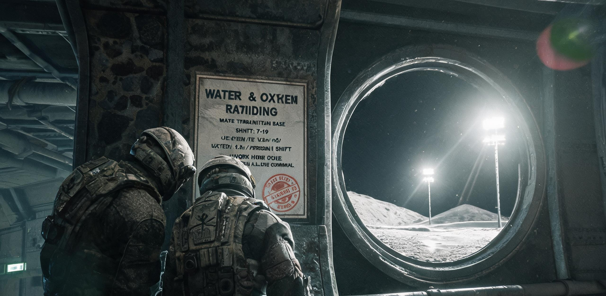

# 静海第一竖井先行居住区管委会公报
## 第 14 号：关于第 114 月夜期基础水氧配给顺位调整、常驻居留资格年度核验及维生争议仲裁决议的通报

**文号：** 静先管字〔2046〕第 014 号  
**签发机构：** 静海第一竖井先行居住区轮值管理委员会（生活保障科、工务与矿建总队、联合科研派驻组、医疗防疫所联合编制）  
**签发日期：** 公元 2046 年 11 月 04 日（地球协调时 UTC 08:00 / 静海地方时：第 114 月夜第 3 日）  
**有效期限：** 自发布之日起至第 115 月昼第 1 日（2046 年 11 月 19 日）止  
**密级与分发：** 全区公示（主充气廊道中央立柱、井下生活 A/B 舱信息栏张贴；基带微波回路抄送全员终端；抄送酒泉—文昌月面工程指挥部、休斯敦地月事务协调联络处备查）  

---

### 〇、前言与管委会工作简述

静海第一竖井先行居住区（原静海地质勘探 01 号充气锚定舱群及其下沉式玄武岩覆土生活舱，设计额定承载 50 人，当前在册在舱 64 人）已进入第 114 个连续月夜作业周期。

鉴于当前月面外部环境处于长达 354 小时的极低温（地表实测 -172℃）与太阳能光伏全停状态，全区生活与工业保障全面切入 1 号、2 号热中子裂变辅助动力堆（标称热功率 2×5 MWt，受制于辐射散热板微流星点状划伤，实际电能输出锁定为 1.52 MWe）联供工况。受南极水冰货运班次延误及 2 号水汽分离膜组件老化影响，本居住区在第 114 月夜期间面临淡水循环与高压氧气制备的结构性硬赤字。

依据《静海定居点多方共管与维生互助临时章程》（2044 年地月多方签署，2046 年春季第三次修正案）第 14 条及《月面公产管理条例》第 9 款，管委会经 2046 年 11 月 3 日全体驻留代表联席扩大会议审议表决，特发布本期水氧顺位调整、居留资格核验清册及四起资源争议仲裁裁决。

---

### 一、第 114 月夜期维生资源平衡表与调降依据

#### 1.1 淡水系统收支赤字与物料平衡
- **在舱在册人数：** 64 人（含中方工程建设与矿建掘进组 38 人、地月联合勘探与科研派驻组 18 人、后勤机电与医疗组 8 人）。
- **理论基准需求：** 按人均生理代谢水 2.2 L/人·日、卫生与擦拭用水 1.5 L/人·日、实验与气闸损耗 0.8 L/人·日计算，日均毛需水量为 288.0 L。
- **再生循环能力：** 尿处理蒸馏单元（VCD-02 机组）日产冷凝水 121.6 L；舱内环境湿气冷凝收集系统日回收 141.6 L；合计日回收水 263.2 L，实测全系统水回收率为 **91.4%**（低于月昼光照充足工况下的 94.2%）。
- **日均净亏空：** 24.8 L/日（全月夜周期累计净消耗储备水 372.0 L）。
- **战略储备现状：** 1 号玄武岩承压水窖现有纯化水储量 1,120 L，扣除不可动用之 720 L（法定 72 小时应急安全红线），可调配缓冲余量仅 400 L。
- **外部物流变动：** 原定于 11 月 2 日自沙克尔顿坑冷阱采水站发运的「极地-04」重型无人水冰货运车，因轮毂低温润滑脂析出导致驱动电机过载，滞留于阿方索环形山南缘，预计推迟 96 小时抵港。

#### 1.2 供氧与电力负荷调配
- **居住舱总压与氧分压控制：** 生活 A 舱、B 舱常压由月昼之 82.0 kPa 阶段性下调至 **76.5 kPa**；氧浓度维持在 25.5%，对应氧分压为 **19.5 kPa**（略低于海平面标准，略高于国家航天医学耐受下限 19.0 kPa）。管委会提请注意：部分人员晨起可能出现轻微前额胀痛与血氧饱和度暂降（92%—94%），属正常低气压适应代偿，医务室已在早操时段开放鼻导管吸氧 15 分钟/人次。
- **电解制氧机组工况：** 2 号 SPE 电解槽暂停日间常开模式，改由夜间低谷负荷（01:00—05:00 UTC）间歇式制氧，日均产氧量严格限制为 38.0 kg。

---

### 二、水、氧、电阶梯配给顺位（第 114 月夜执行方案）

自 2046 年 11 月 04 日 12:00 UTC 起，全区实行四级顺位管控。任何跨顺位资源调拨必须凭管委会主任与医疗监督员双签指令。

| 顺位等级 | 覆盖区域与作业人群 | 供水标准（每人/日） | 供氧与气压保障 | 供电与热控定额 | 违规调占责任 |
| :--- | :--- | :--- | :--- | :--- | :--- |
| **Ⅰ级（刚性保全）** | 医疗急救加压舱、中央指挥通信中枢、地表应急气闸出入口 | 饮用 2.5 L（全量温水）；医用洗消据实核拨 | 舱压 82 kPa，氧分压 21.0 kPa；高压氧疗舱 100% 待命 | 24 小时不断电；独立蓄电池组浮充备用；舱温维持 21±1℃ | 严禁任何民事与科研借用 |
| **Ⅱ级（重载生产）** | -120m 玄武岩竖井掘进爆破面、钛铁矿粗选初破碎工段、地表外勤巡检组 | 饮用 2.8 L（含电解质冲剂 0.5 L）；工后高压微雾擦洗 1.5 L | 外勤服 30 kPa 纯氧工况保障；井下作业面增设应急供氧终端 | 重载动力线按排班分时供电；除尘风道按三班两运转强排；舱温 19±2℃ | 私自停机或挪用动力电追究工务科责任 |
| **Ⅲ级（常驻生活与通识科研）** | 水培试验温室、机修车间、生活 A/B 舱内勤、管委会综合办公室 | 饮用 1.8 L（冷热分时供应）；公共淋浴**暂停**，改发医用消毒干洗擦拭巾 2 片/日 | 生活舱压 76.5 kPa，氧分压 19.5 kPa；夜间排风循环降频 20% | 个人照明限 15 W/床位；非作业时段生活舱插座断电；公用区恒温 17±2℃ | 私接加热器扣除当事人当月生活积分 |
| **Ⅳ级（随行观察与待岗复核）** | 地球派驻短期访问人员、待转运离岗人员、未达工时考核被通报人员 | 饮用 1.4 L；禁用公共热水系统，统一由中央食堂定时配发开水 | 统一安排于 B 舱二层密集铺位，执行最低适居通风标准 | 禁用个人扩展用电设备；睡眠舱辅热设定为 15℃ | 超配消耗由派出机构从下批运力中加倍冲抵 |

**附带管制细则：**
1. **餐具洗涤集中制：** 全区彻底禁止个人在各舱段水龙头下冲洗饭盒与水杯。全员用餐完毕后，餐具统一送交中央食堂超声波干雾清洗槽集中处理。
2. **冷凝水私接禁令：** 严禁任何人在舱体通风管路冷凝疏水阀处悬挂毛巾、塑料袋进行私自截留。截留冷凝水直接破坏全区湿度反馈传感器，一经检出，按私占公产论处并扣罚 30 工时积分。

---

### 三、2046 年度常驻人员居留资格年度核验与工时积分（L-Credit）清册

依《月面定居点居留权益评定办法》，月面无无偿驻留。每名常驻人员每月基础生存消耗核定为 480 点基准生存积分（涵盖公摊水、氧、热及辐射防护层维护）。该积分通过以下途径平衡：
1. **一线岗位基准工时折算：** 井下重体力（系数 1.8）、外勤出舱（系数 2.2）、机电与水培（系数 1.3）、内勤管理（系数 1.0）。
2. **派出母机构地月运力配额抵扣：** 凡科研或随行人员出现积分赤字，须由其母机构在后续地球补给发射窗口（如文昌长征十号甲货运班次、休斯敦商业补给船）向静海基地交割等质量之高纯水、液氢或分子筛备件。

本期居留资格年审共核验 64 人，合格 59 人，保留观察 3 人，预警遣返 2 人。

#### 2046 年度常驻居留核验与积分收支表（重点岗位及变动人员抽录）

| 姓名 | 工号 / 派驻机构 | 岗位与职责 | 年度基准负债 | 实际有效工时积分 | 派出机构运力贴补 | 净积分差额 | 年审结论 | 居住单元调整决定 |
| :--- | :--- | :--- | :--- | :--- | :--- | :--- | :--- | :--- |
| **赵大军** | JM1-0028 / 工务总队 | 竖井爆破高级工（掘进一班班长） | 5,760 | 7,420（井下出勤 284 班） | — | **+1,660** | **优等通过** | 优先分配 2047 年二期玄武岩深层双人舱位 |
| **孙铁柱** | JM1-0045 / 矿建总队 | 巷道支护与岩栓加固工 | 5,760 | 6,880（出勤 266 班） | — | **+1,120** | **合格** | 维持 A 舱下层标准居留单元 |
| **苏婉清** | BIO-0112 / 农林生态组 | 水培微藻与块根试验工程师 | 5,760 | 6,100（温室轮值+育种） | — | **+340** | **合格** | 维持 B 舱标准居留单元 |
| **理查德·沃恩** *(R. Vaughan)* | INT-0009 / 地月联合科学署 | 月幔玄武岩同位素测定（美方派驻） | 5,760 | 3,920（科研工时折算） | 肯尼迪航天中心批注：CZ10A 对接航次代交 45kg 液氢 | **-140（已平）** | **条件通过** | 冲抵后清零；维持 B 舱单人科研观察铺位 |
| **周小舟** | LOG-0081 / 后勤保障科 | 仓储盘点与气闸物资过磅员 | 5,760 | 5,820（全勤） | — | **+60** | **合格** | 维持 A 舱标间 |
| **马超** | JM1-0099 / 工务学徒 | 地表推土装载机副驾驶 | 5,760 | 4,210（出勤不足，病休 42 天） | — | **-1,550** | **预警留用** | 转入月夜深孔除渣志愿队补工时；暂调入 B 舱密集铺 |
| **让-皮埃尔·杜波依斯** *(J. Dubois)* | OBS-0004 / 国际天文学会 | 甚低频射电阵列调试（外聘专家） | 5,760 | 3,400（阵列因日冕爆发停工） | 欧洲空间联络处申请推迟至 2047Q1 结算 | **-2,360** | **暂缓核准** | 列入待转运回地名单，排入 12 月 CZ-10 客运返程舱位 |

*注：积分净赤字超过 1,000 点且无母机构运力担保者，管委会依据章程第 22 条终止其在静海基地的生活保障配额，当事人享有 15 个地球日的书面申诉期。*

---

### 四、近期维生资源争议与管委会仲裁决议

自第 112 月夜以来，居住区内部因水、气、空间占用产生多起权益冲突。仲裁小组本着“物理硬约束第一、维生安全优先、兼顾历史贡献”之原则，公布下列四起典型案例的处理裁决：

#### 【案由 01】水培三号试验床红薯杂交苗越权引水案
- **当事人：** 生态农艺组 苏婉清、陈海
- **事实经过：** 10 月 28 日，水培温室 3 号床进行地月杂交高淀粉红薯试种。因环境相对湿度由 65% 骤降至 42%，苗株出现急性萎蔫。农艺组未向水务值班室申请紧急用水单，私自将 2 号营养液混合罐的旁通阀切入主供水管，超指标引水 **148.0 L**。
- **各方主张：** 动力与水务科主张按“盗用公用储备水”定性，扣罚农艺组全员每人 100 积分并停发下月微藻蛋白粉配给；农艺组申辩称该批红薯系 2047 年实现主食本土化 15% 替代之国家关键试验，枯死将导致前序四个航行年的基因纯化成果全损。
- **仲裁裁决（静仲裁〔2046〕09 号）：**  
  1. 鉴于作物保全具有明确的全区长远公产价值，免予农艺组个人纪律处分；
  2. 超耗淡水 148 L 中，**70%（103.6 L）** 计入全区公共科研损耗公摊；**30%（44.4 L）** 由农艺组 2046 年度科研机动积分抵扣；
  3. 农艺组必须在第 115 月昼第一茬红薯收获时，向全区食堂无偿上缴不低于 20 kg 的可食用块根及嫩叶，作为水费实物回补；
  4. 责令水务科 24 小时内将温室供水阀加装电子密码联锁，杜绝私自开阀。

#### 【案由 02】外籍派驻学者私接个人加压充氧睡袋案
- **当事人：** 地质测绘专家 理查德·沃恩 *(R. Vaughan)*
- **事实经过：** 11 月 01 日凌晨，B 舱 204 室出现局部气压异常波动。巡检员发现当事人因长期低重力导致睡眠性通气障碍，私自将地表外勤应急背包内的 2 L/30 MPa 便携氧气瓶改装为减压鼻罩，在个人铺位连续吸氧 6 小时，消耗高纯氧 280 L（标况），并引发生活舱局部氧浓度超标（达 28.2%，触发一级火险告警）。
- **当事人申辩：** 称月面 1/6g 导致严重体液头向转移与睡眠呼吸暂停，多次向联合医疗所反映未获解决，自用气瓶系个人外勤装备，非公用管道气体。
- **仲裁裁决（静仲裁〔2046〕10 号）：**  
  1. 外勤应急氧气瓶属于月面逃生刚性战备物资，禁止任何个人用于日常非紧急医疗代偿；局部氧浓度超过 25% 严重威胁充气舱防火安全；
  2. 扣罚当事人工时积分 80 分；通报批评并抄送休斯敦协调联络处；
  3. 医疗防疫所承认在低重力睡眠辅助器械配置上存在滞后，责令医务室于 3 日内为当事人调配一台正压气道微型通气机（使用舱内常温空气循环，严禁富氧）；
  4. 当事人下两个月夜周期的个人公共淋浴配额减半（折合节水 12 L，冲抵氧气净化再生电耗）。

#### 【案由 03】竖井爆破二班利用主回风百叶窗搭建「烘干衣架」阻断通风案
- **当事人：** 井下掘进二班班长 王有德 及全班 8 人
- **事实经过：** 10 月 30 日晚班下井后，二班人员因穿戴防尘重装在 -120m 爆破面作业，排汗浸透内层保暖衣，加之月尘附着产生硫化物异味。返舱后，班组人员将 8 套湿透的阻燃内胆私自用玄武岩纤维绳悬挂在 A 舱 1 号主排风总管百叶窗前，利用回风气流烘烤衣物。导致主风道迎风阻力上升 34%，引发生活区总压差传感器连锁报警，部分卧舱二氧化碳局部浓度超标至 1.2%。
- **仲裁裁决（静仲裁〔2046〕11 号）：**  
  1. 阻断全舱主生命支持风道属于严重违规行为，对王有德处以记过一次，全班通报批评；
  2. 考虑井下作业服潮湿不仅引发皮肤真菌感染，更会导致微重力下失温，工务科负有生活后勤保障不力之责；
  3. 责令工务科在 48 小时内利用反应堆二级回路余热换热管，在生活 A 舱通往气闸的减压缓冲段焊接一组「玄武岩废热烘衣架」，每日限定 18:00—22:00 开放使用；能耗由工务科公摊支出，严禁再次占用主通风口。

#### 【案由 04】测控雷达天线基座热融冷凝水归属争议
- **当事人：** 通信测控值班组 VS 动力与水务科
- **争议焦点：** 地表 S 频段高增益对地测控天线基座采用循环热管除冰，月昼转向月夜温差变化中，基座导流罩内每日凝结约 3.2 L 高纯蒸馏水。测控组认为该水系天线机组自带温控产物，且位于测控红线区内，测控组有权留存用于精密光学镜头擦拭与值班冲饮；水务科主张月面任何冷凝水皆属全区公共维生财产，必须无条件注回中水储罐。
- **仲裁裁决（静仲裁〔2046〕12 号）：**  
  1. 重申《月面公产管理条例》第一条：月球地表与地下定居点管辖范围内，一切形式之游离态水分子皆属法定不可分割之公有资产，任何科室无私有处置权；
  2. 测控组已截留之 14 L 冷凝水限 2 小时内上缴水务科中水净化总站；
  3. 鉴于测控光学镜头清洁确系保障地月测控链路（1.3 秒延迟生命线）所必需，由物资库房向测控组定额核拨工业无水乙醇擦拭包 10 套，不得以纯水代替精密溶剂。

---

### 五、下阶段地月货运补给窗口（长征十号甲 / 商业货运-08）物资平衡预案

预计下一个地月转移轨道货运交割窗口为公元 2046 年 12 月 19 日（对应第 115 月昼中期）。经管委会向地球指挥部报备，本次到港物资重点向水氧再平衡与重工业耗材倾斜：

#### 5.1 紧缺物资上行清单（部分关键项）
1. **纯化与分离核心备件：**
   - 离子交换树脂柱（工业级）× 6 组（净重 180 kg）
   - 固体胺二氧化碳吸收床组件 × 4 套（净重 220 kg）
   - 聚四氟乙烯（PTFE）抗月尘高效微孔滤芯 × 120 只（净重 45 kg）
2. **战略生存储备补充：**
   - 30 MPa 碳纤维高压气氧瓶组 × 16 组（折合纯氧 320 kg）
   - 浓缩微量元素与电解质母液 × 50 L
   - 第三代口服抗骨吸收与促钙沉积复合制剂 × 1,500 人份/月
3. **精神与生活补给配额（按人头刚性核配）：**
   - 家属纸质信件与低剂量辐射灭菌印刷品：全员配发上限 **0.5 kg/人**（严禁超重，超重部分由地面转为数字格式传输并在公共屏轮播）。
   - 传统腌渍蔬菜复原包（榨菜/雪菜）：每人配发 4 听（用于改善重体力矿工因单调脱水糊类食品导致的食欲减退）。

#### 5.2 离港返地人员排程预审
根据医疗所健康监测与本次积分年审结论，本航次返程舱（最大允许过载 3.8g）核准 4 名人员离岗返回地球：
1. **韩建国（工号 JM1-0012）：** 早期竖井开凿工，腰椎骨密度较基线丢失 21.4%，双膝滑囊严重月尘性无菌炎症，准予退休返地康复；
2. **让-皮埃尔·杜波依斯 *(J. Dubois)*：** 积分赤字未清且阵列项目结题，依章程遣返；
3. **林小曼（工号 MED-0018）：** 联合医疗所护士，完成 24 个月驻留轮换期，正常轮换交接；
4. **陈海（工号 BIO-0115）：** 农艺助理，因深部气闸减压病后遗症，经专家组会诊转回地面治疗。

---

### 六、签署、用印与生效

本公报经管委会五方代表联合签署，即刻生效。各舱段值班员须在 2 小时内完成各自防区内的配额阀门调校与公示宣贯。

**轮值管理委员会主任：**  
顾廷坚 *(签字/工号：GOV-0001)* （签章）  

**中方矿建与工务总指挥：**  
刘宗明 *(签字/工号：ENG-0004)* （签章）  

**地月联合科研派驻组代表：**  
理查德·沃恩 *(签字/工号：INT-0009)* （签章）  

**井下矿工与重体力代表：**  
赵大军 *(签字/工号：JM1-0028)* （签章）  

**联合医疗与防疫监督员：**  
索菲娅·罗曼诺娃 *(签字/工号：MED-0002)* （签章）  

**公章用印：**  
`【静海第一竖井先行居住区轮值管理委员会·紧急维生管制专用章】（月面玄武岩板激光蚀刻印）`  
`【地月矿业与勘探联合体驻静海办事处】（骑缝章）`  

---

### 附录：生活 A 舱公告栏下方手写留言与便签抄录（档案留存）

> *「第 114 月夜第 3 天。洗发巾一股浓烈的漂白水味，但我闻着比月尘的火药味强多了。老赵，二班烘衣服的架子什么时候焊好？我防护服内衬快长出蘑菇了。」*  
> ——（圆珠笔蓝墨水手写，署名：巷道掘进三组·小徐）

> *「致管委会：沃恩博士的呼噜声比气压阀还响。既然给他配了正压呼吸机，能不能把他的铺位从 B 舱中间调到靠近排风扇的角落？算我们全舱求你们了。」*  
> ——（铅笔手写便签，贴于公报右上角，下方有 7 个不同笔迹的“附议”勾选）

> *「管委会回复：烘衣架已于今日 16:00 焊装完毕，接 2 号废热管，每次限挂 2 小时，严禁烘烤塑料鞋底。沃恩博士铺位已于晚饭后移至 B-12（排风侧）。请大家保持耐性，离月昼还有 240 小时。」*  
> ——（红色油性笔批注，后勤值班员·老周）

---

## 图片提示词

一张张贴在静海第一竖井充气生活舱玄武岩纤维粗糙墙板上的水氧配给公报，纸张边缘微微卷起，带有热敏打印特有的灰黑网点与红色印鉴；旁边是一面带细密划痕的厚重气闸观察窗，窗外是月夜深黑死寂的真空天幕与地表刺眼的作业硬光；两名穿着沾满泥灰色月尘工作服的矿工正凑近辨认表格上的工时积分，身旁裸露着巨大的充气肋骨与金属风管；极高工业质感与微小尺度对比，大画幅档案纪实风格。

Ultra-wide cinematic shot, a weathered, thermal-printed water and oxygen rationing notice pinned to the rough basalt-fiber composite bulkhead of a pressurized habitat module in the Mare Tranquillitatis base, its edges curling slightly with faded dot-matrix typography and vivid red circular stamps; beside it, a thick, scratched circular airlock viewport reveals the pitch-black vacuum of the lunar night and blinding industrial floodlights raking across gray regolith; two miners in bulky, dust-caked IVA undersuits lean in close to decipher the faded work-hour credits and allocation tables, dwarfed by colossal pneumatic support ribs and exposed overhead ventilation ducts; extreme archival documentary realism, tactile heavy-duty engineering texture, Hasselblad medium-format 65mm look, cold vacuum lighting, muted steel, charcoal regolith, and basalt tones.

---

## 修订记录（元层，非世界内容）

- 2026-08-18（主编辑审校）：小修 1.1 节淡水再生循环分项数据（环境湿气冷凝日回收 132.8 L→141.6 L，使得 121.6+141.6=263.2 L 与 91.4% 回收率、24.8 L/日 净亏空及全月夜 15 天 372.0 L 累计消耗实现完全精确对账）；与同批 2044 年《静海先遣基地对冲单》、既有正典 2058 年《工间播音简报》、2067 年《矿工排班报告》《建材对账单》等完成年代、人口、技术演进及物理参数全量互锁核验。
