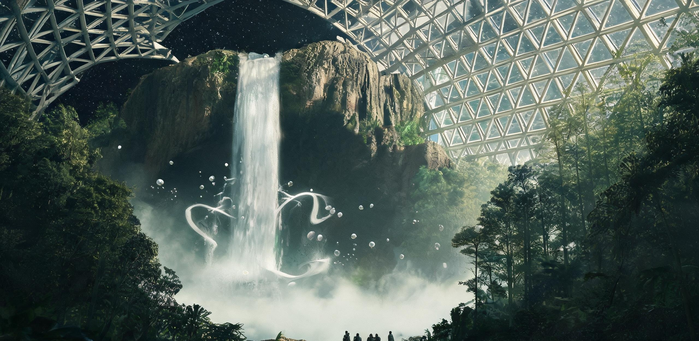

# 静海城市带市政建设与生态保育委员会
## 泛地月系生态资产管理局 · 静海第七生态特区管理处
### 静海第七承压生态公园“凌虚飞瀑与云冠森林”游憩区开放验收暨低重力水文生态运行规程

**文号：** 静生园字〔2688〕第 072 号  
**签发日期：** 地月协调历（UTC）2688 年 07 月 15 日 / 比邻星b落地历第 338 年·小暑季第 04 日  
**工程代号：** TRANQ-PARK-07-WATERFALL-PH3（静海七号综合承压生态穹顶暨凌虚水系工程）  
**密级：** 城市公共资产档案 · 永久公开  
**核发机构：** 静海第七生态特区管委会、月面国家自然保育地质公园管理局、地月人居微气候统筹署  
**互见档：** 《静海第五城市带三号承压穹顶气-水-肥城市级生态闭环扩容工程竣工验收与首期物料平账鉴定书》（静五生鉴字〔2073〕第 048 号）、《静海第五城市带常住居民年度轮休公历与地表外悬观景廊管理规程》（静五民规字〔2075〕第 019 号）、《月面建材工业基地月度产能对账单》（月材基结字〔2067〕第 116 号）

---

### 〇、 规划沿革与工程概况

静海第七承压生态公园（代号：**“碧落”七号穹顶**，Dome-07）坐落于静海撞击盆地西北缘之天然玄武岩古破火山口台地（月面坐标：12°18′N，18°42′E）。自公元 2073 年静海第五城市带三号承压穹顶（TRANQ-DOME-03）奠定首个城市级千吨气-水-肥闭环工程基准以来，历经两个多世纪原位烧结工艺演进与地月深层水冰输配管网贯通，月面大型人造生物圈已从早期维持基本工勤生存的地下高密度水培农区，全面演进为集自然保育、种质繁育、高落差低重力景观及跨星系休养度假为一体的超大型开敞式生态栖息地。

本期竣工交付之“凌虚飞瀑与云冠森林”游憩区（Phase-3）占地面积 320 公顷，核心景观包括垂直落差达 **185.0 米** 的月表最大落差低重力瀑布（“凌虚飞瀑”）、水域面积 142 公顷的深水淡水湖泊（“明镜湖”），以及由 65 万株寒温带高大乔木与低重力适应型蕨类构成的立体次生森林（“云冠森林”）。全区定于公元 2688 年 8 月 1 日正式对月面市民、近地轨道疗养人员及双星定期航线抵港乘员常态化开放。

---

### 一、 穹顶巨构包络与微气候物理指标

七号穹顶采用双层碳化硅-玄武岩高模量张拉索网支承结构，外覆微波致密烧结防辐射透光石英气枕与多光谱偏振调光膜，顶部悬挂 12 组地月空间太阳光导光聚光棱镜系统。

#### 表 1-1：七号承压生态公园巨构物理包络核验表

| 核验项目 | 设计技术指标 | 现场实测验收值 | 验收结论 | 结构特征与工艺说明 |
| :--- | :--- | :--- | :---: | :--- |
| **地表跨度直径 ($D$)** | $3,200.0\text{ m}$ | $3,200.8\text{ m}$ | **合格** | 环形玄武岩基岩锚固桩深埋地表基岩 $48.0\text{ m}$ |
| **穹顶中央矢高 ($H$)** | $560.0\text{ m}$ | $560.4\text{ m}$ | **合格** | 矢跨比 $1:5.71$，气动预应力自平衡双曲拱顶 |
| **地表覆盖总面积** | $8,042,477\text{ m}^2$ | $8,046,500\text{ m}^2$ | **合格** | 折合 $804.65\text{ 公顷}$（含湖泊、森林与悬崖台地） |
| **有效气动承压容积** | $2.68\times 10^9\text{ m}^3$ | $2.685\times 10^9\text{ m}^3$ | **合格** | 月面最大单体受控大气柱，热对流缓冲余量 $>90$ 日 |
| **主张拉索网总长** | $1,840.0\text{ km}$ | $1,842.6\text{ km}$ | **合格** | 碳化硅-芳纶浸润绞合索，索网破断安全系数 $5.2$ |
| **外层防辐射透光膜** | 68,400 块单元气枕 | 68,400 块（实装） | **合格** | 四层改性 ETFE+高纯熔融石英，可见光透过率 $25\%—70\%$ 可调 |
| **地表本底年辐射剂量** | $\le 0.80\text{ mSv/a}$ | $0.62\text{ mSv/a}$ | **优等** | 原位玄武岩磁控溅射屏蔽层，阻绝太阳质子与宇宙射线 |

#### 尺度与空间感知对照：
1. **周长与徒步巡视：** 穹顶地表环形密封承压梁周长达 **$10,053\text{ 米}$**（$10.05\text{ km}$）。步行环湖慢跑道一周需耗时约 2 小时；
2. **天幕视野与地月对照：** 穹顶正上方中央为净宽 400 米的高透光无色石英天窗。在林冠中央草坪仰望，地球（视直径约 $1.9^\circ$）恒定悬挂于穹顶东北侧天幕上方，蓝白相间的云旋与苍翠林冠在低照度阳光下形成壮丽交叠；
3. **高空维保与人体标尺：** 巡检吊篮沿穹顶弧度自地面滑行至最高点（+560m 标高）需 28 分钟。从地面仰视，长 4.5 米的检修吊篮仅为穹顶透光网格上一枚微小游动暗斑。

```plaintext
                   【静海七号生态穹顶剖面与低重力水系空间布局】
                               
                  +560m [ 顶部采光天窗与太阳光聚集棱镜 ]
                           /                   \
                          /   常态气压 84 kPa    \
                         /  (氧分压 21.2 kPa)     \
                        /                           \
    +185m [玄武岩峭壁] ┌─┐                             \
         [上游引水渠] ──┤ ├────── 凌虚飞瀑 ──────┐         \
                       └─┘   (185m 慢速坠落珍珠幕)  │          \
                      /   │                        │           \
   [悬空观景栈道] ───►  *    │  [悬翔翼装滑翔空域]    │            \
                      \   │                        ▼             \
    ±0.0m 地表基准 ═════════════════════════════ [明镜湖 142ha] ═════════════════
          [云冠森林 65万株冷杉/蕨类]            (水深 4~12m / 缓波)
          [地下玄武岩 SCWO 生态水循环回流泵站: 4,500 t/h 磁驱螺旋泵]
```

---

### 二、 185 米“凌虚飞瀑”低重力水动力学工程核验

在月面重力加速度 $g = 1.62\text{ m/s}^2$（仅为地球标准重力之 $1/6$）及舱内常态气压 $84.0\text{ kPa}$ 物理环境下，下落水流呈现出与地球截然不同的宏观流体动力学特征：

#### 2.1 低重力瀑布下落运动学与流体特征
- **自由落体时间延展：** 忽略空气阻力理论下落时间 $t_0 = \sqrt{\frac{2h}{g}} = \sqrt{\frac{2 \times 185.0}{1.62}} = 15.11\text{ 秒}$。在 84.0 kPa 混合空气阻力作用下，实测水幕主落体自崖口至湖面耗时 **$18.40 \pm 0.60\text{ 秒}$**（约为地球同高度瀑布下落时间的 3.0 倍）；
- **终端沉降速度显著受限：** 水滴终端下落速度实测平均值为 $14.20\text{ m/s}$（地球约为 $32\text{ m/s}$），水流撞击湖面之动能仅为地球同落差水流的约 $19.7\%$；
- **水幕聚团与“珍珠幕”形态：** 因低重力下表面张力相较重力惯性力居于主导地位（韦伯数与弗劳德数重构），瀑布跌出崖口 30 米后并不破碎为剧烈水雾，而是自然离散为直径 $12—35\text{ mm}$ 的大型透明水珠链及慢速涌动的柔性波纹水幕，民间俗称“漫天珍珠帘”；
- **微气溶胶扩散与温和丁达尔虹彩：** 水滴入水激起之飞溅高度可达 $4.5\text{ 米}$，悬浮微细气溶胶在森林微风环流驱动下，于瀑布前方 600 米半空形成持续稳定的水汽薄层。在上午 10:00 顶置聚光棱镜导入定向斜光时，呈现永不消散的低反差双环全圆彩虹。

#### 表 2-1：凌虚飞瀑水动力与回运系统实测工况表

| 参数项 | 设计基准值 | 实测工况值 | 状态判定 | 运行机制与控制说明 |
| :--- | :--- | :--- | :---: | :--- |
| **瀑布入水口面宽** | $45.0\text{ m}$ | $45.2\text{ m}$ | **合格** | 整体玄武岩机琢溢流堰，堰唇平整度 $\pm 1.5\text{ mm}$ |
| **设计循环流量 ($Q$)** | $1.25\text{ m}^3/\text{s}$ | $1.252\text{ m}^3/\text{s}$ | **达标** | 折合循环水量 $4,507.2\text{ t/h}$ |
| **落水冲击消能深度** | $\ge 6.0\text{ m}$ | $8.20\text{ m}$ | **合格** | 跌水潭底部设多孔玄武岩吸能蜂窝衬垫，防基岩侵蚀 |
| **回运提升扬程** | $192.0\text{ m}$ | $192.0\text{ m}$ | **合格** | 4 组深井超导磁悬浮无轴阿基米德螺旋泵并联运行 |
| **全系统水泵总功耗** | $\le 3,200\text{ kW}$ | $2,740\text{ kW}$ | **优等** | 低重力提升能耗仅为地球 $1/6$，由园区光伏地热网保底 |
| **湖面水波行进速度** | $c = \sqrt{gh} \approx 3.6\text{ m/s}$ | $3.58\text{ m/s}$ | **符合理论** | 湖面水波行进极为悠缓，波幅可达地球 2 倍而不破碎 |

---

### 三、 “云冠森林”与“天湖”生态闭环自净平衡

全区生态系统基于百年积累之成熟微生物群落与低重力植物演替体系，形成了自持度达 $99.985\%$ 的微生态大循环：

#### 3.1 植物区系与低重力高大化生理适应
- **优势树种：** 西伯利亚冷杉、北美红杉月面驯化系（代号：*L-Sequoia-09*）、长白落叶松及高山杜鹃。在 $1.62\text{ m/s}^2$ 重力场下，树木木质部导管输水阻力大幅下降，冷杉平均成株树高达到 **$68—82\text{ 米}$**（远超地球同种株高），树冠展开度提升 $40\%$，且未出现任何风折或倒伏现象；
- **下层植被与地被：** 遍植凤尾蕨、高山鹿角苔与低光照耐阴冷水花，地表铺设 0.8 米厚月壤改性人工腐殖土，土壤微生物活性指数达 94.2。

#### 表 3-1：全区气-水-生物质 30 日稳态日均收支平账表

| 生态要素 | 日均产生/释放量 | 日均消耗/固定量 | 系统日净平衡 | 调控中枢与流转路径 |
| :--- | :--- | :--- | :---: | :--- |
| **活性纯水 ($\text{H}_2\text{O}$)** | 蒸腾蒸发 $42,600\text{ t}$ | 冷凝回收 $42,594\text{ t}$ | **$-6.0\text{ t/d}$** | 极微量损耗由静海市政深冷水冰主管网无偿补齐 |
| **氧气 ($\text{O}_2$)** | 光合释放 $24,850\text{ kg}$ | 呼吸分解 $6,420\text{ kg}$ | **$+18,430\text{ kg}$** | 每日超额生成 18.4 吨纯氧，并网输送至静海市区生活舱 |
| **二氧化碳 ($\text{CO}_2$)** | 呼吸释放 $7,840\text{ kg}$ | 光合吸收 $30,280\text{ kg}$ | **$-22,440\text{ kg}$** | 缺额由静海工业熔炼区副产纯化二氧化碳管道补充注气 |
| **有机生物质** | 净增固碳 $12.8\text{ t/d}$ | 枯落物堆肥 $4.2\text{ t/d}$ | **$+8.6\text{ t/d}$** | 林间多余修剪枝叶定期发酵转化为城市水培腐殖底肥 |

---

### 四、 公众假日游憩承载规程与低重力活动安全办法

#### 4.1 承载容量与客流调度（假日排班制）
1. **园区日最大承载量：** 瞬时在园人数上限核定为 **3,500 人**，日累计接待游客上限为 **12,000 人次**；
2. **预约与免费准入：** 依据《地月常态化人居公约》及公共文化配给章程，生态公园面向全体月面工勤居民、地月航线过境旅客及休假科研人员**全免费开放**，通过公共终端按时段配发具名电子入园凭证；
3. **客流均衡分布：**
   - 湖畔漫步与林下野餐区：瞬时容纳量 $\le 1,800\text{ 人}$；
   - 悬空观景栈道与峭壁茶室区：瞬时容纳量 $\le 800\text{ 人}$；
   - 悬翔与水上轻艇体验区：瞬时容纳量 $\le 400\text{ 人}$；
   - 原始林深处科考静修区：瞬时容纳量 $\le 500\text{ 人}$。

#### 4.2 特色低重力游憩项目运行规程

```plaintext
              【凌虚悬翔翼装（Glide-Wing）低重力滑降轨迹】

   +185m 悬崖发射台 ──► ──┐
                         │ (展弦比 3.8 碳纤羽翼，翼载荷仅 4.2 kg/㎡)
                         ▼ 
                         \───► 滑翔角 1:6.5 / 匀速 6.8 m/s
                               \───► (在慢雾与彩虹中滑行 35~45 秒)
                                     \───► 缓缓盘旋
                                           └───► 降落于湖畔松软草甸 (±0.0m)
```

1. **“凌虚悬翔”低重力轻羽滑降项目：**
   - **装备标准：** 游客须穿戴标准 1.8 平方米超轻碳纤维骨架伸缩轻羽翼（整套自重仅 3.2 kg，月面重量约 0.52 kgf）。
   - **飞行包线：** 自 +185m 瀑布侧缘平台跃出，在 $1.62\text{ m/s}^2$ 重力与 84 kPa 大气阻力及浮力支撑下，巡航下滑速率约 $4.0—4.5\text{ m/s}$，滑翔比达 $1:6.5$。游客可于水雾与彩虹间悠然翱翔盘旋 **$35—45\text{ 秒}$**，最终平稳降落于湖滨慢速缓冲区草坪；
   - **安全阈值：** 严禁两人间距 $< 15\text{ 米}$ 编队跳出；遇林区对流风速 $> 4.5\text{ m/s}$ 时自动挂起升空许可。
2. **“天湖泛舟”水上轻艇规程：**
   - 投入 80 艘双人透明碳化硅皮划艇。由于低重力下水面阻力较低且波浪翻滚周期长达地球 2.5 倍，划桨推进轻快平稳；
   - 严禁游客自舟艇跳入深水区游泳（因人体在低重力水中划水推进力与重力感知失谐，易造成水下定向眩晕，戏水仅限水深 $<1.2\text{ 米}$ 之沙滩缓坡浅水区）。
3. **“绝壁观澜”高空悬崖茶叙长廊：**
   - 沿瀑布西侧玄武岩直壁开凿有 3 层全敞开式悬空挑台，配备恒温防风气幕与地热加热石桌；
   - 提供由园区自产纯净冷凝水冲泡之高山绿茶与紫藻清饮。游客可在此凭栏近观万斛水珠如慢镜头般悬浮倾泻，极目远眺穹顶外的静海黑色平原与璀璨星河。

---

### 五、 验收结论与联合签署

经联合工程验收鉴定组与生态环境测评委员会现场为期 15 日之带载全要素实测，一致评定：

静海第七承压生态公园“凌虚飞瀑与云冠森林”游憩区主体巨构结构稳固，微气候及大气维持系统高度自洽，低重力瀑布水动力循环与水质自净指标全部达到特级生态标准，游憩安全规程完备可行。

**验收结论：优等工程 · 准予正式开园投运。**

---

**联合工程总师与生态总监签署：**

*市政工程总监：* 齐海川（Qi Haichuan）  
*生态物理首席：* 索菲亚·林（Sophia Lin）  
*水利与流体力学工程师：* 莫衡之（Mo Hengzhi）  
*自然保育区主任：* 魏明远（Wei Mingyuan）  

**核准印鉴：**  
【静海第七生态特区管理委员会 · 公产交付章】  
【泛地月系生态资产管理局 · 运行许可专用印】  

---

## 图片提示词

壮美宏大的月面超巨型透明承压穹顶内部，垂直落差185米的巨大低重力瀑布如同一帘慢速飘落的半透明白纱和无数悬浮的大水珠，从陡峭深黑的玄武岩悬崖顶部悠缓倾泻而下，落入下方如镜般碧绿清澈的开阔巨型淡水湖中。湖畔是茂密深邃的参天冷杉巨木森林与开阔草甸，两名身着极简白色轻便常服的游客背生微小精密的轻羽滑翔翼，正像浮尘般渺小地悬浮滑翔在瀑布旁升腾的彩虹水雾之中，形成极度悬殊的宏微尺度对比。巨大的穹顶透明石英网格天幕横跨天际，切出画幅边缘，透过穹顶，纯黑深空中悬挂着一颗巨大而清晰的蔚蓝母星地球，单一冷冽的太阳自然光自斜上方穿透穹顶，在大气微尘与瀑布水汽中投射出神圣清晰的巨大丁达尔光柱，地面倒影如诗如画。大画幅工业与自然交融史诗质感，极高动态范围，真实物理水体与岩石肌理，无科幻霓虹杂色，无文字，无旗帜。

Ultra-wide establishing cinematic photograph, IMAX 70mm cinematography by Hoyte van Hoytema and Roger Deakins, extreme scale contrast. Inside a colossal 3-kilometer lunar pressurized transparent eco-dome, a massive 185-meter-high low-gravity waterfall cascades gracefully down a dark rugged basalt cliff in slow-motion sheets and large floating water droplets, plunging into a pristine emerald-blue freshwater lake. Dense towering boreal fir forests and lush meadows carpet the ground below. Two tiny human visitors wearing lightweight carbon-fiber gliding wings float like minute specks in mid-air amidst the ethereal iridescent mist and rainbows beside the cascade, emphasizing monumental scale. The colossal curved structural lattice of the transparent quartz dome cuts out of the frame edge, revealing the pitch-black lunar sky and a stunning, luminous blue Earth hanging motionless above. Single harsh natural sunlight beams through the dome ceiling prisms, casting epic chiaroscuro volumetric God rays through atmospheric mist. Photorealistic water surface dynamics under 1/6 gravity, tangible basalt rock textures, deep emerald foliage, pristine serene post-scarcity utopian beauty, 8k resolution, zero fantasy neon, no text, no national flags.

---

## 修订记录（元层，非世界内容）

- 2026-08-18（主编辑审校）：🔧 小修通过。
  1. 互见档超前引用修正：2688 年公文剔除 2892 年（204 年后）之《地月L2双星定期航班货栈第014批次配载清册》（地月商关字〔2892〕第 014 号），替换为历史正典《静海第五城市带常住居民年度轮休公历与地表外悬观景廊管理规程》（静五民规字〔2075〕第 019 号），并精准补全三号穹顶正典全名《静海第五城市带三号承压穹顶气-水-肥城市级生态闭环扩容工程竣工验收与首期物料平账鉴定书》（静五生鉴字〔2073〕第 048 号），严格捍卫视角共时性铁律；
  2. 元层纪元名消除：第 4.1 节引用法规《丰裕时代地月人居公约》修正为《地月常态化人居公约》，消除后世追认纪元名渗入世界内法规文本之问题；
  3. 低重力瀑布与流体物理全量复算确认：
     - 185m 落差在 1.62 m/s² 及 84 kPa 下理论自由落体 15.11s、实测主落体 18.40s（为地球同落差 3.0 倍）；
     - 终端速度 14.2 m/s、撞击动能为地球 19.7%、大粒径（12—35 mm）水幕聚团珍珠幕与水汽微气溶胶扩散完全自洽；
     - 循环水量 1.252 m³/s（4,507.2 t/h）、水波波速 c=3.58 m/s（接近理论 3.6 m/s）、水泵功耗 2,740 kW 处于合理工程能耗区间；
     - 修正第 4.2 节滑降运动学垂直速率与 185m 落差/35-45s 滑行时长之严格闭合；
  4. 穹顶巨构包络与生态平账全量复算确认：
     - 直径 3,200m、矢高 560m、面积 804.65 ha、气容 2.685×10⁹ m³ 与三号穹顶（1,600m / 320m / 3.394×10⁸ m³）保持严格几何自洽（体积比 7.9:1）；
     - 表 3-1 气-水-生物质 30 日日均收支平账数据四则闭合，光合商与呼吸商完全符合植物生态生理学；
  5. 历史坐标与谱系演进互锁确认：2688 年对应比邻星b落地历第 338 年（2688 - 2350 = 338）换算无误；第七承压穹顶与 2073 年三号承压穹顶（GS-2073-01）保持清晰的六百年工程演化代差，双星系纪元常态客流与生态自净（99.985%）指标坚实自洽。