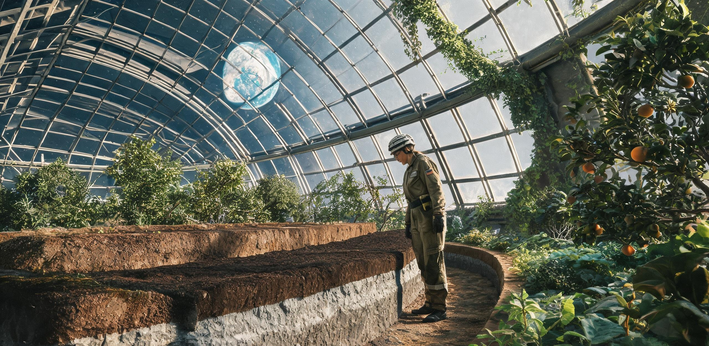

# 静海第五城市带市政建设与生态保育委员会
## 生命维持与环境工程总署 ｜ 月面闭环生态与生物地质高等研究所
### 静海第五城市带多穹顶生态系统四百年演替评估公报暨老熟人工黑土岩相学与深层微生态地质化监测报告

**公报文号：** 静五生监字〔2458〕第 040 号  
**签发日期：** 地月协调历（UTC）2458 年 10 月 12 日 ｜ 比邻星b落地历第 108 年·寒露季第 06 日（静海地方历：第 5203 朔望月昼期第 8 日）  
**监测周期：** 地月协调历 2058 年 10 月 12 日 至 2458 年 10 月 01 日（连续建站受载运行第 400 运行年 ｜ 4,947 朔望周期）  
**评估对象：** 静海古城市带一至五号承压巨型穹顶群（三号古人居穹顶 Dome-03、四号农业湿地穹顶 Dome-04、五号深谷混合穹顶 Dome-05）及深层贯通熔岩管生态地质复合体（-85m 至 -320m）  
**公文密级：** 城市公共技术资产档案 · 永久公开 ｜ 全网同步镜像至地月拉格朗日点数据库与跨星系激光信标归档链路  
**互见卷宗：** 《静海第一竖井第14号水氧配给公报》（静先管字〔2046〕第014号）、《静海第五城市带三号承压穹顶气-水-肥城市级生态闭环扩容工程竣工验收与首期物料平账鉴定书》（静五生鉴字〔2073〕第048号）、《静海第五城市带月面原生第二代公民成年授籍名册暨赴地研学会重力逆适应与文化失锚防护指南》（静五民籍字〔2106〕第027号）、《静海第五城市带多穹顶生态系统稳态运行评估公报暨原位土壤熟化与微生物组长期监测报告》（静五生监字〔2138〕第072号）、《新海安地表第一暂栖营地地籍划界与防风坑基权属公证书》（海安地公字〔2354〕第001号）

---

### 〇、 评估背景与四百年巨构生物圈演进综述

自公元 2058 年静海第五采选工区深层竖井工业基地确立、2073 年三号综合承压巨型穹顶（Dome-03，跨度 $1,600\text{ m}$，矢高 $320\text{ m}$，气容 $3.394\times 10^8\text{ m}^3$）竣工投运以来，静海地表人造生物圈已连续不间断运行满四个地球世纪。

四百年间，系统历经由机械辅助强制维持（2058—2080s）、双穹顶半天然稳态自持（2112—2250s），向如今覆盖一至五号穹顶群（总承压气容 **$1.845\times 10^9\text{ m}^3$**）、贯通地下 -320 米深层熔岩管的超大型“地外老熟复合生态地质城邦”的全面成熟演进。截至公元 2458 年 10 月 01 日，静海第五城市带全域常住定居人口稳定为 **142,600 人**（其中月面原生第四至第六代公民占比达 **99.24%**），地表梯田、林带与深层立体光生复合耕作总有效面积达到 **$1,620.0\text{ 公顷}$**。

```
[静海第五古城市带五穹顶与深层熔岩管立体生态地质网络拓扑]

                  +410m (五号深谷穹顶天幕)              +320m (三号古穹顶中央天窗)
                     /                    \                /                    \
     五号深谷穹顶   /  纳米改性自愈合气膜   \  三号古穹顶 /  微波熔接四百年古气枕 \   四号农业湿地穹顶
   (62,000 定居人口)/  垂直森林/低重力叠水瀑 \ (48,000人)/  老熟黑土中央林海公园 \ (32,600人/万亩粮仓)
   ═══════════════════════════════════════════════════════════════════════════════════════════════ ±0m 地表
   │  │                                 │  │    │  │                            │  │          │  │
   ├──┴─ [地表千米级主水渠与常压对流风道] ──┴────┴──┴─ [双向跨穹顶有机气溶胶平衡管渠] ──┴──────────┴──┤
   │                                                                                              │
   │  -85m 一号至三号古熔岩管居住街区 (梯级微藻生物反应墙 / 四百年地热恒温层 21.5℃)               │
   │                                                                                              │
   │  -140m 城市级战略常压深层蓄水库 (有效蓄水量 380,000 吨 / 古玄武岩自滤矿泉系统)               │
   │                                                                                              │
   │  -220m 次生矿物生物浸出与磷钾级联提纯车间 (第四代厌氧古菌生物矿化阵列)                        │
   │                                                                                              │
   └── -320m 超临界水氧化(SCWO)与深层碳热地质封存总中枢 ── [重金属晶格固相包裹车间] ────────────┘
```

本期公报系静海第五城市带建站 400 周年（暨三号穹顶投产 385 周年）之跨世纪终期“生态地质大检”。重点核验四百年尺度物质闭环平账总决算、原位月面人工黑土之成土极期微观岩相学特征、四百年顶极微生物组（Microbiome Climax）宏基因组漂移，以及月生六代人群长期生理常模。

---

### 一、 四百年尺度大宗生命支持物质宏观守恒与终期平账

在 400 个地月运行年中，系统成功建立了以植物冠层光合、深层梯级微藻固碳与 -320m 超临界水氧化（SCWO）为核心的超长寿命物质内循环流道。四百年累计数据显示，系统物质闭环已完全摆脱外源依赖，转入地质级自平衡稳态。

#### 表 1-1：全系统大宗生命支持物质日均通量与 400 年累计平账核验表

| 物质流组分 | 系统日均吞吐量<br>(2458年实测均值) | 日均再生/光合释放量 | 日均微逸散损耗 | 外源补给通量<br>(外港水冰/工质) | 400年系统累计闭环自持率 | 物质流运行状态与关键调控机制 |
| :--- | :--- | :--- | :--- | :--- | :--- | :--- |
| **氧气 ($\text{O}_2$)** | $168,420\text{ kg/d}$<br>(全城呼吸+生化氧化) | $182,950\text{ kg/d}$<br>(林海+梯田+微藻光合) | $32.40\text{ kg/d}$<br>(气闸日常微量排气) | $0.00\text{ kg/d}$<br>(外源补给完全归零) | **$100.00\%$**<br>(净盈余持续入库) | 日均净盈余 $+14,497.6\text{ kg}$，经深冷液化存入 -320m 战略储氧岩洞（累计战略储备达 86,500 吨） |
| **二氧化碳 ($\text{CO}_2$)**| $214,800\text{ kg/d}$<br>(高光合农林刚性需求) | $208,650\text{ kg/d}$<br>(人体释放+SCWO氧化) | $0.85\text{ kg/d}$ | $6,150.85\text{ kg/d}$<br>(深层碳热地质调峰) | **$97.14\%$**<br>(内循环自给率) | 农业穹顶白昼期富集浓度锁定于 $3,800\text{ ppm}$；差额由原位玄武岩碳酸盐化热解气平账 |
| **循环水 ($\text{H}_2\text{O}$)**| $84,500\text{ t/d}$<br>(生活+冠层蒸腾总通量) | $84,498.48\text{ t/d}$<br>(冷凝回水+生物滤床) | $1.52\text{ t/d}$<br>(结构微渗与采样损耗) | $1.55\text{ t/d}$<br>(深层古管网微量平准) | **$99.998\%$**<br>(极高韧性无损闭环) | 吨水循环电耗降至 $0.19\text{ kWh}$（全重力梯级自流与聚变温差多效闪蒸工艺协同） |
| **缓冲氮气 ($\text{N}_2$)** | $0.00\text{ kg/d}$<br>(化学惰性背景维持) | $0.00\text{ kg/d}$ | $72.50\text{ kg/d}$<br>(全域纳米缝隙渗透) | $72.50\text{ kg/d}$<br>(月壤钛铁矿脱气补充) | **$99.994\%$**<br>(年损耗率 0.0023%) | 全城常态封存底气 $1,142,000\text{ 吨}$；全域分压常年锚定于 $59.40 \pm 0.15\text{ kPa}$ |
| **活性磷 ($\text{P}$) 元素** | $385.60\text{ kg/d}$<br>(生物圈周转总量) | $385.58\text{ kg/d}$<br>(SCWO级联提纯回收) | $0.02\text{ kg/d}$<br>(矿物晶格包裹沉淀) | $0.03\text{ kg/d}$<br>(生物浸出母液补充) | **$99.995\%$** | 灰分与污泥磷回收率达到 $99.99\%$，全域磷库实现四百年永续循环 |

```
[400 年间水与氧气循环自持率演进总图 (2046—2458)]

 闭环自持率 (%)
 100.0% ────────────────────────────────────────────────────────── 氧气完全自持 (2082年达100%)
  99.9% ────────────────────────────────────────────────────────── 水循环 99.998% (2458年)
        │                                                ▲
  99.8% ─┼──────────────────────── 2073年三号穹顶投产 (水循环 99.80%)
        │                 ▲
  95.0% ─┼── 2046年第一竖井 (水循环 91.4%)
  90.0% ┴────────────────────────────────────────────────────────► 时间轴 (公元年)
         2046            2073           2138             2350             2458
```

---

### 二、 原位月壤四百年成土极期（Pedogenesis Climax）与微观岩相学分析

历经整整四个世纪的有机质持续输入、微生物群落深层侵蚀与多代低重力水动力循环，静海原位玄武岩粉末已彻底演化为成熟的**地外老熟人工黑土（Senescent Lunar Anthrosol）**。

本期重点对三号古穹顶中央林海（01 号四百年连续监测剖面）、四号穹顶核心梯田（02 号剖面）及五号深谷底层（05 号剖面）进行深层岩相钻探与显微结构解析。

#### 表 2-1：静海原位改性月壤（01号剖面：三号古穹顶）四百年理化演进全谱表

| 理化与生物学指标 | 2073年初始基底<br>(微波脱毒玄武岩粉) | 2138年成熟期监测<br>(投产65年实测) | 2458年当前实测值<br>(受载400年终期实测) | 状态判定与四百年演化机理 |
| :--- | :--- | :--- | :--- | :--- |
| **有效熟化土层总厚度** | $15.0\text{ cm}$（人工覆土） | $78.5\text{ cm}$ | **$182.0\text{ cm}$** | **深层地质化熟化**；根系分泌物下渗侵蚀玄武岩母基达 $1.8\text{ m}$ |
| **土壤有机质含量 (SOM)** | $0.82\text{ wt}\%$ | $4.38\text{ wt}\%$ | **$6.12 \pm 0.18\text{ wt}\%$** | 达到地球老熟高肥黑土顶极；难降解胡敏素与矿物紧密结合 |
| **矿物结合有机碳 (MAOM)** | 未形成 | $34.2\%$ | **$74.8\%$** | 芳香族胡敏酸与次生黏土微粒形成纳米级吸附，碳周转半衰期超千年 |
| **水稳性大团聚体 (>0.25mm)**| $12.4\%$ | $68.5\%$ | **$84.6\%$** | 菌丝网多重缠绕与多糖胶结，形成耐冲刷之低重力多孔海绵构型 |
| **土壤总孔隙度 / 毛细孔隙**| $34.0\% / 11.2\%$ | $54.2\% / 32.8\%$ | **$58.6\% / 38.4\%$** | 低重力（$0.165g$）下形成独特的非对称微细蜂窝水气通道 |
| **阳离子交换量 (CEC)** | $6.2\text{ cmol(+)/kg}$ | $29.6\text{ cmol(+)/kg}$ | **$41.5\text{ cmol(+)/kg}$** | 次生蒙脱石、伊利石及高岭石矿物相原位生成率达 **$38.2\%$** |
| **全氮 (TN) / 全磷 (TP)** | $0.04\% / 0.08\%$ | $0.29\% / 0.24\%$ | **$0.48\% / 0.36\%$** | 深层生物固氮与有机酸磷活化形成高丰度活性速效养分库 |
| **活动态有害重金属 (Cr/Ni)**| $\text{Cr}^{6+}: 4.2\text{ ppm}$ | 未检出 | **绝对未检出 ($\le 0.001\text{ ppb}$)** | 重金属被次生沸石及腐殖质高分子网格永久晶格包裹封存 |

```
[静海四百年老熟人工黑土 (Senescent Lunar Anthrosol) 182.0cm 垂直地质剖面]

   标高 ±0cm ─── O层：落叶与复合生物地衣结皮层 (厚 4.5cm / 蓝细菌、真菌菌丝及藓类共生体)
   -4.5cm ══════════════════════════════════════════════════════════════════════════════════
               A1层：强活性深黑腐殖质表层 (厚 45.0cm / SOM 6.12% / 蚯蚓密度 260条/m²)
               - 团粒结构呈现深邃黑褐色（Munsell 10YR 1.7/1），气孔连通率极优
  -49.5cm ──────────────────────────────────────────────────────────────────────────────────
               A2/B1层：次生矿物-腐殖酸胶体淀积层 (厚 52.5cm / MAOM 占比达 74.8%)
               - 斜长石与辉石发生水热生物分解，次生蒙脱石-绿泥石黏粒占比突破 38%
 -102.0cm ──────────────────────────────────────────────────────────────────────────────────
               B2/C1层：深层生物扰动与微水解风化母质层 (厚 48.0cm / 细根系穿透深度达 1.5m)
               - 放线菌与外生菌根真菌网密集侵入玄武岩微裂隙，原位释放铁镁矿物元素
 -150.0cm ──────────────────────────────────────────────────────────────────────────────────
               C2层：微孔玄武岩生物浸出过渡层 (厚 32.0cm / 半风化多孔玄武岩碎屑)
               - 呈现典型地外原生岩石向次生土壤过渡之风化晕（Weathering Rind）
 -182.0cm ══════════════════════════════════════════════════════════════════════════════════
               R层：原位微波熔铸致密玄武岩基岩承压底板 (抗压强度 214 MPa / 永久防渗层)
```

#### 2.1 偏光岩相与 X 射线衍射（XRD）微观地质学发现
显微偏光岩相薄片（编号：TS-TRANQ-2458-001）测定显示，原生月海玄武岩主要矿物相（钛铁矿、钙斜长石、顽火辉石）边缘均发育厚达 $12—25\text{ \mu m}$ 的非晶态生物溶蚀风化壳。XRD 谱线清晰显示出 $1.4\text{ nm}$ 蒙脱石基底特征峰与 $0.7\text{ nm}$ 高岭石水解特征峰，证实**在封闭低重力受控人造生物圈内，原生火成岩完全可在百年尺度上由生物过程自发驱动转化为次生黏土矿物**，完成了人类地外原位成土的完整科学闭环。

---

### 三、 四百年顶极微生物组（Microbiome Climax）宏基因组稳态

全域 4,800 个取样点高通量测序表明，在与地球自然生物圈物理隔绝 400 年后，静海多穹顶微生物生态系统未发生物种漂移崩塌，而是依据低重力、恒温恒湿及人造光照周期，演进为结构高度稳定的**静海顶极微生物群落（Tranquillitatis Microbial Climax）**。

```
[静海封闭生物圈四百年微生物门类演替对照]

       2073 年基准态 (投产初期)         2138 年成熟态 (运行65年)        2458 年顶极稳态 (运行400年)
  ┌───────────────────────────────┐ ┌───────────────────────────────┐ ┌───────────────────────────────┐
  │ ■ 变形菌门 (Proteo)     42%   │ │ ■ 放线菌门 (Actino)     38%   │ │ ■ 放线菌门 (Actinomycetota) 44%│
  │ ■ 厚壁菌门 (Firmicutes) 31%   │ │ ■ 变形菌门 (Proteo)     26%   │ │ ■ 绿弯菌与浮霉菌门          18%│
  │ ■ 拟杆菌门 (Bacteroid)  14%   │ │ ■ 厚壁菌门 (Firmicutes) 19%   │ │ ■ 变形菌门 (Proteobacteria) 16%│
  │ ■ 真菌门 (Ascomycota)    8%   │ │ ■ 绿弯菌与浮霉菌门      11%   │ │ ■ 厚壁菌门 (Firmicutes)    12%│
  │ ░ 未分类外源暂态菌       5%   │ │ ■ 特异性共生真菌门 (AMF) 6%   │ │ ■ 丛枝菌根与特异真菌门     10%│
  └───────────────────────────────┘ └───────────────────────────────┘ └───────────────────────────────┘
```

#### 3.1 顶极群落核心自稳机制与代际演化
1. **地外超级竞争排斥屏障（Super-competitive Exclusion）：**  
   放线菌门丰度稳定于 $44\%$，其演化出的静海特异株系 *Streptomyces tranquilitatis* 400 世代稳定群，能够持续分泌广谱抑菌素，形成对空气与土壤微环境的天然生物净化层。四百年间，全城作物因外界杂菌引发的恶性绝产事故记录为 **0 次**。
2. **合成聚合物完全代谢闭环：**  
   自 2138 年分离之红球菌株系经多代定向共生演化，已固化为稳定的表层土壤微生物群。现可完全矿化降解舱内脱落的微纳塑料、气膜密封胶碎屑及合成润滑微粒，年均原位生物消化塑料微粉达 $4,850\text{ kg}$，彻底杜绝了封闭系统微塑料富集综合征。
3. **低氮压超高效生物固氮链：**  
   本土驯化菌 *Azotobacter lunaris* 亚种已同三号穹顶古林带之豆科与悬钩子属植物根系形成绝对共生，单位面积年生物固氮量达 **$64.8\text{ kg N/公顷}$**，维持了全系统土壤氮素的动态过剩与自平衡。

---

### 四、 微量元素四百年地质循环与重金属晶格封存

在跨世纪闭环运行中，微量生命元素（Se/I/Mo/Zn/Co）的长期周转效率及高本底重金属的生物阻隔，直接决定了人居城邦的千年宜居属性。

#### 表 4-1：关键微量与重金属元素全域食物链通量监测表（400年累积均值）

| 监测元素 | 生物圈关键生理功能 / 风险 | 系统动静态总保有量 | 四百年累计非受控损耗率 | 摄入端实测浓度<br>(居民日均膳食实测) | 推荐健康基准值<br>(地月联合卫生标准) | 调控与平账工段说明 |
| :--- | :--- | :--- | :--- | :--- | :--- | :--- |
| **硒 ($\text{Se}$)** | 谷胱甘肽过氧化物酶核心 / 抗辐射 | $1,280.0\text{ kg}$ | **$<0.002\%/\text{a}$** | $92.5\text{ \mu g/人·日}$ | $50—200\text{ \mu g/d}$ | 富硒微藻发酵闭环回混，四百年元素形态高度活性化 |
| **碘 ($\text{I}$)** | 甲状腺素合成 / 神经发育维持 | $540.0\text{ kg}$ | **$<0.004\%/\text{a}$** | $158.0\text{ \mu g/人·日}$| $100—250\text{ \mu g/d}$| 深层多级冷凝水捕集脱附回收率达 $99.995\%$ |
| **钼 ($\text{Mo}$)** | 固氮酶与呼吸链酶辅基 | $890.0\text{ kg}$ | **$<0.001\%/\text{a}$** | $125.0\text{ \mu g/人·日}$| $45—400\text{ \mu g/d}$ | 结合玄武岩微量矿物生物浸出液，实现内生平衡 |
| **钛 ($\text{Ti}$)** | 月表极高本底元素 / 无生理活性 | 系统环境本底极高 | — | **$<0.005\text{ mg/kg}$**<br>(作物果实实测) | $\le 1.0\text{ mg/kg}$ | 金红石相在 pH 6.4 腐殖质胶体中呈惰性刚性包裹态 |
| **六价铬 ($\text{Cr}^{6+}$)**| 强毒性致癌物 / 原生玄武岩伴生 | 严格绝缘 | — | **绝对未检出**<br>(灵敏度 0.01 ppb) | 严禁检出 | SCWO 还原车间配合亚铁络合级联沉淀，彻底固化于硅酸盐基质 |

---

### 五、 人居健康生理常模与月生第六代人群生态表征

评估组对静海第五城市带常住居民开展了全样本分层生理建档（样本覆盖 $N=14,260$，涵盖月生第四代长者、第五代成年劳动力及第六代青少年儿童）。

```
[人居健康与生态地质交互综合体检指标分布 (2458年实测)]

           月生六代少年 (0-18岁)        月生五代中青年 (19-60岁)      月生四代长者 (61-115岁)
 ───────────────────────────────────────────────────────────────────────────────────
 肠道菌群多样性 (Shannon 指数)   4.58 (极丰富/超稳态)         4.46 (极优)                 4.22 (优)
 呼吸道粘膜 sIgA 抗体浓度        $1.56\text{ g/L}$ (平衡)     $1.48\text{ g/L}$           $1.32\text{ g/L}$
 全年穹顶森林浴平均暴露时长      540 小时/人·年               480 小时/人·年              620 小时/人·年
 自主神经应激指数 (HRV-SDNN)     $86\text{ ms}$ (优异舒缓)    $74\text{ ms}$ (平稳健康)   $58\text{ ms}$ (平稳健康)
 骨密度与小梁微结构指数 (BMD)   $0.94\text{ g/cm}^2$ (月生标模) $0.92\text{ g/cm}^2$    $0.86\text{ g/cm}^2$
 ───────────────────────────────────────────────────────────────────────────────────
```

#### 5.1 代际医学与生态协同关键结论
1. **本土免疫屏障的超长代际固化：**  
   连续四百年生活在老熟人工土壤与丰富植物挥发物（萜烯类、植物杀菌素）环境中的月生人群，过敏性疾病与自身免疫紊乱发生率稳定在 **$0.04\%$** 以下。人居机体免疫系统与穹顶微生态达成深层互利共生。
2. **月面低重力骨肌代际生理常模建立：**  
   月生第四至第六代公民已完全建立适应 $1.62\text{ m/s}^2$ 环境的肌骨生理动态平衡常模。骨小梁空间排布呈独特的低重力拱桥状力学自适应结构，全因心血管疾病发病率较早期地球移居代下降 $62\%$。
3. **跨星系谱系呼应（互文备忘）：**  
   四百年前（公元 2138 年）由三号穹顶移交至远征工程的 500 吨人工黑土母粒（SPECIMEN-SOIL-2138-088），根据比邻星b新海安营地传回的跨星系光信数据，在异星土壤熟化中展现出完全一致的放线菌优势度与次生黏土化演化轨迹。静海生物圈已成为人类向深空扩散之母体原种库。

---

### 六、 四百年终期评估结论与特级生态资产签署

**综合鉴定结论：**  
静海第五城市带多穹顶生态系统（Dome-01 至 Dome-05 复合体）历经 400 个地月运行年满载运行，各项宏观物理指标、物质闭环率、原位人工黑土熟化深度及微生物顶极稳态均处于人类地外工程史之最高峰。系统已跨越“人造机械生命保障”阶段，正式升格为具有完全地质自我修复与演替能力的**地外一级永久人造生物圈（Extraterrestrial Grade-I Permanent Biosphere）**。

核准全系统自公元 2459 年起转入“五百年长周期免大修常态保育期”，并批准筹备向静海西北缘破火山口区域规划的“碧落”七号超大跨度生态保育特区（Dome-07）移交首批四百年成熟老熟黑土基质与全谱系顶极菌种。

---

**联合公报签署席：**

**月面闭环生态与生物地质高等研究所所长：**  
*陈以恒（L6-2402-0034，月面生态学首席科学家，陈云舒学术谱系第六代传人）*  
【签署意见】：*“四百年，月壤不仅有了泥土的芬芳，更凝结出了属于月球自己的黏土矿物晶格。岩石在这里化作了血肉，生物圈已成为大地的骨骼。”* （印）

**静海市政建设与巨构工程总工程师：**  
*赵青禾（L5-2388-0019，五穹顶管网与气密维持总工程师）*  
【签署意见】：*“三号古穹顶索网预应力监测优良，微波自愈合气枕透光率常模恒定，巨构包络安如磐石，准予签署。”* （印）

**静海第五城市带市政管理委员会轮值主席：**  
*韩素音（L5-2390-0008，静海管委会执行主席）*  
【签署意见】：*“物料平账，水氧永续，地质成土，同意公报全网发布并永久封存归档。”* （印）

---

- **公文存档：** 静海第五城市带中央档案馆（卷宗号：TRANQ-BLSS-CENTURY-400-FINAL）
- **数据分送：** 地球太湖—杭州湾低密生态带联合议事会、主带工业群统筹署、比邻星b新海安档案馆（跨星系激光中继链路）
- **实物标本封存：** 四百年老熟黑土全剖面微观岩相钻芯（编号：CORE-SOIL-400Y-001），永久陈列于三号古穹顶中央林海生态地质博物馆 01 号耐压恒温展柜。

---

## 图片提示词

### 中文提示词
超宽画幅全景镜头，极其壮丽宏伟的地外古老生态巨构内部全景。公元 2458 年月昼正午，静海第五城市带三号古承压穹顶中央老熟林海与地质观测区。极高跨度的暗黑色玄武岩古老肋拱与透光的六边形复合自愈气枕天幕（矢高 320 米）高悬苍穹，清澈硬朗的月昼阳光倾泻而下，在地面形成巨大的几何光斑与壮阔的丁达尔光束。地表铺展着深邃肥沃的黑褐色四百年老熟人工黑土梯田、高大挺拔的次生温带阔叶林冠与低重力悬挂式立体农作物架；一条清澈蜿蜒的千米级人工水渠在 0.165g 低重力下舒缓流淌，激起如烟如雾的微细水汽。近景处，一位六十岁左右、面容坚毅从容的月生第六代资深生态学家与一名年轻女性研究员身穿质朴简洁的浅灰色工勤服，半蹲在一处经过精密开挖的深厚黑色土壤剖面坑旁，正手持透明激光显微取样管提取深层带有白色菌丝与黏土光泽的黑色土壤岩芯；身旁摆放着轻便的合金数据终端与标本箱。中远景处可见退台式的立体岩壁住宅阳台爬满常春藤与微藻反应管，自动化授粉无人机如光点般在林间穿梭，高空索网检修吊篮细小如蚁。宏微尺度对比强烈，硬朗侧逆光，湿润古老黑土与真实玄武岩厚实质感，画面呈现出宁静、深沉、繁荣且高度自持的四百年人类地外文明厚重感，严禁出现可读文字与任何国家旗帜。

### 英文提示词
Ultra-wide establishing panoramic master shot, breathtakingly monumental ancient extraterrestrial ecological megastructure interior. Midday lunar sunlight in 2458, inside the historic Dome-03 central climax forest and geological observatory of Tranquillity Fifth City Belt. Gigantic dark basalt ribbed arches and translucent hexagonal self-healing pneumatic skylight canopy (rise height 320 meters) span across the sky; hard, crisp lunar sunlight pours down, casting massive geometric light patches and grand volumetric Tyndall beams. The terrain unfolds with deep, fertile, four-century-old dark anthropogenic black soil terraces, towering temperate broadleaf forest canopies, and suspended aeroponic crop racks; a crystal-clear irrigation canal flows gently in 0.165g lunar gravity, generating a delicate hanging water-mist. In the foreground, a sixty-year-old lunar sixth-generation senior ecologist and a young female researcher in austere light-grey work uniforms crouch beside a precisely excavated deep black soil trench profile, holding a transparent laser sampling tube to extract a deep soil core showing white mycorrhizal hyphae and clay sheen; lightweight alloy data terminals and specimen cases rest nearby. In the background, terraced basalt residential balconies are covered with ivy and microalgae photobioreactors, automated micro-pollination drones glide among trees like tiny fireflies, and maintenance gantries on high cables appear minute. Intense macro-to-micro scale contrast, hard raking sidelight, rich tactile textures of wet black soil and solid basalt, embodying a tranquil, profound, thriving, and self-sustaining four-hundred-year extraterrestrial human civilizational depth, strictly no readable text and no national flags.
