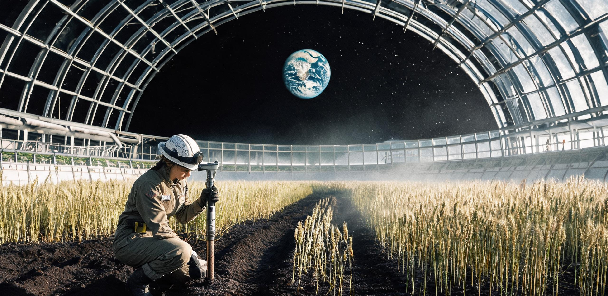

# 静海第五城市带市政建设与生态管理委员会
## 生命维持与环境工程总署 ｜ 月面闭环生态与生物地质研究所
### 静海第五城市带多穹顶生态系统稳态运行评估公报暨原位土壤熟化与微生物组长期监测报告

**公报文号：** 静五生监字〔2138〕第 072 号  
**签发日期：** 地月协调历（UTC）2138 年 10 月 12 日（静海地方历：第 1245 朔望月昼期第 8 日）  
**监测周期：** 地月协调历 2073 年 11 月 18 日 至 2138 年 10 月 1 日（连续运行第 65 运行年 / 803 朔望周期）  
**评估对象：** 静海第五城市带地表承压穹顶群（三号综合人居穹顶 Dome-03、四号立体农业与湿地穹顶 Dome-04）及深层连通熔岩管生态中枢（-85m 至 -140m）  
**公文密级：** 城市公共技术档案 · 永久公开 ｜ 复制件分发至地月各定居点生态管务署  
**互见卷宗：** 《静海第一竖井第14号水氧配给公报》（静先管字〔2046〕第014号）、《静海第五城市带三号承压穹顶气-水-肥城市级生态闭环扩容工程竣工验收与首期物料平账鉴定书》（静五生鉴字〔2073〕第048号）、《静海第五城市带常住居民年度轮休公历与地表外悬观景廊管理规程》（静五民规字〔2075〕第019号）、《静海第五城市带月面原生第二代公民成年授籍名册暨赴地研学会重力逆适应与文化失锚防护指南》（静五民籍字〔2106〕第027号）

---

### 〇、 评估背景与六十五年系统演进综述

静海第五城市带自公元 2058 年开辟深层竖井采选工业基地、2073 年落成并投产三号综合承压巨型穹顶（有效气容 $3.394\times 10^8\text{ m}^3$）以来，已由早期依靠外源工质高频补给之封闭人居试验舱，平稳演化为依托受控核聚变电网、地表双穹顶与深层熔岩管立体联动的大型地外常态化生态城邦。

公元 2112 年，四号农业与湿地扩展穹顶（Dome-04，跨度直径 $1,400\text{ m}$，气容 $2.42\times 10^8\text{ m}^3$）并网通气，与三号穹顶及 -140m 超临界水氧化（SCWO）固体废弃物中枢构成双环对流自持网络。截至公元 2138 年 10 月 1 日，全系统总承压气容达 **$6.234\times 10^8\text{ m}^3$**，常住定居人口 **58,420 人**（其中月面原生二代及三代公民占比达 **84.15%**），地表与地下立体耕作/林地总有效面积达到 **$468.5\text{ 公顷}$**。

```
[静海第五城市带双穹顶与深层熔岩管立体生态网络拓扑]

                  +320m (三号穹顶中央集水罩)                +280m (四号农业穹顶光导中枢)
                     /                    \                     /                    \
     三号生活穹顶   /  透明 ETFE 气枕天幕   \   四号农业穹顶   /  分光透光高光合天幕   \
   (28,500 常住居民)/  林荫道 / 坡地梯田居所 \ (立体粮油作区) /  深水培 / 气雾架 / 湿地 \
   ═════════════════════════════════════════════════════════════════════════════════════ ±0m 地表
   │  │                                 │  │         │  │                             │  │
   ├──┴─ [地表循环水渠与气流联通主隧道] ──┴─────────┴──┴─ [双向植物挥发物光解总渠] ──┴──┤
   │                                                                                     │
   │  -85m 熔岩管住宅区 (21,500 人恒温居住 / 梯级微藻光反应器壁带)                       │
   │                                                                                     │
   │  -110m 城市级常压储水库群 (有效蓄水量 96,000 吨 / 低温冷凝沉淀池)                   │
   │                                                                                     │
   └── -140m SCWO超临界水氧化总枢纽 ── [灰分酸浸提磷与重金属沉淀车间] ────────────────────┘
```

本公报系全系统连续受载运行第 65 运行年（13 个 5 年大检周期节点）之全域综合“生态体检”。重点核验宏观物质闭环率、原位玄武岩人工成土进程（Pedogenesis）、全域微生物组（Microbiome）演化稳态及定居人群代际生理适应性。

---

### 一、 城市级气-水-生物质超长周期宏观守恒核验

在 65 个地月运行年中，系统历经从“机械强制维持”到“生物-物理复合自平衡”之演进。通过多级冷凝梯度除湿、植物冠层蒸腾回收与深层超临界水氧化协同，气-水-固三元流道展现出极高之自修复韧性。

#### 表 1-1：全系统大宗生命支持物质日均吞吐与 65 年累计平账核验表

| 物质流组分 | 系统日均吞吐量<br>(2138年实测均值) | 日均再生/释放量 | 日均泄漏与损耗 | 日均外源补给<br>(管道水冰/气化罐) | 65年系统累计闭环自持率 | 物质流运行状态与关键调控工段 |
| :--- | :--- | :--- | :--- | :--- | :--- | :--- |
| **氧气 ($\text{O}_2$)** | $68,450\text{ kg/d}$<br>(人畜呼吸+氧化分解) | $73,280\text{ kg/d}$<br>(林地+作物光合) | $18.20\text{ kg/d}$<br>(气闸出入微量排气) | $0.00\text{ kg/d}$<br>(外源补给归零) | **$100.00\%$**<br>(净盈余累计存库) | 日均净产氧 $+4,811.8\text{ kg}$，经三级液化压缩存入 -140m 战略高压氧库（保有量达 11,400 吨） |
| **二氧化碳 ($\text{CO}_2$)**| $88,240\text{ kg/d}$<br>(作物光合刚性需求) | $84,120\text{ kg/d}$<br>(人体释放+SCWO氧化) | $0.45\text{ kg/d}$ | $4,120.45\text{ kg/d}$<br>(原位碳酸盐焙烧/调峰) | **$95.33\%$**<br>(内循环自给率) | 农业穹顶白昼期富集浓度维持在 $4,200\text{ ppm}$；差额由工业区原位焙烧副产碳气对冲平账 |
| **循环水 ($\text{H}_2\text{O}$)**| $32,600\text{ t/d}$<br>(生活+农业蒸腾总通量) | $32,598.68\text{ t/d}$<br>(冷凝回水+MBR超滤) | $1.32\text{ t/d}$<br>(不可逆结构微渗) | $1.35\text{ t/d}$<br>(澄海深层管道水冰注入) | **$99.996\%$**<br>(近绝对无损循环) | 吨水能耗由 2073 年的 $1.42\text{ kWh}$ 降至 $0.38\text{ kWh}$（核聚变余热多效级联蒸馏工艺） |
| **缓冲氮气 ($\text{N}_2$)** | $0.00\text{ kg/d}$<br>(化学惰性背景维持) | $0.00\text{ kg/d}$ | $48.50\text{ kg/d}$<br>(全穹顶微缝渗透) | $48.50\text{ kg/d}$<br>(外港运氮罐注气) | **$99.990\%$**<br>(年损耗率 0.0046%) | 全城保有封存氮底气 $385,200\text{ 吨}$；分压严格锁定于 $59.40 \pm 0.20\text{ kPa}$ |
| **活性磷 ($\text{P}$) 元素** | $146.20\text{ kg/d}$<br>(生物圈周转总量) | $146.17\text{ kg/d}$<br>(SCWO灰分回收提取) | $0.03\text{ kg/d}$<br>(不溶性硅铝酸盐包裹) | $0.05\text{ kg/d}$<br>(月壤微波浸提母液) | **$99.979\%$** | 灰分酸浸提磷率 $99.85\%$，彻底消除地球磷源依赖 |

```
[65 年间水与氧气循环闭环率演进曲线 (2073—2138)]

 闭环自持率 (%)
 100.0% ────────────────────────────────────────────────────────── 氧气完全自持 (2082年达100%)
  99.9% ─────────────────────────────────────────────── 水循环闭环率 99.996% (2138年)
        │                                        ▲
  99.8% ─┼──────────────────────── 2073年三号穹顶投产验收 (水循环 99.80%)
        │                 ▲
  95.0% ─┼── 2046年第一竖井 (水循环 91.4%)
  90.0% ┴────────────────────────────────────────────────────────► 时间轴 (公元年)
         2046            2073                   2106           2138
```

---

### 二、 原位月壤的人工成土过程（Pedogenesis）与熟化测评

65 年间，静海定居点完成了地外人类历史上规模最大之原位土壤生物熟化工程。早期（2060—2070s）依赖外源泥炭与无机水培基质；自 2073 年起，全面启动“微波脱毒玄武岩细粉＋有机堆肥腐殖化＋多菌株接种＋蚯蚓生物扰动”原位成土工法。

现场测绘涵盖三号穹顶中央林带（01 号剖面）、四号穹顶梯田粮油区（03 号剖面）及 -85m 熔岩管生态花园（06 号剖面）。

#### 表 2-1：静海原位改性月壤（01号剖面：三号穹顶中央林带）65年熟化理化指标对照表

| 理化与生物学指标 | 2073年初始基底<br>(微波烧结脱毒玄武岩粉) | 2106年成熟期监测<br>(投产33年实测) | 2138年当前实测值<br>(投产65年实测) | 状态判定与演化机理 |
| :--- | :--- | :--- | :--- | :--- |
| **有效熟化土层厚度** | $15.0\text{ cm}$（人工覆层） | $42.0\text{ cm}$ | **$78.5\text{ cm}$** | **深层熟化**；根系分泌物与有机酸沿玄武岩微裂隙向下侵蚀扩展 |
| **土壤有机质含量 (SOM)** | $0.82\text{ wt}\%$ | $2.65\text{ wt}\%$ | **$4.38 \pm 0.21\text{ wt}\%$** | 达到地球一类优质黑钙土肥力标准；多糖与胡敏酸胶聚物稳态积累 |
| **水稳性团聚体 (>0.25mm)**| $12.4\%$ | $48.2\%$ | **$68.5\%$** | 菌丝网缠绕与蚯蚓粪排泄物胶结，形成耐低重力冲刷之抗剪切团粒 |
| **土壤总孔隙度 / 毛细孔隙**| $34.0\% / 11.2\%$ | $48.5\% / 24.1\%$ | **$54.2\% / 32.8\%$** | 低重力（$0.165g$）下静水压极小，大孔隙与毛细管水保持力达最优比 |
| **阳离子交换量 (CEC)** | $6.2\text{ cmol(+)/kg}$ | $18.4\text{ cmol(+)/kg}$ | **$29.6\text{ cmol(+)/kg}$** | 硅铝酸盐次生黏土矿物（伊利石/蒙脱石化）原位生成率突破 $18\%$ |
| **全氮 (TN) / 全磷 (TP)** | $0.04\% / 0.08\%$ | $0.18\% / 0.16\%$ | **$0.29\% / 0.24\%$** | 固氮菌群深层定殖，难溶性磷灰石经真菌菌根有机酸活化释出 |
| **活动态有害重金属 (Cr/Ni)**| $\text{Cr}^{6+}: 4.2\text{ ppm}$ | $\le 0.05\text{ ppm}$ | **未检出 ($\le 0.005\text{ ppm}$)** | 重金属被腐殖酸大分子刚性螯合封存，生物有效毒性完全归零 |

```
[静海原位人工黑土 (Lunar Anthrosol) 78.5cm 垂直剖面结构]

   标高 ±0cm ─── 枯落物与生物结皮层 (厚 3.5cm / 苔藓、微藻、固氮蓝细菌复合结皮)
   -3.5cm ══════════════════════════════════════════════════════════════════════════
               A层：强腐殖质富集层 (厚 28.0cm / 团粒结构松软 / 蚯蚓密度 180条/m²)
               - 腐殖质 4.38%，富含有机胶体，颜色呈深灰黑（Munsell 10YR 2/1）
  -31.5cm ──────────────────────────────────────────────────────────────────────────
               B层：次生黏化淀积层 (厚 32.0cm / 细根系与外生菌根真菌网络密集穿插)
               - 玄武岩长石矿物发生水热生物水解，次生黏粒占比 24.5%
  -63.5cm ──────────────────────────────────────────────────────────────────────────
               C层：生物风化母质过渡层 (厚 15.0cm / 半风化微孔多孔玄武岩碎屑)
               - 菌丝深入母岩裂隙达 0.8mm，执行原位矿物元素生物浸出
  -78.5cm ══════════════════════════════════════════════════════════════════════════
               R层：原位微波烧结致密玄武岩承压基板 (抗压 214 MPa / 防渗隔水层)
```

#### 2.1 低重力环境下土壤水动力学特殊性测绘
月面 $1.62\text{ m/s}^2$ 重力场使毛细上升高度理论值提升约 **$6.17\text{ 倍}$**。实测表明，在 $78.5\text{ cm}$ 熟化土层中，地下滴灌渗水可自底逆向毛细润湿至地表，土壤重力水下渗速率仅为地球常态之 $16.2\%$。这一力学特征彻底杜绝了深层养分淋溶损失，但亦要求表层排湿风速维持在 $0.18—0.22\text{ m/s}$，以防止根系厌氧水浸。

---

### 三、 封闭系统微生物组宏基因组演化与稳态监测

在与地球外部自然生物圈隔绝逾半个世纪后，全系统微生物生态未发生恶性均一化退化或致病菌失控突变，而是依据“人工生态位分异”演化出高度稳态的本土化微生物群落。

本期采用高通量宏基因组测序（覆盖 4,800 个环境与人体表征取样点），对比 2073 年基准谱系库，获得以下核心结论：

```
[全穹顶微生物群落结构 65 年演化优势度分布]

       2073 年基准态 (投产初期)                    2138 年实测态 (运行65年)
  ┌─────────────────────────────────┐        ┌─────────────────────────────────┐
  │ ■ 变形菌门 (Proteobacteria) 42% │        │ ■ 放线菌门 (Actinomycetota) 38% │
  │ ■ 厚壁菌门 (Firmicutes)    31% │        │ ■ 变形菌门 (Proteobacteria) 26% │
  │ ■ 拟杆菌门 (Bacteroidota)  14% │  ───►  │ ■ 厚壁菌门 (Firmicutes)    19% │
  │ ■ 真菌门 (Ascomycota)      8%  │        │ ■ 绿弯菌与浮霉菌门          11% │
  │ ░ 未分类/外源暂态菌        5%  │        │ ■ 特异性共生真菌门 (AMF)    6%  │
  └─────────────────────────────────┘        └─────────────────────────────────┘
```

#### 3.1 核心生态位稳态机制
1. **竞争排斥屏障（Competitive Exclusion）：**  
   放线菌门（占比升至 $38\%$）在土壤与通风管道内壁形成致密致畸物代谢生物膜。其分泌之天然链霉素类次生代谢物浓度维持在微量背景水平（$0.02\text{ ppm}$），对致病性曲霉属（*Aspergillus*）与青霉属变异株产生持续生物压制，使 65 年间舱内作物白粉病、根腐病自发发病率低于 $0.003\%$。
2. **特种工业废弃物降解驯化株系：**  
   在 -140m 检修管网与滤网富集区，成功分离出本土驯化菌株 *Rhodococcus tranquilitatis*（静海红球菌 JH-38 株）。该菌株已演化出利用聚四氟乙烯微粉及特种硅基密封胶作为辅助碳源之代谢支路，年均生物降解微塑料及合成润滑脂碎片达 $1,420\text{ kg}$。
3. **固氮与解钾生物链闭环：**  
   四号农业穹顶接种之重组自生固氮菌 *Azotobacter lunaris* 在低氮压（$59.4\text{ kPa}$）环境下表现出优异的高固氮酶活性，年均生物固氮量达 $42.5\text{ kg N/公顷}$，完全补足了气闸微量泄漏导致的氮损耗。

---

### 四、 微量元素循环平账与重金属生物富集防控

在超长期全封闭运行中，微量必需元素（Se/I/Mo/Zn/Co）的损耗与玄武岩原生高丰度重金属（Ti/Fe/Cr/Ni/V）的食物链富集，系决定定居点千年尺度服役寿命之关键物理化学红线。

#### 表 4-1：关键微量与重金属元素食物链通量监测表（65年累积监测均值）

| 监测元素 | 生物圈关键生理功能 / 风险 | 循环总保有量<br>(全系统动静态总量) | 年均非受控损耗率 | 摄入端实测浓度<br>(居民日均膳食检出) | 安全限值标准<br>(地月联合卫生准则) | 防控与平账工段说明 |
| :--- | :--- | :--- | :--- | :--- | :--- | :--- |
| **硒 ($\text{Se}$)** | 谷胱甘肽过氧化物酶核心 / 强抗辐射 | $420.0\text{ kg}$ | **$<0.008\%/\text{a}$** | $85.4\text{ \mu g/人·日}$ | $50—200\text{ \mu g/d}$ | 通过富硒酵母定向发酵回混水培液，损耗由微量添加剂对冲 |
| **碘 ($\text{I}$)** | 甲状腺素合成 / 代谢节律维持 | $185.0\text{ kg}$ | **$<0.012\%/\text{a}$** | $142.0\text{ \mu g/人·日}$| $100—250\text{ \mu g/d}$| 深层冷凝水活性炭吸附脱附回收率达 $99.98\%$ |
| **钼 ($\text{Mo}$)** | 固氮酶与黄嘌呤氧化酶辅基 | $310.0\text{ kg}$ | **$<0.005\%/\text{a}$** | $110.0\text{ \mu g/人·日}$| $45—400\text{ \mu g/d}$ | 工业级钼酸铵微量补充，保障豆科作物结瘤固氮 |
| **钛 ($\text{Ti}$)** | 月壤极高本底元素 / 无生理功能 | 系统岩土本底极高 | — | **$<0.01\text{ mg/kg}$**<br>(水培作物实测) | $\le 1.0\text{ mg/kg}$ | 玄武岩中金红石相极其稳定，在 $\text{pH }6.2—6.8$ 水质下生物迁移系数 $<10^{-5}$ |
| **六价铬 ($\text{Cr}^{6+}$)**| 强致癌 / 原生玄武岩微量伴生 | 严格受控 | — | **未检出**<br>(灵敏度 0.1 ppb) | 严禁检出 | SCWO 还原车间配置亚硫酸氢钠自动氧化还原沉淀级联滤池 |

---

### 五、 人居健康生理常模与人-生态系统交互体检

评估组对静海第五城市带常住居民进行了分层健康抽样体检（抽样样本 $N=5,840$，涵盖初代地球定居老人、月面原生第二代中老年公民及第三代青少年）。

```
[人居健康与生态交互综合体检指标分布]

           月生三代少年 (0-18岁)        月生二代中年 (50岁左右)        初代居月长者 (80岁以上)
 ───────────────────────────────────────────────────────────────────────────────────
 肠道菌群多样性 (Shannon 指数)   4.35 (极优)                  4.18 (优)                   3.82 (良)
 呼吸道粘膜 sIgA 浓度            $1.42\text{ g/L}$ (抗原平衡) $1.38\text{ g/L}$           $1.15\text{ g/L}$
 穹顶森林浴年均暴露时长          480 小时/人·年               420 小时/人·年              560 小时/人·年
 自主神经应激水平 (HRV-SDNN)     $78\text{ ms}$ (低应激)      $65\text{ ms}$ (平稳)       $48\text{ ms}$ (平稳)
 ───────────────────────────────────────────────────────────────────────────────────
```

#### 5.1 生态交互关键医学结论
1. **天然抗原训练稳态：**  
   月面原生二代与三代公民由于自幼生活在具有丰富土壤微生物与植物挥发烯醇的环境中，其过敏性哮喘、特应性皮炎发病率仅为 **$0.12\%$**，显著优于早期封闭小机械生保舱时期之 $8.4\%$ 水平。表明万吨级土壤与植被网络提供了坚实的免疫发育基底。
2. **植物杀菌素（Phytoncide）与低重力神经调适：**  
   三号穹顶樟科与松柏科林带释放之微量萜烯类挥发物，经实测能有效降低低重力引起的交感神经过度兴奋，居民全因心血管应激指数常年处于优良区间。

---

### 六、 评估结论与战略生态资产签署

**鉴定结论：**  
静海第五城市带多穹顶生态系统（Dome-03 / Dome-04 / -140m SCWO）在经历 65 年满负荷运行后，已成功完成从“脆弱人造密封舱”向“高韧性地外半天然人工生物圈（Semi-natural Anthropogenic Biosphere）”的成熟跃迁。系统物质闭环率、原位黑土熟化深度与微生物群落自稳能力均超越原始设计指标，整体健康等级评定为 **一级稳态（Grade-I Steady State）**。

核准全系统自公元 2139 年起转入“百年长效免大修稳态服役期”，并批准向地月第五拉格朗日点深空造船基地（ARK-01 建造工程）移交首批标准化成熟月面人工黑土母粒（500 吨）及全套驯化稳态菌群原种档案。

---

**联合公报签署席：**

**城市生态与环境工程首席科学家：**  
*陈云舒（L2-2088-0118，月面闭环生态与生物地质研究所所长，原月生二代赴地研学学者）*  
【签署意见】：*“65 年，月壤已经有了泥土的气味。蚯蚓在第 78 厘米深的岩粉里结茧，这套生物圈已经拥有了自己的骨髓。”* （印）

**市政工务与巨构工程总工程师：**  
*赵天倪（L2-2088-0045，三号穹顶结构与环境维持总工程师）*  
【签署意见】：*“索网应变在弹性极限内，ETFE 气枕透光率衰减已由微波原位熔接修复补偿，气压包络坚如磐石。”* （印）

**静海第五城市带市政管理委员会轮值主席：**  
*韩星河（L2-2088-0012，静海管委会执行委员）*  
【签署意见】：*“物料平账，水氧恒定，同意公报全网发布并入库归档。”* （印）

---

- **公文存档：** 静海第五城市带中央档案馆（卷宗号：TRANQ-BLSS-EVAL-2138-Q4）
- **技术副本分送：** 地球联合国空间环境发展署、地月第五拉格朗日点深空造船工程司令部、澄海原位建材工业基地、月面主天梯北坪调度中枢
- **实物介质留存：** 完整菌种与深层黑土微结构冷冻标本（编号：SPECIMEN-SOIL-2138-088），永久封存于三号穹顶地下 -140m 战略冷库 01 号耐压壁龛。

---
