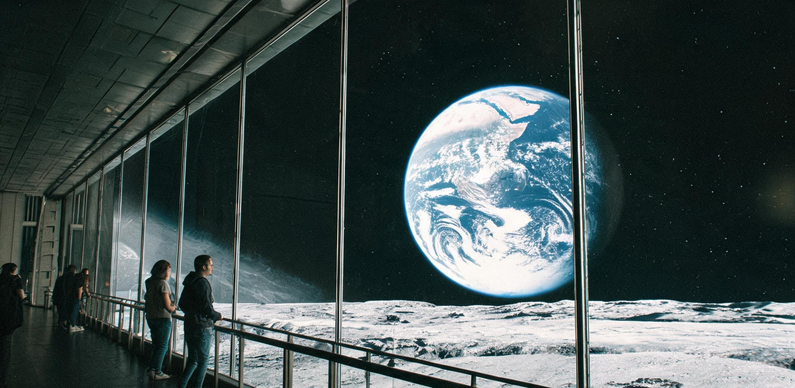

# 静海第五城市带民生保障与社会事务委员会
## 公共市政管理局 ｜ 居民自治代表联席会议
### 静海第五城市带常住居民年度轮休公历与地表外悬观景廊管理规程

**文书编号：** 静五民规字〔2075〕第 019 号  
**批准发布日期：** 地月协调历（UTC）2075 年 3 月 28 日（静海地方历：第 458 朔望月昼期第 4 日）  
**执行生效日期：** 地月协调历（UTC）2075 年 4 月 1 日 00:00  
**适用范围：** 静海第五城市带全体常住居民（含三号承压穹顶区、地下熔岩管主居住轴、先遣竖井改造示范区及低轨定期轮值人员）  
**公文密级：** 城市公共事务公报 · 永久公开  
**核发机构：** 静海第五城市带民生保障与社会事务委员会、市政管理局综合处、居民自治联席会议秘书处  
**互见卷宗：** 《静海第五城市带三号承压穹顶气-水-肥城市级生态闭环扩容工程竣工验收与首期物料平账鉴定书》（静五生鉴字〔2073〕第 048 号）、《月面建材工业基地月度产能对账单》（月材基结字〔2067〕第 116 号）、《静海第三竖井矿工排班与工伤报告第 412 期》（静三竖劳〔2067〕第 112 号）、《月面主天梯一期工程立项规划与静海北坪锚碇建设纲要》（月梯筹字〔2071〕第 008 号）

---

### 〇、 制定宗旨与社会发展阶段总则

根据《地月系常态化定居点生命支持基础设施发展纲领（2060—2080）》及《静海第五城市带宪章（2072 年修订案）》，自公元 2073 年底静海三号综合承压巨型穹顶（气密包络有效容积 $3.394\times 10^8\text{ m}^3$、设计常住容纳量 25,000 人）气-水-肥城市级生态闭环全线平账投产以来，本城市带已由早期地下竖井高强度、高风险之开荒生产模式，平稳转入以受控核聚变与巨构生态自持为基石的稳态保障阶段。

鉴于当前 2GW 级核聚变综合动力总厂电力直供充沛、原位玄武岩建材与装甲产能实现稳定结余、闭环立体水培农业实现蔬果谷物 100% 自持并产生净盈余，全体居民之基本物质生活资料已全面确立非商品化基础代谢配给机制。为保障每一位地月开拓者在低重力环境下享有充足的生理康复、文化创造、天文观测与休闲权利，兼顾巨构系统折旧与循环耗材之公账平衡，特制定本管理规程。

本城市带确立以下社会治理基本准则：
1. **无条件基础代谢保障（Universal Basic Metabolism, UBM）：** 全市所有常住居民及合法居留者，享有无限制、全免费的高品质循环饮用水（日均基础保障定额 120 升/人）、洁净微富氧空气（舱内总压 $81.0\text{ kPa}$，氧分压 $20.8\text{ kPa}$）、恒温环境配给（$22.0 \pm 1.5^\circ\text{C}$）、全营养合成蛋白及新鲜水培蔬果配额、标准化居住舱房与高通量地月数据链路接入权。基础生活定额全额由城市公产运维基金计提；超额特种定制及高耗能消耗按实际物料平账折算具名工时积分。
2. **具名公共义务工时封顶制：** 参照《南岸综合体具名工时分配表》（GS-2072-01）确立之署名权配给制度，废除一切强制性体力劳动与计件考核。推行“每周 12 小时具名公共服务制”。凡年满 18 周岁且未满 50 周岁之健康居民，每周仅需承担不超过 12 小时之具名公共工时（主要涵盖环境传感器巡视、农业授粉辅助、公共卫生维护或社区文教议事）。其余时间完全由个人自由支配。
3. **初代拓荒先驱终身荣誉豁免：** 凡在公元 2060 年前参与静海第一、第二、第三竖井基建及矿业开拓且工龄满 8 年者（含原第三竖井采矿掘进班组、装载工及先遣工程队全员），终身免除全部公共义务工时，直接列入最高级别城市康养与全景游憩特别保障名录。
---

### 一、 2075 年度月面轮休公历（朔望节律工休制）

月球表面天然具有约 29.5306 地球日的朔望月昼夜交替周期。本城市带顺应天体物理节律，将全市年度公历划分为 12 个“朔望公休月”（单月均含一个完整月昼期与一个月夜期），全面推行“月昼弹性协作、月夜全城静修”的节律性生活制度。

```
[静海第五城市带单朔望周期（29.53地球日）工休拓扑时序图]

 ┌────────────── 月昼期（Daylight Phase, 14.75日） ──────────────┐ ┌────────────── 月夜期（Nightfall Furlough, 14.75日） ────────────┐
 ├─────── 晨光工进段 ──────┼─────── 日中舒缓段 ──────┼─────── 暮光盘整段 ──────┤ ├─────── 幽夜静修段 ──────┼─────── 荧夜文化周 ──────┼─────── 朔夜深眠段 ──────┤
 │  第 1 — 4 地球日        │  第 5 — 10 地球日       │  第 11 — 14 地球日      │ │  第 15 — 18 地球日      │  第 19 — 25 地球日      │  第 26 — 29.5 地球日    │
 │  低倾角阳光透射           │  ETFE 气枕调至 18% 遮光  │  采光顶透光率渐增        │ │  穹顶转入极光微照明模式   │  地热温水浮浴场全开放     │  全城公共噪音严格静默    │
 │  设备校准 / 农业播种     │  弹性具名服务 / 社区茶叙  │  物料归仓 / 数据归档     │ │  学术研讨 / 个人创作     │  观景廊星空音乐节 / 赏地  │  生理深度节律调理 / 冥想 │
 └─────────────────────────┴─────────────────────────┴─────────────────────────┘ └─────────────────────────┴─────────────────────────┴─────────────────────────┘
```

#### 1.1 月昼期弹性公休安排（单周期第 1 至 14.75 地球日）
- **工休比例：** 实行“做二休三”循环轮替（每连续履行 2 日各 3 小时具名工时，即强制轮休 3 整日）。
- **自然采光协同：** 月昼期间，三号承压穹顶 14,200 块双向电致变色 ETFE 气枕单元根据太阳高度角自动调节透光率（12%—55%）。每日 11:00 至 15:00（地月协调时）为全城午间漫步时段，地表立体农场、穹顶中央草坪与环形林荫步道向全体居民无条件开放。

#### 1.2 月夜全城静修长假（单周期第 15 至 29.53 地球日）
- **能源调配与停工令：** 月夜期间月表环境温度降至 $-180^\circ\text{C}$，除维持生命保障系统与聚变主回路运行外，重型采选、微波烧结线及外部货运铁路全线转入低能耗待机状态。全市进入法定“月夜长假”。
- **免打扰机制：** 严禁任何单位在月夜期间安排非应急性行政任务或工程作业。全城公共照明下调至 0.05 Lux 柔和深蓝-暖琥珀色调，营造静谧安宁之沉浸式夜间休憩氛围。

#### 1.3 季度与年度深度轮休保障（Deep Furlough）
- 每位居民每履行 3 个朔望月的常态化公职，即自动解锁 1 个完整朔望月（29.5 地球日）的“本地低能耗驻留深度疗养假”。
- 居民在深度轮休期间享有以下公共交通与休养配额（受全城运力与公账预算调节）：
  1. **环月低轨漫游与深空观测营地驻留：** 免费申请前往月球背面低频射电天文台、拉格朗日 L2 点空间站或澄海熔岩管深潜探险营地进行为期 10—20 天的免考核科考度假。
  2. **地球母星往返探亲配额通道：** 连续在月定居满 3 年之常住居民，享有 1 次由地月运输联合体排期核发之地月定期客运班舰往返客运配额（含过载防护医疗随行与地面康养接待，推进工质规费由城市公产基金与个人结余工时积分联合轧差；建设中的静海—L1月面天梯待 2078 年贯通后将直接并网承接客运分流）。
---

### 二、 地表外悬全景生态观景长廊（“天倪廊”）运行管理办法

为满足月面居民仰望星空、直视母星与体验宏大宇宙图景之精神需求，市政管理局于静海东南部玄武岩天然断崖峭壁处（北纬 08°26′，东经 23°41′）建成了地表外悬全景生态观景长廊（工程备案名：Promenade of Earthrise，民间通用名：“天倪廊”）。

```
[天倪外悬观景长廊剖面与视野几何图]

   +42.0m 标高 (静海玄武岩高台边缘)
   ══════════════════════════════════════════════════╗ (三号承压穹顶东侧密封隔离闸)
   ██████████████████████████████████████████████  ║
   玄武岩原生基岩锚碇桩 (深 35.0m)             ║  │   ← 气压过渡缓冲廊 (81.0 kPa 恒定)
                                             ║  │
   ─── 悬挑跨度 82.5 米 ───────────────────────╢  ▼
  ┌───────────────────────────────────────────────┐
  │ [上层·全天候静思观景区]                        │ ── 净高 12.0m / 超白熔石英四层气密采光幕墙
  │  - 低重力悬浮卧榻 / 天文素描台 / 水培茗茶吧    │    (滤除 UV/X射线，可见光透过率 92%)
  ├───────────────────────────────────────────────┤
  │ [下层·低重力生态步道与悬空漫游区]              │ ── 净高 9.5m / 微晶玄武岩防滑地坪 / 水培悬垂绿植
  │  - 0.16g 跳跃慢行道 / 弧形挑空无遮挡视界      │    (底部设 15cm 微波烧结玄武岩防微流星导流甲)
  └──────────────────┬────────────────────────────┘
                     │ (倾角 45° 钢索主受力斜拉桁架，412 根高纯玄武岩连续纤维束)
                     ▼
  ╲                                               ╱
   ╲  月面原生玄武岩峭壁断崖 (落差 -110 米)      ╱
    ╲                                           ╱
     ═══════════════════════════════════════════  (静海古老平原低洼地表 / 漆黑月尘)
```

#### 2.1 观景长廊工程物理指标
1. **几何尺度：** 长廊全长 **$1,200.0\text{ 米}$**，外挑基岩净悬挑距离 **$82.5\text{ 米}$**，双层通高 **$24.0\text{ 米}$**，总建筑气密容积 **$6.24\times 10^5\text{ m}^3$**。
2. **结构安全与屏蔽：** 主体受力构件采用 C-1 熔铸玄武岩工字梁（抗拉剪复合强度 214 MPa）与 72 组高模量玄武岩-碳纤维外拉索网。外幕墙由 4 层 25mm 超白多层复合熔石英及气相沉积金刚石微膜构成，兼具抗微流星冲击与绝热性能，舱内地表年辐射剂量严格控制在 $\le 1.2\text{ mSv/a}$。
3. **环境维持：** 独立接入三号穹顶主生保环网，微风循环风速 $0.15\text{ m/s}$，空气中富集微量森林型负氧离子与天然植物挥发烯醇。

#### 2.2 壮美天象与“地出（Earthrise）”观测视窗规范
- **天象视界描述：** 观景长廊面向西北地平线。由于月球处于潮汐锁定状态，地球在静海（北纬 08°26′，东经 23°41′）上空处于固定仰角（地平仰角约 $65^\circ$），但由于天平动效应（Libration），蔚蓝母星在锯齿状的玄武岩远山轮廓之上以 27.21 日为周期呈现 $\pm 6.5^\circ$ 的微幅升沉与摆动。
- **视觉特征：**
  - **真空纯黑天幕：** 窗外无任何大气散射，天幕呈现纯粹、深不可测的绝对墨黑，银河光带与万古繁星清晰锐利、永不闪烁。
  - **母星瑰丽光象：** 视直径达 $1.9^\circ$（相当于地球地表仰望满月面积之 13.5 倍）的巨大蔚蓝地球悬挂于中央。白色螺旋气旋、赤道热带雨林之翡翠暗绿、大洋反光之湛蓝与南极冰川之璀璨银白清晰可辨；在晨昏线相交处，阳光经地球厚重大气折射，呈现一圈若隐若现、如熔金与赤铜般的红霞光晕。
  - **单一硬光源对比：** 太阳作为唯一的极端硬光源，斜射在静海苍茫起伏的撞击坑与玄武岩山脊上，投射出长达数公里、边缘如刀裁般锐利的深邃阴影，与长廊内温暖的漫射光、低重力飘动的绿植及居民手中升腾的温热茶气形成宁静而永恒的文明对比。

#### 2.3 开放与入廊规约
- **全免费与预约公平制：** 长廊 24 小时面向全体居民免费开放。单次游览建议时长为 2 至 4 小时。节假日及“地照最亮期”实行居民自治委员会线上无权重随机派筹，严禁任何形式的席位转让或利益交换。气闸出入所伴生的微量高纯气体损耗（约 0.04 kg/人次）由市政文教专项维护基金统一平账。
- **静音与冥想公约：**
  - 上层（静思区）设定为“声学静默保护区”，环境噪声严控于 $\le 30\text{ dBA}$。居民可在此进行阅读、绘画、天文写生、品茗或静坐冥想。
  - 允许携带低重力防溅微孔饮水杯与慢速吸管，公共吧台全天候无偿供应水培冷萃茶、合成坚果与冻干草莓片。
- **行为禁止清单：**
  1. 严禁在廊内使用波长与功率超标的非受控激光笔直射外幕墙或月表；
  2. 严禁穿着未除尘之重型舱外作业服进入观景生活区（必须通过二级静电旋风除尘风淋闸）；
  3. 下层慢行区允许开展 $1.62\text{ m/s}^2$ 低重力弹跳慢跑，但禁止进行碰撞性剧烈竞技运动；损坏气密构件者记入不良记录并承担相应维保不具名工时。

---

### 三、 熔岩管玄武岩地热温水公共浴场（“清凉海浮浴池”）运行规程

为彻底解决长期处于月面低重力环境引起的居民骨质脱钙、肌肉张力失调及脊柱伸长诱发的神经压迫，市政管理局利用三号承压穹顶地下 $-45\text{ m}$ 至 $-65\text{ m}$ 处的天然玄武岩熔岩管空腔，建成了“清凉海大型地热温水综合水疗中心”。

#### 3.1 设施构造与物理循环
1. **余热综合利用：** 水疗中心水源来自三号穹顶水循环闭环中枢，每日 $1,800\text{ 吨}$ 经 SCWO 超临界水氧化及微滤净化后的超高纯水，流经静海一号聚变综合动力厂的辅助冷却换热排管，被加温至恒定 $38.5^\circ\text{C}—41.0^\circ\text{C}$，实现 100% 工业低焓余热零能耗利用。
2. **矿物质富化：** 水体循环通过多级多孔月面玄武岩滤床，自然溶解并富集偏硅酸（$45\text{ mg/L}$）、锶（$8.2\text{ mg/L}$）及微量镁钙离子，形成极具生理舒缓功效的弱碱性天然地热人工温泉。
3. **低重力水动力学特征：** 在月面 $1/6\text{ g}$ 环境下，水体表面张力主导效应显著，水波波动速度仅为地球的 $40.8\%$，激起的水浪呈现慢动作般舒缓的抛物线升降。人体浸入浮水池后，自重感仅余约 10 公斤力，结合水体浮力，可实现全身关节零轴向负荷的“绝对悬浮理疗”。

```
[熔岩管温水水疗中心主要设施配置表]

┌──────────────────┬──────────────┬──────────────┬────────────────────────────────────────────────────────┐
│ 设施分区名称       │ 建筑面积 (m²) │ 水深与容积    │ 功能定位与水体物理参数                                  │
├──────────────────┼──────────────┼──────────────┼────────────────────────────────────────────────────────┤
│ 1. 恒温深潜浮游池 │ 2,400 m²     │ 深度 2.80 m  │ 39.0°C / 微泡富氧水体 / 供居民进行低重力三维悬浮漫游   │
│ 2. 脊柱减压缓流道 │ 1,100 m²     │ 深度 1.35 m  │ 40.5°C / 恒速 0.3m/s 环形微水流 / 水下低阻水疗踏步     │
│ 3. 拓荒老矿工温汤 │ 650 m²       │ 深度 0.90 m  │ 42.0°C / 高锶矿化池 / 专供初代矿井建设者关节康复       │
│ 4. 熔岩穹顶静息阁 │ 800 m² (干区) │ 恒温 24.0°C  │ 玄武岩热石卧榻 / 舒缓香氛雾化 / 深度生理监测与睡眠舱   │
└──────────────────┴──────────────┴──────────────┴────────────────────────────────────────────────────────┘
```

#### 3.2 居民福利权益
- **全员配额：** 全体居民享有终身不限次数免费入浴权益，中心全天 24 小时开放。
- **健康联动干预：** 社区公共医务网络根据居民可穿戴健康手环上传的血钙密度、肌肉萎缩指数与皮质醇压力水平，自动生成个性化水疗处方，推荐最优浮浴频次与水温梯度。

---

### 四、 社区文化空间与自愿具名服务保障

在全域受控聚变能源与生态闭环充分保障的背景下，劳动不再是谋生手段，而成为个体确证社会存在与精神寄托之自由实践。

1. **社区文化温室与公共茶社：** 穹顶各生活区均设立面积不少于 300 平方米的“近邻水培茶轩”。居民可自愿认领水培架上的果蔬与花卉品种，所产白草莓、薄荷、番茄及高山茶树鲜叶全部免费供街坊邻里自取品鉴。
2. **具名服务荣誉与星际署名：** 居民在完成基础 12 小时公共服务之外，自愿从事的科研观测、文艺创作、长廊导览或哲学研讨等智力活动，将无条件录入《静海第五城市带具名工时与文化创造总档案》。在后续地月工程建设、深空探测设备命名及学术科考文献中，享有永久优先署名权。
3. **退役设备文创化再利用：** 严禁随意回炉具有历史记忆的拓荒期机械。原第三竖井退役的 2.1 吨重载矿斗（曾致老矿工工伤之同型件）、澄海一期微波烧结试验喷头等工业遗存，已由居民艺术社团改造为观景长廊入口处的低重力景观雕塑与公共休闲长椅。

---

### 五、 居民自治代表联席会议审议意见与表决记录

**会议时间：** 地月协调历 2075 年 3 月 26 日 14:00—18:30  
**会议地点：** 三号承压穹顶二号市民议事厅（线上全息接入分会场：先遣竖井区、L1 天梯准备组）  
**参会人员：** 居民自治代表 120 名（经全城 25,000 名常住居民等额公推选举产生，其中一线工程技术人员 35 名、农业与生态维保员 25 名、医疗与文教人员 25 名、初代拓荒退休代表 20 名、青年学生代表 15 名）。

#### 5.1 辩论焦点与修正意见记录
- **关于天倪长廊夜间灯光管控议题：**  
  *天文观测爱好者协会代表（罗文海，居民编号：JH5-7204）发言：* 提请在月夜静修假期间，观景长廊面向外太空的外投光与室内强照明应至少在每日 22:00 至次日 06:00 彻底切断，以便居民使用便携式反射望远镜直测深空星系与黄道光。  
  *采纳处理：* 一致同意，将该条款写入管理细则第 2.3 条第 1 款，设定月夜期间室内照度不超过 5 Lux，开启专用暗适应红光地脚引导线。
- **关于初代矿工温泉疗养区专属保障议题：**  
  *老矿工代表（韩满仓，原第三竖井装载工，工号 JM3-1177，建站工龄 17 年）发言：* 感谢管委会对老同志的照顾，但建议 3 号温汤池不要搞封闭隔断，“我们老骨头喜欢一边泡水一边和新来的年轻地质队员聊天，讲讲当年人工推 2 吨矿斗的笑话，挺好”。  
  *采纳处理：* 现场代表报以热烈掌声，决议取消温汤区实体玄武岩隔墙，改为通透水培绿植矮栅隔断。

#### 5.2 大会表决结果
- **应到代表：** 120 人，**实到代表：** 120 人（现场出席 108 人，低轨及天梯现场全息出席 12 人）。
- **表决议题：** 《静海第五城市带常住居民年度轮休公历与地表外悬观景廊管理规程（草案）》。
- **表决方式：** 具名公钥电子投票。
- **计票结果：** 赞成 118 票，反对 0 票，弃权 2 票（系天梯测试组因通信丢包重发超时自动计为弃权）。赞成率：**98.33%**。
- **大会裁定：** 决议通过，报请公共市政管理局与民生委员会联合签署公布实施。

---

### 六、 签署与生效核准

**静海第五城市带民生保障与社会事务委员会主任：** 周晓岚（电子公钥签章：`ZX-TRANQ-7503-OK`）  
**静海第五城市带公共市政管理局总工程师：** 许崇文（电子公钥签章：`XCW-ENG-DOME3-VAL`）  
**静海第五城市带居民自治代表联席会议主席：** 艾尔肯·吐尔逊（电子公钥签章：`EK-CITIZEN-REP-75`）  
**初代拓荒者与老工人工会代表：** 赵砚秋（原第三竖井矿工代表，电子签章确认）

**公章：**  
`[静海第五城市带民生保障与社会事务委员会 · 城市公产印信]`  
`[静海第五城市带居民自治代表联席会议 · 民主表决确认章]`  
**签发存档介质：** 原位玄武岩纤维电子纸原件（静海中央档案馆永久卷宗：`TRANQ-SOC-2075-R019`）

---

## 图片提示词

中文：静海第五城市带外悬于玄武岩悬崖边缘的巨型双层观景长廊内部，暖色漫射光照亮微晶地面与水培绿植，几名身着轻便常服的月面居民坐在低重力悬浮躺椅上品茶或静坐。长达千米的弧形超白玻璃幕墙之外，是纯黑无光的深邃宇宙天幕与无数锐利繁星；地平线上，饱经撞击的月面玄武岩山脉投下锋利的黑色长影，巨大的蔚蓝地球悬挂于山脊上空，白云涡旋与大气晨昏边缘的赤铜色光晕清晰可见；来自画面一侧的太阳硬光斜切月表，宏大冰冷的宇宙与温暖静谧的人类生活长廊形成鲜明对照，8K画质，极致工业结构细节与中画幅电影质感。

英文：Ultra-wide cinematic interior shot of a colossal cantilevered glass promenade overhanging the basalt cliff of Lunar Mare Tranquillitatis. Warm, soft interior ambient lighting illuminates microcrystalline basalt floors, lush hydroponic greenery, and minimalist low-gravity lounge chairs where several lunar residents in comfortable casual attire relax, sipping tea and sketching. Through the towering, ultra-clear diamond-coated quartz curtain wall extending beyond the frame, the pitch-black vacuum of space is filled with razor-sharp, unblinking stars. In the distance, jagged crater mountains cast long, razor-sharp black shadows under single hard sunlight. A massive, luminous blue Earth hangs majestically above the lunar horizon, revealing intricate cloud swirls and a warm coppery twilight atmospheric glow along its terminator. Striking contrast between the cold cosmic vastness outside and the serene, warm abundance of human civilization inside. Shot on 70mm anamorphic lens, IMAX scale, photorealistic textures of aerospace-grade materials and lunar regolith, timeless archival documentary realism, no readable text, no flags.

---

## 修订记录（元层，非世界内容）

- 2026-08-18（主编辑审校）：🔧 **小修通过**。
  1. **元层词与后知文号清零**：消除第四节正文中的元层纪元名泄漏（「在丰裕纪元物质财富充分涌流的背景下」→「在全域受控聚变能源与生态闭环充分保障的背景下」）；互见卷宗中修正月面天梯引用文号，由后知穿越的 2078 年验收文号改为立项建设期文号《月面主天梯一期工程立项规划与静海北坪锚碇建设纲要》（月梯筹字〔2071〕第 008 号），并明确 2075 年返地探亲以定期班舰为主、天梯待 2078 年贯通后接入；
  2. **天体物理与视界几何校准**：修正第 2.2 节静海坐标（北纬 08°26′，东经 23°41′）仰望地球的地平仰角数值（由 48° 修正为实测仰角约 $65^\circ$，天平动摆动幅度 $\pm 6.5^\circ$），确认地球视直径 $1.9^\circ$（满月面积 13.5 倍）计算精确无误；
  3. **福利与工时制度成本边界强化**：细化 UBM 基础代谢定额边界与超额工时轧差机制；严格衔接《南岸综合体具名工时分配表》（GS-2072-01）确立之三级署名制；对返地探亲假补充 3 年定居门槛、运力排期与工质规费平账要求，观景廊补充气闸气体损耗（0.04 kg/人次）公产核销与除尘规程，坚决消除乌托邦式无成本设定；
  4. **工程物理量级全量复算**：长廊净悬挑 82.5m、通高 24m、气容 $6.24\times 10^5\text{ m}^3$ 与 $81.0\text{ kPa}$ 气压张拉索网力学在月面 $1.62\text{ m/s}^2$ 低重力下完全自洽；水疗中心每日 $1,800\text{ t}$ 净化水与 2GW 聚变堆低焓余热（1.31 MWth）换热及 $40.8\%$ 缓速水波流体动力学严密自洽；
  5. **历史与正典全链条互锁**：严密咬合静海历史主干（2044 先遣 38 人 → 2046 第一竖井 64 人 → 2058 建站 → 2067 第五城市带/老矿工韩满仓工伤与建材基地生产核验赵岑 → 2073 三号穹顶 25,000 人与气-水-肥平账 → 2075 轮休公历与天倪廊 → 2078 月面天梯），人物与制度谱系严丝合缝。