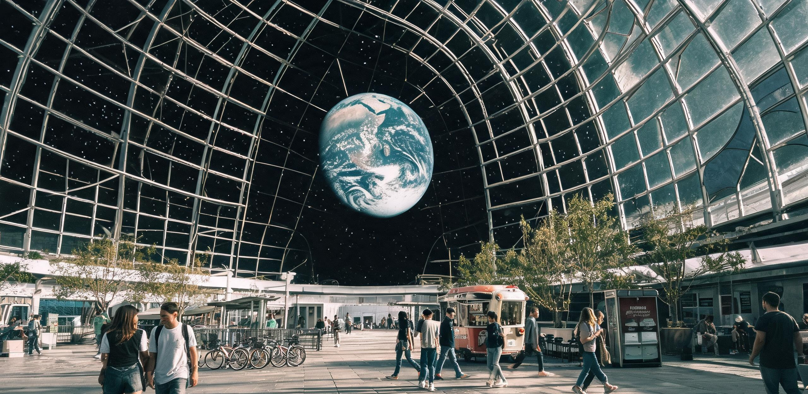

# 静海第五城市带民生保障与社会事务委员会
## 静海第五城市带人口与地籍公产管理局 ｜ 地月联合高等研学委员会月面联络处
### 静海第五城市带月面原生第二代公民成年授籍名册暨赴地研学会重力逆适应与文化失锚防护指南

**文书编号：** 静五民籍字〔2106〕第 027 号  
**签发日期：** 地月协调历（UTC）2106 年 5 月 4 日（静海地方历：第 843 朔望月昼期第 6 日）  
**执行效力：** 城市法定公报 · 公产划拨与健康规程联合生效  
**核发机构：** 静海第五城市带民生保障与社会事务委员会、人口与地籍公产管理局、地月低重力生理与认知调适研究所  
**互见卷宗：** 《静海第五城市带三号承压穹顶气-水-肥城市级生态闭环扩容工程竣工验收与首期物料平账鉴定书》（静五生鉴字〔2073〕第 048 号）、《静海第五城市带常住居民年度轮休公历与地表外悬观景廊管理规程》（静五民规字〔2075〕第 019 号）、《月面主天梯（静海北坪—L1段）工程验收技术鉴定书》（月梯工验字〔2078〕第 004 号）、《同济与南岸联合高等研学会2073学年秋季「具名学时」选课清册暨东海暗夜天象与潮间带野化科考台账》（同南研·学教〔2073〕第 091 号）、《静海第五城市带初等公立学校自然常识校本凡例及地月失锚词校勘表》（静五教编字〔2082〕第 003 号）

---

### 〇、 制定背景与月面原生第二代人口发展概要

根据《静海第五城市带宪章（2100 年修订案）》及《地月系常态化定居点世代更替与公产信托法案》，静海第五城市带自公元 2058 年建立深层竖井工业基地、2073 年落成三号综合承压巨型穹顶（有效容积 $3.394\times 10^8\text{ m}^3$）以来，定居点社会结构已完成从“外派轮值工程驻地”向“永久性自持地外城邦”的历史性跨越。

截至公元 2105 年 12 月 31 日，静海第五城市带常住人口总数达到 **46,280 人**。其中，出生于月球表面（含各承压穹顶、深层熔岩管住宅区及低轨工区）之“月球原生代公民”达 **31,650 人**，占全城总人口的 **68.39%**。

本公报所涵盖之 2106 年度法定成年公民，出生于地月协调历公元 2088 年 1 月 1 日至 2088 年 12 月 31 日之间，系静海第五城市带三号巨型穹顶全封闭生态系统全面投产后孕育并成长的首批规模化“月面原生第二代（父代或祖代即为月球定居者）”。

```
[静海第五城市带人口代际结构与重力生理演进示意]

  初代开拓者 (1.0g 地球出生)  ────►  骨质流失防护 / 地球记忆保留 / 视月面为工区前哨
          │
          ▼ (公元 2060-2080s 竖井与穹顶早期)
  月面第一代 (混合孕育 / 少年抵月) ─►  低重力体态萌芽 / 习惯双轨生活 / 视静海为新驻地
          │
          ▼ (公元 2088 年出生的本批成年公民)
  月面第二代 (纯月面孕育与发育)   ─►  细长骨骼架构 / 肺活量代偿增大 / 穹顶安全感本能 / 视月球为唯一故乡
```

本批次达到法定成年年龄（18 周岁）之公民共计 **814 人**。其生理发育全程处于月球天然重力环境（$1.62\text{ m/s}^2$，即 $0.165g$）及稳定微富氧承压大气（总压 $81.0\text{ kPa}$，$p\text{O}_2=20.8\text{ kPa}$）之下。医学与人类学连续跟踪测绘表明，月面原生第二代已确立高度稳定的低重力解剖学与认知特征。

#### 表 0-1：月面原生第二代成年公民（18周岁）与地球同期常模解剖生理学对照表

| 测绘指标 | 地球常模基准（1.0g） | 月面原生第二代实测均值（0.165g） | 生理代偿机制与适应性说明 |
| :--- | :--- | :--- | :--- |
| **平均身高（男/女）** | $175.2\text{ cm} / 163.5\text{ cm}$ | **$191.4\text{ cm} / 179.8\text{ cm}$** | 椎间盘承压极低，椎体软骨间隙均匀伸展，肢体修长 |
| **下肢骨皮质厚度** | $4.85 \pm 0.32\text{ mm}$ | **$3.62 \pm 0.28\text{ mm}$** | 静载力学负荷下降，骨小梁结构沿低重力滑跃应力线重组 |
| **静息心率与搏出量** | $72\text{ bpm} / 70\text{ ml}$ | **$59\text{ bpm} / 86\text{ ml}$** | 静脉回心阻力小，胸腔纵向容积增大，心肌重塑为高顺应性 |
| **足底受力分布** | 后跟 60%，前掌 40% | **前掌 68%，内侧缘 22%，足跟 10%** | “静海三步滑跃步态（Moon-glide）”所致之足弓形态自发改变 |
| **前庭半规管重力阈值** | $\ge 0.08g$ 触发翻转平衡反射 | **$\le 0.015g$ 超敏感知** | 空间定向能力极佳，三维空间翻滚免疫，无空间运动病 |
| **视野舒适仰角** | 水平线以上 $15^\circ—30^\circ$ | **水平线以上 $45^\circ—75^\circ$** | 长期观察穹顶上方悬垂地球（65° 仰角）形成之颈椎生理曲度 |

为确保该批青年公民依法行使公产居住权、平稳履行具名公共服务义务，并对参与地月学术交流的选派人员提供严密的逆向抗荷加压与心理防失锚支持，特发布本名册与操作规程。

---

### 一、 2106 年度月面原生二代成年公民法定授籍名册与地籍划拨公示

依据《公产住房分配细则》，全市所有年满 18 周岁之原生公民享有终身非商品化独立居住空间配给权。本期划拨房源涵盖三号承压穹顶外环观景悬挑舱、绿廊坡地梯田居所及 -85m 至 -120m 恒温熔岩管花园中枢套舱。

#### 表 1-1：2106 年度月面原生第二代公民法定成年授籍与地籍分配清单（重点抽样公示）

| 公民登记编号 | 姓名 | 出生日期与地点 | 祖代/父代开拓档案 | 基础代谢账户 (UBM) | 法定划拨居住地籍编号 | 选定具名公共义务工时领域 (12h/周) | 个人发展志愿与意向 |
| :--- | :--- | :--- | :--- | :--- | :--- | :--- | :--- |
| **L2-2088-0012** | **韩星河** | 2088.03.14<br>三号穹顶二环坡地 | 祖父：韩满仓（原第三竖井采矿一班班长，GS-2067 荣誉工伤档案） | UBM-2106-0012<br>（全额终身计提） | 穹顶外环悬挑居所<br>`D03-R2-04-18B` | 月面主天梯北坪锚碇张力激光干涉在线监测 | 申请入选赴地研学会（工程力学方向） |
| **L2-2088-0045** | **赵天倪** | 2088.05.22<br>-105m 熔岩管东区 | 母亲：赵岑（原月面建材基地微波烧结总师） | UBM-2106-0045<br>（全额终身计提） | 熔岩管生态花园套舱<br>`LV-E-12-088A` | 承压索网高分子复合材料蠕变超声探伤 | 留驻静海（三号穹顶结构健康监测中心） |
| **L2-2088-0118** | **陈云舒** | 2088.07.09<br>三号穹顶中央林荫区 | 祖母：陈以宁（原月面建材基地总账会计） | UBM-2106-0118<br>（全额终身计提） | 穹顶坡地环绿居所<br>`D03-G1-02-05C` | 闭环水培农业授粉蜂群与微藻光反应器调配 | 申请入选赴地研学会（潮间带野化生态方向） |
| **L2-2088-0204** | **索菲亚·林** | 2088.09.18<br>-85m 熔岩管中枢 | 父亲：林克（静海一号聚变堆主回路热工技师） | UBM-2106-0204<br>（全额终身计提） | 熔岩管温控居所<br>`LV-M-06-034B` | 地月L1微波相控阵通信信噪比每日标定 | 申请入选赴地研学会（深空天文天测方向） |
| **L2-2088-0331** | **木村航** | 2088.11.03<br>三号穹顶北区 | 祖父：木村健（先遣基地水循环维持工） | UBM-2106-0331<br>（全额终身计提） | 穹顶外环悬挑居所<br>`D03-R3-11-20A` | 城市低焓余热梯级浮浴场水质与热力平衡 | 留驻静海（民生市政水务保障联队） |

```
[静海第五城市带三号承压穹顶剖面及地籍划拨拓扑]

                    +320m 穹顶拱顶 (中央集水导流罩 / 对地激光转接台)
                          /                  \
                         /   透明ETFE气枕阵列  \
                        /                      \
      +80m 外环悬挑居所 ── [韩星河 D03-R2-04-18B] \
                      /                          \
      +25m 坡地绿廊居所 ─── [陈云舒 D03-G1-02-05C]  \
    ±0m 地表承压基座 ══════════════════════════════════════ 1,600m 直径基底
                    │  │                      │  │
    -85m 浅层熔岩管 ──┴── [索菲亚·林 LV-M-06-034B] ─┴── (恒温 21℃ 住宅区)
                    │  │                      │  │
   -105m 中层熔岩管 ───── [赵天倪 LV-E-12-088A] ───── (地热温水浮浴与生态花园)
                    │  │                      │  │
   -140m 深层中枢   ────── SCWO超临界水氧化中枢 / 重力加压离心训练转筒
```

#### 1.1 权益激活与公共义务生效条款
1. **基础代谢保障（UBM）无条件注资：** 自 2106 年 6 月 1 日起，名册内公民之个人芯片自动绑定终身代谢额度。涵盖日均 120 升直饮级循环水、微富氧环境配给、每日 3,200 kcal 全营养合成蛋白与新鲜立体水培蔬果配额，以及每朔望月 48 小时的外悬观景廊（天倪廊）无限制全景游憩时长。
2. **具名工时账户独立化：** 废除未成年人监护代管机制，正式确立个人署名权与具名工时档案。每周履行不超过 12 小时之环境与市政维护义务，超出部分可累积为星际通信特许带宽或非标特种物资兑换积分。
3. **初代拓荒血脉荣誉标注：** 名册中具有 2060 年前竖井拓荒工龄直系长辈者（如韩星河、木村航等），其地籍分配自动获得双倍外悬采光观景视窗面积，永不摊销。

---

### 二、 赴地研学会选拔与 1.0g 重力逆适应医学规程

依据《地月联合高等研学互派协议》，2106 学年静海第五城市带共选拔 **48 名** 优秀月生二代青年学者（含上述公示之韩星河、陈云舒、索菲亚·林等），组建第十四期赴地研学访问团，前往地球同济大学、南岸高等研学会及杭州湾湿地再野化生态科考站进行为期 1 个地球年（365 日）的学术考察。

月生二代公民返回其基因起源地地球，面临着从 $0.165g$ 跃升至 $1.0g$ 的极端力学环境突变。为避免发生重度骨折、脑部缺血性昏厥或内脏下垂，入选人员必须在出发前严格履行三阶段渐进式重力逆向加压调控。

```
[赴地研学重力逆向加压与动量提升全周期演变曲线]

 有效重力场 (g)
  1.00g ────────────────────────────────────────── 抵达地球 (华东陆上中枢)
         │                                  ▲
  1.00g ─┼────────────────────────── 近地轨道站 ┘ (7天 1.0g 刚性锁定)
         │                    ▲
  0.65g ─┼────────────── 天梯配重站 ┘ (14天 0.65g 稳态生活)
         │        ▲
  0.35g ─┼─ 静海深井 ┘ (90天 0.35g 离心间歇训练)
  0.165g ┴──────────────────────────────────────────────────────► 时间轴 (天)
           T-120d        T-30d          T-14d        T-0d (出发)
```

#### 表 2-1：赴地研学三阶段重力加压与生理干预技术参数标准

| 训练阶段 | 作业场所与几何尺度 | 重力设定值 | 每日暴露时长 | 强制医学干预与药物辅助措施 | 考核合格判定指标 |
| :--- | :--- | :--- | :--- | :--- | :--- |
| **第一阶段<br>(基底预适应)** | 静海 -140m 深层离心转筒<br>（半径 $R=25\text{ m}$，转速 $3.54\text{ rpm}$） | **$0.35g$** | 每日 3.0 小时<br>（连续 90 天） | 1. 每日肌注重组人骨形态发生蛋白（rhBMP-2）；<br>2. 下肢抗阻力弹力深蹲训练（150次/组）；<br>3. 口服双膦酸盐类骨吸收抑制剂。 | 股骨颈骨皮质矿化密度增益 $\ge 14.5\%$；立位耐力试验 30 分钟无心悸。 |
| **第二阶段<br>(天梯爬升中继)** | 月面天梯近地延伸端配重站<br>（距月表 $72,000\text{ km}$ 离心居住段） | **$0.65g$** | 连续 14 天<br>（全天候驻留） | 1. 全程着装第二代主动梯度加压抗荷裤（AGCS-IV）；<br>2. 腹带加压气囊设定为静压 $15\text{ kPa}$，防内脏下垂；<br>3. 限制钠盐摄入以维持体液电解质平衡。 | 仰卧至直立位无体位性低血压反应；脑血流流速波动 $\le 12\%$。 |
| **第三阶段<br>(近地接驳锁定)** | 近地轨道「鲁班一号」外环<br>（自转重力过渡舱） | **$1.00g$** | 连续 7 天<br>（高强度负重） | 1. 穿戴微电刺激骨骼肌强化背心；<br>2. 1.0g 重力下负重 $15\text{ kg}$ 跑步机步态矫正；<br>3. 前庭抗眩晕神经递质调节贴片。 | 1.0g 环境下匀速徒步 $3.0\text{ km}$ 耗时 $\le 45\text{ min}$ 且无骨痛。 |

#### 2.1 穿戴式防护装备与下行规程
1. **主动梯度加压抗荷服（Active Gradient Compression Suit, AGCS-IV）：** 所有访学人员抵地后前 90 天内，除洗浴与睡眠外，必须强制穿戴 AGCS-IV。该服装通过嵌入式微气泵沿下肢至腹部施加 $18\text{ kPa}\to 8\text{ kPa}$ 的梯度挤压力，强行阻止血液由于 $1.0g$ 重力牵引在下肢静脉床蓄积。
2. **天梯动量对冲核销：** 访学团人员及装备自静海北坪主锚碇搭乘重载攀爬器上升至 L1 站并下行至地球，每人次核定消耗天梯缆索势能动量配额 $1.25\text{ 吨}\cdot\text{km}$，全额由静海高等公产基金与地球接待院校以“月基原位高纯微波陶瓷器件”实物形式结算对冲，个人账户无须承担运力债务。

---

### 三、 感官重塑与文化失锚防护指南（月球本位视角）

在月面成熟城邦出生并长大的第二代公民，已形成完全以“封闭承压空间、受控恒温气候、顶部悬挂地球、低重力滑跃”为常态的世界观体系。对这一代人而言，**月球是秩序井然、安全舒适的家园，而母星地球则是物理环境失控、感官信息过载且空间无遮蔽的未知异乡**。

为避免青年学者抵地后产生严重的心理解体与行为失序，特制定以下防失锚操作规程：

```
[月面原生二代在地球环境下的感官失锚与认知倒错拓扑]

      月球常态认知 (静海三号穹顶)                       地球异乡冲击 (华东陆上环境)
  ┌─────────────────────────────────┐               ┌─────────────────────────────────┐
  │ 天顶：320m玄武岩拱肋与变色ETFE气枕 │ ── 对比冲击 ──► │ 天空：万米无遮蔽深蓝大气（无天花板恐惧）│
  │ 视象：蔚蓝地球永远固定在 65° 仰角 │ ── 认知颠倒 ──► │ 视象：天空没有地球，家变成了夜空小光点 │
  │ 气候：0.5m/s 恒温微风、无降水     │ ── 秩序破裂 ──► │ 气候：不可控暴雨、狂风、温差、闪电雷鸣 │
  │ 气味：SCWO 超净循环、淡淡石粉味   │ ── 感官过载 ──► │ 气味：泥土腐殖质、植物花粉、高浓度气溶胶 │
  │ 步态：前掌轻点、悬空滑跃两米     │ ── 身体沉重 ──► │ 步态：每一步均需承受 6 倍自重之泥泞拖拽 │
  └─────────────────────────────────┘               └─────────────────────────────────┘
```

#### 3.1 “开阔天空恐惧症（Agoraphobia of the Open Sky）”脱敏指南
- **现象特征：** 月生二代长期依托穹顶刚性结构获得空间安全感。初次暴露于地球地表无顶盖开阔旷野时，约有 **86.4%** 的个体出现极度眩晕、虚空下坠感及自发性抱头蜷缩行为，主观描述为“感觉大气层随时会破裂，自己正朝着无限的高空掉落”。
- **防护规范：**
  1. 抵地首月内，户外活动必须佩戴**“视界限制收束遮阳檐（Field-limiting Visor）”**，将垂直仰角机械限制在 $45^\circ$ 以内，屏蔽地平线以上无遮挡之高空苍穹；
  2. 严禁单独在开阔草坪或海岸平躺仰望无云天空；
  3. 宿舍与研学工作区须优先安排具有清晰横梁或仿穹顶拱肋结构之室内环境，严禁安排全景落地玻璃通顶高层建筑。

#### 3.2 不受控气象与自然要素应对规程
- **降水与雷电脱敏：** 月面环境不存在自然天气，任何水滴凝聚均属冷凝管破裂之险情。访学人员在行前必须在全息舱完成累计 20 小时的“降雨、积水、打雷、落叶”感官脱敏，建立“地表水降落属于开放式水循环正常相变，无需触发穿孔失压警报（Decompression Alarm）”的认知链接。
- **空气气味适应：** 地球大气中含有高浓度植物挥发物（萜烯类）、土壤放线菌素及海洋咸潮气溶胶。初抵人员需佩戴微孔静电鼻腔滤膜，逐步降低过滤等级，防止呼吸道黏膜发生过激排异应激。

#### 3.3 语言与符号失锚词校勘表（月面—地球语境对照）

依据《静海第五城市带初等公立学校自然常识校本凡例》，月面第二代日常口语已自发完成词义演变。赴地交流期间，必须随身携带失锚词便携校勘手册，避免产生交际误解。

#### 表 3-1：地月日常高频失锚词汇对照与文化内涵校勘表

| 月面日常原生词汇 | 地球历史对应词汇 | 词义演变与认知差异解析 | 跨地交流使用禁忌与指引 |
| :--- | :--- | :--- | :--- |
| **出闸 / 过气锁** | **出门 / 外出** | 月面出舱必须经过气闸减压与检漏；地球出门仅需推开普通木门或转闸。 | 在地球切勿在普通木门前停留等待“均压指示绿灯”，直接推门即可。 |
| **看地 / 赏地日** | **看月亮 / 赏月** | 月球上地球是永恒悬空的巨大发光天体（视直径 1.9°）；地球上看月球仅为 0.5° 小光斑。 | 避免在地球社交中询问他人“今晚地球几度亮”，地球上无法从地面看到地球。 |
| **地表** | **野外 / 大自然** | 月面“地表”指代真空、超低温与致命辐射区；地球“地表”即为充满生命的自然界。 | 听到地球人说“去地表散步”时切勿本能抓取压力服头盔。 |
| **均压平衡** | **通风换气** | 月面指双舱压力对接平衡；地球指打开窗户让室外自然风吹入。 | 看到地球人开窗时禁止大声呼叫“破坏密封”。 |
| **天花板** | **天空** | 月生二代下意识将一切上方覆盖物称为天花板（Ceiling/Dome）。 | 在学术论文中应使用“Troposphere（对流层）”替代“一级外气枕层”。 |
| **静海三步** | **跑步 / 慢跑** | 月面利用 $0.165g$ 单脚轻蹬滑行 $2—3\text{ 米}$ 的节能步态。 | 地球重力下严禁尝试跳跃滑行，会导致跟腱撕裂与面部着地。 |

---

### 四、 归航保障与本土归属意向确认

根据向本批 814 名成年公民发放之《成年期定居与迁徙意向法定调查问卷》（有效回收率 100%），统计数据深刻反映出月球城邦自持成熟期本土认同的牢固定型：

```
[2106 年度月面原生二代公民长远定居意向分布统计]

 ■ 终身留居静海 / 月面其他城市带 ─────── 76.4% (622人)
 ■ 前往内太阳系主带 / 参与深空巨构建造 ── 18.2% (148人)
 ■ 申请永久迁回地球母星定居 ────────────  5.4% (44人)
```

#### 4.1 访学归航权益保障
1. **公籍与地籍锁定：** 48 名赴地研学青年在地球停留期间，其在静海划拨之居住套舱（如韩星河之 `D03-R2-04-18B`）由市政公产管理局全权封闭托管，严禁挪用或重新分配；其每月 UBM 代谢基金转入离线冻结蓄水池，归航后一次性解冻。
2. **反向重力释荷康复期：** 研学期满（1 个地球年后）搭乘月面天梯返回静海北坪主锚碇时，市政管委会将提供连续 28 个地球日（近一个完整朔望月）的法定“月夜温泉静修假”。在 -105m 熔岩管地热温水浮浴场中，帮助青年学者彻底释放地球 1.0g 重力造成的肌肉僵直与脊柱压迫。
3. **本土归属声明（抽样青年代表寄语附录于公报存底）：**

> **韩星河（公民编号 L2-2088-0012，赴地研学团成员）：**  
> “祖父总爱说起他小时候在华东平原看过的麦浪与无边无际的蓝天。但我是在三号穹顶 120 米标高的高空检修索道上长大的。对我来说，头顶有玄武岩拱肋与变色气枕才是安全的，低头能看到环形林荫路，抬头能看到那盏蓝色的地球明灯挂在天顶。地球是生命的源头，但静海才是我的家。我去地球学完结构动力学，一定会按期回来的。这里的低重力天梯主缆还需要我们这一代人去张拉。”

---

### 五、 公示期限与签批核准

本名册与规程自发布之日起，在静海第五城市带全体公共信息广播屏、三号穹顶环形步道数据终端及各熔岩管社区服务站进行为期 15 个地球日（半个朔望月昼期）之法定公示。公示期满无异议即转入永久公籍档案库。

**核准签发：**  
静海第五城市带民生保障与社会事务委员会主任委员：**林海音**（签批）  
静海第五城市带人口与地籍公产管理局首席公证官：**沈恪**（签批）  
地月联合高等研学委员会月面首席协调官：**索恩·瓦利埃**（签批）  
地月低重力生理与认知调适研究所所长：**苏晋安**（签批）  

---

## 图片提示词

### 中文提示词
```markdown
超广角史诗级全景摄影，地外月面城市成熟期生活图景。宏伟浩瀚的静海第三综合承压巨型穹顶内部（跨度达1.6公里，高320米），顶部由纵横交错的粗壮暗色微波烧结玄武岩桁架拱肋与半透明的四层双向变色ETFE气枕单元覆盖。透过半透明拱顶，可以清晰看见外侧没有大气的深邃漆黑太空，以及永恒高悬在上方65度仰角、散发着柔和蔚蓝光芒的巨大地球（视直径硕大，蔚蓝云卷细腻）。
穹顶内部地面是层叠错落的立体绿色阶梯农场、悬挑式模块化玄武岩住宅群与环形林荫步道。几位身形修长挺拔的月面第二代年轻男女（身着浅灰色极简工勤常服与外骨骼抗荷护膝），正以轻盈舒展的低重力滑跃姿态跨过二十米宽的人工溪流坡道，其中一人手持轻薄透明数据终端正在登记地籍。
硬调月昼太阳光斜射穿透气枕，投下清晰几何光影，与室内柔和暖色照明交融。远处可见垂直悬垂的数公里级巡检悬索与微小如蚁的自走式维保吊篮，形成极致的宏微尺度悬殊对比。真实工程结构质感，无文字，无任何国旗标志，电影级冷峻写实色彩。
```

### 英文提示词 (Prompt)
```markdown
An ultra-wide epic cinematic photograph capturing mature daily life inside a colossal lunar dome city in the Mare Tranquillitatis region. Inside the monumental third pressurized megadome (1.6 km in diameter, 320 meters high), supported by an intricate network of massive dark microwave-sintered basalt arch ribs and translucent quadruple-layer ETFE pneumatic cushions. Through the translucent ceiling, the airless pitch-black cosmos is visible, dominated by the magnificent, glowing blue Earth hanging perpetually at a high 65-degree elevation angle with intricate swirling white clouds.
The interior floor features multi-tiered verdant vertical agricultural terraces, cantilevered modular basalt housing clusters, and circular park avenues. Several tall, slender lunar-born second-generation young citizens, dressed in minimalist light-grey utilitarian jumpsuits and lightweight ergonomic exoskeleton kneebraces, are captured mid-air in graceful low-gravity gliding leaps across a wide landscaped stream ramp; one youth holds a slim transparent data slate reviewing cadastral deeds.
Harsh directional lunar sunlight slants through the electrochromic cushions, casting sharp architectural shadows intertwined with soft internal warm illumination. In the deep background, vertical maintenance cables and minuscule inspection gondolas emphasize the overwhelming contrast between human scale and megastructure engineering. Photorealistic material textures, cold industrial aesthetics, 8k resolution, cinematic lighting, no readable text, no national flags.
```

---

## 修订记录（元层，非世界内容）

- **2026-08-18 审校小修（主编辑组）**：
  1. **正典互锁校准**：修正第20行互见卷宗中 GS-2073-02 的全称与字号为《同济与南岸联合高等研学会2073学年秋季「具名学时」选课清册暨东海暗夜天象与潮间带野化科考台账》（同南研·学教〔2073〕第 091 号）；
  2. **视角共时性修复**：修复原稿引用 2356 年比邻星落地纪元「新海安初等学校」的超前穿越硬伤（新海安为 2350+ 落地纪元异星定居点，2106 年尚未启航），将互见卷宗及正文第 3.3 节引用的教育规范校正为静海本地《静海第五城市带初等公立学校自然常识校本凡例及地月失锚词校勘表》（静五教编字〔2082〕第 003 号），彻底消除时空矛盾；
  3. **图表参数对齐**：校准第 2 节重力逆向加压演变 ASCII 曲线左侧 Y 轴刻度，与右侧实际工况（0.165g 月表基底 / 0.35g 离心间歇 / 0.65g 天梯配重段 / 1.00g 近地轨道与地球）及表 2-1 数据严格统一；
  4. **全项复算核验**：复算 2105 年人口（46,280 人 / 月生 31,650 人占比 68.39% 与 2073 三号穹顶 2.5 万人平稳演进）、2088 年出生本批成年 814 人（定居意向 622 + 148 + 44 = 814 人精准轧平）、离心转筒（$R=25\text{ m}, 3.54\text{ rpm} \to 0.35g$）、朔望月历元（第 843 朔望月精确吻合）、UBM 基础保障（120L水 / 3,200kcal / 48h天倪廊）及具名工时（12h/周）制度，确认全部自洽；
  5. **脚本校验**：运行 `scripts/check_submission.py` 退出码为 0，合规通过。
