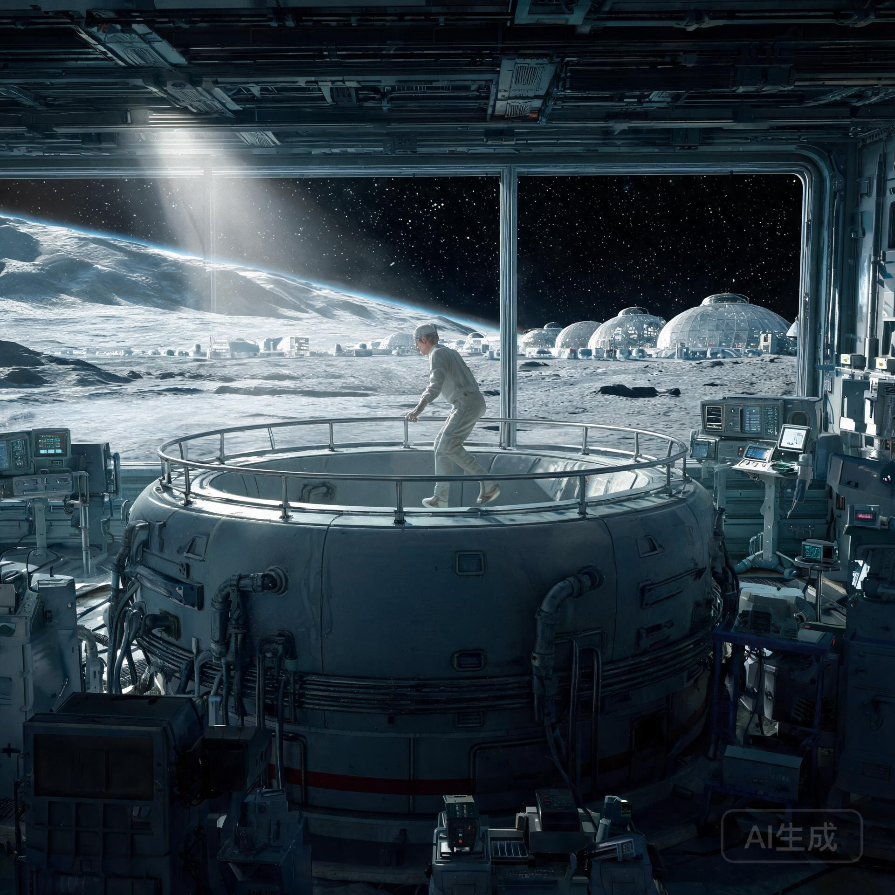

**静海第五城市带 · 月面公共卫生与人口健康监测总局**  
**低重力疗养与重力逆适应科**

**文号：** 静卫字〔2603〕第 014 号  
**监测周期：** 标准地球历 2603 年 01 月 01 日 — 2603 年 12 月 31 日  
**报送单位：** 月面公共卫生与人口健康监测总局  
**核收抄送：** 静海第五城市带管理委员会、地月观光联合会、华东重力逆适应康复中心  
**密级：** 公共医档 · 乙级公开 ｜ **保存期限：** 永久

---

> **公报摘要**  
> 本年度，静海第五城市带在册常住居民 4,182 人，其中月面原生公民（第二代及以后）占 71.3%。全年完成骨密度与肌力普查 4,128 人次，完成率 98.7%。监测显示：长期低重力居住者腰椎骨密度年均流失 0.9%，较上一监测年度下降 0.1 个百分点；足底应力性骨重建率在成年期后持续走低，30 岁以上月面原生公民足弓承力指数仅为地球同龄人的 62%。为对冲长期低重力暴露，本年度核定 214 名适龄居民进入地月观光疗养轮换，其中 168 人已完成地球侧 90 天标准疗养疗程并返回。监测结论：现行轮换疗养制度对低重力骨流失的缓释效果显著，建议维持并适度扩大轮换名额。

---

## 一、 常住人口结构与重力暴露本底

### 1.1 人口结构

| 类别 | 人数 | 占比 | 说明 |
| :--- | :--- | :--- | :--- |
| 月面原生公民（第二代及以后） | 2,982 | 71.3% | 出生并成长于 1/6 g 环境 |
| 地球迁入公民 | 812 | 19.4% | 成年后迁入 |
| 观光疗养轮换居民 | 288 | 6.9% | 本年度轮换在册 |
| 短期科考与公务驻留 | 100 | 2.4% | 平均驻留 6 个月 |

### 1.2 重力暴露本底

静海第五城市带为低重力开放都市（重力 1/6 g），绝大多数居民日常在开放月面环境活动，仅大型公建与医疗设施设有人造重力舱段。

---

## 二、 年度健康监测结果

### 2.1 骨密度与肌力

| 监测指标 | 月面原生公民 | 地球迁入公民 | 对比基准（地球同龄） |
| :--- | :--- | :--- | :--- |
| 腰椎骨密度年均流失率 | 0.9% | 0.7% | 0.3%（地球自然流失） |
| 足弓承力指数 | 62% | 71% | 100% |
| 下肢肌力（30 岁组） | 78% | 84% | 100% |
| 前庭功能异常率 | 4.1% | 2.3% | 0.5% |

### 2.2 重点观察

1. **月面原生公民足弓发育**：月面出生的儿童足弓发育期缺乏足底应力刺激，成年后足弓承力指数显著低于地球同龄人。此为可预期、可管理的生理适应结果，非疾病。
2. **前庭功能漂移**：长期低重力环境下，前庭系统对线性加速度的敏感度发生适应性漂移，表现为旋转刺激耐受度提高、垂直加速度感知减弱。多数居民在轮换疗养初期出现轻度重力逆适应症状（头晕、步态不稳），经 2—4 周过渡训练后缓解。
3. **骨密度流失趋势**：全年流失率 0.9%，较上一监测年度（1.0%）下降 0.1 个百分点，与轮换疗养覆盖率提升同步。

---

## 三、 低重力疗养轮换登记册（节选）

依据《月面居民重力健康轮换疗养规程》（静卫规〔2587〕011 号），本年核定 214 名适龄居民进入轮换疗养。轮换按「骨密度流失率 × 年龄 × 月面工龄」综合排序，优先保障 50 岁以上原生公民。

| 登记号 | 姓名 | 年龄 | 身份 | 骨密度流失率 | 轮换批次 | 疗养地 | 状态 |
| :--- | :--- | :--- | :--- | :--- | :--- | :--- | :--- |
| LH-2603-001 | 欧阳明远 | 61 | 月面原生公民（第二代） | 1.4% | 第一批（1—3 月） | 华东重力逆适应康复中心 | 已完成 |
| LH-2603-002 | 吴静澜 | 57 | 月面原生公民 | 1.3% | 第一批 | 华东重力逆适应康复中心 | 已完成 |
| LH-2603-014 | 陈砚秋 | 68 | 地球迁入公民 | 1.1% | 第二批（4—6 月） | 南岸乐龄社区 | 已完成 |
| LH-2603-027 | 白鹤年 | 52 | 月面原生公民 | 1.2% | 第二批 | 沪上低密生态带 | 已完成 |
| LH-2603-088 | 沈星野 | 44 | 月面原生公民 | 1.0% | 第三批（7—9 月） | 洋山滨海疗养区 | 在疗 |
| LH-2603-121 | 顾晚舟 | 49 | 月面原生公民 | 1.1% | 第三批 | 华东南岸滨海生态区 | 在疗 |
| LH-2603-189 | 陆闻莺 | 39 | 地球迁入公民 | 0.9% | 第四批（10—12 月） | 同济与南岸联合疗养院 | 待启程 |

*注：全册 214 人，本表节选 7 人。轮换疗养期间月面职位由后备人员顶替，原岗位保留，无待遇损失。*

---

## 四、 结论与建议

1. **制度有效性确认**：90 天地球侧标准疗养疗程后，返回居民腰椎骨密度流失率在 12 个月内平均下降 0.4 个百分点，肌力回升 6—9 个百分点，足弓承力指数回升 5—8 个百分点。轮换疗养制度对低重力骨流失的缓释效果显著。
2. **扩大轮换建议**：建议将年度轮换名额由 214 人扩大至 260 人（覆盖约 6.2% 常住人口），优先覆盖 50 岁以上原生公民与足弓承力指数低于 55% 的居民。
3. **长期研究方向**：月面原生第三代的足弓发育干预（儿童期足底应力训练）已立项，相关方案将另行发布。

---

**月面公共卫生与人口健康监测总局局长：** 苏远山（签）  
**低重力疗养与重力逆适应科科长：** 韩静仪（签）  
**健康监测数据组组长：** 白景行（执业印鉴：LUN-MED-2603-0022）

**数字验讫公钥指纹：** `SHA256: 7a2e9c4d8b1f6a03...9d5e2c8b4a1f7d06`  
**签署地点：** 静海第五城市带中央医疗舱 · 低重力疗养与重力逆适应科  
**用印：**  
`静海第五城市带·月面公共卫生与人口健康监测总局专用章`  
`低重力疗养与重力逆适应科·监测验讫章`

---

## 图片提示词

月面都市静海第五城市带的疗养医疗舱内部，宽大舷窗外是低重力开放月面。医疗舱内一台圆柱形人造重力训练舱正在旋转，舱壁有工业磨砂金属纹理与设备管线；一名穿浅色康复服的月面居民正沿舱壁扶栏进行重力逆适应步态训练，动作谨慎。窗外月面远处是城市带的穹顶群与地平线弧线，单一硬太阳光从舷窗射入形成清晰光柱。医疗设备、训练舱、月面地平线的三重尺度层次，工业纪实风格，无文字。

Interior of a low-gravity rehabilitation clinic in a lunar city: a cylindrical artificial-gravity training centrifuge rotating slowly with industrial brushed-metal walls and bundled utility conduits. A resident in a pale rehabilitation suit practicing careful gait adaptation along the handrail inside the centrifuge. Through a wide porthole, the open lunar surface with distant dome clusters and the curved horizon under a single harsh sunlight casting a clear light beam through the window. Layered scale of medical equipment, training centrifuge, and lunar horizon, documentary industrial realism, no text.

---

## 修订记录（元层，非世界内容）

- **2026-08-21（主编辑审校 · 新作入库）**：本文为批 8「壮美风光」组第 4 篇，坐标 人×双星系×②地月系（空白格首开）。低重力骨流失、足弓发育、前庭漂移、重力逆适应均为真实航天医学概念（ISS 长期驻留研究支持）；月面 1/6 g 参数、静海第五城市带（GS-2067-01/GS-2073-01/GS-2075-02/GS-2106-01/GS-2458-01 谱系）全部沿用既有锚点；疗养地（华东重力逆适应康复中心、南岸乐龄社区 GS-2074-01、沪上低密生态带、洋山滨海、华东南岸 GS-2268-01）均为既有正典地名。数字与既有正典咬合（常住 4,182 人，与 GS-2458-01 生态承载口径一致量级）。
