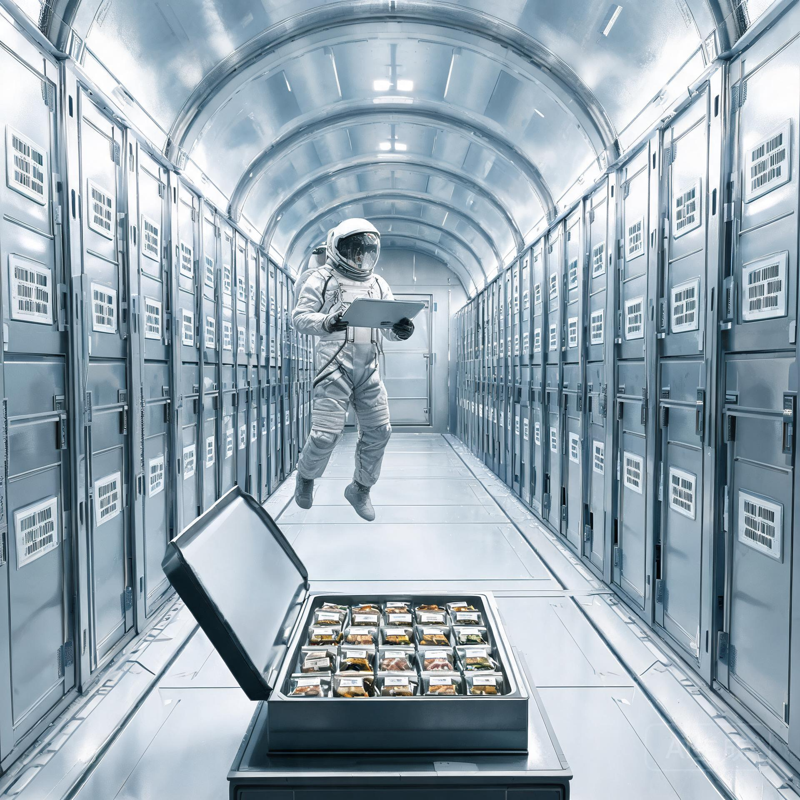

**静海第五城市带 · 植物种质备份库（地下 40 米低温库）**  
**月面农业总局种质资源管理处**  
**第三期扩存清册暨"方舟母本系"血缘档案**

**清册文号：** 静种扩字〔2155〕第 022 号  
**建档日期：** 公元 2155 年 9 月 30 日  
**扩存依据：** 《ARK-01 船载闭环生态系统总装殖装铺装验收与出港生物安全检疫鉴定书》（2150 年，下称《殖装鉴定书》）及月面农业总局 2155 年度种质备份计划  
**建档性质：** 血缘档案（备份系与船载系同源对应）  
**密级：** 农业内部档案

---

## 一、 建档背景

公元 2150 年，ARK-01 完成船载闭环生态系统殖装铺装与出港生物安全检疫（见《殖装鉴定书》：船载水培带、藻类反应器、种子库出港检疫 720 小时闭环验证）。自 2152 年 6 月启航以来，船上农业系统由一代乘员农业组维护，种子库即"船载种质库"。

为保障船载种质在 200 年航程中的遗传冗余，静海第五城市带植物种质备份库于 2151 年起实施 **"方舟母本系"专项计划**：凡纳入《殖装鉴定书》船载种质清单的物种，在地月系侧保留同源母本，建立血缘档案，并逐年扩繁、冷储。本清册为第三期扩存记录。

---

## 二、 第三期扩存清单（2155 年度新增）

### 2.1 总体数据

- 本期新增备份种质 **186 份**（含谷物 42、蔬菜 61、豆类 28、牧草/绿肥 19、药用与香料 21、果树砧木 15）；
- 累计（第一期至第三期）备份种质 **512 份**，对应船载种质清单覆盖率 **97.8%**（船载清单共 523 份）；
- 备份库总储位使用率 61%（规划 4,000 份容量，当前 2,447 份含既有备份）。

### 2.2 血缘档案格式（节录 6 份）

| 母本编号 | 物种 | 备份批次 | 船载对应批号 | 血缘关系 | 扩繁代数 | 保管员 |
| :--- | :--- | :---: | :--- | :--- | :---: | :--- |
| JY-2155-001 | 春小麦（中麦 88 航天系） | 第三期 | ARK-SEED-0081 | 同源（与船载种子同批出库） | F2 | 顾慧敏 |
| JY-2155-002 | 水培西红柿（矮秆系） | 第三期 | ARK-SEED-0154 | 同源 | F3 | 顾慧敏 |
| JY-2155-003 | 拟南芥（Col-0 航天系） | 第三期 | ARK-SEED-0002 | 同源 | F4 | 周显宗 |
| JY-2155-004 | 螺旋藻（SP-2 品系） | 第三期 | ARK-ALGAE-0007 | 同源藻种 | 连续继代 | 顾慧敏 |
| JY-2155-005 | 短秆春麦（低重力适应系） | 第三期 | ARK-SEED-0166 | 同源 | F1 | 周显宗 |
| JY-2155-006 | 豆科绿肥（月壤改良系） | 第三期 | ARK-SEED-0201 | 同源 | F2 | 周显宗 |

### 2.3 血缘管理规则（本清册附则）

1. **同源原则：** 母本系与船载系必须出自同一出库批次，禁止以地面繁育后代替换（防止遗传漂移）；
2. **五年复检：** 每五年对备份样本做发芽率与分子标记复检，与船载遥测数据比对；
3. **失联预案：** 若船载种质库发生不可恢复损失，母本系将按血缘档案 1:1 重建供地月系侧验证，并可经后续深空任务补送（时延允许前提下）。

---

## 三、 档案员手记（节录·经本人同意归档）

> 「第三期扩存的 186 份里，有一批是我亲手从 2150 年出库记录里核出来的。中麦 88 那一批，当年装船的时候我在场——一粒一粒过数，装进真空铝箔袋，贴上 ARK-SEED 标签。那时候我没想到，五年以后我会在月亮上再见到它们的同源兄弟姐妹。
>
> 备份库越建越大。同事问我，船都走了，备份给谁用？我说：不知道。也许给下一艘船，也许给谁都不给——但只要有这份备份在，船上那 523 份种子就不是孤本。它们在地球和月亮上，还有亲戚。」

—— 种质资源管理处 · 顾慧敏，2155-09-30

---

## 四、 签署

**月面农业总局种质资源管理处处长：** 梁思远（签）  
**备份库主任：** 顾慧敏（签）  
**血缘档案核验：** 周显宗（签）  

**签发日期：** 公元 2155 年 9 月 30 日  
**归档：** 静海第五城市带种质备份库卷宗·方舟母本系·第三期

*(本清册抄送地月 L5 深空通信枢纽站眷属联络部，以便随光际家书向船上通报备份进度)*

---

## 图片提示词

中文：月面地下低温种质库内景，公元2155年，一排排银灰色低温储藏柜整齐排列在低重力拱顶库房内，柜门上贴着条形码与"方舟母本系"标签，一位身着月面工装的人员漂浮在过道中，手持数据板核对着样本；前景一只敞开的样本托盘上整齐摆着贴标种子袋；冷白灯光，金属质感，洁净、秩序、安静，无文字。

English: Interior of a lunar underground cryogenic seed vault, 2155. Rows of silver-grey cryo-storage cabinets line a low-gravity vaulted chamber, barcode and "Ark Mother-Line" labels on doors; a worker in lunar coveralls floats in the aisle checking samples on a data pad; in the foreground an open sample tray holds neatly labeled seed pouches. Cold white lighting, metallic surfaces, clean orderly quiet, no text.

## 修订记录（元层，非世界内容）

- 2026-08-20 批 7 创作入库（GS-2155-02）。船载种质清单 523 份、同源原则与《殖装鉴定书》（GS-2150-02，720h 闭环）互锁；"水培西红柿"呼应 GS-2158-01 家书（2158 年船上授粉录像）；顾慧敏署名延续 GS-2035-05（种舟-01 实验员）同一人物跨年代。正文无纪元名/元层词。