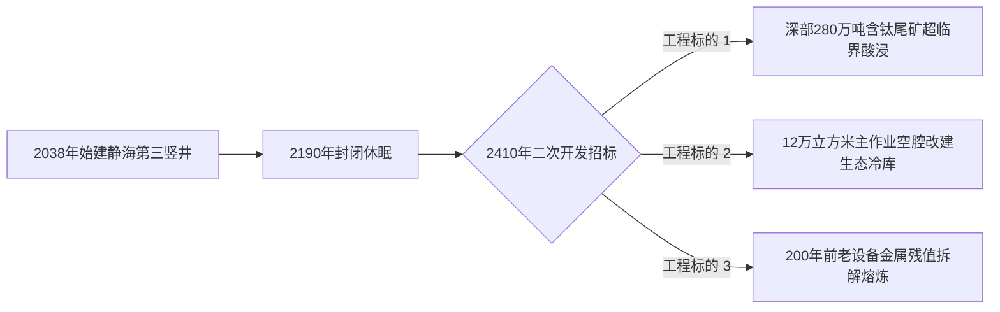

# 静海退役第三竖井重金属浸出尾矿再资源化招标书与残值对冲协议

**标书文号**：LUNAR-REC-2410-BID-003  
**发标单位**：地月联合资产清理与二次资源开发总署（月面办公室） / 静海第五城市带遗产管理委员会  
**招标标的**：静海第三采选竖井（始建于公元 2038 年，2190 年停产封堵）深层尾矿浸出再选工程暨地下玄武岩空腔生态化转产项目  
**结算模式**：超临界流体稀散金属提取收益分成 + 历史遗留重构件残值对冲（双轨代币结算）  

---

## 一、标的资产历史现状与工程概况

静海第三竖井系人类在月球表面开凿的最早一批工业采掘深井之一（主竖井深 $480 \\,\\text{m}$，分支采掘巷道总长 $18.4 \\,\\text{km}$）。经过两个世纪的开采与休眠，井底仍留存早期低回收率阶段弃置的高钛玄武岩尾矿砂约 **280 万吨**，并含有极高品位的稀散贵金属（铼、钪、镓及同位素 $\\text{He-3}$ 结合态微量残留）。

### 1. 核心技术指标要求
- **尾矿稀有金属综合提取率**：$\\text{Sc} \\ge 88.5\\%, \\; \\text{Re} \\ge 92.0\\%$（须采用封闭无排放之超临界 $\\text{CO}_2$ 络合浸出工艺）。
- **地下空腔生态化稳固**：完工后须将主工棚作业面（净容积 $120,000 \\; \\text{m}^3$）完成气密喷涂注浆，无偿移交予静海遗产委员会改建为深层低重力种质繁育与冷热联供站。

---

## 二、历史遗留老旧装备残值评估与对冲清单

依据现场无人激光测绘与资产清点报告，井下遗留早期机械设备作价及对冲规则如下：

| 资产编号 | 装备名称与原始年代 | 材质与估算净重 | 评估残值 (水冰代币) | 处置与对冲要求 |
|:---|:---|:---:|:---:|:---|
| **LUNAR-EQ-2038-01** | 大型全液压凿岩台车机架（2040年代产） | 钛合金与耐磨高锰钢 / $42.5 \\text{ 吨}$ | $18,400$ | 现场等离子切割，作为高纯合金废料回炉熔炼。 |
| **LUNAR-EQ-2048-14** | 第一代密闭式工间播音广播控制台 | 铝铜钣金、老式集成电路 / $120 \\text{ kg}$ | **无价（文物）** | **严禁拆解！全量原位封装移交静海工史博物馆。** |
| **LUNAR-EQ-2055-88** | 矿工更衣箱与工具柜（共计 140 组） | 冲压铁皮 / $8.4 \\text{ 吨}$ | $2,100$ | 残值充抵施工方气密喷涂工程款；柜内如有个人刻痕工具（如老式扳手等）须上交登记。 |

---

## 三、竞标与对冲结算公证书条款

1. **投标履约保证金**：竞标单位须在地月结算银行锁定 $50,000$ 单位标准深空远期水冰代币作为环境保证金。
2. **遗产保护一票否决权**：在巷道清理与尾矿开采过程中，凡发现 21 世纪中叶工匠原件手写字迹、刻痕纪念牌或老式手工工具，必须立即暂停作业并报请文化遗产专员核验；擅自熔毁历史遗存者，处以工程总包价三倍之惩罚性扣款。

---

**发标人代表**：静海资产清算局 局长 杜文渊（签字）  
**工程评估师**：韩建国（签字）  
**备案公证**：地月空间财产法权登记处
