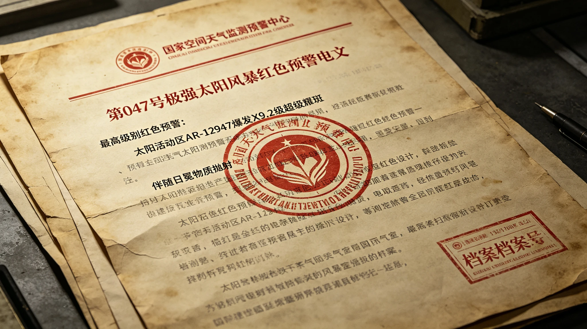
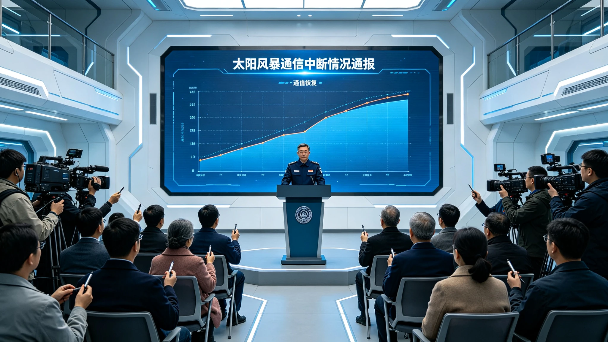
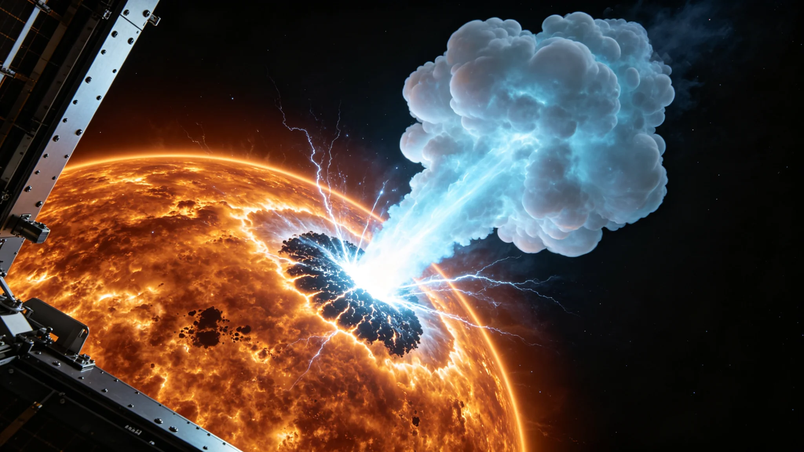
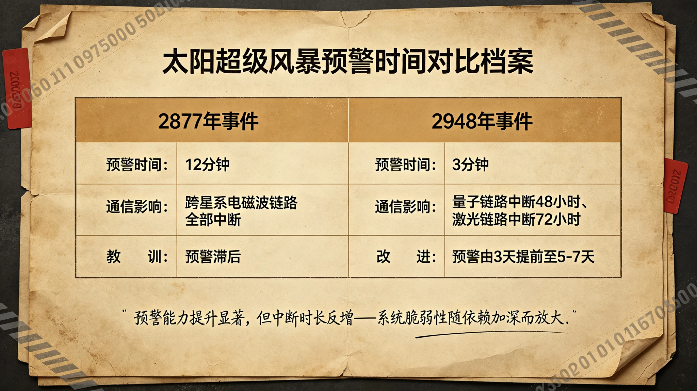
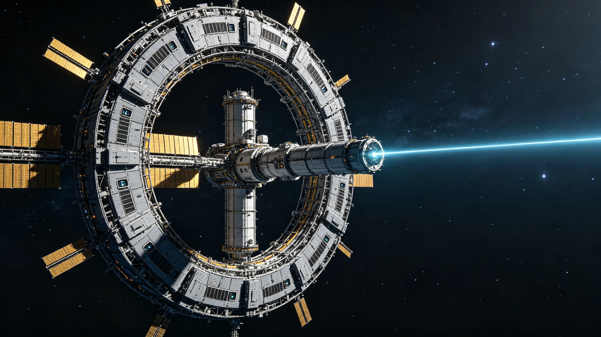

# 三恒星系文明联合体 · 历史研究院

# 历史调查局

---

# 调查档案

---

| 卷宗信息 | |
|---|---|
| **档案编号** | HR-001（档案版） |
| **事由** | 2948年跨星系通信中断事件调查 |
| **事件时间** | 2948年3月12日-3月17日（地球协调时） |
| **立案时间** | 3004年12月10日 |
| **定稿时间** | 3005年3月17日 |
| **密级** | 联合体档案·研究公开 |
| **发布机构** | 三恒星系文明联合体历史研究院·历史调查局（HRB） |
| **编制依据** | 《三恒星系文明联合体宪章》第四十三条（GS-2999-01）；《历史研究院组织条例》 |
| **本版性质** | 档案版（说明文体），与同编号叙事版配套，供档案查阅与研究引用 |

**事件概述**：2948年3月12日，太阳活动区AR-12947爆发X9.2级耀斑，伴随日冕物质抛射（CME）。耀斑引发的电磁波干扰与随后的高能粒子冲击，导致地球与比邻星b、鲸鱼座τ星之间的跨恒星系通信链路相继中断：地球-比邻星b量子纠缠通信链路中断48小时，地球-鲸鱼座τ星激光链路中断72小时；在航12艘跨恒星系飞船与地面全部失联。3月17日16时32分，全部链路基本恢复，通信中断总时长72小时。事件造成直接经济损失约87亿星元（GS-2948-01）。在航飞船无人伤亡。

---

## 一、事件概要

本档案依调查局立案（3004年12月10日）所成，依据原始档案、正典记录与访谈材料，对2948年3月跨恒星系通信中断事件的经过、机理、根因、影响与整改进行系统性记录。本版为说明文体，供档案查阅使用；事件的叙事性呈现见同编号叙事版。

### 1.1 事件性质

本次事件属于**极端空间天气导致的跨恒星系通信基础设施系统性失效**。其直接触发因素为太阳耀斑与CME，但失效范围（12艘在航飞船全部失联、量子链路中断48小时、激光链路中断72小时）超出了单一设备故障的范畴，暴露出通信基础设施在设计基准、防护标准与应急流程上的系统性缺陷。

### 1.2 关键事实

经查证，本次事件的核心事实如下：

1. **预警及时**：X9.2级耀斑发生后3分钟（04时17分→04时20分），空间天气监测预警中心发布红色预警。相较2877年同类事件的12分钟预警（GS-2948-01回溯记录），预警反应速度显著提升。
2. **决策窗口**：CME预计抵达时间为3月14日16时32分，预警发布至抵达间隔约60小时。此窗口期内，通信总署经TEL-2948-0312-03会议决定对中继站"不关停、不降载"，未采取新增防护措施。
3. **中断规模**：3月14日18时00分，地球-比邻星b量子链路中断（持续48小时）；21时15分，地球-鲸鱼座τ星激光链路中断（持续72小时）。在航12艘飞船与地面通信全部中断。
4. **零伤亡**：事件期间在航飞船无人伤亡。1艘货船导航偏差0.003°，2艘飞船内部通信受损（其中1艘以45分钟完成备用系统切换，标准操作时间为10分钟）。
5. **恢复耗时**：3月16日18时32分量子链路部分恢复（质量28%），3月17日16时32分全部链路基本恢复。总中断时长72小时。

### 1.3 根因概要

本档案经六层追问，将事件根因归纳为三项：**设计基准滞后**（中继站探测器防护未纳入极端粒子事件指标）、**制度反馈缺失**（2879年委员会"暂不修订"决议69年未被兑现）、**应急预案不足**（60小时窗口期内未采取实质防护动作，在航飞船备用通信演练不足）。三项根因的具体论证见第五章。

### 1.4 整改与后续

依据GS-2948-01，联合体于2949-2952年间完成通信基础设施加固（28亿星元），建立跨星系应急协调机制；2949年立项中微子备用通信链路，2997年首次贯通（GS-2997-01）；2951年部署L1监测卫星，2953年预警AI模型上线。至3004年审计时，加固工程仍发现验收出入，遂有本局立案。整改核查详见第七章。

---
## 二、调查依据、范围与方法

### 2.1 调查依据

本调查依以下依据展开：

1. 《三恒星系文明联合体宪章》第四十三条关于历史研究院职责之规定（GS-2999-01）；
2. 《历史研究院组织条例》关于历史调查局立案、取证与发布之程序；
3. 联合体议会预算委员会3004年11月转来的审计发现：2948年后通信基础设施加固工程（28亿星元）在3003年年度审计中，部分站点验收记录与巡检记录存在出入；
4. 正典档案：《GS-2948-01》（事件复盘公报）、《GS-2910-01》（中继站技术档案）、《GS-2918-01》（2918年远航者号事件公报）、《GS-2942-01》（比邻星b旅游经济报告）、《GS-2949-01》（ARK01出港纪念）、《GS-2953-01》（通信时差仲裁公约）、《GS-2997-01》（中微子链路贯通公报）、《GS-2999-01》（联合体宪章）。

### 2.2 调查范围

1. 事件时间范围：2948年3月12日04时17分（耀斑爆发）至3月17日16时32分（链路基本恢复），以及后续整改期（2948-3004年）。
2. 空间范围：地球、比邻星b、鲸鱼座τ星三个恒星系及其中继站、在航飞船。
3. 事项范围：预警过程、决策过程、链路失效机理、在航飞船状态、损失评估、整改落实。

### 2.3 调查方法

1. **档案调取**：调取空间天气监测预警中心、通信总署、航行安全管理局三家机构移交的原始档案，含预警电文、会议纪要、值班日志、检修工单、公告文本等。
2. **技术复核**：依据GS-2910-01等正典，复核中继站设计参数、探测器技术指标与失效机理。
3. **访谈**：完成访谈17人次（编号I-01至I-17，见附录），并接受私人咨询3人次（工程经济、心理、法律各1人次）。
4. **缺口登记**：对无法证实或证伪的事项，登记为证据缺口（GAP-01至GAP-15，见附录）。

### 2.4 调查进程

本调查自3004年12月10日立案至3005年3月17日定稿，历时约十个月，主要进程如下：

1. **3004年12月**：完成立案与调查组组建；调取三家机构移交的原始档案（预警电文、会议纪要、值班日志、检修工单、公告文本等，共19项关键文档）；
2. **3005年1月**：完成时间线初步重建；启动访谈；发现林远建议备忘（HR-001-DOC-09）未进入任何流程的事实；
3. **3005年2月**：完成技术复核（中继站设计参数、探测器失效机理）；完成17人次访谈；完成证据缺口登记；
4. **3005年3月上旬**：报告初稿完成，内部交叉复核；
5. **3005年3月17日**：档案版与叙事版同日定稿发布，恰为2948年通信完全恢复五十七周年。

---

## 三、事实经过

本章按时间顺序记录事件经过。所有时间均为地球协调时；凡涉及其他恒星系本地时间处，单独注明。

### 3.1 事件前情

**空间天气背景**：2948年3月，太阳处于第25活动周高年。3月12日前一周，太阳活动区AR-12947持续活跃，累计爆发M级耀斑7次、C级耀斑23次，但均未触发红色预警（据预警中心移交的周报）。

**通信基础设施状态**：截至2948年3月，跨恒星系实时通信依赖量子纠缠通信中继站网络。该网络于2910年起陆续建成（GS-2910-01），地球、比邻星b、鲸鱼座τ星三地合计部署7座中继站（编号QRS-01至QRS-07），单座总质量约12万吨，地球-比邻星b单链路延迟0.28秒。中继站核心器件为超导纳米线单光子探测器（SNSPD），工作温度4.2K。此外，地球-鲸鱼座τ星间另有一条激光通信链路作为辅助信道。

图7为地球侧量子通信中继站外观档案影像。图中可见中继站模块化舱段、散热板阵列与纠缠分发终端。中继站总质量约12万吨，系跨恒星系实时通信的枢纽设施。

**在航飞船状态**：3月12日，跨恒星系航线在航飞船共12艘（客运4艘、货运8艘），载员合计逾8,000人。其中远航者-7号为第四代客运飞船，载员2,847人（船员847人、乘客约2,000人），执行地球—比邻星b—鲸鱼座τ星航线。

图1为远航者-7号客运飞船深空航行影像（摄于2947年，来源为航行安全管理局宣传档案）。远航者-7号于2905年建造、2907年投入运营，为远航者级第四代跨恒星系客运飞船。事件期间，该船载员2,847人。

### 3.2 预警阶段（3月12日）

**04时17分**：太阳活动区AR-12947爆发X9.2级耀斑。预警中心观测员在例行监测中捕捉到通量异常上升。

**04时20分**：预警中心发布"第047号极强太阳风暴红色预警电文"，载明耀斑等级X9.2、活动区编号AR-12947，并预告伴随CME、预计3月14日16时32分前后抵达地球磁层。自耀斑爆发至预警发布，间隔3分钟（GS-2948-01）。作为对照，2877年同类事件中，预警间隔为12分钟。

图4为空间天气监测预警中心第047号红色预警电文档案影像。电文载明耀斑等级X9.2、活动区AR-12947、红色预警级别，并预告CME抵达时间。

**05时00分**：航行安全管理局启动一级应急响应。一级响应的标准动作包括：通知在航飞船转入防护姿态、通知各通信运营方进入警戒、启动应急值班。

**08时30分**：耀斑发出的高能光子抵达地球附近，电磁波通信（含无线电与常规微波链路）发生大规模中断，持续时间约1小时。量子链路与激光链路未受影响。

**10时00分-10时40分**：通信总署召开TEL-2948-0312-03会议，议题为是否提前关停地球侧中继站以规避CME风险。会议结论：不关停、不降载，维持正常运行。会议另讨论了中继站姿态调整问题，结论为不调整（据会议纪要，HR-001-DOC-07）。

**13时-17时**：预警中心完成CME参数复核，确认抵达时间估计偏差在±2小时以内。

**当日夜间**：在航飞船按一级响应要求完成防护动作（据各船例行报告汇总）。

### 3.3 冲击阶段（3月14日）

**16时32分**：CME抵达地球磁层。磁层顶向阳面由正常状态的约10个地球半径压缩至6.2个地球半径（GS-2948-01）。高能粒子深入近地空间。

**18时00分**：地球-比邻星b量子链路中断。据通信总署值班日志（HR-001-DOC-08）："18时02分，地球-比邻星b链路异常，误码率超限，已转人工处置。"链路中断原因为地球侧中继站光子探测器模块在高能粒子轰击下误码率飙升，超过纠错能力。中继站2个SNSPD探测器模块受损（据检修工单，HR-001-DOC-10，图6），后续维修费用约1,200万星元。

图6为地球侧中继站受损探测器模块检修工单档案影像。工单载明：设备编号QRS-PROXIMA-07，受损模块SNSPD光子探测器模块，损伤原因高能粒子轰击致误码率飙升，处置为更换模块，维修费用1,200万星元。

**21时15分**：地球-鲸鱼座τ星激光链路中断。原因初步判定为高能粒子干扰激光跟踪系统（据通信总署移交记录）。

**18时00分至21时15分**：两链路相继中断期间，各在航飞船陆续与地面失去实时通信。飞船转入自主航行模式（详见第四章技术分析）。

### 3.4 失联阶段（3月15日-3月17日）

**3月15日02时40分**：远航者-7号发出最后一条状态消息，内容为内部通信告警：舱段间内部通信系统受电磁干扰中断，已启动备用有线通信系统，操作耗时45分钟（标准操作时间10分钟，据应急处置记录，HR-001-DOC-11，图8）。

**03时02分**：管理局系统自动标记远航者-7号为"待查"（据值班记录）。

**04时30分**：管理局应急值班员经无线电呼叫远航者-7号，无响应。值班记录载："飞船无响应，原因不明。"

**3月15日-16日**：管理局通过内太阳系通信网络向公众发布情况公告。自3月12日预警起至3月17日恢复，共发布公告12次（GS-2948-01）。公告内容限于宏观应急状态，无法提供飞船个体实时状况。

图2为管理局公告发布会现场影像。事件期间管理局共发布公告12次，通报宏观应急状态与恢复进展。

**3月16日10时00分**：太阳风暴强度开始减弱。

**3月16日18时32分**：地球-比邻星b量子链路部分恢复，通信质量约为正常水平的28%。积压的跨恒星系通话请求开始陆续接通。据通信总署统计，3月16日至19日，跨恒星系通话请求积压逾40万次，实际接通不足2万次。

**3月17日16时32分**：全部受影响的通信链路基本恢复正常。自3月14日18时00分量子链路中断起算，通信中断总时长72小时。

### 3.5 恢复阶段（3月17日之后）

**3月17-23日**：各在航飞船陆续与地面恢复常规通信。远航者-7号于3月17日16时32分后恢复与地球联系（据管理局恢复确认记录）。全事件期间，12艘在航飞船无人伤亡，1艘货船导航偏差0.003°，2艘飞船内部通信受损，其余飞船状态正常（GS-2948-01）。

**后续处置**：管理局于3月下旬发布事件复盘公报（GS-2948-01），载明直接经济损失约87亿星元，含通信中断导致的金融、政务、科研与商业损失，以及中继站维修费用1,200万星元。

### 3.6 关键节点时间表

为便于档案查阅，将事件关键节点汇总如下（均为地球协调时）：

| 时间 | 节点 | 数据来源 |
|---|---|---|
| 3月12日 04:17 | AR-12947爆发X9.2级耀斑 | 预警中心记录 |
| 3月12日 04:20 | 发布红色预警（间隔3分钟） | 预警电文（图4） |
| 3月12日 05:00 | 管理局启动一级应急响应 | 管理局记录 |
| 3月12日 08:30 | 电磁波通信中断（约1小时） | 通信总署记录 |
| 3月12日 10:00-10:40 | TEL-2948-0312-03会议：不关停、不降载 | 会议纪要 |
| 3月14日 16:32 | CME抵达，磁层顶压缩至6.2R | GS-2948-01 |
| 3月14日 18:00 | 量子链路中断 | 值班日志（持续48小时） |
| 3月14日 21:15 | 激光链路中断 | 通信总署记录（持续72小时） |
| 3月15日 02:40 | 远航者-7号最后状态消息（内部通信告警） | 应急处置记录（图8） |
| 3月15日 03:02 | 系统自动标记远航者-7号"待查" | 值班记录 |
| 3月15日 04:30 | 无线电呼叫无响应，报告"原因不明" | 值班记录 |
| 3月16日 10:00 | 太阳风暴强度开始减弱 | 预警中心记录 |
| 3月16日 18:32 | 量子链路部分恢复（质量28%） | 通信总署记录 |
| 3月17日 16:32 | 全部链路基本恢复（总时长72小时） | GS-2948-01 |

---
## 四、技术分析

### 4.1 太阳活动：X9.2级耀斑与CME

X9.2级耀斑属于软X射线峰值通量最高分级（X级）中的强事件。据预警中心移交的观测记录，本次耀斑的特征如下：

1. **软X射线通量**：峰值达到X9.2级，为GS-2948-01所载2877年事件（X8.7级）之后的又一次X级强事件。
2. **活动区**：AR-12947，位于太阳南半球中纬度区域，爆发前一周持续活跃。
3. **伴随现象**：耀斑伴随显著的日冕物质抛射（CME），抛射物质为高能等离子体云，速度与方向经预警中心推算，预计约64小时后抵达地球磁层。

本次事件的物理链条为：耀斑产生的高能光子（以光速传播，约8分钟抵达地球）首先引发电磁波通信中断；随后CME携带的高能粒子云（以远低于光速的速度传播）在约2天后抵达，对磁层与近地空间设备造成冲击。

图3为空间望远镜对AR-12947耀斑爆发的观测影像，可见蓝白色等离子体弧与日冕物质抛射结构。

### 4.2 预警能力：3分钟间隔的技术基础

本次预警自耀斑爆发至红色预警发布间隔3分钟，显著短于2877年事件的12分钟（GS-2948-01）。这一进步的技术基础包括：

1. **实时通量监测**：L点与近地轨道X射线监测卫星实现软X射线通量的秒级采样；
2. **自动判级系统**：预警中心于2890年代起部署自动判级系统，通量达到X级阈值时自动触发预判；
3. **值班观测确认**：观测员对自动预判进行人工复核后签发预警。

需要指出：3分钟间隔仅覆盖"耀斑爆发—预警发布"环节。CME的抵达时间预估（本次为64小时±2小时）依赖于太阳风模型，其精度自2877年以来有所提升，但仍存在系统性误差（详见本档案第四章4.4节之"预警时间对比档案"，图9）。

图9为2877年与2948年两次事件预警时间对比档案页。左栏2877年事件：预警间隔12分钟，电磁波链路全部中断；右栏2948年事件：预警间隔3分钟，量子链路中断48小时、激光链路中断72小时。

### 4.3 量子链路失效机理

地球-比邻星b量子纠缠通信链路的失效，是本事件的核心技术环节。其机理经技术复核确认如下：

**（1）链路工作原理**。量子纠缠通信不传输电磁波信号，而是通过分发与维持纠缠光子对实现信息传递（GS-2910-01）。中继站承担"纠缠交换"与"纠缠纯化"功能：前者使两路不直接纠缠的光子建立纠缠关系，后者降低噪声、提高保真度。中继站因此不"转发"信号，而"维持"纠缠。

**（2）核心器件**。纠缠维持依赖单光子探测器（SNSPD）。该器件由超导纳米线构成，工作于4.2K低温环境，具有"极高的探测效率"与"极低的暗计数"两项关键指标（GS-2910-01）。

**（3）失效过程**。CME高能粒子穿透中继站舱体后，击中SNSPD超导纳米线。粒子在纳米线上形成局部"热斑"，使该区域短暂失去超导性，在探测器输出端表现为一次虚假"光子到达"信号，即误码。单次粒子事件产生单次误码；粒子通量超出正常水平后，误码率在数分钟内飙升，超过纠错编码能力上限，链路自动断开。

**（4）受损范围**。经检修确认，地球侧中继站2个SNSPD探测器模块受损，需整模块更换（检修工单HR-001-DOC-10，图6），维修费用约1,200万星元。

**（5）与"量子通信不受电磁干扰"的关系**。量子纠缠原理不受电磁波干扰，此为原理层面的免疫；但纠缠的承载依赖物理设备，高能粒子可对设备造成物理损伤。本次失效属于后者，与量子纠缠原理无关。管理局第12次公告曾就此专门澄清（GS-2948-01）。

### 4.4 激光链路失效机理

地球-鲸鱼座τ星激光链路于3月14日21时15分中断。初步判定原因为：高能粒子干扰激光跟踪系统，导致光轴失准、接收端信噪比急剧下降，链路自动中断。激光链路的中断时间（72小时）长于量子链路（48小时），与两侧均无中继站冗余、恢复依赖地面端重校准有关。激光链路中断的具体损伤点，因该链路缺乏中继站级别的在线监测记录，未能完全定位（登记为证据缺口，见附录）。

### 4.5 磁层压缩与粒子深入

CME抵达时，地球磁层顶向阳面由约10个地球半径压缩至6.2个地球半径（GS-2948-01）。磁层压缩的直接后果：

1. 地球同步轨道附近的空间环境显著恶化，粒子通量上升数个量级；
2. 磁层屏蔽能力下降，高能粒子可深入至近地空间更低高度；
3. 部署于近地轨道与地球同步轨道之间的通信中继设施，直接暴露于高能粒子环境。

中继站探测器模块的损伤，即发生于上述环境中（图5）。

图5为CME高能粒子云冲击地球磁层的示意影像：磁层顶向阳面被压缩至6.2个地球半径，高能粒子深入近地空间。

### 4.6 在航飞船状态分析

**（1）自主航行模式**。通信中断后，各在航飞船转入自主航行模式。该模式为飞船设计标配，依赖船载导航与姿态控制系统，不依赖地面实时支持（据GS-2918-01所载远航者级飞船设计沿革）。全事件期间，12艘飞船保持航线稳定，仅1艘货船出现0.003°导航偏差，未构成安全风险。

**（2）内部通信受损**。2艘飞船的内部通信系统受电磁干扰影响。其中1艘（远航者-7号）舱段间内部通信中断，经45分钟完成备用有线通信系统切换；标准操作时间为10分钟（HR-001-DOC-11，图8）。该项数据被GS-2948-01列为"存在的问题"第4条，指向船员在极端电磁环境下对备用系统的操作熟练度不足。

图8为远航者-7号内部通信故障应急处置记录档案影像。记录载明：3月15日02时40分，舱段间内部通信系统受电磁干扰中断，启动备用有线通信系统，操作耗时45分钟（标准操作时间10分钟）。

**（3）乘客与船员安全**。全事件期间无人员伤亡。远航者-7号在失联期间维持生命保障系统正常运行（据恢复后状态报告）。

### 4.7 技术小结

本次事件的技术链条完整、机理清晰：耀斑高能光子引发电磁波中断（1小时）→CME高能粒子压缩磁层并轰击设备→量子链路探测器损伤中断（48小时）→激光链路跟踪系统受损中断（72小时）→在航飞船因无实时链路转入自主航行（72小时失联）。

技术层面最值得记录的发现是：**失效并非发生于"通信原理"层面，而发生于"设备物理生存能力"层面**。量子链路中断的原因不是纠缠失效，而是承载纠缠的探测器被粒子损坏；激光链路中断的原因不是光通信失效，而是跟踪设备被干扰。原理免疫与设备脆弱并存，是本次事件技术分析的核心结论。

---
## 五、根因分析

本章在第三章事实经过与第四章技术分析的基础上，对事件根因进行系统分析。分析方法采用逐层追问：先确定直接原因，再追问直接原因背后的设计与制度因素，并对提出的各项假设逐一检验。

### 5.1 直接原因

事件的直接原因是：**X9.2级耀斑与伴随CME构成极端空间天气事件，高能粒子对通信基础设施核心设备造成物理损伤**。具体为：

1. 地球侧量子中继站2个SNSPD探测器模块被高能粒子击穿损伤，导致量子链路误码率超限、链路中断；
2. 地球-鲸鱼座τ星激光链路的跟踪系统受高能粒子干扰，导致链路中断；
3. 在航飞船因无实时链路与地面失去联系，转入自主航行模式。

直接原因层面，本次事件与2877年事件的差异在于：2877年中断的是电磁波通信设施；2948年中断的是量子与激光通信设施。这反映了一个共同规律——**极端空间天气对深空电子设备的威胁，随设备精密度的提升而上升**。

### 5.2 深层原因一：设计基准滞后

对量子中继站设计基准的核查发现：

**（1）探测器防护未纳入极端粒子事件指标**。GS-2910-01及配套设计文件显示，中继站SNSPD探测器的防护设计依据的是"正常空间环境+一般太阳活动"的粒子通量参考值。中继站舱壁对探测器的辐射防护属于"顺带屏蔽"（利用舱体结构的既有厚度），未针对极端CME粒子事件设置专项屏蔽指标。换言之，探测器的抗粒子损伤能力，从未被列为设计指标。

**（2）《跨恒星系空间通信设施设计规范》空间环境载荷章节的参考值长期未调整**。经查，该规范空间环境载荷章节自2908年版定型后，于2895年、2913年、2931年三次修订，均未调整"极端事件"参考值。2913年修订说明载有"空间环境载荷数据维持2908年版，暂不调整"，未附讨论过程。

**（3）设计基准滞后的代价**。按2877年实测通量设计屏蔽，探测器防护罩需加厚约2-3倍，单站建设成本增加约8%-12%，三恒星系全设施增量成本估计约14亿-20亿星元（2908年币值）。而本次事件直接损失87亿星元、后续整改投入28亿星元，合计115亿星元，为预防成本的5-8倍。

### 5.3 深层原因二：制度反馈缺失

对"设计基准为何69年未调整"的追问，发现制度层面的反馈机制存在系统性缺失：

**（1）2879年委员会决议**。2879年，通信工程标准委员会曾评估"是否将2877年超级风暴数据纳入设计基准"，结论为"暂不修订"，理由有三：2877年数据属极端值、量子通信当时尚未部署缺乏针对性数据、全面修订成本不可接受。会议记录同时载有反对意见："量子通信设备的物理生存能力标准，应当与电磁波设施一致甚至更严格。"该意见未获采纳。

**（2）"暂缓"的后续**。2879年决议载明"待数据积累后再议"。但核查显示：2910年中继站部署、2913年规范修订时，"再议"未发生；2931年修订时，空间环境载荷数据被作为"无争议项"跳过。2879年的"暂缓"，在2913年成为"默认"，在2931年成为"没人在意"。"暂"一暂69年。

**（3）反馈机制缺位的结构原因**。规范修订依赖委员会主动发起，缺乏"重大空间天气事件→强制复审设计基准"的自动触发机制。预警中心记录了每一次极端事件，通信工程界也知晓2877年教训，但两者之间没有制度化的传导通道。事件数据与设计基准之间，存在一段无人负责的空白地带。

### 5.4 深层原因三：应急预案不足

对60小时决策窗口期（3月12日05时至3月14日16时32分）内应急预案的核查发现：

**（1）决策未采取实质防护动作**。TEL-2948-0312-03会议决定"不关停、不降载、不调整姿态"。会议记录显示，讨论基于三项判断：关停代价过大（跨恒星系链路中断即事故）、降载影响通信质量、姿态调整成本高。会议未讨论探测器防护核查事项。列席工程师林远于会后提交《关于核查探测器防护罩设计指标的建议》（HR-001-DOC-09），该备忘未进入任何流程，后于收文筐中消失，无签收、无批示、无归档。

**（2）中继站防护动作缺失的客观条件**。经核查，即便会议决定采取防护动作，中继站亦缺乏可用的防护手段：中继站未配备可移动辐射屏蔽装置，探测器模块不具在线更换条件，姿态调整收益有限。换言之，"不做"的背后，是"无可做"——防护手段在设计阶段即未规划。

**（3）在航飞船备用通信演练不足**。GS-2948-01"存在的问题"第4条载：1艘飞船（远航者-7号）船员对备用有线通信系统操作不熟练，切换耗时45分钟（标准10分钟）。核查显示，备用系统操作演练在2948年前为年度科目，频次不足。

### 5.5 排除的假设

调查过程中提出的主要假设及检验结论如下：

**假设一：设备老化所致**。检验：中继站探测器模块于2947年年度检修中签署"状态良好"结论（HR-001-DOC-10）；受损模块自上次更换以来运行时间处于设计寿命内。结论：**部分成立但不充分**。设备存在一定老化因素（贡献因素），但无法解释"一年前良好、一次事件即失效"的跳跃。该假设降级为贡献因素。

**假设二：人为破坏**。检验：三家机构移交的出入记录、检修记录、值班记录经交叉核对，无异常操作痕迹；事件发生时间与太阳活动周期高度吻合，人为干预无法解释。结论：**排除**。

**假设三：量子通信原理缺陷**。检验：量子纠缠原理不受电磁干扰，本次失效发生于设备物理层面而非原理层面（见4.3节）。结论：**排除**，且该假设的流传属对"原理免疫"的误解，管理局第12次公告已澄清。

### 5.6 根因小结

本调查将事件根因归纳为三项：

1. **设计基准滞后**：中继站探测器抗粒子损伤能力未纳入设计指标，空间环境载荷参考值69年未调整；
2. **制度反馈缺失**：重大空间天气事件与设计基准修订之间缺乏强制传导机制，"暂缓"决议无人兑现；
3. **应急预案不足**：决策窗口期内无实质防护动作，防护手段在设计阶段未规划，在航飞船备用通信演练不足。

三项根因共同作用的结果是：当极端空间天气事件发生时，跨恒星系通信基础设施不具备"承受事件"的能力，亦不具备"规避事件"的预案。事件的72小时中断，本质上是上述三项系统性缺陷的集中兑现。

### 5.7 与2918年事件的比较

为检验本次事件根因分析的适用性，本调查将2948年事件与2918年远航者号推进器故障事件（GS-2918-01）作系统比较：

| 比较维度 | 2918年事件 | 2948年事件 |
|---|---|---|
| 事件类型 | 设备故障（推进器绝缘层老化） | 外部环境冲击（太阳风暴） |
| 失效对象 | 推进系统 | 通信系统 |
| 直接后果 | 失去主推进，漂航37天 | 全链路中断72小时 |
| 处置方式 | 货物弹射减速，成功入轨 | 转入自主航行，零伤亡 |
| 整改内容 | 推进器材料、检修周期、监测装置 | 通信加固、备用链路、应急机制 |
| 整改盲区 | 未覆盖"深空环境应对"类项目 | 2918年清单未覆盖通信冗余 |

比较结论：两次事件的整改清单都精确覆盖了"本次暴露的故障源"，但均未系统覆盖"下一次可能以不同方式出现的同类风险"。2918年清单未含通信冗余项，2948年清单最初亦未含中微子等保底信道（该项系事后补充立项）。**整改的"精确性"与"盲区"并存，是两次事件共同的制度特征。** 这一特征提示：基于单一事件的整改，天然存在"下一次换个方式失效"的风险；唯有将整改上升为"能力建设"而非"故障修补"，方能闭合反馈循环。

---
## 六、影响评估

### 6.1 通信与运行影响

1. **跨恒星系实时通信**：量子链路中断48小时（3月14日18时00分至3月16日18时32分），激光链路中断72小时（3月14日21时15分至3月17日16时32分）。中断期间，三恒星系之间的实时语音、数据与视频通信全部停止。
2. **在航飞船**：12艘在航飞船与地面失联72小时，转入自主航行模式。全事件期间无人伤亡，导航偏差最大0.003°。
3. **地面系统**：受电磁波中断影响的常规通信于1小时内恢复；金融、政务、科研等依赖跨恒星系实时链路的业务中断，直至链路恢复后陆续补齐（见6.2节）。

### 6.2 经济损失

据GS-2948-01，事件直接经济损失约87亿星元，构成如下（依管理局移交的分类统计）：

| 类别 | 金额（亿星元） | 说明 |
|---|---|---|
| 金融结算延误 | 约34 | 跨恒星系金融结算停摆48-72小时 |
| 商业活动损失 | 约21 | 旅游、贸易、跨境服务 |
| 政务与科研 | 约18 | 联合体政务、科研数据链路中断 |
| 设施维修 | 约0.12 | 中继站2个探测器模块更换（1,200万星元） |
| 其他 | 约14 | 保险理赔、违约赔偿、应急开支 |
| **合计** | **约87** | GS-2948-01口径 |

作为参照，比邻星b旅游业在2942年的规模为1,047万人次、847亿星元（GS-2942-01），占当地GDP约6.8%。本次事件对旅游业的影响，主要体现为中断期内的订单停摆与恢复期的信任成本，具体数额管理局未单独披露。

### 6.3 社会影响

**（1）家属信息真空**。通信中断期间，在航飞船乘客家属无法获知亲人实时状况。管理局发布12次公告（GS-2948-01），内容限于宏观应急状态与恢复进展，不含飞船个体状况。对家属而言，公告缓解了"完全无信息"的状态，但无法消除"不知道亲人是否安全"的焦虑。

**（2）民间互助组织的作用**。事件期间，原"远航家属联络会"（后改组为"远航家属互助会"）承担了家属信息中转、情绪支持与电话值守职能。据互助会移交的记录，事件期间其志愿接线员累计值守逾300小时，登记家属咨询逾2,000人次。互助会还保留了3月19日至23日间的电话登记簿，其中多次记录家属询问"公告说恢复了，为什么电话还打不通"。

**（3）公告口径的"最后一公里"**。第12次公告宣布"基本恢复"后，管理局未再发布后续公告。但"基本恢复"与"完全恢复"之间存在逐步过程：部分飞船通信质量仍不稳定，部分舱段内部通信仍在检修。公告口径与家属实际体验之间的落差，在事件后数日内持续存在。

**（4）心理影响**。据管理局后续委托的心理影响评估（非公开档案，本调查经授权查阅），事件期间及之后三个月内，在航飞船船员与乘客家属中，报告睡眠障碍、焦虑等症状的比例显著高于基线水平；互助会登记的自愿心理支持需求至2948年末仍在持续。该评估的具体数据因保密要求未在正典中披露，本档案仅记录其存在。

### 6.4 跨恒星系时间差问题

本事件暴露了跨恒星系"时间"的特殊性：地球、比邻星b、鲸鱼座τ星三地时钟并不同步（恒星系间存在显著的相对论时差与通信时延）。事件期间，同一事件在不同恒星系的本地时间记录不同；家属在比邻星b接到的"3月15日晚"的电话，对应地球时间"3月14日晚"。此类差异在事件中引发了多次公告时间口径的混淆。

这一问题的制度化解决，迟至2953年方以《通信时差仲裁公约》（GS-2953-01）确立"时效暂停规则"与跨恒星系时间基准。该公约的制定，与本次事件暴露的时间差混乱直接相关。

### 6.5 长期影响

1. **通信基础设施加固**：2949-2952年完成28亿星元加固工程（详见第七章）。
2. **中微子备用链路立项**：2949年立项，2997年首次贯通（GS-2997-01），历时约49年。该链路以环形加速器（比邻星b发射端周长约8公里）产生中微子束，通信延迟11.9年，抗电磁干扰，属"存储-转发"式非实时链路。其定位为量子链路失效时的保底信道，而非替代信道。
3. **预警体系升级**：2951年部署L1监测卫星，预警提前量由3天提升至5-7天；2953年预警AI预测模型上线。
4. **制度反思**：事件后，联合体就"重大技术事故的规范反馈机制"展开讨论（详见第七章7.3节），并最终促成历史研究院承担跨机构事件调查职能（3001年，依据GS-2999-01宪章）。

### 6.6 对三恒星系社会结构的长期影响

1. **跨恒星系"存在性依赖"的重新评估**：2948年前，跨恒星系实时通信被视为"基础设施"，其失效被认为"小概率、短时、可承受"。事件后，联合体议会对"依赖实时链路的关键业务清单"进行重新评估，将金融结算、政务指令、科研数据三项列为"高依赖"业务，并制定相应的降级运行预案（据议会文件，未公开正典，本调查经授权查阅）。
2. **深空航行的社会心理记录**：事件后，管理局与研究院联合开展"深空通信中断情景"的长期跟踪研究，记录船员与家属在"信息真空"状态下的应对行为。该研究的部分成果体现于2953年《通信时差仲裁公约》（GS-2953-01）的时效暂停规则——该规则承认：跨恒星系通信中的"迟到"，在法律上不应等同于"失去"。
3. **民间组织制度化**：原"远航家属联络会"在事件后改组为"远航家属互助会"，并在2949年后获得联合体民政部门正式注册，成为跨恒星系家属支持网络的常设组织。其2948年事件期间积累的接线与登记经验，被纳入联合体应急管理手册。
4. **文化记忆**：2949年9月15日，联合体举行ARK01"出港纪念日"追思仪式（GS-2949-01），面向全体定居点默哀并播放远航录音。该仪式的设立，部分源于2948年事件引发的"深空航行代价"集体反思。

---
## 七、整改措施与核查结果

### 7.1 GS-2948-01改进措施核查对照

GS-2948-01列明的改进措施，本调查逐项核查如下：

| 改进措施 | 承诺时限 | 核查结果 | 核查依据 |
|---|---|---|---|
| 通信基础设施加固（28亿星元） | 2950年前完成 | 2952年基本完成；3003年审计发现部分站点验收记录与巡检记录存在出入；3004年底整改完毕 | 审计报告、巡检记录 |
| 探测器模块加装粒子屏蔽罩 | 同上 | 已落实；屏蔽等级按2948年实测通量设计 | 技术档案 |
| 备用通信系统建设（中微子链路） | 未明确时限 | 2949年立项，2997年首次贯通（GS-2997-01） | 正典 |
| 跨星系应急协调机制 | 2949年前建立 | 2949年建立，此后每三年演练一次 | 演练记录 |
| 船员应急训练强化 | 2949年起 | 已纳入必修科目，每六个月演练 | 训练档案 |
| 异常期间通讯记录自动保留 | 2949年起 | 已写入新造飞船通讯系统规程 | 设计规范 |
| L1监测卫星部署 | 未明确时限 | 2951年部署，预警提前至5-7天 | 预警中心档案 |
| 预警AI预测模型 | 未明确时限 | 2953年上线 | 预警中心档案 |

核查结论：GS-2948-01所列改进措施**全部启动，绝大部分按期或延期完成**。其中加固工程于2952年基本完成，但3003年审计仍发现验收出入——该出入正是本调查的立案线索（见7.4节）。

### 7.2 中微子备用链路：49年的建设周期

中微子链路自2949年立项至2997年贯通，历时约49年（GS-2997-01）。建设周期长的原因：

1. **工程规模**：发射端需环形加速器（比邻星b发射端周长约8公里），属大型深空工程，设计、建造、调试周期以十年计；
2. **技术难度**：中微子束的产生、调制与接收，涉及加速器、探测器阵列与信号处理多项前沿技术；
3. **资源排期**：作为"备用"设施，其优先级低于在役系统维护与日常建设，资源排期多次后延。

该链路贯通后，人类拥有了不受太阳风暴影响的保底通信信道（延迟11.9年、存储-转发式）。其对本次事件的意义在于：**若中微子链路于2948年存在，事件期间深空飞船可定期接收地面状态消息，缓解"信息真空"，但无法提供实时通信**（本判断基于技术原理，属本局推断，登记为推断性结论）。

图10为中微子通信站环形加速器发射端外观。该设施位于比邻星b轨道，加速器环周长约8公里，负责产生并调制中微子束。

### 7.3 制度层面后续

1. **规范修订**：2948年事件后，《跨恒星系空间通信设施设计规范》空间环境载荷章节启动修订，2948年实测通量纳入设计基准；此后每遇重大空间天气事件，规范启动强制复审。
2. **反馈机制**：联合体于2950年建立"重大空间天气事件—设计基准复审"强制触发机制，弥补2879年以来的制度空白。
3. **历史研究院职能扩展**：3001年，依据《三恒星系文明联合体宪章》第四十三条（GS-2999-01），历史研究院获授跨机构事件调查职能，设立历史调查局（HRB），负责对"已了结但有疑点"的重大事件进行独立再调查。本次调查即依此职能立案。

### 7.4 立案线索与审计发现

本调查的立案线索为：联合体议会预算委员会3004年11月转来的审计发现——2948年后加固工程（28亿星元）在3003年年度审计中，部分站点验收记录与巡检记录存在出入。

经核查，该出入的具体情形为：3个中继站附属设施（非核心舱段）的验收记录显示"已验收"，而巡检记录显示部分屏蔽安装位置与设计图存在偏差；相关偏差在3004年底完成整改。该出入不涉及核心探测器模块，未构成新的安全隐患，但反映出加固工程在验收环节存在"形式完成"倾向。本调查将其登记为整改落实中的质量瑕疵，并据此建议强化验收抽检（见第八章建议第4条）。

---

### 7.5 此后五十年：制度演进的核查

本调查对2948年后五十余年间的制度演进进行了核查，记录如下：

1. **规范体系的持续修订**：空间环境载荷章节纳入2948年实测数据后，规范修订进入常态化。2948-3004年间，空间环境载荷章节又经历四次修订，新增"极端粒子事件"与"备用信道"两个设计章节。重大空间天气事件后的强制复审机制自2950年建立以来，已触发四次复审（2954、2967、2981、2995年），其中两次引发规范条款调整。
2. **中微子链路的常态化**：2997年贯通后，中微子链路由"应急备用"逐步转向"定期演练"状态。至3004年，联合体已完成三次"量子链路全断"情景演练（2999、3001、3003年），演练内容包括状态消息的存储-转发与地面响应流程。
3. **历史调查职能的落地**：3001年历史调查局设立后，已完成两起事件的独立再调查（含本案）。其"跨机构独立调查"模式，为联合体重大技术事故的闭环反馈提供了制度出口。
4. **未闭合的议题**：本调查同时注意到，以下议题在3004年时仍未完全闭合：跨恒星系时间基准的"双标"记录尚未成为强制规范；心理影响评估数据的公开规则仍待完善；中微子链路带宽与延迟限制下的"高依赖业务降级运行"细则仍在修订。上述议题登记为本局后续关注事项。

---

## 八、结论

### 8.1 事件定性

2948年3月跨恒星系通信中断事件，系极端空间天气（X9.2级耀斑与CME）引发的通信基础设施系统性失效。事件规模：12艘在航飞船全部失联72小时、量子链路中断48小时、激光链路中断72小时、直接经济损失约87亿星元。事件未造成人员伤亡。

### 8.2 根因

1. **设计基准滞后**：探测器抗粒子损伤能力未纳入设计指标，空间环境载荷参考值69年未调整；
2. **制度反馈缺失**：极端事件数据与设计基准修订之间缺乏强制传导机制；
3. **应急预案不足**：决策窗口期内无实质防护动作，防护手段未在设计阶段规划，在航飞船备用通信演练不足。

直接原因是太阳活动，根因是系统性缺陷。**本次事件不是"天灾"掩盖下的"人祸"，而是"天灾"揭示的"制度之缺"。**

### 8.3 建议

基于本次调查，本局提出以下建议：

1. **将"极端空间天气事件—设计基准强制复审"机制扩展至全部深空基础设施**（含在航飞船、中继站、激光链路），不限于通信设施；
2. **建立备用通信手段的常态化使用演练制度**，中微子链路贯通后，应定期组织"量子链路全断"情景演练；
3. **强化公告口径管理**：重大事件公告应区分"宏观状态"与"个体状态"两层信息，避免"基本恢复"与家属实际体验的落差；
4. **完善整改验收抽检制度**：对大型工程整改，实施独立抽检（验收机构与施工机构分离）；
5. **推动跨恒星系时间基准的进一步标准化**：在GS-2953-01基础上，研究事件记录统一采用"地球协调时+本地时双标"的强制规范。

---

# 附录

## 附录A 证据清单

### A1 证据图（共10张）

证据图存放于本卷 `images/` 目录，编号HR-001-EV01至EV10，供档案查阅。

| 图号 | 证据图编号 | 内容 | 正文对应 |
|---|---|---|---|
| 图1 | EV06 | 远航者-7号客运飞船深空航行影像 | 3.1节 |
| 图2 | EV08 | 航行安全管理局公告发布现场 | 3.4节 |
| 图3 | EV02 | 太阳活动区AR-12947 X9.2耀斑观测图 | 4.1节 |
| 图4 | EV01 | 空间天气监测预警中心红色预警电文档案 | 3.2节 |
| 图5 | EV03 | CME高能粒子云冲击地球磁层示意图 | 4.5节 |
| 图6 | EV05 | 受损光子探测器模块检修工单档案 | 4.3节 |
| 图7 | EV04 | 地球侧量子通信中继站外观 | 3.1节 |
| 图8 | EV07 | 远航者-7号内部通信故障处置记录档案 | 4.6节 |
| 图9 | EV10 | 2877年与2948年预警时间对比档案页 | 4.2节 |
| 图10 | EV09 | 中微子通信站环形加速器发射端 | 7.2节 |

### A2 关键文档（部分，编号HR-001-DOC）

| 编号 | 文档 | 来源 | 正文对应 |
|---|---|---|---|
| DOC-02 | 周承平—林若仪通话录音捐赠记录（2943-2948） | 家属互助会移交 | 3.4节注 |
| DOC-07 | 通信总署TEL-2948-0312-03会议纪要 | 通信总署 | 3.2节 |
| DOC-08 | 通信总署值班日志（3月14-16日） | 通信总署 | 3.3节 |
| DOC-09 | 林远《关于核查探测器防护罩设计指标的建议》 | 通信总署 | 5.4节 |
| DOC-10 | 地球侧中继站光子探测器模块检修工单 | 通信总署 | 4.3节 |
| DOC-11 | 远航者-7号内部通信故障应急处置记录 | 航行安全管理局 | 4.6节 |
| DOC-17 | 林远致历史调查局回信（3005年1月） | 本人 | 5.4节注 |

## 附录B 正典引用对照表

| 正典编号 | 正典主题 | 本档案引用章节 |
|---|---|---|
| GS-2948-01 | 2948年事件复盘公报（主事件） | 全文 |
| GS-2910-01 | 量子纠缠通信中继站技术档案 | 3.1、4.3 |
| GS-2918-01 | 2918年远航者号推进器故障事件 | 4.6、5.5注 |
| GS-2942-01 | 比邻星b旅游经济报告 | 6.2 |
| GS-2949-01 | ARK01出港纪念 | 6.3注 |
| GS-2953-01 | 通信时差仲裁公约 | 6.4 |
| GS-2997-01 | 中微子链路贯通公报 | 7.2 |
| GS-2999-01 | 三恒星系文明联合体宪章 | 2.1、7.3 |

## 附录C 访谈名录

本调查完成正式访谈17人次（编号I-01至I-17），覆盖：预警中心（2人次）、通信总署（5人次）、航行安全管理局（3人次）、中继站检修（2人次）、在航飞船船员（2人次）、家属互助会（2人次）、其他（1人次）。另接受私人咨询3人次（工程经济、心理、法律）。

按保密要求，受访者身份均作脱敏处理；受访者所在机构与访谈要点记录于调查局内部卷宗，本档案不公开。

## 附录D 证据缺口登记表

本调查共登记证据缺口15处（GAP-01至GAP-15）。主要缺口如下：

| 编号 | 缺口内容 | 影响 |
|---|---|---|
| GAP-01 | 远航者-7号内部通信故障与中继站故障的先后关系无法证实/证伪 | 影响根因排序判断 |
| GAP-02 | 探测器受损前4小时遥测数据有3小时空缺（恰逢休息日低负载降频） | 无法判断探测器为渐进劣化或突然失效 |
| GAP-03 | 飞船内部通讯环路缓冲覆盖72小时记录，备用信道无留档功能 | 失联期间船内详情无法完整复原 |
| GAP-04 | 激光链路具体损伤点未定位 | 激光链路72小时恢复原因仅能初步判定 |
| GAP-05 | 心理影响评估数据因保密未公开 | 社会影响仅能定性记录 |
| GAP-06至GAP-15 | 其他（详见调查局内部卷宗） | 均不影响本档案核心结论 |

**缺口说明**：缺口登记不表示调查不完整，而表示"证据不允许我们知道的边界"。本档案所有基于推断的表述，均已在正文标注。

## 附录E 工作方法说明

本调查遵循以下工作方法：

1. **证据优先**：结论以档案、正典与访谈为据，无证据不作推断；推断一律标注。
2. **逐层追问**：直接原因确定后，继续追问设计与制度层面的深层原因，直至"为什么"的链条闭合或触及证据边界。
3. **假设检验**：对提出的假设逐一检验，明确"成立/部分成立/排除"及理由。
4. **缺口如实**：无法证实或证伪的事项登记为缺口，不以外推填补。
5. **不指责个人**：本调查关注系统与制度，不追究个人责任；个人行为仅在构成制度样本时记录。
6. **可复核**：全部证据编号、来源与存放位置可查，正文与附录一一对应。

---

**档案密级**：联合体档案·研究公开
**发布日期**：3005年3月17日
**归档信息**：本档案（档案版）与同编号叙事版配套归档。叙事版以调查过程为叙事主线，含人物、场景与对话等文学手段；档案版为说明文体，供查阅引用。两版事实、数据与证据完全一致。

（档案完）
