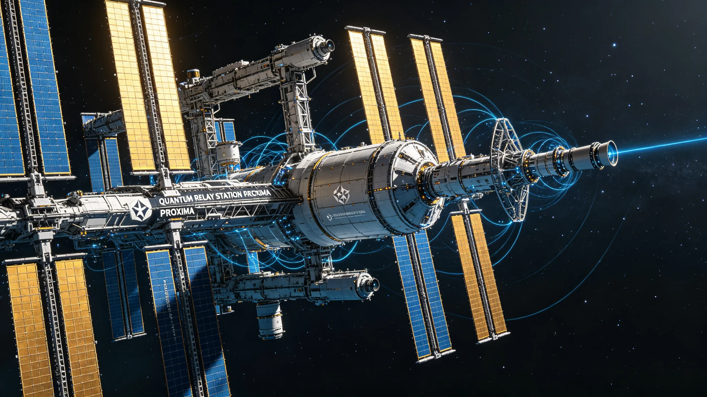
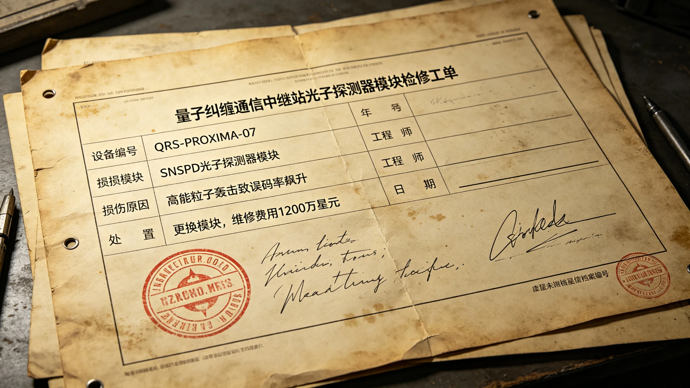
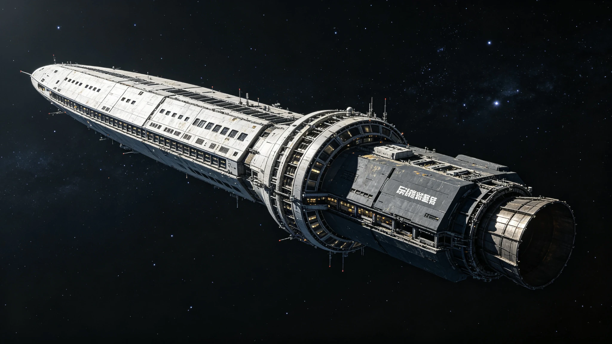

# 第二部分（Part B）：航行世纪与远航后期

> 本部分为 HR-001《ARK-01世代飞船百年航程调查报告》中段，涵盖第五章（航行世纪：封闭社会的形成与演化，公元2175—2250年）与第六章（远航后期：减速准备与抵达比邻星，公元2250—2350年），含案例研究 AR-02、AR-03、AR-04。所有事实陈述均以同期（航行期间产生）GS正典为依据；同期档案之间存在的数值分歧，按写作规范不强行统一，而在相应位置标注并分析可能原因。

---

## 第五章 航行世纪：封闭社会的形成与演化（2175—2250）

第四章所述启航时代，以地球经验为唯一参照的初代乘员为主导。进入公元2175年前后，飞船已远离日球层，地球退化为一颗普通亮星，社会结构开始发生不可逆的转变。本章所述的七十余年，是ARK-01由"一艘运载地球人的飞船"转变为"一个自我再生的封闭社会"的关键阶段。这一转变并非由单一事件触发，而是人口代际更替、生态长期运行、通信物理衰减、文化自发生产等多重过程叠加的结果。本所考证认为，理解这一阶段的关键，不在于追踪某一英雄式人物的决策，而在于观察封闭系统内人口、职业、生态、法律、文化如何各自沿其内在逻辑演化，并在百年尺度上相互咬合。

### 5.1 第二代乘员的诞生与"船生代"身份认同

航行早期的社会人口学事实，到第九十年（公元2240年）已沉淀为可测量的身份结构。据GS-2240-03《ARK-01乘员代际称谓演变与"船生代"身份认同社会学调查公报》记载，至2240年，全船人口已完成三次完整代际更替：初代乘员（地球出生、出港登船）仅剩247人，平均年龄87.3岁；船生一代平均年龄62.1岁，船生二代平均37.4岁，船生三代平均12.8岁，而船生四代已于2238年开始出生。该调查为航行以来第三次大规模代际身份调查，采用问卷调查、深度访谈与参与式观察三法并行，样本覆盖全船1,200名各代际受访者。

该公报系统记录了代际称谓的自发演变轨迹。在2150—2175年，全船自称"乘员""登船者"，船上出生者被称为"船上出生的""小的"；至2175—2200年，初代改称"老乘员""地球来的"，船上出生者开始自称"船生一代"；2200—2225年间，称谓进一步固化为"船生二代""中生代""新的一代"；到2225—2240年，"地球人"一词在船生三代口语中已带有微妙疏离感，而"船生代""船人""船上人""环上人"成为最广泛的自称。尤为值得注意的是"纯船生"一词，出现于2230年之后，特指父母双方均为船生代的乘员（船生三代及以后），与父母一方为初代的"半船生"相对，在船生三代青少年群体中使用频率达37%。

称谓频率的量化统计揭示了身份锚点的转移。据同份公报，正式称谓"乘员"在初代中使用率92%，到船生三代降至43%；而"船生代"的使用率由初代的34%升至船生三代的94%；"地球人"则由初代的88%降至船生三代的8%。在认同层级排序中，船生三代仅8%将"地球人"列入认同前四位，而81%将"船上人"作为第一认同。在情感测量上，初代94%同意"我对地球有归属感"，船生三代仅7%同意；初代100%能在地图上指出中国或美国位置、100%吃过地球原生食物，船生三代分别降至17%与0%。

本所认为，这些数据标志着一个结构性事实：到第九十年，"地球"对多数乘员而言已不再是直接经验的对象，而退化为教育、影像与口述所建构的历史概念。需要指出的是，同期另一档案对初代残余人数的记载存在明显分歧——据GS-2250-01《ARK-01第一航行世纪全舰庆典与文明传承时间胶囊封存公报》，至第100航行年仍在世的出港乘员为1,247人，平均年龄112岁，而GS-2240-03在十年前（第九十年）仅记247人。两者相差约五倍，且年龄结构亦不衔接。本所倾向于认为，这一分歧源于"初代/出港乘员"口径不同：GS-2250-01所统计的"出港乘员"可能包含启航前后陆续登船、未计入GS-2240-03严格意义上"地球出生并随首班登船"口径的人员，亦可能与深空医学延寿干预下高龄存活记录的修订有关。此分歧不影响"初代在第九十年前后已接近凋零"这一基本判断，但其确切规模应在附录C中考辨。

与身份漂移相伴随的是语言与时间感知的代际分化。据GS-2240-03，船生三代日常用语中与地球自然环境相关的词汇（海洋、森林、沙漠、雨雪）使用频率仅为初代的14%；与飞船环境相关的新造词汇已记录187个，"天"在其口语中多指舱顶而非天空，"地"多指甲板而非土地。在时间参照上，船生三代日常以"航行周期"与"配给日"为计时核心（使用率94%、87%），地球四季概念使用率降至12%。这一语言事实为后文6.6节所述"失锚词"问题埋下了伏笔。

### 5.2 人口结构变迁：从一万二到二万四千余

人口总量与结构的变化是封闭社会形成的物质基础。据GS-2200-01《ARK-01第二航行世纪全船人口结构与代际更替普查公报》，以2200年1月1日为标准时点的第五次全船人口普查，登记总人口为16,499人，覆盖率99.94%。其代际构成为：初代（地球出生）1,847人，占11.2%；船生一代6,732人，占40.8%；船生二代7,106人，占43.1%；船生三代814人，占4.9%。普查明确记载，人口总量较五十年前启航时的12,000人增长37.5%，增速在封闭生态承载范围内。

该公报同时给出了人口学运行的关键指标。粗出生率为12.8‰（设计阈值10—15‰），粗死亡率4.1‰（阈值≤6‰），自然增长率8.7‰（阈值5—10‰），预期寿命84.2岁，均处正常区间。近五年共出生1,056人、死亡338人，死亡原因首位为循环系统疾病（38%），其次为肿瘤（22%）、意外工伤（14%）。性别比全船为100.7，基本均衡；初代平均年龄71.4岁，船生一代平均31.2岁。

至第100航行年，据GS-2250-01，全船乘员总数已达24,873人，略超24,000人的设计容量，其中在船上出生的乘员占71.3%。该公报记载了百年人口运动的总账：出港时乘员24,000人全部为地球出生；百年间在船出生累计38,472人，死亡13,599人（主要为疾病与衰老）。百年平均自然增长率为0.35%/年，而第100年当年增长率已降至0.28%/年，低于世代更替水平，舰务委员会正在评估人口政策。职业分布亦发生根本变化：出港时的职业分工基本消解，第100年社会以船载教育体系培养的本土人才为主，工程维护22%、农业食品16%、医疗健康12%、教育文化11%、科学研究9%、管理行政8%、制造加工7%、其他15%。

本所必须在此指出出港基数的史料分歧。据GS-2154-01《世代飞船"ARK-01"出港首航年全闭环生态系统碳氮水平衡与微量元素平账月报》，首航年受控生态规模对应全船在册在舰常住人口12,000人；GS-2200-01亦以"启航时12,000人"为增长基数；而GS-2250-01记载出港时为24,000人。此外，据GS-2158-01《地月L5深空通信枢纽站ARK-01乘员在球家属光际家书转递年度公报（2158年度）》，2158年在球在册家属登记共28,416户，覆盖"一代乘员10,214人"。三个同期数字（12,000、24,000、10,214）并存。本所认为，最可能的解释是：10,214人与12,000人对应实际离港并进入深空巡航的乘员规模，而24,000人系设计容量或含随工、轮换、候补的峰值在船数；GS-2250-01作为事后百年总结，可能以设计容量或峰值口径回溯叙述。此问题属已知史料分歧第1项，详见附录C。

从人口学角度看，真正重要的不是出港基数的绝对值，而是增长率的长期走势：第50年自然增长率尚为8.7‰，第100年已降至0.28%/年（约2.8‰），且舰务委员会已主动评估人口政策。这表明封闭社会在第一个世纪末已进入"人口稳定甚至趋降"阶段，生育从自然增长过渡到计划管理。后文5.11节所述生育权"需排队申请、间隔期不少于4年"的法权变化，正是这一趋势在制度上的反映。

### 5.3 职业技能再分配与教育本土化

人口更替必然带动职业结构的再配置。据GS-2195-01《ARK-01第50航行年全船职业技能再分配普查公报与转岗培训结业清册》，至第50航行年（公元2195年），初代乘员中60岁以上者占比已达71.4%，大量进入退休或半退休；而船生一代中18岁以上者共4,872人，正逐步进入各岗位。该次普查为航行以来第五次，依《全船劳动力动态管理条例》（船政字〔2178〕第005号）每十年开展一次。

该公报揭示了一个核心结构性矛盾：建设型岗位过剩，运维型岗位短缺。具体供需缺口数据显示，外壳装甲修复技师缺口率达33.7%（需求187、在岗124），精密电子维修师缺口率27.3%，聚变堆维护工程师缺口率10.9%；而基础建设工过剩27.1%，货物搬运与物流过剩34.3%，行政文员过剩25.5%。出港初期为建造与加速配置的大量基础建设岗位，在飞船转入长期运维后需求萎缩；而需要长期经验积累的精密岗位因初代技师退休出现断层。

为弥合缺口，2190—2195年船政人事处共组织转岗培训14期，累计培训1,847人，结业1,661人，整体结业率89.9%。典型流向为：基础建设工转外壳装甲修复技师（312人培训、287人结业、结业率92.0%），基础建设工转精密电子维修师（245人、198人、80.8%），物流搬运转水培系统运维员（187人、176人、94.1%）。培训周期按岗位复杂度递增：水培运维12个月，外壳修复18个月，精密电子24个月，聚变堆维护工程师长达30个月。该公报同时比较了船生一代与初代的职业分布差异：船生一代从事计算与数据者占12.3%（初代仅3.1%）、精密制造8.7%（初代2.4%）、教育与培训9.4%（初代4.2%），而从事基础建设者仅3.2%（初代高达18.7%）。

教育本土化在第84航行年（公元2233年）的一份教学档案中得到了最具体的体现。据GS-2233-01《ARK-01第三综合学校第84届自然常识结业测验卷及批注》，船生三代学生已发展出一套以飞船环境为默认前提的认知框架。测验中，学生将"日落"正确理解为"B区居住环天花板模拟光栅按24小时程序线性调暗至5%照度"；将古诗"草长莺飞二月天"对应到"农业区第4号水培架春季换季温控与喷雾循环"；被要求解释"大海"时，学生以"古代的地球是一艘非常非常大的实心飞船……中间有一块很大的吸铁石（引力核心）"作答，教师批为"非规范类比，应使用'质量产生引力场'规范词"。尤为典型的是，一名学生在绘制"植物生长形态"时在叶片旁画了一只带两对翅膀的昆虫，被教师查明系"旧故事书附图"所见，并批示"本舰生态环内禁止私自繁育任何非清单节肢动物，授粉一律使用静电毛刷"。

本所认为，这张测验卷是封闭社会"教育本土化"最具说服力的物证：船生三代不再需要理解地球，而是需要理解飞船；地球的山川河流被转译为教育影像与机械类比，而飞船的循环、阀门、自锁扶手、三级高压灭菌土壤成为其常识体系的核心。教育已从"传授地球知识"转向"传授飞船生存知识"，这与5.1节所述身份认同漂移互为表里。

### 5.4 闭环生态的长期挑战

闭环生态系统是ARK-01的生命线，也是最脆弱的环节。据GS-2154-01《世代飞船"ARK-01"出港首航年全闭环生态系统碳氮水平衡与微量元素平账月报》，首航年全系统水资源闭环率达99.82%，氧气闭环率99.88%，卡路里自给率100.00%；全舰日均纯氧消耗6,600立方米（人均550升），小麦主粮平均产量12.4吨/日，碳氮水物料平衡差额为0.00吨。这一理想的初始稳态，在随后数十年中面临三类长期挑战：作物基因漂移、真菌菌膜与生物膜爆发。

**作物基因漂移。** 据GS-2168-01《ARK-01农业环第三轮作物基因漂移监测公报与种子库种质更新清册》，至启航第18年（2168年），农业环已运行三轮完整作物迭代，全作物平均期望杂合度较2158年下降4.1%，逼近"每五年≤5%"的设计阈值。小麦船选-3号有效群体大小（Ne）仅342，低于设计阈值500；光周期不敏感位点Ppd-D1频率五年上升0.06，与恒定人工光周期下的选择压力一致。大豆为本轮漂移幅度最大的主粮，无限结荚位点Dt1五年降幅0.09，农业环栽培架层高有限（1.2米）使有限结荚型更适应密植。该公报据此启动8个品种的种质更新，并建议将受控蜂箱由8箱扩繁至12箱、在C环增设种子备份库实行异舱双库保存。

**真菌菌膜爆发。** 据GS-2211-01《ARK-01生态环控第二区盲孔管壁真菌性菌膜爆发处置备忘录》，启航第62年（2211年）114标日，中环水培带B-09/C4号低剪切力拐角内部附着形成厚1.8至2.5毫米的暗褐色真菌性菌膜（白地霉属变异株Galactomyces sp. ARK-6与耐盐硝化细菌共生），侵占管腔截面积约59%，诱发局部厌氧酸化（pH骤降至4.8）。处置采取物理热震与机械刮刷：以68℃巴氏回用水循环浸润45分钟，配合高压脉冲二氧化碳微气泡空化剥离与聚氨酯软管刮刷，共滤出湿基菌泥4.38千克，碳化后转入底舱蚯蚓堆肥箱。值得注意的技术细节是，处置备忘录明确记载"不可采用常规强酸/强氧化剂全系统酸洗"，因反渗透膜与离子交换树脂剩余寿命仅14船年，过度化学清洗会导致共生硝化菌群崩溃、全区重建需消耗320千克干基储备蛋白。这一约束深刻揭示了封闭生态的代价：每一次清洗决策都必须在化学效能与物料存量之间权衡。

同类事件在次年再次发生。据GS-2212-01《ARK-01农业环管第408号高压脉冲真菌菌膜清洗作业日志及滤网压差报告》，航渡第62年（2212年），R2-B微重力水培主回流管路二级过滤器前后压差由基准18kPa攀升至84kPa，触发黄色告警；内窥显示管内壁附着1.2至2.8毫米复合真菌-微藻菌膜（红酵母Rhodotorula sp. ARK-9与拟小球藻为主）。作业回收残液4,200升（回收率99.4%），截获湿重34.6千克浓稠生物泥饼，冲洗后各栽培架喷头流量恢复至设计标称值的98.2%。带班签注指出，菌膜厚度超出年度预测模型18%，推测系3号主光源LED阵列光谱红移（第4组老化衰减至660nm占优）导致杂菌繁殖异常。

**生物膜爆发。** 据GS-2225-01《ARK-01水培舱第089号管路生物膜爆发应急处置公报与水质恢复鉴定书》，启航第75年（2225年）7月14日，B环水培舱第三栽培区在线传感器报警：溶解氧由6.8mg/L骤降至3.2mg/L，浊度由0.3NTU升至14.7NTU，化学需氧量由12mg/L升至87mg/L。第089号主管路（DN200不锈钢，出港原始管路，已运行75年）内壁生物膜均值厚3.2毫米，优势菌为假单胞菌属（占68%）。原因经拆解确认为多因素叠加：管路内壁钝化层局部破损（17处点蚀、最大深度0.4毫米）、栽培架改造后流速由1.06m/s降至0.66m/s（低于0.8m/s控制阈值）、新肥料批次可溶性有机碳由8mg/L升至15mg/L、消毒周期因改造由3年拖期。处置采用柠檬酸酸洗加温、次氯酸钠消毒组合，8月2日水质恢复鉴定为合格。该事件推动了六项长效整改：全船127条主管路排查、主管路酸洗周期由3年缩至2年、主管路流速确保≥0.8m/s、加装ATP生物发光早期预警传感器、2226—2230年分批更换38条运行超70年的原始主管路、建立肥料批次可溶性有机碳检测制度。

本所认为，这三类事件构成了闭环生态长期运行的基本模式：系统在初始稳态后，因管路老化、流速下降、营养负荷波动、光源老化等慢变量累积，周期性地发生微生物膜或作物基因的定向漂移；处置手段日益依赖物理清洗而非化学消毒，且每一次处置都伴随严格的物料回收与损耗核账。生态系统并非一劳永逸的"装置"，而是需要持续、精细、代价高昂维护的平衡态。

### 5.5 船载文化的兴起：从"目的地想象"到原创艺术季

与身份漂移和生态维护并行，一种区别于地球文化的船载文化自发生长起来。其起点是一次制度化的想象征集。据GS-2158-02《ARK-01船载文化部第一届"目的地想象"作品征集公告暨获奖作品选录》，航行第8年（2158年），船载文化部举办第一届"目的地想象"作品征集，要求全体乘员以文字、图画、乐曲、手工想象比邻星b，但公告明文要求"所有作品均须标注'推测性想象'字样，不得以任何形式声称描述抵达后的实况"（依《启航公约》附件四·信息真实条款）。特等奖《晨昏线词典》以"为不知道命名"的方式建构目的地：将"晨昏带"定义为"一条不会移动的边界"，将"永昼侧"解释为"人们会忘记'晚安'这两个字怎么写"。一等奖《光年之外的菜园》以一艘番茄种子为线索，将农业劳动与抵达目的绑定。

到第130航行年（2280年），船载文化已从官方征集发展为制度化的艺术季。据GS-2280-01《ARK-01第130航行年全船艺术季作品编目公报与民间创作普查清册》，该届为第26届艺术季，主题"环上的日子"经全船公投选定（获票3,847张、占有效票41.2%），共收到应征作品847件、入选312件。作品按媒介以回收材料为主：绘画用金属板或回收画布，雕塑用回收电子元件与旧电路板，音乐以全船环境录音（水培舱水流、聚变堆低频嗡鸣、巡检艇推进器声）为素材。创作者代际分布显示，船生三代为创作主力，占应征作品48.6%；重点作品如《三代人的手套》（三副分别属于初代、船生一代、船生三代的工作手套，磨损位置各不相同）、《B环黄昏》（描绘B环水培层LED光照切换间隙的暖金与冷蓝交错），均以劳动经验为直接来源。

同份公报的民间创作普查更揭示了正式艺术季之外的广度：在被调查的1,200户中，74.3%从事烹饪创新，70.6%有舱壁刻名刻痕，51.9%从事编织缝纫，44.5%进行私人园艺。创作材料来源中回收工业废料占42.1%、配给物资剩余28.7%。公报结论指出，材料约束催生了"废料美学"，创作与劳动深度融合，正式艺术季只是"冰山一角"。本所认为，船载文化的本质特征是：它不再以地球为怀旧蓝本，而是以飞船的光影、声音、劳动、配给为自身内容；它既是封闭环境的产物，也反过来为乘员提供了超越"配给—工作—休眠"循环的意义结构。进一步看，船载文化的兴起与5.7节所述通信衰减在时间上几乎同步发生：正是在地球退化为异步广播源的同一时期，船载原创音乐文学开始结集、"目的地想象"作品由推测性想象转向对飞船自身生活的描摹。这一同步性提示我们，船载文化并非纯粹的审美现象，而是封闭社会在失去地球作为唯一意义来源后，主动为自身生产意义的替代机制。官方艺术季的制度化、民间创作的高参与率（74.3%从事烹饪创新、70.6%刻名刻痕）说明，文化生产已下沉为日常实践的一部分，而非少数专业创作者的特权。对一个后代从未见过地球、只能通过档案影像理解"海洋"与"森林"的社会而言，这种以自身劳动与生活为内容的文化，实质上承担了"自我确证"的功能——它告诉乘员：飞船本身值得被讲述，环上的日子本身即是文明，而不只是通向目的地的过渡。

### 5.6 舱壁刻痕：自发的历史记录

在正式档案与官方艺术季之外，出现了一种最朴素也最顽强的民间历史记录形式。据GS-2320-01《ARK-01船载文化遗产第170航行年舱壁刻痕普查与拓存公报》，至第170航行年（2320年），全船公共舱壁累计刻痕79,895处，普查面积16,860平方米，平均密度4.7处/平方米。其中食堂等候区密度最高，达12.8处/平方米；气闸间8.8处/平方米。刻痕类型以姓名缩写最多（36.0%），其次为日期标记（19.0%）、正字计数符号（16.0%）、图形符号（12.0%）、文字短句（9.0%），另有6.0%为公式、电路图、管路草图等技术涂鸦。

该公报选录的重要刻痕具有跨代与历史的双重意义：B环食堂等候区一级刻痕"2150.3.15 最后一眼地球"配简笔地球；A环3号气闸间同一位置四代人姓名缩写，跨度2151—2298年；A环中央走廊刻有"我们的孩子会见到吗"附问号，年代推断为2240年。普查完成一级刻痕硅胶翻模加三维扫描87处、二级三维扫描312处，并将食堂等候区列为"舱壁遗存保护区"，一级刻痕所在舱壁禁止翻修覆盖。公报亦坦承数据局限：未覆盖居住舱私人区域（抽样估算私人舱壁刻痕总量约为公共区域的1.4倍），2150—2180年部分早期刻痕因舱壁翻修已永久消失（约损失1,200处）。

本所认为，舱壁刻痕的历史价值在于其"未经规划性"。官方档案记录的是舰务委员会的决策与工程指标，而刻痕记录的是普通人在排队、等候、情绪波动时刻下的名字、生卒年与疑问。"我们的孩子会见到吗"这一问句，与5.1节船生三代"抵达对我个人意义重大"仅占31%的数据，恰成互证：抵达作为集体叙事与个人意义之间的张力，从第一个世纪起就已存在。

### 5.7 与地球的通信衰减：从实时到异步，光际家书

通信能力的物理衰减，是封闭社会独立化的外部条件。据GS-2158-01《地月L5深空通信枢纽站ARK-01乘员在球家属光际家书转递年度公报（2158年度）》，启航第6.7年（2158年末），舰地直线距离约0.1936光年，单向光行时于年中正式突破60天，至年末实测达70.73天，往返延迟141.5天（约4.7个月）。2158年度，L5枢纽共执行定向激光跟踪365轨次，上行家属数据包4,128.60GB，下行回执家书3,982.15GB，信道可用率99.982%。家书媒介实行"格式分级配额制"：纯文本142,600封全额免费无限额，静止全息相片每户每月免费4张，环境人声音频每户每月免费2条，高压缩短视频仅限婚育、百岁诞辰等重大民事申请。

该公报最具社会学价值的发现是：送别初期的高密度依恋与离别焦虑叙事已完全消退，舰地双方建立了高度成熟的"双轨生活秩序"。对12,000封抽样家书的词频统计显示，高频词为水培/阳台（68.2%）、工时/具名（61.5%）、身体/骨密度（58.4%）、新生儿（48.7%）、天气/降雨（44.1%）等日常内容。通信制度亦随物理延迟重塑：因信号不可撤回，发信人可于48小时内提交不超过500字的"补正声明"；至亲离世设有"白鹤信标"绿色通道，在船载接收后由医务部与心理支持组先期介入再交送本人，全年流转地表离世通报342起。

到启航第60测控年度（2212年），通信衰减已进入新阶段。据GS-2212-02《地月联合深空测控网ARK-01远征航迹第60期测定公报暨星载连续激光信标年谱监听与相对论轨道解算报告》，此时飞船日心距已达1.7378光年，单向光行时升至634.72天（约1.74年），一次完整往返状态确认需3.4756年。该公报记录了一个关键的共时性事实：2212年10月地球所解调确认的星载遥测，实际是飞船于船载历2211年1月18日发射的光子脉冲；地球测控组面对的始终是飞船634.7天前的状态。该公报并记载，飞船于船历2211年初发生的局部农业盲孔管路真菌附着微压降（对应遥测码HK-BIO-2211-03），在船载自主维护系统48小时内即已完成处置，而地球在约两年后才知晓此事。至第73航行年（约2223年），据GS-2250-01回顾，与地球的最后一次实时通信已经发生，时延超过8个月，此后完全转为异步通信。

本所认为，通信衰减的意义不仅是技术问题，更是身份问题。当"一问一答"在物理上不再可能，飞船与地球之间便从"对话关系"转变为"互相广播关系"。家书不再是即时问答，而是编年体的生活汇总；地球传来的是星历更新、社会纪要与年度管弦乐，船上传回的是遥测脉冲与按周期打包的思念。这种异步化，与5.1节船生三代对地球归属感降至7%的进程同步，标志着飞船在事实上成为一个独立的文明实体。

### 5.8 中央计算阵列升级与数据归档

封闭社会的记忆与治理，依赖于中央计算阵列"启明"。据GS-2182-01《ARK-01中央计算阵列"启明"第17次硬件升级公报与全船数据归档迁移规程》，阵列于出港前两年（2148年）总装，初始128节点、12.4 PFLOPS；至第17次升级（2182年，启航第32年），经16次升级后为512节点、47.8 PFLOPS。本次升级的驱动因素包括：第3批节点因宇宙射线累积单粒子翻转率升至4.2次/节点/天（超设计阈值≤2次），全船数据总量达38.7PB、存储利用率89.3%，以及生态环控模型对AI推理的新需求。

升级全部由船载精密制造车间自主完成：新增128个RISC-V 128核节点，单节点配2块AI推理卡；芯片晶圆为出港储备硅片，经船载EUV光刻机于2180年解封后生产，本次消耗12英寸晶圆47片、良率71.3%。存储由38.7PB扩容至58.8PB，总浮点性能提升49.0%至71.2 PFLOPS。升级采用"校验—复制—校验—切换"四步数据迁移规程：按密级与访问频率将数据分四级（甲级不迁、乙级迁近十年前数据、丙级全迁、丁级经审核删除），迁移前逐文件计算SHA-256哈希，写入后回读比对，双份磁带异地保存。本次共迁移1.3635亿个文件、28.0PB，哈希一致率99.9996%；265个异常中213个重试成功，52个经人工鉴定为源文件已损坏（多为2155年以前早期传感器数据，记录在案，不影响核心业务）。

本所认为，"启明"阵列的自主升级与数据归档规程，是ARK-01技术自复制能力的集中体现。值得注意的是芯片与光刻机均为出港储备、船载生产，这与5.3节所述精密制造岗位缺口、以及第六章6.5节所述工业自持率核验构成同一条技术自主链条。而四步迁移规程与52个早期文件的损坏记录，则提示了一个常被忽视的事实：即使在高度受控的封闭系统中，数字记忆本身也会随时间磨损，归档不仅是存储，更是一种需要制度保障的再生成行为。

### 5.9 微流星撞击与船体维护

船体在百年航行中持续遭受星际介质微流星撞击。据GS-2210-01《ARK-01外壳微流星撞击损伤第041次巡检公报与装甲修补作业验收单》，启航第60年（2210年），巡检艇"穿山甲-3号"以18个月周期对外壳A、B、C、D四象限约18.7平方公里面积进行"声呐扫描+人工抵近"双轨巡检。本轮新发现损伤47处，其中Ⅳ级严重损伤1处：B象限B-7环带一处撞击，撞击体质量约0.8克、速度约32km/s，坑口直径47.3毫米，穿透8毫米陶瓷面板与25毫米铝蜂窝芯，3毫米钛合金内背板未穿透但出现3.4毫米塑性变形，经氦质谱检漏泄漏率1.2×10⁻⁶ Pa·m³/s。修补采用蜂窝芯更换加面板补丁工艺，修补后检漏率降至8.7×10⁻⁸。

该公报的长期趋势分析尤为重要：航行60年累计记录撞击损伤1,894处，年均约31.6处；撞击通量在第20—40年（2170—2190年）出现峰值（年均42.3处），与穿越星际介质密度较高区域有关；近20年回落至年均35.2处。陶瓷面板经60年辐照与热循环，断裂韧性下降约18%，同等撞击下面板碎裂区直径较初期增大约12%。公报据此启动陶瓷面板批次更换计划，并提示密封胶与环氧树脂保质期15年、需在2218年前完成一轮船载补充生产。

> **图4 图注：** 本图为居住环内景/生态环风貌的纪实性复原，证据来源为GS-2154-01《世代飞船"ARK-01"出港首航年全闭环生态系统碳氮水平衡与微量元素平账月报》所载全船水、氧、碳氮物料平衡数据与农业环运行参数，以及GS-2195-01、GS-2280-01所述居住环内劳动与日常生活图景。图中呈现的离心人工重力、多层水培种植、工业管线与生活空间的混合，是第五章所述封闭社会"工作—生态—生活"三位一体空间结构的视觉概括。

### 5.10 案例研究AR-02：第100航行年司法体系演变——封闭社会的法权重构

**案例编号：** AR-02　**核心档案：** GS-2240-02《ARK-01船载司法体系第100航行年判例汇编与法权演进公报》

#### 一、研究对象与阶段划分

ARK-01船载司法体系的根本大法——船载司法宪章——于2140年（启航前十年）最终审议通过。据GS-2240-02，至2240年该体系运行满百年，其演进可清晰划分为三个阶段：2140—2180年为移植地球法阶段，以地球既有法律体系为蓝本；2180—2210年为封闭环境特有规则形成阶段；2210—2240年则进入以生态红线与代际公平为核心的法理重构阶段。本案例即分析这一从"移植"到"内生"的法权重构过程。

#### 二、典型判例所反映的法理转向

该公报汇编近十年（2230—2240年）生效判例47件，选取典型10件列表。这些判例呈现出鲜明的封闭环境法理特征：

其一，**生态设施的共有化与稀缺资源的配给法权**。船法2231-007案中，乘员私改水培舱管路致藻华，裁判要旨为"生态设施属全船共有，私改造成减产按配给当量赔偿"，处劳役6个月加配给扣减；船法2237-011案中，关键工业工具因属配给物资，囤积超过个人用量三倍即予没收。这类判例将地球法中抽象的"财产权"重新锚定到"全船共有、配给定量"的封闭经济现实之上。

其二，**舱壁刻痕入刑与民间记忆的法权地位**。船法2232-014案确认历史刻痕受《舱壁遗存保护条例》保护，故意损毁入刑。这一判例与5.6节所述舱壁刻痕普查形成制度呼应：民间自发的历史记录，在封闭社会中被上升为受刑法保护的文化遗产。

其三，**关键岗位安全与公共通信带宽的公共化**。船法2233-003案中聚变堆值班脱岗因"危及全船安全"从重处监禁18个月；船法2239-016案确认船载深空通信带宽属公共资源，私用超额按量计费。两者均体现了"关键系统的安全与公共资源不允许个人化占用"的封闭法权逻辑。

其四，**代际公平与教育、医疗资源的均等化**。船法2238-005案确认各舱段教育资源均等化原则、要求C环追加师资；船法2236-021案中终末期治疗资源分配遵循"预期寿命×社会贡献"双因子；船法2240-002案则确认教材中地球原生概念标注"历史词义"不构成篡改。这些判例将法权争议从单纯的资源分配推向"代际公平"与"文化传承"的层面。

其五，**跨舱段婚姻自由的确认**。船法2235-008案确认船生一代跨环婚姻自由，裁定撤销舱段自行设置的婚姻准入门槛。这反映了舱段土规与全船统一法权之间的冲突，最终以全船统一法权胜出。

#### 三、法权结构的量化变化

该公报以对照表呈现了五个法权领域的方向变化：财产权由"个人物品广泛私有"转向"关键物资配给制+有限私产"（公有化扩张）；迁徙权由"舱段间自由流动"转向"需登记审批、高峰期限流"（受限）；表达权由宽泛转向"不得传播生态恐慌与抵达失败论"（受限）；生育权由自由转向"需排队申请、间隔期不少于4年"（计划化）；司法救济由三级审级简化为两审终审加裁判委员会复核。

案件结构的量化数据进一步印证了惩戒方式的转变：近十年共受理案件1,284件（民事742、刑事318、行政224），调解结案率62%，判决31%，撤诉7%；监禁刑适用率由启航初期的18%降至当前的9%，劳役与配给处置成为主要惩戒方式。

#### 四、本所分析

AR-02表明，封闭社会的法权重构并非简单的"高压统治"，而是一套围绕稀缺资源、生态红线与代际延续重新组织的法权体系。表达权对"生态恐慌与抵达失败论"的限制、生育权的计划化、财产权的配给化，在开放地球社会看来可能构成对自由的限缩，但在一个人员无法退出、资源无法补充、后代必须在同一容器中继续生存的封闭系统中，这些规则实质上是对"跨代存续"这一根本利益的法权确认。

本所同时注意到，这一重构过程并非单向收紧：船法2235-008案撤销舱段土规、船法2238-005案推动教育资源向C环均等化，均是对封闭社会内部不平等的司法校正；监禁刑适用率下降、劳役与配给处置上升，则显示惩戒方式从"剥夺自由"向"调整其在配给经济中的位置"转变——在一个无处可遁的系统中，剥夺自由本身失去意义，真正有效的惩戒是改变其与全船物资循环的关系。法权结构的这一转向，与5.2节人口从高增长转向计划稳定、5.3节职业从建设转向运维，在时间上高度同步，共同构成了第100航行年前后封闭社会的制度定型。

### 5.11 第一航行世纪庆典与时间胶囊封存

第一航行世纪（第100航行年，航历36,525日）是这一制度定型的象征性总结。据GS-2250-01《ARK-01第一航行世纪全舰庆典与文明传承时间胶囊封存公报》，按舰务委员会2245年第12次会议决议，全舰举行"第一航行世纪"纪念庆典。公报回顾了百年航行数据：航行100年整、航行距离约0.42光年、当前速度0.0045c（约1,350km/s）、主推进器累计运行87,400小时、聚变燃料消耗设计总量的12.7%、微陨石可归因撞击1,247次（其中造成舱壁损伤需修复17次）、累计舱内有效剂量均值0.28mSv/年。

百年重大事件按时间梳理为：第12年首批"航生代"婴儿出生；第18年藻床生态漂移事件；第27年舱壁微陨石穿透事故（第3号货舱）；第34年第一所舰上完全自主运营学校首届毕业生；第41年聚变堆2号堆换料、全舰电力降级47天；第50年半世纪庆典与第一次全舰治理结构公投；第58年闭环生态物种多样性危机、应急种质库启用；第67年舰上第一代原创音乐与文学结集；第73年与地球最后一次实时通信；第82年全舰人口达24,000设计容量；第95年第三代"航生代"出生、从未见过地球的人口占比超过50%。

庆典为期7天（航历36,525—36,531日），包括中央集会大厅官方纪念仪式、全舰文化节（组织活动247场、参与约86,000人次）、全舰运动会（参赛1,247人、观众约42,000人次）、以"百年航行与文明传承"为主题的学术研讨会（发表论文187篇）、家庭日（约6,000个家庭参与整理家族树）以及各食堂"百年纪念菜单"。

时间胶囊为直径2.4米、长4.8米的钛合金密封容器，充氩气保护环境，设计保存寿命不少于1,000年。内容分三类：A类数据存储，含全舰知识库完整副本（约847TB）、第一世纪全舰档案（约213TB）、1,000份个人口述历史、文化作品全集（音乐2,847首、文学1,156部、视觉艺术4,723件、戏剧影视312部）、全舰人口基因库匿名化数据；B类实物，含地球物品（一本地球百科全书、一面地球联合政府旗帜、一枚地球硬币、一块地球岩石标本、一瓶地球海水、一份地球土壤）、舰上制造代表物（第一台舰上3D打印工具、第一件舰上纺织品、一瓶藻类饮料、一张合成纸、一枚舰铸纪念章）、200件个人物品、47种作物种子、关键微生物冻干菌株；C类文字符号，含《第一航行世纪文明白皮书》12卷约840万字、《给未来乘员的信》（每人至少贡献一句话）、现行法律治理文件完整副本、舰上语言词典（含"航语"这种封闭环境演化的混合语）。

封存仪式在中央集会大厅举行，约18,000名乘员现场或经舰内直播参与。四位代表分别放入最后四件物品：一位出港乘员放入出港日记，一位第一代航生代放入自制工艺品，一名儿童放入一幅绘画，一位舰务委员放入《给未来乘员的信》最终稿。容器焊接封盖、加盖联合印章后，全舰默哀一分钟纪念百年间去世的13,599名乘员，再由专用车运至飞船中轴防火、防辐射、防震专用储藏室永久存放。开启条件分三档：定期开启为每航行100年（第一次在第200航行年）；特殊开启需全舰公投三分之二以上赞成（重大危机、文明传承断裂、抵达着陆准备三种情形）；最终开启为永久定居点建立后作为新文明基础档案永久保存。

该公报同时坦承五大未解挑战：闭环生态在数百年尺度上的长期稳定性、封闭文化与地球文明差异的扩大化、人口与资源供需趋紧、部分乘员的存在意义危机、以及与地球联系的物理弱化。本所认为，时间胶囊的设立与"1,000年保存寿命、每百年更新、抵达后最终开启"的三档开启设计，是封闭社会对"时间"这一最稀缺资源作出的制度安排：它承认了单代人无法见证全程，因而将文明的对话从"代内"延展为"跨代"。

> **图5 图注：** 本图依据GS-2250-01《ARK-01第一航行世纪全舰庆典与文明传承时间胶囊封存公报》所载庆典活动流程、钛合金胶囊规格与封存仪式节点复原，呈现中央集会大厅仪式现场。图注的史料价值在于将"百年庆典"这一象征性事件锚定在可核查的工程参数（2.4米直径、4.8米长、氩气环境、1,000年设计寿命）之上，使其区别于一般的纪念图像而成为工程—文化双重物证。

---

## 第六章 远航后期：减速准备与抵达比邻星（2250—2350）

第一航行世纪结束后，ARK-01进入航程的后半段。如果说第五章描述的是封闭社会的"形成"，本章描述的则是其"收敛"——社会、工程、医学、文化的全部资源，开始向"抵达"这一终极目标集中。本章所述百年，始于推进剂储量审计所确立的减速数学基础，止于比邻星b轨道初测，是飞船从"惯性航行"转入"抵达操作"的关键阶段。与前章不同，本章的核心线索是工程理性：减速段需要多少工质、能否支撑、如何决策，构成了贯穿全章的主轴。

### 6.1 聚变推进剂储量审计：减速段的数学基础

据GS-2260-01《ARK-01聚变推进剂储量审计公报与减速段燃耗精算及余量评估报告》，至第110航行年（2260年1月1日基准日），船政总署聚变推进处与航行制导处联合进行第22次推进剂储量审计。该公报首先厘清了推进系统的基本构型：主推进为氘-氚（D-T）聚变脉冲推进，设计比冲Isp=12,500秒；氘（D₂）液化储存于低温储罐，氚因半衰期12.3年需由锂-6中子增殖包层在线增殖并定期提取。

储量台账显示：四个氘储罐设计容量各12,000千克，合计48,000千克，当前氘储量34,981.2千克（储量比72.9%），出港至今累计消耗13,018.8千克。氚采用"即产即用"模式，在线存量维持80—120千克区间，当前在线97.4千克；锂-6增殖包层剩余锂-6为2,847千克，按90%燃耗率理论可增殖氚约964千克。累计氘消耗按航段分解为：离轨与初期加速（2150—2155）1,847.3千克、主加速段（2155—2175）8,934.6千克、巡航微调（2175—2260）2,236.9千克。公报记载主加速段结束时（2175年）飞船达到巡航速度0.12c。

减速段燃耗精算是本份审计的核心。公报明确减速段设计参数：启动时间2290年，持续约22年（2290—2312），初始速度0.12c，入轨目标速度0.008c，所需Δv为0.112c（约33,574km/s，含余量）。公报给出了齐奥尔科夫斯基公式的演算过程，并坦承直接按单级聚变火箭计算会得出质量比极大、不可行的结果，进而修正为"聚变加热外部工质"模式：聚变燃料（氘+氚）仅作能源，实际喷出工质为液氢（LH₂）。据此测算：液氢工质初始储量120,000千克，累计消耗31,200千克，当前88,800千克；减速段工质需求约62,000千克，余量26,800千克（余量率43.2%）；减速段氘需求仅约310千克（为工质的约1/200），氘余量高达99.1%。

余量评估的敏感性分析是该公报最具决策价值的部分。公报列出四类推进组分余量：氘99.1%、氚增殖能力51.8%、液氢工质43.2%、锂-6原料51.0%。其中液氢工质为最关键约束，余量率43.2%虽高于设计安全线（≥30%），但需警惕巡航段额外避障机动、轨道插入参数调整、聚变加热效率下降三类风险。敏感性表显示：若巡航段额外消耗500千克，工质余量率降至42.6%；若减速段Δv增加5%，余量率降至38.7%；若聚变加热效率下降10%，余量率降至35.1%；三项叠加的最坏情景下，工质余量率降至30.3%，"仍高于设计红线30%，但余量极为紧张"。

公报据此提出六项建议：严格控制巡航段机动消耗（2260—2290年工质消耗不超过800千克）；2275年前完成锂-6增殖包层中期检修确保氚增殖效率不低于85%；2280年前完成减速段最终参数冻结；2270年前完成一次工质需求复核、若余量率低于35%即启动"工质节约模式"（姿态控制由每周一次降至每两周一次）；2275年进行第23次审计作最终燃耗确认。

本所必须在此标注巡航速度与推进构型的史料分歧。据GS-2260-01，巡航速度为0.12c；但据GS-2212-02《地月联合深空测控网ARK-01远征航迹第60期测定公报》，2212年实测巡航速度为0.0288c（8,634km/s），且推进剂为612万枚氘-氦3（D-He3）聚变脉冲药丸；据GS-2250-01，第100年平均巡航速度为0.0042c；据GS-2349-01、GS-2349-02，巡航速度为0.03c（约9,000km/s）。同期档案在巡航速度（0.0042c / 0.0288c / 0.03c / 0.12c）与推进剂种类（D-T加热液氢 / D-He3药丸）上均存在显著分歧。本所认为，最可能的解释是：ARK-01在主加速段达到的峰值速度与长时间惯性滑行的实际平均速度不同；D-T化学计量工质（液氢）与D-He3脉冲药丸可能对应两套并行推进或姿态控制系统的不同账面口径；而0.0042c的平均速度或系以"航程距离/总航行时间"计的较低均值。此为已知史料分歧第3项，详见附录C。就本章而言，关键结论不依赖于具体速度值，而在于：无论采用哪种口径，减速段所需的工质余量都处于"恰好够用、毫无冗余"的临界状态，这一判断在各份档案中高度一致。

### 6.2 案例研究AR-03：推进剂审计与减速段决策——工程理性的胜利

**案例编号：** AR-03　**核心档案：** GS-2260-01《ARK-01聚变推进剂储量审计公报与减速段燃耗精算及余量评估报告》

#### 一、决策情境

ARK-01的全部航行，最终都系于一个数学问题：飞船能否在预定速度下完成减速、安全进入比邻星b轨道。第110航行年的推进剂审计，正是对这一问题的中期结算。减速段不是可选项——若无法减速，飞船将以巡航速度直接飞掠比邻星系统，两百年航行的全部投入付诸东流；但过度减速或燃耗失控，同样会导致入轨失败或工质耗尽后的漂流。决策的约束是硬的：工质（液氢）余量率43.2%，设计红线30%，最坏情景30.3%——这是一个没有任何容错空间的余量。

#### 二、工程理性的决策逻辑

AR-03的决策过程，典型地体现了"工程理性"的三重特征：

第一，**以保守参数冻结不确定性**。公报建议2280年前完成减速段最终参数冻结（Δv、启动时间、推力曲线），"此后非紧急情况不得调整，以避免燃耗不确定性扩大"。在余量仅为30%量级的前提下，每一次参数调整都会重新引入不确定性，因此理性的选择是尽早锁定设计值，把"可调整"变成"按计划执行"。

第二，**以余量红线触发分级预案**。公报将工质余量率作为一个连续监测指标，并预设触发条件：若2270年复核余量率低于35%，即自动启动"工质节约模式"——降低巡航段姿态控制频率。这一设计把抽象的"风险"转化为可操作的阈值与自动响应，避免了在危机时刻才仓促决策。

第三，**以最坏情景反向校核**。敏感性分析不是为了预测单一结果，而是叠加巡航段额外消耗、Δv增加、加热效率下降三类不利因素，得出最坏情景30.3%的结论，并据此确认"仍高于红线但极为紧张"。这种"从最坏情形倒推安全裕度"的方法，是封闭系统工程决策的核心特征：它不依赖乐观预期，而要求即使所有不利情况同时发生，系统仍不越过红线。

#### 三、决策对航行的实际影响

这一审计结论对后续航行产生了深远的约束性影响。其一，巡航段机动消耗被严格限制，2260—2290年工质消耗上限设为800千克，这意味着飞船在巡航中段必须尽可能减少非必要的避障与姿态修正——这与6.1节公报"严格控制巡航段机动消耗"的建议直接对应。其二，锂-6增殖包层检修被前置到2273—2274年，利用巡航低功耗窗口完成，以确保减速段氚增殖能力。其三，减速段启动时间与脉冲节奏由此进入倒计时管理，为第六章后文6.9节所述2328年减速启动、17组脉冲的实际执行奠定了决策基础。

#### 四、本所分析

AR-03之所以被本所称为"工程理性的胜利"，并非因为它实现了充裕的余量，而是因为它在余量极端紧张的约束下，以可计算、可冻结、可触发的方式完成了决策。在一个没有外部补给、没有返厂、没有第二次机会的系统中，工程理性的本质不是"追求最优"，而是"确保不越过红线"。公报反复出现的"余量率""设计红线""最坏情景""参数冻结"等概念，共同构成了一种封闭环境特有的决策伦理：把不可知的未来，压缩为可监测的数值阈值，并在阈值被触发前提前部署应对。本所认为，这一决策范式是ARK-01最终能够成功减速并抵达的关键制度性因素。

### 6.3 世代健康问题：骨密度退化与视盘水肿

远航后期的另一项硬约束来自人体本身。据GS-2261-01《ARK-01船载医务部第14期世代骨密度退化与视盘水肿筛查通报》，第112航行年（2261年），医务部对生活在第二旋转承压环（0.65g标准自转工况）及长期轮岗于中央零重力轴心货运区（0.002g）的第三代乘员进行筛查，参检2,140人，覆盖率98.4%。

DEXA骨密度扫描显示，第三代乘员骨骼已出现不可逆的代际力学重塑：L1—L4腰椎T值-2.18、皮质骨厚度较地球基线萎缩14.2%；股骨颈T值-2.65（已达骨质疏松临界）、皮质骨萎缩21.8%；桡骨远端T值-2.88、非承重骨萎缩26.4%。主检放射医师批注指出，20岁青年乘员的股骨颈皮质骨厚度仅相当于地球母本库中55岁绝经期女性标准，"这不是病理突变，而是骨骼对0.65g稳态的自适应卸载"；并预测若88年后降轨着陆于1.07g的比邻星b，第一批未穿戴外骨骼动力支架的登陆人员跌倒骨折率将超过42%。

神经眼科筛查则指向空间飞行相关神经眼综合征（SANS）。在820名长期值守中枢轴向轴承及冷凝盲管的微重力检修工中，视盘水肿检出率31.4%（258例），并出现眼球后极部扁平化（微重力下头向体液转移、脑脊液跨筛板压力差倒错）、脉络膜皱褶与棉絮斑，已致14名二级电气技师出现中心视野暗点。

医务部据此采取三项干预：强制在二环配给微藻合成蛋白饼中添加1.8g/人·日碳酸钙微晶粉及维生素D3前体；轴向微重力作业人员单次连续排班不得超过14个自转周期（336小时），轮换后须在第三承压环（0.82g超速加压区）接受每日90分钟下体负压训练；所有DEXA胶片转入低温化学储藏柜归档，供落地委员会制定《拓荒负重限额标准》参考。

本所认为，AR-03的工程决策与本节的医学筛查构成一体两面：飞船的减速与着陆参数是硬的，而乘员的身体能否承受1.07g地表重力同样是硬约束。42%的预测骨折率与31.4%的视盘水肿检出率，意味着"抵达"不仅是轨道力学问题，更是人机适配问题。医务部将胶片归档以供《拓荒负重限额标准》参考，已暗示后来的着陆操作将不得不以外骨骼动力支架、重力梯度训练、负重限额等工程化手段补偿人体在0.65g环境中百年演化出的生理特征。

### 6.4 推进系统第120航行年大修与换料

工程系统在远航后期同样需要深度维护。据GS-2270-01《ARK-01聚变脉冲推进系统第120航行年大修与换料工程验收单》，第120航行年（2270年），工程总署推进系统处对脉冲燃烧室与第一壁、磁约束线圈与超导磁体、燃料注入与排灰系统三大分系统实施为期15个月（2269年3月—2270年6月）的大修，施工期间推进系统完全停机，飞船维持惯性巡航，姿态由冷气姿控喷口保持。

主要部件更换包括：全部12块第一壁钨装甲板（运行120年）、3组磁约束超导线圈、全部燃料注入阀密封件、排灰螺旋泵解体检修、中子屏蔽层厚度检测与局部补填、散热肋片变形校正并更换14片，以及全部24组聚变燃料靶丸存储单元换料。换料数据为：氘气旧料余量18.4吨、新装填60.0吨（设计容量62吨）；氚气旧料3.1吨、新装填12.5吨；氦-3引燃剂0.8吨、新装填2.0吨。换料后燃料储备可支撑后续60年巡航脉冲推进需求（含减速段预留）。

试车验收数据显示系统恢复额定状态：单脉冲聚变功率84.3GW（设计≥80GW），脉冲重复频率0.35Hz稳定，满频推力1.28×10⁶N，磁约束场强12.4T，系统总效率43.1%，氚增殖比1.08。验收同时记录了三项遗留项：第7号第一壁背板拆卸时发现2.3mm微裂纹（已更换但成因待分析）、散热肋片外环3片遭微陨石穿透（孔径0.8—1.4mm、已补焊）、大修期间姿态控制精度短暂下降至±0.03°（重启后恢复至±0.005°）。下次大修窗口定于第180航行年（2330年），届时需结合减速段需求评估第一壁剩余寿命。

本所认为，第120年大修是"以船载能力完成百年级设备再造"的标志性事件。它证明ARK-01的推进系统并非一次性产品，而是可更换第一壁、可换料、可在线维护的长寿命系统；而大修期间"推进系统完全停机、飞船维持惯性巡航、姿态由冷气喷口保持"的安排，则显示飞船在15个月里依靠惯性与冗余度过了一个对全船安全最关键的系统不可用窗口。这种"停机大修+惯性飞行"的能力，本身就是封闭工程体系成熟度的证明。

### 6.5 工业体系自持率核验

与推进系统维护并行，船载工业体系在第150航行年（2300年）接受了全要素自持率核验。据GS-2300-01《ARK-01船载工业体系第150航行年全要素自持率核验公报》，第五次全要素自持率核验采用"全要素物料平衡法"，自持率定义为船内可自产自足物资品类数占全船消耗品类总数比例（按质量加权）。

分行业自持率为：金属冶炼与加工94.2%、纺织与服装96.8%、食品加工88.4%、化工与材料87.6%、精密机械82.5%、光学与石英78.9%、电子与电气71.3%、医药与化工63.2%、聚变堆备件55.6%。与第140航行年相比，质量加权综合自持率由85.1%升至89.2%（提升4.1个百分点），品类自持率由78.4%升至83.7%，关键备件自持率由62.8%升至69.5%，废弃物资回收率94.6%。

关键物料的物料平衡显示了结构性缺口：钛金属年耗420吨、年产386吨、回收31吨，缺口3吨；铜缺口2吨；锂化合物缺口1吨；稀土元素缺口0.3吨；碳纤维缺口0.5吨。而不可自持物资清单更直接点出了长期风险：铂族金属催化剂剩余0.8吨（预计2340年耗尽，铁基替代试验中）、高纯度硅晶圆剩余1.2万片（预计2360年耗尽）、特种光刻胶剩余300升（预计2335年耗尽）、医用同位素逐年衰减（预计2325年耗尽，船载中子活化生产可行性评估中）。

本所认为，89.2%的质量加权自持率是一个重要但必须审慎解读的数字。它表明ARK-01的工业体系在金属、纺织、食品、化工等大宗品类上已接近完全自持，但恰好在最高端、最难替代的环节——铂族催化剂、高纯硅晶圆、特种光刻胶、医用同位素——仍依赖启航时的一次性库存，且这些库存的预计耗尽年份（2325—2360年）恰好落在减速与抵达的关键窗口。这意味着，"自持"并非一个静态达成的状态，而是一个随库存耗尽而动态受迫的过程；减速段与抵达后所需的精密制造与医疗能力，必须在库存耗尽前完成替代工艺的攻关。公报"建议2320年前完成减速段与抵达后工业需求产能规划"，正是对这一时序矛盾的回应。

### 6.6 教育改革与"失锚词"处置

社会与技术的收敛，在教育领域表现为语言与概念的代际断裂。据GS-2310-01《ARK-01船载教育体系第160航行年课程改革与失锚词处置公报》，航行160年后，全船词汇使用频率调查显示，约1,200个地球原生概念词在船生四代（10—18岁）群体中理解正确率低于60%，其中340词低于30%，被界定为"失锚词"——即词义与原始指称物脱节、仅作为抽象符号或隐喻存在的词汇。

该次课程改革对课程结构作了系统调整：物理与工程课时由16%升至20%（增加飞船系统实操），生态与农业由10%升至14%（增加水培舱实习），语言与文学由22%降至18%（压缩古典文学、增加船内当代文本），历史与社会由12%降至10%（地球史压缩为通识模块），并新增占比4%的"失锚词专题"必修模块。

失锚词按可处置性分为四类：A类"可体验"（雨、风、海、山，187词），配物理模拟体验并标注"类比义"；B类"可推理"（彩虹、潮汐、地震，96词），配原理解说并标注"推定义"；C类"纯抽象"（雪、森林、沙漠，42词），仅存于文本影像，配档案影像并标注"历史词义"；D类"已异化"（阳光现指石英窗透光、天空现指舱顶，15词），保留新义而旧义标注"古义"。具体调查显示：仅19%的船生四代知道"海洋"原义、多数误以为是"储水罐"；28%知道"森林"原义、多数误以为是"水培舱"；71%将"阳光"理解为"石英窗透入光"。改革同时修订教材47种，删除地球地理中无法体验的章节12章（如气候带、洋流系统）改为"地球环境档案"选修，新增《船载生态系统》《飞船工程基础》《失锚词手册》三种必修教材。

改革在审议中收到37件异议，集中于"地球史压缩是否导致文化断裂"与"D类词保留新义是否等于承认词义篡改"两点。教育处答复：地球史作为通识模块保留核心脉络不构成断裂；D类词新义已在日常语言中固化，强行恢复旧义反致交流障碍，标注古义即完成历史传承。本所认为，这一改革是对5.1节语言漂移、5.3节教育本土化的制度化收束。它不再天真地要求船生四代"记住地球"，而是承认地球经验对他们已不可体验，转而以"类比—推理—历史"的分级标注，在保证交流有效的同时保留历史脉络。D类词"保留新义、标注古义"的处理，尤其体现了封闭社会对待自身文化漂移的成熟态度：不抗拒异化，但为之留下可回溯的历史注脚。

### 6.7 案例研究AR-04：比邻星b大气确认与着陆点选择——四十年遥感的终点

**案例编号：** AR-04　**核心档案：** GS-2310-02《ARK-01抵达前40年比邻星b大气成分最终确认公报与着陆点终选论证报告》、GS-2330-01《ARK-01抵达前十年减速段轨道校准与比邻星b详查公报》

#### 一、四十年遥感的科学积累

据GS-2310-02，自2280年（距抵达70年）起，船载深空观测台（C环9层、主镜直径4.2米）开始对比邻星b常态化高分辨率观测；2295年（距抵达55年）飞船进入"深空观测最优窗口"——距目标足够近以获取高信噪比数据，又尚未进入减速段、姿态稳定。本报告基于2280—2309年累计30年观测数据作出科学结论。所有结论均明确声明基于遥感与模型推演，不含实地探测结果。

#### 二、大气成分的最终确认

观测采用透射光谱法：在比邻星b凌星时，恒星光线穿过其大气层形成吸收特征。船载观测台在近红外波段（1.0—2.5μm）获取17次凌星事件的高分辨率光谱（分辨率R=100,000），累计积分412小时，并补充发射光谱法与日冕仪高对比度直接成像。

最终确认的大气成分为：氮气78.4±2.1%、氧气18.7±1.5%、氩气1.9±0.3%、二氧化碳0.42±0.08%、水蒸气0.3—2.1%（随纬度季节变化），甲烷未检出（<1ppm），一氧化二氮未检出，臭氧仅约0.02ppm。

科学结论有四：其一，大气成分接近可呼吸范围——氧气分压约0.187atm（地球为0.209atm），但二氧化碳分压0.0042atm，比地球偏高约10倍，长期暴露需注意呼吸性酸中毒风险，建议着陆初期使用辅助呼吸设备逐步适应。其二，大气中检出显著水汽且有纬度梯度，晨昏线附近水汽含量较高，表明存在活跃水循环；结合温室效应模型，表面平均温度约260K（-13℃），低纬度可能存在液态水。其三，氧气与二氧化碳共存但未检出甲烷，氧气/甲烷比异常偏高，倾向于非生物氧来源（水光解或CO₂光化学分解），当前数据不足以确认或排除生命。其四，比邻星为活跃红矮星（观测期间记录X级耀斑7次），大气稳定性取决于行星磁场，虽未直接探测到磁场，但大气成分的保持暗示可能存在全球性磁场。

#### 三、三个候选着陆点的对比与终选

2290年启动初选，从早期低分辨率数据筛出8个候选区；2295—2309年高分辨率观测后缩减至3个终选候选点。三者的多因子对比如下：

**候选点A"晨晖平原"**（北纬12°、晨昏线偏昼侧300公里）：地形平坦度最优（坡度<2°、面积约80万km²，疑似古河流三角洲冲积平原），温度268K（-5℃），昼侧通信条件优，综合评分82.3。主要风险为昼侧受恒星耀斑直接照射、辐射水平中高，液态水可能仅季节性存在。

**候选点B"暖汐湾"**（北纬3°、晨昏线附近、疑似滨海海湾）：温度最高（275K/2℃）、液态水可能性最高、滨海沉积可能富含资源，综合评分78.6。主要风险为晨昏线大气对流活跃、模型风速可达25m/s，着陆风险较高、地形复杂。

**候选点C"南境台地"**（南纬45°、夜侧边缘）：辐射水平最低（夜侧受耀斑遮蔽）、大气稳定风速低（<8m/s），综合评分71.4。主要风险为温度极低（245K/-28℃）、通信需中继卫星、液态水可能性低需开采水冰。

经9人着陆点评估委员会（行星科学家3、工程师3、生态学家2、医疗1）投票：晨晖平原7票、暖汐湾2票、南境台地0票，终选着陆点为"晨晖平原"。报告同时给出应急预案：当前地形数据分辨率约2km/像素，无法识别百米级障碍，抵达后须先释放轨道测绘探测器获取10m/像素影像；若晨晖平原被发现存在不可接受风险，备选为暖汐湾；着陆点坐标将于2345年（抵达前5年）根据最终测绘冻结。

#### 四、减速段遥感的再校核

据GS-2330-01，至第180航行年（2330年），飞船已在2328年正式进入减速段，完成3组减速脉冲，距比邻星系统约0.418光年。该公报记录了减速段对目标的进一步遥感：比邻星（主星）参数经船载最新观测确认为M5.5Ve、质量0.123±0.003M☉、表面温度3,038±15K，超级耀斑约每50天一次。但该公报同时谨慎指出，此时对比邻星b的"大气存在"与"表面液态水"仍为"未确认"（透射光谱信噪比不足）、磁场"未探测到"。这一表述与6.7节GS-2310-02在2310年已确认大气成分形成对照，反映了不同观测窗口、不同信噪比下的结论差异。本所认为，这种"先确认成分、后仍强调不确定"的反复，正是遥感科学谨慎性的体现——成分确认与表面环境可居住性判断之间，隔着整整一代人的观测与修正。

> **图6 图注：** 本图依据GS-2310-02所载17次凌星事件近红外高分辨率光谱（氮气碰撞诱导吸收、氧气A带0.76μm、CO₂在1.57μm与2.0μm、水蒸气1.38μm与1.87μm吸收特征）及GS-2330-01所载减速段轨道校准数据复原。图中以吸收谱线与轨道参数的双重呈现，标注了四十年遥感如何将比邻星b从"一颗暗红星点"确认为"氮氧为主、CO₂偏高、晨昏带活跃水循环"的可着陆世界，同时提示所有结论仍待实地验证的不确定性边界。

### 6.8 减速段轨道校准：2328年启动减速，17组脉冲

减速段的实际执行，据GS-2330-01《ARK-01抵达前十年减速段轨道校准与比邻星b详查公报》，飞船于2328年正式进入减速段。截至2330年11月15日校准历元，已完成聚变脉冲推进减速脉冲3组，导航处利用脉冲间隙进行第7次高精度轨道校准，采用船载长基线光学干涉仪与脉冲星计时联合测距。

校准结果显示各项参数收敛于设计包络：相对比邻星距离0.418光年（设计0.42、偏差-0.5%）、相对速度0.0415c（设计0.042c、偏差-1.2%）、减速加速度均值0.0078g（设计0.008g、偏差-2.5%）、航向偏差0.0007°（≤0.001°、合格）、预计抵达年份2350±1.2年（在窗口内），剩余减速脉冲组为17组。

该公报并对抵达方案作出初步评估（仅为规划、非执行指令）：方案A轨道驻留（进入比邻星b轨道遥感详查后再决策）、方案B释放大气探测器、方案C表面着陆。导航处建议抵达后首先执行方案A，进行至少2年轨道详查，再依数据决定是否执行B或C。

本所认为，"17组剩余脉冲"这一数字，是AR-03工程理性在物理执行端的最终落点。AR-03在2260年所做的参数冻结、余量红线、最坏情景校核，最终转化为2328年开始、以脉冲为单位、逐组消耗的减速操作。每一组脉冲的执行，都在消耗AR-03所精算的那26,800千克液氢余量；而校准结果"偏差均在2.5%以内、航向偏差远优于阈值"，则验证了6.1节减速段燃耗精算模型的工程有效性。

### 6.9 微流星贯穿事故

减速段并非平静的收尾。据GS-2349-01《ARK-01防辐射外装甲第19扇区微流星贯穿事故技术鉴定与定责报告》，航行第199年（2349年），飞船正处磁帆制动末段，船速已由巡航值降至数十km/s量级。此时撞击威胁形态发生根本变化：巡航段毫米级以上碎片由前向磁盾与注水冰盾全向承担、航路雷达可提前规避，历次撞击止于前向扇区冰面汽化剥蚀；而制动段低速撞击不再将撞击体完全等离子体化，毫米级碎屑可保持结构完整性贯穿多层装甲，且碎片来源本土化（磁帆边缘剥离残片、冰盾凝华物、低速本底微粒），无法以巡航段雷达门限识别。

事故发生于航行日72,685周期03:14:09，飞船艏部向日侧防辐射外甲第19扇区（外层注水冰屏蔽层下方第3承力肋位）触发超声波失压与动能冲击警报。外壳自动熔断系统（Pyro-seal）在42毫秒内完成局部气闸自锁，未造成加压主舱失压。法证鉴定显示：撞击体为质量约0.082克的星际硅酸盐微粒、相对速度约32.4km/s；前部迎弹孔直径4.82毫米，周围15毫米范围呈钛合金高温退火氧化彩环；第二层碳化硅装甲呈典型脆性赫兹锥形碎裂（碎裂角48°）；第三层5米注水冰层形成直径340毫米汽化空腔；第四层钛合金承压壁内表面仅出现1.2毫米后凸变形与0.18毫米背部微裂纹，未发生层裂击穿。

定责结论明确：19扇区装甲能量耗散符合《ARK-01深空航行结构冗余规范》；撞击物直径小于航路雷达有效反射截面门限（D<5mm），属制动段不可规避的本底微粒碰撞，免除雷达值守组责任；受损部位经电子束就地熔融补焊玄武岩防辐射补丁（厚80毫米）、氦质谱检漏后评定为"一级适航恢复"。本所认为，这起事故是减速段风险的集中暴露：速度降低反而使装甲面临全新的威胁形态，而Whipple间隙设计与注水冰吸能层的成功，正是60余年微流星维护经验（见5.9节）在最关键时刻的工程兑现。

### 6.10 平移制动段与比邻星b轨道初测

据GS-2349-02《ARK-01平移制动段比邻星b轨道初测通报与第12号舷窗巡检数据归档册》，任务日73,001周期（公元2349年12月29日），飞船自第186航行年（地历2335年）展开直径120公里超导高温磁帆实施主减速以来，已完成85%级索网收束，转入第三姿态平移制动阶段，轴向制动加速度恒定维持0.020g（约0.196m/s²）。

该通报给出了抵达前最后的动力学实测：距比邻星主星矢径0.04856AU（约7,264,500公里），距比邻星b空间直线视距412,380公里，相对比邻星b接近速度18.24km/s（自84.60km/s持续压减），捕获轨道交会残余速度预估0.41km/s（预计任务日73,029达成）。艏向4.2公里VLTI干涉阵列（6座8.5米铍反射镜，角分辨率0.012毫角秒）对比邻星b连续144小时多波段测光，解算出轨道六根数：半长轴0.04856±0.00003AU、公转周期11.1864±0.0008地球日、偏心率0.0818、轨道倾角88.94°。大气边缘散射光谱在1.43μm、2.01μm、2.68μm检出稳定CO₂宽带吸收谷，而0.76μm氧气A带仅2.1σ微弱起伏、受红矮星背景噪声淹没、暂无法确证游离氧。

通报同时记录了减速段一个非工程性现象：全船12处本为结构检修与光学基准用的承压舷窗，在比邻星b目视确认至距其41万公里期间出现持续非在岗人员聚集。峰值滞留1,420人，单次滞留中位4小时20分，滞留者中船生三代占68.2%。值班记录载明，乘员自发在W-12号舷窗甲板用粉笔划定1.5米间隔系留线、每人限观瞻15分钟到时自动让位，"秩序井然，无需干预"。本所认为，这一自发的排队观瞻，与第五章所述"舱壁刻痕""目的地想象""刻痕墙"一脉相承：经历了两百年航程的封闭社会，在终于望见目的地的时刻，以最朴素的秩序表达了对两百年前出发者所设定目标的集体呼应。尤其值得分析的是滞留者的代际构成——船生三代占68.2%，而这一代人正是5.1节中"抵达对我个人意义重大"仅占31%的群体，也是6.6节中把"森林"误认作"水培舱"、把"阳光"理解为"石英窗透光"的一代人。他们此前从未将"抵达"内化为强烈的个人期待，却在目睹比邻星b暗红圆弧的时刻自发排起长队、划定间隔、限时15分钟。这一行为暗示，封闭社会的意义结构并非纯粹由理性计算或官方叙事塑造，而是在真实可见的目的地面前被重新激活。W-07号盲端舷窗背光区自发刻下的"水还在"三字，与W-12号舷窗在红矮星低角直射下泛出的深暗血色，共同构成了两百年航行终点处最具说服力的非官方注脚：对多数从未见过地球的乘员而言，"抵达"不再是先辈口中的抽象使命，而是一块隔着41万公里、与自己同处一个星系的真实岩石。

至此，ARK-01的减速段收尾，已将飞船置于比邻星b捕获轨道前夕。飞船仍在航行，但航程已接近终点。第六章所述的全部工程精算、医学准备、工业自持、教育改革、遥感确认与制动操作，共同将这艘两百年前离开地球的飞船，安全、受控地送达了比邻星b轨道附近。值得强调的是，这一终点并非由某一环节单独达成：AR-03的工质余量红线确保了减速有足够的化学能，6.3节的人机适配预警为着陆操作预置了生理约束，6.5节的自持率核验提示了库存与工艺的时序矛盾，6.7节的光谱确认使着陆点选择从8个候选收敛为1个，而6.9节的贯穿事故与6.10节的平移制动则在最后时刻检验了船体与轨道。工程、医学、工业、科学、社会五个维度在此汇合，任何一环的失稳都可能使前序努力归零。落地时代的展开，属于本报告第七章的记述范围。

---

> **Part B 小结：** 第五章与第六章共同呈现了ARK-01在第一航行世纪及以后的两大主线。其一是封闭社会的自我生成：人口从约一万二千自然增长至二万四千余，身份认同从"地球人"漂移为"船上人"，职业从建设转向运维，生态在基因漂移与生物膜爆发中持续再平衡，法律从移植地球法重构为以生态红线与代际公平为核心的封闭法权，文化以"废料美学"与舱壁刻痕获得了自身的历史记忆。其二是工程理性的收敛：从推进剂审计确立的43.2%工质余量红线，到骨密度退化与视盘水肿的人机适配约束，到工业自持率89.2%与关键库存耗尽时序的矛盾，到四十年遥感对比邻星b氮氧大气与"晨晖平原"着陆点的科学确认，最终以2328年启动、17组脉冲、0.02g平移制动将飞船送达目标。两条主线在第100航行年的时间胶囊封存与第199航行年的舷窗观瞻中汇合：一个在封闭容器中生长了两百年的文明，既保有了对出发的记忆，又以自身的工程理性抵达了目的地。
