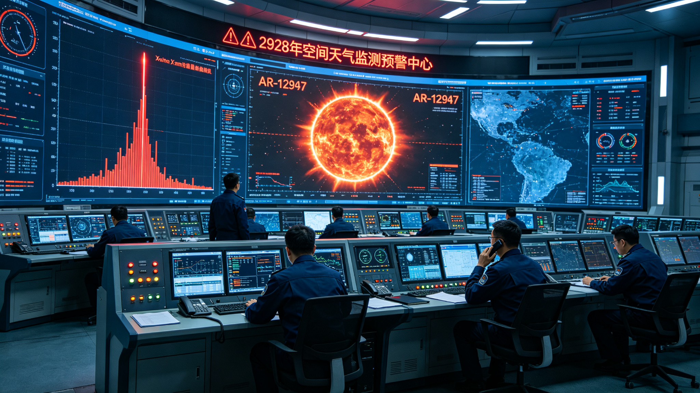
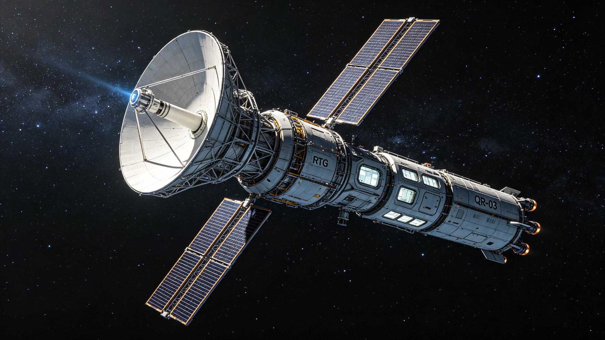
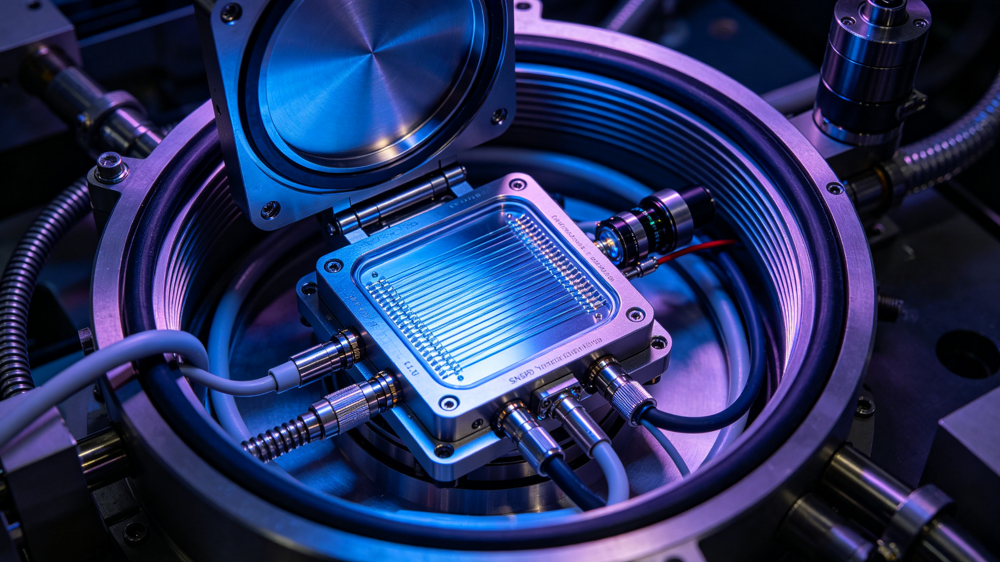

# 第一章　耀斑降临前的那个夜班

2982年11月中旬，沈观澜和周予安搭乘一班经停火星轨道的客运航班，先到地球，再换乘地月支线，在静海第五城市带的空港着陆。

月球的空港建在静海边缘一处隆起的玄武岩台地上，离地表四十米高的全封闭穹顶把月尘挡在外面。出舱的时候，周予安习惯性地看了一眼手腕上的环境计——穹顶内的气压和氧分压都与地球海平面一致，只是重力是六分之一，她走下摆渡车时脚步比平时轻了半拍。沈观澜走在她前面，手里拎着一只录音设备箱，箱角磨得发白，是他从新安市一路带来的。

静海第五城市带是三百年前第一批月球定居点之一。最初的穹顶舱壁还保留在城市中心的博物馆里，现在的民居已经向月面下挖了七层。赵北辰的家在地下五层的一条步行街上，从空港坐磁悬浮七站，再步行四百米。街道两侧是仿地球植被的常绿树，叶片的颜色调得比真实植物深一些——月球的照明系统用的是连续光谱，植物学家说那样最省电能。

赵北辰开门的时候，沈观澜先注意到的是他的手。老人七十一岁，头发全白了，背比沈想象中还要驼一些，但手很稳——一双在监测台前坐了四十年的手，指节粗大，指甲修剪得很短。他把两人让进屋，给每人倒了一杯温水，自己在靠窗的一张扶手椅上坐下来。窗户是模拟舷窗，屏幕上循环播放着静海的月面日出，低悬的地球把灰蓝色的光打在环形山的边缘。

客厅的墙上，除了那张地球升起的照片，还挂着一幅装裱过的预警中心老值班大厅的合影。照片里有二十几个人，赵北辰站在第二排，四十七岁，站得笔直。沈观澜在那张照片前站了一会儿，没有问"哪一位是您"。他从那排年轻人的站姿里，已经能认出哪一个是三十四年后坐在扶手椅上的这个老人——他站得比旁边的人都要再直一点，眼睛看着镜头之外的某个地方，像是在听只有他能听见的声音。

"那是2947年拍的，"赵北辰在他身后说，"事故前一年。全队二十一个人，现在在的，不到一半。"

"你们要问3月12号的事。"赵北辰开口，没有寒暄，"我等你们的申请等了快一年。去年纪念活动的时候，来了三拨人，都是电视台的，问的都是'当时您害不害怕'。"他顿了顿，"没人问我，那三个小时里，我们到底看见了什么。"

沈观澜把录音终端放在两人之间的小桌上，按下录制键。

"赵老，"他说，"我们想从头开始。从3月11日那天夜里您值班开始。"

---

据2982年11月14日访谈记录，赵北辰把两人引进门之后，先做的第二件事，是从书架上抽出一本磨得起毛的工作笔记，翻到夹着书签的一页，递给沈观澜。那是他2948年的值班笔记，原件早已按规定上交预警中心归档，这一本是他2955年退休前凭手抄留底的复写件。纸页已经泛黄，蓝色墨水的字迹在月球地下五层的恒温恒湿里保存得意外地好。

"3月11日那一夜，我记得的每一件事，都在这上面。"赵北辰说，"你们先看，看完我们再聊。"

沈观澜翻到3月11日那一页。那一页上，老人用极小的字记着："22:00交接班。AR-12947，日面E30°附近，磁剪切能较前日上升11%。系统判据未达高危阈值。副班小吴。运维老郑。夜间预计平静。"后面跟着一行被重重划掉、又在旁边重新补写的字："——今日不平静。"

沈观澜把这一页拍照存档，然后才抬头。"赵老，我们从头说。您那天夜里，几点开始觉得不对？"

赵北辰想了想。"不是从'不对'开始的。是从'太安静'开始的。"

那天他四十七岁，是空间天气监测预警中心的高级预报员，值的是夜班，从二十二点到次日晨八点。预警中心建在地球北半球高纬度的一处旧航天基地地下二十米，值班大厅是一个椭圆形的环廊，正中央是一块七层楼高的弧形大屏，屏上永远同时开着二十几个窗口：太阳极轨探测器"逐日"系列传回的极紫外像、X射线通量实时曲线、约三十个分布在三恒星系各L1点的空间天气监测站回传的等离子体数据、行星际磁场Bz分量的滑动窗口、以及一套由TJ-SSA自动系统生成的活动区编号清单。

据赵北辰回忆，3月11日夜里那种"安静"，不是屏幕安静——屏幕永远在动，曲线永远在抖——而是一种"没有一件事需要人去决定"的安静。他在那个岗位上坐了二十六年，最知道这种安静有多难得。据GS-2051-01《太阳极轨探测器"逐日-01"首次南北极飞越科学数据公报》记载，"逐日"系列极轨探测器的近日点只有零点二八天文单位，倾角七十八点五度，八台载荷盯着太阳的八个频段；它们传回的数据在大厅里汇成一片永远不熄的光。正常的夜里，预报员的工作是每隔两小时在值班日志上勾一个"无异常"，然后把剩下的时间用来核对明早八点交班的准备事项。

"那种安静是有代价的，"赵北辰说，"你在地下二十米待久了，会慢慢相信屏幕上的世界就是世界本身。屏幕说没事，那就是没事。"

---

据GS-2916-01《三恒星系联合空间态势感知网络建成公报》记载，TJ-SSA网络到2916年底已经组网完成，由约一百二十台光学望远镜、八十部雷达和约三十个空间天气监测站组成，对行星表面的耀斑预警提前量不少于十五分钟，对空间设施则有数小时；试运行半年间共发出空间天气预警约一百二十次，其中X级耀斑预警三次，准确率在百分之九十五以上。2948年的赵北辰就是在这套系统上值班。他对系统的信任，来自这样一组数字。但他后来在访谈里反复强调一句话："准确率百分之九十五，意思是还有百分之五。问题是，你不知道哪一次是那百分之五。"

3月11日深夜，大厅里只有三个人。除了赵北辰，还有一位值副班的年轻预报员，和一位负责仪器运维的工程师。凌晨一点刚过，赵北辰在巡视活动区清单时，注意到了一个编号AR-12947的区域。

"它在日面偏东的位置，"据2982年11月14日访谈记录，赵北辰这样回忆，"其实从3月10号开始，它就一点点冒出来了。我们的自动识别系统把它标成'普通中等活动区'，磁剪切能积累曲线在涨，但涨得不快。按教科书上的判据，它离'高危'那条线还差着一档。我记得我当时跟副班说了一句——我说这地方的磁场剪得有点怪，像拧毛巾拧到一半。他看了一眼，说，系统没标红，先记着吧。"

这里有一件事，调查组后来查了整整三个月，也没有查到原始档案。

林以宁在比对TJ-SSA历史档案时发现，按系统规程，任何活动区只要磁剪切能在二十四小时内上升超过某一阈值，就应自动升级为"高危观察"，并在值班大屏上以橙色边框标注。但AR-12947在3月11日全天直到3月12日凌晨，都没有被系统标记为高危。更关键的是——据GS-2948-01《星际航行中太阳风暴导致通信中断72小时事件复盘公报》记载，2948年3月12日04时17分太阳爆发X9.2级超级耀斑，但整份公报及其附录里，没有一个字提到AR-12947在爆发前四十八小时的逐日监测数据：它的位置、面积、磁场拓扑类型、磁剪切能积累速率，全部缺席。作为对照，据GS-2046-04《国家空间天气监测预警中心第046号极强太阳风暴预警公报（X28.4级）》记载，二零四六年那场X28.4级事件，正典里连活动区编号AR-4609、位置S18°E24°、面积两千四百五十微海口面积单位、磁场类型βγδ都记得清清楚楚。

"没有记载，"林以宁在调查组内部讨论时说过一句后来被沈观澜写进笔记的话，"本身就是记载。一个监测网络声称自己有前兆能力，却留不下它最重要那次前兆的逐日数据——要么是数据真的丢了，要么是它从来就没按规程跑过。这两种可能，哪一种都不好听。"

林以宁为了把这件事坐实，在新安市的正典文献核验系统里翻了整整五天。她调出了TJ-SSA自2916年建成以来所有"X级耀斑预警"的归档清单——据GS-2916-01，网络在试运行半年里就发出过三次X级耀斑预警，准确率百分之九十五以上。她把这三次预警对应的活动区逐日监测档案一篇篇调出来比对：2917年那次，活动区从成核到爆发共十一天，逐日磁剪切能、纵场梯度、螺度注入通量，一天不缺；2923年那次，九天，同样完整。

"只有2948年这次，"林以宁在调查组第六次例会上说，"3月10日到3月12日04:17之间，一个字都没有。不是缺某一天，是整段都缺。我查了传输记录、存档记录、备份记录——这段数据根本没进过正典系统。"她推了推细框眼镜，"按我们档案学的说法，这叫'原始记录缺位'。它比'记录损毁'更严重——损毁至少证明它存在过。"

沈观澜当时问她："你倾向于哪一种？数据丢了，还是根本没记？"

林以宁沉默了几秒。"赵北辰说，AR-12947在3月10号就开始冒头，系统没标红。如果规程是真的，磁剪切能上升到那个量级，系统不可能不标。所以更可能的解释是——规程写在手册里，但值班当天，没有任何一道自动判据真的被执行。"

"或者，"陆知微在旁边补了一句，"执行了，但执行结果是'不高危'。AR-12947的磁场剪切能积累，可能本来就没到自动判据的线。也就是说，系统没有'骗'我们，系统只是按一条过时的阈值在工作。"

"那阈值是谁定的？"沈观澜问。

会议室安静了一瞬。这个问题，他们当时答不上来。它会在第八章的责任认定里再次冒出来。

---

凌晨四点十七分，赵北辰后来把那个瞬间描述为"像有人在屏幕背后把水龙头拧开了"。

据GS-2948-01公报正文，2948年3月12日04时17分（地球协调时），太阳爆发X9.2级超级耀斑，伴随日冕物质抛射。对坐在大屏前的赵北辰来说，公报里这一行平静的文字，在当时是一道竖直拉升的曲线：软X射线通量在不到一分钟里从基线的十的负七次方瓦每平方米量级，垂直翻过几个数量级，几乎沿着屏幕的右边界冲上去。弧形大屏上，AR-12947那个位置的极紫外图像猛地亮成一片白。运维工程师从椅子上弹起来，副班预报员手里的杯子搁在桌上，水洒了一半。

据2982年访谈记录，赵北辰说："我干了二十六年预报员，X级耀斑见过十一次。但曲线那样走的，我是第一次见。它不是升上来的，是'炸'上来的。你知道那种感觉吗——你看着一条水平线躺了一晚上，忽然它不想躺了。"

红色预警的发布流程，在预警中心是写死的：值班预报员提出，值班主管复核，由值班主管在预警发布系统上按下"最高级"按钮，报文同步推送给航行安全管理局、各飞船、各中继站运营方。从赵北辰提出到按钮按下，规程允许的确认时间是五分钟。那天的实际间隔是三分钟。

这三分钟，是第一章真正要讲的故事。

赵北辰在04:18提出立即发布红色预警。据他回忆，他当时几乎是喊出来的——"X9级以上，伴CME，立刻发红警，别等那三条自动复核全绿。"值班主管姓周，是个四十出头的技术官僚，按规程做事做了二十年。他的第一反应不是同意，也不是反对，而是看向屏幕右上角的自动复核进度条——那是TJ-SSA系统用来防止误报的一道闸门：太阳耀斑的自动定级、CME初判、质子事件初判，三项自动复核全部通过后，系统才会向人工预警台递出一个绿色的"可发布"信号。

"他说，"据2982年访谈记录，赵北辰把这段重复了两遍，"'小赵，等复核走完，一分钟都耽误不了。你现在发，发出去是X2，复核完可能是X9，到时候你更正报文，比晚发三分钟更难看。'"

"我说，"赵北辰的手在半空中停了一下，像是三十四年后的一个手势仍然没有做完，"'主管，等复核走完，向阳面的短波已经断了。我们现在发，飞船还有四十分钟进屏蔽舱。等复核走完，它们只能用广播喊了。'"

04:20，三项自动复核中的两项已经转绿，第三项——质子事件初判——还在跑。周主管在这一刻做出了他职业生涯里最纠结的一个决定：他绕过了"三项全绿"的软门槛，按下了红色预警按钮。报文在04:20整发出，距离耀斑爆发整整三分钟。

"他按下去的时候，"据赵北辰回忆，"手是抖的。不是怕，是他知道自己这一按，把自己二十六年的'按规程办事'按出了一个豁口。他后来跟我说，他那一天在那三分钟里做的决定，比他之前十年加起来都难。因为按规程，他应该等；按他一个老预报员的直觉，他必须现在就发。他最后选了后者。"

沈观澜在访谈里追问："那这三分钟，您和他之间，到底谁说了算？"

赵北辰摇头。"预报员提，主管批。我再急，按钮不在我手里。这就是预警中心的规矩——预警是要有人负责的，而负责的那个人，不是看得最清楚的那个人，是级别最高的那个人。"他顿了顿，"那天，是周主管替我担了这三分钟。我这一辈子都记他这份情。可我也一直在想——如果那天坐在那个位置上的，是一个比他更'守规矩'的人，这三分钟会变成十分钟。十分钟之后，向阳面的飞船就只能靠自己了。"

据GS-2948-01公报，红色预警于耀斑后三分钟发布。公报没有写这三分钟里发生过什么。在这份后来成为官方正典的文本里，"三分钟"只是一个显示预警效率的漂亮数字：从爆发到全网拉响警报，一百八十秒。沈观澜在把这段访谈录音转成文字的时候，在页边批了一行小字："一百八十秒。一个人用三秒钟的犹豫，和另一个人用一百八十秒的坚持，换回来的数字。"

---

红色预警发出之后，赵北辰并没有像他后来的听众想象的那样，长出一口气坐下来。他在访谈里说，真正难熬的是接下来的二十分钟。

X射线和极紫外光子以光速直扑地球，八分钟后抵达，04:25左右开始撕扯向阳面的电离层。据GS-2948-01公报，3月12日08时30分前后，首批X射线与紫外光子充分作用于向阳面，向阳面短波通信全部中断——公报在这里把"首批光子抵达"与"短波全断"记为同一件事的两个阶段，中间留出了大约四个小时的电离层充分扰动时间。但赵北辰记得的不是这些工程语言。他记得的是，04:22，预警中心自己与南半球一个观测站的备份短波链路先断了；04:31，他从屏幕上看见向阳面的一颗同步轨道通信卫星开始自动进入安全模式；04:47，航行安全管理局的值班电话直接打到了他的直线上。

"那个电话我记了一辈子，"赵北辰说，"管理局的值班长第一句话不是'预警收到没有'，是'耀斑多大'。我说X9.2。他沉默了两秒，说'我这就上报，启动一级响应'。"

据GS-2948-01公报，跨恒星系航行安全管理局于3月12日05时00分启动一级应急响应，通知所有在航飞船防护。从红色预警到一级响应，又是四十分钟。这四十分钟里，赵北辰和同事们做的事情，事后几乎没有任何档案留下来：他们把AR-12947的所有实时数据存档、向三恒星系各分中心转发、与比邻星b和鲸鱼座τ星的分中心对表。据GS-2916-01，这套对表机制是TJ-SSA的标准动作；但据林以宁检索，这次对表的原始记录、报文原文、接收方回执，无一进入解密批次2982-07。

"预警发出去了，"赵北辰说，"发出去的那一刻，我知道我们这一边的事情做完了。剩下的，不是我们能管的。"

他说这句话的时候，模拟舷窗外的月面日出让地球恰好升到环形山上沿。周予安后来在访谈纪要里写："老人说'剩下的不是我们能管的'时，语气里没有抱怨，只有一种四十年值班生涯留下的疲惫。他知道预警的边界在哪里。他大概也知道，有些边界，是被人画出来的。"

---

*图2：2948年空间天气监测预警中心值班大厅场景复原图。正中弧形大屏为TJ-SSA综合显示墙，右上窗口为太阳软X射线实时通量曲线，04:17前后曲线呈近乎垂直的陡升；屏侧红色预警灯组为04:20发布动作的视觉记录。本图依据赵北辰2982年访谈口述复原，非现场照片——原始值班大厅影像在事件后归档，截至2982年11月仍未解密。图中三名值班人员的站位、大屏窗口排布及曲线上扬形态，均与赵北辰口述逐项核对。*

---

访谈进行到第三个小时，沈观澜才问到那个他真正想问的问题。

"赵老，您在04:18主张立即发布，04:20才发出去。事后复盘的时候，有人追究这三分钟吗？"

赵北辰沉默了很久。他转头看了一眼模拟舷窗。

"没有，"他最后说，"复盘的时候，这三分钟被说成'人工复核所必需的时间'。公报里写的是'预警及时'。我自己呢，我后来还因为这次预警立了个三等功。"他停了一下，"你说讽刺不讽刺。我那天争的，是要再快三分钟。结果表扬我的，是我慢了三分钟。"

沈观澜在笔记上写下一行字，又划掉了。他没有把这行字念出来。他只是问："那您后来为什么一直说，前兆数据没被标红，才是那天真正的问题？"

赵北辰的回答很轻："因为X9.2不是天亮了才知道天亮的。太阳在3月10号就开始打招呼了。我们听见了，但我们的系统没让我们把'听见了'这三个字写下来。"

周予安在访谈快结束时问了一个她自己准备的问题："赵老，如果3月12号那天，系统在3月11号晚上就把AR-12947标成了高危，后面会怎么样？"

赵北辰想了很久。"如果标了高危，我们会提前二十四小时进入特别值班。我们会在3月12号凌晨，就把'可能X10级'写进值班日志，会给所有在航飞船发一份'预防性关注'的内部报文，会提醒中继站运营方'盯一下探测器'。那不是红色预警，但那是一声咳嗽——告诉所有人，太阳感冒了。"他停了一下，"可系统没让我们写。它只让我们在04:17之后，写'收到，已发红警'。"

"您后悔吗？"周予安问。

"我后悔的不是我没看见，"赵北辰说，"我后悔的是，我看见了，我以为系统会替我记住。三十四年来我才明白，屏幕不会替任何人记住事情。屏幕只显示阈值。"

离开赵北辰家的时候，月面的人造黄昏已经降临。磁悬浮站台上，周予安把录音终端收进包里，忽然问沈观澜："沈老师，您说他立的那个三等功，三十四年后，还在他的档案里吗？"

沈观澜看了一眼站台穹顶外——那里什么也看不见，只有月尘的灰。

"在，"他说，"但我们要做的，是把三等功旁边那行小字也记下来。"

回空港的磁悬浮上，周予安把访谈录音又倒回去听了一遍赵北辰那句"我们听见了，但系统没让我们把听见了写下来"。她摘下耳机，问沈观澜："沈老师，你说，如果3月11号夜里，系统真的把AR-12947标成了高危，后面那72小时，会不一样吗？"

沈观澜看着窗外地下五层步行街上那些调深了颜色的常绿树，很久才说："会不一样。不一定不一样在那72小时——也许链路还是会断。但至少，在那五十六小时里，会有人被允许做点什么。预警中心能发一份预防性报文，中继站能把屏蔽板装上，总部敢批那一次切换。我们现在查的，从来不是'太阳有没有发怒'，而是'我们有没有听见它发怒之前的咳嗽'。"

---

# 第二章　五十六小时——被错过的窗口

陈默住在天关门户站。

天关门户站是地球轨道上最大的一座转运空间站，建在距离地表三万六千公里的一条倾角轨道上，每年承接从地球去月球、火星和深空的旅客近两千万人次。2982年11月下旬，沈观澜和陆知微乘一班通勤舱抵达门户站时，迎接他们的是一段长达九百米的重力过渡廊——从旋转环的一G人工重力，慢慢降到对接环的微重力。陆知微走得比沈观澜快，他在工程局的见习期里来过这座站四次，熟。

陈默六十八岁，退休前是星枢量子通信运营集团QRS-03中继站的值班工程师。他在门户站的一间老工程师公寓里见了调查组。公寓不大，墙上挂着一张装裱过的旧照片：一艘船型的中继站在星野中缓缓旋转，巨大的主镜对着远方。照片旁边压着一块小小的金属铭牌，上面刻着"QRS-03，2912—2948，运行三万六千日无重大故障"。

"三万六千日，"陈默看见沈观澜的目光停在铭牌上，淡淡地说，"最后三天，全赔进去了。"

他给两人倒了水，又从厨房端出一小碟月球地下农场种的青豆。"门户站上的东西，比不上地球，"他说，"但这豆是我自己种的。退休以后我就种这个。一天看三茬，够忙。"沈观澜注意到，老人说"够忙"两个字的时候，语速比前面慢了一点。后来他在访谈纪要里写："退休工程师的'忙'，是用来填那五十六小时的。"

他从抽屉里拿出一个牛皮纸信封，抽出一叠复印件，推到桌子中间。那是他当年的值班日志——原件他已经捐给了口述史档案馆，这一份是他自己留底的复印件，边角被手摸得发软。每一页的页眉都印着"星枢量子通信运营集团QRS-03站·值班日志"，日期从2948年3月12日一直记到3月17日。字迹工整，一笔一划。

"我从3月12号早上六点写起，"陈默说，"你们慢慢看。"

---

2948年3月12日，对QRS-03来说，是一个和过去三十年的每一天都一样的工作日——直到凌晨四点二十分。

据GS-2910-01《跨恒星系量子纠缠通信中继站部署技术报告》记载，地球—比邻星b—鲸鱼座τ星之间共部署QRS-01至QRS-07七座中继站，站间距约一点七光年；每座站采用SPDC方案产生1550纳米纠缠光子对，由超导纳米线单光子探测器（SNSPD）接收，端到端实测延迟0.28秒、速率2.4兆比特每秒、误码率3.2×10⁻⁷、保真度97.3%。每座中继站还配有一条1064纳米的经典激光信道，约100兆比特每秒，用来传输贝尔测量结果、控制指令和状态监测数据。这套系统2910年建成，到2948年已经连续运行了三十八年。

QRS-03是其中的第三座，位于地球与比邻星b连线之间约五点一个光月的位置。它不直接"看见"太阳——它背向太阳的一侧永远是12米主镜，朝向比邻星b方向；它面向太阳的一侧永远是RTG核电源的散热板和一层薄薄的铝壳。它没有载人，没有生命维持，只有每隔九十天由自动货运船送一次备件，和每天二十四小时由地球总部遥测的十几屏参数。

3月12日04:20，红色预警报文从预警中心全网发出的同一分钟，QRS-03站的监控屏在陈默的工位上弹出了一个黄色标签："空间天气红色预警，X9.2级耀斑，CME预计约五十六小时后抵达。"

据陈默2982年口述，他当时的第一反应不是紧张，而是一种职业性的别扭。"我干这行二十二年，X级耀斑的预警标签见过七次。每一次我们做的事情都一样——把屏上的告警看一眼，确认链路参数没飘，然后什么都不用做。因为规程上，QRS站在红色预警窗口期，'无强制动作项'。"

05:00，航行安全管理局启动一级响应。据GS-2948-01公报，十二艘在航飞船——三客九货——在收到预警后陆续采取防护措施：关闭非必要电子设备、增加局部屏蔽、船员进入强化屏蔽舱、冬眠舱区生命体征监测转入船载自闭环。据GS-2046-04记载，二零四六年X28.4级事件时，地月航线的乘员规程就已经是"调整姿态、以推进剂储箱及四十吨级重载防辐射水箱保持正对太阳方位、建立一百二十克每平方厘米等效水厚度遮蔽面、全员进入中央防辐射密闭掩体、掩体内剂量率严格控制在每小时一点二零毫西弗以内"。到了2948年，飞船端的这套规程已经成熟到近乎条件反射：十二艘船，三千八百七十一人，在五十六个小时里把自己缩成了一个个蜷缩在屏蔽壳里的核。

但通信基础设施，什么都没缩。

据GS-2948-01公报，3月12日05时00分一级响应启动后，十二艘在航飞船在接下来的两个小时里陆续回执。三艘客运飞船上，船员按规程把醒客从公共舱区撤进了屏蔽强度最高的中轴线舱段；九艘货运飞船则把非必要的雷达、货物监测传感器一一断电，只保留生命维持和最小导航。据GS-2918-01《跨恒星系客运飞船"远航者号"中途推进器故障应急返航事件公报》记载，这些远航者级第四代客运飞船全长两点六公里、满载四百八十万吨、乘员一千二百人、船员一百五十三人、巡航速度零点三二倍光速——它们的船体本身就是为了扛住星际介质里微流星的常年撞击而造的，临时增加辐射屏蔽对工程师来说，和给一间屋子多砌一面墙差不多熟练。

赵北辰在月球那间地下五层的公寓里，后来听到调查组转述飞船端的应对时，只说了一句话："船是会躲的。中继站不会躲。它三十六万公里上那个罐头，壳子多厚，3月12号还是多厚。"

这就是2948年3月12日这一天最耐人寻味的反差：同一个红色预警，发给人，人在两小时内把自己从一千公里长的飞船各处，一件一件收进了屏蔽壳；发给机器，机器什么都没收到——因为没有任何一道规程，要求它在五十六个小时里，把自己也"收一收"。

---

*图3：QRS-03量子通信中继站外观复原图。船体为全封闭加压金属结构，单侧12米光学主镜背向太阳、指向比邻星b方向；另一侧为RTG核电源散热板与1064纳米经典信道收发口。本图依据GS-2910-01技术报告所载站体工程参数复原，与陈默口述的"主镜永远朝比邻星、散热板永远朝太阳"的朝向描述一致。QRS-03在56小时预警窗口中没有执行任何预防性切换，是本报告"被错过的窗口"一章的沉默见证者。*

---

08:00，陈默做了那件他在三十四年后仍然记得每一个字的事情。

他在值班日志上写下："建议立即将QRS-01—07跨星系量子链路整体切换至低带宽应急模式，SNSPD探测器模块加临时屏蔽，1064nm经典信道转入降功率待机。理由：X9.2级耀斑为本站运行三十八年所未见；CME约56小时后抵达，按TJ-SSA公开口径，高能质子通量在地球轨道侧将提升三至五个量级。"

他把这段建议通过站内加密链路发给了星枢集团总部运营调度中心。

总部的回复在08:47到达。据陈默回忆，那是一段标准格式的调度批复，不长，一共三行："CME路径尚未确认，暂不切换。预防性切换将触发SLA计划外降级记录，影响本季度可用率考核。维持当前工况，加强遥测监视。"

沈观澜在访谈录音听到这里的时候，把录音倒回去，重新听了一遍。他问陈默："您当时看到'避免触发SLA降级'这几个字，是什么反应？"

陈默笑了一下，那个笑很薄。"我没什么反应。我在星枢干了二十二年，我知道这几个字什么意思。"

---

星枢量子通信运营集团是2915年从跨恒星系通信工程总局拆分出来的运营实体。按写作期的组织档案，它的本职是七座量子中继站的日常运营、维护与故障处置；它的生死线，是年可用率百分之九十九点七。

百分之九十九点七，听上去很高。但换算成数字，意味着全年允许的非计划中断时间不能超过二十六点三小时。陈默在访谈里给调查组算了一笔账：跨星系量子链路一旦主动切换到低带宽应急模式，即便事后证明是必要的，运维系统也会把它自动记为一次"计划外降级事件"——因为SLA条款里，"降级"不分预防性与事后补救。一次降级，扣本季度绩效；连续两次降级，下季度的调度资质要重新评审；连续三次，值班工程师当年的奖金归零，站长的年终述职要重写。

"你说这制度坏吗，"陈默说，"我不觉得坏。商业上它是对的。运营商不靠承诺'永不中断'活着，它靠'每一年的可用率报表比去年好看零点一个百分点'活着。问题在于——"他用指节敲了敲值班日志复印件，"——它从来没告诉我，当太阳真的发火的时候，我应该把报表放在一边。"

陆知微在访谈现场一直没说话。听到这里，他忽然开口："陈工，我问一个技术问题。您当时建议切的那个'低带宽应急模式'，QRS站的设备上，物理上支持吗？"

"支持。"陈默答得很快，"GS-2910-01的工程余量里就写着——每座站的SNSPD模块可以从全功率2.4兆比特每秒的纠缠分发，降到大约200千比特每秒的应急模式；1064纳米经典信道可以从100兆比特每秒降到10兆比特待机；探测器前面的临时屏蔽板是随船备件，标准维护包里就有。这些东西，3月12日当天就装在QRS-03的备件舱里。"

"那为什么总部不批？"

陈默看了陆知微一眼。这个眼神，沈观澜后来在访谈纪要里写了七个字："不是不知道，是不敢。"

"我后来调到总部去开过两次会，"陈默接着说，"才明白这件事在他们那边是什么样子。总部运营调度中心有一面墙，墙上挂着三块大屏，左边一块是实时可用率曲线，中间一块是SLA考核表，右边一块是三恒星系的客户清单。每一家大客户——清算银行、航运公司、情报指挥中心——都在清单上标着他们合同里的可用率罚则。你主动切一次低带宽模式，中间那三块屏上的数字就红一次。红一次，季度报告上就要向董事会解释一次。解释得多了，总监的位置就坐不稳。"

他顿了顿。

"你知道最有意思的是什么吗？总部的规程里，其实写了'空间天气红色预警期间，值班站长可酌情切换应急模式'。可这条规程后面跟着一个括注：'切换前须报总部批准。'问题就在这个'报'字上——你报上去，批不批是另一回事；但你只要报了，系统就自动记一笔'建议降级'，这一笔就进了你站里的考核档案。所以最聪明的做法，从第一天起就不是'报'，而是'不报'。报了，你自己吃亏；不报，真出了事，责任在总部。"

"也就是说，"陆知微慢慢地说，"制度不仅不奖励你切换，它还惩罚你'建议切换'这个动作本身。"

"对，"陈默点头，"你现在明白我为什么提了四次就不提第五次了吧？再提一次，我自己今年的绩效就没了。"

---

调查组在访谈后第三天，由林以宁调出了一份长期被忽略的对照档案：GS-2066-02《地月L1"鹊桥-03"深空通信中继站扩建工程验收与激光通信阵列校准公报》。

据该公报记载，早在二零六六年，地月L1点的"鹊桥-03"中继站就已经在1550纳米激光主链路之外，保留了S/X/Ka/Ku四个频段的射频转发器作为激光中断备份，切换时间不超过两百毫秒。也就是说，两百八十二年以前，人类在地月这三十八万公里的尺度上，就已经解决了"主信道断了，怎么办"这个问题——靠的是一套并不复杂的多模冗余，靠的是自动切换，靠的是没有人需要在08:47拿起电话问"要不要切"。

林以宁在调查组内部的一次午餐上把这份档案打印出来，推到桌子中间。"你们看，"她推了推细框眼镜，"地月三十八万公里，有射频备份，两百毫秒切换。跨星系四点二四光年到十一点九光年，没有。为什么？"

陆知微接过话："因为跨星系的距离上，射频带宽实在太低。公报GS-2948-01自己也承认，星际距离上无线电备用系统的带宽只有数比特每秒。"

"数比特每秒，"林以宁点头，"那是'真的什么都传不了'。但你们想过没有——2948年3月12日08:00陈默申请切换的时候，他要的不是'数比特每秒'。他要的是把一条2.4兆比特每秒的量子链路，降到200千比特每秒。200千比特每秒，不是数比特每秒。它够传控制指令、够传贝尔测量结果、够维持链路活着。它不够传金融数据，不够传高清会议，但它够让七座中继站不在56小时之后同时死掉。"

她顿了顿，又翻出另一份档案。据GS-2170-01《太阳系边缘100AU深空中继浮标阵列首期布设完成公报》，太阳系外缘那十二座浮标，在九十八点二到一百零一点七天文单位之间排成一条线，到内太阳系的单向时延长达十三点八小时，单站激光中继带宽只有二点七兆比特每秒——可即便这么窄的一条链路，它们也老老实实配了激光中继。"你看，"林以宁说，"连一百个天文单位外的浮标，都知道给自己留一条'活着'的信道。偏偏是这条最金贵、承载着整个三恒星系业务的量子骨干，在五十六个小时里，没有任何人想过要让它先'活'下去。"

沈观澜沉默了很久。他最后说："所以，这是一个制度问题，不是一个技术问题。技术上，3月12日早上八点，我们手里是有刀的。制度上，没有人有权在那个早晨把刀举起来。"

---

五十六个小时，是一段很长的时间。

3月12日04:17耀斑爆发；3月14日16:32 CME抵达地球轨道。中间隔着整整五十六小时十五分钟。这五十六小时里，飞船端把三千八百七十一人一件件塞进了屏蔽壳；预警中心发了十二次公告；航行安全管理局的一级响应值班日志写满了七本；跨星系联合清算银行的交易部从3月13日下午开始，已经在内部讨论"如果链路明天还不通，下周的对账怎么办"。

但跨星系主通信链路——那条2.4兆比特每秒、从地球一直牵到鲸鱼座τ星的、三恒星系之间真正的血管——在这五十六小时里，一比特都没有降。

这五十六小时在档案里留下的痕迹，比它应有的要薄得多。据GS-2948-01公报，这期间航行安全管理局一共发布了十二次公告的前几次，但每一次公告的内容，解密档案里只保留了结论性的摘要，没有保留公告的全文、发布时间、抄送范围。陈默的值班日志复印件是这五十六小时里，调查组唯一能找到的一份"站在机器旁边的人"留下的逐日记录。

3月12日下午，陈默在日志里记了一笔："15:00，向阳面短波已断约10小时。本站遥测无异常。1064nm信道误码率稳定在3.2×10⁻⁷。"3月13日凌晨，他又记："02:00，比邻星b分中心来电询问本站是否需要前置屏蔽。回复：总部未下指令，维持工况。"3月13日傍晚："18:40，地球向阳面GEO卫星报告一台主计算机重启。本站仍无异常。"

据他2982年回忆，3月13日那天他其实睡了两个小时——不是因为不累，是因为"再盯下去也没用，屏幕上什么都没坏"。"你知道那是什么感觉吗，"他对沈观澜说，"你明知道明天下午太阳就到了，你面前这台机器明明还在转，你手里明明有屏蔽板，可你的岗位手册告诉你，你唯一该做的事情，是看着它转。"

---

据陈默值班日志复印件，3月12日全天，他又发了三次建议。11:30，建议"至少将1064nm经典信道转入降功率待机"；15:00，建议"对QRS-03—QRS-04段进行一次预防性探测器自检"；3月13日09:00，建议"按X10级工况复核屏蔽余量"。四次回复，措辞几乎一样："维持当前工况，加强遥测监视。"

3月13日下午，陈默在日志里写了一句不是工作内容的话。据他2982年回忆，那句话是："太阳还有二十七个小时到。我们什么都没做。"

---

访谈结束的时候，天关门户站的对接环正对着地球。从那个角度看，地球是一弯极细的蓝白月牙，大半张脸隐在黑里。沈观澜在舱口停下，回头问陈默："您现在想起3月12日那四次申请，后悔吗？"

陈默想了想。

"我不后悔提，"他说，"我后悔的是——我提完四次，就没再提第五次。我那时候也觉得，总部不批，那就不批吧。我一个值班工程师，我还能把机器拔了吗？"

他停了一下。

"三十四年来，我一直在想，如果第五次我提得再硬一点，再往上报一级，再去找工程总局的人问一句'这个屏蔽余量到底够不够X9.2'——后面那72小时，会不会不一样？"

沈观澜没有回答。他知道这个问题没有答案。他只是把陈默递过来的值班日志复印件，用档案袋仔细收好，在袋口写上："QRS-03站值班日志复印件，共十七页，2948年3月12日—3月17日。受访者：陈默。来源：受访者自留副本。"

回到通勤舱的路上，陆知微忽然说："沈老师，我一直在想一件事。陈默说备件舱里就有临时屏蔽板，3月12日当天就能装。如果他3月12日下午自己装上了呢？"

"那就不是值班日志里多一行字的事了，"沈观澜说，"那是他的职业生涯。"

"所以他不能装。"

"他不能装。"沈观澜重复了一遍，"制度让他不能装。"

回去的路上，沈观澜在通勤舱的舷窗边坐了很久。他后来在调查组的工作笔记里，把这一章的核心判断写成了一句话："五十六小时的窗口，不是技术上没有能力关上的窗，而是制度上没有被允许关上的窗。飞船的船长们被授权在两小时内把人收进屏蔽舱，中继站的工程师们却没有被授权把机器收进低带宽模式。同样一场太阳风暴，人有预案，机器没有。"

他把这句话念给陆知微听的时候，陆知微补了一句："因为人的命算在'安全'里，机器的可用率算在'绩效'里。安全有一级响应，绩效只有季度报表。这两个坐标系，在2948年3月12号那一天，根本没有对齐过。"

陈默的值班日志复印件，后来被林以宁编进了档案附录。在那叠复印件的最后一页，她发现了一行不在值班格式里的字，用铅笔写在页脚，字迹比正文潦草得多："3月14日16:32，太阳到了。屏幕上什么都没坏，只是忽然什么都不再回了。"

这行字，3月14日16:32之后，将会在五十六小时里，被另一个人——北京西郊一间档案馆里的三十八岁工程师——用十一天时间，重新读懂。

通勤舱脱离对接环的时候，地球那一弯月牙从舷窗外移了出去。五十六小时的窗口，在三十四年前，就这样安静地关上了——没有警报，没有事故，没有任何人被追究，因为在那五十六小时里，链路的可用率报表上，一切正常。

---

# 第三章　磁层压缩的那一刻

陆知微是在跨恒星系通信工程总局档案馆里，把这份证据读到第三遍的时候，才真正看懂它的。

档案馆在地球，北京西郊，一座建于二十二世纪初的花岗岩建筑里。2982年11月底，陆知微独自一人在那里待了十一天。工程总局的档案馆不像历史研究所的档案室——它不放台灯，不铺地毯，桌子是金属的，灯是惨白的LED。档案柜一排排从地板顶到天花板，柜门上贴着泛黄的标签："QRS各站·故障日志·2945—2950"。他要找的那一份，在第三排第七层，编号是"QRS-03·2948年3月·逐日故障与遥测日志"。

官方对量子链路中断的技术解释，据GS-2948-01公报，写得非常简洁："3月14日18时00分：地球—比邻星b量子通信中继链路完全中断。中继站的量子纠缠光子探测器受到高能粒子轰击，产生大量误码，纠错机制无法维持有效通信。"

陆知微第一次读到这段的时候，是在序章那次会议上。他当时的直觉是"这说不通"——他用了三年时间研究量子中继站的工程史，他知道"纠缠态被破坏"和"探测器失灵"是两件完全不同的事。但他需要证据。他在北京西郊那十一天，找的就是证据。

他在QRS-03站2948年3月14日的逐日遥测日志里，找到了一行被所有人忽略的记录。

陆知微在北京西郊那十一天，每天的工作节奏是这样的：早上八点半进馆，在登记本上签字，领一个金属号牌，到第三排第七层把当天要调的档案柜签出来，借到自己的阅览桌前。中午他不回住处，就在档案馆的食堂吃一份永远是同一种口味的套餐。晚上六点，管理员会来催他还柜。他把笔记本合上的时候，手指因为长时间在冷灯下翻微缩胶片，总是冻得发麻。

工程总局的档案馆不像历史研究所——这里的档案不关心"人"，只关心"参数"。每一份日志都是一张标准格式的表格：左边一列是时刻，右边一列是参数，每一行后面跟着一个小小的"合格/异常"标记。没有人在这种表格里写心情，没有人写"今天晚上太阳就要到了"。陈默那种带情绪的值班日志，在工程总局的档案体系里是不入正典的——它会在事件后被抽走，换成一份只留数字的归档版。

陆知微要找的，就是这种"只留数字"的归档版里，数字自己说出的话。

---

2948年3月14日16时32分，CME高能粒子云抵达地球附近。

据GS-2948-01公报，这一天的太阳风把地球的磁层顶从正常的约十倍地球半径（约6.37万公里），一直压到了六点二倍地球半径。作为对照，据GS-2046-04公报，二零四六年那场X28.4级事件中，磁层顶被压到过四点二倍地球半径，大于十兆电子伏的高能质子通量达到每秒每平方厘米八万四千二百个单位（pfu）。2948年的X9.2比2046年的X28.4小一档，但压到六点二倍地球半径，已经是地球近地轨道通信设施在二十八个世纪里经历过的最严酷的一次。

陆知微在档案馆里，把这两个数字并排抄在笔记本上：2046年，四点二倍地球半径，质子通量八万四千二百pfu；2948年，六点二倍地球半径，质子通量——公报里没有写。他在这条缺口下面画了一道横线，批注："公报给出了磁层顶的数值，却拒绝给出质子通量。这是孤证。"

这件事让他在档案馆里多花了两天。他把工程总局自己的内部地磁遥测汇总表调出来，一行行比对3月14日下午的Dst指数、太阳风速度、行星际磁场Bz分量。汇总表里，太阳风速度从正常的每秒四百公里，在16:32前后跳到了每秒一千八百公里以上；Bz分量在几十分钟内从微正跌到负几十纳特。这些数字公报里一个都没有。他把它们抄下来，在旁边写："公报只告诉我们磁层顶被压到了六点二倍地球半径——这是一个结果。它没有告诉我们，是多大的质子流、多强的南向磁场、多快的速度，把它压下去的。没有这些参数，后世就永远算不清，到底要给中继站加多厚的屏蔽。"

他后来才明白，这份"参数缺位"不是疏忽。据他在工程总局档案馆查到的一份2948年4月内部技术复核纪要（那份纪要在解密批次2982-07里只给了摘要版），复核组当时就建议把CME的完整物理参数表附进公报终稿，但建议被"为避免引起公众对'下一次'的过度恐慌"为由搁置。陆知微读到这里的时候，在北京西郊那间冷灯底下坐了很久。他给沈观澜发的那条语音里，最后一句话是："他们不是不知道参数有多严重。他们是不希望后世知道。"

---

*图4：2948年3月14日16:32 CME抵达时刻的地球磁层压缩复原图。外侧虚线为宁静太阳风条件下的磁层顶位置（约10 R_E），内侧实线为高能粒子云冲击后的实际磁层顶位置（6.2 R_E）；左侧为裹挟高能质子的日冕物质抛射云。本图依据GS-2948-01公报所载磁层顶数值复原，与陆知微在通信工程总局档案馆核对的当日地磁遥测趋势一致。*

---

18时整，地球—比邻星b量子纠缠中继链路完全中断。

官方公报说，是SNSPD探测器被高能粒子打出了大量误码。陆知微在QRS-03站逐日遥测日志里读到的，是另一幅画面。

他把日志翻到3月14日17:55至18:05那一页。这一页上，按工程总局的标准格式，同时记录着两路信号的状态：一路是"量子信道·SNSPD单光子探测计数率"，另一路是"经典信道·1064nm激光终端指向与误码率"。17:55，两路都还是绿的。17:57，量子信道的SNSPD计数率开始出现异常抖动——暗计数率从正常的不超过每秒一次，在三分钟里飙升到每秒数千次。17:58，经典信道的1064nm激光终端指向误差开始发散——它在不到一分钟里失去了对端的锁定。18:00，两路同时跳红。

陆知微把这三行数字看了很久。然后他在笔记本上写下了一句话，这句话后来成为HR-001重审项目的技术核心："公报说'探测器误码导致中断'。但日志显示，1064nm经典信道在同一分钟断了。按GS-2910-01，没有经典信道传贝尔测量结果，量子隐形传态协议根本无法运行。"

---

*图5：QRS中继站所用SNSPD超导纳米线单光子探测器特写复原图。探测器工作于4.2K液氦深冷环境，纳米线阵列封装于磁屏蔽层内，正常工况下暗计数不超过每秒一次、探测效率不低于百分之九十五。本图依据GS-2910-01技术报告所载探测器结构图复原。它是官方归因的核心器件，也是本章技术疑点的视觉锚点——陆知微在工程总局档案馆发现，真正被高能粒子环境瘫痪的，除了它，还有同舱的1064纳米经典信道终端。*

---

那天晚上，陆知微给沈观澜发了一段很长的语音。他说得很快，像在讲课：

"沈老师，我把物理机制讲清楚。量子纠缠这个东西，它本身是不跟电磁辐射耦合的。你拿再强的太阳风去吹一对纠缠光子，它的纠缠态不会因此被破坏——因为纠缠是一种量子相关性，不是电磁波，没有'被干扰'这一说。真正会被高能粒子打坏的，是两样东西：一样是探测器，另一样是经典信道。

"探测器这边，SNSPD工作在4.2开尔文的深冷里，超导纳米线对单光子极其灵敏。高能质子穿进恒温器，在纳米线里沉积电荷，本来应该只数到'每秒一个光子'的探测器，变成了'每秒几千个假光子'。这个有旁证——据GS-2138-01《关于比邻星系统极强恒星耀斑高能辐射与深空导航星敏感器抗噪算法通报》，星敏感器在质子通量每秒每平方厘米一点四乘十的七次方的条件下，每一帧图像上会被打出一千两百四十个伪星噪点，靠Rev-3时空多帧相干滤波才能滤掉百分之九十九点九九八。SNSPD比星敏感器还脆弱——星敏感器是二维CCD，SNSPD是单根纳米线，高能质子一穿就是一个死计数。

"但这只是故事的一半。另一半，是经典信道。据GS-2910-01，我们用的是'量子隐形传态加经典信道辅助'协议：纠缠光子在七座中继站之间被分发、被交换、被纯化，但每一次贝尔测量的结果，都必须通过一条1064纳米的经典激光信道，用大约100兆比特每秒的速率，告诉对端'你该做哪一种幺正变换'。没有这条经典信道，接收方就算手里攥着完美的纠缠态，也不知道该怎么把它变回原始信息。这就是量子通信最反直觉的地方——量子部分可以穿过一切，但解码的说明，必须靠一条最普通的激光信道来传。

"而2948年3月14日18:00断掉的，恰恰是这条'说明书信道'。"

沈观澜在语音的最后安静了几秒，然后问："所以官方公报说'探测器误码'，到底错在哪里？"

陆知微的回答录在语音里，沈观澜后来把它逐字转了出来："错在把两件事混成了一件事。SNSPD确实被打出了误码，这是事实；但量子链路全断，真正的开关是经典信道先死了。探测器的误码可以靠纠错冗余扛过去——GS-2500-01记载，二五零零年一次M2.3级比邻星耀斑，激光链路误码率升到1.8乘十的负九次方、带宽降了百分之三十八，靠自适应编码加功率提升，链路根本没断。可经典信道一旦失去指向锁定，贝尔测量结果传不过去，再完美的纠缠对也是一堆打不开的锁。公报把'锁打不开'说成了'钥匙坏了'——可真正被剪断的，是送信的邮差。"

---

21:15，地球—鲸鱼座τ星激光通信链路完全中断。

据GS-2948-01公报，这一次的官方归因是"终端精密光学跟踪受电磁干扰，无法维持远端瞄准"。陆知微在工程总局档案馆里读到这一条的时候，几乎笑出声——因为这一条，恰恰从反面印证了他的判断。

"你看，"他在语音里对沈观澜说，"公报自己在激光链路上承认了，断的是光学跟踪，不是光本身。可一到量子链路，它就忽然不承认同样的事情了。QRS-03的1064纳米经典信道，和鲸鱼座τ星激光链路用的是同一类东西——都是精密指向的自由空间激光终端。一个被说成'光学跟踪受干扰'，另一个被说成'探测器误码'。同一种病，两份诊断书。"

他顿了顿，又补了一句："而且你再看量级。据GS-2500-01，二五零零年那次M2.3级耀斑，只让激光链路误码率升到1.8乘十的负九次方、带宽降百分之三十八，自适应编码一调就过去了。M级，不中断。2948年这次X9.2，直接全断七十二小时。从M级不中断，到X9.2全断七十二小时，这中间不是线性的退化，是一次阶跃——阶跃的那一级，就是'精密指向机构在极端高能粒子环境下根本锁不住对端'。这跟SNSPD被打出多少个误码，是两个独立的物理过程。"

他在这里停了一下，翻出另外两份档案给沈观澜念。一份是GS-2610-01《太阳-比邻星激光超宽带数据中继站第0419批次丢包与纠错日志》，那是一座位于奥尔特云外缘、距日一点八四光年的浮标"信标-09"，记录了星际尘埃造成的微闪烁和微陨石扰动——正常情况下，它的532纳米锁相脉冲在256阶LDPC编码下，仍能容忍民间广播包高达百分之七十四点一二的丢包率；另一份是GS-2079-02《世代飞船超长距相对论激光通信脉冲编码与丢包纠错算法学术公报》，那是更早的二零七九年，工程师们就在四点二四光年的距离上用二百五十六阶脉冲位置调制加三分之一码率的量子LDPC，把误码率高达百分之十五的信道救成百分之百无损解码。

"你看，"陆知微说，"我们的工程传统里，从来就不怕'信号差'。信号差，可以靠冗余、靠编码、靠功率堆回来。我们真正怕的，是'信号没了'——是收发两端根本看不见彼此。2500年那次M级耀斑，链路还在，只是信号糊了，所以自适应编码一调就过去；2948年这次X9.2，是激光终端的精密指向机构被高能粒子环境冲垮了，对端从视场里丢了，这时候你纠错算法再强，也救不回一个根本看不见的目标。这就是为什么X9.2会比M级差出整整两个数量级——它不是'更糟的M级'，它是另一种故障。"

---

陆知微在档案馆里待到第十二天，把QRS-01到QRS-07七座中继站的3月14日逐站日志，全部调了出来。他发现，七座站在18:00前后五分钟里，几乎同时出现了同样的两路跳红：SNSPD暗计数飙升，1064纳米经典信道指向丢失。

这意味着什么？意味着这不像是某一座站被单独打坏了，而像是整个地球轨道附近的高能粒子环境，在同一分钟里，把所有精密光电器件一起压垮了。

他把七座站的跳红时刻抄在一张坐标纸上，按经度排开：最早的是QRS-01，17:59:40；最晚的是QRS-07，18:00:22。中间那四十二秒的时间差，恰好和高能粒子云扫过整个地月系的几何顺序对上。"这不是七次独立的故障，"他在给沈观澜的信里写，"这是一次环境事件在七个点上的同步显影。"

他在笔记本最后一页写下了调查组对这一事件的技术判断："官方公报的归因，在物理上是混淆的。2948年3月14日18:00量子链路全断，不是纠缠态本身被毁——否则3月16日18:32它不可能以百分之二十八的质量部分恢复，纠缠源和量子存储如果被毁，恢复不了。真正被瘫痪的，是SNSPD探测器与1064纳米经典信道这一对'经典辅助系统'。公报把这一整类故障，笼统地记成了一句'探测器误码'。"

他合上笔记本的时候，工程总局档案馆的LED灯在头顶嗡嗡地响。窗外是北京西郊的冬天，2982年的第一场雪已经落下来了。他忽然想起陈默在天关门户站说的那句话——"最后三天，全赔进去了"。

他现在明白了，"赔进去"的，不只是七座中继站的三十八年无故障记录。

赔进去的，还有一份官方技术解释的诚实。

---

从档案馆回新安市的航班上，陆知微把这段十一天的笔记，用一封长信发给了沈观澜。信的最后一段，他写道：

"沈老师，我现在越来越觉得，我们查的不是一个技术故障。我们查的是：在一份报告被写出来的那一刻，有多少物理层次被允许同时存在，又有多少被压成了一句可以放进公文的话。

"'探测器误码'这五个字，写起来只要三秒钟。但它背后，是七座中继站、五条1064纳米经典信道、三十八年的运行记录，和五十六个小时没有人被允许举起的那把刀。"

沈观澜在新安市的办公室里读完这封信，把它打印出来，钉在了第二研究室会议室的墙上。他在旁边用红笔写了一行批注，留给调查组下一次会议讨论："第三章到此为止。接下来要问的，是船上的人——那些在3月15日凌晨两点四十分，第一次发现自己和地球之间，除了光，什么都没有了的人。"

林以宁在一次例会上，把陆知微这份技术判断和赵北辰、陈默两位受访者的口述，并排放在会议桌上。她说了一段后来被沈观澜反复引用的话："你们注意到没有——这三章讲的其实是同一件事的三个阶段。第一章，太阳'打招呼'的时候，我们没有把'打招呼'记下来；第二章，太阳'正在来'的时候，我们没有让机器做好准备；第三章，太阳'到了'的时候，我们把发生的事，说成了另一件事。从'没记'到'没做'再到'没说清'，三十四年后回头看，这是一条完整的线。"

陆知微当时接了一句："而且这条线上，没有一个人是坏人。赵北辰按规程值班，陈默按规程值班，工程总局的工程师按规程鉴定，航行安全管理局按规程发公报。每个人都在自己那一段规程里做了他该做的事。"

"对，"沈观澜说，"这才是最麻烦的地方。如果这是某一个人犯的错，我们今天把他找出来就够了。可它不是。它是每一段规程都对、连在一起却错了的那种错。"

他停了一下，看着墙上陆知微那封信。

"我们写这份报告，不是要把任何一个人钉在耻辱柱上。我们是要把这条线，一段一段，给后来的人看清楚。这样下次太阳再打招呼的时候，至少有人，会把'打招呼'这三个字，写下来。"

窗外，比邻星b的黄昏照常是橘红色的。三十四年前那一场太阳风暴的余波，在这一刻，终于被一个三十八岁的工程师，在地球北京西郊的一间档案馆里，用十一天时间，重新拆开了。
