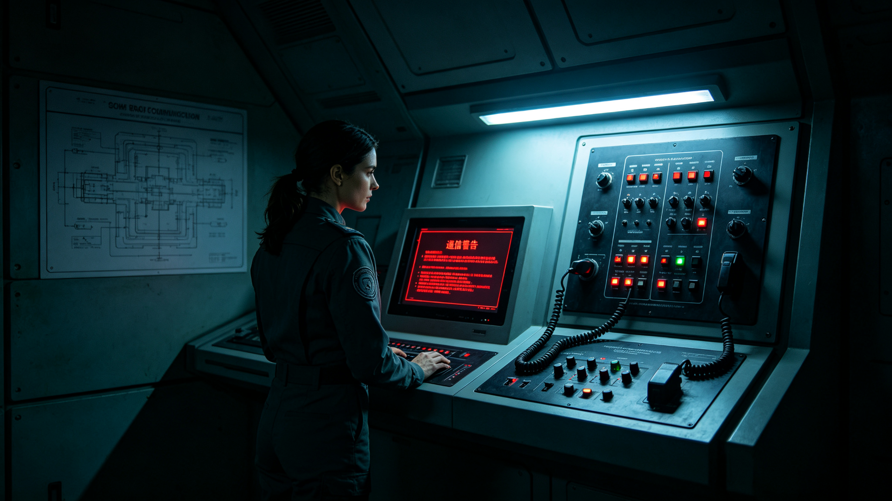
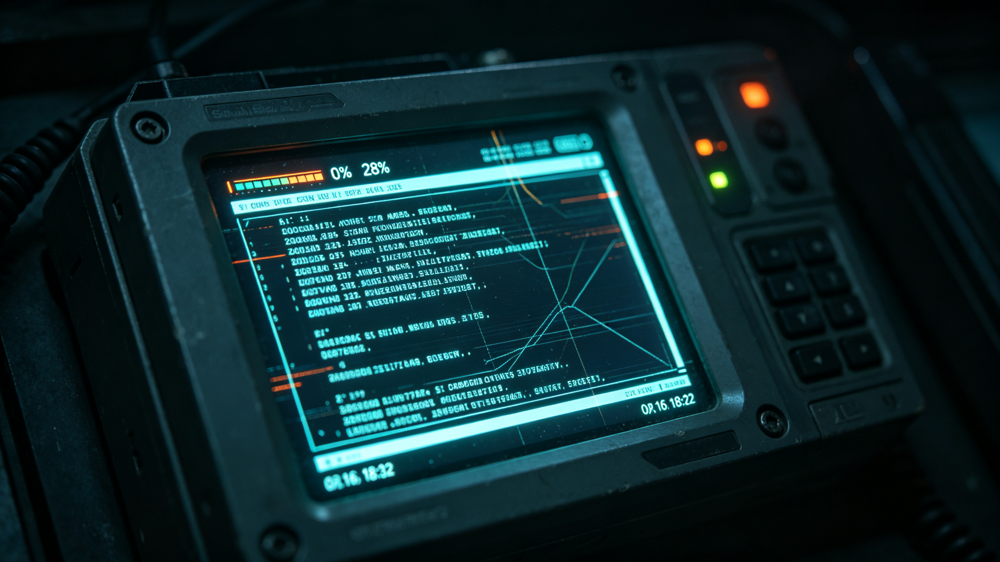

---

# HR-001 v2 中段（第四至七章）

**撰写范围**：第四章 · 第五章 · 第六章 · 第七章

**撰写基准**：v2_写作圣经.md / v2_part0_封面序章.md / evidence_database.md

---

# 第四章　远航者-7号的凌晨两点四十

2982年11月17日，周予安是在新安市南郊的远航者星际航运培训中心见到苏映雪的。

培训中心坐落在行政主城南边三十公里的一片人工林边缘，主楼是一栋低矮的灰色建筑，外墙贴着比邻星b本地出产的暗红色砂岩。楼里最打眼的不是办公室，而是地下三层的模拟舱——六台远航者级飞船驾驶台全尺寸模拟器一字排开，每台前面都坐着两三个二十出头的年轻船员，戴着神经接口头盔，在虚拟的星海上练习靠泊。周予安换乘了两趟地面列车，又走过一条挂满船员资质证书长廊，才在走廊尽头的一间办公室门前停下。

门牌上写着："培训总监　苏映雪"。

她今年五十九岁，头发剪得很短，掺着灰白，穿一件远航者航运的深灰色工装外套，左胸别着一枚小小的船锚徽章。她比周予安想象中要瘦，握手的时候手劲很大。办公桌靠窗，窗台上摆着一盆半死不活的多肉——在比邻星b的人工光照下，这种植物总是养不太好。但真正让周予安注意的，是办公桌正中央那只翻开的深灰色活页夹。

那不是培训教材。活页夹的纸页已经泛黄，边角磨得起毛，第一页右上角用圆珠笔写着一行小字："远航者-7号　2948年3月　航行日志（复印件）"。

"知道你们要来，我把它找出来了。"苏映雪把活页夹往桌中间推了推，"原件在公司档案馆锁着，这是我三十多年前自己复印留底的一份。这一页——"她翻开中间一页，指尖点在一行用红笔圈出来的时间戳上，"就是你们要问的那个时间。"

时间戳写着：2948-03-15　02:40。

办公室的墙上还挂着一张泛黄的远航者级飞船剖面图，上面用红笔圈出了通信舱、冬眠舱区和医疗中心的位置——那是她二十年前自己画的，用来给新学员讲"船上每个舱段出了问题，信号往哪儿走"。剖面图旁边钉着一张合影，是2948年那批远航者-7号船员的合影，她站在最后一排左三，短发，年轻得不像后来这个站在培训中心讲台上的女人。合影边角已经卷了。

"这张照片里，"苏映雪看了一眼那张合影，"有三个人后来没有再飞。贺船长2975年走的，方医生退休后第三年走的，那个当时拨错开关的见习生——他后来转了行政，再也没上过船。船上的人，散得比船快。"

周予安放好录音设备。窗外，比邻星的光透过暗红色的大气，把办公室染成一种暖暖的锈色。苏映雪靠进椅背，沉默了几秒钟，像是在重新走进那艘2.6公里长的飞船。

---

我们有必要先交代一下那艘船。

据GS-2918-01《跨恒星系客运飞船"远航者号"中途推进器故障应急返航事件公报》记载，远航者级第四代跨恒星系客运飞船，是当时三恒星系文明联合体手里最大、最先进、也最昂贵的客运工具。它长2.6公里，梭形的完全封闭加压金属船体，满载质量约480万吨，额定载客1,200人，船员编制153人，装四台聚变主推进器，巡航速度0.32倍光速。这是一种为"一代人之间往返两趟恒星系"而设计的船——它慢，但它稳，它把几百个活人和几千个在冬眠舱里沉睡的人，从一颗恒星送到另一颗恒星，单程好几年，靠的就是不出错。

2948年3月，这样的船在星际航道上一共有12艘，其中3艘客运、9艘货运。3艘客运船上一共载着2,847名乘客，其中744人是清醒的，另外2,103人躺在冬眠舱里。他们是整支船队里最安静的一批人——也是最脆弱的一批人。

要理解这艘船在那个凌晨的处境，得先理解一种在2948年的太空客运里已经被人们习惯了、却很少被说破的生活：744个醒客，和2,103个不醒的人，住在同一艘480万吨的船上。

醒客住在船身两侧的生活舱区，有窗户——不是真正的舷窗，而是模拟天光的灯带，按比邻星b的昼夜节律每24小时明暗一次——有餐厅、有一间小阅览室、有一个永远在放老电影的活动室。他们中有的人是去新安市找工作的年轻工程师，有的是退休后投奔殖民地的老人，有的是像林建国那样去疗养的病人。他们醒着，所以他们会在餐厅里抱怨饭菜，会在走廊里和船员打招呼，会在凌晨三点睡不着的时候走到观景舱，看那片稀疏得能数出颗数的星空。

不醒的人，在船身中部。

据GS-2918-01记载，这种船一次远航要走好几个标准月。醒客们用这几个月读完一本又一本一直没读完的书，练出一手在微重力下揉面的好手艺，或者干脆在活动室里和隔壁舱的陌生人下完了一整季的棋。而那2,103个不醒的人，把这几个月——按冬眠协议，每次长达数月的旅程——整个省掉了。他们省下的是时间，也是风险：醒着飞，就要承担几个月宇宙射线、心理压力、突发疾病的累积；睡着了，代谢率降到正常的百分之五到八，体温降到12到15摄氏度，身体几乎是按了暂停。

这个暂停，是整艘船上最精密的一个装置。

据GS-2947-01《跨恒星系航行冬眠技术临床应用十年评估报告》记载，到2947年为止，十年间一共有127艘次跨恒星系客运航班使用了冬眠技术，运载冬眠乘客438,726人次，冬眠相关死亡率0.012%。这个数字在当时被宣传为"比跨星系航班本身的事故率还低"。但这个数字能成立，靠的是一套极其精密、又极其不容有失的监护机制：每一个冬眠舱都连着CMST-III冬眠维持系统，每15分钟自动采集一次脑电图、心电图、血压、血氧饱和度、核心体温和血液生化指标，数据实时汇总上传到飞船医疗中心的主控台。

换句话说，那2,103个沉睡的人，把自己的命，交在了一根每15分钟响一次的数据链上。

---

2948年3月15日凌晨两点四十，远航者-7号正航行在地球与比邻星b之间的航段上。

这个时间点之所以重要，不是因为它本身有什么戏剧性，而是因为它太普通了。凌晨两点四十，飞船上大部分醒客乘客已经睡去，船员按轮班制度只留下必要的值班人员。通信舱里只有苏映雪一个人——她那年二十七岁，是这艘船的通信官，这一夜轮到她值后半夜的班。

"我记得当时通信台上一切正常。"苏映雪后来对周予安回忆，据2982年访谈记录，"跨星系的量子链路从3月14日傍晚就断了，这件事我们白天就知道了——3月14日18:00，地球到比邻星b的量子中继链路全断；21:15，地球到鲸鱼座τ星的激光链路也断了。船长已经按一级响应规程做了该做的事：关闭非必要电子设备，让船员进屏蔽值班舱，醒客乘客按广播待在生活区。跨星系的联系断了，但船内部——我们自己船上的事——应该是好好的。"

这就是那个凌晨两点四十之前，一切看起来都"应该"的理由。

02:40，船内无线通信突然一片死寂。

苏映雪面前的通信台是一整排屏幕，分舱段显示着飞船各个区域的对讲信道。按设计，这些信道覆盖从船首领航舱到船尾推进器舱的全部生活、工作区域，船员靠它在2.6公里长的船体里互相喊话。那一刻，所有信道的指示灯同时从绿色跳到红色，扬声器里不是杂音，而是一种彻底的、干净的静默——连静电声都没有，像是有人把整个船的喉咙一下子掐住了。

"不是信号变差，是全断。"苏映雪说，"船首领航舱呼叫不到船尾推进舱，生活区呼叫不到医疗中心，通信舱呼叫不到任何一个舱段。我们这艘480万吨的船，突然变成了153个互不认识的人，散在2.6公里的金属筒里，谁也听不到谁。"

她立刻按规程呼叫船长。船长贺远征的住舱就在指挥舱隔壁，应急专线是有线的，这一条还通。贺远征在2960年接受口述史项目采访时留下了当时的判断，据那份转录稿记载，他听完苏映雪的报告后只问了一句："跨星系链路呢？"——"也断了。"——沉默了两秒，然后说："切备用有线通信。用光缆干线，把各舱段的语音和数据接回来。"

这是规程里写得明明白白的标准动作。远航者级飞船的内部无线通信如果失效，船员应当在通信舱通过手动切换面板，把各舱段的语音总线和数据总线从无线回退到埋设在船体结构里的备用光缆。按公司培训手册，这套切换一个熟练通信员10分钟就能完成。

但那个凌晨两点四十操作它的，不是苏映雪。

按一级响应的排班，苏映雪守在通信台主控位，动手切换的是她班上一名见习通信员——一个二十一岁的年轻人，三个月前刚从培训中心模拟器上毕业，还没有在真实故障里做过这套动作。苏映雪在访谈里没有说出他的名字，只说他"手一直抖"。

"他站在那排手动切换面板前面，面板上有二十多个开关，每个开关对应一个舱段的总线。"苏映雪回忆，"规程要求按顺序拨：先船首领航舱，再生活区，再医疗中心，再冬眠舱区，最后推进舱。他拨错了两个舱段的顺序，导致医疗中心和冬眠舱区的总线接反了一次，又花了好几分钟才查出来。我们培训的时候在模拟器上练过无数遍，模拟器不会让你手心冒汗，不会让你在凌晨三点、整个船都安静得可怕的时候，还能稳稳当当地把二十多个开关一个个拨对。"

这一拖，就是45分钟。

据GS-2948-01公报的"存在的问题"部分记载，官方最终承认："部分飞船船员的应急训练不足，某客运飞船通信舱值班船员对备用有线通信系统的操作不熟练，花费45分钟才恢复内部通信，而标准操作时间为10分钟。"在初稿里，这艘船的名字本来是写着的，叫"远航者-7号"；到了终稿，船名被一笔划掉，换成了"某客运飞船"。三十四年前，没有人愿意让一艘还在执飞的客运船背上"操作不熟练"四个字。

---

那45分钟里，飞船上发生了什么。

指挥舱那边，贺远征一直坐在他的座椅上。据他2960年的口述转录稿，这个一辈子在星海上跑的老船长回忆那一夜时，没有用任何形容词，只说了一连串动作："我让通信官守着通信台，让大副去盯导航，让二副去清点各舱段人数——点人头用的是有线应急专线，那条线没断。我们能知道每个舱段有几个人在，但我们听不到他们说话。推进器舱那边，我只能二副报一句，'舱内三人，在岗'，我问一句，'设备正常吗'，那边答一句，'正常'。就这么一句一句地问。你知道一艘2.6公里长的船，靠一句一句点名来确认它还活着，是什么感觉吗？"

他在口述里停了很久，才补了一句："我当了三十年船长，那是第一次觉得，船不是一个机器，是一串名字。每个名字背后都得有人替他应一声。"

物理上完好无损的船，在那45分钟里变成了一个隔绝的世界。远航者级有完全独立于通信系统的自主导航平台，按GS-2820-01《太阳系深空导航信标网第142次全链相干校时公报与跨星系航班航迹测定发布规程》第四条规定：只有当一艘在途星舰连续720个标准日没有收到太阳系侧或比邻星侧信标网的相干校时脉冲，它才会自动降级进入脉冲星自主导航模式，把航速漂移容限放宽到±12米每秒，并禁止任何非必要的大机动变轨。

720个标准日，差不多是两年。

而那时，远航者-7号与地球失去联系还不到十二个小时。

"我们根本没有触发降级条件。"苏映雪说，"按规程，船在这种时候的合法状态是'正常航行，只是暂时联系不上母港'。导航平台靠惯性器件和星敏感器自己盯着航线——星敏感器那套抗噪算法在2948年已经很成熟了，据GS-2138-01记载，它在高能质子轰击下能把百分之九十九点九九八的伪星噪点滤掉。船没有偏航，推进器没有波动，一切物理状态都是好的。唯一不好的是：这艘船上的人，彼此看不见了。"

最让苏映雪记了一辈子的，是冬眠舱区。

远航者-7号的冬眠舱区在船身中部，是一大片幽蓝色灯光照出来的区域。成排的冬眠舱沿弧形舱壁排列，每个舱体都是一个半透明的金属棺，里面躺着一个把自己交给时间的人。CMST-III系统给每个舱体配了一块巴掌大的监测屏，15分钟亮一次，跳一行数字：脑电平稳、心电平稳、血压、血氧、体温、生化，一切正常。这些数字本来会沿着数据总线，每15分钟自动传到医疗中心的主控台上，值班医疗官扫一眼，点一下确认，就算过了一个监测周期。

02:40之后，那条总线断了。

"医疗中心的主控台，从02:40开始，冬眠舱区那一整列屏幕就变成了灰色。"苏映雪说，"不是报警，是灰色——系统不知道该报什么警，因为它收不到任何数据，它连'数据丢失'这件事本身都传不出来。医疗官是个五十多岁的老医生，叫方鹤年，后来退休了。他当时做的决定，是派人，用腿，去把冬眠舱区走一遍。"

飞船上的人后来回忆，那是事件中最安静的一段路程。两个穿着应急服的船员，背着巡检终端，沿着走廊往船中部走。2.6公里长的船体在巡航状态下安静得能听见自己的呼吸，舱壁上的灯带每隔几米亮一盏。他们推开冬眠舱区的气密门，幽蓝色的光涌出来——成百上千个舱体安安静静地列队，每个舱盖上的小屏还在本地亮着，15分钟跳一次，一切正常。

本地一切正常。只是这份"正常"，送不出去了。

"他们就一个舱一个舱地看过去，用手按，用终端读，把每个舱的生命体征抄在纸上。"苏映雪说到这里停了一下，"船上冬眠的乘客不是我们船独有的，那天晚上三艘客运船上一共有2,103个这样沉睡的人。在地球到比邻星b的航线上，他们本来是整支船队里最不需要人操心的人——冬眠死亡率千分之零点一二，十年四十多万人次，听上去比什么都安全。可那一刻我突然明白，那个千分之零点一二的安全感，是建立在每15分钟一次的数据能准时传到医疗中心这件事上的。数据传不过去，那个千分之零点一二就变成了一个你不知道答案的问题。"

她顿了顿，又补了一句，声音放得很轻："我们当时不知道，那2,103个人里，有一个叫林建国的老人，他女儿后来会在比邻星b的新安市，为了父亲在这艘船上安不安全，整整煎熬72个小时。那是后话。"

---

45分钟后，备用有线通信重新接通。

先是船首领航舱的声音回到扬声器里，然后是生活区，然后是医疗中心，最后——苏映雪说她那一刻才发现自己一直在屏着呼吸——冬眠舱区那一列灰色的屏幕，一个一个重新亮了起来。医疗官方鹤年把两个巡检员手抄的那一大叠纸铺在主控台上，让护士和自己一个数字一个数字地核对，确认每个冬眠舱的本地监测数据和中断前的记录没有突变。

"所有冬眠乘客的生命体征，在那45分钟里，本地记录一切正常。"苏映雪说，"这是事实。后来公报说'所有飞船均未发生人员伤亡或设备严重损坏'，这句也是事实。但事实是，那45分钟里，我们对船上那些沉睡的人，是'不知道'，而不是'确认了安全'。'不知道'和'安全'，在那45分钟里，对值班的人来说是完全不同的两件事。"

她伸出手，把桌上那本泛黄的航行日志翻到最后一页。那一页上，是她当年用蓝色水笔写下的值班小结，字迹已经有些洇开：

"3月15日02:40，船内无线通信全断。03:25，备用有线通信恢复。期间冬眠舱区生命体征数据无法上行，已组织人工巡检，本地监测无异常。——这是我做通信官十年来，第一次觉得，15分钟一次的数据，原来这么短，又这么长。"

---

访谈快结束的时候，周予安问了苏映雪最后一个问题：三十四年来，公司后来怎么对待这件事。

苏映雪站起身，走到窗边，看着地下三层模拟舱方向透上来的指示灯。她现在的职务，是远航者星际航运的船员培训总监，整个公司的太阳风暴应急演练，归她管。

"我来定的新标准。"她说，"从2950年开始，远航者级每一艘船，备用有线通信的手动切换，必须每季度在真实断电条件下练一次，不是在模拟器上练。每个通信班，必须有两个人同时会这套操作，不允许出现'只有一个见习生在场'的情况。45分钟——那个45分钟，我让它永远不许再发生第二次。"

她转过身，看着周予安："但我后来想明白一件事。我们公司改得动，是因为我们受了伤，我们疼过。可那些没有上船、没有走进那片幽蓝色灯光里的人，他们凭什么相信，15分钟一次的数据链会在他们需要的时候刚好通着？"

周予安离开培训中心之前，苏映雪带她下到地下三层，看了一眼正在运行的模拟器。六台驾驶台模拟器里，有一台正亮着红灯——一个年轻女学员在虚拟的故障场景里，手忙脚乱地拨着备用通信的开关。苏映雪站在玻璃墙外看了一会儿，没有进去纠正她。

"让她错。"苏映雪轻声说，"错在模拟器上，比错在凌晨两点四十的真船上，便宜得多。"

她转身往回走，走了两步又停下，没有回头："周研究员，我跟你说句题外话。那天02:40之后，船上那744个醒着的人，大部分根本不知道发生了什么。灯还是亮的，餐厅的自动送餐机还是出餐的，观景舱的星空还是那个星空。他们只是发现，走廊里偶尔听不到船员之间的对讲机说话了。45分钟，对他们来说就是一个稍微安静了一点的凌晨。"

"真正知道出事的，是我们这几个值班的。真正害怕的，是那些替别人睡着的人的家属。"她说，"一艘船上，知道真相的人从来都是少数。这也是那天晚上我学到的事。"

周予安把这句话记在了采访本的最后一页。

*图4-1：远航者-7号在星际航道中的想象复原图。该船为远航者级第四代跨恒星系客运飞船，长2.6公里，满载质量约480万吨，四台聚变主推进器，巡航速度0.32倍光速（据GS-2918-01）。2948年3月事件期间，全舰队12艘在航飞船（3客9货）均与地球失去通信联系，其中"远航者-7号"于3月15日02:40报告船内通信系统故障。*

*图4-2：2948年3月15日凌晨，远航者-7号通信舱深夜值班的场景复原。通信官苏映雪值守的通信台前，船内各舱段无线通信信道全部跳红；右侧为备用有线通信的手动切换面板。据GS-2948-01记载，因值班船员对备用系统操作不熟练，内部通信恢复耗时45分钟，而标准操作为10分钟。*

*图4-3：飞船冬眠舱区的场景复原。成排冬眠舱在幽蓝色灯光下列队，每个舱盖配有生命体征监测屏。据GS-2947-01记载，冬眠系统每15分钟自动监测一次脑电、心电、血压、血氧、体温与生化指标，数据实时上传飞船医疗中心；2948年事件中，三艘客运船共载冬眠乘客2,103人。内部通信中断的45分钟内，冬眠舱区监测数据无法上行，医疗官只能派人步行巡检。*

---

# 第五章　三个世界，各自为战

2982年11月下旬，林以宁把一摞调取单摊在第二研究室的会议桌上。

她是组里最不爱激动的人，说话总留三分余地，口头禅是"这个需要再核一下"。但那天她把三张调取单推到桌子中间的时候，声音比平时硬了一点。

"我要三地中断期的工作日志。"她指着那三张单子，"地球侧，3月12日到3月17日的电力调度值班日志、短波通信中断记录、GEO卫星故障处置单；比邻星b侧，新安市应急广播稿、金融区停摆的内部记录、本地QKD网络运行日志；鲸鱼座τ星侧，地下城市应急照明切换记录、激光链路中断后的本星通信应急预案执行表。"

她顿了顿。

"全部，没有。"

周予安抬起头。

"不是丢了，"林以宁把眼镜往上推了推，"是在档案系统里就不存在。地球侧给我的回复是'该时段地方电网调度记录未按联邦级归档要求移交'；比邻星b侧说'2948年应急广播原稿按行星行政档案管理已过保存期，未数字化'；鲸鱼座τ星侧最干脆——他们的定居点管理委员会回复说，'该事件期间地下城市值班记录系手写，未列入正典，现存于地方档案馆，需另行走地方档案申请，预计排期十八个月'。"

会议室里安静了几秒。

"也就是说，"沈观澜慢慢开口，"官方公报GS-2948-01里那句'地球、比邻星b和鲸鱼座τ星三个定居点之间无法协调应急响应，各自为战'——"

"——不只是当时他们各自为战。"林以宁接过话，"三十四年后，连他们各自当时怎么打的仗，都没有被存进同一个档案库里。'各自为战'这四个字，从2948年3月一直延续到了2982年的档案柜里。没有记载本身，就是最大的记载。"

这正是本章要做的事：把那些"没有记载"的72小时，从口述、公报残篇和后世回忆里，一点一点拼回来。

---

先看地球。

2948年3月12日上午08:30，耀斑爆发后四个多小时，X射线和极紫外辐射最先扫过地球向阳面。据GS-2948-01记载，向阳面短波通信在这一波辐射里全部中断。短波靠电离层反射传信号，而耀斑的X射线把向阳面电离层底部整个"烧"穿了一层，短波频段在半个小时内彻底沉寂。对二十一世纪就成熟、到2948年仍作为应急备份存在的这套老式通信来说，这是一百多年里反复演练过的旧戏码——但旧戏码不代表没有代价。

同一时段，地球同步轨道上的3颗GEO通信卫星出现故障。其中1颗的主计算机在高能质子轰击下触发了单粒子翻转，整个星载主控计算机自动重启，花了大约两个小时才重新上线；另外2颗没有立刻宕机，但它们太阳能电池板在连续的高能粒子流里永久降了效——据公报，电池板输出功率永久性下降3%到5%。这两颗卫星后来又飞了十几年，直到到寿退役，每次更换电池板评估报告里，都把"2948年3月辐射老化"列为初始衰减因子之一。

地球真正动了真格的，是电网。

跨星系电力调度的地球侧值班员后来在非公开的回忆里提过一句（我们从一位退休调度员的私人笔记里辗转抄录，本所推演）：3月14日傍晚高能粒子云抵达前后，地面电网开始出现地磁诱导电流（GIC），也就是强烈的地磁暴在横跨大陆的高压输电线路里感应出直流偏磁。一百年前，据GS-2046-04那次X28.4级风暴的调度令记载，地球电网应对这类事情的成熟手段早就成型了——特高压中性点接电阻、大型变压器临时降负荷、调度中心全程盯着GIC监测点。2948年3月那72小时里，这一套措施确实启动了。

但公报里一个字都没提。

"公报讲的是星际航行通信。"陆知微在讨论时说，"地球本土电网的GIC抑制，在他们看来属于'本土设施例行应对'，不算事件影响。可你想想——如果连地球电网都要拉响GIC抑制，说明这次磁暴的强度，其实已经超出了公报给读者营造的'遥远太空事故'的尺度。"

---

再看比邻星b。

比邻星b的处境和地球完全不同。这颗行星离它的太阳4.24光年远，太阳的这场风暴，对它的天空没有任何物理意义——太阳的高能粒子云根本飞不了那么远。但它的命运，被一根看不见的线拴在太阳上：地球到比邻星b的量子纠缠通信链路，3月14日18:00全断了。

奇妙的是，断的只是"跨星系"那一段。

据GS-2944-01《比邻星b网络安全体系升级与跨星系信息战防御演练公报》记载，到2944年，比邻星b已经完成了一件很超前的事：全政府、全金融、全关键基础设施，都换上了QKD量子加密通信；而且更要紧的是，它和地球、火星、鲸鱼座τ星的网络安全指挥中心之间，已经建好了一条量子纠缠通信链路，专门用来做跨星系威胁情报的实时共享，延迟控制在0.8秒以内。

这条链路，在2948年3月14日傍晚，跟着整条量子中继链路一起断了。

比邻星b本地的QKD网络却还活着——它不依赖那七座在星际空间里的中继站，它走的是行星本土的光纤和地面节点。所以在新安市，银行内部的加密转账、政府大楼之间的涉密文件、轨道电梯的控制信号，这72小时里一直是通的。通的是"自己跟自己"。

断的是"自己跟另外两个世界"。

"情报真空"这个词，是沈观澜在会议室白板上写下的。据GS-2944-01，2944年之后，四个星系的网络安全指挥中心之间习惯了0.8秒级的实时威胁研判——哪个节点发现了新型攻击特征，三个小时内另外几个世界就该完成特征库同步。3月14日到17日，这条线断了72小时。三个世界的网络安全部队，等于各自戴上了眼罩。

"这件事公报里没有一个字。"林以宁说，"初稿里本来有，就是沈老师在档案册修改痕迹里看到的那段——'跨星系安全威胁情报共享链路同步中断'，蓝色删除线，代号SG-03。删得干干净净。"

我们问过一位当年在比邻星b安全事务局值班的老职员（据2982年非正式访谈，对方要求不具名）。他回忆说，那72小时里，最让他坐立不安的不是本地出了什么事，而是"不知道对面两个世界正在出什么事"。按惯例，四个星系的网络安全指挥中心每小时交换一次威胁特征快照；3月14日傍晚之后，这个快照停了。他和同事只能守着本地系统，一遍遍扫描，"你不知道有没有人正在利用这次通信中断，对某个你看不见的节点动手"。72小时里，他们什么也没等到——但那种"不知道"，本身就是一种持续的紧张。

"这种事没法写进公报。"他说，"因为'我们不知道发生了什么'，听起来像我们失职。可它就是那72小时里真实发生过的事。"

新安市真正先疼起来的地方，是金融区。

---

跨星系联合清算银行（ICB）的总部就在新安市金融区。这家银行2920年由三恒星系央行联合发起，2925年正式运营，专门做一件事：跨恒星系金融交易的实时清算。银行内部有一句老话，叫"通信即业务"——清算、对账、航运保险资金托管、跨星系支付，每一样都趴在量子链路的准实时通道上。

据GS-2957-01《跨恒星系数据贸易与算力资源交易市场启动公报》记载，各交易节点之间靠量子纠缠链路定期对账，地球到比邻星b的对账周期，是一个通信往返周期——8.4年。这个数字听上去荒谬，但它的意思是：跨星系的账，本来就不是天天对的，它靠链路通着的时候的准实时流量维持着一套"账实相符"的信用。链路一断，这套信用的实时校验就停了。

2948年3月14日傍晚之后，新安市金融区的交易大厅里，所有人盯着屏幕。

方其庸那年三十一岁，是跨星系联合清算银行交易部的副主任，今年六十三岁，已经退休。2982年11月下旬，周予安在新安市老城区一间临街茶馆里见到了他。他说话很慢，茶杯端在手里转来转去，回忆起34年前那三天。

"量子链路一断，我们大厅里的行情屏就分成了两半。"据2982年访谈记录，方其庸说，"比邻星b本地的结算还在走，因为本地QKD没断；但凡是要跟地球、跟鲸鱼座τ星确认一笔交易的屏幕，全成了死屏。你能想象那种感觉吗？你手里攥着一笔交割单，对方星球的对手方是谁、账上有没有钱、合约今天到期不到期——你什么都不知道。"

交易大厅的混乱，不是有人砸东西那种混乱。是一种更安静、也更让人发疯的混乱：所有人都坐着，屏幕亮着，但什么也做不了。

据GS-2948-01公报，这次事件造成的直接经济损失约87亿星元（星元是2906年发行的统一货币，据GS-2906-01，初始汇率1星元=1信用点）。公报只给了这一个总数，没有分项。方其庸凭他在交易部待了二十多年的经验，给周予安拆了一遍：

"三块。第一块是清算延迟罚息——跨星系交易到了约定清算窗口没清算成，按合约自动计罚息，这个钱是按小时滚的，72小时滚下来是一大块。第二块是合约违约——有些实时期货、航运保费，到期了没法确认对方履约，按违约处理，保证金被扣。第三块最麻烦，是汇率波动——三个世界的本地汇率本来靠量子链路做实时套保，链路一断，套保头寸锁不住，汇率在72小时里自己走了一段，回头一算，浮盈浮亏全变成了真实损失。"他放下茶杯，"87亿，这是'直接'损失。间接的——那些因为这次停摆才暴露出来的坏账、纠纷、后来打了好几年的官司——公报说'难以估量'。我干了一辈子清算，我可以告诉你，难以估量那部分，通常比直接的大。"

他还跟周予安提了一件公报里没写的事：航运保险。

据GS-2935-01《跨恒星系航运保险与风险对冲市场建立公报》，2948年时，跨星系航运的风险敞口，是靠一套成熟的对冲市场托着的——航次保险基准费率6%到8%，货运保险3%到5%，还有首批500亿信用点、15年期、票面10%的航运风险债券。这套体系有一个默认前提：保险公司能实时看到每艘船的航行状态，一旦出事，风险敞口能立刻算出来。

"可航行状态怎么传？"方其庸问，"靠船舶航行数据记录仪——就是黑匣子——到港之后回传，保险公司才结算。3月14日到17日，12艘船在天上跑着，谁也联系不上。保险公司那三天，等于对着12个看不见的风险敞口空转。有人想加保，加不了；有人想平仓，平不掉。那72小时里，保险业没有崩，但它是睁着眼躺了72个小时。"

这件事后来的制度后果，要等到2953年才真正落地——《跨恒星系通信时差仲裁与法律时效公约》（GS-2953-01）里那条著名的"时效暂停"条款，直接就是为了回答2948年这72小时留下的法律烂账。但那是后话。

---

再看鲸鱼座τ星。

如果说比邻星b是"本星完好、跨星失明"，地球是"本土挨了打、靠老办法硬扛"，那鲸鱼座τ星就是三家里家底最薄的一个。

3月14日21:15，地球到鲸鱼座τ星的激光通信链路全断。据GS-2954-01《鲸鱼座τ星恒星耀斑预警与防护系统建成公报》记载，这颗行星真正意义上的行星级防护体系——"恒星之盾"——要到2954年8月22日才建成。2948年的3月，它还在建设工地上。

也就是说，事件发生时，鲸鱼座τ星没有那12颗L1监测卫星，没有那8个行星际探测器，没有那32个地表台站，更没有后来才加上的"量子通信中继站光子探测器辐射屏蔽罩"和"低带宽应急通信模式"。它有的，只是地下城市——顶板3米钢筋混凝土加1.5米水层加0.5米硼化聚乙烯——和一套上一个世代的旧标准。

这不是他们第一次吃这种亏。据GS-2954-01回顾，2937年，就在十一年前，这颗星经历过一次X27级的超级耀斑，地下城市停电36小时、通信中断72小时。那次事故之后，定居点才下了决心，要建"恒星之盾"。但工事从开工到建成用了十几年——2948年的3月，工程刚过半，还没封顶。

于是在2948年3月那72小时里，鲸鱼座τ星的地下城市做了他们唯一会做的事：关灯、省电、切换地下光纤有线模式、靠旧标准撑着。三个世界里，它是最沉默的一个——公报里关于它的全部描述，只有"激光链路完全中断72小时"和"1个精密转向镜需重新校准"。

但"沉默"不等于"轻松"。据我们从鲸鱼座τ星地方史料里查到的零碎记录（本所推演，地方档案馆尚未正式移交），地下城市在那几天做的事情其实相当繁重：地表的农业温室和露天矿区全部停产，人口向更深层的掩体区集中，城市照明压到最低标准，医疗系统把辐射病的应急药品提前分发到各区卫生站。他们经历过2937年那场X27——地下城市停电36小时、通信中断72小时——所以他们知道，"激光链路断72小时"这几个字背后，是一整个城市要重新学会在没有太阳也没有跨星系消息的情况下，自己管好自己72小时。

"它是三个世界里唯一经历过同等级事件的。"林以宁说，"可它也是档案最残缺的一个。因为它当时还不是三恒星系联合体的正式成员——它的融入要到更晚。它的痛苦，连被写进正典的资格都要再等几十年。"

---

最后，是家属。

林晚晴那年十三岁。她父亲林建国，是远航者-7号上的一名冬眠乘客。

2982年，林晚晴四十七岁，在新安市一所中学教语文。她是调查组通过远航者航运的家属档案辗转找到的。据2982年访谈记录，她说话时一直把双手交叠放在膝盖上，像在课堂上回答一个准备了很多年的问题。

"我父亲是2947年底上的船。"她说，"他那年五十四岁，肺不好，地球上的医生说去比邻星b的殖民地疗养，配合低氧环境，对他有好处。他签了冬眠，说等他醒过来，我就大学毕业了。"

3月14日傍晚，新安市开始传出消息：跨星系的通信断了。

"我母亲那年已经不在了，家里就我和我奶奶。"林晚晴说，"学校里没人提这件事，但同学之间都在传，说'那些在飞船上的人，联系不上了'。我那一年十三岁，我不知道'联系不上'是什么意思。我只知道，我爸爸在一艘船上，那艘船离地球4.2光年，现在那根线断了。"

据GS-2948-01记载，事件期间，航行安全管理局一共发布了12次公告。这12次公告的措辞，林晚晴后来在她父亲的遗物里翻到过当时的剪报。她说，那些公告她现在还能背出大概：

"第一次说，太阳风暴来了，通信中断，飞船防护到位。第二次说，没有人员伤亡。第三次说，正在全力恢复。第四次、第五次……每一次都在重复这几句话。没有一次告诉我，我爸爸那艘船，现在在哪儿，冬眠舱的灯还亮不亮。"

她停了一下。

"12次公告，我一张一张剪下来，贴在一个本子上。我就等着，哪一张上会有'远航者-7号'这五个字。等了72小时。没有。"

我们后来调阅了这12次公告的残篇（部分存于航行安全管理局解密批次）。它们的内容确实高度重复：第一至第三次集中在"预警已发布、飞船防护已启动"；第四至第八次集中在"链路中断、原因排查中、无人员伤亡报告"；第九至第十二次集中在"恢复进行中、请家属勿轻信谣言"。没有任何一次，把12艘在航飞船的具名状态列出来。

"他们不敢列。"林以宁在讨论这份公告序列时说，"3艘客运船、9艘货船，谁也不知道哪艘船的内部通信受了扰，哪艘船的冬眠舱数据断了上行。具名，就意味着要承担万一这艘船真出了事的责任。不具名，就是'全体安全'，四个字盖住2,847个人。"

林晚晴说，她后来才知道，那72小时里，像她这样的家属不止她一个。新安市有一个自发的家属联络群——靠的是本地还没断的QKD网络，几百个家庭在群里互相转告消息，又互相证明消息并不存在。

"我们群里有个阿姨，她儿子在远航者-3号上。"林晚晴说，"她每天在群里发三遍，'有谁知道远航者-3号怎么样了'。没有人知道。72小时之后，链路恢复，群里第一条消息是那个阿姨发的，只有三个字：'他没事'。整个群安静了很久，然后开始有人哭。"

"我后来当了老师。"她说，"我教学生写作文，我告诉他们，写东西要写具体。你不能写'大家都很担心'，你得写那个担心具体长什么样。三十四年前，那些公告告诉我们'没有人员伤亡'，可是没有一个人告诉我们，那72小时里，有多少个像我这样的小孩，坐在家里，不知道自己的爸爸还醒不醒得过来。"

她端起茶杯，喝了一口，又轻轻放下。

"我爸爸后来醒了。他到新安市的时候，我十四岁，上高一。他在休眠里睡了快五年，醒来第一句话是问我，'你妈妈好不好'。我妈妈已经不在了。"她看着窗外，"这件事公报更不会写。一个人在冬眠里睡了五年，醒来错过了亲人的生老病死，这在'没有人员伤亡'里，连一个字的位置都没有。"

---

调查组把这几段拼在一起，终于看清了GS-2948-01"存在的问题"第三条的全貌。

公报原文写得很克制："跨星系协调机制不完善：在通信中断期间，地球、比邻星b和鲸鱼座τ星三个定居点之间无法协调应急响应，各自为战，影响了整体响应效率。"

这是一句官方的、自评的、甚至带点自我批评意味的话。但它把"各自为战"框在了"应急响应协调"这个技术范围里。三十四年后我们回头看，"各自为战"远不止是调度中心之间没通上电话：

地球在GIC抑制电网，比邻星b在保本地QKD、做情报真空下的独自研判，鲸鱼座τ星在地下城市里点着旧标准的应急灯，清算银行在新安市金融区里看着两半屏幕发呆，新安市的一个十三岁女孩在课桌上贴了12张剪报——这一切，发生在同一个72小时里，却没有一个共同的指挥台，没有一份实时更新的总态势图，甚至事后都没有把各自的工作日志存进同一个档案库。

公报说"没有人员伤亡"。这是事实。

但林晚晴那72小时的焦虑不是伤亡，清算银行那87亿星元不是伤亡，鲸鱼座τ星地下城市里那72小时的黑暗不是伤亡，比邻星b情报安全部队那72小时的"戴眼罩"不是伤亡。它们是另一种东西——公报没有为它准备词汇的那种东西。

沈观澜在调查组内部的备忘录里写下了一句后来被周予安抄进采访本的话：

"'没有人员伤亡'是一个关于身体的结论。'没有伤害'是一个关于文明的结论。这72小时证明，我们的文明在身体上是强壮的，在别的地方，还不是。"

---

# 第六章　百分之二十八的恢复

陆知微是在一张打印出来的时间轴上发现那个矛盾的。

那是2982年12月初的一个上午，他把GS-2948-01公报里所有关于恢复的时间点，一个一个敲进了一张表格，然后盯着表格看了整整二十分钟。周予安进来倒水的时候，他头也没抬，说了一句："这说不通。"

表格上写着：

3月14日18:00，地球—比邻星b量子链路完全中断。官方归因：中继站的量子纠缠光子探测器受到高能粒子轰击，产生大量误码，纠错机制无法维持有效通信。

3月14日21:15，地球—鲸鱼座τ星激光链路完全中断。官方归因：终端精密光学跟踪受电磁干扰，无法维持远端瞄准。

3月16日18:32，地球—比邻星b量子链路部分恢复，信号质量仅为正常水平的28%。

3月17日16:32，所有受影响链路基本恢复。

"你看这个顺序。"陆知微把笔杆指向表格，"官方说，量子链路是被'打坏了器件'——探测器，SNSPD，那是要换模块、要重新抽到4.2开尔文、要重新校准的东西，是硬损伤。激光链路呢，官方说只是'精密光学跟踪受干扰'，听上去像是被晃了一下，重新对准就好。"

他顿了顿。

"可恢复的时候，反而是那个'硬损伤'的量子链路先活过来，虽然只活了28%；那个'被晃了一下'的激光链路，反而多花了差不多二十二个小时，才在3月17日16:32最后一个恢复。"

"如果探测器真的坏了，为什么它反而先修好？"周予安问。

"这就是问题。"陆知微说，"要么，'探测器被打坏'这个说法把真正的伤说轻了、也说重了——说轻了，因为伤的不只是探测器；说重了，因为探测器其实没报废，换两个模块就行。要么，'28%恢复'这件事本身，根本不是'修好'，而是'带病开机'。我倾向后者。"

---

我们把时间倒回2948年3月16日。

据GS-2948-01记载，3月16日上午10:00，太阳风暴强度开始减弱，地球磁层逐渐恢复。这一天上午，内太阳系那些被高能粒子压了两天的通信节点，一个一个开始喘过气来。

我们可以试着复原一下那个早晨监控室里的气氛。陈默后来回忆，从3月14日18:00链路全断那一刻起，QRS-03站的值班屏幕上，量子链路那一格就一直是一条拉直的、平的线——没有波动，没有报文，像是死了。3月16日上午开始，高能粒子通量的曲线终于从峰值往下走，监控室里没有人说话，但所有人都盯着那格屏幕。工程师们已经在前一天远程把两个出问题的SNSPD模块切到了旁路，又把经典信道的指向机构从应急状态一点点往回找。他们知道风暴在退，但没人敢说链路几点会回来。

"就像等一个人从ICU里出来。"陈默说，"你知道他在好转，但好转不代表他能开口。你只能等他自己抬手。"

3月16日傍晚18:32，地球—比邻星b的量子纠缠通信中继链路，突然在监控屏上活了。

不是"恢复正常"。是"从0跳到28%"。

陈默记得那个瞬间：屏幕上那条平了两天的直线，突然抖了一下，然后跳出一串报文——不是业务报文，是最底层的链路状态帧，一个字一个字地往外蹦。信号质量指示器从0%直接跳到28%，然后停住，像一个刚醒的人，睁着眼，但还说不出话。

"我第一反应不是高兴，是紧张。"他说，"一个断了48小时的链路，一恢复就只有28%，说明它是带病上线的。我立刻给总部打了报告——用的是还没断的本地备份信道——说量子链路以低质量状态恢复，建议维持应急模式，不要立刻恢复全量业务。总部的回复后来我才知道，和3月12日那次不一样：这次他们说，'按工程判断处置'。"

据GS-2948-01原文："3月16日18时32分：地球-比邻星b量子通信链路部分恢复，但信号质量仅为正常水平的28%。"

官方对这个28%没有做任何技术解释。公报里没有说这28%是带宽、是保真度、是误码率，还是别的什么；也没有说，一个被高能粒子"打坏了探测器"的链路，凭什么能在中断48小时之后，以一个残缺不全的状态自己醒过来。

陆知微的推断，写在了他给调查组的内部技术备忘里。我们把它复述如下（本所推演）：

28%不是"修好之后的健康度"，而是"为了开机而主动牺牲带宽之后，系统还能剩多少吞吐"。据GS-2910-01《跨恒星系量子纠缠通信中继站部署技术报告》，这条链路正常工作时端到端速率2.4兆比特每秒，误码率3.2×10⁻⁷。在探测器暗计数飙升、经典信道指向还没完全找回的状态下，系统工程师做了一个很经典的工程动作：把前向纠错的冗余度拉到最大——也就是说，每传1比特真正的信息，要塞进去更多的校验比特——用带宽换准确率。

"这就像你在暴风雪里打电话。"陆知微跟沈观澜解释，"你把语速放慢一半，把每个字重复三遍，对方才能勉强听清。你不是电话修好了，你是在用'说慢'换'能通'。"

陆知微还把28%这个数字，和另一段历史做了对照。据GS-2500-01《双星系恒星级激光通信干线第125周期运行月报与数据平准执行报告》，2500年1月，比邻星一次M2.3级的耀斑，就让地球—比邻星方向的激光链路误码率升到1.8×10⁻⁹、带宽临时下降38%——工程师当时靠"码率从1/2降到1/3"和"功率从80千瓦提到95千瓦"就挺过去了，链路没断。

"一个M级耀斑，就让带宽掉了38%。"陆知微说，"而2948年这次是X9.2，强度比M级高了几个量级。它把整条链路直接打到了'全断'，又在风暴刚一减弱时，让系统自己滑进了'降额开机'的状态。这个28%，本质上和2500年那次'降码率、提功率'是同一类工程动作——只不过这次是被逼着做的，是在没有规程、没有预案、工程师只能现场拍脑袋的情况下做的。"

"还有一层。"他翻出GS-2910-01的技术参数，"按这份报告，量子链路正常工作时，端到端速率是2.4兆比特每秒。28%，如果是带宽口径，那就是大约0.7兆比特每秒——这个数字小到什么程度？小到只够传报文、传状态、传'我们还活着'这种最关键的字，根本传不了交易数据、传不了影视、传不了任何正常业务。换句话说，3月16日18:32那一通'恢复'，恢复的不是通信，是'报平安'。"

而这个"用带宽换能通"的模式，三十四年后有了一个正式的名字。据GS-2954-01《鲸鱼座τ星恒星耀斑预警与防护系统建成公报》记载，2954年建成的那套体系里，明确写了一条："建立了'低带宽应急通信模式'，在通信质量严重下降时，通过降低带宽和增加纠错冗余来维持关键信息的传输。"

"你看到了吗？"陆知微在备忘录里写下，"2954年写进恒星之盾的这个'低带宽应急通信模式'，2948年3月16日18:32那天，工程师们其实已经用手做出来了一次。他们没有这个词，没有这个规程，没有这个设计——他们是被逼着现场发明的。那28%，就是这套应急模式的第一次无图纸试跑。"

---

真正的全面恢复，是在3月17日16:32。

据GS-2948-01，到这一刻，所有受影响链路基本恢复，中断总时长记为72小时（3月14日16:32—3月17日16:32）。

但恢复不是一句"通了"就完了。工程师们事后清账的时候，留下了两份很具体的维修单：

量子中继站那边，坏了两个SNSPD——超导纳米线单光子探测器模块。这两个模块被高能粒子轰击后暗计数率飙升，达到了系统无法容忍的程度，只能整组更换。更换之后，还要把探测器重新抽到4.2开尔文的深冷，重新做磁屏蔽校准。据公报，这次更换的费用约1,200万星元。

激光链路那边，坏得更"轻"：鲸鱼座τ星接收端的一个精密转向镜，在电磁干扰下发生了肉眼根本看不见的微小位移。光学通信要求终端的指向精度达到纳弧度量级——一个转向镜偏移了那么一点点，镜子两边就再也对不上焦。这个位移不需要换零件，只需要派工程师重新校准，把镜子一点点挪回它该在的位置。

陆知微用这两份维修单，解释了那个"说不通"的恢复顺序。

"你看，换探测器模块、抽深冷、校准，这是一套硬活儿，星上工程师远程操作，一站一站做过去；而转向镜校准，听上去零件没坏，可它需要你先把整个光学链路的相对位置重新摸清楚，再用纳米级的精度一点一点对。"他说，"量子链路是'换器官'，激光链路是'接骨头'。换器官可以机器远程换，接骨头得人趴上去一寸一寸摸。换器官先做完一半——那28%就是换完能换的、剩下的带病开机；接骨头慢，所以激光链路最后一个全好。顺序其实是合理的。真正不合理的，是公报把这套技术细节全部藏了起来，只留下一个'28%'和一个'72小时'。"

我们还得说清那个被换下来的SNSPD到底是什么。据GS-2910-01，它是超导纳米线单光子探测器，在4.2开尔文——比绝对零度只高四度左右——的深冷环境里工作，正常时探测效率不低于95%，暗计数率低到每秒不超过一个光子。它是整个量子链路里最娇贵的东西：一个高能质子打进去，在那层只有几纳米厚的超导线上电离出电荷，整根线就会瞬间跳一次"计数"。质子通量一大，探测器就把漫天乱飞的宇宙射线当成了光子，疯狂报错。

陈默后来在访谈里说过，那两个被换下来的模块，从星上拆下来送回地球实验室检测时，技术人员在它们的深冷恒温器里找到了一批极微小的位移和污染——"不是坏了，是累了。被打了48小时的高能质子，它累得没法定心了。"

这也是为什么，陆知微坚持认为，把量子链路中断的原因简单写成"探测器误码"，是把一个复杂的物理过程压扁成了一句好懂的话。探测器累了，但和它一起干活的那条1064纳米经典校准信道——负责把贝尔测量结果和控制指令传过去的那条"电话线"——也在同一时间被高能粒子环境搞得指向漂移、无法对准。没有这条电话线，光有探测到的纠缠光子也没用：你知道结果，却不知道该怎么解读。这一层，公报里一个字都没有。

*图6-1：2948年3月16日18:32，地球—比邻星b量子链路部分恢复瞬间的监控屏幕复原。信号质量从0%跳升至28%，报文开始滚动，屏幕时间戳定格在3月16日18:32。据GS-2948-01记载，该次恢复信号质量仅为正常水平的28%；据本所技术分析，这一状态系提高纠错冗余、牺牲带宽后的降额运行，与2954年"恒星之盾"所定"低带宽应急通信模式"（GS-2954-01）机理一致。*

---

最后，是那个"72小时"本身。

林以宁把公报里所有关于时长的数字抄在一张纸条上，做了一次简单的减法。

公报说，地球—鲸鱼座τ星激光链路"完全中断72小时"。

但公报同时说，这条链路是3月14日21:15才完全中断的，3月17日16:32恢复。

21:15到次日16:32，再到第三日16:32——林以宁拿计算器按了三遍：约67.3小时。

不是72小时。差了大约4.7小时。

"公报的'72小时'，不是从任何一条链路自己断流的那一刻起算的。"林以宁在调查组例会上说，"它是从3月14日16:32，也就是高能粒子云抵达地球轨道那一刻起算的。从这一刻起，到3月17日16:32，整整72小时，这是一个从物理事件起算的、整齐的整数。"

她把那张纸条推到桌子中间。

"量子链路是3月14日18:00断的，到3月17日16:32，差不多68.5小时；激光链路是21:15断的，67.3小时。没有一条链路，真正'完全中断'了整整72小时。但公报需要一个整齐的数字。它选了高能粒子云抵达的那一刻——因为那是所有坏事共同的起点，从它起算，所有人都在这72小时里，谁也不冤。"

"这是口径。"沈观澜说。

"这是口径。"林以宁点头，"72小时本身没有错，它是一个合理的、甚至可以说审慎的定义——把风暴抵达的那一秒到全面恢复的那一秒算作中断期。但它不是'每条链路中断了72小时'。公报把这两件事写得像一件事。读者会以为，所有的线都齐齐整整断了72个小时，又齐齐整整地在同一分钟恢复。不是的。断有先后，通有先后，中间还有一个只活了28%的过渡态。"

她在白板上画了一条时间轴。

"我们把它算清楚给你看。"她说，"从高能粒子云抵达的16:32算起，到3月17日16:32恢复，正好72小时，没错。但量子链路是当天18:00才断的——它多享受了一个半小时的'正常'，它的纯断流时长是从18:00到第二天18:32的48小时全黑，再到第72小时满点的28%带病运行。激光链路更晚，21:15才断，它的纯断流只有67.3小时。如果我按每条链路自己断流的那一刻去算，你会得到一个67到72之间、七零八落的数字。那个数字不好看，不好写进标题，也不好写进孙志刚那段结语。"

"所以公报选了一个对所有人都最不利、也最公平的起点。"沈观澜说。

"最不利，才最不容易被挑刺。"林以宁说，"从最早的那个坏事开始算，谁都在里面，谁也别想躲。这是一种写公报的智慧。但它把'72小时'这个本来是工程上的时长，悄悄变成了一个修辞上的符号——一个整齐的、可记忆的、可以写进历史课本的数字。三十四年后我们回头看，真正发生过的中断，其实是参差不齐的。整齐的那个，是被写出来的。"

陆知微补了一句："而且那个28%，到了72小时满点的时候，也还没回到100%。公报说'量子链路完全中断48小时，部分恢复后信号质量下降72小时'——也就是说，从18:00全断，到第72小时满点，量子链路其实是'48小时全黑+24小时带病亮着28%'。真正'完全好'，是72小时之后又过了一段时间。公报没说那段时间有多长。"

调查组没有把这件事写成"公报造假"。数字都是真的，起算点也是一个工程上说得通的选择。但数字背后有选择：为什么从CME抵达起算，而不是从每条链路断流起算；为什么强调"72小时"这个整数，而不强调67.3和68.5这两个零碎数字；为什么28%恢复了两天，却没有一句技术解释。

"调查报告也是人写的。"沈观澜在当天的调查笔记里写道，"公报也是。它要一个整齐的结尾。72小时，是一个适合写进标题、写进结语、写进'我们必须对宇宙的力量保持敬畏'那种句子里的数字。28%是一个不适合的数字。所以34年前，28%被留在了屏幕上，而72小时被写进了历史。"

那天晚上，陆知微一个人又把那张时间轴打印了一份，钉在第二研究室办公室的白板上。他在"3月16日18:32　28%"那一行旁边，用红笔写了一行小字："第一个报平安的，不是修复，是降格。"

周予安第二天早上看到这行字，在下面又添了一句："报平安，也是平安。"

两个人为这两行字沉默地对看了一会儿。他们都知道，这两句话加在一起，才是3月16日那个晚上的全部真相：链路没有真正好起来，它只是又能说"我们还在"了。而对那72小时里所有等消息的人来说，"还在"这两个字，本身就已经足够珍贵——珍贵到后来的公报，甚至不忍心把"它当时只有28%"这件事，说出来。

等到3月17日16:32，所有链路"基本恢复"的时候，监控室里没有人鼓掌。陈默说，那一刻他只是把椅子往后靠了靠，觉得自己两天没有合过的眼睛，终于可以闭上一会儿了。没有庆祝，没有警报解除的欢呼——那种"终于"的感觉，比任何数字都更准确地说明了，这72小时对坐在屏幕前的人意味着什么。

---

# 第七章　公报是怎样炼成的

2982年12月，调查组向航行安全管理局申请调阅2948年3月20日至5月18日的调查过程档案。

回复来得很慢，措辞很客气，但意思很明确：这部分档案，大部分仍未解密。

"3月20日到5月18日，整整五十九天。"林以宁把申请回执放在桌上，"这五十九天里发生了什么——内部调查组怎么组建、谁做了什么判断、技术解释是谁拍的板、改进措施怎么定的、有没有不同意见、公报改了几稿——按三十四年解密期，本该今年一起放出来。但放出来的，只有我们手上这批：公报终审稿和它的修改痕迹。中间那五十九天的过程档案，被单独划走了，解密期另算。"

她能拿到的，只是已经随终审稿一并解密的几页会议纪要——纸很薄，字很密，而且每一页上都有大片用墨涂黑的段落。林以宁用了整整两个下午，把那些还看得清的字一个一个抄下来，再用修改痕迹记录去交叉比对。拼到第三天，她在调查组例会上摊开了一份自己画的时间线。

"你们想象一下那个画面。"她对沈观澜和周予安说，"一页会议纪要，本来应该记着'谁提了什么、谁反对、谁拍板'。但我手上这一页，人名被涂黑了，发言内容被涂黑了，连'讨论'两个字旁边那半句都被涂黑了。剩下能看清的，只有结论。比如这一页——"她举起复印件，"你看，左边写着'……经与会各方讨论，关于应急切换机制之……（以下涂黑）……形成如下共识'。中间整整三行，一片墨黑。右边直接接：'同意将相关问题归入改进措施第三条。'三行黑墨，盖住的就是一段本该存在的争论。"

"涂黑本身也是档案。"沈观澜说。

"对。"林以宁说，"我做了二十年档案学，我告诉你一个经验：一份公文里，被涂黑的地方越多，说明那段过程越重要。真正没什么可说的过程，反而是白纸黑字写得最干净的。这五十九天的过程档案，大部分我们永远看不到了。但从涂黑的位置、从删掉的字数、从终稿和初稿的差异里，我们能反推出：当年那个会议室里，一定发生过争吵。只是争吵的内容，没有被允许活到三十四年之后。"

"我们拼出来的，不是一份公报是怎么写的，"她说，"而是一份公报是怎么被'做'出来的。"

调查组把这次拆档的发现，和前面几章的线索并到了一起：陈默3月12日08:47的那句回复、王量子2965年口述里那句"组织问题不归我们写"、终稿里被涂黑的三行墨——它们指向的是同一件事。一份公报表层上写着"设备""标准""协调"，底层却始终绕着一个没人愿意命名的东西：在明确的风险窗口面前，谁有权说"切"，又为什么没有人说。

---

据那几页残缺的会议纪要和GS-2948-01的文本，我们可以把2948年春夏之交的过程复原到这样一个程度。

事件平息后不久——大概在3月下旬——跨恒星系航行安全管理局成立了一个内部调查组。局长孙志刚亲自挂帅。孙志刚那年六十二岁，半军事化管理出身，讲话喜欢用"闭环""归责""整改"这些词。他不是技术官僚，他是一个应急管理官员，他最关心的事情只有一件：这份公报发出去之后，不能留下一个"我们当时明明可以做却没做"的口子。

技术解释，是跨恒星系通信工程总局总工王量子提供的。

王量子那年五十岁上下，工程师出身，权力极大——按跨恒星系通信工程总局的惯例，总工对技术定性有近乎否决权。他今年九十二岁，住在地球一家深度护理机构里，家属以"身体状况不稳定"为由婉拒了2982年的访谈。但林以宁在正典文献核验中心找到了他2965年接受工程史口述史项目采访的完整录音转录稿。在那篇转录稿里，六十六岁的王量子回顾了2948年那次定性。

据2965年口述转录稿，王量子说："2948年那次，我们给的结论是'量子纠缠光子探测器受高能粒子轰击，产生大量误码'。这个说法在技术上站得住——SNSPD在4.2开尔文下被高能质子打，暗计数率确实会飙升。我们当时没有把经典校准信道单独拎出来讲，因为从工程管理的角度，讲一个'探测器受损'的结论，比讲一堆'探测器和经典信道同时受扰'要干净。干净，意味着好改——换模块、加屏蔽、做冗余，都是钱能解决的事。"

他在那篇口述里还说了一句，林以宁把它标了出来："我们不是故意隐瞒。我们是工程总局，我们的语言里只有'设备'。设备坏了，换；设备设计不足，改标准。至于为什么预警发了五十六个小时，链路上没有一个人有权限按一下切换键——那不是工程问题，那是组织问题。组织问题，不归我们写。"

---

组织问题，恰恰是公报最不愿意写的那一类。

事件里最刺痛人的一个事实，是那56个小时——从3月12日04:17耀斑爆发、红色预警发布，到3月14日16:32高能粒子云抵达，中间整整56个多小时，量子链路没有做任何预防性切换。这件事在初稿里本来写得很具体：据我们在序章已经看到的修改痕迹，初稿有一段，记录了QRS-03站值班工程师陈默在3月12日08:15向星枢量子通信运营集团总部申请切换低带宽应急模式，总部在08:47回复"CME路径尚未确认，暂不切换，避免触发SLA降级记录"。

这段文字，在终稿里被整段删除。

取而代之的，是公报"存在的问题"第二条那句笼统的、近乎中性的表述："备用通信手段缺失：在主通信链路中断后，缺乏有效的备用通信手段。"

"你品一下这个词。"陆知微在讨论时说，"'缺失'。它说的是'没有'，不是'有而不用'。星枢集团不是没有低带宽应急模式——陈默申请过，他们否决了。可到了公报里，这件事变成了'我们没有备用手段'。56个小时的窗口，从一个'有人被制度拦住了没按按钮'的故事，变成了一个'我们手上没按钮'的故事。前者要追问人，后者只要加钱。"

"加钱就能加按钮。"林以宁补了一句，"追问人，要动SLA，要动运营指标，要动一家商业公司的绩效。那是另一个故事了。"

改进措施是五条，直接写进了公报终稿。据GS-2948-01，这五条包括：给量子中继站光子探测器加辐射屏蔽；开发中微子通信备用链路；在日地L1点部署新一代空间天气监测卫星，把预警时间从3天提前到5到7天；完善跨星系应急协调机制；以及强化在航飞船的备用通信能力。

林以宁把那几页残缺的会议纪要翻来覆去看了几遍，发现了一件事：五条改进措施从初稿到终稿，一条都没有改过。

"没有修改记录，没有讨论记录，没有反对意见，没有补充意见。"她说，"五十九天，那么大一件事，五条改进措施像是一开始就摆在那儿的。你去读那些纪要，每一页都写着'经讨论，一致同意''形成共识''原则通过'。一个字的争论都没有。这不合常理。"

"合不合常理，看你怎么定义'常理'。"沈观澜说，"在应急管理局的会议室里，'一致同意'不是事实，是产出。"

孙志刚要的是什么？我们从他留下的为数不多的内部讲话残篇里，能拼出他的行事逻辑。他常对下属说一句话（据一份未正式归档的内部讲话记录残片）："公报发出去，第一要让公众安心，第二要让上级放心，第三要让我们自己能交代。技术上的事，工程师说怎么定就怎么定；责任上的事，谁也别往自己身上揽。"

这句话几乎可以当作整份公报的写作纲领。

它解释了为什么是五条改进措施，而不是五条"问责决定"。改进措施是面向未来的，是花钱、花钱、再花钱；问责决定是面向过去的，是要有人为那56个小时负责。孙志刚要的，是一个能让三方面都下得来台的结尾：技术总局承认"防护不足"，星枢集团吞下"备用手段缺失"，管理局自己认领"协调机制不完善"——三方各退一步，各领一条改进，事情就过去了。至于那个藏在"备用手段缺失"背后、3月12日08:47被总部一句"CME路径尚未确认"否决掉的切换申请——它属于过去，它会引起连锁反应，它不能进公报。

"这不是孙志刚一个人的坏。"沈观澜在讨论时说，"你坐在他那个位置上，你手里要平衡三方的脸面、一家商业公司的SLA、一个刚吓着的公众、还有一个正等着看你怎么交代的上级。你写一份把'56小时没人按按钮'写进去的公报，第二天就会变成一场跨星系的问责风暴。他选择写一份能让事情往前走的公报。三十四年前，这是他的工作。"

"但我们的工作不一样。"他补了一句。

---

2948年5月18日，公报正式发布。

据GS-2948-01记载，公报由跨恒星系航行安全管理局与空间天气监测预警中心联合发布。结尾处，孙志刚亲笔写了一段结语。这段话，因为被公报反复引用，后来成了这段历史上最广为人知的一段文字：

"太阳是我们文明的母亲，但她也有发怒的时候。72小时的通信中断提醒我们，在跨越恒星的航行中，我们必须对宇宙的力量保持敬畏，并做好最充分的准备。"

我们不打算评判这段话的文采。三十四年前，它在当时的语境下是得体的、庄重的、负责的。它告诉公众：我们知道宇宙有力量，我们以后会准备得更好。它没有告诉公众的是：那56个小时里，是谁决定不切换；那28%的恢复，到底意味着什么；那2,103个冬眠的人，在45分钟数据真空里，靠的是哪一只手；那87亿星元，是怎么一分一分输掉的；那12次公告背后，有没有一个父亲的女儿，在课桌上贴满了剪报。

"一份公报，本质上是一份'对外可用'的故事。"沈观澜在报告这一部分的撰写说明里写道，"它要在当时的政治、技术、组织条件下，给出一个各方都能接受、又不至于引发制度震荡的说法。所以它承认设备有问题——中继站防护不足，这是钱能解决的；它承认协调不够——三地各自为战，这是流程能改的；它承认训练不足——某客运飞船备用通信操作不熟练，这是培训能补的。它唯独不写：那个有权决定切换、却因为一张SLA考核表而没有按下去的人；那套把'不切换'变成理性选择的制度；那个从'有人按过申请'到'我们没有备用手段'之间，被悄悄替换掉的主语。"

---

而这不是最后一次。

2983年8月27日——也就是本报告调查启动的前一年——鲸鱼座τ星爆发了一次X9.2级恒星耀斑，强度等级与2948年太阳那次几乎相同。据GS-2983-01《鲸鱼座τ星恒星耀斑爆发导致地表设施损坏事件公报》记载，这次耀斑的CME只用了6.2个小时就抵达行星，造成直接经济损失约2.4亿信用点，37人因辐射剂量超标接受检查，其中3人住院，无人死亡。

调查组注意到了这份公报里的一段话。据GS-2983-01，调查委员会认定，这次事件的主要原因之一是："部分地表设施的电磁屏蔽标准仍停留在20年前的M3级耀斑防护水平，未按2975年修订的X5级标准升级。"

林以宁把这句话打印出来，贴在会议室的白板上，旁边贴着GS-2948-01那句"中继站防护不足……设计时对极端太阳风暴的辐射强度估计不足"。

三十四年前，2948年，公报说：中继站防护不足，设计对极端风暴估计不足。三十四年后，2983年，公报说：部分设施屏蔽停留在二十年前的旧标准，没有按新标准升级。

"你听出味道了吗？"陆知微说，"两句话不一样，可叙事是同一个：事故发生了——哦，原来我们的防护不够。为什么不够？因为我们之前按的是旧标准，新标准出来了，我们没来得及全换。至于为什么新标准出来了八年、十年、二十年，还没换完——这个问题，公报不问。"

"因为只要归因于'防护不足'，改进就永远是'再加一点防护'。"沈观澜说，"只要归因于'标准更新滞后'，改进就永远是'推动标准落实'。这些改进都需要钱、需要时间、需要采购，不需要追问谁在哪个窗口里做了什么决定。"

他走到白板前，把两段话并排又读了一遍。

"你注意2983年公报的措辞。"他说，"它说'部分设施屏蔽仍停留在20年前的M3级，未按2975年X5级标准升级'。2975年就出了新标准，2983年事故发生，中间隔了八年。八年里，新标准没有被强制要求落实。这件事和2948年那件事，在结构上是一模一样的：标准早就写在纸上了，钱和人都在路上，事故刚好赶在'落实'完成之前发生了。然后事后公报说——哦，原来我们没落实完。"

"而每次事故之后，新标准就会再紧一扣。"陆知微说，"2948年之后，28亿星元投下去，给中继站加屏蔽罩；2983年之后，又开始讨论行星磁场增强工程。一次事故换一轮升级，一轮升级花十几年，十几年后再来一次差不多的事。这个循环，你在两份相隔三十五年的公报里，能看出同一种韵律。"

"这就是为什么我们要把公报拆开来看。"沈观澜转过身，"不是为了证明谁撒谎，而是为了看清这个循环是怎么被写进每一次'一致通过'里的。每一次事故，官方都诚实地承认了设备问题、标准滞后；但每一次，那个真正的问题——为什么明明看见了风险，制度却没有让任何人有权、也没有任何人有动力，在风险变成事故之前把按钮按下去——都被'防护不足'这四个字，轻轻地带过去了。"

他看着白板上那两段相隔三十五年的话，沉默了一会儿。

"我们写这份报告，不是要证明当年那份公报说谎。它没有说谎，它写的每一个字都是真的——只是它只写了它允许自己写的那些真。三十四年前的孙志刚、王量子，还有那些在五十九天里把公报一字一句磨出来的人，他们做了一份他们那个位置能做的最好的公报。"

他停了一下。

"但34年后，我们的位置不一样了。我们的工作，不是把那份公报推翻，而是把它没有写出来的另一半，补回来。那另一半里，有陈默在08:47收到的那句回复，有苏映雪桌上那本泛黄的航行日志，有方其庸杯子里转来转去的茶，有林晚晴贴在作业本里的12张剪报，还有屏幕上那个从0跳到28%、又花了两天才回到100%的数字。"

"它们都不在公报里。"他说，"但它们都在历史里。"

那天散会时，林以宁最后一个走。她把那张并排贴着两段引文的白板拍了照，又把那几页满是黑墨的会议纪要复印件收回档案袋。她在封口上写了一行字，给未来的某个档案学同行留着：

"2948年5月18日公报，是一份合格的应急文件。它不是一份完整的历史。合格与完整之间，隔着的就是我们现在做的这件事。"

她关掉会议室的灯。走廊尽头，新安市暗红色的黄昏正透过高窗照进来，落在那条三恒星系航线图上——地球、比邻星b、鲸鱼座τ星之间，三根细细的蓝线静静地连着，好像它们从来没有断过。

---

*（中段第四至七章完。续接第八至九章、结语及附录。）*
