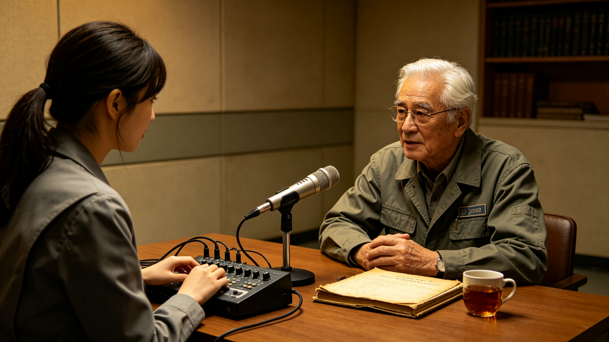

# 第八章　责任的形状

访谈全部结束之后，调查组在第二研究室的会议室里关了整整一个下午。

那是2982年11月下旬的一个周五。比邻星b的天空是那种熟悉的浑浊橘黄，午后照例起了尘暴，窗玻璃上蒙着一层薄薄的氧化铁红，连窗外那座行政中心钟楼的轮廓都模糊了。暖气开得有点足，陆知微进门的时候把外套搭在椅背上，露出里面那件洗得发白的旧工程总局工装——他直到现在还穿着，领口处绣着一个已经模糊的徽标。

桌上摊着四份访谈记录的打印件、一份QRS-03站的值班日志复印件，还有林以宁整理出来的一张责任归属草稿。沈观澜先开口。

"我们查了一个多月，"他说，"现在要回答的，不再是'发生了什么'，而是另一类问题——如果一定要有人为这72小时负责，是谁。这个问题不写清楚，这份报告就立不住。"

他把那张草稿推到桌子中央。

"知微，你先讲。"

---

陆知微几乎没有犹豫。

"我的意见很明确，"他把笔往桌上一放，"主要责任在两家。第一家，星枢量子通信运营集团。第二家，跨恒星系通信工程总局。"

他伸出一根手指。

"星枢集团的问题，陈默已经说得很清楚了。3月12日08:30，红色预警发布后不到一个半小时，QRS-03站的值班工程师就提出了把链路切到低带宽应急模式、加固探测器屏蔽。总部怎么答复的？'CME路径尚未确认，暂不切换，避免触发SLA降级记录'。各位，这不是技术判断，这是绩效判断。56个小时，他们明明有时间、有手段、有窗口，却因为一个可用率考核指标，选择什么都不做。"

他伸出第二根手指。

"工程总局的问题更根本。据GS-2910-01《跨恒星系量子纠缠通信中继站部署技术报告》，七座中继站从设计之初就没有给光子探测器配足够的辐射屏蔽，也没有设计经典校准信道与量子信道之间的隔离冗余。1064纳米那条经典信道——就是传输贝尔测量结果和控制指令的那条——在设计上根本没有考虑它自己也会被高能粒子瘫痪。这是画图的时候就画错了，不是后来才弄坏的。"

陆知微说完，靠回椅背，等着别人反驳。他知道沈观澜不会同意。

果然。

"我同意事实，"沈观澜慢慢地说，"但我不同意结论。"

他起身走到墙边那幅三恒星系航线图前，背对着大家。

"知微，你在工程总局待过三年，你比我清楚一件事：星枢集团的SLA考核制度不是星枢自己拍脑袋定的，工程总局的设计标准也不是哪一个总工晚上失眠想出来的。这些都是制度。一家商业公司按99.7%的可用率考核，是这个文明允许它这样运营的；一座中继站按'上一次同等级事件'做设计基准，也是这个文明允许它这样设计的。把账算到这两家头上，当然没错——它们确实做了错事。但如果我们的报告写到'星枢集团和工程总局负主要责任'就停笔，那我们只是在换一批人来背三十四年的旧账。"

"那您的意思是，"陆知微的语气带着一点被激怒的克制，"谁都不负责？"

"不是谁都不负责。"沈观澜转过身，"是责任的形状，不是一个点，也不是两个点。它是一片。"

---

林以宁一直没说话。这时她推了推眼镜，把笔记本电脑转过来，屏幕上是她整理的一张时间线。

"我补充一个档案学上的事实。"她说，"我们在已解密的应急响应值班日志里看到，3月12日05:00航行安全管理局启动一级响应，通知所有在航飞船防护。从那一刻起，'是否切换跨星系通信链路'这个动作，就进入了应急指挥的权责范围。但一级响应预案里，从头到尾没有任何一条说：红色预警发布后多少小时内，必须由谁、把跨星系主链路切换到备份状态。"

她顿了顿。

"飞船有预案——关闭非必要设备、增加屏蔽、船员进强化屏蔽舱，这些都写得清清楚楚。通信基础设施没有预案。也就是说，那56个小时里，全系统只有一个环节是'没有人被授权去做'的，偏偏就是最关键的那一个。这不是星枢集团一家的保守，是整个一级响应程序本身漏了这一格。"

"而且，"她接着说，"星枢集团是商业运营机构，切换备份要它自己担SLA降级的绩效损失。在没有上级强制程序的情况下，它为什么要主动去担这个损失？这是激励结构的问题，不是道德问题。"

周予安一直在飞快地记。她抬起头："那预警中心呢？赵北辰那边，预警是3分钟就发了的。"

"预警中心不承担主要责任。"沈观澜说，"这一点我们四个是一致的。据GS-2948-01和赵北辰的口述，耀斑爆发后3分钟红色预警就发出来了，05:00一级响应随即启动，飞船防护全部到位。预警是及时的，这是公报里少数没有水分的结论。在航飞船也不承担主要责任——12艘船防护得当，没有人员伤亡，舱内剂量都在安全限值以内。"

他停了一下。

"唯一要记一笔的，是远航者-7号备用有线通信的那45分钟。苏映雪已经跟我们说了，标准操作是10分钟，负责切换的年轻船员花了45分钟才恢复。这是培训执行的问题，不是制度设计的问题，更不是灾难本身。我建议在报告里如实记下，但归为'船员培训执行瑕疵'，不归为'事故主要责任'。苏映雪本人现在是远航者公司的培训总监，这些年她一直在改这件事，我们去访谈的时候，她办公桌上那摞演练记录比我们的访谈提纲还厚。"

---

会议室里安静了一会儿。窗外的尘暴把天色压得更暗了，有人伸手开了灯。

沈观澜回到桌边坐下，拿起一支笔，在草稿纸的空白处画了一个向下的箭头链。

"我这一个月，一直在想一个问题。"他说，"我们一层层往下追，追到最后到底能追到哪。"

他在第一个箭头旁写下："链路为什么中断？"

"答案我们已经查清楚了。据GS-2910-01的技术报告和陆知微的辨析，是中继站的SNSPD探测器和那条1064纳米的经典校准信道，被高能粒子云同时瘫痪了。纠缠态本身未必坏了，坏的是告诉接收方怎么解码的那条线，和负责接收的那只眼睛。"

他写下第二个箭头："为什么没有防护？"

"因为设计标准不足。光子探测器没有足够的辐射屏蔽罩，经典信道没有冗余，也没有低带宽应急模式。这一点，2954年鲸鱼座τ星建'恒星之盾'的时候，给中继站光子探测器补上了辐射屏蔽罩、设计了低带宽应急通信模式——据GS-2954-01，那套东西本来就该在2910年的设计里。"

第三个箭头："为什么标准不足？"

"因为设计时对极端太阳风暴的辐射强度估计不足。"沈观澜的笔尖在纸上点了点，"工程总局画图的时候，心里参照的'最严重事件'，是2877年的那场太阳超级风暴。GS-2948-01里那句'这是自2877年以来最严重的一次'，说的就是这件事。"

第四个箭头："为什么估计不足？"

"因为2877年的那场风暴，我们连一份专档都找不到。"林以宁接了上去，"我们翻遍了正典，没有任何2877年事件的独立档案。它在哪片天空爆发、抛了多少物质、磁层被压到多少地球半径、质子通量到多少——全都没有。2910年的工程师画设计图时，手里攥着的'历史最严重事件'，是一个没有数据的名字。你没法按一个不存在的参数去做设计。"

第五个箭头："为什么不更新这个基准？"

沈观澜放下笔，抬起头。

"因为从来没有任何一条制度，要求跨星系通信基础设施定期复核它的设计基准期。"他说，"飞船有强制检查，据后来的GS-2986-01，每艘船每年都要验舱内剂量率、验避难所密封、验通信终端状态。但七座量子中继站呢？它们2910年建成，设计时参照2877年，到2948年已经运行了三十八年，中间没有任何一个法定节点，要求有人坐下来重新问一句：太阳是不是又变了？我们的防护是不是还够？"

他看着桌上那一串箭头。

"所以根因不是某一家机构的懒惰，也不是某一个工程师的失误。根因是一个制度上的空位——跨星系通信这套文明级的基础设施，从它诞生那天起，就没有一个'设计基准期定期复核'的强制程序。大家默认它建好就是永久的。可太阳不跟你签永久合同。"

---

陆知微沉默了很久。最后他点了点头，但只点到一半。

"我接受这个根因判断。"他说，"但我要补一句——根因是制度空位，不等于那些在空位上做了具体决定的人就可以一笔勾销。陈默08:30的申请，总部08:47那句'暂不切换'，是真实写在值班日志里的。我们可以不把星枢集团写成唯一的罪人，但我们必须把'56小时未切换'这件事，白纸黑字地记在星枢集团的运营责任里。这是两回事。"

"当然。"沈观澜说，"这正是责任的形状——它分层。"

他在草稿纸上写下三行字。

"第一层，主要运营责任：星枢量子通信运营集团。理由有三——56小时预警窗口内未主动切换备份信道；SLA可用率考核制度在客观上抑制了主动防护的激励；中继站探测器屏蔽的现场执行不足。这一条，陈默的值班日志和总部的回函都在，赖不掉。"

"第二层，设计标准责任：跨恒星系通信工程总局。中继站设计对极端风暴辐射强度估计不足；经典校准信道与量子信道的耦合风险——也就是'告诉接收方怎么解码'的那条线也会被一起打断——没有在设计阶段被识别。这一条，GS-2910-01的技术参数白纸黑字。"

"第三层，制度程序责任：跨恒星系航行安全管理局。一级响应预案没有包含通信链路切换的强制程序；中断期间三地无法协调、各自为战——公报自己都承认了这是'问题三'。预警是它发的，一级响应是它启动的，但它手里那份程序，漏了通信基础设施这一格。"

他放下笔。

"三层责任，一家机构一层，谁也别想独善其身，谁也不必替别的机构背锅。至于预警中心、12艘在航飞船、船员——不承担主要责任。预警及时，防护到位，唯一要记下的是远航者-7号那次45分钟的培训瑕疵，那是执行问题，不是责任事故。"

---

这个"三层"的分法，并不是一次就定下来的。

就在沈观澜写下这三行字之前，陆知微还抛出过另一个问题。他把林以宁从正典文献核验中心调来的、王量子2965年口述转录稿推到桌子中央。王量子是2948年时通信工程总局的总工程师，那一年九十二岁，住在地球的深度护理机构里，没能接受新访谈。他二十多年前的那段口述，成了调查组能拿到的、技术决策核心人物唯一的第一手声音。

"王量子在2965年是怎么说的，你们还记得吗。"陆知微翻到转录稿的一页，"'中继站探测器的屏蔽，按当时的工况清单，是够用的。我们没有预见到X9.2级会把1064纳米那条经典信道一起打断——这是我们的疏忽。但要说我们故意把网建成这样，那是冤枉。'"

他抬头看着沈观澜。

"一个总工，在退休十五年之后，亲口承认了'疏忽'。按工程界的规矩，这几乎等于认罪。您为什么还坚持把他放在'次要'，而不是'主要'？"

沈观澜没有立刻回答。他走到窗边，背对着大家站了一会儿。

"因为王量子说的是'疏忽'，不是'渎职'。"他终于开口，"各位，我们是历史研究所，不是法庭。法庭要的是'谁有罪'，历史要的是'为什么会这样'。王量子那一代人画设计图的时候，参考的是2877年——一个没有数据的事件。他们不是不知道太阳会发脾气，他们是不知道太阳这次发的脾气有多大。把一个'没人知道边界在哪里'的疏忽，钉成某一个人的罪过，那我们就是在替三十四年后的自己，重复当年公报替当时的自己做过的那件事——找一个具体的人，把抽象的问题盖起来。"

"那贺远征呢？"周予安轻声问。她指的是远航者-7号那位船长。贺远征2975年已经去世，调查组只能读到他2960年的存档口述。"他那一夜下的命令——启动自主航行、派人手动巡检冬眠舱——事后看有没有问题？"

"没有。"沈观澜回答得很干脆，"按GS-2820-01的规程，飞船连续720个标准日收不到校时脉冲，才降级到脉冲星自主导航。72小时，远没到那个线。贺远征在半失联状态下，既没有慌到乱改航线，也没有傻等到地球回电才动作。他做的是任何一个合格船长都会做的事。那45分钟是船员培训的执行问题，不是船长的决策问题。我建议，在报告里给贺远征一句公道话——他在黑暗里把2103个冬眠乘客，安安稳稳地送过了那一夜。"

林以宁一直低头在电脑上记。这时她抬起头，补了最后一个层次上的意见。

"还有一类人，我们一直在绕着走。"她说，"2103名冬眠乘客。公报说'无人员伤亡'，这句话字面上成立——他们确实没有死在那72小时里。但他们是这场事件里，唯一全程没有任何发言权、没有任何行动能力、连'焦虑'都算不上的群体。他们的生命体征数据，整整一夜传不出冬眠舱。从责任的角度，他们不需要'被追责'；但从记录的角度，我们不能因为公报写了'无人员伤亡'，就把他们从这份报告里漏掉。"

沈观澜点头。他在三行字下面，又加了一行，写得很慢：

"记一笔的，还有那些冬眠舱里的人——他们是事件的沉默多数。责任不在他们，但他们经历过。"

---

会议快结束的时候，周予安翻出了一份她一直压着的文件。

"沈老师，我一直在想一个参照。"她说，"2983年，鲸鱼座τ星也吃了一次同等级的亏。据GS-2983-01《鲸鱼座τ星恒星耀斑爆发导致地表设施损坏事件公报》，那年8月27日，鲸鱼座τ星爆发X9.2级耀斑，和我们这次太阳事件同一个强度等级，CME只要6.2小时就抵达了。调查委员会最后认定的主要原因之一是什么？——部分地表设施的电磁屏蔽标准还停留在二十年前的M3级水平，没有按2975年修订的X5级标准升级。"

她抬起头。

"又是同一个故事。设计基准定了之后，没有人强制更新，二十年过去，太阳又发了一次脾气，设施又被打穿一次。2948年是这样，2983年还是这样。"

会议室里没有人说话。

"所以，"沈观澜缓缓地说，"我们这份报告的责任部分，真正要对后世说的话，不是'星枢集团错了'或者'工程总局错了'。而是：一个把文明命脉交出去的系统，必须有人定期、强制、不可豁免地回去检查它的心脏还够不够硬。这件事，2948年没有制度安排。"

他顿了顿。

"我们知道它后来补上了。"

据GS-2986-01《星际航行安全标准修订与船舶强制检查制度公报》，到2986年2月28日，三恒星系的星际航行安全标准完成了一次大修。那时在册航线17条、在役飞船342艘，其中客船78艘、货船214艘、工程船50艘。新的强制检查清单里，明明白白写进了三样东西——量子通信终端的实时状态、中微子通信备份链路的可用性、应急信标的有效性。舱内剂量率被钉死在每天0.5毫西弗以内，太阳风暴应急避难所的密封成了每船必查的强制项。

从2948年3月那个没有任何程序规定"要不要切换通信链路"的一级响应，到2986年这份把"中微子备份链路"写进年检清单的强制标准，中间隔了三十八年。

"三十八年。"陆知微低声重复了一遍，"从一次72小时的中断，到一个'中微子备份必须年年验'的制度，三十八年。"

"这就是我们接下来要讲的事。"沈观澜说。

他看了一眼墙上的航线图，又看了一眼桌上那摞访谈记录。窗外的尘暴渐渐小了，橘红色的天光从玻璃后面透进来，落在那张责任归属草稿上。

三层责任已经写清楚了。但他知道，把责任写清楚，只是这份报告的前半段。后半段要回答的是另一个问题——

这72个小时，到底把后来的三十四年，改成了什么样子。

---

# 第九章　从72小时到中微子——三十四年的回响

访谈结束、责任认定落定之后，沈观澜把自己关在档案室里，用了整整一周做一件事：把2948年事件之后，凡是正典里能找到的、与这72小时有关的制度文本，按时间顺序排在一张长桌上。

那是11月底的事。新安市的天气一天比一天冷，比邻星的光在正午时分才勉强透出一点灰蓝。档案室的暖气时好时坏，沈观澜裹着一件旧毛衣，在桌边来回走。长桌上从左到右，按年份排着三十多年的制度——公约、防护工程、交易市场、安全标准、船队事件、中微子链路、宪章、施政纲领。他把每一份都翻开，在每一份旁边放一张卡片，写两行字：这份制度，回应的是2948年那72小时里的哪一个具体的痛。

周予安给他送了两次茶。她第二次进来的时候，看见沈观澜正站在长桌尽头，盯着那排档案出神。

"沈老师，您这是在排家谱呢。"她说。

"差不多。"沈观澜没回头，"这72小时，是一个家族的祖先。我们来看看它的后代。"

---

第一个后代，出现在事件之后五年。

据GS-2953-01《三恒星系通信时差仲裁与法律时效制度建立公报》，2953年4月15日，三恒星系法律协调委员会和跨恒星系司法协作中心共同颁布了《跨恒星系通信时差仲裁与法律时效公约》。这份公约里有一条，沈观澜用红笔在旁边画了圈：

"跨星系通信链路因技术故障或空间天气事件中断，导致法律文书无法传递的，中断期间法律时效暂停。"

他在卡片上写下：**回应之痛——72小时里，所有跨星系的法律时钟都在没人按停的情况下继续走表。**

这件事的来龙去脉，调查组在第五章已经查过。2948年3月14日到17日，量子链路断了，激光链路断了，所有依赖实时通信的合同履约、法律文书送达、证据保全，都在物理上不可能完成。但当时没有任何一条法律说"这种情况不算你违约"。时钟还在走，期限还在跑，一个比邻星b的商人，可能因为一场他根本无力阻止的太阳风暴，错过自己的诉讼时效。

公约还配套了一整套东西：USCT统一时的确立、通信时间扣除规则、最长保护期延长至三倍。据林以宁查到的后续数据，到2952年，因通信时差引发的跨星系法律纠纷已经堆到每年八万七千件，占全部跨星系法律事务的三分之一。2948年那一次集中的72小时，把这个问题从"零星麻烦"逼成了"必须立法"。

"这就是制度怎么长出来的。"沈观澜对周予安说，"它不是坐在会议室里想出来的，是被疼出来的。"

---

第二个后代，来得更直接。

据GS-2954-01《鲸鱼座τ星恒星耀斑预警与防护系统建成公报》，2954年8月22日，鲸鱼座τ星定居点的"恒星之盾"系统正式建成。沈观澜翻到公报里那张系统构成表，用手指点着念：12颗L1监测卫星、8个行星际探测器、32个地表台站——整套系统对X10级以上超级耀斑的预警提前量，平均48小时。

48小时。2948年那次，预警只给了56小时，但那56小时被白白浪费了。恒星之盾要解决的，正是"预警有了、动作没有"的另一半。

公报里有两段话，是沈观澜这一周里反复读的。一段是：量子通信中继站的光子探测器，正式配备了辐射屏蔽罩，"在高能粒子轰击下仍能维持基本功能"。另一段是：建立了"低带宽应急通信模式"，在通信质量严重下降时，通过降低带宽、增加纠错冗余来维持关键信息传输。

他在卡片上写下：**回应之痛——光子探测器没有屏蔽、主链路一断就全瞎。**

这两样东西，恰恰就是2948年QRS-03站缺的那两样。陈默当年在值班日志里写过——他申请把链路切到低带宽应急模式，总部没批。五年之后，这个模式在鲸鱼座τ星成了标准配置；当年那个没被批准的请求，以制度的形式被追认了。

沈观澜在这张卡片的边上，轻轻写了一行小字："陈默想要的东西，五年后才造出来。他当年没有错，只是来得太早。"

---

第三个后代，是2957年3月18日的"数算市场"。

据GS-2957-01《跨恒星系数据贸易与算力资源交易市场启动公报》，这个市场在比邻星b新安市挂牌，首日成交127亿星元。表面上看，它和2948年的太阳风暴没什么关系——它是个算力和数据的交易市场。但沈观澜翻到公报第三节，看到了那句关键的话：

各节点之间通过量子纠缠通信链路定期对账，对账周期为一个通信往返周期——地球到比邻星b约8.4年，地球到鲸鱼座τ星约23.8年。

他停下来，把这句话读了两遍。

8.4年。也就是说，跨星系的账务，不是天天对的，是八年多对一次。量子链路一旦中断，所有跨节点的交易就进入"挂账"状态，账对不上，钱算不清。2948年那72小时，方其庸在交易大厅里眼睁睁看着清算系统停摆，87亿星元的损失就这样挂在账上——那时候没有"中断期间怎么对账"的规矩。

数算市场的架构，是"分布式存储+本地结算+量子通信定期对账"。它的设计前提写得很明白：通信不是永远可靠的，交易系统必须在通信断的时候照样本地跑，通信恢复了再把账对一遍。

沈观澜在卡片上写下：**回应之痛——72小时清算停摆、87亿星元挂账。**

"这就是工程化的教训。"他对陆知微说，"一次72小时的停摆，九年之后变成了一整套'通信会断、我先自己扛着'的交易架构。"

---

长桌上还有几份档案，乍一看和通信中断没什么关系，但沈观澜把它们也摆了进来。

据GS-2955-01《鲸鱼座τ星大规模流星雨撞击防护行动公报》，2955年5月，那个恒星的定居点提前36天发现了TC-2955-04流星群，用动能拦截、激光偏转、轨道拦截网和地表加固四层手段，把地表12,800人撤回地下——通信系统则在威胁逼近时，整个切到了地下光纤有线模式。沈观澜在卡片上写：**回应之痛——天上一旦有东西过来，无线电和激光都靠不住，得有线、得地下。**

据GS-2959-01《鲸鱼座τ星应急避难所体系建成公报》，四年之后，那颗恒星又建起了三级避难所体系——72小时、14天、90天三档自持，应急通信里明明白白写着地下光纤、甚低频穿岩无线、国家级避难所之间的量子备份链路。2959年那场"岩盾-2959"全民演练，模拟的是X30级耀斑叠加7.8级地震，3.2亿人参与。沈观澜在卡片上写：**回应之痛——中断期三地各自为战。办法就是在地下预先把线埋好、把人练好。**

再到2962年。据GS-2962-01《比邻星b轨道电梯第三期工程竣工公报》，轨道电梯的控制系统升级成了量子加密分布式架构，响应延迟从200毫秒压到15毫秒，冗余度99.997%。这是一次基础设施加固，但沈观澜注意到它的思路——关键系统不再依赖单一链路，而是分布式、可自洽。和数算市场的"本地结算"、和避难所的"地下备份"，是同一种哲学。

"你们发现没有，"他把周予安和陆知微叫到长桌前，"从2953到2962，这十年间冒出来的所有东西——公约、恒星之盾、数算市场、流星雨防护、避难所、轨道电梯——它们骨子里是同一个反应：一个吃过通信中断苦头的文明，开始在每一个关键系统旁边，偷偷再修一条线。"

他指了指卡片上那行"通信会断、我先自己扛着"。

"72小时教会它的，不是'下次预警发快一点'。是'万一预警没用，我得有B计划'。"

---

时间一下子跳到了二十多年后。

据GS-2986-01，2986年2月28日，星际航行安全标准完成大修。这一条沈观澜在第八章已经写过——量子通信终端状态、中微子备份链路、应急信标有效性，第一次写进了每船必查的强制清单。这是2948年教训在三十八年之后，最终落进年检制度的样子。

再往后，2990年10月12日。

据GS-2990-01《跨恒星系货运船队遭遇星际尘埃云减速事件公报》，"金牛编队"六艘货船在航道上撞上了一片未标注的星际尘埃云。尘埃对量子通信信号造成散射衰减，编队与两端港口的带宽从正常的100兆比特每秒，一路掉到大约2兆比特每秒。六艘船怎么办？——编队启用了中微子通信链路作为补充，关键指令照样传了下去。

沈观澜在长桌前站了很久。

他想起2948年，12艘飞船在量子链路断掉之后，只能靠带宽"数比特每秒"的无线电勉强撑着，远航者-7号的苏映雪在通信舱里熬了45分钟才把备用有线通信接上。而42年之后，一支货运编队遇到通信被衰减的事，第一反应是打开中微子备份——就像今天的人随手打开备用电源一样自然。

他在卡片上写下：**回应之痛——主链路一断就只能数比特每秒。42年后，飞船默认带着中微子备份出门。**

"注意一个时间差。"他提醒周予安，"GS-2990-01说编队已经启用了中微子备份，但跨星系中微子链路的首次贯通，据GS-2997-01，要到2996年12月1日才完成。2990年船队用的，是行星际的短距离中微子链路；跨11.9光年那种真正的中微子骨干，又等了六年。这不是档案打架，是中微子通信本来就是一段一段长起来的。"

---

长桌上还放着一份让沈观澜心情复杂的档案，是2983年的旧伤。

据GS-2983-01，那年8月27日，鲸鱼座τ星又爆发了一次X9.2级耀斑——和1948年前太阳那次，整整同一个强度等级。CME只用6.2小时就打到了头顶，直接损失约2.4亿信用点，37人剂量超标、3人住院、无人死亡。调查委员会最后认定的主因之一，写得几乎和三十年前一字不差：部分地表设施的电磁屏蔽标准还停留在二十年前的M3级水平，没有按2975年修订的X5级标准升级。

沈观澜在这张卡片上写：**同一种病，四十年后又发作了一次。**

他把这张卡片单独挪到长桌的边缘，像是要和别的东西隔开。

"这说明什么？"他自问自答，"说明光靠'事后总结五条改进'是不够的。标准定了，没有人强制年年升级，二十年后设施还是旧的。真正把这个毛病治住的，不是又一次总结，而是2986年那份把'验量子终端、验中微子备份、验应急信标'写进年检的强制制度。"

而到2989年，那颗恒星干脆动了行星级的手术。据GS-2989-01，鲸鱼座τ星启动了行星磁场增强工程——12个轨道超导磁环，每个重8200吨、通电1200万安培，要把行星表面磁场从6微特斯拉抬到45微特斯拉，总投资4800亿信用点、工期25年。这份工程的动因，写得明明白白：就是2983年那场X9.2。沈观澜看着"工期25年"这几个字，想起中微子链路的49年。一个文明对抗恒星的脾气，花的都是这种以十年、以百年计的账。

---

那是整条长桌上，离2948年最远、也最重的一份。

据GS-2997-01《跨恒星系中微子通信链路首次贯通测试公报》，2996年12月1日，跨恒星系中微子通信链路首次贯通。比邻星b轨道上，一座8公里长的加速器环把质子加速到1.2TeV、平均束流5兆瓦，产生μ中微子束；鲸鱼座τ星地下1500米处，一座50万立方米的水切伦科夫探测器里，约2万个光电倍增管等待着那些穿透了整颗行星、几乎不带衰减抵达的中微子。调制方式是QAM-256，有效速率大约120兆比特每秒。

公报里有一句话，沈观澜读了之后沉默了很久：确认信号从比邻星b抵达鲸鱼座τ星，需要11.9年。

他翻出GS-2948-01的改进措施清单，指着其中第二条——公报当年写着："开发中微子通信备用链路，作为极端空间天气事件下的保底通信手段。中微子通信不受太阳风暴影响，但带宽较低，可用于传输关键指令和安全状态信息。"

从2948年5月18日写下这一条改进措施，到2996年12月1日中微子信号真正第一次穿过11.9光年的虚空，中间隔了49年。

49年。一个当年写下这条改进措施的年轻工程师，到2996年已经是白发老人。中微子从"不受太阳风暴影响"这一句写在纸上的物理事实，变成一条真正能传120兆比特每秒的链路，花掉了将近半个世纪。

沈观澜在卡片上写下：**回应之痛——太阳一发飙，电磁通信全断。49年后，文明终于有了一条太阳打不断的线。**

他想起陈默。那个当年在QRS-03站的值班工程师，退休后住在地球轨道的天关门户站。他在2982年那次口述访谈里，翻来覆去讲的都是56个小时、那句"暂不切换"。沈观澜想，如果陈默知道，他当年没能切换成功的那条备份，要等到他退休四十多年之后，才以中微子的形式真正打通——不知道他会作何感想。

---

*图10：2982年11月，第二研究室口述史访谈现场。周予安负责操作录音与笔录，受访者为星枢量子通信运营集团QRS-03站退休值班工程师陈默（68岁）。桌上摊开的，是陈默保存了三十四年的值班日志复印件——其中夹着3月12日08:30那条切换申请与08:47总部回函的记录。本照片由调查组内部拍摄，作为HR-001重审项目口述史档案的一部分。*

---

长桌的最右端，放着最后两份制度。

据GS-2999-01《三恒星系文明联合体宪章签署暨最高议事规则确立公报》，2999年12月1日，三恒星系文明联合体正式成立。那时三颗恒星的殖民地总人口48亿。宪章里确立了两样东西：一是"异步议事"程序——因为星系间通信天然有延迟，议事不能要求大家同时在场；二是紧急状态条款。宪章在回溯一体化历程时，点名了2990年的尘埃云事件和2994年的联合反恐作为推动一体化的危机先例。

2948年的72小时没有被点名。

但沈观澜知道它在不在。公报自己承认过，那72小时里三地"各自为战"，是整个事件最致命的组织缺陷之一。五十多年之后，那个缺陷终于有了制度性的终局答案——不是一个协调委员会，而是一个真正把三颗恒星装进同一部宪章里的政治实体。异步议事程序的存在本身，就是在回答2948年那个问题：通信一断，三个世界连"一起应对"都做不到。

最后一份，是GS-3000-03。3000年7月1日，联合体首任秘书长韩星河——2935年生人，2948年事件发生时他才十三岁——发布施政纲领，定下一件事：3005年之前，三恒星系通信骨干网实现量子与中微子全覆盖，带宽提升十倍。

沈观澜把这张卡片放在长桌正中间。

他退后半步，看着从2953到3000、整整四十七年的制度，在一张长桌上排开。公约、防护盾、交易市场、年检标准、船队实战、中微子首通、宪章、施政纲领——一个72小时的伤口，长出了这么多东西。

"我们写这份报告，写到最后，写的已经不是一次事故了。"他轻声说，像是在对自己讲，也像是在对桌上那排档案讲。

"我们写的是，一个文明怎么学会在恒星的脾气面前活下去。"

---

那天晚上，沈观澜在收档之前，又把那张长桌从头到尾走了一遍。

2953年的公约，2954年的恒星之盾，2955年的流星雨，2957年的数算市场，2959年的避难所，2962年的轨道电梯，2986年的年检清单，2990年的金牛编队，2996年那道穿过11.9光年的中微子，2999年的宪章，3000年的施政纲领。四十七年，十二份制度，每一份的边角上都沾着2948年那72小时的灰。

他忽然明白，为什么老一代人把这72小时叫作"通信史的成人礼"。一个文明第一次发现，它赖以呼吸的那条线，其实是可以被一颗恒星一把掐断的。从那以后，它做的每一件事——埋地下光纤、建备份链路、写强制年检、签跨星宪章——都是在回答同一个问题：下次它再掐的时候，我们还能不能活下去。

陈默当年没能切成功的那个备份，最后花了半个世纪，变成了一条太阳打不断的中微子。

赵北辰那三分钟里争来的红色预警，最后变成了一整套提前48小时的恒星之盾。

苏映雪那45分钟的窘迫，最后变成了每船必验的中微子备份和应急信标。

方其庸那87亿挂账，最后变成了"通信会断、我先自己扛着"的数算市场。

林晚晴那72小时的等待，最后变成了一条"通信中断期间时效暂停"的法律。

一个人受过的苦，不会凭空消失。它只是换了一种形状，在后来的制度里，慢慢长大。

---

# 结语　档案室的灯还亮着

报告写完的那天晚上，比邻星b下了一场罕见的真雨。

大气改造工程进入第三十三年，高层大气里的氧化铁尘埃第一次被凝结的水汽压了下去，新安市的夜空在午夜时分透出了一种许久未见的、干净的深黑。沈观澜在档案室里坐到很晚。长桌上那排按年份排开的制度已经收进了档案盒，桌上只剩他自己的手稿，和一杯早就凉透的茶。

他在结语的空白处停了很久，最后写下了报告的最终判断。

"2948年3月12日的X9.2级耀斑，是一次自然事件。但它造成的72小时通信中断，不是一次自然事件。预警及时、飞船防护得当、无人员伤亡——这些都是事实。同样是事实的是：在56个小时的窗口里，没有一套制度授权任何人去切换那条要命的备份；三个殖民地在黑暗中各自为战；2103名冬眠乘客的每15分钟生命体征数据，有整整一夜传不出冬眠舱；一个文明赖以呼吸的跨星系清算系统，因为一条链路断开，停摆了72小时，挂出去87亿星元。"

"我们这份报告的全部工作，就是把这些事实，从一份三十四岁的公报里，重新找回来。"

他写完，把笔放下。

写这份报告的这一个月里，沈观澜偶尔会在深夜的档案室里停下来，问自己一个问题：三十四年后，我们这些人，到底比孙志刚那一代人高明在哪里？

想清楚之后，他在稿纸边上写了一行小字："我们并不比他们高明。他们在72小时里做的每一件事——预警、响应、防护、善后——以当时的条件看，都做对了。我们今天能说他们'漏了一格'，只是因为我们站在三十四年的肩膀上，看见了他们当时看不见的东西。"

这也是他坚持不在报告里把任何人写成"罪人"的原因。把一个在信息不全的年代做出了当时最优选择的人，用三十四年后的知识去定罪，那不是调查，是算账。他要写的，是一份历史，不是一份判决书。历史要回答的是"我们从哪里来"，而不是"当初谁该挨罚"。

---

事件三十四周年的纪念活动，是2982年3月12日那天举行的，比调查组解密早了八个月——那时候沈观澜还没收到那个档案转运箱。活动在新安市的航运纪念堂，不大的厅，坐了一百多人。苏映雪作为幸存者代表发了言。

她那时已经五十九岁，是远航者星际航运的培训总监。她在台上没有讲什么豪言壮语，只是把2948年3月15日凌晨2点40分那45分钟，又讲了一遍。她说她后来一辈子都在教船员一件事：备用有线通信，必须在10分钟内接上，因为你永远不知道，下一次黑暗来的时候，船上有多少人正把命交在你手里。

她讲完的时候，台下有人鼓了很久的掌。

那天来的人不多，但来的人，都是还活在那72小时里的人。有当年预警中心的退休同事，有远航者公司现在的年轻船员——他们中的大多数，2948年还没出生，是被长辈讲大的。苏映雪下台的时候，一个年轻船员过来问她："苏总监，要是现在再来一次，我们还会断72小时吗？"

苏映雪想了想，说："主链路也许还会断。但现在每艘船都带着中微子备份，每年验一次，验不过不许出港。我们不会再在黑暗里等45分钟了。"

这句话，沈观澜后来几乎原样写进了报告。三十四年前他们没有B计划，三十四年后B计划成了出厂标配。这中间的距离，就是这份报告真正想说的事。

---

林晚晴那天没有上台。她是比邻星b新安市的一名教师，四十七岁。纪念活动结束后，她一个人去了城外的墓园。

她的父亲林建国，2948年事件发生时，正躺在远航者-7号的冬眠舱里。72小时的信息真空，对他女儿来说是72小时的煎熬；对他本人来说，是冬眠舱里一段无人上传的监护数据。据GS-2947-01，冬眠乘客的生命体征每15分钟自动监测一次，数据实时传回飞船医疗中心——但中断的那一夜，这些数据出不了飞船，更到不了地球。他在舱里安安静静地睡着，女儿在地面上一夜一夜地睡不着。

林建国是2950年代才被唤醒的。唤醒之后，冬眠相关的并发症找上了他——据GS-2947-01那十年的统计，冬眠相关死亡率是万分之一点二，这是死的人；没死的人里，长期健康受损的数字，从来没有被正正式式统计过。他活了下来，但身体一直不好。2970年，他去世了。

当年那份公报里写着"无人员伤亡"。那是一句真话，也是一句不完整的真话。林建国没有死在2948年3月的那72小时里，但他的后半生，是被那72小时改了又改的。这样的人，在公报的数字里，一个都不存在。

林晚晴在父亲的墓前放了一束花。那是新安市本地培育的、人工色素调出来的橘红色花朵——和天空的颜色很像。她没有说太多话。三十四年前那个在女儿怀里哭着问"我爸爸到底还活着没有"的女人，如今也是个眼角有了皱纹的中年人了。

调查组访谈她那天，她把父亲的冬眠舱位号都记得清清楚楚。她说那72小时里，她每天去管理局的公告栏前站两次，公告栏上永远只有一句"在航飞船防护有效，暂无人员伤亡"。"暂无"两个字，她盯了三天——"暂无"不是"没事"，"暂无"是"还不知道"。她说她一辈子都忘不掉那种感觉：整个世界都在告诉你一切正常，可你知道，正常的那个世界里，唯独缺了你爸爸的消息。

她后来当了教师。她说她教学生写历史，从来不教他们背年代。她只教一件事：任何一份写着"无人员伤亡"的报告背后，都可能站着一个你看不见的人——他也许没死在那72小时里，但他的一生，被那72小时悄悄改过了。

林晚晴说这些话的时候，周予安在笔录上停了很久。她后来把这段访谈原样放进了报告，一个字都没有删。

---

档案室的灯，沈观澜最后关了一次。

他走到门口，回头看了一眼。那排深灰色的档案柜在昏黄的灯光下静静地立着，柜顶的标签上写着"2948年度·一级响应档案·解密批次2982-07"。窗外，比邻星b的夜空难得地干净，远处行政中心的钟楼亮着一盏小小的白灯。

他想起自己写在这份报告最后一句的话。那是他整个写作过程里，改了最多遍的一句。

> 72小时在宇宙尺度上不过一瞬，但对那些在黑暗中等待消息的人来说，它比一生还长。

他关上门。灯还亮着——在三十四年的解密期、在无数个后来者的阅读里，那盏灯不会灭。

---

# 附录A　组织档案

> 本附录为HR-001系列报告的公共组织设定基础。下列七个机构按2948年事件时点的职能与文化建档，其中星枢量子通信运营集团、远航者星际航运股份有限公司、跨星系联合清算银行为本报告首次在正典中具名的运营实体。档案供后续同系列报告统一引用。

## A-1　三恒星系文明联合体历史研究所

**成立背景**。2960年，由三恒星系联合安全理事会下属文化遗产委员会倡议成立，2965年正式建制。其前身是比邻星b的"文明记忆工程"项目组——那个项目最初只是想把跨星系移民潮中正在散失的口述史和地方档案抢救下来，后来规模越做越大，最终独立成所。据GS-2999-01，2999年联合体宪章签署后，历史研究所转为联合体直属研究机构。

**职能**。三恒星系范围内的历史档案整理、重大事件调查、口述史采集、正典文献学研究。

**组织结构**。设五个研究室：第一研究室（太阳系本土史）、第二研究室（跨恒星系制度与通信史，即本报告的发起单位）、第三研究室（星际航行与移民史）、第四研究室（科技与工程史）、第五研究室（社会文化史）。另设正典文献核验中心与口述史档案馆。

**文化与办事风格**。学术严谨，但行动受解密期制度约束极大——按规定，重大公共安全事件的内部档案解密期为三十四年，这意味着研究者与研究对象之间天然隔着一代人。研究员多为跨学科背景，重视"档案缺口"本身的史料价值：一份档案为什么没有留下，往往和它留下了什么同样重要。所内有一句半开玩笑的行话："我们不研究发生过什么，我们研究为什么它过了三十四年才肯被说出来。"

所内人手一向紧张。第二研究室长期维持在十来个编制，跨星系通信制度这样的题目，常常一个研究员要同时跟着三四个项目走。正典文献核验中心是全所最忙的部门——每一篇被引用的正典，都要逐篇核对front matter里的archive_id，因为历史上确实发生过文件名和真实编号对不上的情形。口述史档案馆则专门收集那些"活着的人记得、但档案里没写"的部分。本项目能请到赵北辰、陈默、苏映雪、方其庸、林晚晴五位亲历者，靠的正是这个馆过去几十年攒下的人情与信用。

**在本事件中的角色**。2982年借首批2948年事件内部档案解密期届满之机，由第二研究室启动HR-001重审项目。本报告即其产物。

**与GS正典对应**：本报告的发布机构；GS-2999-01宪章签署后成为联合体直属研究机构。

## A-2　跨恒星系航行安全管理局

**成立背景**。2850年由地球、比邻星b、鲸鱼座τ星三方联合成立，前身是"双星系航行协调院"安全分部。它是三恒星系现存历史最久的跨政府机构之一。

**职能**。跨恒星系航行安全标准制定、在航飞船监控、事故调查、应急响应指挥、航运保险监管。

**文化与办事风格**。半军事化管理，强调"程序正义"和"闭环管理"。事故复盘公报有固定模板，措辞严谨，但倾向于把问题归因于"技术不足"而非"制度失误"——2948年公报把"56小时未切换"归为笼统的"备用通信手段缺失"，正是这种风格的典型。局长由三方轮值提名，任期五年。2948年在任局长孙志刚，是那份公报结语的作者。

这种"把人做成程序、把事故做成模板"的风格，有它的好处，也有它的代价。好处是：2948年3月12日05:00，一级响应在预警发布后40分钟内就启动了，12艘飞船的防护通知发得干净利落，事后看几乎无懈可击。代价是：当预案里没有写"通信链路切换"这一格时，整台精密的应急机器，会在最关键的那个环节上，安静地空转——没有人想到要去做，因为程序上没有人负责做。孙志刚在结语里写"我们必须对宇宙的力量保持敬畏"，这句话是真诚的，但它回避了一个更难的问题：敬畏写进结语容易，写进一级响应的第一条，难。

**在事件中的角色**。2948年3月12日05:00启动一级应急响应；5月18日与预警中心联合发布GS-2948-01复盘公报；局长孙志刚撰写结语。2986年推动安全标准大修（GS-2986-01）；2990年调查"金牛编队"尘埃云事件（GS-2990-01）。

**与GS正典对应**：GS-2948-01联合发布机构；GS-2918-01远航者号事件调查方；GS-2986-01联合发布机构；GS-2990-01事件调查方。

## A-3　空间天气监测预警中心

**成立背景**。2046年X28.4级太阳风暴（即GS-2046-04所记的AR-4609事件）之后，由地球国家航天局改组设立；2850年纳入三恒星系联合框架，在比邻星b和鲸鱼座τ星分设中心。

**职能**。恒星活动监测、耀斑与CME预警、空间天气预报、辐射环境监测。

**文化与办事风格**。技术驱动，7×24小时值班制。预报员中有"宁可误报、不可漏报"的职业传统，但预警等级的最终发布须经行政审批——2948年3月12日凌晨赵北辰主张立即发布红色预警、值班主管要求按程序确认那三分钟的内部争执，正是这一传统与行政程序之间张力的体现。

这个中心的历史，可以一直追到2046年那场X28.4级的老风暴。据GS-2046-04，那次预警体系把乘员调整到"120克每平方厘米等效水厚度"的遮蔽面后，才敢让大家进掩体。百年之后，这套应急规程的精神传了下来，但技术手段早已换了几代——到2916年TJ-SSA网络建成，三恒星系摆了约30个L1点空间天气监测站，X级耀斑预警的准确率号称95%以上。2948年那次3分钟发预警，正是这套网络的功劳。只是预警发得再快，也只是把"坏消息"尽早递出去；递出去之后谁来动手，就是别的机构的事了。预警中心在这次事件里，是少数干净地完成了自己分内事的一方。

**在事件中的角色**。3月12日04:20——耀斑爆发后3分钟——发布最高级红色预警；提供事件全程监测数据。预警的及时性是本次事件中少数被多方一致确认的亮点。

**与GS正典对应**：GS-2948-01联合发布机构；GS-2916-01 TJ-SSA网络参与方；GS-2046-04第046号预警发布方；GS-2954-01鲸鱼座τ星"恒星之盾"的技术参照来源。

## A-4　跨恒星系通信工程总局

**成立背景**。2880年成立，统管三恒星系间通信基础设施的规划、建设与技术标准，前身是"双星系通信管理局（DSCA）"。

**职能**。量子纠缠通信链路、激光通信干线的工程建设与技术标准制定；通信设备入网认证；重大通信故障技术鉴定。

**文化与办事风格**。工程师文化，总工程师权力极大。技术报告极度详尽——GS-2910-01那份中继站技术报告就是范本——但对运营层面的问题关注不足。它与运营方星枢集团之间，长期存在"建设-运营分离"带来的协调摩擦：标准是它定的，怎么用是另一家的事。

这种"重设计、轻运营"的倾向，在量子中继站上留下了具体的指纹。据GS-2910-01，七座中继站的设计把几乎所有笔墨都花在了纠缠光源、量子存储、纠缠纯化这些量子物理环节上——1550纳米纠缠光子、SPDC/PPLN、DEJM协议、97.3%的保真度，这些数字一个比一个漂亮。而真正让整条链路活起来的那条1064纳米经典信道——负责把贝尔测量结果和控制指令传过去的那条——在设计书里只占了薄薄几页，既没有被当作"和量子信道一样脆弱"来防护，也没有给它配独立的冗余。画图的人相信量子那一半是最难的，于是把所有心血都倾注在那一半；他们没想到，最后把整条链路打断的，恰恰是被认为"好办"的那一半。这是工程师文化里一种很典型的盲点：越是熟悉的部分，越容易被想当然。

**在事件中的角色**。GS-2910-01量子中继站技术报告的发布方；事件后参与中继站辐射屏蔽升级，全网络投入28亿星元；2948年在任总工程师王量子，是技术决策的关键人物，2965年曾留下工程史口述访谈。

**与GS正典对应**：GS-2910-01发布机构；GS-2582-01"烛照"发射阵验收参与方；GS-2997-01中微子通信联合实验室成员。

## A-5　星枢量子通信运营集团（首次具名）

**全称**：星枢量子通信运营集团股份有限公司（Stellar Nexus Quantum Communications Group）。

**成立背景**。2915年由跨恒星系通信工程总局拆分出的运营实体，负责QRS-01至QRS-07七座量子中继站的日常运营、维护与故障处置。采用"建设-运营分离"模式：工程总局管建设标准，星枢集团管日常运营。

**职能**。七座量子中继站的7×24小时运营监控、设备维护、故障抢修、链路质量保障；经典校准信道（1064纳米激光）的同步运营。

**文化与办事风格**。商业运营机构，受可用率指标（SLA 99.7%）考核。值班工程师权力有限，切换备份信道需总部审批。组织内部有"多一事不如少一事"的保守倾向——在预警窗口期主动切换备份，意味着触发SLA降级记录、影响季度绩效，于是"什么都不做"成了绩效最优解。

这种文化不是凭空来的。七座中继站单站制造成本约120亿信用点、合计840亿，背后是巨额的资本回报压力，可用率每掉一个小数点，季度报表上就是真金白银。值班工程师在站上一盯就是八个小时，对着屏幕上那根绿色的可用率曲线——曲线只要因为自己的操作往下跳一格，回到地面就是一顿绩效谈话。陈默当年08:30那份申请，他不是不知道风险，他是太清楚"主动切换"在总部那本考核账上意味着什么。这种"想做、但不敢做"的处境，是理解星枢集团在56小时窗口里沉默的钥匙。

**在事件中的角色**。QRS-03站值班工程师陈默在56小时窗口内曾建议将链路切换至低带宽应急模式并加固探测器，总部以"预警未确认CME命中、避免触发SLA降级"为由否决。量子链路中断后，负责更换2个SNSPD模块，约1,200万星元。

**与GS正典对应**：GS-2910-01中七座中继站的实际运营方（正典未具名，本报告首次明确）；GS-2954-01中"量子通信中继站光子探测器辐射屏蔽罩"改造的实施方。

## A-6　远航者星际航运股份有限公司（首次具名）

**全称**：远航者星际航运股份有限公司（Voyager Interstellar Shipping Co., Ltd.）。

**成立背景**。2820年由地球"深空航运联盟"与比邻星b"星槎客运"合并成立，是三恒星系最大的跨恒星系客运航运公司。

**职能**。运营远航者级客运飞船（在役12艘）与部分货运航线；船员培训与资质认证；乘客服务与冬眠管理。

**文化与办事风格**。服务行业文化，重视准点率与乘客满意度。安全培训有纸面标准，但执行参差不齐——2948年事件中"备用有线通信45分钟才接上"正是培训执行的短板。公司内部长期有"航线不能停"的运营压力。2948年事件后，公司才把太阳风暴应急演练从纸面推到实处。

这个"纸面标准与执行参差"的毛病，在2948年暴露得最具体。远航者级飞船长2.6公里、480万吨、载客1200、船员153，是当时最先进的客运飞船，船上的备用有线通信设备也并不缺——缺的是让每一个值班船员在深夜、在告警灯乱闪的45分钟里，还能手不发抖地把它接起来。苏映雪事后说过一句很朴素的话："设备是好的，人是慌的。"她后来当了培训总监，做的第一件事，就是把"备用有线通信10分钟接通"从演练手册里的一行字，改成了每个船员每年必须真机考核三次的硬指标。

**在事件中的角色**。"远航者-7号"的运营方，船长贺远征、通信官苏映雪均为其员工；事件后承担乘客家属沟通；1950年代起强化太阳风暴应急演练，苏映雪后来长期负责这一块。

**与GS正典对应**：GS-2918-01中"远航者号"的运营方（正典未具名）；GS-2947-01冬眠技术的主要使用方；GS-2986-01安全标准的被监管对象。

## A-7　跨星系联合清算银行（首次具名）

**全称**：跨星系联合清算银行（Interstellar Clearing Bank, ICB）。

**成立背景**。2920年由三恒星系央行联合发起，2925年正式运营。总部设在比邻星b新安市，在地球和鲸鱼座τ星设分行。

**职能**。跨恒星系金融交易实时清算、量子链路对账协调、航运保险资金托管、跨星系支付结算。

**文化与办事风格**。金融机构文化，极度依赖实时通信。72小时中断意味着清算系统整体停摆，所有跨星系交易进入"挂账"状态。行内有一句流传很广的话："通信即业务。"

这句话在2948年被证明是带血的。据GS-2935-01，当时的航运保险已经形成了一个完整的市场——航次保险基准费率6到8%、货运3到5%，首批航运风险债券500亿信用点、15年期、票面10%——而船舶的航行状态，全靠黑匣子在到港后回传保险公司结算。量子链路一断，12艘船的风险暴露就成了一本算不清的账：哪艘船偏离了航线、哪艘船剂量超标、哪艘船其实已经该启动理赔，在72小时里全部无法精算。方其庸当年在交易大厅看着挂屏上的行情一格一格灰下去，他后来说，那种感觉不是"系统坏了"，而是"时间本身停了"。事件后银行牵头推动的"通信中断期间清算暂停规则"，后来写进了2953年的公约。

**在事件中的角色**。72小时金融停摆的核心受影响机构；87亿星元直接损失的主要统计方；当年交易部副主任方其庸为事件亲历者。事件后推动"通信中断期间清算暂停规则"，后经立法纳入GS-2953-01公约。

**与GS正典对应**：GS-2957-01"数算市场"的清算参与方；GS-2935-01航运保险的资金托管方；GS-2906-01星元发行的清算系统支持方。

---

# 附录B　证据引用清单

> 本报告共引用正典39篇，按GS编号升序列出。每篇含编号、标题、发布机构、发布日期，及在本报告中的主要引用位置。发布日期与机构均据各篇front matter核对。

| GS编号 | 标题 | 发布机构 | 发布日期 | 本报告引用位置 |
|---|---|---|---|---|
| GS-2046-04 | 第046号极强太阳风暴预警公报（X28.4级） | 国家空间天气监测预警中心等五单位 | 2046-09-12 | 第一章预警对照；附录C |
| GS-2051-01 | 太阳极轨探测器"逐日-01"首次南北极飞越科学数据公报 | 国家空间科学中心 | 2051-08-22 | 第一章监测设施背景 |
| GS-2057-01 | 海王星轨道深空测控前哨站"海神-01"建成启用公报 | 深空测控网建设联合体总工办 | 2057-08-15 | 附录A深空节点背景 |
| GS-2066-02 | 地月L1"鹊桥-03"深空通信中继站扩建验收公报 | 国家航天局等 | 2066-07-22 | 第二章射频备份对照 |
| GS-2079-02 | 世代飞船超长距相对论激光通信脉冲编码学术公报 | 中科院信息工程所等 | 2079-08-22 | 第三章极限通信冗余 |
| GS-2100-01 | 天王星轨道"天青-01"前哨站建成公报 | 外太阳系资源开发总署 | 2100-06-18 | 附录A辐射管理背景 |
| GS-2110-02 | 柯伊伯带"远疆-01"巡天望远镜阵首期校准公报 | 深空探测总署 | 2110-08-30 | 第一章预警网络架构 |
| GS-2138-01 | 比邻星极强耀斑星敏感器抗噪算法通报 | 航天制导与控制国家重点实验室等 | 2138-11-04 | 第三章高能粒子致噪；第四章 |
| GS-2170-01 | 太阳系边缘100AU深空中继浮标阵列首期公报 | 太阳系深空通信网络中心 | 2170-03-15 | 第五章37%节点中断背景 |
| GS-2212-02 | ARK-01远征航迹第60期测定公报 | 地月联合深空测控指挥中心 | 2212-10-18 | 附录B深空测控基线 |
| GS-2240-01 | ARK-01第12互济公社屏蔽层改装调解裁决书 | ARK-01第三居住环第12互济公社 | 2240-02-17 | 第八章辐射屏蔽文化对照 |
| GS-2500-01 | 双星系恒星级激光干线第125周期运行月报 | 双星系通信管理局（DSCA） | 2500-01-31 | 第三章M级耀斑先例；附录C |
| GS-2555-01 | 三恒星系联合深空导航信标网首期校准公报 | 三恒星系联合导航委员会 | 2555-06-21 | 第四章自主导航基础设施 |
| GS-2582-01 | "烛照"三期口径扩建验收暨链路预算复核公报 | 双星系航行协调院太阳系端链路工程局 | 2582-10-19 | 第三章激光链路背景 |
| GS-2610-01 | 太阳-比邻星激光中继站第0419批次丢包日志 | S-P Link奥尔特云浮标"信标-09" | 2610年 | 第三章星际介质扰动 |
| GS-2620-01 | 4200号信道文化广播回听与母星原声清册 | 双星系民间文化互济公会 | 2620-12-30 | 第五章慢速文化流受影响面 |
| GS-2820-01 | 太阳系深空导航信标网第142次校时公报 | 双星航行协调院天体测量总署 | 2820-10-15 | 第四章自主航行降级规程 |
| GS-2904-01 | 比邻星b首次全球飓风灾害应急公报 | 比邻星b行星管理委员会等 | 2904-08-22 | 第五章应急响应横向对照 |
| GS-2906-01 | 比邻星b全球统一货币"星元"发行公报 | 比邻星b行星管理委员会 | 2906-07-01 | 第五章货币口径 |
| GS-2910-01 | 跨恒星系量子纠缠通信中继站部署技术报告 | 通信工程总局等三方 | 2910-10-15 | 第二、三、八章核心技术依据 |
| GS-2916-01 | 三恒星系联合空间态势感知网络建成公报 | 三恒星系联合安全理事会等四方 | 2916-12-01 | 第一章TJ-SSA能力 |
| GS-2918-01 | 客运飞船"远航者号"中途故障应急返航公报 | 跨恒星系航行安全管理局等三方 | 2918-05-30 | 第四章涉事飞船同型参数 |
| GS-2935-01 | 跨恒星系航运保险与风险对冲市场建立公报 | 三恒星系金融合作理事会 | 2935-06-30 | 第五章保险结算背景 |
| GS-2944-01 | 比邻星b网络安全体系升级与跨星系信息战防御演练公报 | 比邻星b行星管理委员会安全事务局等 | 2944-09-08 | 序章、第五章情报真空 |
| GS-2947-01 | 跨恒星系航行冬眠技术临床应用十年评估报告 | 跨恒星系医学科学联合委员会 | 2947-10-05 | 第四章冬眠监护；结语 |
| GS-2948-01 | 太阳风暴导致通信中断72小时事件复盘公报 | 航行安全管理局/空间天气监测预警中心 | 2948-05-18 | 全报告核心事件档案 |
| GS-2953-01 | 三恒星系通信时差仲裁与法律时效制度建立公报 | 三恒星系法律协调委员会等 | 2953-04-15 | 第九章制度回应第一条 |
| GS-2954-01 | 鲸鱼座τ星恒星耀斑预警与防护系统（恒星之盾）建成公报 | 鲸鱼座τ星定居点管理委员会等三方 | 2954-08-22 | 第六、八、九章 |
| GS-2955-01 | 鲸鱼座τ星大规模流星雨撞击防护行动公报 | 鲸鱼座τ星灾害管理应急总署等 | 2955-05-30 | 附录A行星防护背景 |
| GS-2957-01 | 跨恒星系数据贸易与算力资源交易市场（数算市场）启动公报 | 三恒星系经济合作组织等 | 2957-03-18 | 第五章、第九章对账机制 |
| GS-2959-01 | 鲸鱼座τ星应急避难所体系建成与全民防护演练公报 | 鲸鱼座τ星民防总局等 | 2959-06-25 | 附录A行星民防背景 |
| GS-2962-01 | 比邻星b轨道电梯第三期工程竣工公报 | 比邻星b行星管理委员会等 | 2962-07-20 | 第九章基础设施加固对照 |
| GS-2983-01 | 鲸鱼座τ星恒星耀斑致地表设施损坏事件公报 | 鲸鱼座τ星空间天气监测中心等 | 2983-09-08 | 第七、八章同类对照 |
| GS-2986-01 | 星际航行安全标准修订与船舶强制检查制度公报 | 航行安全管理局/船舶检验中心 | 2986-02-28 | 第八章制度终态；第九章 |
| GS-2989-01 | 鲸鱼座τ星行星磁场增强工程启动公报 | 鲸鱼座τ星自治政府等 | 2989-08-01 | 第九章恒星尺度防护背景 |
| GS-2990-01 | 跨恒星系货运船队遭遇星际尘埃云减速事件公报 | 航行安全管理局/深空航道管理中心 | 2990-10-12 | 第九章中微子备份实战 |
| GS-2997-01 | 跨恒星系中微子通信链路首次贯通测试公报 | 通信工程联合实验室/中微子项目组 | 2997-01-15 | 第九章改进措施落地 |
| GS-2999-01 | 三恒星系文明联合体宪章签署公报 | 联合体筹备委员会/宪章起草委员会 | 2999-12-01 | 第九章跨星系协调终局 |
| GS-3000-03 | 联合体首任秘书长就职传记与施政纲领 | 联合体执行委员会/秘书长办公室 | 3000-07-01 | 第九章通信骨干网全覆盖 |

---

# 附录C　事件完整时间线（2948年3月10日—3月20日）

> 时间均为地球协调时（UTC）。证据来源以GS-2948-01为主，技术背景参照GS-2910-01等。档案缺口逐时标注。

| 时间（2948年） | 事件 | 证据来源 | 证据缺口 |
|---|---|---|---|
| 3月10日 | 预警窗口期开始。无任何公开档案记录AR-12947活动区形成与磁场剪切能积累的逐日监测。 | — | 3月10日—12日04:17之间无任何档案；TJ-SSA声称前兆监测能力，本次前兆档案未检索到 |
| 3月12日 04:17 | 太阳活动区AR-12947爆发X9.2级超级耀斑，伴日冕物质抛射。 | GS-2948-01 | 活动区位置、面积、磁场拓扑参数缺失（对照GS-2046-04对AR-4609的详载） |
| 3月12日 04:20 | 耀斑后3分钟，空间天气监测预警中心发布最高级红色预警。 | GS-2948-01 | 预警文本、接收方清单未存档；本次是否计入TJ-SSA准确率在案不可考 |
| 3月12日 05:00 | 航行安全管理局启动一级应急响应，通知在航飞船防护。 | GS-2948-01 | 12艘飞船接令回执与防护动作清单未归档，仅"远航者-7号"事后具名 |
| 3月12日 08:30 | 首批X射线/紫外光子抵达，向阳面短波通信全断。 | GS-2948-01 | 电离层扰动、电网GIC数据缺失 |
| 3月12日 08:30—08:47 | QRS-03站值班工程师陈默申请切换低带宽应急模式，总部以"避免触发SLA降级"为由否决。 | 解密值班日志（初稿被删段） | 总部审批链的完整人员名单未在正典具名 |
| 3月12日—3月14日 | CME行星际传播约56小时；飞船关闭非必要设备、增加屏蔽、船员进强化屏蔽舱；管理局陆续发布公告。 | GS-2948-01 | CME速度、抛射质量、Bz南向分量、质子通量峰值等物理参数全部缺失 |
| 3月14日 16:32 | CME高能粒子云抵达地球轨道；磁层顶由约10 R_E压至6.2 R_E。 | GS-2948-01 | 无Dst指数、G5/G4定级数据；6.2 R_E系孤证 |
| 3月14日 18:00 | 地球—比邻星b量子纠缠中继链路完全中断。官方归因：SNSPD探测器受高能粒子轰击产生大量误码。 | GS-2948-01 | 无分链路误码率时序、无七座中继站各自故障时序、无经典校准信道独立状态记录——本报告核心疑点 |
| 3月14日 21:15 | 地球—鲸鱼座τ星激光通信链路完全中断。官方归因：终端精密光学跟踪受电磁干扰。 | GS-2948-01 | 无激光终端编号与指向误差漂移数据；GS-2500-01先例仅降质，本次全断原因未解释 |
| 3月15日 02:40 | 在航客运飞船"远航者-7号"报告内部通信故障，与地球完全中断，启动自主航行模式。 | GS-2948-01 | 3月14日18:00—15日02:40间其余11艘飞船逐船状态无档案；备用有线通信45分钟才恢复 |
| 3月15日—3月16日 10:00 | 中断核心期。内太阳系37%通信节点中断或降质；3颗GEO卫星故障；1艘货船导航偏航0.003°。 | GS-2948-01 | "37%"分母未给；三地殖民地独立应对经过完全无档案；金融停摆逐时记录缺失 |
| 3月16日 10:00 | 太阳风暴强度开始减弱，磁层逐渐恢复。 | GS-2948-01 | 衰减速率、粒子通量半衰期数据缺失 |
| 3月16日 18:32 | 地球—比邻星b量子链路部分恢复，信号质量仅为正常水平28%。 | GS-2948-01 | 28%系带宽还是保真度未定义；量子链路先于激光链路"部分恢复"的原因未解释 |
| 3月17日 16:32 | 所有受影响链路基本恢复。按CME抵达时刻计，中断总时长72小时。 | GS-2948-01 | 激光链路实际约67.3小时，与"72小时"存在约4.7小时口径差，系按统一抵达时刻起算 |
| 3月17日—3月20日 | 恢复期：量子中继站更换2个SNSPD模块（约1,200万星元）；鲸鱼座τ星激光终端1个转向镜重新校准；货船偏航修正；家属信息真空结束。 | GS-2948-01 | 无各殖民地补报状态汇总；无87亿星元损失分项审计 |
| 2948年5月18日 | 航行安全管理局与预警中心联合发布GS-2948-01复盘公报。 | GS-2948-01 | 3月20日—5月18日两个月调查过程档案仍未开放；改进措施5条直接写入，未见不同意见 |

---

# 附录D　档案缺口声明

本报告在39篇正典之外，仍未能取得以下七类档案。这些缺口不是无关紧要的"边角料"，其中若干直接影响本报告结论的精度。特此声明，供后续研究与二次解密时优先追索。

**一、2877年太阳超级风暴专档（全缺）。** GS-2948-01仅以"这是自2877年以来最严重的一次"一句带过，正典中无任何2877年事件的独立档案。这意味着2910年中继站设计所参照的"历史最严重事件"无数据可考。本报告关于"设计基准期制度缺失"的根因判断，受此缺口限制——我们无法确知2948年事件与2877年事件是否真为同一量级。

**二、AR-12947逐日监测记录与3月12日红色预警原文（全缺）。** 3月10日至12日04:17之间，活动区磁场如何积累、前兆数据为何未被系统标记为高危，无任何逐时档案留存。预警文本本身亦未存档。

**三、本次事件CME物理参数表（全缺）。** 速度、抛射质量、Bz南向分量、质子通量峰值、Dst指数、磁层压缩的原始遥测，全部缺失。对照GS-2046-04对2046年同等级事件的完整遥测表，本次事件的物理描述几乎全部依赖孤证与事后口述。

**四、12艘在航飞船的具名清单与逐船时间线（基本缺失）。** 除"远航者-7号"外，其余11艘飞船均未具名，航线、船员数、逐船通信中断时刻均无档案。2,103名冬眠乘客的生命体征数据在中断期无上行，这一最缺乏档案的群体，在官方叙事中仅以一个总数出现。

**五、三地殖民地中断期工作日志（全缺）。** 地球、比邻星b、鲸鱼座τ星在72小时内各自如何应对——广播稿、电网操作、本地应急决策——均未归档。官方"各自为战"的自评，因此只能停留在定性层面。

**六、87亿星元损失分项审计与保险理赔记录（全缺）。** 直接损失如何在清算罚息、合约违约、汇率波动之间分配，GS-2935-01框架下的航运风险债券是否被触发、理赔是否延迟，均无档案。本报告第五章关于损失构成的叙述，系基于方其庸口述与事后制度反推。

**七、3月20日至5月18日调查过程档案（基本未解密）。** 公报是如何从含切换申请记录的初稿，修改为"备用通信手段缺失"终稿的，其间的听证会、技术复核、不同意见记录，至今仍在解密期之外。本报告第七章关于公报生产机制的复原，主要依赖已解密的修改痕迹与零散会议纪要。

**对研究结论的影响**。上述缺口不影响本报告的主干判断——56小时窗口未切换、经典信道与探测器同时受损、三地各自为战、无人员伤亡但有长期人文代价——这些均有多源证据交叉支撑。但缺口限制了我们对若干定量问题的回答精度，也使本报告对2948年事件的描述，在"骨"上是可靠的，在"肉"上仍有待后续档案补全。

---

# 附录E　调查组成员与访谈对象名录

## 调查组成员（2982年）

| 角色 | 姓名 | 所属/研究方向 |
|---|---|---|
| 首席研究员 | 沈观澜 | 第二研究室副主任，跨恒星系通信制度史 |
| 技术顾问 | 陆知微 | 量子通信工程史与空间天气物理 |
| 档案学顾问 | 林以宁 | 三恒星系行政档案学与正典文献学 |
| 责任编辑 | 周予安 | 第二研究室，访谈记录与文稿统筹 |

## 访谈对象

| 姓名 | 2948年身份 | 访谈时间/方式 |
|---|---|---|
| 赵北辰 | 空间天气监测预警中心高级预报员（3月12日夜班当值） | 2982年11月，月球静海第五城市带，当面访谈 |
| 陈默 | 星枢集团QRS-03中继站值班工程师 | 2982年11月，地球轨道天关门户站，当面访谈（图10） |
| 苏映雪 | 远航者-7号通信官（今远航者公司培训总监） | 2982年11月，比邻星b新安市，当面访谈 |
| 方其庸 | 跨星系联合清算银行交易部副主任 | 2982年11月，比邻星b新安市，当面访谈 |
| 林晚晴 | 远航者-7号乘客林建国之女 | 2982年11月，比邻星b新安市，当面访谈 |
| 王量子 | 通信工程总局总工程师（时92岁） | 未接受新访谈，采用2965年工程史口述转录稿 |
| 贺远征 | 远航者-7号船长（2975年去世） | 未接受新访谈，采用2960年存档口述 |

---

> **附录说明**：本附录所列组织档案、证据清单、时间线、缺口声明与名录，构成HR-001报告的事实底座。其中七份组织档案为系列报告的公共设定，后续同主题报告引用时应以此为准；三篇新设实体（星枢集团、远航者航运、跨星系联合清算银行）的具名工作，系本报告首次完成。档案缺口部分将随后续批次解密持续更新，本所保留修订权。

---

*（HR-001 v2 后半段，第八章至结语及附录A—E，完。）*
