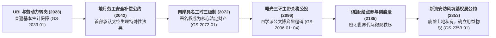

# ⚖️ 千禧制度志 · 意义资产与法权演进史（2028—2353+）

> **世代飞船元框架 · 生产关系与社会分配制度专卷（Line 4）** ｜ 2026-08-23
> 本专卷追踪物质丰裕后人类从 UBI、具名工时三级制，到太阳系殖民地离心公约与比邻星防风坑基法的完整制度变迁。

---

## 〇、 意义资产与法权演进全景图

---

## 一、 核心法典与制度条文演进表

| 制度名称 / 法典代号 | 确立年份与空间带 | 核心利益博弈 | 制度运行机制与历史结果 | 对应正典文献 |
|:---|:---|:---|:---|:---|
| **《地联劳动力去技能化保障法》** | 2028（①地球） | 传统白领被 AI 替代后的生计与社会稳定 | 设立 UBI 基础点券与算力税，开通地月劳务转岗通道。 | `GS-2033-01` 巡检签名员求职信 |
| **《地月低重力劳动安全公约》** | 2042（②地月系） | 地球资本 vs 太空蓝领的辐射与骨丢失补偿 | 强制规定低重力工休期与“不可逆失锚人员”终身养老兜底。 | `GS-2068-02` 陈初九人事档案卷 |
| **《南岸具名工时分配条例》** | 2072（①地球） | 物质免费后，80亿人对“存在感与署名权”的争夺 | 确立 **A级（独占署名）、B级（集体署名）、C级（不具名）** 三级工时答辩制。 | `GS-2072-01` 南岸具名工时表 |
| **《曙光三环关税平准协议》** | 2096（③内太阳系） | 地球地联航运税权 vs 殖民地自给自治诉求 | 官府、食堂、互济社、商会四方博弈，确立自给定居点免税清单。 | `GS-2096-01~04` 曙光三环四件套 |
| **《新海安地籍与防风坑基公约》** | 2353（⑤比邻星） | 落地一代人对有限地表防风掩体的使用权分配 | 彻底废除旧地球土地所有制，以“气压维持与结构贡献”核发坑基使用权证。 | `GS-2353-01` 防风坑基公证书 |

---

## 二、 制度演化的三大铁律

1. **物质越免费，意义越昂贵（The Significance Paradox）**：水和食物免费后，人类社会并没有变成极乐净土，而是把所有的政治争斗转移到了“项目署名权”、“历史位置”与“公共注意力”的分配上；
2. **距离即法权（The Decay of Jurisdictional Reach）**：当通信延迟超过 30 分钟，中央法庭在物理上丧失执行力，殖民地自治公约（Charter of Autonomy）必然取代母星宪法；
3. **官僚主义的温度与残酷（Bureaucratic Coldness）**：人类社会的爱恨情仇与生存妥协，最终全部凝结在冰冷的公文批单、处分书与遗物清册里，公文从不解释，但公文就是历史本身。
