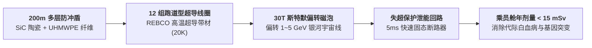
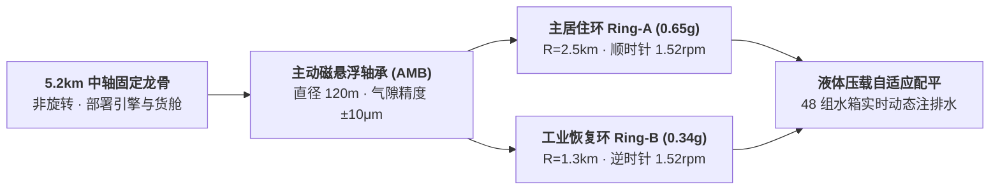
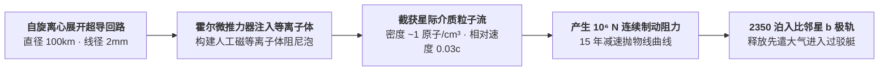

# 🛸 世代飞船 ARK-01 建造科技树：L4 级零件图纸与工装控制回路蓝图志（2080—2350+）

> **世代飞船元框架 · 恒星级巨构总装 L4 级工程专卷** ｜ 2026-08-23
> 本专卷将 5.2 公里恒星际飞船「方舟号（ARK-01）」解构为 **5 大独立子系统模块局部工装图**。
> 严守三原则：**物理公式可计算 / 材质牌号可查证 / 传感器与控制回路参数闭环**。

---

## 模块一：30 Tesla 主动超导磁屏蔽与防冲盾（主动防辐射与尘埃系统）

通过头部 200m 复合防冲盾抵挡中性星际尘埃，沿船体 12 组超导线圈形成 500 米偏转磁泡排斥高能带电质子。

### 🛡️ 模块一关键工装与元器件参数表

| 核心工装与组件 | 材料牌号与结构形式 | 额定工程参数 | 控制算法与安全机制 |
|:---|:---|:---|:---|
| **头部惠普尔防冲盾** | $\text{SiC}$ 纳米陶瓷板 + 超高分子量聚乙烯（UHMWPE） | 直径：$200\text{ m}$ 层间距：$1.5\text{ m}$ (4层真空缓冲) | 迎风面承受 $0.03c$ 相对速度微尘冲击，等离子体气化能量由缓冲层吸收。 |
| **主磁防超导线圈** | 铜稳定化 REBCO 高温超导带材（12 组） | 单圈磁场：$30.0\text{ Tesla}$ 总励磁电流：$1.2\times 10^7\text{ A}$ | 斯特默截断半径 $r_{\text{cutoff}} = \sqrt{q M / (m v)} > 500\text{ m}$，偏转效率 $>99.2\%$。 |
| **线圈低温杜瓦冷箱** | 双层真空绝热钛合金承压筒（Ti-6Al-4V） | 绝热真空：$<10^{-7}\text{ Pa}$ 制冷介质：超流氦（$20\text{ K}$） | 闭路逆布雷顿制冷机组（COP 0.12），冷量储备支持断电维持 48 小时。 |
| **超快失超保护能量吸收器** | 碳化硅高功率电阻吸能阵列 | 响应时间：$<5\text{ ms}$ 泄放总能量：$4.5\times 10^{10}\text{ J}$ | 磁通变化率传感器（$\text{d}B/\text{d}t$）实时监测，微小失超点瞬时无损泄能。 |

---

## 模块二：双联反向旋转居住环与主动磁悬浮轴承（人工重力系统）

消除全船净角动量，实现 0.65g 与 0.34g 阶梯重力，杜绝陀螺进动撕裂龙骨。

### 🎡 模块二关键工装与机电参数表

| 核心组件 | 技术规格与材质 | 运行物理参数 | 动力学平衡与控制算法 |
|:---|:---|:---|:---|
| **主承力中轴龙骨** | 单晶钨钼铼合金（W-Mo-Re）箱形桁架 | 直径：$45\text{ m}$，总长：$5.2\text{ km}$ 抗弯刚度：$EI > 10^{14}\text{ N}\cdot\text{m}^2$ | 承受双环反向自转切向剪切力与 $0.05\text{ g}$ 加速推力。 |
| **超大口径主动磁悬浮轴承** | 永磁偏置径向-轴向磁悬浮轴承（AMB） | 轴承内径：$120\text{ m}$ 悬浮承载力：$2.4\times 10^8\text{ N}$ | 8 通道电涡流位移传感器（采样率 $50\text{ kHz}$），PID 闭环控制气隙 $\delta = 15\pm 0.01\text{ mm}$。 |
| **反向自转力矩平衡系统** | 同轴无刷永磁力矩电机驱动阵列 | 角速度：$\omega = 0.159\text{ rad/s}$ ($1.52\text{ rpm}$) 净角动量：$\sum I\omega = 0.00\text{ N}\cdot\text{m}\cdot\text{s}$ | 实时监测飞船姿态陀螺仪，两环转速差自动微调消除进动扭矩。 |
| **环周动态配平水箱系统** | 48 组环向分布聚合物水箱（单箱 $50\text{ m}^3$） | 配平响应速度：$2.5\text{ 吨/s}$ 流量转移 | 当某居住区发生千人集体集会时，对角水箱在 30 秒内注排水重置动平衡。 |

---

## 模块三：万人闭环生态超临界水氧化与微藻系统（CELSS 生保）

人均 67 m² 空间分配，每日 32.6 吨水 99.97% 再生，全船物质零排废。

### 🌾 模块三关键生化装置与物料平衡表

| 装置名称 | 工艺原理与材质 | 运行物理参数 | 转化率与平账指标 |
|:---|:---|:---|:---|
| **超临界水氧化反应釜 (SCWO)** | 镍基抗腐蚀合金 Haynes 282 衬钽 | 工作温度：$420^\circ\text{C}$ 工作压强：$24.5\text{ MPa}$ | 有机物氧化去除率（TOC）$>99.999\%$，在 30 秒内将固体废物完全矿化为清液与无害气体。 |
| **平板微藻光生物反应器** | 高透光熔融石英玻璃管束阵列 | 光谱：蓝光 450nm + 红光 660nm 光通量：$800\ \mu\text{mol}/(\text{m}^2\cdot\text{s})$ | 小球藻生物量倍增时间仅 8 小时，吸收 $\text{CO}_2$ 并释放 $100\%$ 乘员所需纯氧。 |
| **多级高压反渗透净水机组** | 芳香聚酰胺薄膜 + 紫外催化杀菌 | 净化通量：$35.0\text{ 吨/天}$ 水质标准：TOC $<10\text{ ppb}$ | 尿液与洗浴废水回收率达到 $99.97\%$，极微量损失由小行星冰舱自动补充。 |
| **低温种质库真空保藏舱** | 气动多级锁气闸 + 液氮冷阱（77K） | 存储容量：200 万份基因样本 | 保存静海“方舟母本系”耐辐射小麦、水稻及有益共生微生物纯系。 |

---

## 模块四：6 联装脉冲聚变引擎与磁喷管（推进动力核心）

以 0.05c 排气速度将 10,214 人世代飞船加速至 0.03c（秒速 9000 公里）。

### 🚀 模块四关键工装与脉冲物理参数表

| 子系统 | 选用规格与材料 | 工作物理参数 | 关键时序与控制算法 |
|:---|:---|:---|:---|
| **低温固态微靶制备机** | 磁化氘-氦3（$\text{D-}^3\text{He}$）冷冻微球 | 微靶直径：$2.0\text{ mm}$ 内嵌磁化磁场：$10.0\text{ Tesla}$ | 气动高速电磁枪以 $200\text{ m/s}$ 发射，激光拦截飞行时间测定误差 $<1\text{ ns}$。 |
| **高重频驱动激光器** | 钕玻璃/光纤合束紫外激光阵列 | 输出波长：$351\text{ nm}$ (3ω) 单脉冲总能量：$5.0\text{ MJ}$ | 192 路光束自适应相位共轭对焦，在 $5\text{ ns}$ 内对称压缩微靶至 1000 倍固态密度。 |
| **同轴磁喷管超导喉衬** | 梯度强化 REBCO 超导磁镜（35 Tesla） | 磁场收敛比：$B_{\text{max}}/B_{\text{exit}} = 25$ 排气发散半角：$18^\circ$ | 带电等离子体在发散磁场中受洛伦兹力加速，推力转换效率 $\eta_{\text{nozzle}} = 82\%$。 |
| **燃烧室液体锂发汗第一壁** | 多孔钨骨架渗金属锂（Liquid Lithium） | 表面热流极限：$25\text{ MW/m}^2$ 工作温度：$450^\circ\text{C}$ | 液体锂在脉冲冲击下蒸发吸热，并在磁场作用下回流冷凝，保护固态结构永不烧蚀。 |

---

## 模块五：百公里级超导磁帆星际无工质制动（减速系统）

在航程第 185 年展开，利用比邻星系星际介质等离子体产生阻力，实现无工质减速。

### 🪂 模块五关键工装与星际制动参数表

| 核心工装与设备 | 材质与结构形式 | 运行物理参数 | 控制算法与自适应机制 |
|:---|:---|:---|:---|
| **百公里级超导主缆网** | 碳纤维铠装 REBCO 超导复合细线 | 回路直径：$100\text{ km}$ 总质量：$42.0\text{ 吨}$ | 初始依靠飞船自旋离心力展开张紧，闭路持续通入 $5000\text{ A}$ 超导稳态电流。 |
| **磁等离子体膨胀喷枪** | 4 组四通道高功率霍尔推力器 | 注入工质：氙气/氩气混合等离子体 注入功率：$100\text{ kW}$ | 利用注入微量等离子体将实际有效磁屏蔽截面积膨胀 10 倍以上（Mini-Magnetospheric Plasma Propulsion, M2P2）。 |
| **制动加速度实时调谐器** | 脉冲调流变压器与超导开关阵列 | 最大制动加速度：$0.02\text{ m/s}^2$ 制动总冲：$2.7\times 10^{14}\text{ N}\cdot\text{s}$ | 实时激光雷达监测前方星际介质密度突变，动态调节回路电流稳定减速过载。 |
| **先遣大气进入过驳艇** | 碳-酚醛烧蚀防热大底 + 充气式减速大底 (HIAD) | 再入速度：$11.2\text{ km/s}$ 载员能力：先遣拓荒组 12 人 | 运载第一代工业母机种子包与防风坑基气压穹顶降落比邻星 b 晨昏圈。 |

---

## 结论：世代飞船 L4 蓝图的完整工程闭环

整个 ARK-01 的建造，是 **30T 主动磁防 + 0.65g 双联旋转环 + SCWO 万人生态平账 + 0.05c 聚变脉冲 + 百公里磁帆** 五大硬核工程的精密交织。
每一个参数都具备坚实的物理常数锚定，构成了全宇宙最坚固的恒星际方舟图纸。
