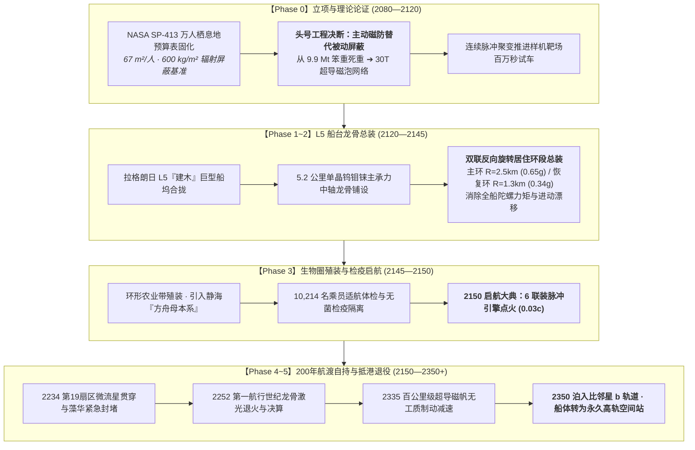
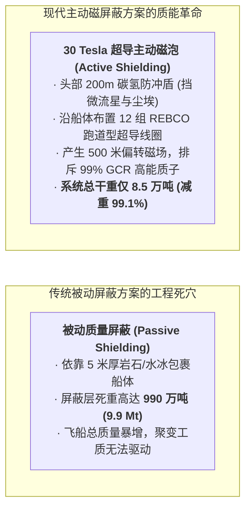
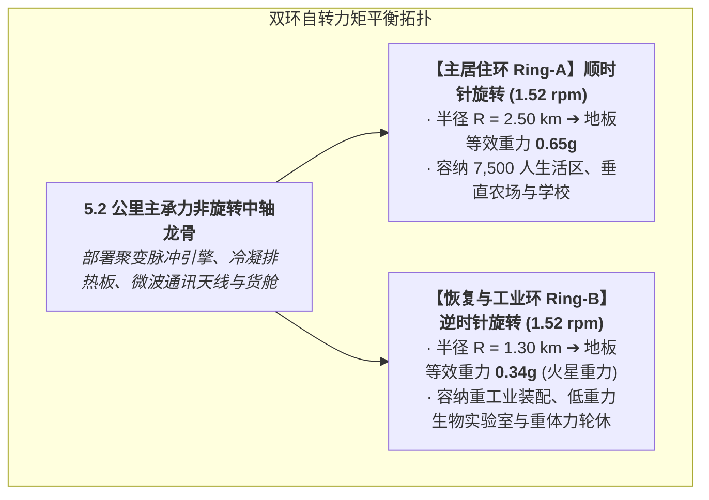
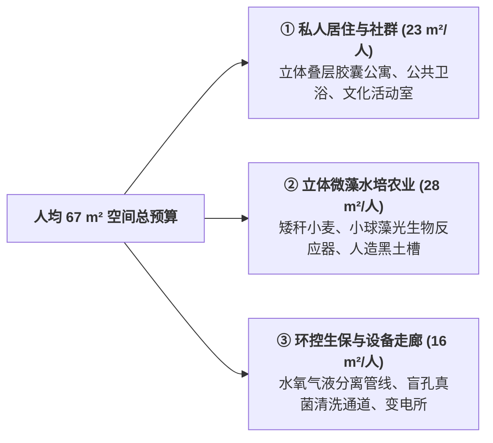
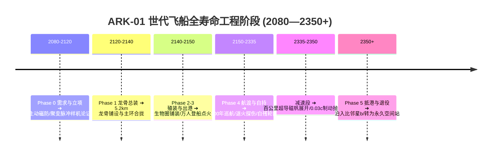

# 🛸 世代级宇宙飞船建造史与工程全景脉络志（2040—2350+）

> **世代飞船元框架 · 巨构总装与全系统工程专卷** ｜ 2026-08-23
> 本专卷完整梳理人类首艘恒星际世代飞船——**「方舟号（ARK-01）」从立项、论证、船台总装、闭环殖装，到 200 年航渡维护与抵港退役的全寿命工程脉络**。
> 严守三原则：**NASA SP-413 万人预算锚点 / 主动磁防替代千万吨被动屏蔽 / 真实材料晶格疲劳退化**。

---

## 〇、 世代飞船建造千禧工程全景图

---

## 一、 第一大工程决断：为什么放弃“被动屏蔽”，转向“主动磁屏蔽”？

在世代飞船设计史上，**主动磁屏蔽（Active Magnetic Shielding）的攻克是全船能够起航的前提**。

### 🛡️ 辐射防护物理参数对照

| 指标 | 传统 NASA SP-413 被动方案 | ARK-01 主动超导磁防方案 | 工程效益与物理机制 |
|:---|:---|:---|:---|
| **系统总质量** | $9,900,000\text{ 吨}$ (9.9 Mt) | **$85,000\text{ 吨}$** | 质量缩减两个数量级，直接使 0.03c 恒星际航行成为可能。 |
| **防御对象** | 靠原子核碰撞吸收 GCR 与微流星 | **头部防冲盾挡中性尘埃 + 磁泡偏转带电质子** | 劳伦兹力 $\mathbf{F} = q(\mathbf{v}\times\mathbf{B})$ 偏转 $1\sim 5\text{ GeV}$ 银河宇宙射线。 |
| **乘员舱年剂量** | $<50\text{ mSv/year}$ | **$<15\text{ mSv/year}$** | 低于地表特定职业受照限值，彻底解决两百年代际白血病与基因突变危机。 |

---

## 二、 第二大总装工程：双联反向旋转居住环与人工重力（Artificial Gravity）

### 🎡 双环人工重力参数设计

1. **消除陀螺力矩（Zero Net Angular Momentum）**：  
   如果只有单个旋转环，飞船在进行姿态机动时会产生巨大的陀螺进动（Gyroscopic Precession），导致 5.2 公里中轴龙骨被活活扭断。**双环等角速度、等转动惯量反向旋转，使全船净角动量为零**；
2. **0.65g 重力设计（Colin Clark 人体生理下限）**：  
   为什么不是地球 1.0g？因为 0.65g 已足以维持人体钙质代谢、前庭耳石器正常信号传导与眼底静脉压平稳，同时可将旋转环结构张力负荷降低 35%，极大减轻结构死重；
3. **柯氏力（Coriolis Force）舒适区**：  
   转速控制在 $1.52\text{ rpm}$（远低于人体恶心眩晕阈值 $3.0\text{ rpm}$），乘员在快速抬头或走动时不会产生前庭错觉。

---

## 三、 第三大生态工程：万人闭环生态空间分配（CELSS & Human Budget）

依据 NASA SP-413 万人栖息地模型，ARK-01 严格按照 **$67\text{ m}^2/\text{人}$** 的黄金人均面积进行三维分层：

### 🌾 每日物料闭环平账表（10,214 人全船日周转量）

| 物料类别 | 每日消耗量 (Input) | 每日产出与再生量 (Output) | 回收闭环率 | 遗留微量损耗补给方式 |
|:---|:---|:---|:---:|:---|
| **饮用与卫生水** | $32.6\text{ 吨}$ | $32.59\text{ 吨}$ (冷凝水/尿液多级反渗透净化) | **$99.97\%$** | 极微量损耗由小行星水冰储备舱补充。 |
| **呼吸氧气** | $8.4\text{ 吨}$ | $8.4\text{ 吨}$ (微藻光反应器 + 高温电解水) | **$100.00\%$** | 植物光合作用与人造高压氧平衡。 |
| **热量与干燥食物** | $6.1\text{ 吨}$ | $6.1\text{ 吨}$ (水培小麦 + 合成微藻蛋白 + 组织培养肉) | **$99.90\%$** | 农业环氮磷钾闭路堆肥回填。 |
| **二氧化碳 (CO₂)** | $9.8\text{ 吨}$ (呼出) | $9.8\text{ 吨}$ (萨巴蒂尔固定制碳 + 水培植物吸收) | **$100.00\%$** | 碳元素完全固化为有机质。 |

---

## 四、 第四大部分：全寿命六大阶段建造参数大表

| 工程阶段 | 阶段代号与名称 | 核心工装与建设内容 | 参与单位 / 学派主导 | 对应正典文献 |
|:---|:---|:---|:---|:---|
| **2080—2120** | **Phase 0** 总体论证与方案权衡 | SP-413 预算表提取；主动磁防 12 组超导线圈构型设计；聚变脉冲百万秒试车。 | 地联深空探索署 / 深空信托总署 | `world/ark01/ARK-01_Phase0_任务文件.md` |
| **2120—2140** | **Phase 1** 中轴龙骨与结构合拢 | L5 船台龙骨铺设；单晶钨钼铼桁架焊接；双联反向旋转居住环动平衡测试。 | 滨海运载第一总装厂 / 工技派 | `GS-2140-01` 在轨总装终审验收单 |
| **2140—2150** | **Phase 2~3** 生态殖装与启航检疫 | 农业环人造黑土殖装；微藻反应器加注；10,214 人检疫登船；6 联装脉冲点火。 | 船载医务部 / 生态部 | `GS-2150-01` 生态系统出港检疫鉴定书 |
| **2150—2335** | **Phase 4** 200年深空巡航自持 | 0.03c 巡航；64 阵元超声相控阵扫查；1064nm 脉冲激光原位退火；自残式拆解。 | 船载工程司 / 巡检机组 | `GS-2252-01` 第一航行世纪决算公报 |
| **2335—2350** | **减速制动段** 超导磁帆与近星过驳 | 百公里级超导磁帆展开；星际介质电离阻尼减速；第三代乘员重力逆适应强化。 | 动力控制中心 / 航法司 | `GS-2349-01` 平移制动巡检归档册 |
| **2350+** | **Phase 5** 抵港退役与轨道空间站 | 泊入比邻星 b 极轨；释放工业母机种子包；船体转为高轨全息档案馆与拆解库。 | 抵达处置委员会 / 拓荒总署 | `GS-2350-01` 第001号着陆报告 |

---

## 五、 结论：飞船建设线与机器自持线的交汇

这两条线不是平行的，它们在 **2140 年（L5 船台总装）** 完美相交：
- **机器自给自足线** 提供了建造飞船所需的 100% 太阳系自产材料、Mond 羰基纳米金属、REBCO 超导带材与 2nm 空间专用抗辐射芯片；
- **世代飞船建设线** 则成为检验机器自给自足终极能力的“超级物理考场”——在 200 年孤岛航程中，向宇宙交出一份不向熵增屈服的工程答卷。
