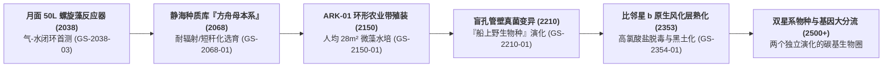

# 🌱 千禧工程志 · 文明生物圈与异星驯化史（2038—2500+）

> **世代飞船元框架 · 碳基生态自持与地外演替专卷（Line 3）** ｜ 2026-08-23
> 本专卷追踪人类文明从月面 50L 螺旋藻反应器、静海方舟母本系，到 ARK-01 两百年真菌管壁漂变与比邻星 b 毒性风化层熟化的完整生物工程链。

---

## 〇、 文明生物圈千禧演替全景图

---

## 一、 核心生化工程节点与参数表

| 演替阶段 | 关键技术与生物载荷 | 物理/生化机制 | 演化危机与工程应对 | 对应正典文献 |
|:---|:---|:---|:---|:---|
| **2038 月面先行** | 50L 平板螺旋藻光生物反应器 | $\text{CO}_2$ 吸收率 $1.8\text{ g/(L}\cdot\text{d)}$，单日产氧 $65\text{ L}$ | 气液分离微重力气泡栓塞；采用低剪切离心膜脱气。 | `GS-2038-03` 静海螺旋藻运行报告 |
| **2068 母本系选育** | “方舟母本系”耐辐射矮秆小麦（JM-68） | 诱变修复酶基因过表达，耐受 $20\text{ mGy/d}$ 慢性辐照 | 基因甲基化表观漂变；每 5 年与地表基线比对校正。 | `GS-2068-01` 方舟母本系血缘档案 |
| **2150 飞船农业环** | 环形多层人造黑土槽 + 小球藻管道 | 人均 $28\text{ m}^2$ 耕地，日供热量 $2800\text{ kcal}$，氮磷钾闭路循环 | 空间受限无法养殖大型牲畜；全面采用组织培养肉。 | `GS-2150-01` 生态系统出港检疫书 |
| **2210 船内真菌危机** | 盲孔管壁变异型青霉/镰刀菌复合菌膜 | 附着于冷凝水管壁，以聚乙二醇挥发物为碳源 | **无法灭绝，转为受控共生**：划定第 408 区定期人工清洗。 | `GS-2210-01` 菌膜清洗作业日志 |
| **2353 异星风化层熟化** | 比邻星 b 原生红矮星光谱温室 | 厌氧脱氯菌降解高氯酸盐（$\text{ClO}_4^- \to \text{Cl}^- + 2\text{O}_2$） | 重金属络合钝化；利用有机质堆肥与工程线虫熟化。 | `GS-2354-01` 新海安温室首作报告 |

---

## 二、 生态自持的三大物理铁律

1. **真实物质守恒（The Nitrogen-Phosphorus Limit）**：飞船内没有化肥工厂，全船每一克氮、磷、钾元素必须在人类排泄物、超临界水氧化（SCWO）矿化液与作物根系之间形成绝对平衡，平账误差不得超过 $0.01\%$/年；
2. **共生微生态不可逆漂移（Microbial Drift）**：两百年封闭环境证明了《Aurora 失败学》的真理——人类不可能在一个绝对无菌的纯净环境中生存，飞船最终演化出了独特的“人-藻-菌共生新生态”；
3. **光合有效辐射能量成本（PAR Energy Wall）**：水培农业需要 $800\ \mu\text{mol}/(\text{m}^2\cdot\text{s})$ 的 LED 补光，全船生保系统消耗了聚变电站 $18\%$ 的总发电量。
