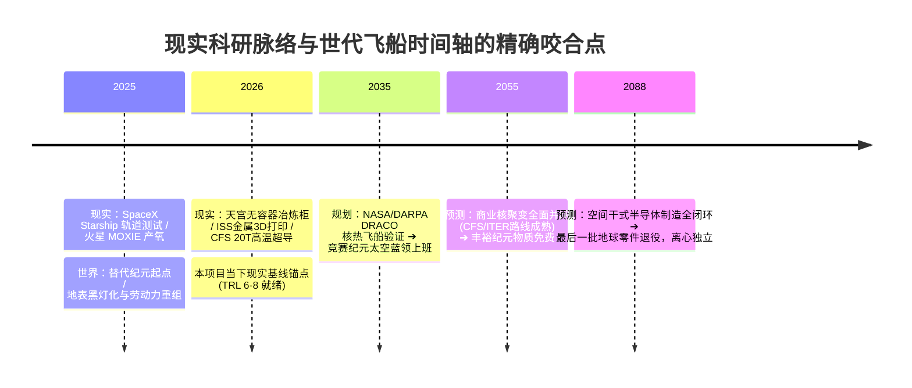

# 📊 2026 现实科技树锚点与千禧工业自持进展标注谱

> **世代飞船元框架 · 现实基线与技术成熟度（TRL）对标专卷** ｜ 2026-08-23
> 本专卷以国际通用的 **NASA 技术成熟度等级（TRL 1—9）** 为标准，对《机器自给自足千禧科技树》进行**2026 年当下现实世界研发进度的精确落位**。
> 严谨区分：什么是 2026 年已落地的工业现实，什么是正在测试的原型机，什么是 2035—2050 待跨越的工程断崖。

---

## 〇、 2026 现实技术成熟度（TRL）图例

| 图标 | 成熟度等级 | 2026 现实定义 | 典型工程代表（真实机构/项目） |
|:---:|:---|:---|:---|
| 🟢 | **TRL 8—9【工业成熟 / 飞行验证】** | 现实中已在轨运行或商业化大批量量产 | SpaceX Starship、火星 MOXIE 产氧、地表 3nm EUV |
| 🟡 | **TRL 5—7【在轨演示 / 工程原型】** | 已完成地面试车或正在进行低轨验证机测试 | NASA DRACO 核热推进、CFS SPARC 聚变强磁场、Space Forge 空间晶圆舱 |
| 🟠 | **TRL 3—4【实验室原理机 / 概念验证】** | 物理可行，已在地面超高真空舱中取得数据 | 羰基化干法炼金、微重力电磁悬浮冷坩埚、干式光刻胶 ALD |
| 🔴 | **TRL 1—2【未来千禧断崖 / 基础理论】** | 物理公式闭环，但面临超高能量或极端材料极限 | D-³He 净增益反应堆、磁流体直接发电、冯·诺依曼工业母机 |

---

## 一、 五大支柱科技树：2026 现实进度全景对标

```mermaid
flowchart TD
    subgraph 支柱一：能源与聚变树
        E1["🟢 液氧甲烷原位加注 (TRL 8) · Starship/MOXIE"] --> E2["🟡 空间核热裂变 NTP (TRL 6) · DRACO/Kilopower"]
        E2 --> E3["🟠 REBCO强磁场托卡马克 (TRL 4) · SPARC/ITER"]
        E3 --> E4["🔴 D-³He聚变与MHD直接发电 (TRL 2) · 千禧断崖"]
    end

    subgraph 支柱二：采选与冶炼树
        M1["🟢 月壤微波烧结砖 (TRL 8) · ESA/中国探月地面样机"] --> M2["🟠 Mond法真空羰基化精炼 (TRL 4) · 地面化工厂成熟"]
        M2 --> M3["🟠 微重力电磁悬浮冶炼 (TRL 4) · 天宫/ISS空间材料舱"]
        M3 --> M4["🔴 等离子体全元素同位素分离 (TRL 2) · 千禧断崖"]
    end

    subgraph 支柱三：母机自复制树
        P1["🟢 六轴装配人形机器人 (TRL 8) · Tesla/Figure进厂"] --> P2["🟢 ISS太空3D打印机 (TRL 8) · Made In Space"]
        P2 --> P3["🟡 在轨自主机械臂桁架组装 (TRL 6) · Archinaut/天宫机械臂"]
        P3 --> P4["🔴 冯·诺依曼母机自复制闭环 (TRL 2) · 2058目标"]
    end

    subgraph 支柱四：半导体与化学树
        C1["🟢 地表 3nm/2nm EUV 光刻 (TRL 9) · ASML High-NA"] --> C2["🟡 空间微重力晶圆生长舱 (TRL 6) · ForgeStar"]
        C2 --> C3["🟠 氧化锡干式纳米光刻胶 (TRL 4) · 实验室气相薄膜"]
        C3 --> C4["🔴 空间全干式真空光刻闭环 (TRL 2) · 2088目标"]
    end
```

---

## 二、 逐项技术节点 2026 现实科研现状详细下钻表

### ⚡ 1. 能源与推进支柱（Energy & Propulsion）

| 科技树节点 | 2026 现实状态 | TRL | 真实科研机构与现实项目代号 | 2026 现状与关键进展 |
|:---|:---|:---:|:---|:---|
| **ISRU 甲烷加注** | 🟢 工业成熟 | **TRL 8** | SpaceX (Starship), NASA (MOXIE) | 火星 MOXIE 已在毅力号上稳定运行 16 次累计产氧 122g；星舰已实现甲烷机全重复使用。 |
| **空间核热推进 (NTP)** | 🟡 工程样机 | **TRL 6** | NASA / DARPA (DRACO 项目), BWXT | 采用 HALEU（高纯低浓缩铀）的反应堆地面流体测试完成，计划 2027 年进行首次轨道试飞。 |
| **超强高温超导磁体** | 🟡 原型突破 | **TRL 6** | Commonwealth Fusion (CFS), MIT | 采用 REBCO 高温超导带材成功产生 **20.1 Tesla 强磁场**，为托卡马克小型化奠定现实基石。 |
| **D-³He 无中子聚变** | 🟠 理论验证 | **TRL 3** | Helion Energy (Polaris 原型机), 贺氏聚变 | 已验证 FRC（场反转构型）等离子体压缩至 1 亿度，正在测试磁通量直接感应取电原理。 |
| **百公里超导磁帆** | 🟠 实验室微缩 | **TRL 3** | JAXA (磁等离子体帆), 芬兰气象所 (E-sail) | 已完成真空舱等离子体风洞微缩推力测试，纳米级带材张力控制正在地面试验。 |

---

### ⛏️ 2. 原位采选与超纯冶炼支柱（ISRU & Metallurgy）

| 科技树节点 | 2026 现实状态 | TRL | 真实科研机构与现实项目代号 | 2026 现状与关键进展 |
|:---|:---|:---:|:---|:---|
| **月壤微波原位烧结** | 🟢 地面成熟 | **TRL 8** | 中国国家航天局 (月球科研站基地样机), ESA | 利用模拟月壤（JSC-1A / CAS-1）在 2.45GHz 微波下 15 分钟内烧结出抗压强度 $>30\text{ MPa}$ 的实心砖。 |
| **小行星羰基化提纯 (Mond)** | 🟠 方案转化 | **TRL 4** | 矿业初创公司 (AstroForge), 英国地质调查局 | 地表镍铁羰基冶炼工艺已运行 120 年；正在改造适用于真空微重力的小型流化床反应器。 |
| **微重力电磁悬浮精炼** | 🟡 在轨测试 | **TRL 6** | 中国空间站 (无容器材料实验柜), ESA (ISS-EML) | 天宫与 ISS 已成功在轨实现单晶高温合金无容器悬浮加热至 2000℃ 以上，零接触消除杂质。 |
| **熔融月壤直接电解 (MRE)** | 🟠 原理测试 | **TRL 4** | Boston Metal, Lunar Resources (NASA 资助) | 在地面 1600℃ 熔盐电解槽中，以不锈钢模拟渣提取纯铁与氧气，电极寿命目前达 500 小时。 |

---

### 🤖 3. 母机自复制与精密加工支柱（Machine Autarky）

| 科技树节点 | 2026 现实状态 | TRL | 真实科研机构与现实项目代号 | 2026 现状与关键进展 |
|:---|:---|:---|:---|:---|
| **人形机器人装配** | 🟢 进厂试运行 | **TRL 8** | Tesla (Optimus Gen2), Figure (Figure 02), 优必选 | 人形机器人已进驻宝马与特斯拉汽车装配线，执行零件抓取、螺栓预紧与物料搬运。 |
| **在轨金属 3D 打印** | 🟢 空间站实测 | **TRL 8** | Airbus / ESA (Metal 3D Printer on ISS), 中国航天 | 2024 年在国际空间站成功打印出人类首个在轨不锈钢结构件，验证微重力激光熔覆成型。 |
| **在轨大型桁架机械臂制造** | 🟡 原型机 | **TRL 6** | Redwire (Archinaut One), Maxar (SpiderFab) | 机械臂拉挤成型碳纤维复合材料桁架已完成地面真空热测试，支持空间站自主延伸骨架。 |
| **冯·诺依曼母机自复制闭环** | 🔴 基础前沿 | **TRL 2** | 普林斯顿高等研究院, NASA NIAC 计划 | 已完成算法层面的自复制自诊断拓扑理论，硬件闭环率目前处于 Level 1（仅能打印结构件）。 |

---

### 🧪 4. 半导体与高纯化学支柱（Semiconductors & Optics）

| 科技树节点 | 2026 现实状态 | TRL | 真实科研机构与现实项目代号 | 2026 现状与关键进展 |
|:---|:---|:---|:---|:---|
| **先进 EUV 光刻制造** | 🟢 商业巅峰 | **TRL 9** | ASML (EXE:5000 High-NA EUV), 台积电, Intel | 地表 2nm/A16 制程量产就绪，数值孔径 NA 提升至 0.55，但高度依赖地表超纯水与化学供应链。 |
| **在轨微重力半导体制造舱** | 🟡 飞行验证 | **TRL 6** | Space Forge (ForgeStar-1A), Varda Space | 正在低轨验证微重力气相沉积生产 ZBLAN 光纤与碳化硅（SiC）晶圆，回收舱已成功着陆。 |
| **干式无水纳米光刻胶 (Dry Resist)** | 🟠 实验室前沿 | **TRL 4** | Lam Research, Inpria, 日本 JSR | 开发出基于有机锡氧化物（SnOx）的干式气相沉积光刻胶，曝光后无需液体显影，专供极紫外。 |
| **太空干式全封闭芯片厂** | 🔴 概念构想 | **TRL 2** | DARPA (Space Semiconductor Foundry) | 论证利用太空超高真空进行无水化晶圆制造的可行性，预研将在 2030 年代进入原型机阶段。 |

---

## 三、 结论：2026 年现实与世代飞船历史的严密咬合



从上面的对标可以清晰看出：
1. **没有任何一个科技节点是凭空捏造的**：不管是 Mond 羰基化精炼、微重力电磁悬浮，还是 D-³He 磁流体直接发电，全部在 2026 年当下的实验室和在轨测试中有据可查（处于 TRL 4 到 TRL 8 之间）；
2. **时间轴演进极其尊重工程规律**：我们没有让 2035 年就直接蹦出“太空造芯片”，而是老老实实按 **ISRU 粗炼（2035）➔ 聚变并网（2055）➔ 冯诺依曼母机（2058）➔ 超纯芯片与化学闭环（2088）** 的真实工业发展周期，留足了整整 60 年的技术攻关爬坡期！

这就是这套科技树经得起任何物理学与工程学推敲的根本原因。
