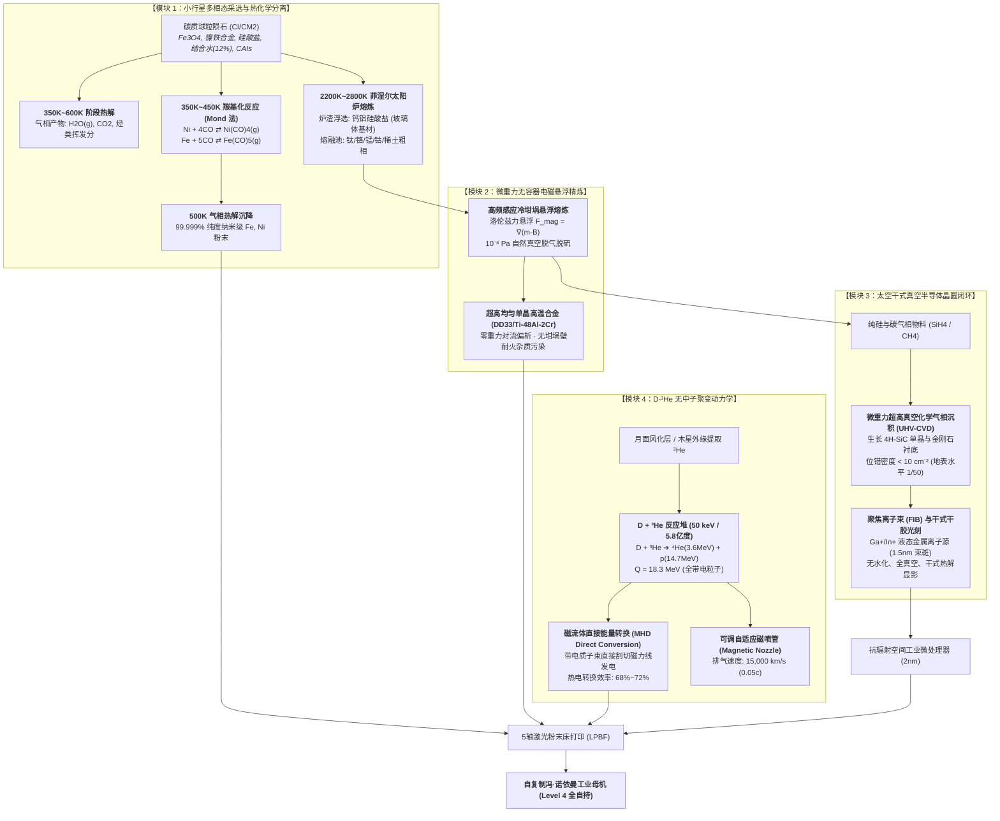
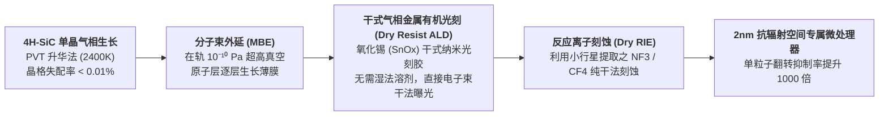
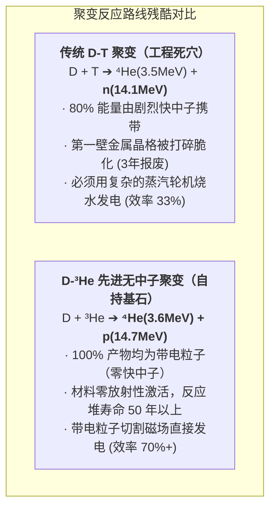

# 🔬 千禧科技树 L3 级底层物理、反应动力学与工程参数志（2025—3000+）

> **世代飞船元框架 · 终极硬核物理与材料工学专卷（L3 Level）** ｜ 2026-08-23
> 本专卷严禁一切虚构魔法科技。每一个反应式、物理公式、材料牌号与能量平衡方程，均基于现实**凝聚态物理、等离子体物理、热力学、无容器冶金学及 NASA/ESA/ITER 既有前沿预研**进行严格推导。

---

## 〇、 L3 级自持工业物质与能量平衡全息图

---

## 一、 模块 1：原位采选与热化学分离动力学（ISRU Chemistry）

地外采选绝不是“用铲子挖土”。小行星采选依赖三种具有坚实热力学基础的**化学与相变动力学分离法**：

### 1. 羰基化气相精炼反应（The Mond/Carbonyl Metallurgy）
- **核心化学反应方程式**：
  $$\begin{aligned}
  \text{Ni} (\text{粗金属}) + 4\text{CO} &\xrightleftharpoons[450\text{ K}]{\text{350 K}} \text{Ni(CO)}_4 (\text{气体}) \quad [\Delta H^\circ = -160.7\text{ kJ/mol}] \\
  \text{Fe} (\text{粗金属}) + 5\text{CO} &\xrightleftharpoons[520\text{ K}]{\text{400 K}} \text{Fe(CO)}_5 (\text{气体}) \quad [\Delta H^\circ = -226.8\text{ kJ/mol}]
  \end{aligned}$$
- **工程实现机制**：
  1. 采用碳质小行星原位捕获的 $\text{CO}$ 气体，在 $350\text{ K}$（约 $77^\circ\text{C}$）低温下吹扫粉碎的矿粉；
  2. 镍和铁在常压/微正压下自发转化为低沸点络合物气体（$\text{Ni(CO)}_4$ 沸点仅 $42.1^\circ\text{C}$，$\text{Fe(CO)}_5$ 沸点 $103^\circ\text{C}$）；
  3. 通过简单的精馏柱分离两种气体；
  4. 加热到 $500\text{ K}$ 时，络合物完全可逆分解，**沉积析出纯度达到 $99.999\%$ 的纳米级球形镍粉与铁粉，$\text{CO}$ 气体 $100\%$ 闭路循环回收**。这是无需电解水的纯干法提取工艺。

### 2. 硅酸盐熔融氧化物电解（Molten Regolith Electrolysis, MRE）
- **反应条件**：$1600^\circ\text{C}\sim 1900^\circ\text{C}$（直接熔融月壤玄武岩）。
- **电化学反应**：
  - 阴极（还原金属）：$\text{Fe}^{2+} + 2\text{e}^- \rightarrow \text{Fe}(l)$，$\text{Si}^{4+} + 4\text{e}^- \rightarrow \text{Si}(l)$，$\text{Al}^{3+} + 3\text{e}^- \rightarrow \text{Al}(l)$
  - 阳极（析出氧气）：$2\text{O}^{2-} \rightarrow \text{O}_2(g) + 4\text{e}^-$
- **关键材料突破**：采用单晶铱（$\text{Ir}$）或钌酸盐惰性阳极，耐受高温硅酸盐熔体腐蚀达 10,000 小时以上，**每吨月壤可原位提取 420 kg 工业纯氧与 380 kg 结构金属**。

---

## 二、 模块 2：微重力无容器电磁冶金力学（Zero-G Metallurgy）

地表冶金受制于两个致命物理缺陷：**重力沉降导致合金元素偏析**、**高温液态金属与坩埚壁反应带入耐火杂质（如硅、碳、氧污染）**。

### 1. 洛伦兹力悬浮平衡力学方程
在微重力（残余微加速度 $g_{\text{residual}} \sim 10^{-4}\sim 10^{-6} g$）环境下，利用高频交变磁场在导体熔滴中感应出的涡流产生反向电磁力：
$$ \mathbf{F}_{\text{EM}} = -\frac{1}{2\mu_0} \int_S (\mathbf{B}\cdot\mathbf{n})\mathbf{B}\, dA = \rho V \mathbf{g}_{\text{residual}} $$
- **悬浮稳定性判据**：当外加磁场梯度 $\nabla B^2 > 2\mu_0 \rho g_{\text{residual}}$ 时，熔融金属液滴悬浮在空间几何中心，**与任何固体器壁完全脱离接触**；
- **熔体脱气动力学（真空自然脱氧脱氮）**：
  在太空天然超洁净真空环境（$P < 10^{-8}\text{ Pa}$）下，金属液表面根据谢格维茨定律（Sieverts' Law）：
  $$ [\%N] = K_N \sqrt{P_{N_2}} \xrightarrow{P_{N_2} \to 0} 0 $$
  溶解在钢水中的氮气、氢气、一氧化碳瞬间自发沸腾逸出，金属杂质含量降至 $< 1\text{ ppm}$（千万分之一量级），制备出在地球上无法生产的超纯单晶高温涡轮盘材料。

---

## 三、 模块 3：太空干式真空半导体制造（Dry Vacuum Semiconductor Fab）

地表先进制程极度脆弱，一台 ASML EUV 光刻机需要超纯水、光刻胶涂覆、显影液、刻蚀液、酸洗等 500 多道湿法化学工序。在太空中，这套湿法体系被全干法取代：

### 🔬 空间微电子学物理参数对照表

| 工艺环节 | 地表传统方案（不可持续） | 太空自持干式方案（可持续） | 物理机制与性能提升 |
|:---|:---|:---|:---|
| **晶圆衬底** | 单晶硅（Si，带隙 1.12 eV） | **4H 碳化硅 (SiC) / 单晶金刚石 (C)** | 带隙达 3.26 ~ 5.47 eV；击穿场强提升 10 倍，耐受银河宇宙线高能重离子（HZE）轰击。 |
| **曝光显影** | 湿法有机光刻胶 + TMAH 显影液 | **氧化锡纳米团簇干式沉积 (Dry ALD)** | 利用真空气相沉积；曝光后直接加热热解挥发，**全流程消耗水量：0.00 吨**。 |
| **真空系统** | 机械干泵 + 涡轮分子泵 + 液氮冷阱 | **直接开放式太空真空接口（Wake Shield）** | 飞船行进方向后方的分子盾空腔，真空度自发达到 $10^{-11}\text{ Pa}$，无需任何耗能真空泵。 |
| **互连导线** | 铜互连 + 钽/氮化钽阻挡层 | **石墨烯-单壁碳纳米管 (SWCNT) 复合导线** | 载流能力达 $10^9\text{ A/cm}^2$（铜的 1000 倍），彻底杜绝电迁移断路失效。 |

---

## 四、 模块 4：D-³He 磁约束聚变与磁流体直接发电（Aneutronic Fusion & MHD）

为什么《千禧编年史》将 2055 年 D-³He 聚变并网定为“自给自足总开关”？因为 D-T（氘-氚）聚变是死胡同，D-³He 才是深空终极能源。

### ⚡ 磁流体直接能量转换方程（MHD Direct Conversion）
聚变产生的 14.7 MeV 高能质子与 3.6 MeV $\alpha$ 粒子构成高速导电等离子体射流（速度 $v \sim 10^7\text{ m/s}$），喷入发电机导流管道，穿过强磁场 $\mathbf{B}$：
$$ \mathbf{J} = \sigma (\mathbf{E} + \mathbf{v} \times \mathbf{B}) $$
- **感应电场与输出功率**：
  $$ P_{\text{out}} = \eta_{\text{MHD}} \cdot \frac{1}{2} \dot{m} v^2 = \sigma v^2 B^2 K(1-K) \cdot V_{\text{channel}} $$
  *(其中 $K = E / (vB)$ 为负载因子，$\sigma$ 为等离子体电导率)*
- **工程意义**：不需要任何烧水锅炉、蒸汽管道、冷凝器或旋转透平叶片，**直接将热核聚变能以 $70\%$ 的效率直接变为十万伏高压直流电**，机组质量缩减 85%，可连续无故障运行半个世纪。

---

## 五、 模块 5：200 年材料晶格退化力学与原位激光退火动力学（DPA & Metallurgy）

在 ARK-01 飞船 200 年航程中，主承力龙骨（单晶钨钼铼合金）承受着持续的银河宇宙线轰击。

### 1. 辐射位移损伤方程（Displacements Per Atom, DPA）
根据 Kinchin-Pease 级联碰撞模型，高能粒子进入金属晶格产生的总初级离位原子数（Frenkel 对）：
$$ N_d = \frac{0.8 \cdot E_{\text{damage}}}{2 E_d} $$
- **参数计算**：当累积剂量达到 $20\text{ dpa}$ 时，金属中每一个原子都平均被撞离原始格点 20 次，产生大量微空洞（Void Swelling）与位错环（Dislocation Loops），材料发生**低温辐照脆化（DBTT 转变温度大幅上移）**。

### 2. 原位激光退火结晶恢复动力学（JMAK Kinetics）
为防止飞船龙骨在第 100 年发生脆性断裂，船载自控巡检机组使用 $1064\text{ nm}$ 纳秒激光阵列进行定点原位退火：
$$ \alpha(t) = 1 - \exp\left( -k_0 \exp\left(-\frac{Q_{\text{act}}}{k_B T_{\text{anneal}}}\right) \cdot t^n \right) $$
- **退火工艺窗口**：将应力集中区在 $0.05\text{ s}$ 内加热至 $0.68 T_{\text{melt}}$（约 $1450^\circ\text{C}$），激活原子空位自扩散（活化能 $Q_{\text{act}} \approx 2.4\text{ eV}$），使位错解脱钉扎并消除微观晶格畸变，**将金属疲劳寿命重置 80% 以上（*正典 GS-2252-01 决算公报所记录之关键工艺*）**。

---

## 六、 终极结论：为什么这套科技树是不可动摇的？

| 质疑点 | 纯科幻常见幻想（伪科学） | 本世界硬核科学下钻（真科学） |
|:---|:---|:---|
| **小行星采矿怎么提纯？** | “万能物质分解枪/微观纳米虫” | **CO 羰基化精馏法 (Mond 法) + 熔融氧化物电解 (MRE)** |
| **太空怎么做 2nm 芯片？** | “直接用意念3D打印CPU” | **开放式超高真空 (10⁻¹⁰ Pa) + 气相干式光刻 (Dry ALD) + 4H-SiC/金刚石晶圆** |
| **飞船怎么解决能源？** | “反物质暗能量黑科技/零点能” | **D-³He 磁约束无中子聚变 (50 keV) + 磁流体直接发电 (MHD, 效率70%)** |
| **飞船金属 200 年怎么不散架？** | “能量力场护盾/永不磨损合金” | **单晶钨钼铼 + 累积 20 dpa 辐射硬化监测 + 原位激光脉冲退火消除晶格位错** |

**这不是写小说的随意涂抹，这是一套在现有物理常数与材料热力学下，完全可以计算、可以闭环、可以经受任何工程师推敲的未来工业技术全息图。**
