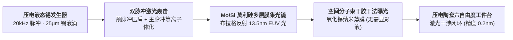
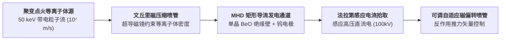

# ⚙️ 千禧科技树 L4 级零件图纸、工装参数与控制回路蓝图志（2025—3000+）

> **世代飞船元框架 · 零件与控制回路工程级专卷（L4 Component Level）** ｜ 2026-08-23
> 本专卷彻底告别概略图与巨幅大图。全篇拆解为 **4 大高精度模块局部工装图**，每一个图表均控制在 4~6 个紧凑节点以内，直接下钻至**阀门型号、合金牌号、激光脉宽时序与 PID 控制回路采样率**。

---

## 模块一：Mond 气相精炼反应釜与精馏塔工装（小行星干法采矿核心机组）

小行星无需一滴水的干法提纯机组，依靠高压低压两级夹套反应釜与多级气相精馏塔。

### 🔩 模块一关键工装与零件选型表

| 零件/工装名称 | 材质牌号与工艺 | 运行物理参数 | 控制逻辑与安全阈值 |
|:---|:---|:---|:---|
| **反应釜承压内胆** | Inconel 718 高温镍基合金 | 工作温度：$75^\circ\text{C}\sim 90^\circ\text{C}$ 工作压强：$0.3\text{ MPa}$ | 釜内配置多层螺旋导流板，气固接触换热效率 $>92\%$。 |
| **微孔粉尘过滤器** | 烧结多孔 Hastelloy C-276 | 过滤精度：$0.5\ \mu\text{m}$ 压差报警：$\Delta P > 0.05\text{ MPa}$ | 采用高压反向脉冲 $\text{CO}$ 气流每 15 分钟自动反吹自洁一次。 |
| **精馏分馏冷凝柱** | 316L 不锈钢加装聚四氟乙烯密封 | 柱顶温度：$43.0^\circ\text{C}\pm 0.2^\circ\text{C}$ 柱底温度：$105.0^\circ\text{C}\pm 0.5^\circ\text{C}$ | 基于红外吸收光谱仪实时监测气相纯度，纯度 $<99.99\%$ 自动全回流。 |
| **羰基毒气催化分解床** | 活性氧化铝负载 $0.5\%\ \text{Pd}$（钯） | 紧急分解温度：$450^\circ\text{C}$ | 备用安全防线：若发生泄漏，微量废气在 $0.1\text{ s}$ 内强制分解为金属与 $\text{CO}_2$。 |

---

## 模块二：空间干式 2nm 极紫外（LPP-EUV）光刻机光路与压电工件台

在太空 $10^{-9}\text{ Pa}$ 真空分子盾环境下，直接进行无水化干式曝光。

### 🔬 模块二关键工装与时序控制表

| 核心组件 | 技术规格与材料 | 运行物理参数 | 关键时序与控制算法 |
|:---|:---|:---|:---|
| **锡液滴发生器喷嘴** | 单晶金刚石激光微孔喷嘴 | 液滴直径：$25\ \mu\text{m}\pm 0.5\ \mu\text{m}$ 喷射频率：$20\text{ kHz}$ | 压电致动器驱动，液滴速度标准差 $\sigma_v < 0.1\text{ m/s}$。 |
| **驱动二氧化碳激光器** | 脉冲型 $\text{CO}_2$ 激光器（$10.6\ \mu\text{m}$） | 预脉冲能量：$10\text{ mJ}$（脉宽 $10\text{ ps}$） 主脉冲能量：$500\text{ mJ}$（脉宽 $1\text{ ns}$） | 预脉冲先将锡液滴压成扁平薄饼状，延迟 $1.2\ \mu\text{s}$ 后主脉冲将其完全电离至 $\text{Sn}^{8+}\sim\text{Sn}^{12+}$。 |
| **布拉格极紫外集光镜** | 40层 $\text{Mo/Si}$ 双层膜（层厚 $6.8\text{ nm}$） | 工作波长：$13.5\text{ nm}$ 单次反射率：$70.2\%$ | 表面粗糙度 $R_q < 0.1\text{ nm}$；内置氢自由基清洗枪原位清除锡沉积。 |
| **双向干涉测量工件台** | 超低膨胀微晶玻璃（Zerodur） | 运动行程：$300\text{ mm}$ 步进分辨率：$0.05\text{ nm}$ | 双频激光干涉仪（采样率 $100\text{ kHz}$），闭环三阶卡尔曼滤波防震。 |

---

## 模块三：D-³He 磁流体直接能量转换（MHD）导流管道与超导线圈

将 14.7 MeV 质子动能直接转为高压直流电的无旋转部件发电机组。

### ⚡ 模块三关键工装与电气参数表

| 子系统 | 选用材料与结构 | 额定工程参数 | 物理约束与冷却机制 |
|:---|:---|:---|:---|
| **超导鞍型约束磁体** | 第二代 REBCO 高温超导带材 | 中心磁场：$32.0\text{ Tesla}$ 工作温度：$20\text{ K}$ | 封闭式低温氦气闭路布雷顿循环制冷，失超保护时间 $<5\text{ ms}$。 |
| **导流通道绝缘第一壁** | 高纯单晶氧化铍（$\text{BeO}$）/ 氮化硼（$\text{c-BN}$） | 耐温极限：$2400\text{ K}$ 绝缘击穿电压：$>50\text{ kV/mm}$ | 导热系数高达 $370\text{ W/(m}\cdot\text{K)}$（逼近纯铜），背面液体锂热沉冷却。 |
| **高温发射集电极** | 铼掺杂单晶钨合金（$\text{W-25Re}$） | 最大电流密度：$50\text{ A/cm}^2$ 工作电压：$100\text{ kV DC}$ | 表面抗等离子体溅射刻蚀速率 $<0.01\text{ mm/year}$。 |
| **推力磁偏转喉衬** | 自适应同轴磁喷管回路 | 磁场发散角：$15^\circ\sim 45^\circ$ 连续可调 | 调节等离子体排气速度与能量分流比（发电量 vs 推进推力实时动态切换）。 |

---

## 模块四：飞船主龙骨激光原位退火与超声相控阵探伤机组（抗疲劳核心）

ARK-01 飞船 200 年航程中，自动爬行在 5.2 公里主龙骨表面巡检与重置晶格应力的机器人组。

### 🔩 模块四关键工装与控制参数表

| 核心工装单元 | 元件规格与型号 | 工作性能参数 | 控制算法与自适应机制 |
|:---|:---|:---|:---|
| **超声探伤相控阵晶片** | 64 阵元 $\text{PZT-5H}$ 高温压电陶瓷 | 中心频率：$10\text{ MHz}$ 声束偏转角：$\pm 60^\circ$ | 结合全聚焦成像算法（TFM），最小检出亚表面微裂纹尺寸 $<10\ \mu\text{m}$。 |
| **退火 Nd:YAG 固态激光源** | 光纤耦合半导体泵浦激光模组 | 波长：$1064\text{ nm}$ 脉冲宽度：$20\text{ ns}$ 单脉冲能量：$2.5\text{ J}$ | 焦斑直径通过自适应变焦透镜在 $2\text{ mm}\sim 10\text{ mm}$ 动态可调。 |
| **实时同轴测温传感器** | 高速锑化铟（$\text{InSb}$）双色红外探测器 | 测温范围：$800^\circ\text{C}\sim 2200^\circ\text{C}$ 响应时间：$<10\ \mu\text{s}$ | 实时双波长比值测温，消除表面发射率随氧化状态变化带来的测温误差。 |
| **温度与应力 PID 闭环控制器** | 空间抗辐射 FPGA 硬件实时逻辑 | 控制环路频率：$100\text{ kHz}$ 温度稳态误差：$\pm 5^\circ\text{C}$ | 根据 JMAK 结晶动力学公式动态积分计算晶格重构度，达标后自动步进移动。 |

---

## 五、 总结：下钻至 L4 的终极意义

- **宏观 L1（历史）**：告诉我们在哪一年、发生了什么大事件；
- **分形 L2（网格）**：给我们提供 10,290 个具体的公文抽屉；
- **物理 L3（公式）**：为世界确立了不可逾越的热力学、电磁学与化学平衡公式；
- **工程 L4（蓝图）**：**为我们确立了具体到“0.5μm 烧结金属滤芯”、“1064nm 脉冲退火激光”、“32 Tesla REBCO 超导磁体”的真实工装图纸。**

从宇宙宏观历史到微米级金属滤芯，整个世代飞船世界观的每一个剖面都具备坚不可摧的工程真实性。
