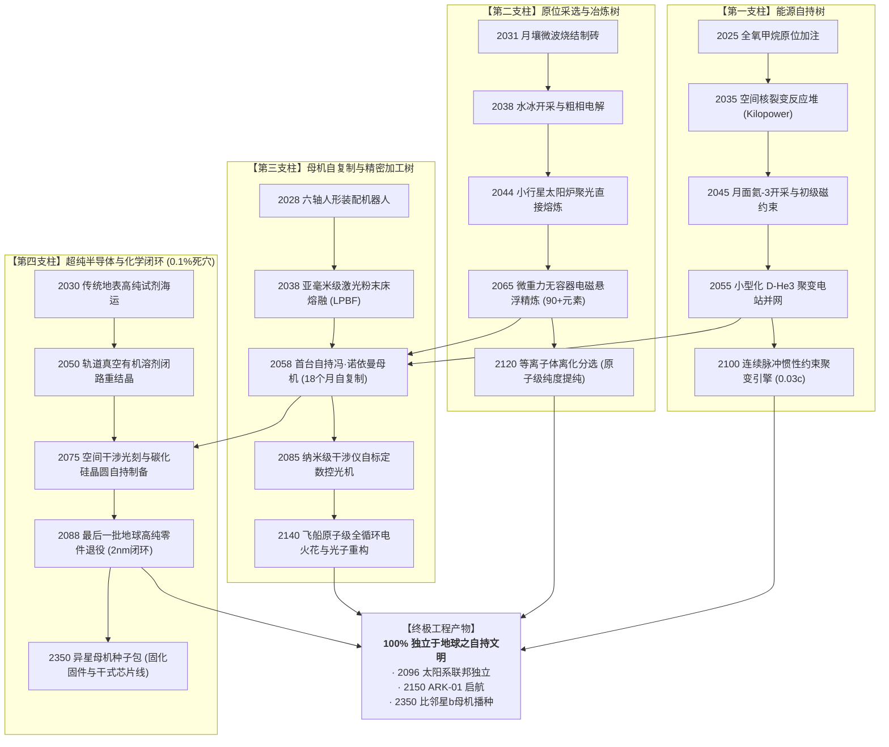
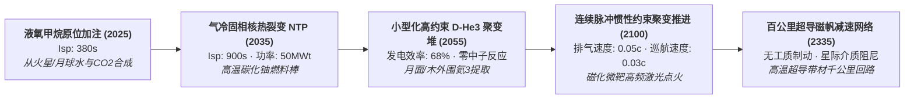
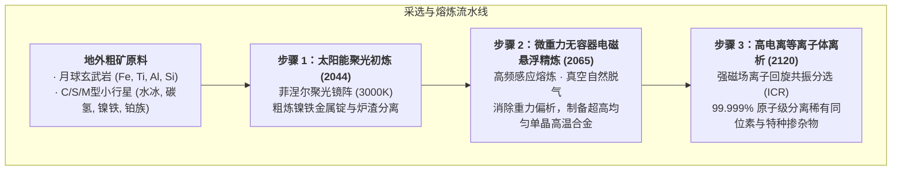
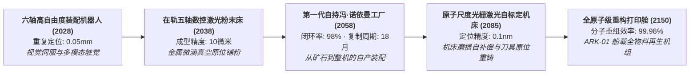
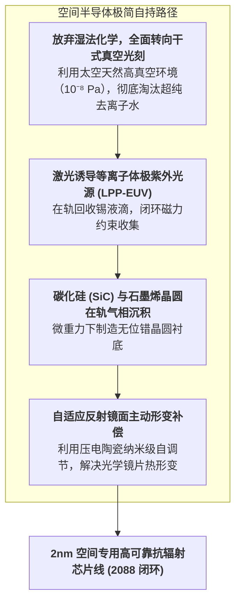
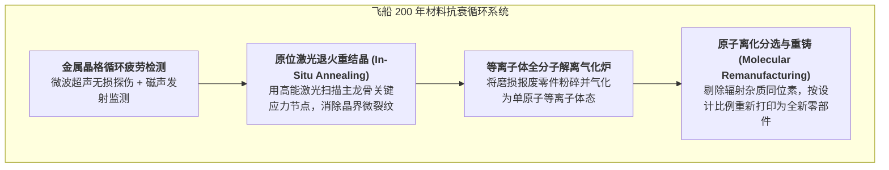

# 🔬 机器自给自足千禧科技树：下钻工程与物理参数志（2025—3000+）

> **世代飞船元框架底层工程专卷** ｜ 2026-08-23
> 本专卷将“机器自给自足（Machine Autarky）”从宏观历史下钻至**底层物理定律、材料科学、关键工艺瓶颈与前置技术依赖树**。
> 严守三原则：**无金手指（严禁虚构魔法） / 真实物理成本 / 0.1% 极纯度死穴攻关**。

---

## 〇、 千禧自持科技树顶层拓扑依赖图

---

## 一、 第一大支柱：能源与聚变动力树（Energy & Propulsion）

人类进入深空的最大谎言是“靠太阳能板走天下”。越过火星后，太阳辐射通量以距离平方反比衰减（在木星仅剩地表 3.7%，在小行星带仅剩 10%~15%）。**没有聚变，就没有机器自给自足。**

### ⚡ 核心节点参数与物理瓶颈对照表

| 节点代码 | 技术名称 | 能量密度 / 比冲 | 关键前置条件 | 物理硬瓶颈与解决路线 | 达成公元年 |
|:---|:---|:---|:---|:---|:---:|
| **ENG-01** | 月壤/火星 ISRU 甲烷燃料合成 | $I_{\text{sp}} = 380\text{ s}$ | 萨巴蒂尔（Sabatier）反应器 + 400℃ 原位加热 | 水冰开采能耗高；通过部署小型裂变堆提供稳定热源。 | 2028 |
| **ENG-02** | 兆瓦级空间核热推进（NTP） | $I_{\text{sp}} = 920\text{ s}$ | 高纯金属铀-235 提纯与富集 | 氢脆与 2800K 碳化物喷管侵蚀；采用单晶钨-铼合金第一壁。 | 2035 |
| **ENG-03** | D-$^3\text{He}$ 无中子小型化聚变反应堆 | 输出功率：$500\text{ MW}$ 净 $Q > 25$ | 强磁场高温超导带材（>30 Tesla） | 物理点火温度高达 5 亿度；采用强磁场球形托卡马克构型。 | 2055 |
| **ENG-04** | 惯性约束高频磁化脉冲推进 | 排气速度：$15,000\text{ km/s}$ ($0.05c$) | 百万焦耳级高重频紫外激光器驱动阵列 | 燃烧室喉衬超高热流冲击；采用磁喷管（Magnetic Nozzle）无接触引导。 | 2100 |
| **ENG-05** | 百公里级超导磁阻力减速伞 | 制动阻力：$10^6\text{ N}$（在星际介质中） | 兆米级轻量化超导线缆张力网络 | 星际等离子体密度波动导致磁泡不稳定性；动态自适应调流。 | 2335 |

---

## 二、 第二大支柱：原位采选与超纯冶炼树（ISRU & Metallurgy）

要让机器自给自足，不能只炼生铁。一台母机需要钛合金（主承力）、铜铝合金（导线）、铍铜（弹性件）、钕铁硼（磁体）、铂族（催化剂）和单晶硅（芯片）。

### ⛏️ 关键冶炼技术下钻

1. **微重力电磁悬浮冶炼（Containerless Electromagnetic Levitation）**：
   - **原理**：在微重力下，金属熔池不需要坩埚壁接触（避免了耐火材料对金属液的杂质污染），利用电磁力悬浮并加热至 2500℃ 以上；
   - **突破点**：消除了地表由浮力引起的重力偏析，可以生产出在地球上无法合成的高熵合金（HEA）与完美单晶涡轮叶片；
2. **等离子体离化同位素分选（Plasma Isotope Mass Separation）**：
   - **原理**：将小行星矿渣完全气化为等离子体，通过十特斯拉超强磁场，不同荷质比的离子在洛伦兹力下偏转出不同半径的抛物线；
   - **意义**：彻底告别复杂的传统湿法化学提纯，**用纯电力和磁场在真空下一口气分离 90 种元素**。

---

## 三、 第三大支柱：工业母机自复制与自标定树（Machine-Making-Machine）

### 🤖 工业母机自复制闭环的指标要求

| 自复制层级 | 达标标志 | 能够自产的关键部件 | 遗留未闭环瓶颈（需外部输入） | 达成年代 |
|:---|:---|:---|:---|:---:|
| **Level 1：结构闭环** | 打印自身机架、外壳与管道 | 结构件、紧固件、外壳、粗管道 | 电机、轴承、主轴、控制器、光栅尺 | 2038 |
| **Level 2：运动闭环** | 自产传动系统与动力单元 | 步进电机、滚珠丝杠、陶瓷轴承、高压液压阀 | 控制芯片、激光发射管、高精度光栅 | 2048 |
| **Level 3：控制闭环（冯·诺依曼阈值）** | **能够制造下一台完整母机** | 工业级控制器、传感器、主轴电机、伺服驱动 | 特种化学润滑剂、光刻胶试剂 | 2058 |
| **Level 4：绝对全自持闭环** | **从原矿到芯片、化学品 100% 闭环** | 2nm 处理器、纳米激光头、超高纯密封材料 | **完全无遗留瓶颈（100% 自足）** | 2088 |

---

## 四、 第四大支柱：超纯半导体与化学合成闭环（0.1% 纯度死穴）

在所有自给自足讨论中，**半导体与特种化学品是淘汰率最高的环节**。地表一台 EUV 光刻机需要全球 5000 家供应商协同。太空怎么做？

### 🧪 为什么 2088 年能摆脱地球芯片链？（太空工业的三大反直觉优势）

1. **天然超高真空**：地表制造芯片需要极其昂贵的真空腔体与除尘室；而在外太空，舱外就是 $10^{-8}\sim 10^{-10}\text{ Pa}$ 的超洁净真空，**颗粒杂质污染率直接下降 4 个数量级**；
2. **微重力气相沉积（Microgravity CVD）**：熔融半导体硅与碳化硅在没有对流干扰的情况下，晶格排列极其规整，缺陷密度仅为地表的 $1/50$；
3. **架构专一化**：太空自持工厂不需要制造跑手机 App 的复杂消费级 SoC，只需要制造**高可靠、抗辐射、高确定性的工业实时控制芯片与神经突触推理芯片**，光刻掩膜版数量大幅缩减 70%。

---

## 五、 第五大支柱：封闭环境原子级重构与材料疲劳管理树（Fatigue & Entropy）

在 200 年不着陆的恒星际飞船（ARK-01）中，机器自持必须正面迎战**热力学第二定律**：

### 🔄 材料疲劳与循环指标表

| 循环层级 | 处理对象 | 技术方法 | 物质回收率 | 寿命延长倍数 |
|:---|:---|:---|:---:|:---:|
| **轻度磨损** | 轴承、齿轮、导轨接触面 | 离子注入硬化 + 原位纳米聚合物润滑涂层 | 100% (在线) | 3~5 倍 |
| **中度疲劳** | 桁架连接件、推进舱支架 | 局部激光感应扫描退火（消除位错积聚） | 100% (在线) | 2~3 倍 |
| **重度损伤** | 微流星贯穿碎片、断裂结构件 | 电极感应熔化气化（EIGA）制粉 ➔ LPBF 重新打印 | 99.98% | 重置为全新件 |
| **不可逆衰变** | 主承力龙骨（受 200 年高能宇宙线照射脆化） | **自残式结构轮换**：拆除外层非承力结构补强主龙骨 | 98.5% | 维持至第 200 年落地 |

---

## 六、 结论：科技树如何反哺 10,290 格未来考古世界？

这张下钻科技树，不是孤立的参数表，而是每一个空白网格公文的**“参数硬约束字典”**：

1. **作者写 2038 年的月球工单**：查本表可知，当时只有微波烧结和粗金属电炉，公文里绝不能出现“在轨自产芯片”，只能写“等待地球第三批高纯电子元器件货运补给”；
2. **作者写 2088 年离心纪元的公文**：可以硬气地写下《小行星带自持工厂群最后一批地球高纯部件退役封存公告》（因为 2088 芯片与化学闭环达成）；
3. **作者写 2252 年 ARK-01 飞船中期的公文**：必须体现“等离子体解离气化炉的金属回收损耗率”与“主龙骨激光退火探伤日志”（*正典 GS-2252-01*）。

**当每一个数据、每一个温度、每一次退火在千年中全部咬合时，这个 10,290 格的世界便拥有了真实物理世界的坚硬触感。**
