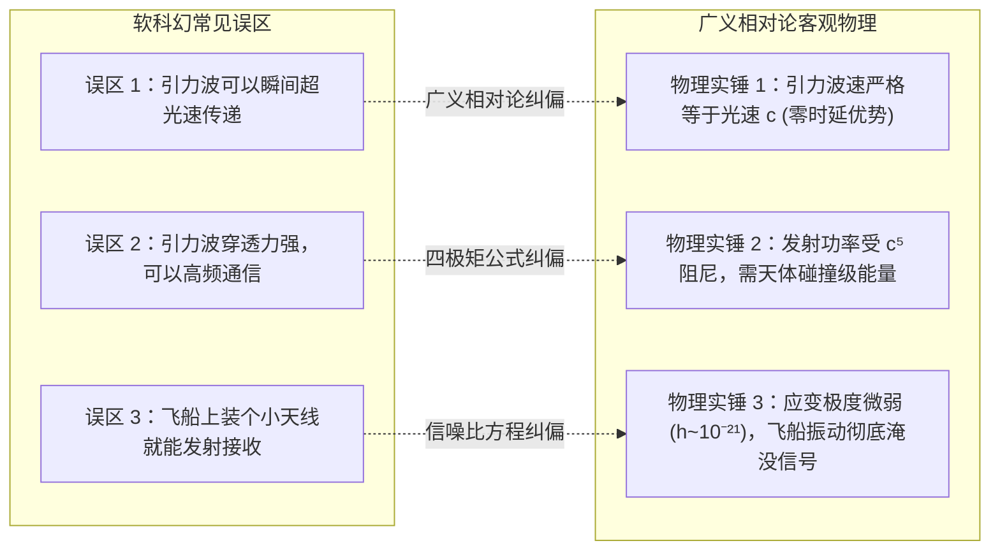

# 🔬 引力波通信备忘录（为何“无引力波通信”是广义相对论的物理常识）

> **元框架底层物理裁决专卷（与《FTL 备忘录》同级）** ｜ 2026-08-23
> 裁决原则：**引力波是广义相对论允许的客观存在，但将其用于星际通信在物理学和信息论上均属于伪科学。**
> 本备忘录从四度时空几何、辐射四极矩公式与信噪比第一性原理，为本世界“全面采用相干激光通信、彻底否定引力波通信”提供严密的理论背书。

---

## 〇、 常见科幻误区 vs 广义相对论第一性原理

---

## 一、 第一大死结：引力波速严格等于光速 $c$（毫无时延优势）

在广义相对论弱场近似下，爱因斯坦场方程化为引力波的线性波动方程：
$$ \square \bar{h}_{\mu\nu} = \left( \nabla^2 - \frac{1}{c^2}\frac{\partial^2}{\partial t^2} \right) \bar{h}_{\mu\nu} = 0 $$
- **物理事实**：引力子是自旋为 2 的无质量规范玻色子，**引力波在真空中的传播速度在数学上严格等于光速 $c$**（2017 年 GW170817 双中子星并合事件实测证实：引力波与伽马射线在经过 1.3 亿光年传播后，到达地球的时间差在 $1.7\text{ 秒}$ 以内，相对误差小于 $10^{-15}$）；
- **结论**：从太阳系发往比邻星 b（4.24 光年），引力波和激光一样，**都需要整整 4.24 年**，光时延一秒都省不下来！

---

## 二、 第二大死结：发射功率分母上的 $c^5$ 阻尼（需要行星级灾变能量）

根据爱因斯坦四极矩辐射公式（Quadrupole Radiation Formula），物体产生引力波的辐射功率为：
$$ P_{\text{GW}} = \frac{G}{5 c^5} \sum_{j,k} \left( \dddot{I}_{jk} \dddot{I}_{jk} - \frac{1}{3} \dddot{I}_{jj} \dddot{I}_{kk} \right) $$

请注意公式前面的耦合常数系数：
$$ \frac{G}{c^5} = \frac{6.674\times 10^{-11}}{(2.998\times 10^8)^5} \approx 2.76 \times 10^{-53} \text{ W}^{-1} $$
- **阻尼量级极其绝望**：$c^5 \approx 2.43\times 10^{42}$ 扮演了全宇宙最残酷的阻尼器；
- **工程计算推导**：
  假设人类制造一台长 100 米、重达 $100,000\text{ 吨}$ 的重型哑铃状金属棒，以材料断裂极限的超高转速（每秒 1,000 转）旋转：
  该装置产生的引力波辐射总功率仅为：
  $$ P_{\text{GW}} \approx 10^{-30} \text{ 瓦特} $$
  *(一万亿亿年也发不出能点亮一个 LED 灯泡的引力波能量！)*
- **结论**：现实中能被测到的引力波，全都是 **30 倍太阳质量黑洞相撞** 瞬间释放出相当于数个太阳全部质量转化为能量的宇宙级灾变。人类要发射引力波信号，必须每秒钟碰撞并销毁一颗小行星。

---

## 三、 第三大死结：探测应变 $h \sim 10^{-21}$（信噪比被飞船机械振动彻底吞没）

引力波引起的时空度规扰动（Strain $h$）随着距离 $r$ 衰减：
$$ h \sim \frac{2G}{c^4 r} \ddot{I} $$
- 地表 LIGO 探测器耗资数十亿美元，建造了 4 公里长臂的高真空激光干涉光路，配备了多级摆动隔震系统，才能勉强捕捉到 $h \sim 10^{-21}$ 的时空涟漪（相当于测量地球到比邻星距离变化小于一根头发丝宽度）；
- **飞船环境的致命噪声**：在 5.2 公里长的 ARK-01 飞船上，旋转居住环轴承的微动、乘员脚步声、水泵运转、甚至激光退火机组的热胀冷缩，产生的微振动应变高达 $h_{\text{noise}} \sim 10^{-6}\sim 10^{-8}$；
- **信噪比（SNR）相差 15 个数量级以上**：飞船上的任何探测器都会被自身结构噪声彻底致盲。

---

## 四、 第四大死结：信道信息带宽（Bandwidth）极低

根据香农信道容量公式 $C = B \log_2(1 + \text{SNR})$：
- 人造机械可能产生的低频引力波频率仅为 $\text{mHz}\sim\text{Hz}$ 级，**每秒钟能承载的信息量不到 $0.001\text{ bit}$（传一个字节需要几小时）**；
- 而 **太赫兹/相干深空激光（Laser Comms）**：
  载波频率高达 $3\times 10^{14}\text{ Hz}$（近红外/紫外），配合“烛照”阵列相干聚束，在 4.24 光年距离上可实现 **$10\text{ Mbps}\sim 1\text{ Gbps}$ 的稳定数据吞吐量**，一次可以传输全套人类基因组库与工业母机固件镜像！

---

## 五、 终极结论与世界观定论

| 对比维度 | 激光通信（真实科学选型） | 引力波通信（虚构伪科学） | 科学裁决 |
|:---|:---|:---|:---|
| **传播速度** | 光速 $c$（4.24 年到比邻星） | 光速 $c$（4.24 年到比邻星） | 速度完全相同，引力波毫无优势 |
| **发射能耗** | 兆瓦级激光阵列（$P \sim 10^7\text{ W}$） | 需行星碰撞级能量（$P > 10^{35}\text{ W}$） | 激光能耗低 28 个数量级 |
| **数据带宽** | Gbps 级（可传全息数据库） | $< 10^{-3}\text{ bps}$（连名字都传不完） | 激光带宽胜出 12 个数量级 |
| **接收难度** | 30m 空间光学望远镜即可接收 | 需 4km 超低噪声干涉仪（飞船自震致盲） | 飞船上无法部署有效引力波接收天线 |

**因此，世代飞船千禧世界观坚定采用「以 72.4 AU 信标 07 号站为骨干的相干激光中继网（GS-2375-01）」，彻底剔除不切实际的引力波通信幻想！**
