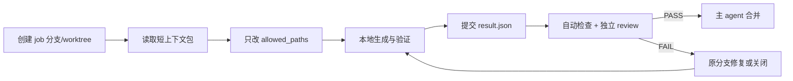

# Agent 沟通与 Git 协作规则 v0.1

日期：2026-09-06。适用于造物产线的多 agent 工作；不修改项目已有共创宪章，只把它落实到工程文件和 Git 操作。

## 1. 沟通原则

Agent 之间不传长篇聊天上下文，按“文件即消息”工作。每个任务有唯一 `job_id`，所有输入和输出都落在任务目录，主 agent 只读取结果摘要。

```text
craft/造物产线/jobs/WO-20260906-001/
  task.yaml          # 主 agent 发布，冻结输入、权限与验收
  context.json       # C0/C1/C2 短上下文，含源文件哈希
  result.json        # 执行 agent 写入，机器可读
  review.md          # 审核 agent 写入，短结论
```

执行 agent 不把完整日志、源码或背景复述到消息中；日志写 `artifacts/logs/` 或任务输出目录，回复只包含 `STATUS/ARTIFACTS/MEASURED/CHECKS/LIMITS/NEXT`。

允许的状态：`PASS`、`FAIL`、`BLOCKED_INPUT`、`NEEDS_DECISION`。`BLOCKED_INPUT` 必须列出缺失的 fact_id 或文件；`NEEDS_DECISION` 必须列出冲突双方和最小决策问题。

## 2. 写作规则

### 设定和证据

- 事实提取写 JSON：`fact_id`、原文位置、适用年代/地点、原句短摘、证据状态、冲突 ID。
- 工程推导写规格卡：输入 fact_id、公式、单位、结果、假设和误差/适用范围。
- 正典创作仍按项目 front matter 和三审制度；agent 不把工作笔记伪装成正典。
- 任何数值没有来源、推导式或假设编号，就不能进入参数文件。

### 代码和模型

- 代码提交只包含实现变更、必要测试和短变更说明；不要把 Blender 日志粘进 Markdown。
- 模型源、参数、接口、验证报告和展示配置分开；模型二进制只在定稿后加入，禁止把临时渲染图反复覆盖进 Git。
- 每个输出记录 `generator_sha256`、`parameter_sha256`、`source_sha256` 和 `output_sha256`。

### 结果模板

```json
{
  "job_id": "WO-20260906-001",
  "status": "PASS",
  "changed_files": [],
  "facts_used": [],
  "assumptions": [],
  "conflicts": [],
  "checks": [{"command": "...", "result": "pass"}],
  "measured": {},
  "limits": [],
  "next_action": ""
}
```

## 3. Git 隔离模型

`main` 或当前正典分支只接受经过检查的合并；任何 agent 都不能直接向它写入。每个 job 使用独立分支或 worktree：

```text
agent/fact/WO-20260906-001
agent/geometry/WO-20260906-002
agent/validate/WO-20260906-003
```

分支只改工单 `allowed_paths` 中的文件。一个资产的源参数只能有一个写入者；接口表和共享组件库属于受保护资源，必须由主 agent 单独合并。

推荐目录所有权：

| 目录 | 默认写入者 | 规则 |
|---|---|---|
| `core/`、`artifacts/writing/` | 主编辑 | agent 只能提交提案或工作文件 |
| `craft/造物产线/jobs/` | 对应工单 agent | 每个 job 独占一个目录 |
| `world/造物/<asset>/generator/` | Blender agent | 同一资产同一时间只开一个 geometry job |
| `world/造物/<asset>/asset.json`、`interfaces.json` | 主 agent | 变更需带依赖影响清单 |
| `world/造物/_registry.json` | 主 agent | 只有验证通过后登记 |
| `ecosystem/` 展示页 | Unity/展示 agent | 不得反写工程参数 |

同一文件冲突时，不让两个 agent 猜着合并：停止后由主 agent 根据事实和 revision 决定。二进制模型冲突不做文本合并，保留两个输出目录，重新生成或由主 agent 选择一个版本。

## 4. 合并顺序与门禁



每个合并请求必须包含：工单 ID、变更文件、来源/假设 ID、验证命令和结果、未验证范围、影响的资产/接口列表。CI 至少运行 Markdown 链接、JSON schema、生成器语法、尺寸/哈希/GLB 往返检查；缺失 result 或超出路径权限即拒绝。

合并前先把目标分支更新到最新版本；发生冲突时由主 agent 处理。合并后删除临时分支，但保留工单结果和审计哈希。严禁 force-push 共享分支，严禁用 `git reset --hard` 覆盖他人工作。

## 5. 并行策略

可以并行：不同资产、不同来源的事实提取、只读验证、独立展示配置。必须串行：同一参数文件、同一共享接口、同一模型源、正典和内核修改。

一个批次最多两个执行 agent 同时写文件；更多 agent 只做只读检查。若两个 job 都需要改共享接口，先由接口 job 完成并合并，再重新生成下游资产。这样 Git 冲突在接口层被截住，而不是在最终二进制阶段爆发。

## 6. 写作风格与主 agent 介入

工作文件用清楚的工程语言，短句、单位完整、状态明确；世界内产物继续遵守档案口吻，不能把 `fact_id`、GitHub、agent 或模型术语写进正文。

主 agent 只在正典冲突、共享接口变化、跨资产依赖、验证连续失败两次、或验证等级提升时介入。其他 agent 只完成其工单，不自行扩大目标。
