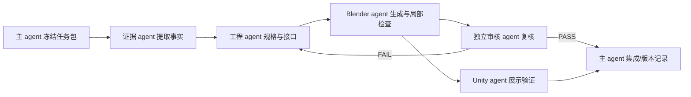

# 省 Token 多 Agent 协作方案 v0.1

日期：2026-09-06。适用于造物产线；不改变世界规则、正典和三审制度。

## 核心原则

主 agent 只保留三类工作：全局取舍、跨文档冲突裁决、最终验收。其余工作以短工单交给专职 agent。任何 agent 不得自行通读整个仓库；它只接收一个“上下文包”和一个明确的交付契约。

这样节省 token 的关键不是让每个 agent 写得更短，而是避免重复输入：世界规则读一次，工程规则读一次，资产任务只传递与该资产有关的事实 ID、参数和验收条件。

## 角色与边界

| 角色 | 负责 | 不负责 | 交付长度 |
|---|---|---|---:|
| 主架构 agent（本会话） | 资产族架构、证据裁决、参数契约、集成和最终验收 | 重复建模、逐项查资料、全库摘要 | 每轮 1 个决策记录 |
| 设定/证据 agent | 从指定文件提取事实，标注来源和矛盾 | 自行改变世界设定、写模型 | ≤20 行 JSON/表格 |
| 工程 agent | 将事实转为规格卡、接口、约束和检查项 | 凭感觉改历史参数、渲染美化 | 1 个规格卡 + 检查表 |
| Blender agent | 按已冻结参数生成/修改模型、导出、局部验证 | 重新解释任务、扩大范围 | 文件 + ≤15 行结果 |
| Unity/展示 agent | 导入已验证模型、场景与交互 | 修改 Blender 源或工程参数 | 文件 + ≤10 行结果 |
| 审核 agent | 按验收清单找反例和回归问题 | 重新设计整件资产 | PASS/FAIL + 证据 |

同一 agent 可以承担多个角色，但一次工单只允许一个角色；主 agent 不把同一工作同时发给两个 agent，除非是在做独立交叉审核。

## 三级上下文包

### C0：固定规则包（只读缓存）

每个 agent 只读这段摘要：无金手指、时间/空间坐标、证据分级、资产 ID 与 GS 编号分离、路径和单位约定、不可认证事项必须显式标注。若任务触及某条规则，再按需打开原文的具体章节。

### C1：资产族包（按族复用）

包括产品族定义、共享接口、材料候选、命名、坐标系、版本状态和已知矛盾。货箱族的 C1 包不带 ARK 全船、七纪元全史或无关正典。

### C2：单任务包（一次性发送）

只包含：目标、输入 fact_id、允许改变的参数、禁止改变的参数、输出路径、验收命令、失败格式。任务完成后 agent 只返回工件路径、摘要和检查结果，不回传大段源码或重复背景。

## 工单契约

```yaml
job_id: EXP-LUN-CARGO-001-r2
role: blender
context: C0 + C1:cargo-family
goal: add a functional sliding retention pin and verify its travel
inputs:
  - fact_id: cargo.non_pressurised.spare_parts_use
mutable: [pin_travel_m, bore_clearance_m]
frozen: [asset_id, units_m, body_envelope, interface_origin]
outputs: [blend, glb, inspection.json, preview.png]
checks: [python3 scripts/verify_cargo_export.py --directory <out>]
limits: [not_load_certified, not_leak_certified]
return: "paths, PASS/FAIL, measured values, unresolved questions; <=15 lines"
```

如果 agent 发现输入不足，不要重新搜索整个项目；它返回 `BLOCKED_INPUT`，列出最多三个缺失 fact_id。主 agent 再决定是否补读或改工单。

## 任务流水线



证据提取、资料核验和历史线索检索可以并行；依赖前置规格的建模必须串行。Unity 展示只在 GLB 往返通过后启动。

## Token 预算与停止规则

一次首件变更的默认预算：主 agent 800–1200 tokens；证据 agent 400–700；工程 agent 600–900；Blender agent 300–600；审核 agent 250–500；总量约 2.4k–3.9k tokens，不把二进制模型算入对话 token。

达到以下任一条件立即停止扩写并回报：已得到所需事实；检查命令通过；新增讨论只会重复已知背景；或任务超出工单的 mutable 字段。失败只回传第一处可定位错误和重现命令。

不要把 Blender 日志、完整 JSON、网页全文或渲染图像编码到 agent 回复；写文件并返回路径。主 agent 只读摘要、指标和异常片段。

## 并行与合并规则

- 可并行：不同资产、不同来源的证据提取、独立的 Blender 与文档检查。
- 不并行：同一参数文件的写入、同一模型的生成、正典/内核修改、最终发布。
- 每个 agent 写自己的输出目录或工作树；主 agent 通过参数文件、报告和哈希合并，不通过聊天复制代码。
- 同一资产只允许一个“源参数文件”和一个“生成器版本”；展示层不能反写源参数。

## 资产工程验收门

每件资产按四道门推进：

1. **E0 证据门**：每个非显然参数都有来源或 `experimental_assumption` 标签。
2. **E1 几何门**：包围盒、坐标、组件命名、接口位置可复现。
3. **E2 运动门**：明确运动件的行程、间隙、碰撞抽样和失效状态；没有运动就不要伪造动画。
4. **E3 展示门**：GLB 往返、Unity 导入、相机/灯光与工程源分离。

E0–E1 通过才能生成灰模；E2 通过才能称为“功能几何”；E3 通过才能进入共享资产库。强度、热、气密和辐射认证另设专业验证，不因视觉完成而自动通过。

## 与世界正典的关系

产线实验资产先用 `EXP-` 编号，不能自行获得 GS 编号。资产只有在被世界内文书引用并通过既有审核后，才进入正典；此时保留产品族、型号、实例和版本的关系。矛盾修复遵守“后文不能改前档”，设定层变化走现有升格流程。

## 首轮落地

当前货箱样品已经完成 E0–E1 与部分 E2/E3。下一单只做一个局部：把四角定位销、孔和释放行程改成可测量的功能组件；不扩大到全船、材质库或批量资产。完成后再将 C1 包抽象成通用“货箱/底座接口族”。
