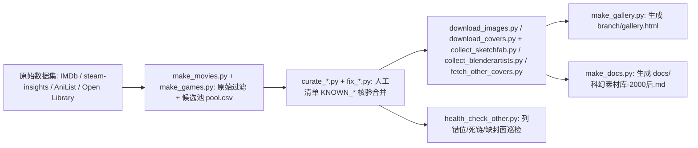

# Generation Ship Wiki — 聚合全文（Agent 专用）

> 本文件由 openwiki/ 所有页面聚合而成（openwiki/merge_all.py 生成），供 agent 一次性读取。
> 单页版本见各子目录。入口导航：index.md / quickstart.md
> 维护：跑 `bash docs/openwiki_update.sh` 手动更新并重新聚合


---

<!-- 来源: _plan.md -->

---
type: 计划
title: OpenWiki 维护更新计划（2026-08-14 后）
description: 基于仓库变更证据的文档影响计划：ALL.md/merge_all.py 已恢复、其他-AI精选 39→47、创作区新增文明天顶与文明扩散时间轴
tags: [plan, maintenance, openwiki]
timestamp: 2026-08-14
---

# 文档影响计划（维护更新）

上次成功更新：`gitHead b35fc5366ee66d732194d77c39feb0e71539849e`（2026-08-14T05:37Z，zh-CN）。Shell 受限，无法执行 git；以下变更通过「当前源码/CSV/文档 vs 现有 wiki 页面」逐项比对得出。

## 受影响系统清单与处置

### 1. OpenWiki 维护链路（ALL.md / merge_all.py / openwiki_update.sh）
- 证据：仓库现存 `/openwiki/ALL.md`（85KB 聚合全文）与 `/openwiki/merge_all.py`；`docs/HANDOVER.md` §8 与 §10、`README.md` 顶部均声称 ALL.md 存在；`docs/openwiki_update.sh` 第 2 步运行 `python3 openwiki/merge_all.py`。
- 现状：wiki `docs/handover.md` 的「文档与现状的出入」仍声称「ALL.md 与 merge_all.py 均不存在，update.sh 第 2 步会失败」——已过时。
- 处置：更新 `/openwiki/docs/handover.md`（更正该条 + 补充 OpenWiki 中文版 26 篇/ALL.md 聚合说明）；同步修正 `/openwiki/ALL.md` 中镜像的同一段落及其 front matter（移除 `openwiki_generated` 回退标记）。

### 2. 素材库「其他-AI精选」规模 39 → 47
- 证据：`branch/other/ai_curated.csv` 数据行 47 条（8-11：12 条、8-12 两批 15 条、8-14 第三批 8 条，见 `branch/other/README.md`「已收录（47 条，2026-08-14）」）。
- 影响页：`quickstart.md`（导航条目）、`docs/handover.md`（素材库规模表 + 项目状态行）、`reference/categories.md`（🧠 章节标题 + 已覆盖维度）、`reference/library_overview.md`（统计段）、`reference/gallery.md`（八区 Tab 行），以及 `ALL.md` 中对应镜像段落。
- 处置：全部更新为 47；categories.md 补充 8-14 第三批新维度（塔比星/NaissanceE/Kaiba/与拉玛相会/melodysheep/The Line/猎户座核脉冲/特德·姜）。

### 3. 创作区新增：文明扩散时间轴（母题）+ 文明天顶（工程）
- 证据：`docs/creation/README.md` 新增「创作母题:文明扩散时间轴」段；`docs/creation/文明扩散时间轴_梗概.md`（五时代 + 四大奇点）；`docs/creation/svg/文明扩散时间轴_2025-2200.svg`；`docs/creation/文明天顶/`（README + compose_ceiling.py + 9 格装帧 v1 SVG）；`docs/creation/文明天顶_构思.md`；`docs/creation/svg/文明天顶_构图稿.svg`、`文明天顶_风格小样.svg`；`docs/HANDOVER.md` §10「创作区进展（2026-08-14 大更新）」。
- 现状：wiki `docs/creation_assets.md`（timestamp 2026-08-13）作品索引止于 08-13，完全未覆盖上述内容。
- 处置：扩展 `creation_assets.md`——新增「文明扩散时间轴（创作母题）」与「文明天顶（教堂穹顶×版画）」两节、更新作品索引表、补充 ARK-01 任务文件与三体关联线索；同步更新 ALL.md 镜像段。

### 4. 生图配额细节（HANDOVER §10）
- 证据：`docs/HANDOVER.md` §10「本月已用约 20 张（006-011+天顶 9 格+测试），还剩约 30 张，08-13 23:59 重置」。
- 现状：wiki `docs/handover.md` 生图待办仅记「配额 50 张/月」。
- 处置：在 handover.md 创作/生图待办中补充 HANDOVER §10 的配额用量口径（与 future_world_art.md 的「方法论版 3 张后余约 42 张」口径并存，注明来源差异）。

### 5. 未受影响（证据核实后保持不动）
- 设计/物理/任务架构/需求/人口农业（讨论稿 v0.1 未变）；NASA 影像（16 张未变）；灵感来源地图（2026-08-11 未变）；七类素材规模 494/103（CSV 实测 33+40+30=103，与 wiki 一致；`branch/README.md` 与 `docs/科幻素材库-2000后.md` 的 104/495 为旧值，wiki 已如实标注）。
- 路由关系：quickstart 变更路由表各入口与现源码一致，无需改动。

## 关系建模（概念链接）
- docs/handover.md <-- 维护/生成 --> openwiki 聚合链路（ALL.md、merge_all.py、docs/openwiki_update.sh）——在同一页内说明，不需要新概念页。
- docs/creation_assets.md <-- 母题支撑 --> 文明扩散时间轴；<-- 子工程 --> 文明天顶；<-- 联动 --> future_world_art.md（天顶底稿走生图方法论）、nasa_reference.md（环内景触发「环里的那座湖」）、reference/library_overview.md（收集 vs 自产分工）。全部在同一页展开，无需新建页面。


---

<!-- 来源: _skeleton.md -->

---
title: 已弃用的骨架文件
description: 此骨架文件在 wiki 初始化完成后已弃用
type: 已弃用
tags: [meta]
---
<!-- 此骨架文件已保留，但在 wiki 初始化完成后即被弃用。完整 wiki 已创建，不再需要此文件。 -->


---

<!-- 来源: design/index.md -->

# 目录

- [phase0](phase0/)
- [phase1](phase1/)


---

<!-- 来源: design/phase0/index.md -->

# 文件

- [人口与农业计算](population_agriculture.md) - 用于闭环生命保障的人口规模估算与农业面积需求
- [核心任务需求](requirements.md) - 世代飞船的核心任务要求和物理约束


---

<!-- 来源: design/phase0/population_agriculture.md -->

---
type: 概念
title: 人口与农业计算
description: 用于闭环生命保障的人口规模估算与农业面积需求
tags: [design, phase0, population, agriculture, life-support]
---
# 人口与农业计算

## 人口需求

200 年星际殖民任务的最小可行人口：

- **创始人口**：约 1,000–2,000 人
  - 最小可行创始人口研究表明大约需要 100–160 人，但这是保持遗传多样性的绝对最低值
  - 对于跨越多代人的殖民任务，1,000–2,000 人的较大创始人口可提供更好的遗传多样性和应对意外损失的冗余

- **抵达人口**：约 10,000–20,000 人
  - 在受控的人口增长率下，200 年内的预期增长
  - 足够的人口以在抵达后建立自给自足的殖民地

## 农业面积需求

对于实现 90% 以上食物闭环率的闭环生命保障：

- 基于 BIOS-3（苏联封闭生态实验）和现代 ECLSS（环境控制与生命保障系统）的研究
- BIOS-3 实现了 85% 的闭环率，其配置包括：
  - 每人 10–15 m² 的种植面积用于粮食生产
  - 用于氧气生产和二氧化碳固定的小球藻
- 现代混合作物（谷物、蔬菜、蛋白质）的估算值处于同一范围

| 系统 | 人均面积 | 1,000 人总计 | 2,000 人总计 |
|--------|-----------------|-------------------------|-------------------------|
| 粮食生产 | 10–15 m² | 10,000–15,000 m² | 20,000–30,000 m² |
| 藻类氧气生产 | 1–2 m² | 1,000–2,000 m² | 2,000–4,000 m² |
| **总计** | **11–17 m²** | **11,000–17,000 m²** | **22,000–34,000 m²** |

该农业面积必须纳入旋转栖息环内。

## 栖息地规模影响

采用双反向旋转栖息环（以抵消角动量）时，每个环必须容纳大约一半的农业和生活总面积。

当前基线：每个栖息环半径 250–500 m，这提供了足够的表面积，同时将旋转速率保持在 2 rpm 以下（NASA 关于可接受的科里奥利效应的准则）。

## 参见
- [NASA 真实影像参考](../../docs/nasa_reference.md) - SP-413 万人栖息地质量/面积预算表是 Phase 0 核算锚点
- [任务架构](../phase1/mission_architecture.md) - 双环栖息地在船上的位置
- [需求](./requirements.md)


---

<!-- 来源: design/phase0/requirements.md -->

---
type: 概念
title: 核心任务需求
description: 世代飞船的核心任务要求和物理约束
tags: [design, phase0, requirements]
---
# 核心任务需求

整个设计都受一个基本需求约束：进行一次为期200年、前往附近恒星且无法补给的航行。

## 任务参数

| 参数 | 值 | 理由 |
|-----------|-------|-----------|
| 目的地 | 比邻星 b（4.24 光年） | 距离太阳系最近的潜在宜居岩石行星 |
| 任务时长 | 共 200 年 | 约15年加速 + 约170年巡航 + 约15年减速 |
| 巡航速度 | ~0.03c（9,000 km/s） | 200 年航行距离的算术必然要求 |
| 初始人口 | ~1,000-2,000 | 最小可行的创始人口 |
| 抵达人口 | ~10,000-20,000 | 200年后足以进行殖民 |

## 关键约束

1. **无补给**：飞船必须在没有外部维护或补给的情况下完全独立运行200年。
2. **抗辐射**：必须承受200年累积的银河宇宙辐射（GCR）和偶尔发生的太阳质子事件（SPE）。
3. **闭环生命支持**：水、氧气和氮气的闭合率必须接近100%；食物的闭合率必须至少达到90%。
4. **长期可靠性**：系统必须为200年运行寿命设计，并具备冗余系统和太空维护能力。

## 由约束得出的基本结论

200年的约束锁定了整个设计包络：

- 化学推进不可能（比冲 Isp 300-450 秒太低）
- 核热/核电推进也不可能（Isp ~10⁴ 秒需要物理上不可能的质量比）
- **唯一可行的解决方案：聚变脉冲推进**，源自 Daedalus/Longshot 谱系，Isp 约 10⁶ 秒

## 主要未决问题

- 辐射屏蔽的最佳质量分配（主动磁屏蔽与被动水/推进剂屏蔽）
- 200年内可实现的闭环生命支持闭合率
- 关键电子设备的冗余策略（无法在太空中制造新芯片）

## 另见
- [项目阶段](../../project/phases.md) - 阶段 0 的详细质量/电力预算交付物（尚未落成文件，见[交接与待办](../../docs/handover.md)待办清单）
- [人口与农业](./population_agriculture.md)
- [任务架构](../phase1/mission_architecture.md)


---

<!-- 来源: design/phase1/index.md -->

# 文件

- [任务架构](mission_architecture.md) - 总体任务与飞船架构配置
- [物理与推进](physics.md) - 世代飞船的物理计算与推进系统分析


---

<!-- 来源: design/phase1/mission_architecture.md -->

---
type: 概念
title: 任务架构
description: 总体任务与飞船架构配置
tags: [design, phase1, architecture, configuration]
---
# 任务架构

## 飞船总体配置

飞船采用 Daedalus 风格的“列车”布局：

```
[Forward Payload Module] → [Central Double Counter-Rotating Habitat Rings] → [Water/Propellant Tanks (Radiation Shielding)] → [Rear: Two-Stage Fusion Propulsion + Radiators + Magnetic Sail]
```

### 各部分职责

1. **前部载荷模块**
   - 包含用于目的行星的登陆艇和前哨模块
   - 最前端设有前向惠普尔屏蔽层，用于抵御星际尘埃

2. **中央居住区**
   - 两个反向旋转的居住环提供人工重力（1g），并抵消总角动量
   - 容纳生活区、农业区、生命保障系统、工业与维护设施
   - 水/推进剂储罐环绕居住区，提供被动辐射屏蔽

3. **后部推进段**
   - 第一级（加速）聚变推进系统（加速后抛弃）
   - 第二级（减速）聚变推进系统
   - 用于排出废热的大型散热器
   - 折叠式磁帆，在减速阶段展开

## 总体质量分布

- **最大质量部件**：辐射屏蔽（主动磁屏蔽 + 被动水/推进剂储罐）
- **第二大**：居住区与生命保障系统
- **第三大**：推进系统与推进剂
- **最小**：有效载荷与登陆艇

## 关键设计特性

### 双反向旋转居住环

- 通过离心力提供 1g 人工重力
- 反向旋转可抵消整艘飞船的净角动量，简化姿态控制
- 半径 250–500 m 时转速约为 1.2–1.9 rpm，符合 NASA 关于可接受科里奥利效应的指南（≤ 2 rpm）

### 被动辐射屏蔽

- 环绕居住区的水与推进剂储罐具有双重用途：
  1. 储存推进剂和生命保障用水
  2. 针对银河宇宙射线提供有效辐射屏蔽
- 与主动超导偶极屏蔽相结合，提供额外保护

### 两级推进

- 加速后抛弃第一级可显著降低巡航质量
- 整个任务只需携带所需的减速推进系统和推进剂
- 提高整体质量效率

## Mermaid 图：总体架构


## 另请参阅

- [物理与推进](./physics.md)
- [NASA 真实影像参考](../../docs/nasa_reference.md) - 环形栖息地（SP-413）与推进段外形参考
- [需求](../phase0/requirements.md)


---

<!-- 来源: design/phase1/physics.md -->

---
type: 概念
title: 物理与推进
description: 世代飞船的物理计算与推进系统分析
tags: [design, phase1, physics, propulsion, fusion]
---
# 物理与推进

## 推进需求

要在 200 年的任务时间线内达到 0.03c（9,000 km/s）的速度，对比冲（Isp）的要求极为苛刻：

- **化学推进**：Isp 300-450 秒——无法以合理的质量比达到所需速度
- **核热/核电推进**：Isp ~10⁴ 秒——所需质量比为 e⁹⁰，这在物理上不可能
- **聚变脉冲推进**：Isp ~10⁶ 秒——唯一可行的解决方案

## 聚变脉冲推进（Daedalus/Longshot 谱系）

本设计沿用了 Daedalus/Longshot 的惯性约束聚变脉冲推进方案：

- **比冲**：约 1,000,000 秒
- **减速所需质量比**：e^(9000/9800) ≈ 2.5——这在技术上可行
- **燃料**：氘-氦³（Deuterium-He³）靶丸，由电子束或激光驱动器点火

## 两级架构

该飞船采用两级架构以最小化总质量：

1. **第一级（加速级）**：提供初始加速约 15 年，直到达到巡航速度，然后在巡航期间被抛弃以减小质量
2. **第二级（减速级 + 载荷）**：携带居住舱、载荷以及最终减速所需的推进系统

## 磁帆制动

在最终接近并减速进入目标恒星系统时，磁帆可在不消耗额外推进剂的情况下提供额外制动力：

- 利用与星际介质和恒星风相互作用产生的磁阻力
- 减少减速所需的推进剂质量
- 部署后没有活动部件的被动系统

## 时间线分解

| 阶段 | 持续时间 | 描述 |
|-------|----------|-------------|
| 加速 | 约 15 年 | 第一级推进以达到 0.03c 巡航速度 |
| 巡航 | 约 170 年 | 系统稳态运行，滑行至目的地 |
| 减速 | 约 15 年 | 第二级推进 + 磁帆制动 |
| **总计** | **200 年** | |

## 星际尘埃防护

在 0.03c 速度下，即使是微小的星际尘埃粒子也拥有巨大的动能。飞船前端需要安装**惠普尔护盾**（双层），以保护船体免受侵蚀和损伤。

## 主要参考文献
- Project Daedalus（代达罗斯计划；英国星际学会，1978 年）——最初的聚变脉冲恒星飞船设计
- Project Longshot（远射计划；美国海军学院，1988 年）——最接近的现有工程参考
- Project Icarus——Daedalus 的当代续作研究（聚变推进），见[概念讨论笔记](../../docs/discussion_notes.md)
- Atomic Rockets——星际推进工程参数参考
- NASA 真实影像参考：[NERVA 核热火箭与猎户座核脉冲推进](../../docs/nasa_reference.md)是聚变脉冲级构型的现实锚点

## 另见
- [任务架构](./mission_architecture.md)
- [需求](../phase0/requirements.md)
- [项目阶段](../../project/phases.md) - 质量预算（阶段 0 交付物，尚未落成文件）


---

<!-- 来源: docs/creation_assets.md -->

---
type: 概念
title: 原创创作区
description: 自产内容区（docs/creation/）：灵感笔记机制、方舟号 ARK-01 设定、文明扩散时间轴创作母题、《文明天顶》工程、短篇、SVG 草图与 Strudel 音乐实验
tags: [creation, writing, art, music, ar-k01]
timestamp: 2026-08-14
openwiki:
  roles: [domain, workflow]
  change_kinds: [creation]
  source_paths: [docs/creation/README.md, docs/creation/灵感笔记.md, docs/creation/music/README.md, docs/creation/文明扩散时间轴_梗概.md, docs/creation/文明天顶/README.md, docs/creation/文明天顶_构思.md]
---

# 原创创作区（Creation）

源目录 [`docs/creation/`](../../docs/creation/)：pi 自主创作的内容——文字直接写，草稿用 SVG/Canvas 代码手绘。与 branch/ 素材库（收集别人的）相对，这里是**自产**的。

## 运转机制

**平时搜集，随手记录，偶尔展开**——pi 在每日 AI 精选扩充/素材维护/生图等过程中，碰到有趣的东西、想创作点什么，先记进[灵感笔记](../../docs/creation/灵感笔记.md)（一条一行也行）；日后某个灵感长大了，再展开成正式作品并回链。让创作从搜集里自然长出来。

## 实现方式

| 形式 | 做法 | 目录 |
|---|---|---|
| 原创文字（设定/短篇/笔记） | 直接写 markdown，入库即在线可读 | `writing/` |
| 草稿/示意图 | 手写 SVG 矢量代码，浏览器直接渲染 | `svg/` |
| 生成艺术 | 单文件 HTML + Canvas/p5.js，GitHub Pages 直接跑 | `gen-art/` |
| AI 成品图 | 火山方舟 Seedream / ChatGPT 生成 | `../未来世界_生图/`（见 [AI 生图集](./future_world_art.md)） |

## 作品索引

| 日期 | 内容 | 文件 |
|---|---|---|
| 2026-08-13 | 📓 创作灵感笔记（随手记机制） | [`docs/creation/灵感笔记.md`](../../docs/creation/灵感笔记.md) |
| 2026-08-13 | 🛸 方舟号 ARK-01 · 环形剖面概念草图（演示作） | [`docs/creation/svg/ark01_ring_draft.svg`](../../docs/creation/svg/ark01_ring_draft.svg) |
| 2026-08-13 | 📖 《12-B 层》· 短篇（船上考古学，首篇成稿） | [`docs/creation/writing/12-B层.md`](../../docs/creation/writing/12-B层.md) |
| 2026-08-13 | 📖 《C 区的曲子》· 短篇（飞船的声音设计，同题） | [`docs/creation/writing/C区的曲子.md`](../../docs/creation/writing/C区的曲子.md) |
| 2026-08-13 | 🎵 Sector C Suite · Strudel 四层曲 | [`docs/creation/music/`](../../docs/creation/music/) |
| 2026-08-14 | 🗺 文明扩散时间轴（创作母题）· DK 范长卷 SVG | [`docs/creation/svg/文明扩散时间轴_2025-2200.svg`](../../docs/creation/svg/文明扩散时间轴_2025-2200.svg) |
| 2026-08-14 | 📜 文明扩散时间轴 · 梗概（五时代+奇点索引） | [`docs/creation/文明扩散时间轴_梗概.md`](../../docs/creation/文明扩散时间轴_梗概.md) |
| 2026-08-14 | ⛪ 《文明天顶》· 工程目录（九格 v1 全部完成 + 总图） | [`docs/creation/文明天顶/`](../../docs/creation/文明天顶/) |
| 2026-08-14 | 🏛 《文明天顶》· 构思优化案（十格天顶+金缮裂痕+三代血脉） | [`docs/creation/文明天顶_构思.md`](../../docs/creation/文明天顶_构思.md) |

## 方舟号 ARK-01 世界观

灵感笔记中的核心创作线：给世代飞船起名字、定参数、写编年史，让生图不再是孤立的图。ARK-01 衍生方向：① 编年史短篇（第 1 年/第 50 年/第 137 年三个切片）② 飞船内部分区详图（居住环一层平面图）③ 「船上的一天」生成艺术（昼夜循环动画）。已落地的代表主题：

- **船上考古学**（《12-B 层》）：第 137 年，船员在维修通道深处发现第 1 代船员的涂鸦与遗物——飞船本身就是考古现场。
- **飞船的声音设计**（《C 区的曲子》）：启航时每个舱段有专属环境音乐，137 年设备老化后音高漂移、循环错位，音乐在变异。
- **三体关联（待展开，HANDOVER §10）**：纪元纪年法（危机纪元→启航纪元）可用于 ARK-01 世界观；星舰文明（蓝色空间号）与 ARK-01 是「黑暗森林版 vs 冗余备份版」对照；候选：①《ARK-01 纪年法》设定文档 ②星舰文明对照短篇 ③三体元素进天顶 v2。

## 音乐实验（Strudel）

《C 区的曲子》· Sector C Suite (ARK-01, Year 137) 为 Strudel（strudel.cc）在线作曲的四层结构：

| 层 | 名称 | 含义 | 技术实现 |
|---|---|---|---|
| L1 | Earth Backup | 地球备份·原曲（干净、对齐） | 钢琴和弦 Am-F-C-G，无修饰 |
| L2 | The Decay | 第 137 年的活版本 | `slow(8.03)` 循环微拉长→与备份永不重合缓慢错位；音高慢漂移；偶发丢音 |
| L3 | The Hull | 船体低鸣 | pads 低音垫，慢漂移模拟金属热胀冷缩 |
| L4 | The Pump | 农业环 3 号水泵 | 三角波琶音，偶发失稳像老水泵喘振 |

核心手法是**循环错位**（时间上的「腐烂」）：8 拍主题被拉成 8.03 拍，与备份每 100 循环差 3 拍——100 年后就是完全不同的歌，但每一刻听起来都几乎一样。技术备忘：Strudel 只播放最后一条表达式，多层必须包 `stack(...)`；链接格式为 `https://strudel.cc/#` + base64 编码的完整脚本。

## 创作母题：文明扩散时间轴（2026-08-14 固化）

[`docs/creation/文明扩散时间轴_梗概.md`](../../docs/creation/文明扩散时间轴_梗概.md) 是创作区的**内容底座**，配套 DK 范长卷 [`docs/creation/svg/文明扩散时间轴_2025-2200.svg`](../../docs/creation/svg/文明扩散时间轴_2025-2200.svg)（1080×6450，五阶段+奇点带+四规律+反哺）。原则：**梗概先行，细节后填**——每个点状标记都是将来可展开成短篇/图/音乐的种子。

五个时代（技术不是平滑上升，而是 泡沫→破裂→衰退→博弈→重建 的循环；太空竞赛靠大国博弈驱动）：

| 时代 | 年份 | 主线 |
|---|---|---|
| Ⅰ 白领的冬天 | 2025-2035 | AI 崩塌认知劳动成本；太空竞赛作为新冷战被点燃 |
| Ⅱ 军备与重构 | 2035-2050 | 衰退出清后重构；★ AGI 自主科研（智能爆炸起点）；第一代太空蓝领 |
| Ⅲ 后稀缺雏形 | 2050-2080 | 制造成本逼近「原料+能源」；★ 机器人自复制工厂（产能奇点）；旋转栖息地工程化 |
| Ⅳ 文明扩展期 | 2080-2150 | 万人级栖息地；世代飞船被认真规划——动因是**冗余需求**；★ 2100 聚变脉冲推进样机（ARK-01 推进方案技术祖先） |
| Ⅴ 星际尺度期 | 2150-2200+ | **2150 ARK-01 启航 ★ 本项目时代锚点**；2200 抵达比邻星 b，磁帆制动 |

四大奇点索引：AGI 自主科研（~2035-45）、聚变并网（~2038）、机器人自持工厂（~2050s）、聚变脉冲推进（~2100）+ 闭环生命支持 100%（~2130，世代飞船门票）。已落作品对号入座：《12-B 层》《C 区的曲子》属于 2150+ 星际尺度期（ARK-01 船上纪事）。时间轴是世代飞船主设计（见 [概念讨论笔记](./discussion_notes.md) 的物理推导）与创作区之间的叙事桥：设计给出「怎么飞」，时间轴给出「为什么飞、什么时候飞」。

## 《文明天顶》工程（教堂穹顶×版画巨幅画布）

终极视觉形态：教堂天顶 × 浮世绘/版画的巨幅画布，世代飞船项目的「西斯廷天顶」。源文件：[构思](../../docs/creation/文明天顶_构思.md)、[构图稿](../../docs/creation/svg/文明天顶_构图稿.svg)、[风格小样](../../docs/creation/svg/文明天顶_风格小样.svg)、[工程目录](../../docs/creation/文明天顶/README.md)。

- **核心创意**：中心格 = ARK-01 启航（「神说要有光」转译为聚变脉冲引擎点火）；画格边框 = ARK-01 结构件（环形骨架弧段/铆钉/管线/检修舱门——画框即船体）；**金缮裂痕**（每道裂痕对应文明一次断裂：AI 泡沫破裂、热战危机、殖民地冲突、船上大故障——修补即历史，伤痕即装饰，呼应《12-B 层》刻字墙与《C 区的曲子》的「别修」母题）；题跋+朱印包浆层；三代人血脉贯穿五格。
- **混合制作路线（已验证）**：seedream 生图出浮世绘 4K 底稿（葛饰北斋/普鲁士蓝渐变/和纸底）→ 手绘 SVG 装帧层（金色双线格框+铆钉、金缮裂痕、朱印、题跋）叠加。
- **状态**：九格正稿 v1 全部完成（5 时代格 + 中心格 + 4 先知格），总图 `文明天顶_总图v1.png`（1800×2550）由 [`compose_ceiling.py`](../../docs/creation/文明天顶/compose_ceiling.py)（Pillow）拼合复现；**v2 方向已定**：用户反馈浮世绘「太小气」→ 改中国风（敦煌经变画「异时同图」× 千里江山图青绿山水，石青/石绿/赭石/金箔）。小瑕疵待修：裂痕标注文字压格边。
- 最终形态：十格全部完成后组装 9000×6000 级总天顶图（打印可到 2-3 米实体）。

## 另见

- [AI 生图集](./future_world_art.md) - 生图画面与灵感笔记的联动（ARK-01 设定来源）
- [NASA 真实影像素材](./nasa_reference.md) - SP-413 环内景触发「环里的那座湖」灵感
- [素材库概览](../reference/library_overview.md) - 收集（别人的）与创作（自产）的分工
- [项目交接与待办](./handover.md) - 创作区进展（2026-08-14 大更新）与待办


---

<!-- 来源: docs/discussion_notes.md -->

---
type: 文档
title: 概念讨论笔记
description: 原始概念讨论稿摘要：物理推导、开源参考清单与开放设计问题
tags: [documentation, discussion, open-questions, reference]
timestamp: 2026-08-14
openwiki:
  roles: [domain, workflow]
  change_kinds: [design-intent]
  source_paths: [docs/讨论稿-概念与待决问题.md]
---

# 概念讨论笔记

本页总结了原始概念讨论文档（[`docs/讨论稿-概念与待决问题.md`](../../docs/讨论稿-概念与待决问题.md)，版本 v0.1）的要点：概念论证、物理推导、开源参考清单与待讨论决策点。

## 主要结论摘要

1. **200 年任务约束锁死了设计包络**：200 年 + 到达新行星 → 目标只能是 4~5 光年内的恒星（比邻星 b，4.24 ly）→ 平均速度 ~0.021c、巡航 ~0.03c（9000 km/s）→ 化学（Isp 300–450 s）与核热/核电（Isp ~10⁴ s，质量比 e⁹⁰）均不可能 → **唯一解：聚变脉冲推进**（Daedalus / Longshot 谱系，Isp ~10⁶ s），制动质量比 e^(9000/9800) ≈ 2.5。
2. **推进不是最难的问题**。真正残酷的是两项：200 年累计辐射（舱内 GCR 若维持 0.5 Sv/yr，200 年累计 100 Sv，必须主动磁屏蔽 + 水屏蔽 + 风暴掩体组合，是全船最大不确定项）与 200 年零补给闭环生命保障（水/氧/氮 ~100%、食物 ~90%+；历史基准 BIOS-3 达 85%）。
3. **总体构型**：Daedalus 式「列车」布局——前段载荷舱 → 中部双环旋转栖息地 → 外围水/推进剂贮箱兼辐射屏蔽 → 后段两级聚变推进 + 巨型散热器 + 磁帆，Whipple 双层防尘盾在前端。

## 关键参数（量级已定，具体值可讨论）

| 项目 | 数值 | 依据 |
|---|---|---|
| 目标 | 比邻星 b，4.24 ly | 距太阳系最近的可疑岩质宜居行星 |
| 巡航速度 | ~0.03c（9000 km/s） | 200 年行程的算术必然 |
| 初始人口 / 抵达人口 | ~1000–2000 / 1–2 万 | 最小可存活种群 ~100–160 奠基者；殖民需 ≥500 |
| 栖息地 | 半径 250–500 m 双环反向旋转 | 1g 需 ω=√(g/r)，~1.2–1.9 rpm，科里奥利力可接受（NASA 标准 ≤2 rpm） |
| 推进 | 两级聚变脉冲 + 末端磁帆辅助制动 | Daedalus（BIS 1978，54,000 t，0.12c）、Longshot（USNA 1988） |
| 功率 | 生命支持 + 工业 10–100 MW(e)；推进 GW–TW 级仅燃烧段 | — |
| 屏蔽 | 超导偶极主动屏蔽（GCR）+ 推进剂/水贮箱兼屏蔽层 + 中央风暴掩体（SPE） | 全船质量最大单项，需单独立项权衡 |

## 开源参考（2025 年逐项验证）

> 诚实说明：GitHub 上没有现成的、达到工程设计级别的世代飞船开源图纸——搜到的 "generation ship / Project Icarus / Daedalus" 大多是软件项目、游戏 mod 或同名无关项目。策略是引用开源工具与工程文档做严谨推导，自己建参数化模型，每个数字标注依据。

### GitHub 项目（已验证存在）

- [Arrow-air/project-longshot](https://github.com/Arrow-air/project-longshot) - Project Longshot 设计文档与图纸（1988 美国海军学院）——**最接近现成工程设计的首要参考**
- [nasa/GMAT](https://github.com/nasa/GMAT) - NASA 通用任务分析工具（轨道/弹道验证，可选）
- [nasa/trick](https://github.com/nasa/trick) - NASA 仿真环境（任务仿真，可选）
- [OpenMDAO/OpenMDAO](https://github.com/OpenMDAO/OpenMDAO) - NASA 多学科设计优化框架（质量/功率预算交叉校验）
- [OpenMDAO/dymos](https://github.com/OpenMDAO/dymos) - 轨迹优化库（弹道优化，可选）
- [OpenSpace/OpenSpace](https://github.com/OpenSpace/OpenSpace) - 开源天文可视化引擎（「飞船抵达比邻星」场景渲染背景）
- [Starshot-Lightsail/FlexSailSim](https://github.com/Starshot-Lightsail/FlexSailSim) - Breakthrough Starshot 光帆模拟器（辐射帆/光压类参考）
- [grammaticus/AtomicRocket-Python](https://github.com/grammaticus/AtomicRocket-Python) - Atomic Rockets 相对论火箭方程实现
- [ofasgard/rhogen](https://github.com/ofasgard/rhogen) - 基于 Atomic Rockets 方法论的恒星系生成器（目的地世界生成）

### 文献级参考

- **Project Daedalus 原始报告**（英国星际学会 BIS，1978）——聚变脉冲推进经典设计，54,000 t、0.12c、飞掠式
- **Project Longshot**（美国海军学院，1988）——裂变推进、100 年到达阿尔法半人马
- **O'Neill《The High Frontier》(1977)** 与 **Stanford Torus**（NASA Ames 1975）——旋转空间栖息地经典构型
- **BIOS-3 / Biosphere 2 / NASA ECLSS / ESA MELiSSA**——闭环生命支持实验与系统
- **Finney & Jones《Interstellar Migration and the Human Experience》(1985)**、TU Delft 多代际殖民研究（Angelo Vermeulen）——世代飞船社会学
- **Atomic Rockets 百科**（Winchell Chung）——硬科幻飞船工程参数「圣经」

### 工具链（全部开源）

- **Blender**：bpy 参数化建模 + Cycles 渲染，导出 glTF / STL / USD
- **FreeCAD**：精确机械零件 + STEP
- **OpenSCAD**：程序化 CSG 建模

## 开放设计问题（决策点）

1. **Q1 目的地**：锁定比邻星 b（数字最实，但耀斑可能剥离大气）还是泛化「M 型矮星宜居世界」？倾向 A。
2. **Q2 人口规模**：1000 初始 → 1 万抵达可以吗？倾向此平衡点。
3. **Q3 保真度**：概念级 CAD 还是渲染级细节？倾向先概念级。
4. **Q4 是否要求可 3D 打印**：影响壁厚/分件/公差，倾向是。
5. **Q5 社会学维度**：纳入 docs 但不进入 3D 模型，作为背景设定文档。

## 待办 / 已知风险（附录）

- 辐射屏蔽定量权衡（主动屏蔽线圈质量 vs 水屏蔽厚度 vs 接受剂量）——全船最大不确定项
- 闭环生命支持闭合率目标定级（90%? 95%? 100% 不可能）
- 比邻星 b 宜居性争议整理（耀斑、潮汐锁定、大气剥蚀）
- 双环栖息地结构动力学（旋转启动、进动控制）
- 0.03c 巡航的星际介质侵蚀模拟

## 另见

- [交接与待办](./handover.md) - 项目交接与当前待办事项列表
- [核心需求](../design/phase0/requirements.md) - 任务参数与硬约束
- [物理与推进](../design/phase1/physics.md) - 推进分析细节
- [任务架构](../design/phase1/mission_architecture.md) - 飞船总体构型


---

<!-- 来源: docs/future_world_art.md -->

---
type: 概念
title: AI 生图集（未来世界）
description: 「我眼中的未来世界」AI 概念图归档与星际穿越式作图方法论（4 条铁律 + 镜头锚定 + 干净极繁）
tags: [creation, ai-art, methodology, future-world]
timestamp: 2026-08-14
openwiki:
  roles: [domain, workflow]
  change_kinds: [creation]
  source_paths: [docs/未来世界_生图/README.md, docs/未来世界_生图/生图提示词.md, docs/gen_future_v2.sh]
---

# AI 生图集（未来世界）

「我眼中的未来世界」系列——AI 概念图归档，源目录为 [`docs/未来世界_生图/`](../../docs/未来世界_生图/)。世界观：**活的城市 / 慢的文明 / 共生的 AI / 恒星级尺度**（拒绝赛博朋克式冰冷，保留真实）。

## 作图方法论（2026-08-14 起强制）

源文档 [`docs/未来世界_生图/生图提示词.md`](../../docs/未来世界_生图/生图提示词.md) 的 ⭐ 章节，消化自三篇小红书参考。核心金句：*真正决定画面是否宏大的，不是写了多少个 "epic"，而是观众能不能在一秒内看懂：人有多小，宇宙有多大。*

**所有生图（尤其飞船/戴森云/恒星尺度画面）必须包含 4 条铁律，缺一不可：**

1. **极小的尺度参照物** — 画面里必须有宇航员/飞船/无人机/居住站等参照物，且小到接近消失。宇宙的宏大靠人与它的比例体现。
2. **突破画面边界的巨型天体** — 不完整展示行星/飞船/戴森云，让主体超出画面边缘，尺度才显得无法估计。
3. **一个明确的真实光源** — 只保留恒星、地平线或引擎光作为主光源；减少彩色星云与装饰性霓虹（旧版「绚烂紫蓝色星云背景」违反此条）。
4. **具有重量的物理材质** — 金属要有磨损与划痕、冰面要有裂纹、飞船要有辐射与微陨石撞击痕。

提示词骨架：`微小参照物＋巨型天体＋明确机位＋单一光源＋真实材质＋大画幅电影镜头`

### 补充技巧

- **镜头语言锚定**（第 2 篇）：用电影摄影机型号 + 摄影指导风格代替「epic/电影感」虚词，如 `IMAX 70mm, shot in the style of Hoyte van Hoytema`（《星际穿越》同款，世代飞船/戴森云画面）、`Arri Alexa Mini, directed in the style of Roger Deakins`（城市画面）。
- **干净极繁主义**（第 3 篇）：主体锁死（一个绝对视觉主体，避免多个大型物体）、光影做减法（1-2 个强光源，主体一半亮一半沉阴影）、细节词精准（写「装甲模块、管线、能量纹路」而不是「很多细节」）。

### 综合检查清单（每次生图前逐条核对）

| # | 原则 | 落地写法（示例） |
|---|---|---|
| 1 | 主体锁死 | 「环形世代飞船为绝对视觉主体，其余只做背景」 |
| 2 | 极小尺度参照 | 「环边缘一艘直径 3 米的维修艇（几乎看不见）」 |
| 3 | 巨型天体出画 | 「飞船环切出画面左缘，看不到全貌」 |
| 4 | 单一真实光源 | 「只有恒星作为光源，主体一半亮一半沉入阴影」 |
| 5 | 精准工业细节 | 「装甲模块、管线、磨损划痕、结霜、微陨石撞击坑」 |
| 6 | 镜头语言锚定 | 「IMAX 70mm，Hoyte van Hoytema 风格，long lens compression」 |
| 7 | 干净极繁 | 「纯黑深空背景，画面干净无冗余，虚幻引擎5渲染，次世代材质，8K」 |

## 图集索引（方法论版）

| # | 画面 | 状态 |
|---|---|---|
| 009 | 🛸 世代飞船·200年环 | ✅ 定稿（2026-08-14） |
| 010 | 🌌 恒星边缘的文明（戴森云） | ✅ 定稿（2026-08-14） |
| 011 | 🏙 仿生共生城市 | ✅ 定稿（2026-08-14） |

> 旧版（001-008，2K/4K 无方法论）已清理，git 历史可恢复。HANDOVER.md 中「006-008 4K 已归档、待重做」的描述已过时，以本目录 README 为准。

## 生图命令与配额

```bash
bash docs/gen_future_v2.sh   # 三张方法论版，4K，输出到 docs/未来世界_生图/
```

- 模型：`doubao-seedream-5.0-lite`（Agent Plan 内唯一生图模型；arkcli 1.0.14 需显式 `--modality image`，模型名用点号原始 id）。
- 配额：seedream **50 张/月**（08-13 23:59 重置），方法论版 3 张后余约 42 张；文本模型走 AFP（与生图互不占用）。
- 旧脚本 `docs/gen_my_future.sh` 为 4K 版初代（LaunchAgent 定时执行），已被 gen_future_v2.sh 取代。

## 创作联动

生图画面与 [原创创作区](./creation_assets.md) 的灵感笔记联动：ARK-01 方舟号的设定与编年史（灵感来源含「未来世界生图集」003 世代飞船画面）、「环里的那座湖」灵感来自 NASA SP-413 环内景影像（见 [NASA 真实影像素材](./nasa_reference.md)）。

## 另见

- [原创创作区](./creation_assets.md) - 灵感笔记与 ARK-01 世界观
- [NASA 真实影像素材](./nasa_reference.md) - 环内景影像触发「环里的那座湖」灵感
- [项目交接与待办](./handover.md) - 生图配额与待办


---

<!-- 来源: docs/handover.md -->

---
type: 文档
title: 项目交接与待办事项
description: 项目交接信息、已知问题、踩坑记录与当前待办事项清单（同步自 docs/HANDOVER.md）
tags: [documentation, handover, todo, issues]
timestamp: 2026-08-14
openwiki:
  roles: [operations, workflow]
  change_kinds: [maintenance]
  source_paths: [docs/HANDOVER.md]
---

# 项目交接与待办事项

本文档同步自仓库根部的 [`docs/HANDOVER.md`](../../docs/HANDOVER.md)（最后更新 2026-08-12，后续有增量编辑），面向后续接手者：项目目标、现状、复现方法、踩坑记录与待办事项。

## 项目状态

- **主项目**：世代飞船（Generation Ship）设计——三条原则：**严谨科技幻想 / 引用开源 / 200 年尺度**。设计论证见 [概念讨论笔记](./discussion_notes.md)，当前处于阶段 0（需求与预算），以 NASA SP-413 万人栖息地预算表为锚点启动质量/功率/人口/农业核算。
- **分支收集产出（本仓库主要内容）**：2000+ 科幻作品素材库（电影/剧集放宽至 1980+），按内容与评价驱动收集，服务于世代飞船设计主线。七类素材共 **494 条**（另「其他-AI精选」47 条为独立第 8 区；见 [素材库概览](../reference/library_overview.md)），全部带图片、中文标签、✧ 分级，配交互式画廊（单文件 HTML，本地 + GitHub Pages 在线）。
- **真实工程参考（2026-08-13 起）**：[NASA 真实影像素材](./nasa_reference.md)——NASA Image Library 免 key 直连，已入库 Ames SP-413 环形栖息地系列等 16 张原图，SP-413 报告全文含万人栖息地预算表，是 Phase 0 人口/质量核算的锚点。

## 在线入口（公开）

| 入口 | URL |
|-------|-----|
| 交互式画廊 | https://shawn1905.github.io/generation-ship/branch/gallery.html |
| GitHub 仓库 | https://github.com/shawn1905/generation-ship |
| 素材库摘要文档 | https://github.com/shawn1905/generation-ship/blob/main/docs/科幻素材库-2000后.md |
| 微信读书直达 | https://github.com/shawn1905/generation-ship/blob/main/docs/weread-直达链接.md |

## 素材库规模（七类合计 494，另有其他-AI精选 47）

| 类别 | 精选数 | 数据源 |
|---|---|---|
| 🎬 电影 | 157 | IMDb 官方数据集 |
| 📺 剧集 | 62 | IMDb 官方数据集 |
| 🎮 游戏 | 84 | steam-insights 快照 |
| 🎌 动漫 | 34 | AniList GraphQL |
| 📚 漫画 | 29 | AniList + 维基百科 |
| 📖 小说 | 25 | Open Library |
| 🖌 原画/设定集 | 103（原画 33 + Sketchfab 40 + Blender 论坛 30） | 维基 REST + Goodreads + Sketchfab + Blender 论坛 |
| 🧠 其他-AI精选 | 47 | 维基 REST + Steam CDN + 官网 og:image |

**✧ 分级**：0=无/弱、1=视觉氛围、2=飞船/空间站外形、3=内部结构/工程细节、4=世代飞船直接参考（主线重点）。分布：✧4=42、✧3=65、✧2=121（据交接文档；条目增删后以 `make_docs.py` 重新生成为准）。

## 数据流水线（可复现）

```bash
cd branch
.venv/bin/python scripts/make_movies.py   # IMDb 数据集 → raw + 候选池
.venv/bin/python scripts/make_games.py    # steam-insights → raw
.venv/bin/python scripts/curate_movies.py # 人工清单 + 核验合并（含 None 剔除标记）
.venv/bin/python scripts/curate_tv.py     # 同上（剧集）
.venv/bin/python scripts/curate_games.py  # 同上（游戏，含 SPECIAL_APPID/NON_STEAM 特判）
.venv/bin/python scripts/curate_anime_comics.py  # 动漫/漫画（AniList + 维基）
.venv/bin/python scripts/fix_anime_comics.py     # 定向修复（灵笼/铁血孤儿/维基词条）
.venv/bin/python scripts/curate_novels.py        # 小说（Open Library 核验/评分/封面）
.venv/bin/python scripts/curate_art.py           # 原画/设定集（维基 REST 核验 + Goodreads 封面）
.venv/bin/python scripts/collect_sketchfab.py    # 3D 社区（Sketchfab API 按♥排序 + 分级配额 + ✧4 白名单）
.venv/bin/python scripts/collect_blenderartists.py # 3D 社区（Blender 论坛，关键词 + 排除词表 + 分级修正）
.venv/bin/python scripts/download_images.py      # 电影/剧集/游戏封面缓存
.venv/bin/python scripts/download_covers.py      # 动漫/漫画封面
.venv/bin/python scripts/make_gallery.py         # → gallery.html
.venv/bin/python scripts/make_docs.py            # → ../docs/科幻素材库-2000后.md
.venv/bin/python scripts/weread_links.py         # 微信读书链接查询（临时工具）
```

详细脚本职责与顺序见 [整理脚本](../reference/scripts.md)，CSV 字段见 [数据结构](../reference/data_structure.md)。

**关键设计**：人工精选清单硬编码在各 `curate_*.py` 的 `KNOWN_*` 字典里（title, year → tags, ship_ref, note）；`None` 值表示「已剔除」，重跑不会复活。IMDb 类型标签不可靠（Avatar/BR2049/Ad Astra 都没标 Sci-Fi）→ 输出全量 `*_pool.csv` 供人工清单回退匹配。

## 踩坑记录（重要）

1. **AniList 403**：批量请求触发 IP 级限流。解决：标准 UA + 间隔 1s + 403 时 sleep 30s 重试。手动单测 UA 全通过，是频率问题不是 UA 格式问题。
2. **同名不同年份误配**：Aliens 匹配到 2014 同名短片 → 指定年份的清单条目禁用空年份兜底。
3. **画廊图片路径重复前缀**：`anime/anime/covers/...` → cards 模板里 img 变量已含前缀，别再硬拼。
4. **中文标题 norm 陷阱**：「三体」norm 后为空串 → 改用 IMDb 英文标题 Three-Body 匹配。
5. **维基 REST summary 404/无图**：部分词条不存在（Letter 44/Aama）→ 手写条目 + 诚实标注；消歧义页需后缀（Black Science 用 `(comics)`）。
6. **微信读书链接**：正确格式是搜索 API 返回的 deepLink（`book-detail?type=1&v=...`）；`web/bookDetail/{id}` 是 404。
7. **IMDb 海报限流**：SSL EOF → 间隔 2s + 重试 3 次。
8. **Sketchfab 缩略图坑**：search API 的 `thumbnails.images` 首项可能是 50×50，须取 width 最大项；media.sketchfab.com 用 urllib 会被 CDN 重置，要用 curl + 浏览器 UA；封面统一 sips 压 500px。
9. **其他-AI 精选 CSV**：note 里不能用英文逗号（会列错位导致画廊死链），用 health_check_other.py 巡检。

## 待办事项

### 主项目：世代飞船

- [ ] **阶段 0（进行中）**：以 SP-413 万人栖息地预算表为锚，正式启动 ARK-01 任务文件——质量/功率/人口/农业核算（详见 [需求](../design/phase0/requirements.md) 与 [人口与农业](../design/phase0/population_agriculture.md)）
- [ ] 阶段 1：Blender Python 参数化建模脚本、两段式架构定尺寸、轨道与推进验证
- [ ] 阶段 2（未来）：辐射屏蔽质量分配优化、闭环生命保障系统框图、双居住环甲板分区、剖视图
- [ ] 阶段 3（未来）：材质与光照、Cycles 最终渲染图

### 素材库与周边

- [ ] **每日例行**：🧠 其他-AI 精选扩 3-8 条（流程见 `branch/other/README.md`；维基 REST 有 429 限流需退避）
- [ ] 全站链接健康巡检脚本（playwright 批量验证 AS/Goodreads/维基链接）— 未做
- [ ] 原画类部分艺术家无封面可后续从 Commons/电影词条补
- [ ] 微信读书 5 本未上架：极光 Aurora、方舟 Ark、To Be Taught If Fortunate、计算之星、时间之子
- [ ] `branch/data/`（IMDb 原始数据 1.4G）与 pool CSV 不入库（.gitignore），换机器复现需重新下载
- [ ] gallery 若条目继续增多可考虑懒加载/分页

### 创作与生图

- [ ] 未来世界生图集：方法论已固化（见 [AI 生图集](./future_world_art.md)），009-011 已按方法论定稿；生图配额 seedream 50 张/月（08-13 23:59 重置），据 HANDOVER §10 已用约 20 张（006-011 + 天顶 9 格 + 测试），剩约 30 张——**注意**：HANDOVER.md 中「006-008 4K 已归档、待按方法论重做」的描述已过时，`docs/未来世界_生图/README.md` 显示旧版 001-008 已清理，009-011 为当前定稿。

## 创作区进展（2026-08-14 大更新）

来自 HANDOVER §10，详情见 [原创创作区](./creation_assets.md)：

- **文明扩散时间轴（创作母题，已固化）**——五时代（2025-35 白领的冬天 → 2150+ 星际尺度）+ 技术奇点点状点缀 + 四大奇点索引；梗概文档 `docs/creation/文明扩散时间轴_梗概.md`，DK 范长卷 `docs/creation/svg/文明扩散时间轴_2025-2200.svg`。**创作约定**：以后短篇/图/音乐沿时间轴时代切片展开。
- **《文明天顶》（教堂穹顶×版画巨幅画布）**——九格正稿 v1 全部完成（seedream 4K 浮世绘底稿 + SVG 装帧：金框/朱印/题跋），总图 `文明天顶_总图v1.png` 由 `compose_ceiling.py` 复现拼合；**v2 方向已定**：改中国风（敦煌经变画「异时同图」× 青绿山水），用户反馈浮世绘「太小气」。
- **三体关联（待展开）**：纪元纪年法（危机纪元→启航纪元）可用于 ARK-01 世界观；星舰文明（蓝色空间号）与 ARK-01 是「黑暗森林版 vs 冗余备份版」对照；候选：①《ARK-01 纪年法》设定文档 ②星舰文明对照短篇 ③三体元素进天顶 v2。

## Git 约定与 OpenWiki 维护

- 主线即 `main`（单分支开发，分支 `branch/scifi-collection` 已合并）；提交信息中文，前缀 `feat:` / `fix:` / `docs:`；数据与脚本全部入库，仅原始大文件（data/、pool、.venv）忽略。
- 推送后 Pages 自动重建（1-2 分钟），验证 `gh api repos/shawn1905/generation-ship/pages --jq '.status'`。
- OpenWiki wiki 由 `bash docs/openwiki_update.sh` 手动维护（openwiki --update → 聚合 → commit + push），模型配置在 `~/.openwiki/.env`。
- **OpenWiki 聚合链路已恢复**：`openwiki/ALL.md` 聚合全文（约 85KB，26 篇中文页）与 `openwiki/merge_all.py` 聚合器均已在库；`docs/openwiki_update.sh` 第 2 步（`python3 openwiki/merge_all.py`）可正常执行。注意：ALL.md 由 merge_all.py 从 openwiki/ 各页自动拼接，**不要手改内容**，改完任一 wiki 页后重跑脚本重新聚合（或在本页维护流程中一并提交）。

## 双视图架构（画廊 + wiki 怎么同步改）

项目对外的两个视图，源是同一份仓库数据：

```
branch/*.csv（素材库数据）───┬── make_gallery.py → branch/gallery.html（GitHub Pages 在线画廊，给人看）
docs/ + branch/（全部知识）───┴── openwiki --update → openwiki/*.md（wiki，给 agent 读）
```

| 你改了什么 | 要跑什么 | 生效位置 |
|---|---|---|
| 素材库 CSV（curate 新增/修条目） | ① `curate_*.py`（数据）→ ② `make_gallery.py`（画廊重建） | 画廊 Pages 自动部署；若规模/分类变化大，再跑 ③ `docs/openwiki_update.sh` 刷新 wiki |
| docs/ 文档（灵感笔记、创作、方法论、NASA 参考） | `bash docs/openwiki_update.sh` | openwiki/ 重新聚合 |
| 只改画廊样式/搜索逻辑 | `make_gallery.py` 即可 | 画廊 |
| 只改 wiki 结构/模型 | `bash docs/openwiki_update.sh` | wiki |

要点：画廊 Pages 是自动的；wiki 是手动的（跑 openwiki_update.sh）。两边不是严格 1:1 同步——wiki 只关心「知识/结构变化」。

## 另请参阅

- [概念讨论笔记](./discussion_notes.md) - 原始概念讨论与物理推导
- [项目阶段](../project/phases.md) - 阶段说明与退出标准
- [素材库概览](../reference/library_overview.md) - 素材库文档
- [NASA 真实影像素材](./nasa_reference.md) - 真实工程参考影像


---

<!-- 来源: docs/index.md -->

# 文件

- [原创创作区](creation_assets.md) - 自产内容区（docs/creation/）：灵感笔记机制、方舟号 ARK-01 设定、短篇、SVG 草图与 Strudel 音乐实验
- [概念讨论笔记](discussion_notes.md) - 原始概念讨论稿摘要：物理推导、开源参考清单与开放设计问题
- [AI 生图集（未来世界）](future_world_art.md) - 「我眼中的未来世界」AI 概念图归档与星际穿越式作图方法论（4 条铁律 + 镜头锚定 + 干净极繁）
- [项目交接与待办事项](handover.md) - 项目交接信息、已知问题、踩坑记录与当前待办事项清单（同步自 docs/HANDOVER.md）
- [灵感来源地图](inspiration_map.md) - 为世代飞船创作收集灵感/思路/参考的来源地图（视觉艺术/小说/纪录片/工程研究/游戏五类，链接经 curl 验证）
- [NASA 真实影像素材](nasa_reference.md) - NASA Image Library 免 key 直连的 16 张真实工程参考原图（SP-413 环形栖息地/NERVA/猎户座/深空），按设计需求分区


---

<!-- 来源: docs/inspiration_map.md -->

---
type: 概念
title: 灵感来源地图
description: 为世代飞船创作收集灵感/思路/参考的来源地图（视觉艺术/小说/纪录片/工程研究/游戏五类，链接经 curl 验证）
tags: [reference, inspiration, research]
timestamp: 2026-08-11
openwiki:
  roles: [reference, research]
  change_kinds: [research]
  source_paths: [docs/灵感来源地图_20260811.md]
---

# 灵感来源地图（世代飞船设计）

源文档：[`docs/灵感来源地图_20260811.md`](../../docs/灵感来源地图_20260811.md)（2026-08-11）。用途：为「200 年世代飞船」创作找灵感/思路/参考，已按项目三条原则（严谨科技幻想/引用开源/200 年尺度）筛选。链接均经 curl 真实验证（✅=200，⚠️=需浏览器/可能反爬，❌=失效）；标注「已有」= 已在现有素材库中，未标注 = 建议新增。

## 一、视觉 / 概念艺术（扩充 art 分类）

- **Erik Wernquist《Wanderers》**（2014，萨根配音）——星际殖民/世代飞船顶级视觉参考 ✅ 新增
- **NASA 3D Resources**（nasa3d.arc.nasa.gov）——官方免费 3D 模型库，可导入 Blender ✅ 新增
- **Poly Haven**（polyhaven.com）——免费 HDR 环境贴图 + 材质 + 模型（渲染用，CC0）✅ 新增
- **Don Davis / Rick Guidice**（维基 commons）——NASA Ames 1970s 官方概念画，世代飞船内部景观黄金标准（已部分入库，见 [NASA 真实影像素材](./nasa_reference.md)）⚠️ 新增
- Sketchfab NASA 官方账号、Isaac Arthur SFIA 频道（硬科幻可视化）✅ 可选

## 二、小说（扩充 novels 分类——世代飞船专门）

| 作品 | 作者 | 说明 |
|---|---|---|
| Orphans of the Sky | Robert Heinlein (1955) | 世代飞船小说开山之作 |
| Non-Stop | Brian Aldiss (1958) | 世代飞船 + 社会崩溃 |
| Aurora | Kim Stanley Robinson (2015) | 硬核工程描写：闭环生态故障、200 年航程——与本项目思路最贴近 |
| Rendezvous with Rama | Arthur C. Clarke (1973) | Rama 即世代飞船 |
| Captive Universe | Harry Harrison (1969) | 封闭社会世代飞船 |
| An Unkindness of Ghosts | Rivers Solomon (2019) | 世代飞船社会结构批判视角 |

## 三、纪录片 / 科普视频

Kurzgesagt 世代飞船视频、Isaac Arthur 工程参数推导系列、《The Art and Making of The Expanse》设定集制作过程、ISS 内部纪录片（真实空间站内部参考）。

## 四、工程 / 研究（扩充 docs 参考清单）

- **Project Hyperion**（德国世界船架构研究）——⚠️ 需核实官网（维基条目缺失）
- **Project Icarus**——Daedalus 续作，聚变推进研究 ✅
- **World ship / McKendree cylinder** ✅
- **Biosphere 2**（亚利桑那真实封闭生态实验，1991）——内部空间/农业布局真实数据
- **NASA 旋转栖息地研究**（1970s Ames 暑期研究）——人工重力、双环布局
- **O'Neill 圆柱三件套**（Bernal sphere / O'Neill cylinder / Stanford torus）✅

## 五、游戏（扩充 games 分类候选）

- **Oxygen Not Included**——闭环氧气/食物/温度模拟（生态工程思路）
- **RimWorld**——殖民管理、资源闭环
- **Starfield / Exodus (2024)**——最新科幻飞船视觉

## 方法论建议

1. 优先补 visual 资产（Wanderers/NASA 3D/概念画）——对建模渲染阶段直接有用
2. 小说补「世代飞船五本」（Heinlein/Aldiss/KSR/Clarke/Harrison）——思路与叙事参考
3. 讨论稿补 Project Icarus + Biosphere 2 实测数据——严谨性背书
4. Atomic Rockets 已改版（projectrho.com 重定向），查阅世代飞船页建议用真实浏览器

## 待验证 / 潜在坑

- Project Hyperion 官网需找（维基无条目；搜索 "Project Hyperion world ship"）
- Smithsonian 3D 反爬（403），仅浏览器可用
- Erik Wernquist 频道 handle 非 @ErikWernquist（视频链接已验证 ✅）

## 另见

- [素材库概览](../reference/library_overview.md) - 已收录条目与扩充方向对应
- [概念讨论笔记](./discussion_notes.md) - 讨论稿的参考清单
- [NASA 真实影像素材](./nasa_reference.md) - 已落地入库的真实工程影像


---

<!-- 来源: docs/nasa_reference.md -->

---
type: 概念
title: NASA 真实影像素材
description: NASA Image Library 免 key 直连的 16 张真实工程参考原图（SP-413 环形栖息地/NERVA/猎户座/深空），按设计需求分区
tags: [reference, nasa, imagery, phase0, phase2]
timestamp: 2026-08-13
openwiki:
  roles: [integration, reference]
  change_kinds: [research]
  source_paths: [docs/nasa_参考影像/README.md]
---

# NASA 真实影像素材（世代飞船设计参考）

2026-08-13 互联网探索成果，源文档为 [`docs/nasa_参考影像/README.md`](../../docs/nasa_参考影像/README.md)。来源：NASA Image and Video Library（官方、免 key、大部分公有领域，遵循 NASA 媒体使用指南，署名 NASA 即可）。`docs/nasa_参考影像/images/` 已下载 **16 张核心参考原图**（43MB），文件名即 NASA ID。

## API 速查（零门槛）

```
搜索:  https://images-api.nasa.gov/search?q={关键词}&media_type=image
详情:  https://images-api.nasa.gov/asset/{nasa_id}      → 列出全部分辨率变体
直链:  https://images-assets.nasa.gov/image/{id}/{id}~{orig|large|medium|small|thumb}.jpg
网页:  https://images.nasa.gov/details/{nasa_id}
```

注意：部分老扫描件只有 orig/small 没有 large；orig 可达 30MB，入库优先 large。

## 影像分区（按设计需求）

### 一、环形栖息地 ★ 最贴主线（✧4 级参考）

**1975 年 NASA Ames + Stanford 夏季研究（NASA SP-413《Space Settlements: A Design Study》）**，艺术家 Don Davis / Rick Guidice——人类历史上最认真的旋转栖息地工程概念设计，直接对应双环栖息地布局（Phase 2）。已入库：`ARC-1975-AC75-2621`（环内景）、`ARC-1975-AC75-1920`（L-5 环内景）、`ARC-1976-AC76-1267`（环形轮全景）、`ARC-1975-AC75-1086`（环内生活区）、`ARC-1975-AC75-1886`（建造/组装）、`ARC-1976-AC76-0525`（多殖民地外观）、`ARC-1975-AC75-1924`（Bernal 球）、`ARC-1976-AC76-1089`、`AC76-0628`（球内剖面——重力沿赤道最强示意）。

### 二、推进系统（聚变脉冲的现实锚点）

已入库：`9902054` / `9902053`（**NERVA 核热火箭** 1963 概念图）、`9906395` / `9906382`（**猎户座计划 Project Orion** 核脉冲推进——与 Daedalus 聚变脉冲同谱系）、`ACS3_SolarPanels_001`（**ACS3 先进复合太阳帆**，2024 在轨，末端磁帆/光帆辅助制动的现实参照）。

### 三、闭环生命支持 / 空间农业（200 年零补给）

已入库：`KSC-20190613-PH_KLS01_0084` 等 APH 系列（**Advanced Plant Habitat 萝卜采收**）。检索词：`Advanced Plant Habitat`、`Veggie plant`、`plant growth chamber`。

### 四、真实在轨内部（内部结构建模材质/管线参考）

已入库：`iss017e015059`（ISS 星辰号服务舱内景，管线/设备密度参考）。在线未入库：TransHab 充气居住舱、NextSTEP 深空居住舱、Gateway 月球空间站构型图。

### 五、深空背景（渲染环境贴图/氛围）

已入库：`carina_nebula`（**JWST 船底座星云「宇宙悬崖」**，巡航段舷窗背景）、`GSFC_20171208_Archive_e000214`（**哈勃拍半人马座 α A/B**，目的地恒星真实照片——比邻星所在三星系统）。

## 使用建议

1. **Phase 2 内部结构**：环形栖息地系列直接对照甲板分区与双环布局——SP-413 报告全文（[PDF](https://ntrs.nasa.gov/citations/19770076862)）含人口 10000 人的质量/面积预算表，正好用于 [人口与农业核算](../design/phase0/population_agriculture.md)（Phase 0）。
2. **材质质感**：环内景画作的「白色骨架 + 绿色农田 + 蓝天窗」是经典范式，但 200 年船可刻意偏离（更暗、更工业），ISS 实景照提供真实管线密度基准。
3. **推进段外形**：Orion 的盘形脉冲单元 + 减震机构是聚变脉冲级最可信的外形参考。
4. 检索入口长期有效，需要更多同系列图直接用上方 API 关键词续查。

## 版权

NASA 影像默认公有领域（非商用限制少），使用时署名 "Image credit: NASA"；Ames 概念画署名 "NASA Ames Research Center / Don Davis / Rick Guidice"。JWST/哈勃图注意 STScI 署名。

## 另见

- [项目交接与待办](./handover.md) - NASA 影像在项目中的定位与待办
- [人口与农业计算](../design/phase0/population_agriculture.md) - SP-413 预算表锚定的 Phase 0 核算
- [任务架构](../design/phase1/mission_architecture.md) - 双环栖息地布局对应影像
- [物理与推进](../design/phase1/physics.md) - 推进影像的现实锚点


---

<!-- 来源: index.md -->

---
okf_version: "0.1"
---

# 文件

- [已弃用的骨架文件](_skeleton.md) - 此骨架文件在 wiki 初始化完成后已弃用
- [快速入门导航](quickstart.md) - Generation Ship Design 项目的 OpenWiki 文档入口，包含导航概览和变更路由

# 目录

- [design](design/)
- [docs](docs/)
- [project](project/)
- [reference](reference/)


---

<!-- 来源: project/index.md -->

# 文件

- [项目概述](overview.md) - 世代飞船设计项目的总体概览、目标与核心原则
- [项目阶段](phases.md) - 世代飞船设计项目的四阶段开发计划


---

<!-- 来源: project/overview.md -->

---
type: 概念
title: 项目概述
description: 世代飞船设计项目的总体概览、目标与核心原则
tags: [project, overview]
---
# 项目概述

**世代飞船设计**项目是一项协作式工程设计工作，旨在打造一艘完整的、为期200年的星际世代飞船。目标是产出包含详细内部与外部结构的完整飞船设计，可直接在 Blender、FreeCAD 等3D软件中进行建模和渲染。

## 任务概述
- **任务时长**：200年航行
- **目的地**：比邻星b（距地球4.24光年）
- **巡航速度**：约0.03c（约9,000 km/s）
- **最终产出**：包含详细内部与外部结构的完整3D模型

## 核心设计原则
1. **严谨的科学幻想**——每个数值参数均来自物理推导或可验证的研究。不使用任何不科学的“魔法技术”。
2. **参考开源项目**——尽可能参考现有开源项目和公开研究，而不是随意设计。
3. **200年尺度**——整个设计针对200年无补给航行的独特约束进行了优化。

## 核心技术结论
前往比邻星b的200年任务最终只有一种可行的推进方案：
- 化学推进、核热推进和核电推进均缺乏足够的比冲（Isp）
- 只有聚变脉冲推进（源自代达罗斯/Longshot 一脉，比冲约10⁶秒）才能达到所需速度
- 两级架构：加速级+减速级，并以磁帆辅助最终制动

## 关键技术挑战
本次任务最困难的设计问题是：
1. **200年累积辐射剂量**——需要有效的屏蔽来保护船员和电子设备
2. **零补给的闭环生命保障**——整个生命保障系统必须在200年内自主运行，无需任何外部维护或补给

## 参见
- [项目阶段](./phases.md)——四阶段开发计划
- [任务架构](../design/phase1/mission_architecture.md)——总体任务与飞船架构


---

<!-- 来源: project/phases.md -->

---
type: 概念
title: 项目阶段
description: 世代飞船设计项目的四阶段开发计划
tags: [project, planning, phases]
---
# 项目阶段

本项目采用结构化的四阶段开发方法：

## 阶段 0：需求与预算
**重点**：确定核心需求，并计算质量、电力和生命保障预算。

活动：
- 定义任务需求和物理约束
- 计算整船质量预算
- 计算发电与用电预算
- 估算闭环生命保障所需的人口规模和农业面积

**文档**：
- [需求](../design/phase0/requirements.md)
- [人口与农业](../design/phase0/population_agriculture.md)
- [NASA 真实影像参考](../docs/nasa_reference.md)（SP-413 万人栖息地预算表是质量/面积核算锚点）

> 详细质量预算表与电力预算表**尚未落成文件**（阶段 0 进行中），见 [交接与待办](../docs/handover.md) 待办清单与快速入门[待办事项](../quickstart.md#待办事项)。

## 阶段 1：概念架构与参数化建模
**重点**：制定整体飞船概念架构，并创建外部船体的参数化三维模型。

活动：
- 完成推进与轨道的物理计算
- 定义两阶段任务架构
- 使用 Blender Python 脚本实现外部船体参数化建模

**文档**：
- [物理学与推进](../design/phase1/physics.md)
- [任务架构](../design/phase1/mission_architecture.md)

> Blender 参数化建模脚本**尚未落成**（阶段 1 进行中），见 [交接与待办](../docs/handover.md) 待办清单。

## 阶段 2：内部结构
**重点**：设计所有内部船体结构，包括甲板布局、居住舱和关键系统。

活动：
- 设计针对 200 年累积剂量的辐射屏蔽方案
- 研制闭环生命保障系统
- 设计带有合理甲板分区的双环离心重力居住舱

**文档**：
- [人口与农业](../design/phase0/population_agriculture.md)（闭环生命保障面积需求）
- [任务架构](../design/phase1/mission_architecture.md)（双环布局与屏蔽构型）
- [NASA 真实影像参考](../docs/nasa_reference.md)（SP-413 环形栖息地、ISS 舱内、NextSTEP 深空舱）

> 阶段 2 的详细设计（屏蔽质量分配、生命保障系统框图、甲板分区图）**尚未落成**，见 [交接与待办](../docs/handover.md) 待办清单。

## 阶段 3：渲染
**重点**：生成完整飞船设计的最终渲染输出。

活动：
- 为所有船体部件设置材质
- 配置内部和外部视角的照明
- 使用 Blender Cycles 生成最终高质量渲染图

> 阶段 3 尚无 CAD/渲染产出；渲染环境可参考 [NASA 真实影像参考](../docs/nasa_reference.md) 的深空背景与舱内质感素材，[AI 生图集](../docs/future_world_art.md) 已沉淀视觉方法论。

## 阶段退出标准与交接

每个阶段必须完成特定的退出交付物后才能进入下一阶段：

| 阶段 | 退出交付物 | 交接 |
|-------|-------------------|---------|
| **阶段 0** | - 已签核的核心需求<br>- 涵盖所有主要组件的质量预算<br>- 所有系统均已分配的电力预算<br>- 最终确定的人口与农业需求 | 未决问题（例如最佳辐射屏蔽权衡）记录在[交接文档](../docs/handover.md)中，并延续至阶段 2 重新评估 |
| **阶段 1** | - 已最终确定的任务架构<br>- 已验证的推进物理计算<br>- 可用的船体外壳 Blender Python 参数化模型 | 竞争概念之间的权衡研究（例如单环与双环居住舱）记录在阶段 1 工作笔记中，相关决策已纳入任务架构文档 |
| **阶段 2** | - 完整的内部布局及甲板分区<br>- 包含质量计算的辐射屏蔽设计<br>- 生命保障系统框图 | 关于长期系统可靠性的待定问题已记录，供最终渲染和文档编制期间考虑 |
| **阶段 3** | - 最终材质定义<br>- 完成的内部和外部渲染图<br>- 可公开分享的输出文件 | 所有设计决策和权衡均记录在最终文档中 |

## 权衡跟踪与未决问题

- **设计权衡**（例如居住舱尺寸与推进质量）记录在各个阶段的工作笔记中，并记录所选方案的依据
- **早期阶段未决问题**记录在[交接与待办事项](../docs/handover.md)文档中，该文档在每个阶段交接时更新
- **重新评估**：当后续阶段处理相应设计领域时，将安排对未决问题的重新评估

## 另见
- [项目概述](./overview.md) - 项目总体介绍
- [交接与待办事项](../docs/handover.md) - 当前项目状态与未决问题
- [概念讨论笔记](../docs/discussion_notes.md) - 原始概念讨论和未决问题


---

<!-- 来源: quickstart.md -->

---
type: 概念
title: 快速入门导航
description: Generation Ship Design 项目的 OpenWiki 文档入口，包含导航概览和变更路由
tags: [navigation, quickstart]
---
# 快速入门：Generation Ship Design Wiki

欢迎访问 **Generation Ship Design** 项目的 OpenWiki 文档，这是一个协作工程计划，旨在设计一艘完整的 200 年星际世代飞船。

## 这是什么项目？

项目目标是创建一份完全详细的 200 年世代飞船设计，可直接在 Blender/FreeCAD 中建模和渲染。该设计基于严谨的物理原理，并参考了现有的开源研究。仓库同时包含一个大型科幻素材库（branch/）与原创内容区（docs/creation、docs/未来世界_生图），全部服务于飞船设计主线。

**关键结论**：前往比邻星 b 的 200 年任务需要采用两级架构的聚变脉冲推进，而最大的工程挑战是 **200 年累积辐射屏蔽** 和 **零补给闭环生命保障**。

## 导航地图

### 核心项目

- [项目概览](./project/overview.md) - 项目介绍、目标和核心原则
- [项目阶段](./project/phases.md) - 四阶段开发计划与各阶段落成状态

### 阶段 0：需求与预算

- [核心任务需求](./design/phase0/requirements.md) - 基本任务约束与需求
- [人口与农业](./design/phase0/population_agriculture.md) - 人口规模与农业面积计算
- 质量预算 / 电力预算：**尚未落成**，锚点见 [NASA SP-413 预算表](./docs/nasa_reference.md) 与[待办事项](#待办事项)

### 阶段 1：概念架构与参数化建模

- [物理与推进](./design/phase1/physics.md) - 物理计算与聚变推进分析
- [任务架构](./design/phase1/mission_architecture.md) - 飞船整体配置与布局
- Blender 参数化建模脚本：**尚未落成**，见[待办事项](#待办事项)

### 阶段 2 与阶段 3（内部结构与渲染）

尚未落成详细设计（屏蔽质量分配、生命保障框图、甲板分区、渲染输出），当前相关证据集中在：

- [NASA 真实影像参考](./docs/nasa_reference.md) - SP-413 环形栖息地 / 推进段 / 舱内 / 农业 / 深空背景影像
- [人口与农业](./design/phase0/population_agriculture.md) - 闭环生命保障面积需求
- [任务架构](./design/phase1/mission_architecture.md) - 双环布局与屏蔽构型

### 科幻参考库

- [参考库概览](./reference/library_overview.md) - 精选 494 条科幻参考库的概览（另有其他-AI精选 47 条）
- [类别摘要](./reference/categories.md) - 各媒体类别和重要参考的摘要
- [交互式图库](./reference/gallery.md) - 交互式参考图库的使用指南
- [数据结构](./reference/data_structure.md) - CSV 数据结构说明
- [整理脚本](./reference/scripts.md) - 用于数据整理和图库生成的 Python 脚本

### 项目文档

- [概念讨论笔记](./docs/discussion_notes.md) - 原始概念讨论笔记和未决问题
- [交接与待办](./docs/handover.md) - 项目交接、待办清单和已知问题
- [NASA 真实影像参考](./docs/nasa_reference.md) - NASA Image Library 免 key 素材与 API 速查
- [AI 生图集](./docs/future_world_art.md) - 「我眼中的未来世界」系列概念图与生图方法论
- [原创内容区](./docs/creation_assets.md) - 项目原创创作资产（文字、SVG、音乐；含文明扩散时间轴母题与《文明天顶》工程）
- [灵感来源地图](./docs/inspiration_map.md) - 灵感映射笔记（2026-08-11）

## 变更路由表

| 您想要更改什么？ | 相关页面 | 源入口 |
|------------------------------|----------------|--------------------|
| 任务需求或核心物理 | [需求](./design/phase0/requirements.md), [物理与推进](./design/phase1/physics.md) | `docs/讨论稿-概念与待决问题.md` |
| 质量/电力预算 | [项目阶段](./project/phases.md)（阶段 0 交付物） | `docs/讨论稿-概念与待决问题.md` §2、`docs/nasa_参考影像/README.md`（SP-413 预算表） |
| 飞船整体架构 | [任务架构](./design/phase1/mission_architecture.md) | `docs/讨论稿-概念与待决问题.md` §2 |
| Blender 参数化建模 | [项目阶段](./project/phases.md)（阶段 1） | 仓库尚无脚本；锚点 `docs/讨论稿-概念与待决问题.md` §4 |
| 辐射屏蔽 / 生命保障 / 居住区 | [需求](./design/phase0/requirements.md), [人口与农业](./design/phase0/population_agriculture.md), [NASA 真实影像参考](./docs/nasa_reference.md) | `docs/讨论稿-概念与待决问题.md` §1-2、`docs/nasa_参考影像/README.md` |
| 参考库整理（CSV 增改） | [参考库概览](./reference/library_overview.md), [类别摘要](./reference/categories.md), [整理脚本](./reference/scripts.md) | `branch/scripts/curate_*.py`（人工清单 KNOWN_*） |
| 画廊样式/搜索逻辑 | [交互式图库](./reference/gallery.md) | `branch/scripts/make_gallery.py` → `branch/gallery.html` |
| 画廊数据重新生成/统计 | [数据结构](./reference/data_structure.md), [整理脚本](./reference/scripts.md) | `branch/.venv/bin/python branch/scripts/make_gallery.py`、`make_docs.py` |
| 每日 AI 精选扩充 | [类别摘要](./reference/categories.md)（其他-AI精选） | `branch/other/README.md`（流程）+ `health_check_other.py` |
| NASA 影像素材补充 | [NASA 真实影像参考](./docs/nasa_reference.md) | `docs/nasa_参考影像/README.md`（API 速查） |
| AI 生图（方法论版） | [AI 生图集](./docs/future_world_art.md) | `docs/未来世界_生图/生图提示词.md`、`docs/gen_future_v2.sh` |
| 原创内容/灵感笔记 | [原创内容区](./docs/creation_assets.md) | `docs/creation/`（灵感笔记.md、writing/、svg/、music/） |
| 灵感来源/参考扩充 | [灵感来源地图](./docs/inspiration_map.md) | `docs/灵感来源地图_20260811.md` |
| OpenWiki 文档维护 | [交接与待办](./docs/handover.md)（§8 维护流程） | `docs/openwiki_update.sh` |

## 待办事项

以下领域已列入计划，但尚未完整记录，因为实现仍在进行中或证据不足：

- **详细质量/电力预算明细**（阶段 0）——仓库尚无预算表文件；锚点：`docs/讨论稿-概念与待决问题.md` §2 参数表、`docs/nasa_参考影像/README.md` SP-413 万人栖息地预算表
- **Blender Python 参数化建模代码**（阶段 1）——仓库尚无 Blender 脚本；锚点：`docs/讨论稿-概念与待决问题.md` §4
- **阶段 2 内部结构详设**（辐射屏蔽质量分配/生命保障框图/甲板分区）——仅定义量级与开放问题；锚点：`docs/讨论稿-概念与待决问题.md` §1-2、`docs/nasa_参考影像/README.md`
- **阶段 3 CAD 模型与最终渲染**——仓库尚无渲染产出；锚点：`docs/讨论稿-概念与待决问题.md` §4
- **全站链接健康巡检脚本**——交接文档列为待办（playwright 批量验证链接），尚未实现（`docs/HANDOVER.md` §6）
- **《文明天顶》v2 中国风版**——v1 九格已定稿，v2 方向已定（敦煌经变画×青绿山水），十格完整版 + 9000×6000 总图未完成；锚点：`docs/creation/文明天顶/README.md`、`docs/creation/文明天顶_构思.md`（详见 [原创创作区](./docs/creation_assets.md)）

## 外部参考

- 原始 README: [/README.md](https://github.com/shawn1905/generation-ship/blob/main/README.md)
- 原始讨论稿: [/docs/讨论稿-概念与待决问题.md](https://github.com/shawn1905/generation-ship/blob/main/docs/讨论稿-概念与待决问题.md)
- 项目交接: [/docs/HANDOVER.md](https://github.com/shawn1905/generation-ship/blob/main/docs/HANDOVER.md)
- 素材库汇总: [/docs/科幻素材库-2000后.md](https://github.com/shawn1905/generation-ship/blob/main/docs/科幻素材库-2000后.md)


---

<!-- 来源: reference/categories.md -->

---
type: 参考
title: 素材库类别摘要
description: 素材库八类内容（电影/剧集/游戏/动漫/漫画/小说/原画设定集/其他-AI精选）的精选数、数据源与世代飞船级（✧4）亮点
tags: [reference, library, categories]
openwiki:
  roles: [domain]
  source_paths: [docs/科幻素材库-2000后.md, branch/README.md]
---

# 素材库类别摘要

素材库按内容分为八类，全部带本地图片、中文标签与 ✧ 分级（0-4）。精选数以当前 `branch/gallery.html` 构建为准；以下 ✧4 亮点为该类别中「世代飞船直接参考」（主线重点）的代表。

## 🎬 电影（157）

- 数据源：IMDb 官方数据集（1980+ 有票），海报走 IMDb suggestion JSON API
- ✧4 亮点：**Interstellar**（环形中继站）、**Passengers**（世代飞船核心参考）、**Pandorum**（内部结构+船员疯癫）、**Voyagers**（社会结构）、**Aniara**（世代飞船社会学，偏离航线的绝望）

## 📺 剧集（62）

- 数据源：IMDb 官方数据集（1980+）
- ✧4 亮点：**The Expanse**（Nauvoo/Behemoth，主线第一参考）、**Battlestar Galactica**（人类流亡舰队）、**Ascension**（60 年代世代飞船计划）、**Nightflyers**（太空恐怖世代飞船）

## 🎮 游戏（84）

- 数据源：steam-insights 快照，Steam 好评率评分，封面走 Steam CDN
- ✧4 亮点：**IXION**（世代飞船城市管理，主线直接参考）

## 🛸 动漫（34）

- 数据源：AniList GraphQL（百分制评分 + 人气），需 UA + 1s 间隔防 403 限流
- ✧4 亮点：**Knights of Sidonia**（希德尼娅号：世代飞船+生态穹顶+重力子炮）

## 📚 漫画（29）

- 数据源：日漫 AniList + 欧美维基 REST
- ✧4 亮点：**Knights of Sidonia**（2009 漫画原作）

## 📖 小说（25）

- 数据源：Open Library 核验/评分/封面；经典可到 1961
- ✧4 亮点：**Aurora**（Kim Stanley Robinson，闭环生态故障与决策困境）、**Ark**（Stephen Baxter）、**Tau Zero**（近光速时间膨胀）
- 微信读书直达链接见 [`docs/weread-直达链接.md`](../../docs/weread-直达链接.md)（5 本未上架：极光、方舟、To Be Taught If Fortunate、计算之星、时间之子）

## 🖌 原画/设定集（103 = 原画 33 + 3D 社区 70）

- 原画/设定集 33：维基 REST 核验艺术家词条 + Goodreads 书封；✧4 亮点：Ralph McQuarrie、Chris Foss、John Berkey、Ian McQue、《The Art of Star Citizen》
- Sketchfab 3D 社区 40：按 ♥ 排序 + ✧4 白名单；✧4 亮点：Venator Prefab、D.S.S. Harbinger、Modular Ring、Icarus Space Station 等
- Blender 论坛 3D 社区 30：Discourse API，23 关键词 + 排除词表 + 人工分级修正；✧4 亮点：Neo-deco space yacht、Skyport Usak、Space colony artwork 等

## 🧠 其他-AI精选（47，独立第 8 区）

- AI 主观选品（不限世代飞船），`ship_ref` 一律 0；每日扩 3-8 条，流程见 `branch/other/README.md`，需跑 `health_check_other.py` 健康巡检。截至 2026-08-14 共三批：8-11 首批 12 条、8-12 两批 15 条、8-14 第三批 8 条。
- 已覆盖维度：巨构/尺度失控、城市形态、人的未来、生态闭环、外星接触、科学前沿、自然生态启发、AI 自身、独立/小众深挖；8-14 第三批按「更深一层」原则扩展：塔比星戴森候选异常、NaissanceE 巨构步行模拟、Kaiba 记忆商品化、与拉玛相会、melodysheep 未来延时、The Line 线性城市、猎户座核脉冲推进、特德·姜《呼吸》

## 分级分布

据交接文档（2026-08-12）与汇总文档：✧4=42、✧3=65、✧2=121（其余为 ✧1/✧0）。确切分布以重新运行 `branch/scripts/make_docs.py` 的生成结果为准。

## 另见

- [素材库概览](./library_overview.md) - 精选标准与标签体系
- [交互式图库](./gallery.md) - 浏览入口
- [整理脚本](./scripts.md) - 数据流水线


---

<!-- 来源: reference/data_structure.md -->

---
type: 参考
title: 素材库数据结构
description: branch/ 各分类精选 CSV 的字段 schema、标签/分级体系与本地封面路径约定
tags: [reference, data, csv, schema]
openwiki:
  roles: [domain, integration]
  change_kinds: [data-pipeline]
  source_paths: [branch/movies/scifi_movies_curated.csv, branch/games/scifi_games_curated.csv, branch/anime/scifi_anime_curated.csv, branch/novels/scifi_novels_curated.csv, branch/art/sketchfab_curated.csv]
---

# 素材库数据结构

素材库全部精选数据以 CSV 存储于 `branch/` 各分类目录（`*_curated.csv`），配本地缓存封面图。字段按分类略有差异，但共享核心语义：**内容标签（tags）+ 飞船参考分级（ship_ref）+ 策展说明（note）**。

## 公共字段语义

- `tags`：按**内容**打的中文主题标签，多选、`|` 分隔（如 `世代飞船|硬科幻|机甲`），独立于 IMDb/Steam/AniList 自带类型。核心标签：`世代飞船` `方舟` `星际航行` `硬科幻` `太空歌剧` `殖民` `火星` `外星接触` `AI` `赛博朋克` `反乌托邦` `时间循环` `末世` `机甲` `太空恐怖` 等。
- `ship_ref`：飞船设计参考价值分级（整数 0-4）：4=世代飞船直接参考（主线重点）、3=内部结构/工程细节、2=飞船/空间站外形、1=视觉氛围/基地细节、0=设定/主题参考（无飞船设计价值）。
- `note`：策展人说明。**注意：CSV 里不能用英文逗号**（会列错位导致画廊死链），用全角「，」。
- `source_id`：封面文件名 slug（英文小写+下划线），`cover_img` 为原图 URL。

## 各分类 CSV 字段

### 电影 / 剧集（movies/）

```
tconst,title,year,runtime_min,imdb_rating,num_votes,genres,tags,ship_ref,note,imdb_url
```

- 海报路径：`movies/posters/{tconst}.jpg` 与 `movies/tv_posters/{tconst}.jpg`（460px 宽，本地缓存）。

### 游戏（games/）

```
app_id,name,release_year,release_date,review_score_desc,positive,total_reviews,positive_pct,steamspy_owners,price_overview,steam_url,header_img,tags,ship_ref,note,match_source
```

- 封面路径：`games/headers/{app_id}.jpg`（460×215）。评分用 Steam 好评率（`positive_pct`）。

### 动漫 / 漫画（anime/、comics/）

```
title,search_name,year,source,source_id,score,popularity,genres,format,cover_img,url,tags,ship_ref,note,desc,kind
```

- 来源：AniList（`source=anilist`，百分制 `score`）或维基/手写（`source=wikipedia`）。封面本地缓存路径由 `source_id` 或 title 生成 slug：`{分类}/covers/{slug}.jpg`。

### 小说（novels/）

```
title,search_name,author,year,source,source_id,rating,rating_count,cover_img,url,tags,ship_ref,note,desc
```

- 来源：Open Library（`rating` 为 OL ★，`source_id` 形如 `/works/OL...`）。微信读书直达链接见 [`docs/weread-直达链接.md`](../../docs/weread-直达链接.md)（由 `weread_links.py` 生成）。

### 原画/设定集与 3D 社区（art/）

三个 CSV 共用结构（`type` 区分来源）：

```
title,type,artist,year,source,source_id,tags,ship_ref,note,url,cover_img,img_note
```

- `scifi_art_curated.csv`：原画/设定集（`type=原画/设定集`，维基 REST 核验 + Goodreads 封面）
- `sketchfab_curated.csv`：Sketchfab 3D 社区（`type=3D社区`，按♥排序 + ✧4 白名单）
- `blenderartists_curated.csv`：Blender 论坛 3D 社区（`type=3D社区`，Discourse API）
- 封面目录：`art/covers/`（维基人物图 + Goodreads 书封）、`art/covers_3d/`（Sketchfab 渲染图 500px）、`art/covers_forum/`（Blender 论坛渲染图 500px）。

### 其他-AI 精选（other/）

```
title,type,artist,year,tags,ship_ref,note,url,source_id
```

- `type`：动漫/游戏/电影/建筑/小说/原画/科学/音乐/其他；`ship_ref` 一律 0（本分类不用 ✧ 等级）。封面：`other/covers/{source_id}.jpg`。每日扩充流程见 `branch/other/README.md`。

## 原始候选池（不入库）

- `movies/movie_pool.csv`、`movies/tv_pool.csv`（IMDb 全量候选，.gitignore）
- `branch/data/`：IMDb 原始数据集（1.4G，.gitignore，换机器需重新下载）
- `branch/movies/scifi_movies_curated_auto.csv`：自动核验中间产物

## 元数据与画廊的对应

画廊卡片（make_gallery.py）渲染字段：封面图 → title/year → 评分（按分类格式）→ tags → ✧ 分级 → note。评级颜色：✧4 黄、✧3 青、✧2 蓝、✧1/0 灰。人读汇总 `docs/科幻素材库-2000后.md` 由 `make_docs.py` 从同一批 CSV 生成，两者保证一致。

## 另见

- [整理脚本](./scripts.md) - 数据流水线与变更路由
- [交互式画廊](./gallery.md) - 数据的渲染产物
- [素材库概览](./library_overview.md) - 标签体系与分级体系的完整说明


---

<!-- 来源: reference/gallery.md -->

---
type: 参考
title: 交互式图库
description: branch/gallery.html 单文件交互式画廊：八区 Tab、标签过滤、✧ 分级筛选、搜索，本地与 GitHub Pages 双入口
tags: [reference, gallery, frontend]
openwiki:
  roles: [integration, operations]
  change_kinds: [data-pipeline]
  source_paths: [branch/gallery.html, branch/scripts/make_gallery.py]
---

# 交互式图库（gallery.html）

`branch/gallery.html` 是素材库的交互式浏览入口：**单文件 HTML（纯 HTML+CSS+JS，无外部依赖）**，图片走相对路径，`file://` 双击即可打开；推送后 GitHub Pages 自动部署在线版。

- 在线版：https://shawn1905.github.io/generation-ship/branch/gallery.html
- 本地版：浏览器直接打开 `branch/gallery.html`

## 功能

- **八区 Tab**：🎬 电影 157 / 📺 剧集 62 / 🎮 游戏 84 / 🛸 动漫 34 / 📚 漫画 29 / 📖 小说 25 / 🖌 原画·设定集 103 / 🧠 其他-AI精选 47
- **标签过滤**：按条目 `tags`（内容主题标签）过滤
- **✧ 分级筛选**：按 `ship_ref`（0-4）筛选，✧4=世代飞船直接参考（主线重点）
- **搜索**：标题/说明全文搜索
- **卡片**：封面图 → 标题+年份 → 评分（按分类格式：IMDb 评分、Steam 好评率、AniList 百分制、Open Library ★）→ 标签 → ✧ 分级 → note，点击封面跳转原始页面（IMDb/Steam/AniList/维基/Goodreads/Sketchfab/Blender Artists）

## 生成与数据流

- 生成命令：`branch/.venv/bin/python branch/scripts/make_gallery.py`（无外部依赖）
- 数据源：各分类 `*_curated.csv`（见 [数据结构](./data_structure.md)）
- 图片路径约定（相对 gallery.html）：`movies/posters/{tconst}.jpg`、`movies/tv_posters/{tconst}.jpg`、`games/headers/{app_id}.jpg`、`{anime|comics|novels}/covers/{slug}.jpg`、`art/covers*/`、`other/covers/`；缺失时卡片显示「无图」占位
- 分级颜色与文案定义在 `make_gallery.py` 的 `SHIP_LABEL`/`SHIP_COLOR`

## 部署（GitHub Pages）

- push 后约 1-2 分钟自动重建；状态查询：`gh api repos/shawn1905/generation-ship/pages --jq '.status'`
- 画廊与 wiki 的同步关系见 [项目交接与待办](../docs/handover.md) 的「双视图架构」：改 CSV → 跑 `make_gallery.py`（+ 规模级变化再跑 `docs/openwiki_update.sh`）

## 已知注意点

- **图片路径前缀坑**：cards 模板中 img 变量已含前缀（如 `anime/covers/`），不要再硬拼一层，否则封面 404（历史事故）。
- 封面缺失时显示「无图」而非报错，新条目需保证封面已下载（`download_*.py`/`fetch_other_covers.py`）。
- 条目继续增多时可考虑懒加载/分页（当前为一次性渲染全部卡片）。

## 另见

- [素材库概览](./library_overview.md) - 精选标准、标签与分级体系
- [类别摘要](./categories.md) - 各分类的精选数与 ✧4 亮点
- [整理脚本](./scripts.md) - 生成画廊的流水线
- [数据结构](./data_structure.md) - CSV 字段与图片路径


---

<!-- 来源: reference/index.md -->

# 文件

- [素材库类别摘要](categories.md) - 素材库八类内容（电影/剧集/游戏/动漫/漫画/小说/原画设定集/其他-AI精选）的精选数、数据源与世代飞船级（✧4）亮点
- [素材库数据结构](data_structure.md) - branch/ 各分类精选 CSV 的字段 schema、标签/分级体系与本地封面路径约定
- [交互式图库](gallery.md) - branch/gallery.html 单文件交互式画廊：八区 Tab、标签过滤、✧ 分级筛选、搜索，本地与 GitHub Pages 双入口
- [科幻参考资料库概览](library_overview.md) - 精选科幻参考资料库的概览，用于灵感与参考
- [素材库整理脚本](scripts.md) - branch/scripts/ 数据流水线：make_* 原始过滤 → curate_* 人工精选 → collect/download 封面 → make_gallery/make_docs 输出


---

<!-- 来源: reference/library_overview.md -->

---
type: 概念
title: 科幻参考资料库概览
description: 精选科幻参考资料库的概览，用于灵感与参考
tags: [reference, library, overview]
---
# 科幻参考资料库概览

该存储库包含一个综合性的精选科幻参考资料库，收录了2000年以后的科幻媒体作品（电影、电视剧、游戏、动画、漫画、小说以及艺术/概念设计），为世代飞船设计提供视觉与概念灵感。

## 资料库用途

该资料库的创建目的：
1. 收集和整理包含飞船设计与星际旅行主题的高质量科幻参考资料
2. 筛选并精选能专门为世代飞船设计提供实用灵感的参考资料
3. 提供交互式画廊，便于轻松浏览和筛选
4. 根据参考资料对世代飞船设计工程的有用程度进行分级

## 精选标准

### 核心收录标准
- 涉及星际旅行、太空栖息地或长期太空任务的科幻类作品
- 2000年后发布（少数具有影响力的经典作品除外）
- 有可用的视觉内容（海报/封面/概念艺术），可收录到画廊中
- 在飞船设计或太空栖息地建筑方面提供一定程度的细节

### 排除标准
- 缺乏显著太空或科技主题的奇幻作品
- 仅聚焦行星冒险或近地太空的作品
- 没有可用视觉素材或公开元数据的作品
- 无法提供有用设计灵感的低质量或低相关性条目

### 筛选流程
1. **初始候选收集**：从公开来源（IMDb、Steam Insights、AniList、Open Library 等）获取原始数据集
2. **过滤**：按类型和发布日期进行初步过滤，形成大型候选池
3. **人工精选**：根据收录标准对每个候选条目进行人工审查和筛选
4. **分级与打标签**：按设计相关性对选中的条目进行分级，并按设计主题添加标签
5. **元数据验证**：自动化脚本验证所有元数据字段，并检查图片是否可用
6. **画廊生成**：生成包含所有精选条目的最终画廊 HTML

## 标签体系

条目按设计领域打标签，帮助设计师针对特定主题找到相关参考资料：
- `propulsion`：展示推进系统设计的参考资料
- `habitat`：展示太空栖息地内部或布局的参考资料
- `radiation`：涉及辐射屏蔽概念的参考资料
- `life-support`：展示闭环生态系统的参考资料
- `social`：涉及代际社会系统和治理的参考资料
- `exterior`：适用于外部船体设计的优秀参考资料
- `interior`：适用于内部布局和甲板分区设计的优秀参考资料
- `industrial`：展示舰载工业系统的参考资料
- `concept-art`：可启发视觉设计的高质量概念艺术

## 分级体系

条目根据其对世代飞船设计的有用程度进行分级：
- **✧4（世代飞船级）**：直接展现世代飞船或大型长期星际航行舰船，并带有详细的工程可视化
- **✧3（工程细节级）**：展现飞船内部、工程系统或长期太空栖息地的细节视图
- **✧2（外部视图级）**：仅提供大型星际舰船的良好外部视图或概念艺术
- **✧1（通用科幻级）**：飞船设计相关性较低的通用科幻参考资料

## 元数据架构

所有精选条目以 CSV 文件存储，包含以下字段：
- `id`：条目的唯一标识符
- `title`：条目标题
- `year`：发布年份
- `creator`：创作者/导演/作者
- `rating`：来自来源（IMDb、AniList 等）的公开评分
- `grade`：世代飞船相关性等级（1-4）
- `tags`：逗号分隔的设计主题标签，与上述标签体系对应
- `ship_ref`：关于该条目与世代飞船设计关系的具体说明
- `note`：策展人对条目的说明
- `image_url`：本地缓存图片的路径

## 统计

7 类精选合计：**494**（另有「其他-AI精选」47 条为独立第 8 区；数据以 `branch/gallery.html` 当前构建为准）

| 类别 | 精选总数 | 世代飞船级（4级） | 工程细节级（3级） | 仅外部视图级（2级） |
|----------|---------------|-------------------------|----------------------------|-----------------------|
| 电影 | 157 | 5 | 7 | 26 |
| 电视剧 | 62 | 4 | 8 | 18 |
| 游戏 | 84 | 1 | 13 | 25 |
| 动画 | 34 | 1 | 3 | 3 |
| 漫画 | 29 | 1 | 1 | 8 |
| 小说 | 25 | 3 | 4 | 7 |
| 艺术/概念书籍 | 103 | 27 | 29 | 34 |
| **合计（7 类）** | **494** | **42** | **65** | **121** |

> 注：分级分布列来自交接/汇总文档；条目增删后以重新运行 `branch/scripts/make_docs.py` 的生成结果为准。`branch/README.md` 与 `docs/科幻素材库-2000后.md` 中「艺术 104 / 合计 495」为删除 Feng Zhu 条目（无图）前的旧值。

## 存储库结构

该资料库存储在 `/branch/` 中，结构如下：
- 每个媒体类别设有独立目录
- 包含元数据、标签和说明的精选 CSV 文件
- 本地缓存的图片（海报、封面、概念艺术）
- 用于数据精选、验证和交互式画廊生成的 Python 脚本
- 最终生成的交互式画廊 HTML，供本地浏览

## 另见
- [类别摘要](./categories.md) - 每个类别及值得关注参考资料的详细摘要
- [交互式画廊](./gallery.md) - 画廊的使用方法与功能
- [数据结构](./data_structure.md) - CSV 数据结构与组织方式
- [精选脚本](./scripts.md) - 用于数据精选和画廊生成的脚本文档


---

<!-- 来源: reference/scripts.md -->

---
type: 参考
title: 素材库整理脚本
description: branch/scripts/ 数据流水线：make_* 原始过滤 → curate_* 人工精选 → collect/download 封面 → make_gallery/make_docs 输出
tags: [reference, scripts, pipeline, data]
openwiki:
  roles: [integration, workflow, testing]
  change_kinds: [data-pipeline]
  source_paths: [branch/scripts/, docs/HANDOVER.md]
---

# 素材库整理脚本（branch/scripts/）

`branch/scripts/` 是科幻素材库的完整可复现流水线（Python 3.14，运行于 `branch/.venv/`）。每类素材从原始数据到画廊卡片依次经过：**原始过滤（make_*）→ 人工精选合并（curate_*）→ 封面缓存（download_*/collect_*）→ 输出（make_gallery.py / make_docs.py）**。



> 脚本间为纯数据文件依赖（CSV 传递），无运行时耦合。

## 脚本清单与职责

| 脚本 | 职责 | 关键设计 |
|---|---|---|
| `make_movies.py` | IMDb 数据集 → raw + 候选池（1980+ Sci-Fi 有票，约 9076 部） | 输出全量 `*_pool.csv` 供人工清单回退匹配 |
| `make_games.py` | steam-insights → raw（Sci-Fi 相关标签 2000+，1775 款） | — |
| `curate_movies.py` | 电影人工清单 + 核验合并 | `KNOWN_*` 字典硬编码精选；`None` 值=已剔除（重跑不复活）；指定年份条目禁用空年份兜底 |
| `curate_tv.py` | 剧集人工清单 + 核验合并 | 同电影，IMDb 英文标题匹配（规避「三体」norm 陷阱） |
| `curate_games.py` | 游戏人工清单 + 核验合并 | 含 `SPECIAL_APPID`/`NON_STEAM` 特判 |
| `curate_anime_comics.py` | 动漫/漫画（AniList + 维基） | AniList 403 限流：UA + 1s 间隔 + sleep 30s 重试 |
| `fix_anime_comics.py` | 定向修复（灵笼/铁血孤儿/维基词条） | — |
| `curate_novels.py` | 小说（Open Library 核验/评分/封面） | 免费无 key，ratings.json 拿评分 |
| `curate_art.py` | 原画/设定集（维基 REST 核验 + Goodreads 封面） | 无图词条 → manual + ArtStation 链接 |
| `collect_sketchfab.py` | 3D 社区（Sketchfab API 按♥排序 + 分级配额 + ✧4 白名单） | 缩略图取 width 最大项；下载用 curl（urllib 被 CDN 重置）；sips 压 500px |
| `collect_blenderartists.py` | 3D 社区（Blender 论坛 Discourse API，23 关键词 + 排除词表 + 分级修正） | 按 `_WxH` 解析尺寸选最大图；首帖无图遍历前 3 帖；`SHIP_OVERRIDE` 人工分级修正 |
| `download_images.py` | 电影/剧集/游戏封面缓存 | IMDb suggestion API（免 key）；间隔 2s + 重试 3 次 |
| `download_covers.py` | 动漫/漫画封面 | — |
| `fetch_other_covers.py` / `fetch_other_covers2.py` | 其他-AI 精选封面（wiki/url/goodreads/web 四种源） | 编辑 `PLAN` 字典后运行 |
| `fix_art_covers.py` | 原画封面定向修复 | 文件名与 source_id slug 不匹配修复 |
| `health_check_other.py` | 其他-AI 精选健康巡检（必跑） | 检查列错位/死链/缺封面 |
| `make_gallery.py` | → `branch/gallery.html` | 纯 HTML+CSS+JS 无依赖，file:// 可打开 |
| `make_docs.py` | → `docs/科幻素材库-2000后.md` 人读汇总 | 表格由数据自动生成 |
| `weread_links.py` | 微信读书链接查询（临时工具） | deepLink 格式 `book-detail?type=1&v={hash}` |

## 变更路由（改素材库时）

1. **新增/修条目**：编辑对应 `curate_*.py` 的 `KNOWN_*` 字典（或 `other/ai_curated.csv` 追加行）→ 运行该 curate 脚本。
2. **封面**：运行对应 download/collect 脚本。
3. **输出**：`make_gallery.py`（画廊）+ `make_docs.py`（汇总文档）；其他-AI 精选改完必须跑 `health_check_other.py`。
4. **规模/章节级变化**才需要刷新 wiki（`bash docs/openwiki_update.sh`），只加几条不必刷。

## 验证（最小命令）

- 其他-AI 精选健康巡检：`branch/.venv/bin/python branch/scripts/health_check_other.py`
- 画廊重建冒烟：`branch/.venv/bin/python branch/scripts/make_gallery.py`（无输出即成功，产物为 `branch/gallery.html`）

## 踩坑要点

- IMDb 类型标签不可靠（Avatar/BR2049/Ad Astra 未标 Sci-Fi）→ 人工清单从全量候选池匹配。
- 画廊图片路径重复前缀：cards 模板里 img 变量已含前缀，别再硬拼（曾致全部动漫/漫画封面 404）。
- 其他-AI CSV 的 note 里**不要用英文逗号**，用全角「，」，否则列错位导致画廊死链。

## 另见

- [数据结构](./data_structure.md) - CSV 字段与封面路径约定
- [交互式画廊](./gallery.md) - make_gallery.py 的产物
- [素材库概览](./library_overview.md) - 素材库整体说明
- [项目交接与待办](../docs/handover.md) - 完整流水线命令与踩坑记录
