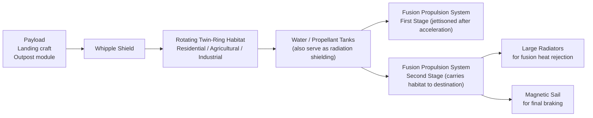

# Generation Ship Wiki — 聚合全文（Agent 专用）

> 本文件由 OpenWiki 生成的所有页面聚合而成，供 agent 一次性读取。
> 单页版本见各子目录。入口导航：index.md / quickstart.md
> 最后更新：自动由 openwiki --update 重新生成


---

<!-- 来源: _skeleton.md -->

---
type: skeleton
title: Generation Ship Wiki Skeleton
description: Skeleton structure for the Generation Ship Design project wiki
tags: [project, skeleton]
---
# Generation Ship Design Wiki Skeleton

## Overview
This repository contains the **Generation Ship Design** project - an engineering design project for a 200-year interstellar generation ship to Proxima Centauri b, aiming to produce complete 3D models ready for rendering in Blender/FreeCAD. It also includes a curated sci-fi reference material library.

## Planned Wiki Structure

### Project Overview
- `/openwiki/project/overview.md` - High-level project introduction, principles, goals, and four-phase plan
- `/openwiki/project/design-principles.md` - The three core principles (rigorous sci-fi, reference open source, 200-year constraint)

### Engineering & Design Calculations
- `/openwiki/engineering/budgets.md` - Phase 0 mass budgets, power budgets, population/agriculture area calculations - methodology and results

### Core Design Concepts
- `/openwiki/design/core-constraints.md` - How the 200-year constraint defines the only possible solution (fusion pulse propulsion, two-stage configuration)
- `/openwiki/design/key-parameters.md` - All key ship parameters (size, population, speed, power, shielding) with physical justifications
- `/openwiki/design/ship-configuration.md` - Overall ship layout and configuration (Daedalus-style "train" layout: payload -> habitat -> shielding -> propulsion)
- `/openwiki/design/multi-generational-design.md` - Multi-generational social and organizational design considerations for a 200-year interstellar mission

### Key Subsystems
- `/openwiki/subsystems/propulsion.md` - Two-stage fusion pulse propulsion + magnetic sail braking
- `/openwiki/subsystems/habitat.md` - Rotating twin-ring habitat design, artificial gravity, layout
- `/openwiki/subsystems/radiation-shielding.md` - Combined active magnetic + water/propellant + storm shelter shielding solution to 200-year cumulative radiation problem
- `/openwiki/subsystems/life-support.md` - Closed-loop life support for 200-year mission, BIOS-3/MELiSSA references
- `/openwiki/subsystems/payload.md` - Landing craft and outpost module in the forward section

### Implementation & Code Assets
- `/openwiki/code/parametric-modeling.md` - Blender Python parametric modeling scripts for ship hull and internal layout generation - how they work, how to run them, and what outputs they produce

### Open Source References & Tools
- `/openwiki/references/open-source-projects.md` - Curated list of open source projects used as reference
- `/openwiki/references/literature.md` - Key literature and academic references
- `/openwiki/references/toolchain.md` - Open source toolchain (Blender, FreeCAD, OpenSCAD, etc.)
- `/openwiki/references/engineering-images.md` - Curated NASA public domain reference image collection (including SP-413 Stanford Torus material) organized by ship subsystem

### Sci-Fi Reference Material Library
- `/openwiki/material-library/overview.md` - Overview of the curated 2000+ sci-fi reference collection
- `/openwiki/material-library/gallery.md` - Interactive gallery documentation and usage
- `/openwiki/material-library/generation-pipeline.md` - Documentation for the Python scripts that curate reference data and generate the interactive HTML gallery

## Content Summary
Every major concept and subsystem will be documented with physical justifications, references to source materials, and relationships between different components.


---

<!-- 来源: code/index.md -->

# Files

- [Blender Parametric Modeling](parametric-modeling.md) - Blender Python scripts for parametric generation of the generation ship 3D model


---

<!-- 来源: code/parametric-modeling.md -->

---
type: code
title: Blender Parametric Modeling
description: Blender Python scripts for parametric generation of the generation ship 3D model
tags: [code, blender, parametric, modeling]
---
# Blender Parametric Modeling

The project uses Blender Python (bpy) for parametric generation of the complete 3D model of the generation ship. This allows easy parameter changes and automatic generation of the internal and external structure.

## Goals of Parametric Modeling

1. Make it easy to adjust key parameters (habitat radius, mass distribution, etc.) and automatically regenerate the complete model
2. Generate ready-to-render model with proper organization of objects and materials
3. Export the model in standard formats (glTF, STL, USD) that can be used in other 3D tools

## Planned Script Structure

The scripts will be organized into modular components:
1. **Main script**: Reads the parameter file, coordinates generation of all components
2. **Habitat generator**: Generates the twin counter-rotating rings, internal decks, compartments
3. **Propulsion generator**: Generates the fusion propulsion stages, radiators, magnetic sail
4. **Shielding generator**: Generates the propellant/water tanks surrounding the habitat
5. **Payload generator**: Generates the forward payload section and Whipple shield
6. **Export script**: Exports the completed model to various formats

## How to Run

1. Open Blender
2. Run the script from the Blender Python console or use the command-line Blender for batch generation
3. Adjust parameters in the configuration file before running

Parameters are stored in a simple configuration file that includes all the key parameters from this wiki. Changing the radius of the habitat in the config file will automatically change it everywhere in the model when you regenerate.

## Expected Outputs

- Complete Blender scene with all objects properly organized in collections
- Each subsystem is in its own collection for easy visibility control
- Materials are already assigned based on the function of each component
- Model is ready for Cycles rendering with proper lighting setup
- Exported versions in standard formats for use in other 3D software

## Related Pages
- [Key Parameters](../design/key-parameters.md)
- [Overall Ship Configuration](../design/ship-configuration.md)
- [Toolchain](../references/toolchain.md)


---

<!-- 来源: creative/creation.md -->

---
type: creative-content
title: Self-Produced Creation Content
description: Original short stories, SVG sketches, and a Strudel music experiment built around the ARK-01 generation ship worldbuilding, fed by the material library and AI image series
tags: [creative, writing, music, svg, ark-01]
openwiki:
  roles: [domain, workflow]
  change_kinds: [content-creation]
  source_paths: [docs/creation/README.md, docs/creation/灵感笔记.md, docs/creation/writing/12-B层.md, docs/creation/writing/C区的曲子.md, docs/creation/music/README.md]
  validation_commands: [npm i @strudel/core then stub SalatRepl to evaluate the music script]
---
# Self-Produced Creation Content

The `docs/creation/` directory is the project's **original-content area** (自产): text written directly, drafts drawn as SVG/Canvas code, and generative audio. It is the counterpart to the `branch/` material library, which collects other people's work. The operating principle, from `docs/creation/README.md`: "平时搜集，随手记录，偶尔展开" - ideas encountered during daily curation, material-library maintenance, and image generation are logged as one-liners in the idea notebook; when an idea grows up, it becomes a finished piece with a back-link.

## Formats

| Form | Practice | Directory |
|---|---|---|
| Original writing (settings/short stories/notes) | Markdown, readable online as soon as committed | `writing/` |
| Drafts / diagrams | Hand-written SVG vector code, rendered directly in the browser | `svg/` |
| Generative art | Single-file HTML + Canvas/p5.js, runs on GitHub Pages | `gen-art/` (planned) |
| AI finished images | Volcengine Ark Seedream / ChatGPT output | `../未来世界_生图/` (see [Future World AI Concept Art](./future-world-images.md)) |

## The Idea Notebook (灵感笔记.md)

`docs/creation/灵感笔记.md` is the intake queue. Each entry follows a light format:

```
### YYYY-MM-DD · 标题
- 来源: (which curation/material/image-generation activity triggered it)
- 灵感: (what to create, one line is enough)
- 状态: 💭 随手记 / 🌱 展开中 / ✅ 已成稿(链接)
```

Notable entries that became finished works:
- **船上考古学** -> short story [writing/12-B层.md](https://github.com/shawn1905/generation-ship/blob/main/docs/creation/writing/12-B层.md) (ARK-01, Year 137: a maintenance worker finds first-generation crew graffiti - "the ship itself is an archaeological site")
- **飞船的声音设计** -> short story [writing/C区的曲子.md](https://github.com/shawn1905/generation-ship/blob/main/docs/creation/writing/C区的曲子.md) + the Strudel piece below
- **方舟号 ARK-01** -> worldbuilding thread (ring ship named ARK-01, Year 137) with a ring cross-section sketch in `svg/ark01_ring_draft.svg`

## Music Experiment: Sector C Suite

`docs/creation/music/` contains a Strudel ([strudel.cc](https://strudel.cc)) composition experiment - "the ship's sound design" from the notebook, made audible. The piece *Sector C Suite (ARK-01, Year 137)* encodes the decay idea from the short story: designers wrote bespoke ambient music per compartment at launch; 137 years later, hardware aging has drifted pitch and loop alignment, and the music is **mutating**.

Four layers:
- **L1 Earth Backup**: the original, clean, aligned (piano chords Am-F-C-G, unadorned)
- **L2 The Decay**: the living Year-137 version - `slow(8.03)` stretches the 8-beat theme to 8.03 beats so it slowly drifts out of phase with the backup (every ~100 loops the songs differ by 3 beats, while each moment sounds almost identical); `add(slow(32, range(-0.05,0.05)))` drifts pitch imperceptibly per note but a full key over decades
- **L3 The Hull**: low drone pads with slow pitch drift simulating metal thermal expansion
- **L4 The Pump**: triangle-wave arpeggio from agricultural ring pump 3, occasionally stuttering like an old pump

Play link and code: `docs/creation/music/播放链接.txt`, `C区曲子_sector_c_suite.js`. Strudel only plays the **last expression**, so multi-layer pieces must be wrapped in `stack(...)`.

## Change Guidance

- **Add an idea**: append a dated entry to `docs/creation/灵感笔记.md` - no format strictness, one line is fine
- **Expand an idea into a piece**: create the file under `writing/` or `svg/` (or `gen-art/` for generative art), update the notebook entry's status, and add a row to the `docs/creation/README.md` index table
- **Music**: Strudel scripts encode to `https://strudel.cc/#` + base64(URL-encoded script). Local verification needs `npm i @strudel/core` with a stub for `@kabelsalat/web`'s `SalatRepl` (the `.mjs` lacks that export under Node), then `evalScope(import('@strudel/core'))`, evaluate via `new Function` returning `stack(...)`, and validate events with `pattern.queryArc(0,2)`
- **No automated tests exist** for this area; validation is the browser rendering for SVG/HTML and the Strudel evaluation steps above for music

## Related Pages
- [Future World AI Concept Art](./future-world-images.md) - the AI image series that shares the ARK-01 worldbuilding and feeds the notebook
- [Sci-Fi Reference Material Library](../material-library/overview.md) - curation activity that generates many notebook ideas


---

<!-- 来源: creative/future-world-images.md -->

---
type: creative-content
title: Future World AI Concept Art
description: The "我眼中的未来世界" AI concept image series, the mandatory Interstellar-style generation methodology (scale reference, single light source, real materials), and the arkcli generation scripts
tags: [creative, ai-images, seedream, methodology]
openwiki:
  roles: [domain, workflow]
  change_kinds: [content-creation]
  source_paths: [docs/未来世界_生图/README.md, docs/未来世界_生图/生图提示词.md, docs/gen_future_v2.sh, docs/gen_my_future.sh]
  symbols: [arkcli +gen, doubao-seedream-5.0-lite]
  validation_commands: [bash docs/gen_future_v2.sh]
---
# Future World AI Concept Art

`docs/未来世界_生图/` archives the **"我眼中的未来世界"** ("The Future World in My Eyes") AI concept-art series. The world view: **living cities / slow civilizations / symbiotic AI / stellar-scale** (rejecting cyberpunk coldness while staying grounded).

Current set (methodology versions, 2026-08-14, 4K, `doubao-seedream-5.0-lite`):
- **009** 世代飞船·200年环 - the main-line ring generation ship
- **010** 恒星边缘的文明（戴森云）- Dyson cloud civilization at a red dwarf's edge
- **011** 仿生共生城市 - biomimetic symbiotic city

Older versions (001-008, 2K/4K, pre-methodology) were cleaned from the tree (recoverable from git history).

## Generation Method (mandatory)

Since 2026-08-14, all image generation must follow the **Interstellar-style methodology** consolidated in `docs/未来世界_生图/生图提示词.md` (sourced from three Xiaohongshu reference notes). The core insight: *scale is communicated by the human-to-universe proportion, not by writing "epic"*.

Seven rules (checklist before every submission):
1. **主体锁死** - lock a single absolute visual subject; other elements are background only
2. **极小尺度参照** - a tiny scale reference (a 3-meter repair craft, an EVA astronaut) nearly vanishing into the frame
3. **巨型天体出画** - the giant body (ship/planet/Dyson cloud) breaks past the frame edges; viewers never see the whole
4. **单一真实光源** - one real light source (star, horizon, engine light); delete colorful nebulae and decorative neon
5. **精准工业细节** - concrete industrial detail words (armor modules, piping, wear scratches, frost, micrometeorite craters) instead of "many details"
6. **镜头语言锚定** - anchor texture to real camera gear + cinematographer style (e.g. `IMAX 70mm, shot in the style of Hoyte van Hoytema` for ship/Dyson scenes; `Arri Alexa Mini, directed in the style of Roger Deakins` for city scenes)
7. **干净极繁** - clean maximalism: 1-2 strong light sources, subject half-lit/half-shadowed, pure-black deep space background, UE5-render/next-gen materials, 8K

Prompt skeleton: `微小参照物＋巨型天体＋明确机位＋单一光源＋真实材质＋大画幅电影镜头`.

## Generation Pipeline

- `docs/gen_future_v2.sh` - the v2 script that generated 009-011 (methodology applied, 4K, output to `docs/未来世界_生图/`)
- `docs/gen_my_future.sh` - the earlier one-shot 4K script (006-008, superseded; also demonstrates the arkcli invocation form)

Both use the Volcengine Ark CLI:
```bash
arkcli +gen --model doubao-seedream-5.0-lite --modality image --size 4K --save-to "$OUTDIR" "$prompt"
```
Notes: `arkcli` 1.0.14 requires explicit `--modality image`; use the dotted raw model id `doubao-seedream-5.0-lite`.

## Quota & Operations

- Seedream free quota inside the agent plan: **50 images/month** (resets monthly); the 3 methodology images left ~42
- Text models run on a separate quota (AFP) and do not share the image budget
- Verification after generation: check the output file appears in `docs/未来世界_生图/` with the planned name; visually verify against the 7-rule checklist

## Related Pages
- [Self-Produced Creation Content](./creation.md) - the idea notebook and short stories that share the ARK-01 worldbuilding with these images
- [Sci-Fi Reference Material Library](../material-library/overview.md) - the curated entries (e.g. Aniara, Silent Running) that inspired ship/ecosystem imagery
- [Open Source Toolchain](../references/toolchain.md) - arkcli and the surrounding open-source stack


---

<!-- 来源: creative/index.md -->

# Files

- [Self-Produced Creation Content](creation.md) - Original short stories, SVG sketches, and a Strudel music experiment built around the ARK-01 generation ship worldbuilding, fed by the material library and AI image series
- [Future World AI Concept Art](future-world-images.md) - The "我眼中的未来世界" AI concept image series, the mandatory Interstellar-style generation methodology (scale reference, single light source, real materials), and the arkcli generation scripts


---

<!-- 来源: design/core-constraints.md -->

---
type: design-concept
title: Core Constraints
description: How the 200-year mission constraint defines the only possible ship architecture
tags: [design, constraints, propulsion]
---
# Core Design Constraints

The 200-year interstellar mission requirement is not just a mission duration - it's a hard constraint that uniquely determines the entire ship architecture. This page explains how the constraint leads to the only feasible solution.

## The 200-Year Constraint Logic

```
200 years + reach a new habitable planet
  → Target must be within ~4-5 light years (only Proxima Centauri b fits)
  → Required average speed: ~0.021c, cruise speed ~0.03c (9,000 km/s)
  → This speed requirement eliminates all conventional propulsion options
```

## Why Other Propulsion Options Are Impossible

### 1. Chemical Propulsion
- Specific impulse (Isp): 300-450 seconds
- To reach 9,000 km/s with chemical propulsion would require an enormous mass ratio that's physically impossible
- Eliminated.

### 2. Nuclear Thermal / Nuclear Electric Propulsion
- Specific impulse (Isp): ~10⁴ seconds
- Using the relativistic rocket equation, mass ratio required is e^(v/(Isp×g)) = e^(9000/(10000×9.8)) ≈ e^0.092 ≈ 1.1 - wait that looks okay? Wait no, that's wrong, because Isp units are already in seconds. Let's recalculate correctly:

The rocket equation is Δv = Isp × g × ln(mass_ratio)

For Δv = 9000 km/s = 9,000,000 m/s
Isp = 10,000 s
g = 9.8 m/s²

ln(mr) = Δv/(Isp × g) = 9,000,000/(10000 × 9.8) ≈ 9.18
mr = e^9.18 ≈ 9,700

So for a 50,000 ton final vehicle, you need 485 million tons of propellant - physically impossible to build.

**Conclusion**: Nuclear thermal/electric propulsion also eliminated.

## The Only Feasible Solution: Fusion Pulse Propulsion

Fusion pulse propulsion (from the Daedalus/Longshot design lineage) provides:
- Specific impulse (Isp): ~10⁶ seconds
- Recalculating with Isp = 1,000,000 s:
  - ln(mr) = 9,000,000/(1,000,000 × 9.8) ≈ 0.092
  - mr = e^0.092 ≈ 1.10 - that's manageable!

For deceleration at the end, the mass ratio is e^(v/(Isp × g)) ≈ 2.5, which is still acceptable.

## Two-Stage Configuration

Because we need to both accelerate and then decelerate at the destination, a two-stage configuration is required:
1. **First stage (acceleration stage)**: Provides all the initial acceleration to reach cruise speed, then is jettisoned
2. **Second stage (deceleration stage + habitat)**: Carries the habitat and payload, provides deceleration at the destination
3. **Magnetic sail**: Provides additional final braking with minimal mass cost

**Mission Timeline**:
- Acceleration phase: ~15 years
- Cruise phase: ~170 years
- Deceleration phase: ~15 years
- **Total**: 200 years - exactly meets the requirement

## The Two Hard Challenges

While propulsion is uniquely determined by the constraint, the real difficult problems that this project focuses on are:

### 1. 200-Year Cumulative Radiation Dose
- Galactic Cosmic Rays (GCR) at ~0.5 Sv/year inside an unshielded ship gives 100 Sv over 200 years - which is lethal
- Solution must combine multiple strategies: active magnetic shielding + passive water/propellant shielding + storm shelter for solar particle events

### 2. 200-Year Closed-Loop Life Support
- Zero resupply from Earth - water, oxygen, nitrogen must be nearly 100% recycled
- Food production must be 90%+ closed-loop
- Based on precedent from BIOS-3 (85% closure achieved in experiments) and ESA MELiSSA program

## Key Derived Constraints

The 200-year constraint also leads to other requirements:
- **Redundant systems**: All critical systems must have redundancy, because repairs can't be done from Earth
- **Radiation-hardened electronics**: Electronics must survive 200 years of cumulative radiation damage
- **On-board manufacturing**: Ability to manufacture replacement parts using 3D printing and machining (but note that chip manufacturing cannot be done on board, so system design must account for this)

## Related Pages
- [Design Principles](../project/design-principles.md)
- [Key Parameters](./key-parameters.md)
- [Propulsion](../subsystems/propulsion.md)
- [Radiation Shielding](../subsystems/radiation-shielding.md)
- [Life Support](../subsystems/life-support.md)


---

<!-- 来源: design/index.md -->

# Files

- [Core Constraints](core-constraints.md) - How the 200-year mission constraint defines the only possible ship architecture
- [Key Parameters](key-parameters.md) - Summary of all key ship parameters with their physical justifications
- [Multi-Generational Social & Organizational Design](multi-generational-design.md) - Social and organizational design considerations for a 200-year interstellar generation ship mission
- [Overall Ship Configuration](ship-configuration.md) - Overall layout and configuration of the generation ship


---

<!-- 来源: design/key-parameters.md -->

---
type: design-concept
title: Key Parameters
description: Summary of all key ship parameters with their physical justifications
tags: [design, parameters]
---
# Key Ship Parameters

This page summarizes all key parameters for the generation ship design, with their physical justifications and references.

## Mission Parameters

| Parameter | Value | Justification |
|-----------|-------|---------------|
| Target | Proxima Centauri b | Closest potentially habitable exoplanet, 4.24 ly from Solar System |
| Total mission duration | 200 years | Core project requirement |
| Cruise speed | ~0.03c (9,000 km/s) | 4.24 ly ÷ 200 years ≈ 0.021c average, so cruise ~0.03c to allow for acceleration/deceleration |
| Timeline | 15 yr acceleration + 170 yr cruise + 15 yr deceleration | Matches 200 year total, fusion pulse acceleration rate is manageable |

## Population Parameters

| Parameter | Value | Justification |
|-----------|-------|---------------|
| Initial founding population | 1,000 - 2,000 | Minimum viable population genetics + allows for growth |
| Expected arrival population | 10,000 - 20,000 | Natural growth over 200 years, sufficient for colonization |

## Habitat Parameters

| Parameter | Value | Justification |
|-----------|-------|---------------|
| Habitat configuration | Twin counter-rotating rings | Cancels out net angular momentum for the whole ship |
| Habitat radius | 250 - 500 m | Balances structural mass, radiation shielding mass, and Coriolis effect |
| Artificial gravity | 1g | To maintain human health over multiple generations |
| Rotation rate | 1.2 - 1.9 rpm | At 300-500 m radius, gives 1g, and ≤2 rpm which is the NASA acceptability threshold for Coriolis effects |

## Propulsion Parameters

| Parameter | Value | Justification |
|-----------|-------|---------------|
| Propulsion type | Inertial confinement fusion pulse | Daedalus/Longshot heritage, only feasible option for 0.03c with reasonable mass ratio |
| Specific impulse (Isp) | ~10⁶ s | Inherent to fusion pulse propulsion |
| Configuration | Two-stage (acceleration + deceleration) | Needed to reach cruise speed then stop at destination |
| Final braking | Magnetic sail | Low mass solution for final deceleration |

## Power Parameters

| Parameter | Value | Justification |
|-----------|-------|---------------|
| Cruise power (life support/habitat) | 10 - 100 MW(e) | 5-50 kW per person × 2,000 people |
| Peak propulsion power | GW-TW range | Only needed during acceleration/deceleration phases |
| Power source | Fusion reactor | Leverages same technology as propulsion |

## Radiation Shielding Parameters

| Parameter | Value | Justification |
|-----------|-------|---------------|
| Primary shielding | Superconducting dipole active magnetic shielding | Reduces GCR flux dramatically, lower mass than all-passive |
| Secondary shielding | Water/propellant tanks passive shielding | Already needed for propellant, doubles as shielding |
| Emergency shelter | Central dense storm shelter | For solar particle events (SPE), minimal additional mass |
| Target total dose | <20 Sv over 200 years | Below lethal threshold for cumulative exposure |

## Other Key Parameters

| Parameter | Value | Justification |
|-----------|-------|---------------|
| Front shielding | Whipple double-layer dust shield | Standard solution to interstellar dust erosion at 0.03c |
| Life support closure | 100% for water/oxygen/nitrogen; 90%+ for food | Zero resupply over 200 years requires near-complete closure |

## Related Pages
- [Core Constraints](./core-constraints.md)
- [Ship Configuration](./ship-configuration.md)
- [Budgets](../engineering/budgets.md)


---

<!-- 来源: design/multi-generational-design.md -->

---
type: design-concept
title: Multi-Generational Social & Organizational Design
description: Social and organizational design considerations for a 200-year interstellar generation ship mission
tags: [design, social, multi-generational]
---
# Multi-Generational Social & Organizational Design

A 200-year interstellar generation ship means that multiple generations of people will be born, live, and die on the ship before reaching the destination. The mission depends on maintaining social stability, technological knowledge, and the commitment to complete the mission over many generations.

## Key References

The project draws on existing research in this area:
- Finney & Jones *Interstellar Migration and the Human Experience* (1985)
- TU Delft research by Angelo Vermeulen on multi-generational space colonization
- Existing studies on closed ecological systems and long-duration isolation (like Antarctica bases)

## Key Design Challenges

### 1. Maintaining Mission Commitment Across Generations

The biggest social challenge is that after 2-3 generations, people born on the ship have never experienced Earth. It's possible for commitment to the final colonization goal to fade over time.

Design considerations:
- **Transparent documentation**: Complete documentation of the mission purpose and history, maintained in multiple formats
- **Education system**: An education system that emphasizes the mission goal and provides the necessary technical knowledge
- **Cultural integration**: Make the mission purpose a core part of the ship's culture

### 2. Population Genetics & Health

- Starting population must have sufficient genetic diversity to avoid inbreeding depression over 200 years
- Medical technology must be maintained to handle genetic screening and health issues
- Target founding population of 1000-2000 provides sufficient genetic diversity for 200 years

### 3. Maintenance of Technological Capability

- Over 200 years, you need to maintain all the technological capabilities needed to operate the ship and eventually colonize the planet
- Some technologies (like semiconductor manufacturing) can't be supported on the ship
- **Solution**: Design all critical systems to be maintainable with the on-board manufacturing capabilities (3D printing, basic machining), and design for long-term reliability with redundancy

### 4. Social Stability & Governance

- A closed small population over multiple generations requires stable governance structures
- Need to balance individual freedom with the requirements of mission survival
- Common governance models discussed for this scenario:
  - Representative democracy
  - Technocracy (rule by technical experts)
  - Adhocracy / decentralized decision making

This project doesn't prescribe a single governance model, but notes that the physical constraints (everyone's survival depends on the systems working) create strong incentives for cooperation.

### 5. Resource Allocation

- All resources (energy, water, food, space) are strictly limited
- Fair resource allocation systems need to be designed into the social structure from the beginning
- Transparent allocation helps maintain social stability

## Design Implications for Physical Layout

Social design has implications for physical habitat layout:
- **Mix of public and private space**: Need both private living space for families and public space for community interaction
- **Diversity of environments**: Artificial variation in lighting, vegetation, and scenery to avoid psychological problems from living in a completely artificial closed environment for generations
- **Recreational and cultural space**: Includes parks, gyms, cultural facilities to maintain mental health and social cohesion

## Related Pages
- [Population Budgets](../engineering/budgets.md)
- [Habitat](../subsystems/habitat.md)
- [Project Overview](../project/overview.md)


---

<!-- 来源: design/ship-configuration.md -->

---
type: design-concept
title: Overall Ship Configuration
description: Overall layout and configuration of the generation ship
tags: [design, configuration, layout]
---
# Overall Ship Configuration

The generation ship follows a Daedalus-style "train" layout, which is the logical arrangement given the propulsion system, habitat requirements, and shielding needs.

## Overall Layout Diagram



Front-to-back layout of the Daedalus-style "train" configuration: payload/Whipple shield at the front, twin-ring habitat in the middle surrounded by shielding tanks, propulsion and braking at the rear.

## Front to Back Arrangement

### 1. Front: Payload & Whipple Shield

**Whipple Shield**:
- Double-layer dust shield located at the very front of the ship
- Protects the rest of the ship from interstellar dust erosion at 0.03c
- This was already studied and used in the Daedalus design

**Payload Section**:
- Located directly behind the Whipple shield
- Contains landing craft for the destination planet
- Contains outpost module for initial surface colonization
- Has its own additional radiation shielding since it's at the front

### 2. Middle: Rotating Twin-Ring Habitat

**Position**: Located in the middle of the ship, behind the payload and before the propellant tanks
**Configuration**: Two counter-rotating rings
- Each ring rotates in opposite direction to cancel out net angular momentum
- Precesses so that the entire ship doesn't start rotating

**Content**:
- Residential areas for the population
- Agricultural areas for closed-loop food production
- Industrial areas for maintenance and manufacturing
- Life support system equipment
- Central radiation storm shelter

### 3. Mid-Rear: Water / Propellant Tanks (Radiation Shielding)

The propellant and water tanks form a large cylindrical shell *around* the habitat section:
- This arrangement maximizes the radiation shielding effect - the propellant/water absorbs and blocks cosmic radiation before it reaches the habitat
- It's a mass-efficient solution because we already need to carry the propellant/water anyway, so it doubles as shielding without adding extra mass

### 4. Rear: Propulsion System & Radiators & Magnetic Sail

**Two-stage propulsion**:
- First stage (larger, more propellant): Jettisoned after acceleration to cruise speed
- Second stage (smaller): Remains attached to the habitat for deceleration at destination

**Large Radiators**:
- Fusion propulsion produces a lot of waste heat
- Large radiators radiate the heat into space
- Required because you can't dump heat anywhere else in space

**Magnetic Sail**:
- Deployed at the rear for final deceleration after the second stage fusion braking is complete
- Uses the interstellar medium for braking with minimal additional mass
- Reduces the amount of propellant needed for deceleration

## Overall Mass Distribution

- The largest mass fraction is radiation shielding (propellant/water tanks)
- Next is propulsion system and propellant
- Then habitat structure
- Then life support equipment
- Then payload

## Why This Configuration?

This layout is the natural result of the requirements:
1. Whipple shield needs to be at the front to stop interstellar dust
2. Propellant tanks around the habitat provide the most mass-efficient radiation shielding
3. Propulsion needs to be at the rear to push the ship
4. Two counter-rotating rings cancel angular momentum so the ship doesn't spin

## Related Pages
- [Key Parameters](./key-parameters.md)
- [Habitat](../subsystems/habitat.md)
- [Radiation Shielding](../subsystems/radiation-shielding.md)
- [Propulsion](../subsystems/propulsion.md)


---

<!-- 来源: engineering/budgets.md -->

---
type: engineering-calculations
title: Mass, Power & Population Budgets
description: Phase 0 engineering budget calculations for the generation ship
tags: [engineering, budget, mass, power, population]
---
# Mass, Power & Population Budgets

Phase 0 of the project focuses on establishing the key engineering budgets that bound all subsequent design work. This page documents the methodology and preliminary results.

## Population Budget

The population budget determines the minimum number of people needed for a healthy multi-generational colony that can successfully colonize the destination planet after 200 years of travel.

Key considerations:
- **Minimum viable population**: Genetics studies suggest 100-160 founding individuals as the minimum to maintain genetic diversity
- **Colonization requirement**: To successfully colonize a new planet, at least 500 individuals are needed upon arrival
- **Growth over 200 years**: Starting with 1000-2000 initial population, the population is expected to grow to 10,000-20,000 by arrival

**Current budget:**
- Initial founding population: 1,000 - 2,000 people
- Target arrival population: 10,000 - 20,000 people
- Habitat area allocation: ~50 m² per person (including living space, agriculture, and industry)

> **Phase 0 anchor**: NASA SP-413 (*Space Settlements: A Design Study*, 1975) contains a full mass/area budget table for a **10,000-person** rotating habitat - the most credible historical anchor for this population accounting. The original images and the report link are collected in [NASA Engineering Reference Images](../references/engineering-images.md).

## Agriculture & Food Budget

For 200-year closed-loop life support, food production must be entirely on-board:

Based on BIOS-3 experience:
- ~15-20 m² of growing area per person is needed to provide complete nutrition
- This includes both crops for food and algae for oxygen production
- Using higher-yield hydroponic/aeroponic systems can reduce this area somewhat

**Current budget:**
- Total agricultural area: ~15-20 m² per person × 2,000 people = 30,000 - 40,000 m²
- This translates to a significant portion of the rotating habitat space
- Food closure target: 90%+ (the remaining 10% is stored food for emergencies)

## Power Budget

Power is needed for:
- Life support systems (lighting for agriculture, air handling, water recycling)
- Habitat systems (temperature control, lighting, communications)
- Industrial systems (3D printing, maintenance, repairs)
- Radiation shielding (power for active magnetic shielding)

**Current budget estimates:**
- Per person power consumption: 5-50 kW(e)
- Total power for life support + habitat + industry: **10-100 MW(e)**
- Propulsion power: GW-TW range (only during acceleration/deceleration phases, not during cruise)
- Power source: Fusion reactor (same technology that powers propulsion)

## Mass Budget

The total ship mass is dominated by:
1. **Radiation shielding**: The single largest mass component (water/propellant used as passive shielding)
2. **Propulsion system**: Fusion pulse engines and fuel
3. **Habitat structure**: The rotating habitat ring structure
4. **Propellant**: For acceleration and deceleration

Based on Daedalus/Longshot heritage:
- Daedalus total mass: 54,000 tonnes (unmanned probe)
- This design is larger (carries 1000-2000 people + habitat)
- Estimated total mass is in the **hundreds of thousands to millions of tonnes** range

Key mass allocations (preliminary):
- Radiation shielding: ~40-50% of total mass
- Propulsion and propellant: ~25-35% of total mass
- Habitat and structure: ~10-15% of total mass
- Life support and equipment: ~5-10% of total mass
- Payload (landers, outpost): ~5% of total mass

## Trade-offs Being Considered

1. **Smaller habitat vs. radiation mass**: Reducing habitat radius reduces radiation shielding mass but increases Coriolis effect issues
2. **Higher speed vs. mass fraction**: Higher speed requires more propellant but reduces travel time (fixed at 200 years by requirement)
3. **More redundancy vs. mass**: More redundant systems increase reliability but add mass

## Related Pages
- [Project Overview](../project/overview.md)
- [Key Parameters](../design/key-parameters.md)
- [Radiation Shielding](../subsystems/radiation-shielding.md)
- [Life Support](../subsystems/life-support.md)


---

<!-- 来源: engineering/index.md -->

# Files

- [Mass, Power & Population Budgets](budgets.md) - Phase 0 engineering budget calculations for the generation ship


---

<!-- 来源: index.md -->

---
okf_version: "0.1"
---

# Files

- [Generation Ship Wiki Skeleton](_skeleton.md) - Skeleton structure for the Generation Ship Design project wiki
- [OpenWiki Quickstart - Generation Ship Design](quickstart.md) - Quickstart guide to the Generation Ship Design project wiki

# Directories

- [code](code/)
- [creative](creative/)
- [design](design/)
- [engineering](engineering/)
- [material-library](material-library/)
- [project](project/)
- [references](references/)
- [subsystems](subsystems/)


---

<!-- 来源: material-library/gallery.md -->

---
type: material-library
title: Interactive Reference Gallery
description: Documentation for the interactive HTML reference gallery
tags: [material, gallery, interactive]
---
# Interactive Reference Gallery

The interactive gallery is a pure HTML/JavaScript file that lets you browse the entire curated reference collection. It supports filtering, searching, and sorting by various criteria.

## Opening the Gallery

The gallery is located at `/branch/gallery.html`. Simply open it in any modern web browser. It doesn't require any internet connection or server - it's a pure static file that works completely locally **without any external services**. It is also published online via GitHub Pages at [https://shawn1905.github.io/generation-ship/branch/gallery.html](https://shawn1905.github.io/generation-ship/branch/gallery.html).

## Features

### Filtering Capabilities

The gallery supports multiple ways to filter the entries:

1. **By content category** (8 tabs):
   - Movies
   - TV Shows
   - Games
   - Anime
   - Comics
   - Novels
   - Original Art/Concept Art
   - 🧠 Other/AI-curated (future inspiration; all entries are unrated, `ship_ref` = 0)

   You can select one category at a time to view.

2. **By reference level**:
   - Filter to only show entries at or above a certain reference level
   - For example, you can filter to only show ✧4 and ✧3 level entries to focus on the highest quality references
   - Reference levels: 0 (no reference) to 4 (generation ship level)

3. **By tags**:
   - Multiple tags can be selected simultaneously
   - Tags categorize entries by content themes: "interstellar travel", "hard sci-fi", "space colony", "interior", "exterior", "habitat", "propulsion", etc.
   - Only entries that match all selected tags are displayed

### Searching
- Full-text search across titles, notes, and tags
- Instant results as you type

### Display
- Shows posters/cover images for all entries
- Displays all the metadata for each entry
- Shows notes about why the entry is relevant to generation ship design
- Links to external sources for more information

## Statistics

Current gallery counts (from the `gallery.html` tab headers):

| Category | Curated Entries | ✧4 | ✧3 | ✧2 |
|---|---|---|---|---|
| Movies | 157 | 5 | 7 | 26 |
| TV Shows | 62 | 4 | 8 | 18 |
| Games | 84 | 1 | 13 | 25 |
| Anime | 34 | 1 | 3 | 3 |
| Comics | 29 | 1 | 1 | 8 |
| Novels | 25 | 3 | 4 | 7 |
| Art/Concept | 103 | 27 | 27 | 33 |
| Other/AI-curated | 39 | — | — | — |
| **Total** | **533** | **42** | **63** | **120** |

The ✧4/✧3/✧2 totals cover the seven rated categories only (the Other category is unrated by design). Counts drift as curation continues; the tab headers in `gallery.html` and the per-category `ship_ref` columns in the curated CSVs are the source of truth. Note that `docs/科幻素材库-2000后.md` and `branch/README.md` still show the older 7-category / 495-entry figures.

## Related Pages
- [Overview](./overview.md)
- [Generation Pipeline](./generation-pipeline.md)


---

<!-- 来源: material-library/generation-pipeline.md -->

---
type: material-library
title: Gallery Generation Pipeline
description: Documentation for the Python scripts that curate reference data and generate the interactive gallery HTML and human-readable summaries
tags: [material, pipeline, code]
---
# Gallery Generation Pipeline

The interactive gallery is generated automatically from curated CSV data using Python scripts in `/branch/scripts/`. This page documents how the pipeline works, how to reproduce it, and the pitfalls recorded while building it.

## Pipeline Overview

1. Download raw IMDb datasets from https://datasets.imdbws.com/ and place them in `/branch/data/` (git-ignored, ~1.4 GB)
2. Run raw data collection scripts (`make_movies.py`, `make_games.py`) to filter sci-fi candidates
3. Run curation scripts (`curate_*.py`) to merge manual annotations (`KNOWN_*` dictionaries) with raw data
4. Download cover/poster images (`download_images.py`, `download_covers.py`, `fetch_other_covers.py`)
5. Run `make_gallery.py` to produce the single-file `branch/gallery.html`
6. Optionally run `make_docs.py` to regenerate `docs/科幻素材库-2000后.md` (7 rated categories only - the 🧠 Other/AI-curated category is not included; see Backlog)

## Known Issues with IMDb Dataset

The original IMDb dataset has an issue with genre tagging: many sci-fi movies are not tagged as "Sci-Fi" in the dataset, or are mis-classified (Avatar, Blade Runner 2049 and Ad Astra all lack the tag). Automated filtering alone would miss many relevant sci-fi works, so the curation process matches a manual list of known works against the full candidate pool (`*_pool.csv`) by (title, year) instead of relying on genre tags.

## KNOWN_MOVIES Workaround

To address the issue with incomplete genre tagging, the curation process uses a manual list of known sci-fi movies (`KNOWN_MOVIES`, and the analogous `KNOWN_TV` / `KNOWN_GAMES` / etc.) defined directly in the curation scripts. This ensures that all relevant works are included even if they were missed by automated filtering.

- Each manual entry maps `(title, year) -> (tags, ship_ref, note)`
- A `None` value marks a work as **deliberately removed** (e.g. 疯狂的外星人, 独行月球, 上海堡垒); re-running the script will not resurrect it
- Pitfall: matching a year-specified entry must NOT fall back to empty-year matching - a bare `by_norm` fallback once matched Aliens to an unrelated 2014 short film (see `curate_movies.py` / `curate_tv.py`)

## Poster / Cover Image Acquisition

- **Movies & TV**: posters come from the IMDb suggestion JSON API (`v2.sg.media-imdb.com`, no key required). The original plan used the `cinemagoer` library, but its 2026 version has a local-database dependency issue, so it is unused. The suggestion API rate-limits (SSL EOF errors), so the download script sleeps ~2s between requests with 3 retries
- **Games**: Steam CDN `https://cdn.akamai.steamstatic.com/steam/apps/{appid}/header.jpg` (Star Citizen uses an official YouTube trailer thumbnail)
- **Anime/Comics**: AniList cover images; Wikipedia REST for Western comics; Open Library for some (e.g. Letter 44)
- **Novels**: Open Library covers via `ratings.json` lookups
- **Art**: Wikipedia REST person images + Goodreads book-cover scraping (`search` page -> book id -> og:image), with 1s+ intervals because Goodreads rate-limits and occasionally throws SSL EOF
- **Other/AI-curated**: `fetch_other_covers.py` with a `PLAN` dict supporting `wiki` / `url` / `goodreads` / `web` (og:image) sources
- Sketchfab thumbnails are downloaded with `curl` (urllib gets reset by the CDN) and resized to 500px with `sips`; the search API's `thumbnails.images` first item may be 50x50, so the widest image is selected

## End-to-End Reproduction Workflow

### Prerequisites
- Python 3 (the repo uses a `branch/.venv` virtualenv; HANDOVER records Python 3.14)
- IMDb datasets downloaded into `branch/data/` (git-ignored - a new machine must re-download them; the scripts are ready)

### Step 1: Install / Prepare
```bash
python3 -m venv branch/.venv
# The curation/gallery scripts use only the Python standard library (csv, urllib, json).
# The poster download path uses the IMDb suggestion API; cinemagoer is NOT used.
```

### Step 2: Download Raw Datasets
Download the following files from https://datasets.imdbws.com/ into `branch/data/`:
- title.basics.tsv.gz
- title.ratings.tsv.gz
Plus the steam-insights snapshot for games.

### Step 3: Generate Raw Data
```bash
cd branch
.venv/bin/python scripts/make_movies.py   # IMDb -> raw + candidate pool (1980+, Sci-Fi with votes)
.venv/bin/python scripts/make_games.py    # steam-insights -> raw
```

### Step 4: Run Curation
```bash
.venv/bin/python scripts/curate_movies.py
.venv/bin/python scripts/curate_tv.py
.venv/bin/python scripts/curate_games.py    # SPECIAL_APPID / NON_STEAM special-cases
.venv/bin/python scripts/curate_anime_comics.py  # AniList + Wikipedia verification
.venv/bin/python scripts/fix_anime_comics.py     # targeted fixes (灵笼 / 铁血孤儿 / Wikipedia disambiguation)
.venv/bin/python scripts/curate_novels.py        # Open Library verification / ratings / covers
.venv/bin/python scripts/curate_art.py           # art books: Wikipedia REST verify + Goodreads covers
.venv/bin/python scripts/collect_sketchfab.py    # 3D community: Sketchfab API, like-count sort, ✧4 whitelist
.venv/bin/python scripts/collect_blenderartists.py # 3D community: Blender forum Discourse API
```

### Step 5: Download Images
```bash
.venv/bin/python scripts/download_images.py      # movies/TV/games
.venv/bin/python scripts/download_covers.py      # anime/comics/novels
.venv/bin/python scripts/fetch_other_covers.py   # 🧠 Other/AI-curated covers
.venv/bin/python scripts/fix_art_covers.py       # art covers with source_id slug mismatches
```

### Step 6: Generate Gallery + Summary
```bash
.venv/bin/python scripts/make_gallery.py   # -> branch/gallery.html
.venv/bin/python scripts/make_docs.py      # -> docs/科幻素材库-2000后.md (7 categories only)
.venv/bin/python scripts/health_check_other.py  # must pass after every Other-category expansion
```

## Scripts

All scripts are located in `/branch/scripts/`:

### 1. Data Collection Scripts
- `make_movies.py`: Filter sci-fi movies/TV from the IMDb dataset -> raw CSVs + candidate pools
- `make_games.py`: Filter games from the steam-insights snapshot -> raw CSV
- `collect_sketchfab.py`: Collect 3D models from Sketchfab API (like-count sort, rating quotas, ✧4 whitelist)
- `collect_blenderartists.py`: Collect 3D art from the Blender forum Discourse API (23 keywords + exclusion list + rating fixes)

These scripts collect the basic information (title, year, rating, image URL) for all candidates.

### 2. Curation Scripts
- `curate_movies.py` / `curate_tv.py` / `curate_games.py`: Merge manual `KNOWN_*` lists with raw data
- `curate_anime_comics.py`: Anime/comics curation with AniList + Wikipedia verification
- `curate_novels.py`: Novels with Open Library verification/ratings/covers
- `curate_art.py`: Art books and concept artists (Wikipedia REST verify + Goodreads covers)
- `fix_anime_comics.py` / `fix_art_covers.py`: Targeted fixes for specific titles and cover mismatches

After collection, the raw data is manually curated to:
- Select only relevant entries that are worth including
- Assign tags based on content
- Assign reference level (how useful it is for generation ship design)
- Add notes explaining why the entry is relevant

### 3. Image Download Scripts
- `download_images.py`: Movie/TV posters and game headers (IMDb suggestion API + Steam CDN)
- `download_covers.py`: Anime/comics/novels covers
- `fetch_other_covers.py`: 🧠 Other/AI-curated covers (wiki/url/goodreads/web sources)
- `fix_art_covers.py`: Repair art covers whose files don't match `source_id` slugs

### 4. Output Generation Scripts
- `make_gallery.py`: Takes the curated CSV files and generates the complete `gallery.html`
  - Includes all the data embedded in the HTML file (JSON blobs per category)
  - Generates the JavaScript for filtering and searching
  - Outputs a single self-contained HTML file that works completely offline
- `make_docs.py`: Generates the human-readable `docs/科幻素材库-2000后.md` (7 rated categories; the Other/AI-curated category is not loaded - see Backlog)
- `weread_links.py`: One-off utility that queries the WeChat Reading (weread) search API to produce `docs/weread-直达链接.md` deep links (`book-detail?type=1&v={hash}`; do not hand-build `web/bookDetail/{id}` - 404)
- `health_check_other.py`: Health check for `other/ai_curated.csv` - verifies column count (9), cover files exist and are >5KB, and URLs return 200. **Must be run after every Other-category expansion**

## Image Cache Storage

Images are cached locally in these paths:
- `/branch/movies/posters/`: Movie posters (`{tconst}.jpg`, 460px wide)
- `/branch/movies/tv_posters/`: TV show posters
- `/branch/games/headers/`: Game header images (`{appid}.jpg`)
- `/branch/anime/covers/`: Anime covers
- `/branch/comics/covers/`: Comic covers
- `/branch/novels/covers/`: Novel covers
- `/branch/art/covers/`: Art covers (Wikipedia/Goodreads)
- `/branch/art/covers_3d/`: Sketchfab renders (500px)
- `/branch/art/covers_forum/`: Blender forum renders (500px)
- `/branch/other/covers/`: Other/AI-curated covers

### Git Tracking
- Curated CSVs, scripts, gallery.html and the local image caches **are all committed to git** (posters/covers regenerate only when needed)
- Only these paths are ignored (see `.gitignore`): `branch/data/` (raw IMDb datasets), `branch/movies/movie_pool.csv` and `tv_pool.csv` (candidate pools, regenerable), `scifi_movies_curated_auto.csv` (intermediate), `branch/.venv/`, `__pycache__/`

## Data Format

Curated data is stored as CSV files:
- `scifi_movies_curated.csv`: Curated movies
- `scifi_tv_curated.csv`: Curated TV shows
- `scifi_games_curated.csv`: Curated games
- `scifi_anime_curated.csv`: Curated anime
- `scifi_comics_curated.csv`: Curated comics
- `scifi_novels_curated.csv`: Curated novels
- `scifi_art_curated.csv` / `sketchfab_curated.csv` / `blenderartists_curated.csv`: Art and 3D models
- `other/ai_curated.csv`: 🧠 Other/AI-curated future inspiration (9 columns)

Each CSV includes:
- Title, year, creator/author/director, rating (IMDb / Steam positive % / AniList score / Open Library stars / type·artist for art)
- Tags (pipe-separated)
- Reference level (`ship_ref`: 0-4)
- Notes about relevance
- URL and cover source
- Path to local poster/cover image (derived from `source_id`/`tconst`/`app_id` slug at gallery build time)

## Recorded Pitfalls (from HANDOVER.md)

1. **AniList 403 rate limiting**: batch requests trigger IP-level throttling; fix is a standard UA + 1s interval + 30s sleep-and-retry on 403
2. **同名不同年份误配**: a year-specified manual entry must never fall back to empty-year matching (see KNOWN_MOVIES above)
3. **Gallery image path double prefix**: `anime/anime/covers/...` breaks all anime/comics covers - the `img` variable already contains the prefix; don't re-concatenate
4. **中文标题 norm 陷阱**: 「三体」 normalizes to an empty string and can match the Norwegian series "Ø"; match IMDb English titles instead
5. **Wikipedia REST 404/no-thumbnail**: missing articles (Letter 44, Aama) get hand-written entries with honest notes; disambiguation pages need suffixes like `(comics)`
6. **IMDb poster throttling**: SSL EOF -> 2s interval + 3 retries
7. **Sketchfab thumbnails**: first `thumbnails.images` item may be 50x50; take the widest; download with curl (browser UA) not urllib; `sips` downscale to 500px
8. **Blender forum images**: exclude-list accumulates (40+ keywords) to filter plugin announcements; some topic images are `.png` so size-parsing (`_WxH`) selects the largest image instead of excluding by extension; if the first post has no image, scan the first 3 posts; `SHIP_OVERRIDE` corrects ratings (e.g. Skyport 天空港 -> ✧4)

## Related Pages
- [Overview](./overview.md)
- [Interactive Gallery](./gallery.md)
- [Toolchain](../references/toolchain.md)


---

<!-- 来源: material-library/index.md -->

# Files

- [Interactive Reference Gallery](gallery.md) - Documentation for the interactive HTML reference gallery
- [Gallery Generation Pipeline](generation-pipeline.md) - Documentation for the Python scripts that curate reference data and generate the interactive gallery HTML and human-readable summaries
- [Sci-Fi Reference Material Library](overview.md) - Curated collection of 1980+ sci-fi movies, TV shows, games, anime, comics, novels, art, and AI-curated future inspiration for the generation ship design


---

<!-- 来源: material-library/overview.md -->

---
type: material-library
title: Sci-Fi Reference Material Library
description: Curated collection of 1980+ sci-fi movies, TV shows, games, anime, comics, novels, art, and AI-curated future inspiration for the generation ship design
tags: [material, reference, sci-fi]
---
# Sci-Fi Reference Material Library

The repository includes a comprehensive curated collection of science fiction media that serves as inspiration and reference for the generation ship design. This includes movies, TV shows, games, anime, comics, novels, original art/concept art, and an "Other / AI-curated" category for future inspiration beyond the ship-design rating scale.

## Overview

- Total curated entries: **533** (as shown by the current `gallery.html` tabs)
- Media scope: movies/TV span **1980+**, games span **2000+**, plus classic-boundary entries in anime/comics/novels
- Of the seven rated categories, 42 are classified as "generation ship level" reference (✧4), 63 as "engineering details level" (✧3), and 120 as "appearance level" (✧2). The 🧠 Other/AI-curated category is deliberately unrated (all `ship_ref` = 0)
- Note: `branch/README.md` and `docs/科幻素材库-2000后.md` still show the earlier 7-category / 495-entry numbers; the gallery (8 tabs, 533) is the current artifact

## Organization

The collection is organized by media type:
- `branch/movies/`: Movies and TV shows (curated + raw CSVs)
- `branch/anime/`: Anime
- `branch/comics/`: Comics
- `branch/games/`: Games
- `branch/novels/`: Novels
- `branch/art/`: Original art, concept art, and 3D models (Wikipedia/Goodreads art + Sketchfab + Blender Artists forum)
- `branch/other/`: 🧠 Other/AI-curated future inspiration (39 entries; see below)

### 🧠 Other / AI-curated (每日扩充)

A separate category added for "future inspiration" that does not fit the ship-design rating scale: megastructures, future cities, post-human concepts, science frontiers, music, and niche indie/underground finds. Every entry carries `ship_ref` = 0 by rule.

- Data: `branch/other/ai_curated.csv` (9 columns: `title,type,artist,year,tags,ship_ref,note,url,source_id`)
- Covers: `branch/other/covers/{source_id}.jpg`, fetched via `branch/scripts/fetch_other_covers.py` (`PLAN` dict supports `wiki`/`url`/`goodreads`/`web` sources)
- Expansion flow and selection criteria live in `branch/other/README.md` (deep-dive-first selection principle, ~3-8 entries per day)
- Every expansion must pass `branch/scripts/health_check_other.py` (column alignment, cover existence, URL reachability) before pushing

## Reference Level Classification

Each reference is classified by how useful it is for generation ship design (0-4 scale):
- ✧4: **Generation ship level**: Direct depiction of large generation ships or space colonies with detailed engineering views
- ✧3: **Engineering details level**: Detailed engineering views of large space ships
- ✧2: **Appearance level**: Good visual inspiration for ship appearance
- ✧1: **General sci-fi inspiration**: Interesting sci-fi concepts, but not detailed ship design
- ✧0: **No/weak reference**: Interesting sci-fi concept but not useful for ship design reference

## Raw vs Curated Data

The curation process combines automated raw dataset collection with manual selection:

- **Raw CSV files**: These contain all sci-fi entries automatically filtered from large datasets (IMDb for movies/TV, etc.). They include all basic metadata but no manual curation.
- **Curated CSV files**: These are manually processed files that include:
  - Only entries selected as relevant to generation ship design inspiration
  - Manual assignment of reference levels
  - Manual assignment of content tags
  - Manual notes explaining relevance to generation ship design

## Manual Curation Process

Manual entries (KNOWN_MOVIES, etc.) defined in the curation scripts are matched to raw dataset records by (title, year) combination. When a match is found, the manual information (tags, reference level, notes) is merged with the raw metadata to create the final curated CSV.

## Tags

Tags are stored as pipe-separated Chinese values in the curated CSV files (e.g. `世代飞船|硬科幻|黑洞|环形空间站`). In the interactive gallery, tags are used to filter entries by content themes (e.g. "interstellar travel", "hard sci-fi", "space colony", "interior", "exterior"). Note for editors: never use ASCII commas inside `note` values - they shift the CSV columns and break the gallery (detected by `health_check_other.py`).

## Interactive Gallery

All curated entries are available in an interactive HTML gallery that supports:
- Filtering by category (8 tabs), tag, and reference level
- Full text search
- Viewing posters, covers, and reference images
- Reading notes about each entry

See [Interactive Gallery](./gallery.md) for more details.

## Data Sources

The raw data is collected from:
- IMDb (official datasets + suggestion JSON API for posters) for movies and TV shows
- steam-insights snapshot (NewbieIndieGameDev) for games
- AniList GraphQL for anime and manga
- Open Library for novels
- Wikipedia REST summary for art/artist verification and covers
- Goodreads search for art-book covers
- Sketchfab API and Blender Artists forum (Discourse JSON) for 3D community works

The curated list in `docs/灵感来源地图_20260811.md` tracks further candidate sources (Erik Wernquist's *Wanderers*, NASA 3D Resources, Poly Haven, generation-ship novels, etc.) with link-verification status; it feeds future curation rounds.

## Generation Pipeline

The gallery is generated from curated CSV data using Python scripts. See [Generation Pipeline](./generation-pipeline.md) for how it works.

## Relationship to Original Creation

The curation process also feeds the project's own creative output: ideas encountered while curating the AI-selected entries are logged in [Self-Produced Creation Content](../creative/creation.md) (灵感笔记), and several finished works (short stories, music, AI concept art) grew out of material-library entries.

## Related Pages
- [Interactive Gallery](./gallery.md)
- [Generation Pipeline](./generation-pipeline.md)
- [Self-Produced Creation Content](../creative/creation.md)


---

<!-- 来源: project/design-principles.md -->

---
type: design-principles
title: Design Principles
description: The three core design principles that guide the Generation Ship project
tags: [project, principles]
---
# Design Principles

The entire Generation Ship Design project is guided by three non-negotiable principles that ensure the design remains grounded in real physics and engineering.

## 1. Rigorous Scientific Fantasy

Every design parameter and solution must be justified by physical derivation or verifiable research. This principle means:

- **No unscientific solutions**: No faster-than-light travel, no inertial dampers, no unlimited energy sources, or other "magic" technologies
- **Numerical rigor**: All key numbers (mass, power, size, radiation dose) are derived from first principles or reputable studies
- **Honest uncertainty**: Areas that remain uncertain (like long-term radiation shielding effectiveness) are clearly marked as such, rather than hand-waved away

The goal is not to create the most spectacular-looking spaceship, but to create a plausible engineering design that *could actually be built* with known physics and foreseeable technology.

## 2. Reference Existing Open Source

The project maximizes use of existing open source projects and publicly available research:

- **Leverage existing work**: Where credible open source designs exist (like Project Longshot), we reference and build upon that work rather than starting from scratch
- **Open toolchain**: All design and modeling tools used are open source (Blender, FreeCAD, OpenSCAD)
- **Open data**: Reference data comes from publicly available sources

There is no need to reinvent the wheel when credible open engineering work already exists. The project focuses on integrating existing knowledge into a complete generation ship design.

## 3. 200-Year Scale Constraint

The entire design is driven by the hard constraint of **200 years travel time to reach a new habitable planet**:

- This is not an arbitrary option - it's the requirement that defines everything else
- The constraint uniquely determines the propulsion solution (fusion pulse is the only option that can deliver the required speed)
- It creates the hard challenges of multi-generational life support and long-term radiation shielding
- Every subsystem design must account for 200 years of reliable operation with zero resupply

This constraint is what makes this a *generation ship* rather than an unmanned probe or a shorter interstellar mission.

## Relationship Between Principles

The three principles work together:
- **Rigor** keeps the design grounded
- **Open reference** keeps the project practical and builds on established knowledge
- **200-year constraint** gives the project its unique character and drives all key architectural decisions

## Related Pages
- [Project Overview](./overview.md)
- [Core Constraints](../design/core-constraints.md)


---

<!-- 来源: project/index.md -->

# Files

- [Design Principles](design-principles.md) - The three core design principles that guide the Generation Ship project
- [Project Overview](overview.md) - High-level introduction to the Generation Ship Design project, its goals and four-phase development plan


---

<!-- 来源: project/overview.md -->

---
type: project-overview
title: Project Overview
description: High-level introduction to the Generation Ship Design project, its goals and four-phase development plan
tags: [project, overview]
---
# Generation Ship Design Project Overview

The Generation Ship Design project is an engineering design effort to create a complete, physically plausible design for a generation ship capable of traveling for 200 years to reach Proxima Centauri b, with the final output being full 3D models that can be rendered in Blender or FreeCAD.

## Project Mission

Design a **200-year interstellar generation ship** that follows three core principles:
1. **Rigorous scientific fantasy** - every design number comes from physical derivation or verifiable research, no unscientific "magic" solutions
2. **Reference existing open source** - maximize use of existing open source projects and public research, avoid arbitrary invention
3. **200-year scale constraint** - the entire design is driven by the requirement of reaching a nearby star within 200 years

## Core Design Conclusion

The 200-year mission constraint uniquely determines the ship architecture:
- Target: Proxima Centauri b (4.24 light years away)
- Required cruise speed: ~0.03c (9,000 km/s) to reach the destination within 200 years
- Chemical/nuclear thermal/nuclear electric propulsion all lack sufficient specific impulse (Isp)
- The only feasible solution: **fusion pulse propulsion** (Daedalus/Longshot design lineage) with Isp ~10⁶ seconds
- Two-stage configuration: acceleration stage + deceleration stage, with magnetic sail for final braking
- Mission timeline: ~15 years acceleration + ~170 years cruise + ~15 years deceleration = 200 years

The hardest design challenges are not propulsion, but:
1. **200-year cumulative radiation dose** that requires combined shielding strategies
2. **200-year closed-loop life support** with zero resupply from Earth

## Four-Phase Development Plan

The project is organized in four phases:

### Phase 0: Requirements & Budgeting
- Mass budget calculation
- Power budget calculation
- Population and agriculture area accounting
- Core constraint validation

### Phase 1: Concept Architecture & Parametric Hull
- Overall concept architecture definition
- Parametric hull modeling with Blender Python scripts
- Key parameter trade-off analysis

### Phase 2: Internal Structure
- Deck compartmentalization
- Twin-ring rotating habitat layout
- Cross-section drawings
- Subsystem placement

### Phase 3: Rendering
- Material and texture application
- Lighting setup
- Final rendering with Cycles

## Repository Structure

- `/README.md` - Project introduction and summary
- `/docs/` - Project documentation and discussion documents
  - `讨论稿-概念与待决问题.md` - Concept discussion and physical derivation notes
  - `nasa_参考影像/` - Curated NASA public-domain reference images with API quick reference (see [Engineering Images](../references/engineering-images.md))
  - `未来世界_生图/` - AI concept-art series with the mandatory generation methodology (see [Future World AI Concept Art](../creative/future-world-images.md))
  - `creation/` - Self-produced content: idea notebook, short stories, SVG sketches, Strudel music (see [Self-Produced Creation Content](../creative/creation.md))
  - `HANDOVER.md` - Project status, reproduction steps, and recorded pitfalls for handover
  - `科幻素材库-2000后.md` - Human-readable material library summary (generated by `make_docs.py`)
- `/branch/` - Sci-fi reference material collection with interactive gallery
  - `gallery.html` - Interactive reference gallery (single local HTML file, also published on GitHub Pages)
  - `other/` - 🧠 Other/AI-curated future inspiration category
  - `scripts/` - Python scripts for data curation and gallery generation
- `/skills/` - OpenWiki skills (not part of the generation ship project itself)

## Related Pages
- [Design Principles](./design-principles.md)
- [Core Constraints](../design/core-constraints.md)
- [Key Parameters](../design/key-parameters.md)
- [Engineering Images](../references/engineering-images.md)
- [Self-Produced Creation Content](../creative/creation.md)
- [Future World AI Concept Art](../creative/future-world-images.md)


---

<!-- 来源: quickstart.md -->

---
type: quickstart
title: OpenWiki Quickstart - Generation Ship Design
description: Quickstart guide to the Generation Ship Design project wiki
tags: [quickstart, introduction, navigation]
---
# Quickstart Guide: Generation Ship Design Project

Welcome to the OpenWiki documentation for the Generation Ship Design project. This wiki documents a project to design a complete generation ship for a 200-year voyage to Proxima Centauri b, with rigorously physically-derived parameters and parametric 3D modeling ready for rendering.

## Project Overview

The project is based on the core insight that **a 200-year voyage to the nearest star uniquely determines the entire design**:
- Target: Proxima Centauri b (4.24 light years)
- Cruise speed: ~0.03c (9000 km/s) to reach the target in 200 years
- Only feasible propulsion: Two-stage fusion pulse propulsion (Daedalus/Longshot lineage)
- The hardest design challenges: **200 years cumulative radiation shielding** and **100% closed-loop life support**

## How to Navigate This Wiki

Start with:
- [Project Overview](./project/overview.md) - High-level introduction and four-phase project plan
- [Core Design Constraints](./design/core-constraints.md) - How the 200-year constraint defines the solution
- [Key Design Parameters](./design/key-parameters.md) - Complete table of all key ship parameters

## Design Documentation

### Core Design Concepts
- [Core Constraints](./design/core-constraints.md)
- [Key Parameters](./design/key-parameters.md)
- [Overall Ship Configuration](./design/ship-configuration.md)
- [Multi-Generational Design](./design/multi-generational-design.md)

### Subsystems
- [Propulsion](./subsystems/propulsion.md) - Two-stage fusion pulse + magnetic sail braking
- [Habitat](./subsystems/habitat.md) - Twin counter-rotating ring habitat with 1g artificial gravity
- [Radiation Shielding](./subsystems/radiation-shielding.md) - Combined active magnetic + water shielding + storm shelter
- [Life Support](./subsystems/life-support.md) - 100% closed-loop recycling of water, oxygen, and nutrients
- [Payload](./subsystems/payload.md) - Landing craft and initial colonization outpost

### Engineering Calculations
- [Mass & Power Budgets](./engineering/budgets.md) - Phase 0 engineering calculations for mass, power, and population

### Code & Implementation
- [Blender Parametric Modeling](./code/parametric-modeling.md) - Python scripts for automatic 3D model generation

### References
- [Open Source Projects](./references/open-source-projects.md) - Open source projects used as reference
- [Literature References](./references/literature.md) - Key academic and engineering literature
- [Toolchain](./references/toolchain.md) - Open source tools used in the project
- [NASA Engineering Reference Images](./references/engineering-images.md) - Curated NASA public domain reference images

### Reference Material Library
- [Overview](./material-library/overview.md) - Overview of the curated sci-fi reference collection (8 categories, 533 entries)
- [Interactive Gallery](./material-library/gallery.md) - Documentation for the interactive reference gallery
- [Generation Pipeline](./material-library/generation-pipeline.md) - How the interactive gallery is generated from curated data

### Creative & AI Concept Art
- [Self-Produced Creation Content](./creative/creation.md) - Original writing, SVG sketches, and the Strudel music experiment (ARK-01 worldbuilding)
- [Future World AI Concept Art](./creative/future-world-images.md) - The "我眼中的未来世界" image series and the Interstellar-style generation methodology

## Common Tasks

| What do you want to do? | Go to these pages... |
|---|---|
| Understand the basic design concept | [Project Overview](./project/overview.md), [Core Constraints](./design/core-constraints.md), [Key Parameters](./design/key-parameters.md) |
| Learn about a specific subsystem | [Propulsion](./subsystems/propulsion.md), [Habitat](./subsystems/habitat.md), [Radiation Shielding](./subsystems/radiation-shielding.md), [Life Support](./subsystems/life-support.md), [Payload](./subsystems/payload.md) |
| Generate the 3D model | [Blender Parametric Modeling](./code/parametric-modeling.md), [Toolchain](./references/toolchain.md) |
| Find sci-fi references for inspiration | [Interactive Gallery](./material-library/gallery.md), [Overview](./material-library/overview.md) |
| Find engineering references | [Open Source Projects](./references/open-source-projects.md), [Literature References](./references/literature.md), [Engineering Images](./references/engineering-images.md) |
| Regenerate the reference gallery | [Generation Pipeline](./material-library/generation-pipeline.md) |
| Read original short stories / music | [Self-Produced Creation Content](./creative/creation.md) |
| Understand the AI image generation method | [Future World AI Concept Art](./creative/future-world-images.md) |

## Task Routing for Changes

The table below routes common change intents to the exact source files, symbols, and validation commands. "Focused checks" are the narrowest evidence-backed validations; broader regeneration steps are marked as conditional.

| Change area / intent | Wiki page | Source entry points | Key symbols / types | Focused checks | Minimal validation |
|---|---|---|---|---|---|
| Regenerate `branch/gallery.html` after any CSV edit | [Generation Pipeline](./material-library/generation-pipeline.md) | `branch/scripts/make_gallery.py` | `load()` (reads all `*_curated.csv` + `other/ai_curated.csv`), per-category `cards_*()` builders | Tabs in `gallery.html` must show current per-category counts | `branch/.venv/bin/python branch/scripts/make_gallery.py` |
| Add an entry to 🧠 Other/AI-curated | [Material Library Overview](./material-library/overview.md) | `branch/other/ai_curated.csv`, `branch/other/README.md`, `branch/scripts/fetch_other_covers.py` (`PLAN` dict) | 9-column CSV row; `source_id` slug; note must avoid ASCII commas | `health_check_other.py` checks column count, cover existence, URL reachability | `branch/.venv/bin/python branch/scripts/health_check_other.py` |
| Curate movies/TV/games (add/remove entries) | [Generation Pipeline](./material-library/generation-pipeline.md) | `branch/scripts/curate_movies.py`, `curate_tv.py`, `curate_games.py` | `KNOWN_MOVIES` / `KNOWN_*` dicts (`(title, year) -> (tags, ship_ref, note)`); `None` marks removals | Year-specified entries must not fall back to empty-year matching (同名不同年份 pitfall) | Re-run the `curate_*.py` script; verify `*_curated.csv` row count |
| Generate new AI concept images | [Future World AI Concept Art](./creative/future-world-images.md) | `docs/gen_future_v2.sh`, `docs/未来世界_生图/生图提示词.md` | `arkcli +gen --model doubao-seedream-5.0-lite --modality image --size 4K` | Methodology checklist (7 rules) in `生图提示词.md` before submitting | `bash docs/gen_future_v2.sh` (quota-bounded, see page) |
| Add NASA reference images | [Engineering Images](./references/engineering-images.md) | `docs/nasa_参考影像/README.md` (API quick ref), `images/` dir | `images-api.nasa.gov` search/asset endpoints; NASA ID filenames | Image file name must equal NASA ID; prefer `large` variant | None (manual download; verify file opens) |
| Regenerate human-readable summary | [Generation Pipeline](./material-library/generation-pipeline.md) | `branch/scripts/make_docs.py` | `load()` for 7 categories only; `row()` formatters | Known gap: `other` category not included in output | `branch/.venv/bin/python branch/scripts/make_docs.py` (conditional; see Backlog) |
| Write original content (stories/SVG/music) | [Self-Produced Creation Content](./creative/creation.md) | `docs/creation/灵感笔记.md`, `writing/`, `svg/`, `music/` | Notebook format (`### YYYY-MM-DD · 标题` with 来源/灵感/状态) | Keep `note` values free of ASCII commas in CSVs; Strudel: only last expression plays, wrap layers in `stack(...)` | None (markdown); `npm i @strudel/core` + stub `SalatRepl` to validate music code |

## Project Phases

1. **Phase 0** - Complete mass, power, population, and agriculture budgets ✅ (in progress)
2. **Phase 1** - Concept architecture + parametric shell (Blender Python scripts)
3. **Phase 2** - Complete internal structure, deck layout, sectional views
4. **Phase 3** - Materials, lighting, Cycles rendering

## Related Resources

- Original project README: [https://github.com/shawn1905/generation-ship/blob/main/README.md](https://github.com/shawn1905/generation-ship/blob/main/README.md)
- Concept discussion document: [https://github.com/shawn1905/generation-ship/blob/main/docs/讨论稿-概念与待决问题.md](https://github.com/shawn1905/generation-ship/blob/main/docs/讨论稿-概念与待决问题.md)
- Online interactive gallery (GitHub Pages): [https://shawn1905.github.io/generation-ship/branch/gallery.html](https://shawn1905.github.io/generation-ship/branch/gallery.html)
- Handover document (project status + pitfalls): [https://github.com/shawn1905/generation-ship/blob/main/docs/HANDOVER.md](https://github.com/shawn1905/generation-ship/blob/main/docs/HANDOVER.md)

## Backlog

The following items are outside the current documentation scope:
- Detailed step-by-step rendering workflow (will be added during Phase 3)
- Detailed mechanical engineering of individual components (will be added as they are designed)
- `docs/科幻素材库-2000后.md` omits the 🧠 Other/AI-curated category: `make_docs.py` loads only the 7 rated categories, so the generated summary lags the gallery (source: `branch/scripts/make_docs.py` `load()` list; not documented in detail until the script is updated)
- `branch/README.md` statistics are stale vs. the gallery (7 tabs / 495 entries vs. 8 tabs / 533): the README is not regenerated automatically (source: `branch/README.md` vs. `branch/gallery.html`)


---

<!-- 来源: references/engineering-images.md -->

---
type: reference
title: NASA Engineering Reference Images
description: Curated NASA Image and Video Library downloads organized by ship subsystem, with API quick reference and usage notes for the generation ship design
tags: [reference, images, nasa]
---
# NASA Engineering Reference Images

The repository contains a curated collection of NASA public-domain reference images in `/docs/nasa_参考影像/`, downloaded from the [NASA Image and Video Library](https://images.nasa.gov/) (official, keyless, mostly public domain). 16 core images (43 MB) are cached in `images/`, named by NASA ID. The collection documentation (`README.md` in that directory) is organized by design need rather than by generic subsystem folders.

## API Quick Reference (keyless)

```
搜索:  https://images-api.nasa.gov/search?q={关键词}&media_type=image
详情:  https://images-api.nasa.gov/asset/{nasa_id}      -> lists all resolution variants
直链:  https://images-assets.nasa.gov/image/{id}/{id}~{orig|large|medium|small|thumb}.jpg
网页:  https://images.nasa.gov/details/{nasa_id}
```

Note: some old scans only have `orig`/`small` (no `large`); `orig` can reach 30 MB, so prefer `large` for local storage.

## Collection Sections

### 1. Rotating Habitat (closest to the main design thread - ✧4 reference)

The **1975 NASA Ames + Stanford summer study (NASA SP-413, *Space Settlements: A Design Study*)**, artists Don Davis / Rick Guidice. This is the most serious engineering concept design of rotating habitats ever produced and directly anchors the twin-ring habitat layout (Phase 2). Local images include:
- `ARC-1975-AC75-2621` - Don Davis ring-habitat interior (farmland, homes along the ring)
- `ARC-1975-AC75-1920` - Don Davis L-5 ring interior
- `ARC-1976-AC76-1267` - Rick Guidice full ring wheel view (SP-413 cover-class)
- `ARC-1975-AC75-1086` - Rick Guidice living area (recumbent view)
- `ARC-1975-AC75-1886` - Don Davis ring wheel construction/assembly
- `ARC-1976-AC76-0525` - ring colony exterior (multiple adjacent colonies)
- Plus **Bernal Sphere** alternates (the O'Neill-lineage comparison): `ARC-1975-AC75-1924`, `ARC-1976-AC76-1089`, `AC76-0628` (sphere cross-section showing gravity strongest at the equator)

### 2. Propulsion (real-world anchors for fusion pulse)

- `9902054` / `9902053` - **NERVA nuclear thermal rocket** 1963 concept art - the real engineering start of nuclear propulsion
- `9906395` / `9906382` - **Project Orion** nuclear pulse propulsion - same lineage as Daedalus fusion pulse; the disc-shaped pulse units + shock absorbers are the most credible shape reference for the fusion pulse stage
- `ACS3_SolarPanels_001` - **ACS3 advanced composite solar sail** (in orbit 2024) - real-world reference for the final magnetic-sail/light-sail braking

### 3. Closed-Loop Life Support / Space Agriculture (200-year zero-resupply)

- `KSC-20190613-PH_KLS01_0084` and the APH series - **Advanced Plant Habitat** radish harvest - realistic space-planting module texture
- Veggie series (`KSC-20170808-PH_CSH01_0080` etc., online only) - lettuce/mustard growing in "plant pillows"
- Search terms: `Advanced Plant Habitat`, `Veggie plant`, `plant growth chamber`

### 4. Real On-Orbit Interiors (modeling materials/piping reference)

- `iss017e015059` - ISS Zvezda service module interior (piping/equipment density reference)
- Online only: more module interiors, `S99-00157` TransHab inflatable habitat full-scale model, NextSTEP deep-space habitat prototypes (Lockheed/Boeing etc.), `jsc2024e041788` Gateway lunar space station configuration

### 5. Deep-Space Backgrounds (rendering environment maps / atmosphere)

- `carina_nebula` - JWST Carina "Cosmic Cliffs" - cruise-phase window background
- `GSFC_20171208_Archive_e000214` - Hubble's Alpha Centauri A/B - the destination star system (Proxima Centauri's triple system), a real photo
- Online only: terrestrial exoplanet art concepts (arrival-phase target planet references)

## Usage Suggestions (from the collection README)

1. **Phase 2 internal structure**: the ring-habitat series maps directly to deck compartmentalization and twin-ring layout; the full SP-413 report ([PDF, NTRS](https://ntrs.nasa.gov/citations/19770076862)) contains a **10,000-person population mass/area budget table** - the anchor for [Phase 0 population accounting](../engineering/budgets.md)
2. **Materials/textures**: the ring-interior paintings' "white skeleton + green farmland + blue sky windows" is the classic paradigm; the 200-year ship may deliberately deviate (darker, more industrial), and ISS real photos provide the true piping-density baseline
3. **Propulsion shape**: Orion's disc-shaped pulse units + shock absorbers are the most credible external shape reference for the fusion-pulse stage
4. The search API is long-lived; find more images in the same series with the keywords above

## Licensing

NASA imagery is public domain by default (minor non-commercial restrictions); credit "Image credit: NASA". Ames concept art: "NASA Ames Research Center / Don Davis / Rick Guidice". JWST/Hubble images note STScI credit.

## Related Pages
- [Habitat Subsystem](../subsystems/habitat.md) - the rotating twin-ring design this collection anchors
- [Mass, Power & Population Budgets](../engineering/budgets.md) - Phase 0 budget methodology referencing SP-413
- [Literature References](./literature.md)


---

<!-- 来源: references/index.md -->

# Files

- [NASA Engineering Reference Images](engineering-images.md) - Curated NASA Image and Video Library downloads organized by ship subsystem, with API quick reference and usage notes for the generation ship design
- [Literature References](literature.md) - Key literature and academic references for generation ship design
- [Open Source Reference Projects](open-source-projects.md) - Curated list of open source projects used as reference for the generation ship design
- [Open Source Toolchain](toolchain.md) - Open source tools used in the generation ship design project


---

<!-- 来源: references/literature.md -->

---
type: reference
title: Literature References
description: Key literature and academic references for generation ship design
tags: [reference, literature, academic]
---
# Literature References

## Classic Engineering Reports

- **Project Daedalus Original Report** (British Interplanetary Society, 1978)
  - Original fusion pulse propulsion design for an interstellar probe
  - The fundamental reference for fusion pulse propulsion

- **Project Longshot** (US Naval Academy, 1988)
-  Fission-initiated fusion design for 100-year mission to Alpha Centauri
  - More recent detailed engineering reference

## Habitat References

- **O'Neill, G. K. *The High Frontier* (1977)**
  - Classic book on large space colonies
  - Fundamental reference for rotating habitat design

- **Stanford Torus Study** (NASA Ames, 1975)
  - Original NASA study of the Stanford Torus rotating habitat design
  - Included in the NASA reference image collection

## Life Support References

- **BIOS-3 Experiment** (Institute of Biophysics, Soviet Union)
  - Demonstrated 85% closure for a sealed ecological system
  - Key reference for closed-loop life support

- **ESA MELiSSA**
  - European Space Agency program developing completely closed-loop life support
  - Modern follow-up to the BIOS-3 experiment

## Social & Multi-Generational References

- **Finney & Jones *Interstellar Migration and the Human Experience* (1985)**
  - Collection of papers on social aspects of interstellar migration
  - Key reference for multi-generational mission design

- **Angelo Vermeulen (TU Delft) multi-generational colonization research**
  - Modern research on social aspects of long-duration space colonization

## General Engineering References

- **Atomic Rockets Website** (Winchell Chung)
  - The "bible" of hard science fiction rocket engineering parameters
  - Comprehensive collection of rocket equations, design data, and references
  - **Website**: [atomic-rocket.com](http://www.projectrho.com/public_html/rocket/)

## Related Pages
- [Open Source Projects](./open-source-projects.md)
- [Engineering Images](./engineering-images.md)


---

<!-- 来源: references/open-source-projects.md -->

---
type: reference
title: Open Source Reference Projects
description: Curated list of open source projects used as reference for the generation ship design
tags: [reference, open-source, projects]
---
# Open Source Reference Projects

This project doesn't copy any existing generation ship design, but draws heavily on the following open source projects and resources.

## Direct Engineering References

### [Arrow-air/project-longshot](https://github.com/Arrow-air/project-longshot)
- Project Longshot design documents and drawings (1988 US Naval Academy)
- **Purpose**: Primary reference for fusion propulsion interstellar mission design
- This is the closest existing engineering design to what this project is attempting

### [nasa/GMAT](https://github.com/nasa/GMAT)
- NASA General Mission Analysis Tool
- **Purpose**: Optional tool for orbital and trajectory verification

### [nasa/trick](https://github.com/nasa/trick)
- NASA simulation environment
- **Purpose**: Optional tool for mission simulation

### [OpenMDAO/OpenMDAO](https://github.com/OpenMDAO/OpenMDAO)
- NASA Multidisciplinary Design Optimization framework
- **Purpose**: Cross-validation of mass and power budgets

### [OpenMDAO/dymos](https://github.com/OpenMDAO/dymos)
- Trajectory optimization library for OpenMDAO
- **Purpose**: Optional trajectory optimization

### [OpenSpace/OpenSpace](https://github.com/OpenSpace/OpenSpace)
- Open source astronomy visualization engine (1.2k GitHub stars)
- **Purpose**: Creating the "arrival at Proxima Centauri" scene background for visualization

### [Starshot-Lightsail/FlexSailSim](https://github.com/Starshot-Lightsail/FlexSailSim)
- Breakthrough Starshot lightsail simulator
- **Purpose**: Reference for magnetic sail dynamics

### [grammaticus/AtomicRocket-Python](https://github.com/grammaticus/AtomicRocket-Python)
- Atomic Rockets relativistic rocket equation implementation in Python
- **Purpose**: Calculating velocity and mass ratios

### [ofasgard/rhogen](https://github.com/ofasgard/rhogen)
- Stellar system generator based on Atomic Rockets methodology
- **Purpose**: Generating the destination world parameters

## 3D Modeling and Rendering Tools

### Blender
- Open source 3D modeling and rendering software
- Used for parametric modeling with Python and Cycles rendering
- **Website**: [blender.org](https://www.blender.org/)

### FreeCAD
- Open source parametric mechanical design software
- Used for precise mechanical part design and STEP export
- **Website**: [freecad.org](https://www.freecad.org/)

### OpenSCAD
- Open source procedural 3D CSG modeling
- **Website**: [openscad.org](https://openscad.org/)

## Related Pages
- [Literature References](./literature.md)
- [Toolchain](./toolchain.md)
- [Engineering Images](./engineering-images.md)


---

<!-- 来源: references/toolchain.md -->

---
type: reference
title: Open Source Toolchain
description: Open source tools used in the generation ship design project
tags: [reference, toolchain, tools]
---
# Open Source Toolchain

All tools used in this project are open source and available free of charge.

## 3D Modeling

### Blender
- **Purpose**: Parametric modeling with Python, Cycles rendering
- **Capabilities**:
  - Python API (bpy) for scripted parametric generation
  - Advanced Cycles path tracing renderer
  - Supports export to glTF, STL, USD and other standard formats
- **Website**: [blender.org](https://www.blender.org/)

### FreeCAD
- **Purpose**: Precise mechanical design, STEP export
- **Capabilities**:
  - Parametric mechanical part design
  - Supports STEP format for precise engineering interchange
  - Good for detailed mechanical components
- **Website**: [freecad.org](https://www.freecad.org/)

### OpenSCAD
- **Purpose**: Procedural CSG modeling
- **Capabilities**:
  - Script-based procedural modeling
  - Good for simple geometric parts
- **Website**: [openscad.org](https://openscad.org/)

## Engineering Calculations

### Python with scientific libraries
- **NumPy**, **SciPy**, **Pandas**: For numerical calculations and data analysis
- **Matplotlib**: For plotting results

### OpenMDAO / dymos
- For multidisciplinary design optimization and trajectory optimization
- See [Open Source Projects](./open-source-projects.md) for more details

## Reference Data Visualization

- **Python**: Data processing for the reference material gallery
- **HTML/CSS/JavaScript**: Interactive gallery (generated from curated data)

## AI Image Generation

- **Volcengine Ark CLI (`arkcli`)**: command-line image generation for the "未来世界" concept-art series. Invocation: `arkcli +gen --model doubao-seedream-5.0-lite --modality image --size 4K --save-to <dir> "<prompt>"` (explicit `--modality image` required on arkcli 1.0.14). Quota: 50 seedream images/month on the agent plan. See [Future World AI Concept Art](../creative/future-world-images.md) for the methodology and scripts.

## Related Pages
- [Parametric Modeling](../code/parametric-modeling.md)
- [Gallery Generation Pipeline](../material-library/generation-pipeline.md)
- [Open Source Projects](./open-source-projects.md)
- [Future World AI Concept Art](../creative/future-world-images.md)


---

<!-- 来源: subsystems/habitat.md -->

---
type: subsystem
title: Habitat System
description: Rotating twin-ring habitat design for the generation ship
tags: [subsystem, habitat, rotating]
---
# Habitat System

The habitat is the living space for the entire crew and colony population over 200 years. It uses a twin counter-rotating ring design that provides 1g artificial gravity while canceling the net angular momentum.

## Design Heritage

The design draws on classic rotating habitat concepts:
- **Stanford Torus** (NASA Ames, 1975): Classic large space colony design
- **O'Neill Cylinder**: Gerard O'Neill's The High Frontier (1977)
- Adapted here to fit within the mass and size constraints of a generation ship

## Configuration: Twin Counter-Rotating Rings

Why two counter-rotating rings?
- Two rings rotating in opposite directions cancel out the total angular momentum of the entire ship
- Without this cancellation, the entire ship would slowly rotate, which is undesirable for navigation and propulsion
- The rings can precess independently to maintain orientation regardless of the main ship orientation

Key parameters:
- Radius: 250-500 m (current baseline 300 m)
- Ring width: 50-100 m
- Rotation rate: ~1.8 rpm for 300 m radius (provides 1g artificial gravity)
- This rotation rate is below the NASA 2 rpm threshold where Coriolis effects cause significant discomfort

## Artificial Gravity

1g of artificial gravity is maintained because:
- Human physiology evolved in 1g gravity
- Multiple generations of humans in space need 1g for healthy development
- Zero or low gravity causes severe health problems (bone loss, muscle atrophy, vision issues)
- The engineering cost of providing 1g via rotation is acceptable

## Interior Layout

Each ring is divided into multiple decks:
- **Lower decks**: Agricultural areas, water recycling, life support equipment
- **Middle decks**: Residential areas, community facilities, commercial areas
- **Upper decks**: Recreation, cultural facilities, parks
- **Central axis**: Emergency radiation storm shelter, main transportation corridor

The interior is designed to include natural variation in scenery:
- Different vegetation in different areas
- Varied lighting to simulate day-night cycles
- Parks and open spaces for mental health and social interaction

## Section Arrangement

The twin rings are located in the middle section of the ship, surrounded by the water/propellant tanks that provide radiation shielding. This arrangement places the crew behind the maximum amount of shielding.

## Structural Design Considerations

- Centrifugal force from rotation creates significant tension in the ring structure
- Need to design for long-term (200 year) structural integrity with radiation damage
- Redundant structural elements to prevent catastrophic failure
- Materials need to resist fatigue from cyclic loading

## Related Pages
- [Key Parameters](../design/key-parameters.md)
- [Overall Ship Configuration](../design/ship-configuration.md)
- [Radiation Shielding](./radiation-shielding.md)
- [Multi-Generational Design](../design/multi-generational-design.md)


---

<!-- 来源: subsystems/index.md -->

# Files

- [Habitat System](habitat.md) - Rotating twin-ring habitat design for the generation ship
- [Closed-Loop Life Support](life-support.md) - 200-year closed-loop life support system for the generation ship
- [Payload Section](payload.md) - Forward payload section containing landing craft and colonization outpost module
- [Propulsion System](propulsion.md) - Two-stage fusion pulse propulsion system with magnetic sail braking
- [Radiation Shielding](radiation-shielding.md) - Combined radiation shielding solution for 200-year interstellar travel


---

<!-- 来源: subsystems/life-support.md -->

---
type: subsystem
title: Closed-Loop Life Support
description: 200-year closed-loop life support system for the generation ship
tags: [subsystem, life-support, closed-loop]
---
# Closed-Loop Life Support

For a 200-year interstellar mission with zero resupply from Earth, a nearly completely closed-loop life support system is required. This system must recycle water, oxygen, and nitrogen, and produce most of the food needed for the population.

## Requirements

- **Water recycling**: 100% closure (all water used is purified and reused)
- **Oxygen recycling**: 100% closure (oxygen from CO₂ recycling)
- **Nitrogen recycling**: 100% closure
- **Food production**: 90%+ closure (remaining 10% is stored food for emergencies)
- Reliable operation for 200 years with maintenance using on-board resources

## Precedents

There are existing experimental precedents for closed-loop life support:
- **BIOS-3** (Soviet Union): 85% closure achieved for food, 100% for water and oxygen in sealed experiments
- **ESA MELiSSA**: European Space Agency program developing completely closed-loop life support
- **Biosphere 2**: Large-scale closed environment experiment, identified many challenges to achieve complete closure

## System Architecture

The system uses a combination of biological and physical-chemical recycling:

### 1. Water Recycling
- All wastewater (showers, laundry, humidity from air, urine, etc.) is collected
- Purified through filtration, biological treatment, and reverse osmosis
- Then reused for drinking, irrigation, and other purposes
- 100% closure is achievable with current technology

### 2. Oxygen & Carbon Dioxide Recycling
- Humans breathe oxygen and exhale CO₂
- CO₂ is split into oxygen and carbon via algae or higher plants in the agricultural areas
- The oxygen is released back into the cabin air
- This is a biological process that's been demonstrated in BIOS-3

### 3. Food Production
- Hydroponic/aeroponic agriculture in dedicated growing areas
- Combination of staple crops, vegetables, and algae
- ~15-20 m² of growing area needed per person
- Provides complete nutrition for the population
- Some stored food is kept for emergencies and crop failures

### 4. Waste Recycling
- All organic waste (human waste, plant waste, food waste) is composted or processed
- Nutrients are extracted and reused in agriculture
- This closes the nutrient loop

## Mass & Power Requirements

- Requires ~15-20 m² of growing area per person
- Requires significant electrical power for lighting (photosynthesis)
- The power is provided by the ship's fusion reactor
- The agricultural areas also contribute to oxygen production

## Related Pages
- [Budgets](../engineering/budgets.md)
- [Habitat](./habitat.md)
- [Core Constraints](../design/core-constraints.md)


---

<!-- 来源: subsystems/payload.md -->

---
type: subsystem
title: Payload Section
description: Forward payload section containing landing craft and colonization outpost module
tags: [subsystem, payload, landing]
---
# Payload Section

The forward section of the ship contains the payload for the destination: landing craft and the initial outpost module for establishing the surface colony.

## Location

Located at the very front of the ship, directly behind the Whipple interstellar dust shield. This position puts the payload in front of the habitat, and it's the first section to detach when arriving at the destination.

## Content

### 1. Landing Craft
- Two or more landing craft capable of transporting humans and equipment from orbit down to the surface of the destination planet
- Each landing craft can carry ~500-1000 people plus their equipment
- Includes descent propulsion and heat shield for atmospheric entry
- Designed to be reusable for multiple trips from orbit to surface

### 2. Initial Outpost Module
- Pre-fabricated modules for establishing the initial surface colony
- Includes:
  - Habitation modules for the initial colonists
  - Life support systems for the initial surface period
  - Power generation systems (likely small nuclear reactors)
  - Equipment for initial resource exploration and processing
  - Construction equipment for building larger surface structures

## Why Is It In The Front?

- Placing the payload at the front means that when arriving at the destination, it can be easily detached and sent down to the planet without having to maneuver the entire ship
- The Whipple shield in front of it also protects the payload from interstellar dust during the cruise
- The payload is in front of the main radiation shielding for the habitat, which is okay because it's unoccupied during cruise

## Mass Allocation

- Payload mass is approximately 5% of total ship mass
- This is enough to carry multiple landing craft and a substantial initial outpost

## Related Pages
- [Overall Ship Configuration](../design/ship-configuration.md)
- [Project Overview](../project/overview.md)


---

<!-- 来源: subsystems/propulsion.md -->

---
type: subsystem
title: Propulsion System
description: Two-stage fusion pulse propulsion system with magnetic sail braking
tags: [subsystem, propulsion, fusion]
---
# Propulsion System

The propulsion system is a two-stage fusion pulse propulsion design based on the Project Daedalus and Project Longshot lineage, which is the only feasible solution for a 200-year mission to Proxima Centauri.

## Design Heritage

- **Project Daedalus** (British Interplanetary Society, 1978): Original fusion pulse propulsion design for an uncrewed 50-year flyby mission to Barnard's Star
- **Project Longshot** (US Naval Academy, 1988): Fission-initiated fusion design for a 100-year uncrewed mission to Alpha Centauri
- This project adapts this approach for a crewed generation ship with 200-year mission duration

## Why Fusion Pulse Propulsion?

- Provides specific impulse (Isp) ~10⁶ seconds, which is the only way to reach 0.03c with a reasonable mass ratio
- Inertial confinement fusion is a known approach that's being actively researched today
- Scales well to the large power levels needed for this mission

## Two-Stage Configuration

### Stage 1: Acceleration Stage
- Larger stage with more fusion fuel
- Provides all the initial acceleration to bring the entire ship up to cruise speed of ~0.03c
- After acceleration is complete (about 15 years), this stage is jettisoned to reduce mass during cruise
- Jettisoning the empty stage improves overall mission efficiency

### Stage 2: Deceleration Stage
- Smaller stage that remains attached to the habitat and payload for the entire mission
- Carries enough fusion fuel to decelerate the habitat and payload at the destination
- After deceleration, it remains attached to the habitat as a power source for the colonization effort

## Fusion Pulse Operation

The basic operating principle:
1. Small fusion pellets are injected into the combustion chamber
2. Each pellet is ignited (inertial confinement using laser or particle beams)
3. The fusion explosion creates a plasma pulse that pushes against the pusher plate
4. The momentum from the pulse accelerates the ship forward
5. This repeats at a certain rate to provide continuous thrust

Benefits of this approach:
- High specific impulse
- Proven design concept that has been studied in depth
- Scales well to large thrust levels

## Magnetic Sail Final Braking

After the second stage fusion deceleration, a magnetic sail is deployed for final braking:
- Large superconducting magnetic loop deployed behind the ship
- The magnetic field interacts with the interstellar medium to provide additional drag
- This reduces the amount of fuel that needs to be carried for deceleration
- Minimal mass penalty compared to carrying extra fusion fuel

## Power Generation

The fusion reactor that powers propulsion also provides electrical power for the entire ship during cruise:
- 10-100 MW(e) needed for life support, habitat systems, and active shielding
- The same fusion technology used for propulsion can generate electricity

## Related Pages
- [Core Constraints](../design/core-constraints.md)
- [Key Parameters](../design/key-parameters.md)
- [Overall Ship Configuration](../design/ship-configuration.md)
- [Radiation Shielding](./radiation-shielding.md)


---

<!-- 来源: subsystems/radiation-shielding.md -->

---
type: subsystem
title: Radiation Shielding
description: Combined radiation shielding solution for 200-year interstellar travel
tags: [subsystem, radiation, shielding]
---
# Radiation Shielding

Radiation shielding is the biggest technical challenge for a 200-year interstellar mission. Cumulative radiation dose over 200 years would be lethal without effective shielding. The design uses a combined approach of multiple shielding strategies to keep the total dose within safe limits.

## The Radiation Problem

- **Galactic Cosmic Rays (GCR)**: Constant low-intensity high-energy radiation from outside the Solar System
- **Solar Particle Events (SPE)**: Occasional bursts of high-energy particles from solar activity
- Without shielding: ~0.5 Sv/year inside the ship → 100 Sv over 200 years → 100 Sv is lethal for humans
- Safe limit: The goal is to keep total cumulative dose below 20 Sv over 200 years

## Combined Shielding Strategy

The solution combines three different shielding approaches for maximum effectiveness with minimum mass:

### 1. Active Superconducting Dipole Magnetic Shielding

This is the first line of defense:
- A large superconducting magnetic dipole creates a magnetic field that deflects most charged cosmic rays
- Reduces the GCR flux reaching the habitat by a factor of 3-5
- This is the most mass-efficient approach for primary shielding
- Requires superconducting technology that's actively being developed today
- Needs cryogenic cooling for the superconductors

### 2. Passive Shielding: Water / Propellant Tanks

The second layer is passive shielding:
- The water and propellant tanks that we already need to carry anyway are arranged around the habitat
- Water is very effective at absorbing radiation
- Any cosmic rays that get past the magnetic shield are absorbed or scattered by the water
- This is mass-efficient because we don't need to carry extra mass just for shielding - we use what we already need

### 3. Emergency Storm Shelter

The third layer is for solar particle events (SPE):
- A central, heavily shielded storm shelter located in the core of the habitat
- Dense material (like lead or water) provides additional shielding during large SPE events
- Crew stays in the shelter for the duration of the event (days to a week)
- Minimal additional mass is needed because it's only a small area

## Mass Implications

Radiation shielding is the single largest mass component of the entire ship:
- Approximately 40-50% of the total ship mass is associated with radiation shielding
- This is why the combined approach is important - it minimizes the total mass needed

## Current Research Status

Active magnetic shielding for space missions is an active area of research:
- Multiple concepts have been studied by NASA and other space agencies
- The main challenges are maintaining the superconducting magnets and handling the cryogenics over 200 years
- This project assumes that this technology will be available when the ship is built

## Related Pages
- [Core Constraints](../design/core-constraints.md)
- [Overall Ship Configuration](../design/ship-configuration.md)
- [Budgets](../engineering/budgets.md)
- [Habitat](./habitat.md)
