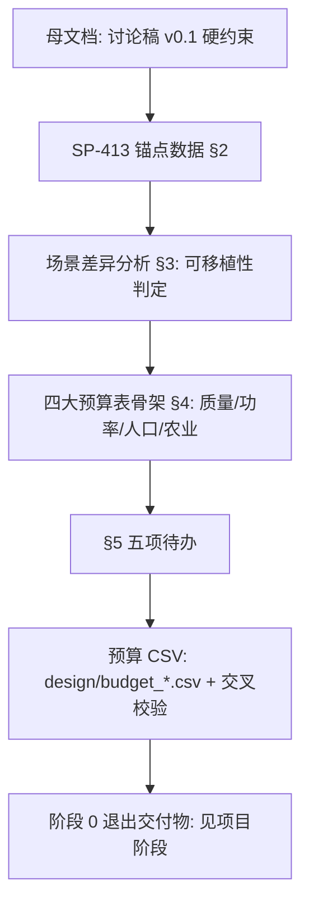

# ARK-01 任务文件（Phase 0）

<!-- openwiki: broken internal link [../../docs/ARK-01_Phase0_任务文件.md] file "../../docs/ARK-01_Phase0_任务文件.md" does not exist. Fix the href or restore the target, then delete this comment. -->
<!-- openwiki: broken internal link [../../docs/讨论稿-概念与待决问题.md] file "../../docs/讨论稿-概念与待决问题.md" does not exist. Fix the href or restore the target, then delete this comment. -->
源文档：[`docs/ARK-01_Phase0_任务文件.md`](../../docs/ARK-01_Phase0_任务文件.md)（**v0，2026-08-15 启动**）。状态：框架 + SP-413 锚点数据已固化；四大预算表待逐项核算。母文档为[概念讨论稿](../../docs/讨论稿-概念与待决问题.md)（讨论稿 v0.1），锚点文献 NASA SP-413《Space Settlements: A Design Study》（1975 Ames+Stanford 夏季研究；NTRS **19770014162**，全文 https://ntrs.nasa.gov/citations/19770014162——旧记 `19770076862` 已 404，见 [NASA 真实影像素材](../../docs/nasa_reference.md)）。

任务文件的定位：把[概念讨论笔记](../../docs/discussion_notes.md)的量级判断（见 [核心任务需求](./requirements.md)）落成**带来源、可逐项核算**的 Phase 0 交付物，是质量/功率/人口/农业四条核算线的总纲。

## Phase 0 核算流程

## 任务定义（§1）

设计一艘 **200 年航行至比邻星 b（4.24 ly）** 的世代飞船，Phase 0 交付：质量预算表、功率预算表、人口与农业面积核算（CSV + 本文档，每个数字带来源）。硬约束推导（算术必然）：

- 巡航 ~0.03c（9000 km/s）→ 聚变脉冲推进（Daedalus/Longshot 谱系）是唯一解
- 加速 ~15 年 + 巡航 ~170 年 + 减速 ~15 年
- 初始人口 ~1000–2000 → 抵达 1–2 万
- 栖息地：半径 250–500 m 环形/圆柱，双环反向旋转，≤2 rpm

## SP-413 锚点数据（§2，带来源页码）

### 栖息地方案对比（Table 4-1，报告 p.44）

单环面（入选方案）：主半径 Rmaj 830 m / Rmin 65 m、结构质量（1/2 atm）**150 kt**、被动屏蔽 **9.9 Mt**、大气 44 kt、投影面积 6.8×10⁵ m²、人口容量 **10,000**（67 m²/人）、最长视线 640 m。对照方案（圆柱+球端盖 / 哑铃 / 球体）结构或大气质量高 1–2 个数量级。选择理由：单环面在结构/大气质量上远优于圆柱与哑铃，在宜居性/可分段建造/零重力船坞对接/农业与生活区一体上优于球体。

### 面积分配（报告第 5 章，67 m²/人分解）

| 用途 | 投影面积 |
|---|---|
| 居住 + 社区生活 | 43 m²/人 |
| 机械/生命支持子系统 | 4 m²/人 |
| 农业 + 食品加工 | 20 m²/人（种植 44 m²/百人单元，详见附录 B） |
| **合计** | **67 m²/人** |

高密度变体：农业移出屏蔽区 + 47→35 m²/人（Table 4-2），结构/屏蔽质量大幅下降——**拥挤度换质量，世代飞船可参考此杠杆**。此锚点与 [人口与农业](./population_agriculture.md) 的 BIOS-3 线（11–17 m²/人）是两条并存口径：SP-413 给出面积预算上限，BIOS-3 给出实验实测下限。

### 辐射屏蔽论证（报告第 4 章——对世代飞船最重要的一节）

- 目标剂量：**0.5 rem/yr**；地球大气等效 = 10 t/m²；**4.5 t/m² 被动屏蔽即可达标**（考虑斜入射）
- **主动磁屏蔽被否决**：截止能量 0.5 GeV/nucleon 时屏蔽体自身产生二次粒子，剂量反升至 ~20 rem/yr；要压到 0.5 rem/yr 需 10–15 GeV/nucleon 截止，超导线圈间磁斥力使结构质量不可行（Fig. 4-6）
- 静电屏蔽需 100 亿伏，不可行；带电等离子体屏蔽「有前景但需大量研发」（附录 D）

### 社会学下限（报告第 5 章，Colin Clark 研究引用）

城市需 **10–20 万人**提供「足够范围的商业服务」；**20–50 万人**才能支撑广泛制造业；**<10 万人的定居点必须依赖地球持续补给**——世代飞船零补给，此论证直接威胁 1–2 万抵达人口的可制造性，**Phase 0 必须回答**（人口-工业联动核算的源头）。

## 场景差异分析（§3：SP-413 数字的可移植性）

SP-413 是**轨道定居点**（L5，阳光充足、地球可补给、建材来自月球）；ARK-01 是**深空世代飞船**。逐项判定（要点）：

| SP-413 数字 | 可移植？ | 差异与对策 |
|---|---|---|
| 67 m²/人 面积分配 | ✅ 直接可用 | 比例与光照无关；多层布局经验可用 |
| 1 rpm / 830 m 环面 | ⚠️ 缩放 | ARK-01 半径 250–500 m、≤2 rpm（同几何族），按 ω=√(g/r) 重算结构应力 |
| 结构质量 150 kt @10k 人 | ⚠️ 缩放 | 线性外推有风险，Phase 0 需按 300–500 m 重算 |
| **9.9 Mt 被动屏蔽** | ❌ **不可移植** | 定居点用月壤免费；飞船每克都要加速到 0.03c——**主动屏蔽在飞船上重新成为必答题**（SP-413 否决它的理由是结构质量；飞船的 Δv 惩罚更狠，但被动方案直接出局）。这是 Phase 0 头号权衡 |
| 太阳能供电 | ❌ 不可移植 | 深空无阳光 → 推进堆衰变热/裂变电站，功率预算必须重推 |
| 大气质量 44 kt | ✅ 可用 | 半气压（1/2 atm）策略对飞船同样成立 |
| 农业 20 m²/人 | ⚠️ 需验证 | SP-413 靠自然阳光；飞船全人工光照 → 能耗入功率预算，面积可能需垂直农业压缩 |
| Colin Clark 社会学下限 | ✅ 必须直面 | 零补给放大该问题 → 工业冗余策略（3D 打印/机加工）与人口规模联动核算 |

## 四大预算表骨架（§4，待逐项核算）

- **质量预算**：栖息地结构 10¹–10² kt（300–500 m 缩放）、屏蔽（主动 or 混合，🔲 立项）、水/推进剂贮箱兼屏蔽层、推进（Daedalus 参照 50 kt 级）、大气 ~10 kt 级
- **功率预算**：生命支持+居住 10–100 MW(e)、农业人工光照（待定，**可能主导**）、工业/制造、推进 GW–TW 仅燃烧段
- **人口核算**：最小可存活奠基种群 ~100–160 ✅ 已锚；出发 1,000–2,000 ✅ 已锚；抵达 10,000–20,000 ⚠️ 张力点（殖民需求 ≥500 vs Colin Clark 下限）；200 年人口曲线 ~6–7 代 🔲 建模（生育政策=飞船设计参数）
- **农业面积**：农业+食品加工 20 m²/人 ✅ 已锚；闭环率基准 BIOS-3 85% ✅ 已锚；人工光照能耗 🔲 立项

## Phase 0 待办（§5，下次会话入口）

1. **头号权衡：屏蔽方案立项**——被动 4.5 t/m² @0.03c 的 Δv 惩罚 vs 主动磁屏蔽（10–15 GeV/nucleon 截止）结构质量 vs 混合（被动水层 + 主动 + 风暴掩体）。输出：三方案质量对比表
2. 农业人工光照功率密度调研（LED 植物工厂文献）→ 功率预算最大单项
3. 栖息地结构按 300/400/500 m 三档重算结构质量（缩放 SP-413，标注外推风险）
4. 人口-工业联动：1–2 万人 × Colin Clark 下限 → 哪些工业品必须能自造（芯片除外，母文档已定容错策略）
5. 把预算表落成 CSV（`design/budget_*.csv`），脚本交叉校验（OpenMDAO 思路）

## 引用清单（§6）

NASA SP-413（1977，NTRS 19770014162，Table 4-1/4-2、第 4 章屏蔽节、第 5 章面积分配）；Project Daedalus（BIS 1978）与 Project Longshot（USNA 1988，GitHub: Arrow-air/project-longshot）；BIOS-3 闭环实验；ESA MELiSSA；Finney & Jones《Interstellar Migration and the Human Experience》(1985)；Atomic Rockets（projectrho.com）torchship/屏蔽/热管理论证库。

## 变更导航

- **何时看本页**：改阶段 0 交付物（质量/功率/人口/农业）、辐射屏蔽立项、预算 CSV 结构时。
- **主入口**：`docs/ARK-01_Phase0_任务文件.md`（§1-§6 全结构）。
- **关联入口**：母文档 `docs/讨论稿-概念与待决问题.md`；SP-413 全文 `https://ntrs.nasa.gov/citations/19770014162`；NASA 影像 `docs/nasa_参考影像/README.md`。
- **验证**：本页为设计文档，无代码测试；核算数字的交叉校验是 Phase 0 §5 待办的产物（预算 CSV + 脚本），尚未落成。

## 另见

- [核心任务需求](./requirements.md) - 任务参数与硬约束的同源总结
- [人口与农业](./population_agriculture.md) - 67 m²/人（SP-413）与 BIOS-3 两条口径
- [NASA 真实影像素材](../../docs/nasa_reference.md) - SP-413 影像与报告全文入口
- [概念讨论笔记](../../docs/discussion_notes.md) - 母文档讨论稿 v0.1 摘要
- [项目阶段](../../project/phases.md) - 阶段 0 交付物与退出标准
- [项目交接与待办](../../docs/handover.md) - 阶段 0 状态与待办跟踪
