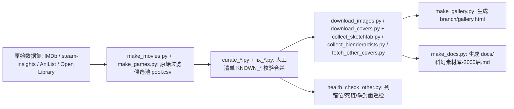

# 素材库整理脚本（branch/scripts/）

`branch/scripts/` 是科幻素材库的完整可复现流水线（Python 3.14，运行于 `branch/.venv/`）。每类素材从原始数据到画廊卡片依次经过：**原始过滤（make_*）→ 人工精选合并（curate_*）→ 封面缓存（download_*/collect_*）→ 输出（make_gallery.py / make_docs.py）**。

> 脚本间为纯数据文件依赖（CSV 传递），无运行时耦合。

## 脚本清单与职责

| 脚本 | 职责 | 关键设计 |
|---|---|---|
| `make_movies.py` | IMDb 数据集 → raw + 候选池（1980+ Sci-Fi 有票，约 9076 部） | 输出全量 `*_pool.csv` 供人工清单回退匹配 |
| `make_games.py` | steam-insights → raw（Sci-Fi 相关标签 2000+，1775 款） | — |
| `curate_movies.py` | 电影人工清单 + 核验合并 | `KNOWN_*` 字典硬编码精选；`None` 值=已剔除（重跑不复活）；指定年份条目禁用空年份兜底 |
| `curate_tv.py` | 剧集人工清单 + 核验合并 | 同电影，IMDb 英文标题匹配（规避「三体」norm 陷阱） |
| `curate_games.py` | 游戏人工清单 + 核验合并 | 含 `SPECIAL_APPID`/`NON_STEAM` 特判 |
| `curate_anime_comics.py` | 动漫/漫画（AniList + 维基） | AniList 403 限流：UA + 1s 间隔 + sleep 30s 重试 |
| `fix_anime_comics.py` | 定向修复（灵笼/铁血孤儿/维基词条） | — |
| `curate_novels.py` | 小说（Open Library 核验/评分/封面） | 免费无 key，ratings.json 拿评分 |
| `curate_art.py` | 原画/设定集（维基 REST 核验 + Goodreads 封面） | 无图词条 → manual + ArtStation 链接 |
| `collect_sketchfab.py` | 3D 社区（Sketchfab API 按♥排序 + 分级配额 + ✧4 白名单） | 缩略图取 width 最大项；下载用 curl（urllib 被 CDN 重置）；sips 压 500px |
| `collect_blenderartists.py` | 3D 社区（Blender 论坛 Discourse API，23 关键词 + 排除词表 + 分级修正） | 按 `_WxH` 解析尺寸选最大图；首帖无图遍历前 3 帖；`SHIP_OVERRIDE` 人工分级修正 |
| `download_images.py` | 电影/剧集/游戏封面缓存 | IMDb suggestion API（免 key）；间隔 2s + 重试 3 次 |
| `download_covers.py` | 动漫/漫画封面 | — |
| `fetch_other_covers.py` / `fetch_other_covers2.py` | 其他-AI 精选封面（wiki/url/goodreads/web 四种源） | 编辑 `PLAN` 字典后运行 |
| `fix_art_covers.py` | 原画封面定向修复 | 文件名与 source_id slug 不匹配修复 |
| `health_check_other.py` | 其他-AI 精选健康巡检（必跑） | 检查列错位/死链/缺封面 |
| `make_gallery.py` | → `branch/gallery.html` | 纯 HTML+CSS+JS 无依赖，file:// 可打开 |
| `make_docs.py` | → `docs/科幻素材库-2000后.md` 人读汇总 | 表格由数据自动生成 |
| `weread_links.py` | 微信读书链接查询（临时工具） | deepLink 格式 `book-detail?type=1&v={hash}` |

## 变更路由（改素材库时）

1. **新增/修条目**：编辑对应 `curate_*.py` 的 `KNOWN_*` 字典（或 `other/ai_curated.csv` 追加行）→ 运行该 curate 脚本。
2. **封面**：运行对应 download/collect 脚本。
3. **输出**：`make_gallery.py`（画廊）+ `make_docs.py`（汇总文档）；其他-AI 精选改完必须跑 `health_check_other.py`。
4. **规模/章节级变化**才需要刷新 wiki（`bash docs/openwiki_update.sh`），只加几条不必刷。

## 验证（最小命令）

- 其他-AI 精选健康巡检：`branch/.venv/bin/python branch/scripts/health_check_other.py`
- 画廊重建冒烟：`branch/.venv/bin/python branch/scripts/make_gallery.py`（无输出即成功，产物为 `branch/gallery.html`）

## 踩坑要点

- IMDb 类型标签不可靠（Avatar/BR2049/Ad Astra 未标 Sci-Fi）→ 人工清单从全量候选池匹配。
- 画廊图片路径重复前缀：cards 模板里 img 变量已含前缀，别再硬拼（曾致全部动漫/漫画封面 404）。
- 其他-AI CSV 的 note 里**不要用英文逗号**，用全角「，」，否则列错位导致画廊死链。

## 另见

- [数据结构](./data_structure.md) - CSV 字段与封面路径约定
- [交互式画廊](./gallery.md) - make_gallery.py 的产物
- [素材库概览](./library_overview.md) - 素材库整体说明
- [项目交接与待办](../docs/handover.md) - 完整流水线命令与踩坑记录
