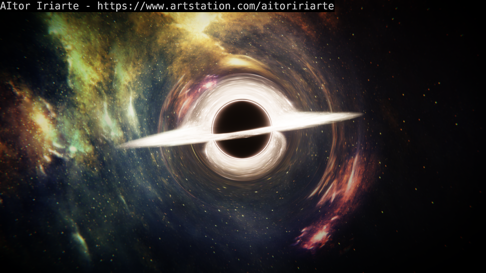

# Gargantua 黑洞物理模拟渲染 (Interstellar Black Hole)

本资产为复刻《星际穿越》（*Interstellar*）Gargantua 视觉效果的深空极端天体物理渲染工程。



---

## 场景结构与渲染技术

本场景并非简单的静态网格贴图，而是综合运用了多个光学与几何技巧：

1. **引力透镜 (`BH_03_Gravitational_Lens`)**：
   - 使用透明折射球体（Glass BSDF + Refraction），扭曲其后方吸积盘与深空背景的光线传播路径，在视网膜/镜头中形成物理引力透镜效应。
2. **炽热吸积盘 (`BH_02_Acrettion_Disk`)**：
   - 采用体积粒子系统 + 动态发射材质（Emission）+ 明暗遮罩（`Mask_v3.jpg`），呈现旋转气体的明暗与湍流细节。
3. **光子环 / 美丽环 (`BH_04_BeautyRing`)**：
   - 弯曲的光子层环形结构，还原事件视界边缘被强烈引力拉弯的光线轮廓。
4. **视界黑洞本体 (`BH_01_Singularity`)**：
   - 绝对吸收光线的致密中心。
5. **双场景合成 (Compositor)**：
   - 场景分为 `BlackHole`（黑洞本体与透镜层）与 `Universe`（深空星图背景 `DeepSpace_02_by_Krzyzowiec.jpg`）两组 Pass 分别计算，最后在 Blender 合成器（Compositor）中进行辉光与叠加合成。

---

## 硬件规格与渲染基准 (Benchmark)

| 环境 / 芯片 | 渲染设备 | 分辨率 / 采样 | 实测 / 预估耗时 | 状态 |
|---|---|---|---|---|
| **Linux (Intel i7-1160G7)** | CPU (Cycles) | 1920×1080 @ 100 spp | **2 分 32 秒 (152.1s)** | ✅ 已测基准 |
| **MacBook (Apple M2)** | **Metal GPU (10核)** | 1920×1080 @ 100 spp | **预计 ~25~35 秒** | 待 Mac 实测更新 |
| **MacBook Pro (M2 Pro)** | **Metal GPU (19核)** | 1920×1080 @ 100 spp | **预计 ~12~18 秒** | 待 Mac 实测更新 |

---

## 🚀 渲染执行指南

### 1. Mac 端推荐执行（开启 Metal 加速）
使用项目自带的一键加速脚本：
```bash
# 进入世代飞船项目根目录
./world/3d/render_mac.sh world/3d/gargantua/Gargantua.blend 100 100
```

### 2. Linux / 通用 CLI 执行
```bash
blender -b Gargantua.blend -E CYCLES -o //render_ -f 1
```

输出产物将保存在当前目录下：`render_0001.png`（或 Mac 下生成的 `render_mac_0001.png`）。
